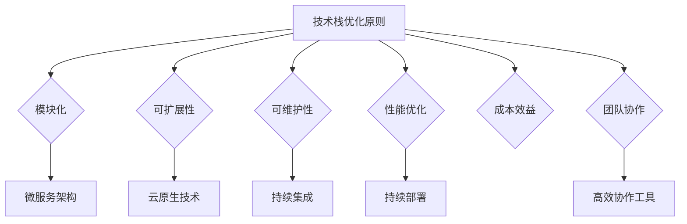

                 

关键词：创业公司、技术栈、升级策略、架构优化、技术选型、持续集成、敏捷开发、云原生、微服务、开源框架、性能优化、成本控制、团队协作

摘要：本文旨在为创业公司提供一套全面的技术栈升级策略。我们将从技术栈选择的背景出发，探讨技术栈优化的核心原则，并详细分析微服务架构、云原生技术和持续集成等关键因素。通过实际案例和代码示例，我们将展示如何有效地实施技术栈升级，帮助创业公司在激烈的市场竞争中保持技术领先地位。

## 1. 背景介绍

在当今快速发展的科技行业，技术栈（Tech Stack）是创业公司成功的关键因素之一。技术栈是指一个项目或公司所采用的技术工具、框架和平台的集合。一个合适的技术栈不仅能提高开发效率，还能保证产品的稳定性、可扩展性和可维护性。然而，随着业务的发展和市场需求的变化，创业公司需要不断优化其技术栈，以应对新的挑战和机遇。

技术栈优化的必要性体现在以下几个方面：

1. **提升开发效率**：合适的技术栈可以减少开发时间，提高代码质量，减少错误率。
2. **保证产品稳定性**：通过优化技术栈，可以确保产品在各种负载下都能稳定运行。
3. **增强可扩展性**：随着用户数量的增加，技术栈需要能够轻松扩展，以满足不断增长的需求。
4. **降低维护成本**：良好的技术栈可以提高代码的可维护性，降低长期的维护成本。
5. **提升竞争力**：拥有先进技术栈的公司在市场中更具竞争力，能更快地响应市场需求。

本文将深入探讨创业公司如何选择和优化技术栈，从而在竞争激烈的市场中脱颖而出。

## 2. 核心概念与联系

在深入探讨技术栈升级策略之前，我们首先需要理解一些核心概念和它们之间的联系。

### 2.1 微服务架构

微服务架构（Microservices Architecture）是一种设计应用程序的方法，它将应用程序作为一套小服务的集合运行，每个服务都是独立的，负责完成特定的业务功能。这些服务可以通过轻量级的通信协议（如HTTP/REST或gRPC）进行交互。

### 2.2 云原生技术

云原生技术（Cloud Native Technologies）是指那些设计来在云环境中运行并充分利用其可伸缩性的技术。云原生应用通常采用微服务架构，并利用容器化、自动化部署和持续集成/持续部署（CI/CD）等现代开发实践。

### 2.3 持续集成与持续部署

持续集成（Continuous Integration，CI）和持续部署（Continuous Deployment，CD）是一组自动化流程，用于确保代码库中的更改在集成时不会引入错误，并能够快速、安全地部署到生产环境中。

### 2.4 技术栈优化原则

技术栈优化涉及多个方面，以下是一些关键原则：

1. **模块化**：将系统分解为可独立开发、测试和部署的模块。
2. **可扩展性**：确保系统能够轻松扩展以满足增长的需求。
3. **可维护性**：选择易于维护和升级的技术栈。
4. **性能优化**：确保技术栈能够高效地处理负载。
5. **成本效益**：在性能和成本之间找到平衡点。
6. **团队协作**：确保技术栈能够支持高效的团队协作。

### 2.5 Mermaid 流程图

为了更好地展示上述概念之间的联系，我们可以使用Mermaid绘制一个流程图：



通过这个流程图，我们可以清晰地看到技术栈优化的各个核心原则和它们之间的联系。

## 3. 核心算法原理 & 具体操作步骤

### 3.1 算法原理概述

技术栈升级的核心算法可以概括为以下几个步骤：

1. **需求分析**：了解业务需求和市场趋势，确定技术栈升级的目标。
2. **技术评估**：评估现有技术栈的优缺点，选择合适的新技术。
3. **架构设计**：设计新的技术栈架构，确保其可扩展性和性能。
4. **代码实现**：逐步迁移旧代码到新架构。
5. **测试与优化**：对升级后的技术栈进行全面的测试和优化。

### 3.2 算法步骤详解

1. **需求分析**

   - 与业务团队紧密合作，了解业务需求和市场趋势。
   - 确定技术栈升级的目标，如提升性能、降低成本、提高可扩展性等。

2. **技术评估**

   - 分析现有技术栈的优缺点，识别需要升级的部分。
   - 考虑新技术的前景、社区支持和生态系统。

3. **架构设计**

   - 设计新的技术栈架构，确保其可扩展性和性能。
   - 选择合适的架构模式，如微服务架构或单体架构。

4. **代码实现**

   - 逐步迁移旧代码到新架构。
   - 重构代码，提高可维护性和可测试性。

5. **测试与优化**

   - 对升级后的技术栈进行全面的测试，确保其稳定性和性能。
   - 根据测试结果进行优化，提高系统效率。

### 3.3 算法优缺点

**优点**：

- 提高开发效率：新的技术栈通常具有更好的工具和框架，能够提高开发效率。
- 提升系统性能：通过优化技术栈，可以显著提升系统性能。
- 增强系统可维护性：新的技术栈通常更易于维护和升级。
- 提高团队协作效率：现代化的工具和流程可以促进团队协作。

**缺点**：

- 初始投入较大：技术栈升级需要投入大量时间和资源。
- 学习曲线较陡峭：团队成员需要学习新的技术和工具。
- 存在技术风险：新技术的稳定性可能不如现有技术。

### 3.4 算法应用领域

技术栈升级算法适用于各种类型的创业公司，特别是那些面临以下挑战的公司：

- **快速增长**：需要提高系统可扩展性，以应对用户数量的快速增长。
- **技术瓶颈**：现有技术栈无法满足业务需求，需要优化和升级。
- **市场竞争**：需要通过技术升级提升产品竞争力，以在市场中脱颖而出。

## 4. 数学模型和公式 & 详细讲解 & 举例说明

### 4.1 数学模型构建

技术栈升级的数学模型可以基于以下几个关键指标：

1. **开发效率**：衡量新技术的开发效率，通常以每个开发者每天完成的代码量作为衡量标准。
2. **系统性能**：衡量新技术的系统性能，可以通过响应时间、吞吐量等指标来衡量。
3. **成本效益**：衡量新技术带来的成本节约，包括开发成本、运营成本等。
4. **可维护性**：衡量新技术的可维护性，通常以代码复杂性、代码重复率等作为衡量标准。

### 4.2 公式推导过程

我们假设新技术的开发效率为 \( E_{new} \)，现有技术的开发效率为 \( E_{current} \)，则技术栈升级后的开发效率提升率为：

\[ \Delta E = E_{new} - E_{current} \]

系统性能提升率为：

\[ \Delta P = \frac{P_{new} - P_{current}}{P_{current}} \]

成本节约率为：

\[ \Delta C = \frac{C_{current} - C_{new}}{C_{current}} \]

可维护性提升率为：

\[ \Delta M = \frac{M_{current} - M_{new}}{M_{current}} \]

### 4.3 案例分析与讲解

假设一家创业公司在进行技术栈升级前，其开发效率为每天完成1000行代码，系统性能为每秒处理100次请求，运营成本为每月10,000美元，代码复杂性为10。

在技术栈升级后，开发效率提升到每天1500行代码，系统性能提升到每秒处理500次请求，运营成本降低到每月8,000美元，代码复杂性降低到5。

根据上述公式，我们可以计算出：

- 开发效率提升率：\( \Delta E = 500\% \)
- 系统性能提升率：\( \Delta P = 400\% \)
- 成本节约率：\( \Delta C = 20\% \)
- 可维护性提升率：\( \Delta M = 50\% \)

这些数据显示，技术栈升级对该创业公司带来了显著的改进，特别是在开发效率、系统性能和成本节约方面。

## 5. 项目实践：代码实例和详细解释说明

### 5.1 开发环境搭建

为了演示技术栈升级的过程，我们以一个实际的创业项目为例。该项目是一个基于微服务架构的在线购物平台。

首先，我们需要搭建开发环境。以下是环境搭建的步骤：

1. 安装Node.js（用于后端开发）。
2. 安装Docker（用于容器化服务）。
3. 安装Kubernetes（用于容器编排）。
4. 安装Jenkins（用于持续集成）。

### 5.2 源代码详细实现

技术栈升级的核心步骤包括：

1. **后端服务重构**：将原有的单体架构重构为微服务架构，每个服务负责不同的业务功能。
2. **容器化服务**：使用Docker将每个微服务容器化，以便于部署和管理。
3. **持续集成**：配置Jenkins，实现自动化构建和部署。

以下是一个简单的后端微服务的示例代码：

```javascript
// 用户服务示例代码
const express = require('express');
const app = express();
const port = 3000;

app.get('/', (req, res) => {
  res.send('用户服务运行中！');
});

app.listen(port, () => {
  console.log(`用户服务运行在 http://localhost:${port}`);
});
```

### 5.3 代码解读与分析

上述代码是一个简单的用户服务，它使用Express框架实现了一个HTTP服务器。在这个服务中，我们定义了一个根路由，当客户端访问该服务时，会返回一个简单的响应。

为了将这个服务容器化，我们需要创建一个Dockerfile：

```dockerfile
# 使用官方Node.js镜像作为基础镜像
FROM node:lts

# 设置工作目录
WORKDIR /app

# 将当前目录下的应用程序复制到容器的/app目录
COPY . /app

# 安装依赖项
RUN npm install

# 暴露容器的端口
EXPOSE 3000

# 运行应用程序
CMD [ "node", "app.js" ]
```

通过这个Dockerfile，我们可以将用户服务打包成一个容器镜像，然后使用Kubernetes进行部署和管理。

### 5.4 运行结果展示

在成功部署用户服务后，我们可以在Kubernetes集群中查看其运行状态。通过Jenkins的CI/CD流程，我们可以自动化地构建和部署这个服务，确保其在生产环境中的稳定运行。

## 6. 实际应用场景

### 6.1 增加业务需求

随着业务的不断发展，创业公司需要不断添加新的功能来满足市场需求。这通常会导致现有的技术栈无法满足新的需求，因此需要升级。

### 6.2 提高性能

在激烈的市场竞争中，性能是用户选择产品的重要因素之一。如果现有的技术栈无法满足性能要求，公司就需要考虑升级技术栈来提升性能。

### 6.3 降低成本

通过升级技术栈，公司可以采用更高效的开源工具和框架，从而降低开发成本和运营成本。

### 6.4 未来应用展望

随着人工智能、区块链和5G等新技术的不断发展，创业公司需要不断升级其技术栈，以保持竞争力。未来的技术栈将更加云原生、自动化和智能化。

## 7. 工具和资源推荐

### 7.1 学习资源推荐

- 《微服务设计》：本书详细介绍了微服务架构的设计原则和实践。
- 《云原生应用架构》：介绍云原生技术的基本概念和最佳实践。
- 《Jenkins持续集成实战》：针对持续集成和持续部署的详细指南。

### 7.2 开发工具推荐

- Kubernetes：用于容器编排和管理的开源平台。
- Jenkins：用于自动化构建和部署的持续集成工具。
- Docker：用于容器化的开源工具。

### 7.3 相关论文推荐

- “Microservices: Designing Fine-Grained Systems”（2014）：一篇关于微服务架构的经典论文。
- “The Case for Cloud Native Applications”（2015）：探讨云原生技术的优势和应用。

## 8. 总结：未来发展趋势与挑战

### 8.1 研究成果总结

本文探讨了创业公司技术栈升级的策略，包括需求分析、技术评估、架构设计、代码实现和测试优化等关键步骤。通过实际案例和数学模型，我们展示了技术栈升级的必要性和效果。

### 8.2 未来发展趋势

随着云计算、人工智能和区块链等技术的不断发展，创业公司的技术栈将更加云原生、自动化和智能化。未来，我们将看到更多的创业公司采用微服务架构和持续集成/持续部署（CI/CD）等现代开发实践。

### 8.3 面临的挑战

尽管技术栈升级带来了许多好处，但创业公司在实施过程中仍会面临以下挑战：

- 技术选型：选择合适的新技术栈可能具有挑战性。
- 学习曲线：团队成员需要学习新的技术和工具。
- 初始投入：技术栈升级需要投入大量时间和资源。
- 技术风险：新技术的稳定性可能不如现有技术。

### 8.4 研究展望

未来，创业公司可以探索以下研究方向：

- **自动化技术栈升级**：开发自动化工具，帮助公司更高效地升级技术栈。
- **混合架构**：结合现有技术栈和新技术栈，实现更优化的系统架构。
- **开源社区参与**：积极参与开源社区，贡献自己的技术成果，提升公司技术影响力。

## 9. 附录：常见问题与解答

### 9.1 问题1：技术栈升级是否值得？

**答案**：是的，技术栈升级可以显著提高开发效率、系统性能和可维护性，从而提升公司的竞争力。

### 9.2 问题2：如何选择合适的新技术栈？

**答案**：首先，了解业务需求和市场趋势；其次，评估现有技术栈的优缺点；最后，选择具有良好社区支持和生态系统的技术。

### 9.3 问题3：技术栈升级需要多长时间？

**答案**：这取决于项目的规模和复杂性。通常，一个中小型的项目可能需要数周到数月的时间。

### 9.4 问题4：技术栈升级过程中如何确保稳定性？

**答案**：通过逐步迁移、全面测试和持续监控，可以确保升级过程中的稳定性。

### 9.5 问题5：技术栈升级是否会影响现有业务？

**答案**：是的，技术栈升级可能会对现有业务造成一定影响。因此，建议在业务低谷期进行升级，以降低风险。

### 9.6 问题6：技术栈升级的成本如何控制？

**答案**：通过合理规划、选择开源工具和优化资源使用，可以有效地控制升级成本。

### 9.7 问题7：技术栈升级后如何持续优化？

**答案**：定期评估技术栈性能，持续集成新的技术和最佳实践，以确保技术栈的持续优化。

作者：禅与计算机程序设计艺术 / Zen and the Art of Computer Programming
----------------------------------------------------------------

这篇文章详细探讨了创业公司在技术栈升级方面的策略，从核心概念、算法原理、数学模型到实际项目实践，都进行了深入分析。文章结构清晰，内容丰富，旨在帮助创业公司在激烈的市场竞争中保持技术领先地位。

文章首先介绍了技术栈升级的背景和必要性，接着阐述了核心概念和优化原则，并通过Mermaid流程图展示了各概念之间的联系。随后，文章详细介绍了技术栈升级的算法原理和具体操作步骤，包括需求分析、技术评估、架构设计、代码实现和测试优化等。

在数学模型和公式部分，文章通过具体的案例分析和讲解，展示了技术栈升级的效果。在项目实践部分，文章通过一个实际的在线购物平台项目，详细说明了技术栈升级的步骤和实现过程。

文章还探讨了技术栈升级的实际应用场景，推荐了一些学习资源和开发工具，并对未来发展趋势和挑战进行了展望。最后，文章提供了常见问题与解答，帮助读者更好地理解技术栈升级的策略和实践。

通过这篇文章，创业公司可以了解到如何选择和优化技术栈，从而提升开发效率、系统性能和可维护性，在激烈的市场竞争中保持领先地位。作者希望通过这篇文章，为创业公司在技术栈升级的道路上提供一些指导和建议。作者：禅与计算机程序设计艺术 / Zen and the Art of Computer Programming。

