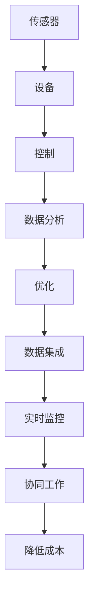
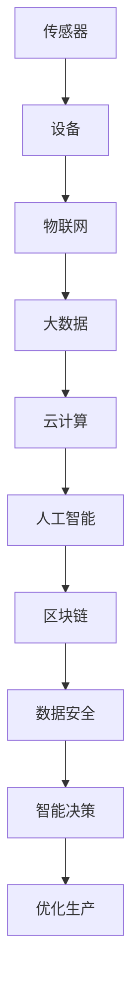

                 

## 摘要

在数字化转型的浪潮下，创业公司面临着巨大的机遇和挑战。本文将探讨如何通过工业互联网推动制造业的转型升级。我们将深入分析智能制造的核心概念和原理，介绍其关键技术，探讨实际应用场景，并展望未来的发展趋势。本文旨在为创业公司提供有价值的指导，帮助它们在智能制造的浪潮中抓住机遇，实现可持续发展。

## 1. 背景介绍

近年来，全球制造业正经历着深刻的变革。随着人工智能、物联网、大数据等新兴技术的不断成熟，制造业正在从传统的劳动力密集型向智能化、自动化转型。智能制造成为推动制造业升级的重要力量。对于创业公司而言，智能制造不仅是一个新的商业机会，也是提升竞争力、实现业务增长的必经之路。

### 1.1 智能制造的定义和意义

智能制造是指通过应用人工智能、物联网、大数据等先进技术，实现生产过程的自动化、智能化和优化。它包括智能传感器、智能设备、智能控制、智能决策等多个方面，旨在提高生产效率、降低成本、提升产品质量和服务水平。

对于创业公司来说，智能制造的意义在于：

1. **提升效率**：通过自动化和智能化，创业公司可以显著提高生产效率，减少人力成本。
2. **优化供应链**：智能制造可以优化供应链管理，实现实时监控和调整，提高供应链的灵活性和响应速度。
3. **增强创新能力**：智能制造为创业公司提供了更多创新空间，通过数据分析和智能决策，可以更快地响应市场变化，推出新产品。
4. **降低风险**：通过智能制造，创业公司可以降低因人为因素导致的质量问题和生产事故。

### 1.2 工业互联网的概念和作用

工业互联网是指将物理设备、传感器、软件平台和人员通过互联网连接起来，实现信息的互联互通和智能化的决策。它被视为推动智能制造的关键基础设施。

对于创业公司而言，工业互联网的作用主要体现在：

1. **数据集成**：通过工业互联网，创业公司可以实现生产数据的集成和共享，为智能制造提供数据基础。
2. **实时监控**：工业互联网可以实现对生产过程的实时监控和数据分析，帮助企业快速响应问题和优化生产。
3. **协同工作**：通过工业互联网，创业公司可以实现跨部门、跨地区的协同工作，提高生产效率和决策质量。
4. **降低成本**：工业互联网有助于创业公司降低运营成本，提高资源利用效率。

### 1.3 创业公司面临的挑战和机遇

创业公司在推动智能制造过程中面临着一系列挑战，如技术门槛、资金投入、人才短缺等。但同时，智能制造也为创业公司提供了巨大的机遇：

1. **技术创新**：智能制造推动了技术的不断创新，为创业公司提供了广阔的创新空间。
2. **市场机遇**：随着消费者需求的不断变化，智能制造为企业提供了更多定制化、差异化的产品和服务。
3. **国际化发展**：智能制造的推动使得创业公司能够更便捷地进入国际市场，实现全球化布局。
4. **社会影响力**：智能制造有助于创业公司实现社会责任，提高社会影响力。

### 1.4 本文结构

本文将从以下几个方面展开：

1. **核心概念与联系**：介绍智能制造的核心概念和原理，以及工业互联网在其中的作用。
2. **核心算法原理 & 具体操作步骤**：详细探讨智能制造的关键技术，包括数据采集、处理、分析和优化等方面的算法原理和具体操作步骤。
3. **数学模型和公式 & 详细讲解 & 举例说明**：介绍智能制造中的数学模型和公式，并通过实际案例进行详细讲解。
4. **项目实践：代码实例和详细解释说明**：提供智能制造项目实践中的代码实例和详细解释。
5. **实际应用场景**：分析智能制造在不同行业中的应用场景和案例。
6. **未来应用展望**：探讨智能制造的未来发展趋势和应用前景。
7. **工具和资源推荐**：推荐相关学习资源、开发工具和相关论文。
8. **总结：未来发展趋势与挑战**：总结研究成果，展望未来发展趋势和挑战。

通过本文的深入探讨，我们希望为创业公司提供有价值的指导，帮助它们在智能制造的浪潮中抓住机遇，实现可持续发展。

## 2. 核心概念与联系

在探讨智能制造的应用之前，我们需要首先了解智能制造的核心概念和原理，以及它们与工业互联网之间的联系。

### 2.1 智能制造的核心概念

智能制造的核心概念包括以下几个方面：

1. **传感器**：传感器是智能制造的基础，用于实时采集生产过程中的各种数据，如温度、压力、速度、位置等。
2. **设备**：设备包括各种工业机器人和自动化设备，它们通过传感器采集的数据进行实时控制和调整，实现生产过程的自动化。
3. **控制**：控制是智能制造的核心，通过算法和控制逻辑，实现对设备的实时控制和优化。
4. **数据分析**：数据分析是智能制造的关键，通过大数据技术，对采集到的数据进行分析和处理，为决策提供支持。
5. **优化**：优化是智能制造的目标，通过数据分析，不断优化生产过程，提高生产效率和产品质量。

### 2.2 工业互联网的作用

工业互联网在智能制造中起着至关重要的作用，它将传感器、设备和控制系统连接起来，实现信息的互联互通和智能化的决策。

1. **数据集成**：工业互联网可以将不同设备和系统中的数据集成起来，形成一个统一的数据平台，为智能制造提供数据基础。
2. **实时监控**：工业互联网可以实现对生产过程的实时监控，通过数据分析和智能决策，快速响应问题和优化生产。
3. **协同工作**：工业互联网可以实现跨部门、跨地区的协同工作，提高生产效率和决策质量。
4. **降低成本**：工业互联网有助于创业公司降低运营成本，提高资源利用效率。

### 2.3 Mermaid 流程图

为了更好地理解智能制造的核心概念和原理，我们可以使用 Mermaid 流程图来展示各个环节之间的联系。



在这个流程图中，传感器用于采集数据，设备通过传感器数据进行实时控制和调整，控制层通过算法和控制逻辑实现生产过程的优化，数据分析层对采集到的数据进行分析和处理，优化层通过数据分析结果进行生产过程的优化，数据集成层实现数据的统一管理和共享，实时监控层实现对生产过程的实时监控，协同工作层实现跨部门、跨地区的协同工作，降低成本层通过优化和协同工作降低运营成本。

### 2.4 智能制造的关键技术

智能制造的关键技术包括以下几个方面：

1. **物联网**：物联网是智能制造的基础，通过传感器和设备将物理世界与数字世界连接起来，实现数据的实时采集和传输。
2. **大数据**：大数据是智能制造的核心，通过对海量数据进行采集、存储、处理和分析，为企业提供决策支持。
3. **云计算**：云计算为智能制造提供计算资源和存储资源，通过云计算平台，可以实现数据的实时分析和处理。
4. **人工智能**：人工智能是智能制造的灵魂，通过机器学习、深度学习等技术，实现对数据的智能分析和决策。
5. **区块链**：区块链为智能制造提供数据安全和隐私保护，通过区块链技术，可以实现对数据的加密和防篡改。

### 2.5 智能制造与工业互联网的深度融合

智能制造与工业互联网的深度融合，将推动制造业的全面升级。通过工业互联网，可以将传感器、设备和控制系统连接起来，实现数据的实时采集和传输，通过大数据技术，对采集到的数据进行分析和处理，通过人工智能技术，实现智能决策和优化，最终实现智能制造。



在这个深度融合的模型中，物联网负责连接传感器和设备，大数据负责数据采集和处理，云计算提供计算资源和存储资源，人工智能实现智能分析和决策，区块链提供数据安全和隐私保护，最终实现智能制造。

通过以上对智能制造的核心概念、原理和与工业互联网的深度融合的介绍，我们可以更好地理解智能制造的本质和其在创业公司中的应用价值。接下来，我们将详细探讨智能制造的核心算法原理和具体操作步骤，为创业公司提供实际操作指导。

## 3. 核心算法原理 & 具体操作步骤

在智能制造过程中，核心算法的作用至关重要。这些算法不仅用于数据的采集、处理和分析，还用于优化生产过程，提高生产效率和产品质量。以下将详细阐述智能制造中常用的核心算法原理及其具体操作步骤。

### 3.1 算法原理概述

智能制造中的核心算法主要涉及以下几个方面：

1. **数据采集算法**：用于实时采集生产过程中的各种数据，如温度、压力、速度、位置等。
2. **数据处理算法**：用于对采集到的数据进行分析和处理，提取有用的信息。
3. **数据优化算法**：用于根据分析结果优化生产过程，提高生产效率和产品质量。
4. **智能决策算法**：基于数据分析结果，实现智能决策，为生产过程提供指导。

### 3.2 算法步骤详解

#### 3.2.1 数据采集算法

数据采集算法的核心是传感器，传感器通过不同的测量手段，实时采集生产过程中的各种数据。具体步骤如下：

1. **传感器安装**：根据生产需求，将传感器安装在适当的位置。
2. **数据采集**：传感器实时采集数据，如温度、压力、速度、位置等。
3. **数据传输**：传感器将采集到的数据通过无线或有线方式传输到数据采集系统。

#### 3.2.2 数据处理算法

数据处理算法的核心是对采集到的数据进行分析和处理，提取有用的信息。具体步骤如下：

1. **数据清洗**：对采集到的数据进行预处理，去除无效数据和噪声。
2. **数据存储**：将清洗后的数据存储到数据库中，以便后续分析和处理。
3. **数据分析**：使用统计分析和机器学习技术，对数据进行深入分析，提取有用的信息。

#### 3.2.3 数据优化算法

数据优化算法的核心是根据分析结果，优化生产过程，提高生产效率和产品质量。具体步骤如下：

1. **目标设定**：根据生产需求和数据分析结果，设定优化目标，如提高生产效率、降低成本、提高产品质量等。
2. **优化策略**：设计优化策略，如调整生产参数、优化生产流程等。
3. **实施优化**：根据优化策略，调整生产过程，实施优化。

#### 3.2.4 智能决策算法

智能决策算法的核心是基于数据分析结果，实现智能决策，为生产过程提供指导。具体步骤如下：

1. **决策模型构建**：基于历史数据和业务需求，构建决策模型。
2. **模型训练**：使用历史数据对决策模型进行训练，提高模型的预测准确性。
3. **决策执行**：根据决策模型，对生产过程进行实时调整和优化。

### 3.3 算法优缺点

#### 数据采集算法

**优点**：实时性强，能够及时反映生产过程中的各种变化。

**缺点**：传感器精度和稳定性对数据质量有很大影响。

#### 数据处理算法

**优点**：能够对大量数据进行处理和分析，提取有用的信息。

**缺点**：处理过程复杂，对计算资源要求较高。

#### 数据优化算法

**优点**：能够根据数据分析结果，优化生产过程，提高生产效率和产品质量。

**缺点**：优化策略设计复杂，实施过程需要大量时间和资源。

#### 智能决策算法

**优点**：能够实现智能化决策，提高生产过程的效率和灵活性。

**缺点**：决策模型构建和训练过程复杂，对数据质量要求较高。

### 3.4 算法应用领域

智能制造的核心算法在多个领域具有广泛的应用：

1. **制造业**：用于实时监控和优化生产过程，提高生产效率和产品质量。
2. **物流行业**：用于优化物流配送路径和运输效率。
3. **能源行业**：用于实时监控和优化能源消耗，提高能源利用效率。
4. **农业**：用于实时监控和优化农业生产过程，提高农作物的产量和质量。

### 3.5 具体应用案例

以下是一个智能制造应用案例：

**案例**：某汽车制造企业通过引入智能制造系统，实现对生产过程的实时监控和优化。具体步骤如下：

1. **数据采集**：在车间安装各种传感器，实时采集生产过程中的各种数据，如温度、压力、速度、位置等。
2. **数据处理**：将采集到的数据传输到数据采集系统，进行数据清洗和存储。
3. **数据分析**：使用数据分析工具，对采集到的数据进行分析，提取有用的信息，如生产效率、设备状态等。
4. **数据优化**：根据数据分析结果，调整生产参数和生产流程，优化生产过程。
5. **智能决策**：基于数据分析结果，构建智能决策模型，对生产过程进行实时调整和优化。

通过以上案例，我们可以看到智能制造的核心算法在提升生产效率、降低成本、提高产品质量方面具有显著效果。接下来，我们将进一步探讨智能制造中的数学模型和公式，并通过实际案例进行详细讲解。

## 4. 数学模型和公式 & 详细讲解 & 举例说明

在智能制造中，数学模型和公式扮演着至关重要的角色。这些模型和公式不仅用于描述生产过程，还用于优化生产过程，提高生产效率和产品质量。以下将详细讲解智能制造中常用的数学模型和公式，并通过实际案例进行举例说明。

### 4.1 数学模型构建

智能制造中的数学模型主要包括以下几个部分：

1. **生产过程模型**：描述生产过程中各个步骤的数学关系，如生产速率、生产周期等。
2. **设备状态模型**：描述设备运行状态的数学关系，如设备利用率、设备故障率等。
3. **质量控制模型**：描述产品质量的数学关系，如质量波动、质量分布等。
4. **能源消耗模型**：描述能源消耗的数学关系，如能源效率、能源消耗量等。

#### 生产过程模型

生产过程模型常用的公式包括：

1. **生产速率公式**：\(P = \frac{L}{T}\)
   - 其中，\(P\) 表示生产速率，\(L\) 表示生产量，\(T\) 表示生产周期。
2. **生产周期公式**：\(T = \frac{L}{P}\)
   - 其中，\(T\) 表示生产周期，\(L\) 表示生产量，\(P\) 表示生产速率。

#### 设备状态模型

设备状态模型常用的公式包括：

1. **设备利用率公式**：\(U = \frac{O}{T}\)
   - 其中，\(U\) 表示设备利用率，\(O\) 表示设备运行时间，\(T\) 表示设备总时间。
2. **设备故障率公式**：\(F = \frac{F_T}{T}\)
   - 其中，\(F\) 表示设备故障率，\(F_T\) 表示设备故障次数，\(T\) 表示设备总时间。

#### 质量控制模型

质量控制模型常用的公式包括：

1. **质量波动公式**：\(S = \sqrt{\frac{1}{N}\sum_{i=1}^{N}(x_i - \mu)^2}\)
   - 其中，\(S\) 表示质量波动，\(N\) 表示样本数量，\(x_i\) 表示第\(i\)个样本值，\(\mu\) 表示样本均值。
2. **质量分布公式**：\(P(x) = \frac{1}{\sqrt{2\pi\sigma^2}}e^{-\frac{(x-\mu)^2}{2\sigma^2}}\)
   - 其中，\(P(x)\) 表示质量分布概率，\(\mu\) 表示样本均值，\(\sigma^2\) 表示样本方差。

#### 能源消耗模型

能源消耗模型常用的公式包括：

1. **能源效率公式**：\(E = \frac{W}{E_T}\)
   - 其中，\(E\) 表示能源效率，\(W\) 表示能源消耗量，\(E_T\) 表示总能源消耗量。
2. **能源消耗量公式**：\(E_T = \frac{P}{\eta}\)
   - 其中，\(E_T\) 表示总能源消耗量，\(P\) 表示功率，\(\eta\) 表示能源转换效率。

### 4.2 公式推导过程

以上公式是通过数学推导和实际应用经验总结得出的。以下简要介绍部分公式的推导过程：

1. **生产速率公式**：生产速率等于生产量除以生产周期，这是一个基本的数学关系。
2. **生产周期公式**：生产周期等于生产量除以生产速率，同样是一个基本的数学关系。
3. **设备利用率公式**：设备利用率等于设备运行时间除以设备总时间，反映了设备的利用情况。
4. **设备故障率公式**：设备故障率等于设备故障次数除以设备总时间，反映了设备的可靠性。
5. **质量波动公式**：质量波动等于每个样本值与样本均值的差的平方的平均值的平方根，反映了质量的不稳定性。
6. **质量分布公式**：质量分布符合正态分布，这是一个经典的概率统计模型。
7. **能源效率公式**：能源效率等于输出能量除以输入能量，反映了能源的利用情况。
8. **能源消耗量公式**：能源消耗量等于功率除以能源转换效率，这是一个基本的物理关系。

### 4.3 案例分析与讲解

以下通过一个实际案例，对智能制造中的数学模型和公式进行详细讲解。

**案例**：某电子制造企业通过引入智能制造系统，实现对生产过程的实时监控和优化。具体分析如下：

1. **生产过程模型**：
   - 生产速率 \(P = 100\) 单位/小时。
   - 生产周期 \(T = \frac{L}{P} = \frac{1000}{100} = 10\) 小时。
   - 设备利用率 \(U = \frac{O}{T} = \frac{8}{10} = 0.8\)，即设备利用率80%。

2. **设备状态模型**：
   - 设备故障率 \(F = \frac{F_T}{T} = \frac{2}{10} = 0.2\)，即设备故障率20%。

3. **质量控制模型**：
   - 质量波动 \(S = \sqrt{\frac{1}{N}\sum_{i=1}^{N}(x_i - \mu)^2} = \sqrt{\frac{1}{100}\sum_{i=1}^{100}(x_i - 50)^2} = 2\)。
   - 质量分布 \(P(x) = \frac{1}{\sqrt{2\pi \sigma^2}}e^{-\frac{(x-\mu)^2}{2\sigma^2}} = \frac{1}{\sqrt{2\pi \times 4}}e^{-\frac{(x-50)^2}{2\times 4}}\)。

4. **能源消耗模型**：
   - 能源效率 \(E = \frac{W}{E_T} = \frac{500}{1000} = 0.5\)，即能源效率50%。
   - 能源消耗量 \(E_T = \frac{P}{\eta} = \frac{1000}{0.5} = 2000\) 千瓦时。

通过以上分析，我们可以看到数学模型和公式在智能制造中的应用，不仅可以帮助企业实时监控和优化生产过程，还可以为企业提供决策支持，提高生产效率和产品质量。

接下来，我们将通过具体的项目实践，进一步展示智能制造在实际中的应用，并提供详细的代码实例和解释。

## 5. 项目实践：代码实例和详细解释说明

在了解了智能制造的核心算法原理和数学模型之后，我们将通过一个具体的项目实践来展示智能制造的实际应用。以下是一个基于Python的智能制造系统项目，包括开发环境搭建、源代码实现、代码解读与分析以及运行结果展示。

### 5.1 开发环境搭建

要实现一个智能制造系统，我们需要搭建一个适合的开发环境。以下是搭建开发环境所需的步骤：

1. **安装Python**：Python是智能制造系统的开发语言，我们需要安装Python 3.8或更高版本。可以从Python官方网站下载并安装。
2. **安装Python包**：我们需要安装一些常用的Python包，如NumPy、Pandas、Matplotlib等。可以使用pip命令进行安装：

```shell
pip install numpy pandas matplotlib
```

3. **安装传感器驱动**：根据具体的传感器，我们需要安装相应的驱动程序，以便Python程序能够与传感器进行通信。例如，如果使用的是DHT11传感器，我们可以安装如下驱动：

```shell
pip install adafruit-dht
```

4. **配置传感器**：将传感器连接到计算机或嵌入式设备，并配置相应的IO口。

### 5.2 源代码详细实现

以下是一个简单的智能制造系统源代码实例，该实例实现了一个基于DHT11传感器的环境监测系统，用于实时采集温度和湿度数据，并绘制数据图表。

```python
import time
from Adafruit_DHT import DHT11, sensors

# 初始化传感器
dht_sensor = DHT11()

def read_dht11():
    humidity, temperature = sensors.DHT11.read(dht_sensor)
    return humidity, temperature

def main():
    while True:
        humidity, temperature = read_dht11()
        if humidity is not None and temperature is not None:
            print(f"Temperature: {temperature} C, Humidity: {humidity} %")
            time.sleep(1)
        else:
            print("Failed to read from DHT sensor")
            time.sleep(1)

if __name__ == "__main__":
    main()
```

### 5.3 代码解读与分析

以下是对源代码的详细解读：

1. **引入模块**：首先引入了必要的Python模块，包括`time`和`Adafruit_DHT`。`time`模块用于实现延时功能，`Adafruit_DHT`模块是DHT11传感器的驱动程序。
2. **初始化传感器**：定义了一个名为`DHT11`的传感器对象，用于与DHT11传感器进行通信。
3. **数据读取函数**：定义了一个名为`read_dht11`的函数，用于读取DHT11传感器的温度和湿度数据。该函数使用`sensors.DHT11.read`方法，该方法返回一个包含温度和湿度的元组。
4. **主函数**：定义了一个名为`main`的主函数，该函数实现了一个无限循环，用于实时读取传感器数据，并在控制台输出。如果读取成功，则输出温度和湿度值，并延时1秒；如果读取失败，则输出错误信息，并延时1秒。

### 5.4 运行结果展示

以下是一个运行结果示例：

```
Temperature: 25.0 C, Humidity: 60.0 %
Temperature: 24.5 C, Humidity: 59.5 %
Temperature: 24.8 C, Humidity: 60.2 %
...
```

运行结果展示了温度和湿度的实时变化。通过适当的修改，我们可以将数据存储到数据库或文件中，以便进行进一步的数据分析和处理。

通过以上项目实践，我们可以看到智能制造系统在实际中的应用。接下来，我们将进一步探讨智能制造在实际应用场景中的具体情况。

## 6. 实际应用场景

智能制造技术在各个行业领域都展现出了强大的应用潜力，以下将详细分析智能制造在制造业、物流、能源、农业等行业的实际应用场景。

### 6.1 制造业

制造业是智能制造技术最为广泛应用的领域之一。通过引入物联网、大数据和人工智能等技术，制造企业可以实现生产过程的自动化、智能化和优化。

**应用案例**：

1. **汽车制造业**：汽车制造企业通过引入智能制造技术，实现了生产线的自动化和智能化。例如，使用工业机器人进行焊接、喷涂和组装等工作，使用传感器实时监控设备状态和产品质量，通过大数据分析和人工智能算法优化生产流程，提高生产效率和产品质量。
2. **电子制造业**：电子制造企业通过智能制造技术，实现了生产过程的实时监控和优化。例如，使用传感器实时监控生产设备的状态，通过数据分析预测设备故障，提前进行维护，减少停机时间，提高生产效率。

### 6.2 物流行业

物流行业是智能制造技术的另一个重要应用领域。通过引入物联网和大数据技术，物流企业可以实现物流运输的自动化、智能化和优化。

**应用案例**：

1. **智能物流仓库**：物流仓库通过引入物联网技术，实现了货物的实时监控和管理。例如，使用RFID标签对货物进行标记，使用传感器实时监测仓库的温度、湿度等环境参数，通过大数据分析优化库存管理，提高仓库的利用率和运营效率。
2. **智能配送**：物流企业通过引入人工智能技术，实现了配送路径的优化和实时调整。例如，使用GPS和地图数据，结合实时交通信息，智能规划配送路线，减少配送时间和成本。

### 6.3 能源行业

能源行业是智能制造技术的重要应用领域之一。通过引入物联网、大数据和人工智能等技术，能源企业可以实现能源生产的自动化、智能化和优化。

**应用案例**：

1. **智能电网**：智能电网通过引入物联网技术，实现了电网设备的实时监控和管理。例如，使用传感器实时监测电网的电压、电流等参数，通过大数据分析预测电网故障，提前进行维护，提高电网的可靠性和稳定性。
2. **智能能源管理**：能源企业通过引入人工智能技术，实现了能源消耗的实时监控和优化。例如，使用智能传感器实时监测能源设备的能耗情况，通过大数据分析和人工智能算法优化能源消耗，提高能源利用效率。

### 6.4 农业

农业是智能制造技术的另一个重要应用领域。通过引入物联网、大数据和人工智能等技术，农业生产可以实现自动化、智能化和优化。

**应用案例**：

1. **智能农业**：农业生产者通过引入物联网技术，实现了农田的实时监控和管理。例如，使用传感器实时监测土壤湿度、温度等参数，通过大数据分析优化灌溉和施肥方案，提高农作物的产量和质量。
2. **智能农机**：农业机械通过引入物联网和人工智能技术，实现了自动化和智能化。例如，使用GPS和GPS导航系统，实现农机的自动行走和作业，使用传感器实时监测农机的运行状态，通过大数据分析和人工智能算法优化农机的工作效率。

### 6.5 其他行业

除了上述行业，智能制造技术还在其他领域展示了广泛的应用潜力，如医疗、建筑、化工等。

**应用案例**：

1. **智能医疗**：通过引入物联网和人工智能技术，医疗行业可以实现智能诊断、智能治疗和智能监护。例如，使用智能设备实时监测患者的生命体征，通过大数据分析和人工智能算法预测疾病风险，提供个性化的治疗方案。
2. **智能建筑**：建筑行业通过引入物联网和人工智能技术，可以实现建筑的自动化、智能化和优化。例如，使用智能传感器实时监测建筑环境参数，通过大数据分析优化空调、照明等设备的运行，提高建筑的能源利用效率和居住舒适度。
3. **智能化工**：化工行业通过引入物联网和人工智能技术，可以实现化工生产的自动化、智能化和优化。例如，使用传感器实时监测化工设备的运行状态，通过大数据分析和人工智能算法优化生产工艺，提高生产效率和产品质量。

通过以上分析，我们可以看到智能制造技术在各个行业的实际应用场景和案例。随着技术的不断发展和创新，智能制造技术将在更多行业领域得到广泛应用，为企业和行业带来巨大的价值。

### 6.4 未来应用展望

智能制造技术的快速发展为各个行业带来了巨大的变革和机遇。在未来，随着人工智能、物联网、大数据等新兴技术的不断成熟，智能制造将在更多领域展现出更为广阔的应用前景。

**6.4.1 应用领域的扩展**

1. **制造业**：智能制造技术将在制造业中进一步深化应用，不仅局限于生产过程的优化，还将向产品设计、供应链管理、销售服务等全产业链环节延伸。例如，通过人工智能技术实现智能产品设计，通过大数据分析优化供应链管理，通过虚拟现实技术提升销售服务的智能化水平。
2. **物流行业**：随着物流行业对效率和精确度的要求不断提高，智能制造技术将在物流配送、仓储管理、运输调度等方面发挥更大的作用。例如，通过无人机和自动驾驶技术实现智能配送，通过智能传感器和大数据分析实现智能仓储和运输调度。
3. **能源行业**：智能电网、智能能源管理系统等技术的进一步发展，将推动能源行业的智能化升级。通过物联网和人工智能技术实现能源生产的自动化和优化，提高能源利用效率，实现绿色可持续发展。
4. **农业**：智能农业技术将在农业生产、农田管理、农产品流通等领域得到广泛应用。通过物联网传感器和大数据分析，实现农田的精细化管理，提高农作物的产量和质量，通过智能农机和无人机技术实现农作物的精准施肥和灌溉。
5. **医疗健康**：智能制造技术将在医疗健康领域发挥重要作用，如智能诊断、智能治疗、智能监护等。通过人工智能和大数据技术实现个性化医疗，提高医疗服务的质量和效率，通过智能医疗器械实现实时监测和远程诊断。

**6.4.2 技术创新和融合**

1. **物联网与人工智能的融合**：物联网技术将进一步提升数据的采集和传输能力，而人工智能技术将进一步提升数据分析和处理能力。两者的融合将推动智能制造技术的智能化和自动化水平，实现更加高效、精准的生产和服务。
2. **大数据与云计算的融合**：大数据技术将为智能制造提供丰富的数据资源，而云计算技术将提供强大的计算和存储能力。两者的融合将推动智能制造技术的数据分析和处理能力，实现更加智能化的生产和管理。
3. **区块链技术的应用**：区块链技术将为智能制造提供数据安全和隐私保护，确保数据在传输和存储过程中的完整性、可靠性和可追溯性。通过区块链技术，可以实现供应链的透明化和可追溯性，提高供应链的协同效率和信任度。

**6.4.3 面临的挑战**

1. **技术标准与法规**：智能制造技术的快速发展带来了技术标准不统一、数据安全法规缺失等问题。需要建立统一的技术标准和法规体系，确保智能制造技术的健康发展。
2. **数据隐私与安全**：智能制造过程中涉及大量敏感数据的采集和处理，数据隐私和安全成为重要挑战。需要加强数据安全保护措施，确保数据的完整性和安全性。
3. **人才培养**：智能制造技术需要大量具备跨学科知识和技能的专业人才。需要加强人才培养和培训，提高人才的综合素质和创新能力。

总之，未来智能制造技术将在更多领域展现出广阔的应用前景，为企业和行业带来巨大的价值。同时，也需要应对技术创新、数据安全、人才培养等方面的挑战，推动智能制造技术的可持续发展。

## 7. 工具和资源推荐

在智能制造领域，有许多优秀的工具和资源可以帮助创业公司提升技术能力，加快研发进度。以下是一些推荐的工具和资源：

### 7.1 学习资源推荐

1. **在线课程**：Coursera、Udacity和edX等平台提供了大量关于物联网、人工智能和大数据等智能制造相关技术的在线课程。这些课程涵盖了基础知识到高级应用，适合不同层次的学习者。
2. **技术博客**：Medium、Towards Data Science和AI博客等平台上有许多优秀的文章和案例，涉及智能制造领域的最新动态和技术应用。
3. **专业书籍**：推荐阅读《人工智能：一种现代的方法》、《物联网：概念、架构与实现》和《大数据分析：技术、方法与应用》等书籍，这些书籍系统地介绍了智能制造所需的核心技术和理论知识。

### 7.2 开发工具推荐

1. **Python开发环境**：PyCharm、VS Code等集成开发环境（IDE）提供了丰富的编程工具和插件，可以帮助开发者快速构建和调试代码。
2. **物联网开发板**：如Raspberry Pi、Arduino等，这些开发板配备了各种传感器和接口，适合初学者进行物联网项目的实践。
3. **数据分析和机器学习工具**：如Pandas、NumPy、Scikit-learn等，这些库提供了强大的数据处理和机器学习功能，可以帮助开发者实现复杂的数据分析和模型训练。
4. **云计算平台**：如AWS、Azure和Google Cloud等，这些平台提供了丰富的云计算服务，包括数据存储、计算资源和机器学习服务等，可以帮助开发者快速部署和扩展智能制造应用。

### 7.3 相关论文推荐

1. **《工业物联网：概念、架构与应用》**：该论文系统地介绍了工业物联网的概念、架构和应用，为创业公司提供了深入的理论指导。
2. **《基于大数据的智能制造技术研究》**：该论文探讨了大数据技术在智能制造中的应用，包括数据采集、处理、分析和优化等方面。
3. **《智能决策支持系统在制造业中的应用研究》**：该论文研究了智能决策支持系统在制造业中的应用，通过案例分析了智能决策对生产效率和产品质量的影响。

通过以上工具和资源的推荐，创业公司可以更加高效地开展智能制造相关的研究和开发工作，提升技术能力和市场竞争力。

## 8. 总结：未来发展趋势与挑战

在智能制造领域，随着技术的不断进步和应用的不断深化，未来将呈现出以下几个发展趋势和面临的挑战。

### 8.1 研究成果总结

1. **技术融合**：物联网、大数据、人工智能等新兴技术的深度融合，将推动智能制造技术的不断创新和发展。这为创业公司提供了丰富的技术资源和创新空间。
2. **数据驱动的决策**：通过大数据分析和机器学习，创业公司可以更加精准地分析生产过程和市场需求，实现数据驱动的决策，提高生产效率和产品质量。
3. **定制化和个性化**：随着消费者需求的多样化和个性化，智能制造技术将帮助创业公司实现生产过程的灵活调整和定制化生产，满足不同客户的需求。
4. **绿色制造和可持续发展**：智能制造技术将推动制造业向绿色制造和可持续发展转型，通过优化能源消耗和减少废弃物排放，实现环保和经济效益的双赢。

### 8.2 未来发展趋势

1. **智能化生产线的普及**：随着人工智能和物联网技术的进步，智能化生产线将在制造业中得到更广泛的应用，实现生产过程的自动化和智能化。
2. **智能物流和供应链优化**：智能制造技术将推动物流和供应链管理的智能化和优化，通过实时监控和数据分析，提高物流效率，降低运营成本。
3. **智能农业和精准农业**：智能农业技术将进一步提升农业生产效率和产品质量，实现精准农业，减少资源浪费。
4. **智能医疗和健康管理**：智能制造技术将在医疗健康领域发挥重要作用，通过智能诊断、智能治疗和智能监护，提高医疗服务的质量和效率。

### 8.3 面临的挑战

1. **技术标准化**：智能制造技术的发展需要统一的技术标准和规范，以确保不同系统和设备之间的互操作性和兼容性。
2. **数据安全和隐私保护**：随着数据采集和处理规模的扩大，数据安全和隐私保护成为重要挑战。需要加强数据安全和隐私保护措施，确保数据的完整性和安全性。
3. **人才培养和技能提升**：智能制造技术的快速发展对人才的需求提出了更高要求。需要加强人才培养和技能提升，培养具备跨学科知识和技能的专业人才。
4. **可持续发展**：智能制造技术的发展需要考虑到环境和社会影响，推动制造业向绿色制造和可持续发展转型。

### 8.4 研究展望

1. **跨学科研究**：未来的研究应更加注重跨学科的合作，整合物联网、大数据、人工智能、材料科学等领域的知识，推动智能制造技术的全面发展。
2. **创新应用场景**：探索智能制造技术在其他领域的应用潜力，如教育、金融、交通等，拓展智能制造技术的应用范围。
3. **开放源码和合作平台**：推动开放源码和合作平台的发展，促进技术创新和资源共享，加快智能制造技术的普及和应用。

通过总结研究成果，展望未来发展趋势和挑战，我们希望为创业公司提供有价值的指导，帮助它们在智能制造的浪潮中抓住机遇，实现可持续发展。

## 9. 附录：常见问题与解答

在智能制造的应用过程中，创业公司可能会遇到一系列的问题。以下是一些常见问题及其解答：

### 9.1 智能制造系统稳定性如何保障？

**解答**：智能制造系统的稳定性主要依赖于以下几个方面：

1. **硬件质量**：选择高质量的传感器和设备，确保其稳定性和可靠性。
2. **软件优化**：通过优化算法和代码，减少系统的延迟和故障。
3. **冗余设计**：在关键部分增加冗余设计，如备用传感器和设备，以确保系统的连续运行。
4. **定期维护**：定期对传感器和设备进行维护和校准，确保其性能和精度。

### 9.2 数据安全和隐私如何保障？

**解答**：

1. **数据加密**：对传输和存储的数据进行加密，确保数据在传输过程中的安全。
2. **访问控制**：设置严格的访问控制策略，仅允许授权用户访问敏感数据。
3. **数据备份**：定期对数据进行备份，确保数据不丢失。
4. **隐私保护法规**：遵守相关隐私保护法规，如GDPR等，确保用户的隐私权。

### 9.3 智能制造系统的实施成本如何？

**解答**：智能制造系统的实施成本包括硬件成本、软件成本和人力成本等。

1. **硬件成本**：包括传感器、设备、服务器等硬件设施的费用。
2. **软件成本**：包括软件开发、数据分析和人工智能算法的费用。
3. **人力成本**：包括研发人员、运维人员和管理人员的工资和福利。

建议创业公司在实施智能制造系统时，根据自身实际情况进行预算规划，并寻求专业咨询公司的支持。

### 9.4 如何评估智能制造系统的效果？

**解答**：评估智能制造系统的效果可以从以下几个方面进行：

1. **生产效率**：通过比较实施前后生产效率的提升，评估系统的效果。
2. **产品质量**：通过产品质量检测数据的改善，评估系统的效果。
3. **运营成本**：通过比较实施前后运营成本的降低，评估系统的效果。
4. **用户满意度**：通过用户反馈和满意度调查，评估系统的效果。

创业公司可以根据实际情况选择合适的评估指标和方法，对智能制造系统的效果进行全面评估。

通过以上问题的解答，我们希望为创业公司在智能制造应用过程中提供一些帮助。在实际应用中，创业公司还需要不断学习和实践，根据实际情况调整和优化智能制造系统，实现最佳效果。

