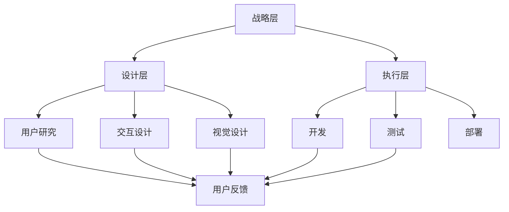

                 

关键词：用户体验（UX），创业公司，优化策略，产品设计，用户体验研究，用户反馈

> 摘要：在竞争激烈的市场中，用户体验（UX）成为创业公司的核心竞争力之一。本文将探讨创业公司如何通过策略化的用户体验优化，提升用户满意度，增强产品竞争力。我们将深入分析用户体验的各个方面，提出一系列具体可行的优化策略，以帮助创业公司构建卓越的用户体验。

## 1. 背景介绍

在数字化时代，用户体验（UX）已经成为产品成功与否的关键因素。对于创业公司而言，构建一个能够吸引并留住用户的优秀用户体验尤为重要。用户体验不仅影响用户满意度，还直接关系到用户忠诚度、转化率和产品口碑。因此，创业公司必须重视用户体验的优化，将其作为公司战略的一部分。

然而，创业公司在资源有限的情况下，如何高效地进行用户体验优化，成为了一个挑战。本文将探讨以下几个关键问题：

- 如何理解用户体验的核心要素？
- 创业公司应该如何进行用户体验研究？
- 用户反馈在用户体验优化中的重要性是什么？
- 如何制定并实施具体的用户体验优化策略？

通过解答这些问题，本文旨在为创业公司提供一套实用、高效的用户体验优化策略。

## 2. 核心概念与联系

### 2.1. 用户体验（UX）的定义

用户体验（User Experience，简称UX）是指用户在使用产品或服务过程中所产生的总体感受和体验。它不仅仅关注产品的功能性，还包括用户在交互过程中的情感、认知和满意度等方面。

### 2.2. 用户体验的三大要素

用户体验可以从三个方面进行优化：

#### 可用性（Usability）

可用性关注用户能否有效地使用产品，包括产品的易学性、效率和错误率。一个高可用性的产品应该能够让用户轻松完成任务，减少学习成本，提高工作效率。

#### 体验性（Experience）

体验性关注用户在使用产品过程中的情感体验，包括愉悦感、惊喜感和满足感。一个优秀的体验性设计能够引发用户的情感共鸣，提升用户满意度。

#### 可访问性（Accessibility）

可访问性关注产品的无障碍性，即产品能否被所有人使用，包括残疾人士、老年人等特殊用户群体。一个可访问性的产品能够体现公司的社会责任感，扩大用户基础。

### 2.3. 用户体验的架构

用户体验的架构可以分为三个层次：战略层、设计层和执行层。

#### 战略层

战略层关注用户体验的长期规划和目标，包括用户体验愿景、目标和关键绩效指标（KPI）。这一层决定了用户体验的整体方向和优先级。

#### 设计层

设计层关注用户体验的具体实现，包括用户研究、交互设计、视觉设计等。这一层是用户体验的核心，直接影响用户的实际体验。

#### 执行层

执行层关注用户体验的落地和实施，包括开发、测试、部署等。这一层是用户体验的保障，确保设计能够得到有效执行。

### 2.4. 用户体验与产品竞争力的关系

用户体验与产品竞争力密切相关。一个优秀的用户体验能够提升产品的市场地位和用户忠诚度，从而增强产品竞争力。具体来说，用户体验对产品竞争力的影响体现在以下几个方面：

- **用户满意度**：优秀的用户体验能够提升用户满意度，增加用户粘性。
- **用户忠诚度**：满意的用户体验能够培养用户忠诚度，减少用户流失。
- **转化率**：用户体验直接影响用户的购买决策，提高转化率。
- **口碑传播**：良好的用户体验能够带来用户口碑，提升产品口碑效应。
- **市场占有率**：优秀的用户体验能够扩大用户基础，提高市场占有率。

### 2.5. Mermaid 流程图

以下是一个简单的 Mermaid 流程图，展示用户体验优化流程的关键步骤：



这个流程图展示了用户体验优化的整体架构和关键步骤，为创业公司提供了一个清晰的优化路径。

## 3. 核心算法原理 & 具体操作步骤

### 3.1. 算法原理概述

用户体验优化需要基于数据驱动的方法，通过收集和分析用户行为数据，找出用户体验中的痛点，并针对性地进行优化。核心算法原理主要包括以下两个方面：

- **A/B 测试**：通过将用户分成两组，分别展示不同的设计方案，比较两组用户的反应，找出最优的设计方案。
- **机器学习**：利用机器学习算法，分析用户行为数据，预测用户偏好，为用户提供个性化的用户体验。

### 3.2. 算法步骤详解

#### 3.2.1. A/B 测试

1. **定义目标**：明确想要测试的变量，如按钮颜色、页面布局等。
2. **创建测试版本**：设计并实现两个或多个版本的页面或功能。
3. **分配用户**：将用户随机分配到不同的测试组，确保每组用户数量均衡。
4. **展示测试版本**：根据用户的分配情况，向用户展示不同的测试版本。
5. **收集数据**：收集用户的交互数据，如点击次数、停留时间等。
6. **分析数据**：比较不同测试版本的用户反应，找出最优版本。
7. **决策**：根据测试结果，决定是否采用最优版本。

#### 3.2.2. 机器学习

1. **数据收集**：收集用户行为数据，如浏览历史、点击行为、搜索关键词等。
2. **数据预处理**：清洗数据，去除噪声，转换数据格式。
3. **特征工程**：提取数据中的关键特征，为模型提供输入。
4. **模型训练**：选择合适的机器学习模型，训练模型。
5. **模型评估**：评估模型性能，如准确率、召回率等。
6. **模型应用**：将训练好的模型应用到产品中，为用户提供个性化的用户体验。

### 3.3. 算法优缺点

#### 3.3.1. A/B 测试

- 优点：操作简单，结果直观，适用于快速验证设计效果。
- 缺点：可能存在样本偏差，结果可能不具有普遍性，无法揭示深层次的用户需求。

#### 3.3.2. 机器学习

- 优点：能够从大量数据中挖掘用户需求，提供个性化的用户体验。
- 缺点：需要大量数据支持，模型训练时间较长，对数据质量和特征工程要求较高。

### 3.4. 算法应用领域

A/B 测试和机器学习算法在用户体验优化中都有广泛的应用。例如：

- **个性化推荐**：利用机器学习算法，根据用户行为数据，为用户提供个性化的产品推荐。
- **界面优化**：通过 A/B 测试，不断调整界面元素，提升用户的操作体验。
- **功能优化**：通过 A/B 测试，验证新功能的用户接受度，优化产品功能。

## 4. 数学模型和公式 & 详细讲解 & 举例说明

### 4.1. 数学模型构建

用户体验优化的数学模型可以基于用户满意度（User Satisfaction，US）的度量。用户满意度可以通过以下公式表示：

$$ US = f(U, Q) $$

其中，U 表示用户体验，Q 表示产品质量。用户体验 U 可以进一步分解为可用性（Usability）、体验性（Experience）和可访问性（Accessibility）三个子维度：

$$ U = U_s + U_e + U_a $$

### 4.2. 公式推导过程

用户满意度的推导过程如下：

1. **定义用户满意度**：用户满意度是用户在使用产品或服务后的总体感受和评价。
2. **分解用户体验**：用户体验可以从多个维度进行衡量，包括可用性、体验性和可访问性。
3. **确定质量因素**：产品质量是影响用户满意度的关键因素，包括功能、性能、可靠性等方面。
4. **构建满意度公式**：将用户体验和质量因素结合起来，构建用户满意度的数学模型。

### 4.3. 案例分析与讲解

#### 4.3.1. 案例背景

某创业公司开发了一款在线教育平台，目标是提供高质量的在线学习体验。公司希望通过用户体验优化，提升用户满意度和用户粘性。

#### 4.3.2. 数据收集

公司收集了以下数据：

- **可用性数据**：用户完成课程任务的效率、错误率等。
- **体验性数据**：用户在学习过程中的愉悦度、惊喜感等。
- **可访问性数据**：用户对平台的可访问性评价。

#### 4.3.3. 数据分析

公司使用用户满意度公式，对收集到的数据进行分析。以下是一个简化的用户满意度计算过程：

$$ US = 0.6 \times U_s + 0.3 \times U_e + 0.1 \times U_a $$

根据数据，公司得出以下结论：

- **可用性**：用户完成课程任务的效率较高，但错误率较高，可用性评分较低。
- **体验性**：用户在学习过程中感受到了较高的愉悦度和惊喜感，体验性评分较高。
- **可访问性**：平台在移动设备上的可访问性较好，但部分用户反馈加载速度较慢，可访问性评分一般。

#### 4.3.4. 优化策略

根据数据分析结果，公司制定了以下优化策略：

- **提高可用性**：优化课程任务的流程，减少用户错误率。
- **提升体验性**：增加互动元素，提高用户的学习兴趣和参与度。
- **改善可访问性**：优化移动端加载速度，提升平台的移动友好性。

通过实施这些优化策略，公司希望提高用户满意度，增强产品竞争力。

## 5. 项目实践：代码实例和详细解释说明

### 5.1. 开发环境搭建

在本项目中，我们将使用 Python 编写 A/B 测试代码。首先需要安装以下依赖：

```bash
pip install numpy pandas matplotlib
```

### 5.2. 源代码详细实现

以下是一个简单的 A/B 测试代码实例，用于比较两种不同按钮颜色对用户点击率的影响：

```python
import numpy as np
import pandas as pd
import matplotlib.pyplot as plt

# 假设我们有两个测试组，A 和 B
group_a_clicks = np.random.randint(0, 100, size=100)
group_b_clicks = np.random.randint(0, 100, size=100)

# 创建 DataFrame
data = pd.DataFrame({
    'Group': ['A'] * 100 + ['B'] * 100,
    'Clicks': group_a_clicks + group_b_clicks
})

# 分析点击率
group_click_rates = data.groupby('Group')['Clicks'].mean()

# 绘制图表
group_click_rates.plot(kind='bar')
plt.title('A/B Test Results')
plt.xlabel('Group')
plt.ylabel('Click Rate')
plt.show()
```

### 5.3. 代码解读与分析

这个简单的 A/B 测试代码实例包含以下关键步骤：

1. **数据生成**：使用 NumPy 生成两个测试组的随机点击数据。
2. **创建 DataFrame**：将数据组织成 DataFrame，便于分析。
3. **数据分析**：使用 Pandas 计算每个测试组的点击率。
4. **数据可视化**：使用 Matplotlib 绘制点击率柱状图，直观展示分析结果。

通过这个简单的实例，我们可以看到如何使用 Python 进行 A/B 测试，以及如何解读和分析测试结果。

### 5.4. 运行结果展示

运行上述代码，我们将得到一个柱状图，展示两组测试组的点击率。通过比较点击率，我们可以直观地判断哪种颜色按钮更受用户欢迎。

## 6. 实际应用场景

### 6.1. 电商平台

在电商平台上，用户体验优化可以体现在以下几个方面：

- **个性化推荐**：利用用户行为数据，为用户推荐感兴趣的商品，提高转化率。
- **界面优化**：通过 A/B 测试，优化商品展示布局和购物流程，提高用户满意度。
- **搜索优化**：使用机器学习算法，优化搜索结果排序，提高用户查找商品的效率。

### 6.2. 教育平台

在教育平台上，用户体验优化可以体现在以下几个方面：

- **课程推荐**：根据用户的学习历史和兴趣，为用户推荐合适的课程。
- **学习计划**：为用户提供个性化的学习计划，提高学习效果。
- **互动环节**：增加课堂互动环节，提高用户的参与度和满意度。

### 6.3. 社交平台

在社交平台上，用户体验优化可以体现在以下几个方面：

- **内容推荐**：根据用户的社交行为和兴趣，为用户推荐感兴趣的内容。
- **消息推送**：优化消息推送策略，提高用户的消息阅读率和互动率。
- **界面设计**：通过 A/B 测试，优化用户界面的美观度和易用性，提高用户满意度。

### 6.4. 未来应用展望

随着人工智能和大数据技术的发展，用户体验优化将继续向以下几个方面发展：

- **智能化**：利用人工智能算法，实现更智能的用户体验优化，提高个性化服务水平。
- **个性化**：基于用户行为和偏好，为用户提供更加个性化的用户体验，提升用户满意度。
- **实时性**：通过实时数据分析和反馈，快速调整用户体验，满足用户需求。

## 7. 工具和资源推荐

### 7.1. 学习资源推荐

- 《用户体验要素》
- 《设计心理学》
- 《用户体验设计：现代方法的实践与原则》

### 7.2. 开发工具推荐

- Figma：一款流行的界面设计工具，支持协作和原型设计。
- Sketch：一款专业的界面设计工具，适用于移动端和网页设计。
- Adobe XD：一款功能强大的界面设计工具，支持跨平台设计。

### 7.3. 相关论文推荐

- "The Design of Everyday Things" by Don Norman
- "Information Architecture for the Web and Beyond" by Louis Rosenfeld and Peter Morville
- "User Experience Design" by Aarron Walter

## 8. 总结：未来发展趋势与挑战

### 8.1. 研究成果总结

本文从用户体验的核心要素、优化策略、算法原理和实际应用场景等方面，探讨了创业公司如何进行用户体验优化。主要研究成果包括：

- 明确了用户体验的核心要素：可用性、体验性和可访问性。
- 提出了基于数据驱动的用户体验优化方法：A/B 测试和机器学习。
- 介绍了用户体验优化的实际应用场景，如电商平台、教育平台和社交平台。
- 推荐了相关工具和资源，为创业公司提供实践指导。

### 8.2. 未来发展趋势

未来用户体验优化将朝着以下几个方向发展：

- 智能化：利用人工智能技术，实现更智能的用户体验优化。
- 个性化：基于用户行为和偏好，提供更加个性化的用户体验。
- 实时性：通过实时数据分析和反馈，快速调整用户体验，满足用户需求。

### 8.3. 面临的挑战

用户体验优化在创业公司中面临以下挑战：

- 数据质量：用户体验优化依赖于用户行为数据，数据质量直接影响优化效果。
- 资源限制：创业公司资源有限，需要在有限的资源下进行高效的用户体验优化。
- 人员能力：用户体验优化需要专业的团队和人才，创业公司可能面临人才短缺的问题。

### 8.4. 研究展望

未来研究可以从以下几个方面展开：

- 深入研究用户体验优化的算法原理，提高优化效果。
- 探索如何利用大数据和人工智能技术，实现更高效的用户体验优化。
- 基于不同行业和场景，提出更具针对性的用户体验优化策略。

## 9. 附录：常见问题与解答

### 问题 1：用户体验优化是否适用于所有行业？

**答案**：是的，用户体验优化适用于所有行业。不同行业的用户体验优化侧重点不同，但核心目标都是提高用户满意度，增强产品竞争力。

### 问题 2：如何保证用户体验优化过程中的数据质量？

**答案**：保证数据质量可以从以下几个方面入手：

- **数据收集**：确保数据收集过程的准确性和完整性。
- **数据清洗**：去除无效数据，确保数据质量。
- **数据验证**：对数据进行分析和验证，确保数据可靠性。

### 问题 3：用户体验优化是否一定能够提高用户满意度？

**答案**：用户体验优化可以提高用户满意度，但并非一定能够保证。用户体验优化需要基于实际用户需求，针对性地进行优化，才能真正提高用户满意度。

### 问题 4：如何评估用户体验优化的效果？

**答案**：评估用户体验优化的效果可以从以下几个方面进行：

- **用户反馈**：收集用户反馈，了解用户对优化效果的满意度。
- **关键绩效指标**：分析关键绩效指标（KPI），如用户满意度、转化率等。
- **数据分析**：对用户行为数据进行分析，评估优化效果。

---

**作者：禅与计算机程序设计艺术 / Zen and the Art of Computer Programming**

