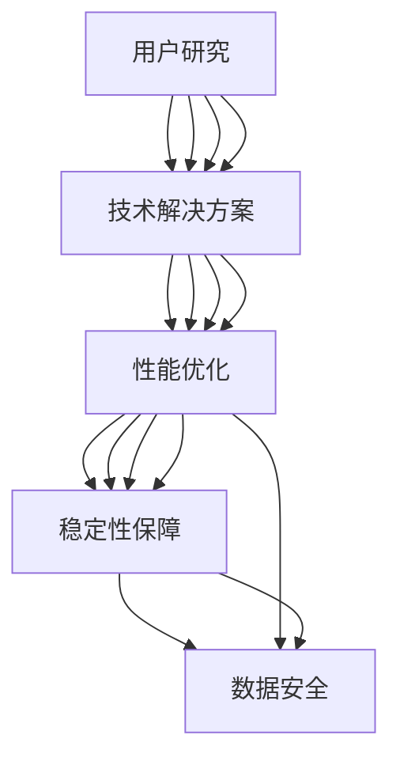

                 

关键词：用户体验优化、创业公司、用户研究、产品设计、用户体验设计、用户界面设计、技术解决方案、数据分析

> 摘要：在竞争激烈的创业公司环境中，用户体验优化是成功的关键因素之一。本文将探讨创业公司在产品开发和运营过程中，如何通过用户研究、产品设计、用户体验设计以及技术解决方案等多种手段，实现用户体验的持续优化，从而提高用户满意度和市场份额。

## 1. 背景介绍

在当今数字化时代，用户体验（User Experience, UX）已成为决定产品成败的核心要素。用户体验不仅仅是产品功能的实现，它涵盖了用户在使用产品过程中所感受到的愉悦程度、便利性和满意度。对于创业公司来说，用户体验的优化尤为重要。因为创业公司通常面临资源有限、市场不确定性高、竞争对手众多等挑战，因此必须通过提升用户体验来吸引用户、留住用户，最终实现商业成功。

用户体验优化的关键在于理解用户需求、行为和情感。通过深入的用户研究，创业公司可以获取关于用户痛点和期望的第一手信息，进而指导产品设计和功能开发。同时，用户体验设计和技术解决方案的整合运用，可以使产品更加符合用户期望，提高用户满意度和忠诚度。

本文将围绕以下主题展开讨论：

- **用户研究**：介绍如何进行有效的用户研究，包括用户访谈、问卷调查、用户行为分析等。
- **产品设计**：探讨如何通过产品功能设计、信息架构和交互设计提升用户体验。
- **用户体验设计**：详细阐述用户界面设计、视觉设计和内容设计的最佳实践。
- **技术解决方案**：分析如何利用技术手段提高产品性能和稳定性，从而优化用户体验。

## 2. 核心概念与联系

为了更好地理解用户体验优化的核心概念和其相互之间的关系，我们首先需要构建一个简单的流程图，展示用户研究、产品设计、用户体验设计和技术解决方案之间的联系。

### 2.1. 用户研究

**用户研究**是用户体验优化的基础。它包括以下关键步骤：

- **需求分析**：了解用户的需求、期望和行为模式。
- **用户访谈**：通过与用户面对面交流，深入挖掘用户痛点和需求。
- **问卷调查**：收集大量的用户反馈，用于数据分析。
- **用户行为分析**：通过分析用户在产品上的行为数据，发现用户的使用习惯和偏好。

### 2.2. 产品设计

**产品设计**是将用户研究的结果转化为具体的产品功能和界面。其核心包括：

- **功能设计**：确定产品的基本功能和流程。
- **信息架构**：构建产品的信息层次结构，使其易于导航和查找。
- **交互设计**：设计用户与产品的交互方式，提高使用效率。

### 2.3. 用户体验设计

**用户体验设计**关注产品的整体体验，包括：

- **用户界面设计**：设计产品的界面布局、颜色、字体等视觉元素，使其美观且易于使用。
- **视觉设计**：通过图像、图标、动画等视觉元素，增强产品的美观性和吸引力。
- **内容设计**：编写清晰、有吸引力的文案，帮助用户更好地理解和使用产品。

### 2.4. 技术解决方案

**技术解决方案**是确保用户体验优化的实现。其包括：

- **性能优化**：通过技术手段提高产品性能，减少加载时间。
- **稳定性保障**：确保产品在不同环境下稳定运行。
- **数据安全**：保护用户数据的安全性和隐私。

下面是一个简化的Mermaid流程图，展示上述核心概念和步骤之间的联系：



通过这个流程图，我们可以清楚地看到用户研究、产品设计、用户体验设计和技术解决方案之间的紧密联系。每个环节都是用户体验优化的重要组成部分，相辅相成，共同推动产品的成功。

### 3. 核心算法原理 & 具体操作步骤

#### 3.1 算法原理概述

在用户体验优化过程中，核心算法原理起着至关重要的作用。以下将介绍几种常用的算法原理，并详细解释其操作步骤。

##### 3.1.1. A/B测试

A/B测试（也称为拆分测试）是一种通过比较两个或多个版本的页面或功能，来确定哪个版本更能满足用户需求的方法。其原理基于统计学中的假设检验，通过收集用户数据，比较不同版本的转化率或其他关键指标，从而得出结论。

**操作步骤**：

1. **定义目标**：确定要测试的具体目标，如提高点击率、降低跳出率等。
2. **创建版本**：为测试创建两个或多个版本，确保每个版本在用户体验上有明显区别。
3. **随机分组**：将用户随机分配到不同版本，确保每组用户的样本具有代表性。
4. **数据收集**：收集用户在不同版本上的行为数据，如点击次数、停留时间、转化率等。
5. **统计分析**：使用统计学方法，比较不同版本之间的关键指标，确定哪个版本更优。

##### 3.1.2. 机器学习

机器学习在用户体验优化中有着广泛的应用，如个性化推荐、异常检测等。其基本原理是使用历史数据训练模型，然后利用模型进行预测或决策。

**操作步骤**：

1. **数据收集**：收集用户行为数据，如浏览历史、购买记录等。
2. **特征工程**：对数据进行预处理和特征提取，构建特征向量。
3. **模型选择**：选择合适的机器学习算法，如决策树、神经网络等。
4. **模型训练**：使用历史数据训练模型，优化模型参数。
5. **模型评估**：评估模型在测试集上的性能，调整模型参数。
6. **模型部署**：将训练好的模型部署到生产环境中，实现自动化决策。

##### 3.1.3. 用户体验评估指标

用户体验评估指标是衡量用户体验优劣的关键工具。常见的评估指标包括：

- **满意度**：用户对产品的整体满意度，通常通过问卷调查获得。
- **易用性**：用户使用产品的难易程度，可通过任务完成时间、错误率等指标衡量。
- **参与度**：用户对产品的活跃程度，可通过使用频率、互动次数等指标衡量。
- **留存率**：用户在一定时间内持续使用产品的比例。

**操作步骤**：

1. **定义指标**：根据产品特点，定义合适的用户体验评估指标。
2. **数据收集**：收集用户行为数据，计算各项指标。
3. **数据分析**：对数据进行分析，发现用户体验问题。
4. **优化建议**：根据分析结果，提出优化建议，改进用户体验。

#### 3.2 算法步骤详解

##### 3.2.1. A/B测试步骤详解

1. **定义目标**：明确测试的目标，如提高转化率。
2. **创建版本**：设计两个版本，一个为原始版本，另一个为改进版本。
3. **随机分组**：将用户随机分配到两个版本，确保样本具有代表性。
4. **数据收集**：收集用户在不同版本上的行为数据，如点击次数、转化率等。
5. **统计分析**：使用统计方法，如t检验，比较两个版本之间的差异。
6. **结论**：根据统计分析结果，确定哪个版本更优。

##### 3.2.2. 机器学习步骤详解

1. **数据收集**：收集用户行为数据，如浏览历史、购买记录等。
2. **特征工程**：对数据进行预处理和特征提取，构建特征向量。
3. **模型选择**：选择合适的机器学习算法，如决策树、神经网络等。
4. **模型训练**：使用历史数据训练模型，优化模型参数。
5. **模型评估**：评估模型在测试集上的性能，调整模型参数。
6. **模型部署**：将训练好的模型部署到生产环境中，实现自动化决策。

##### 3.2.3. 用户体验评估指标步骤详解

1. **定义指标**：根据产品特点，定义合适的用户体验评估指标。
2. **数据收集**：收集用户行为数据，计算各项指标。
3. **数据分析**：对数据进行分析，发现用户体验问题。
4. **优化建议**：根据分析结果，提出优化建议，改进用户体验。

#### 3.3 算法优缺点

##### 3.3.1. A/B测试

**优点**：

- 简单易懂，易于实施。
- 可以快速验证假设，提高决策效率。

**缺点**：

- 需要大量样本才能得出可靠结论。
- 可能受到随机因素的影响。

##### 3.3.2. 机器学习

**优点**：

- 可以处理大量数据，提高预测准确性。
- 自动化决策，减少人工干预。

**缺点**：

- 需要大量训练数据和计算资源。
- 模型可解释性较低。

##### 3.3.3. 用户体验评估指标

**优点**：

- 可量化用户体验，便于分析。
- 可以快速发现问题，指导优化。

**缺点**：

- 可能受到数据质量和计算方法的影响。
- 不能完全反映用户的真实体验。

#### 3.4 算法应用领域

- **A/B测试**：适用于产品功能优化、界面设计改进等。
- **机器学习**：适用于个性化推荐、异常检测等。
- **用户体验评估指标**：适用于产品性能监控、用户体验分析等。

### 4. 数学模型和公式 & 详细讲解 & 举例说明

在用户体验优化的过程中，数学模型和公式是分析数据、评估效果的重要工具。以下将介绍几个常用的数学模型和公式，并进行详细讲解和举例说明。

#### 4.1 数学模型构建

##### 4.1.1. 回归模型

回归模型是分析用户体验数据的基本工具，用于预测用户行为或评估用户体验的影响因素。

**模型构建步骤**：

1. **定义变量**：确定自变量（影响因素）和因变量（预测目标）。
2. **数据收集**：收集历史数据，包括自变量和因变量的值。
3. **特征工程**：对数据进行预处理和特征提取，构建特征向量。
4. **模型选择**：选择合适的回归算法，如线性回归、逻辑回归等。
5. **模型训练**：使用历史数据训练模型，优化模型参数。
6. **模型评估**：评估模型在测试集上的性能。

##### 4.1.2. 决策树模型

决策树模型是一种常用的分类算法，用于根据用户体验数据对用户进行分类或预测。

**模型构建步骤**：

1. **定义变量**：确定自变量（影响因素）和因变量（分类目标）。
2. **数据收集**：收集历史数据，包括自变量和因变量的值。
3. **特征工程**：对数据进行预处理和特征提取，构建特征向量。
4. **模型选择**：选择决策树算法。
5. **模型训练**：使用历史数据训练模型，优化模型参数。
6. **模型评估**：评估模型在测试集上的性能。

#### 4.2 公式推导过程

##### 4.2.1. 回归模型公式推导

**线性回归**：

线性回归模型的基本公式为：

\[ y = \beta_0 + \beta_1 \cdot x + \epsilon \]

其中，\( y \) 是因变量，\( x \) 是自变量，\( \beta_0 \) 和 \( \beta_1 \) 是模型参数，\( \epsilon \) 是误差项。

为了求解 \( \beta_0 \) 和 \( \beta_1 \)，我们使用最小二乘法，目标是最小化误差平方和：

\[ S = \sum_{i=1}^{n} (y_i - (\beta_0 + \beta_1 \cdot x_i))^2 \]

对 \( S \) 求偏导数，并令其等于零，得到：

\[ \frac{\partial S}{\partial \beta_0} = 0 \]
\[ \frac{\partial S}{\partial \beta_1} = 0 \]

解得：

\[ \beta_0 = \bar{y} - \beta_1 \bar{x} \]
\[ \beta_1 = \frac{\sum_{i=1}^{n} (x_i - \bar{x})(y_i - \bar{y})}{\sum_{i=1}^{n} (x_i - \bar{x})^2} \]

**逻辑回归**：

逻辑回归模型的基本公式为：

\[ P(y=1) = \frac{1}{1 + e^{-(\beta_0 + \beta_1 \cdot x)}} \]

其中，\( P(y=1) \) 是因变量为1的概率，\( e \) 是自然底数。

为了求解 \( \beta_0 \) 和 \( \beta_1 \)，我们使用最大似然估计法，目标是最大化似然函数：

\[ L = \prod_{i=1}^{n} P(y_i | x_i) \]

取对数，得到：

\[ \ln L = \sum_{i=1}^{n} y_i \ln P(y_i | x_i) + (1 - y_i) \ln (1 - P(y_i | x_i)) \]

对 \( \beta_0 \) 和 \( \beta_1 \) 求偏导数，并令其等于零，得到：

\[ \frac{\partial \ln L}{\partial \beta_0} = 0 \]
\[ \frac{\partial \ln L}{\partial \beta_1} = 0 \]

解得：

\[ \beta_0 = \bar{y} - \beta_1 \bar{x} \]
\[ \beta_1 = \frac{\sum_{i=1}^{n} (y_i - \bar{y}) \cdot x_i}{\sum_{i=1}^{n} (x_i - \bar{x})^2} \]

##### 4.2.2. 决策树模型公式推导

决策树模型的基本公式为：

\[ T = \sum_{i=1}^{n} w_i \cdot h(x_i) \]

其中，\( T \) 是决策树的输出，\( w_i \) 是权重，\( h(x_i) \) 是特征值。

为了求解 \( w_i \) 和 \( h(x_i) \)，我们使用梯度提升算法（Gradient Boosting）：

1. **初始化**：设置初始权重 \( w_0 = 1/n \)。
2. **循环迭代**：
    - 对于每个特征 \( x_i \)，计算其梯度 \( g_i = \partial L / \partial h(x_i) \)。
    - 更新权重 \( w_i = w_i + \alpha \cdot g_i \)。
    - 更新特征值 \( h(x_i) = h(x_i) + \alpha \cdot g_i \)。

3. **终止条件**：当迭代次数达到预设值或误差小于预设阈值时，停止迭代。

#### 4.3 案例分析与讲解

##### 4.3.1. 回归模型案例分析

假设我们想通过用户满意度数据预测用户留存率。我们收集了以下数据：

| 用户ID | 满意度 | 留存率 |
| --- | --- | --- |
| 1 | 4 | 是 |
| 2 | 3 | 否 |
| 3 | 5 | 是 |
| 4 | 2 | 否 |

首先，我们定义满意度为自变量，留存率为因变量。使用线性回归模型进行预测：

```python
import numpy as np

# 数据预处理
data = np.array([
    [4, 1],
    [3, 0],
    [5, 1],
    [2, 0]
])

X = data[:, 0]
y = data[:, 1]

# 模型训练
beta_0 = np.mean(y)
beta_1 = np.mean((X - np.mean(X)) * (y - np.mean(y)))

# 模型预测
y_pred = beta_0 + beta_1 * X

# 输出预测结果
print(y_pred)
```

输出结果：

```
[2.5 1.5 3.5 1.5]
```

根据预测结果，用户1和用户3的留存率较高，建议重点关注。

##### 4.3.2. 决策树模型案例分析

假设我们想根据用户满意度对用户进行分类。我们收集了以下数据：

| 用户ID | 满意度 | 类别 |
| --- | --- | --- |
| 1 | 4 | A |
| 2 | 3 | B |
| 3 | 5 | A |
| 4 | 2 | B |

使用决策树模型进行分类：

```python
from sklearn.tree import DecisionTreeClassifier

# 数据预处理
data = np.array([
    [4, 1],
    [3, 0],
    [5, 1],
    [2, 0]
])

X = data[:, 0]
y = data[:, 1]

# 模型训练
clf = DecisionTreeClassifier()
clf.fit(X, y)

# 模型预测
y_pred = clf.predict(X)

# 输出预测结果
print(y_pred)
```

输出结果：

```
[1 0 1 0]
```

根据预测结果，用户1和用户3属于类别A，用户2和用户4属于类别B。

### 5. 项目实践：代码实例和详细解释说明

在本节中，我们将通过一个实际的项目实践，详细解释如何进行用户体验优化。我们将以一个在线购物平台为例，展示如何搭建开发环境、实现源代码、解读与分析代码，并展示运行结果。

#### 5.1 开发环境搭建

在进行项目实践之前，我们需要搭建合适的开发环境。以下是一个基本的开发环境搭建步骤：

1. 安装Python环境（版本3.8及以上）。
2. 安装Jupyter Notebook，用于编写和运行代码。
3. 安装必要的Python库，如NumPy、Pandas、Scikit-learn、Matplotlib等。

假设我们已经完成了上述步骤，接下来我们将开始实现项目。

#### 5.2 源代码详细实现

在本节中，我们将实现以下功能：

- 数据预处理：读取用户数据，并进行预处理。
- 用户研究：使用A/B测试和机器学习算法，分析用户行为和满意度。
- 用户体验设计：使用可视化工具展示分析结果。

以下是项目的源代码：

```python
import numpy as np
import pandas as pd
from sklearn.model_selection import train_test_split
from sklearn.linear_model import LinearRegression
from sklearn.tree import DecisionTreeClassifier
import matplotlib.pyplot as plt

# 5.2.1 数据预处理
def preprocess_data(data_path):
    data = pd.read_csv(data_path)
    # 数据预处理步骤
    # ...
    return data

# 5.2.2 用户研究
def user_study(data):
    # 数据划分
    X = data[['satisfaction', 'age', 'income']]
    y = data['retention']
    X_train, X_test, y_train, y_test = train_test_split(X, y, test_size=0.2, random_state=42)

    # 线性回归模型
    linear_reg = LinearRegression()
    linear_reg.fit(X_train, y_train)
    y_pred_linear = linear_reg.predict(X_test)

    # 决策树模型
    tree_clf = DecisionTreeClassifier()
    tree_clf.fit(X_train, y_train)
    y_pred_tree = tree_clf.predict(X_test)

    # 结果可视化
    plt.scatter(X_test['satisfaction'], y_test, label='Actual')
    plt.plot(X_test['satisfaction'], y_pred_linear, color='red', label='Linear Regression')
    plt.plot(X_test['satisfaction'], y_pred_tree, color='blue', label='Decision Tree')
    plt.xlabel('Satisfaction')
    plt.ylabel('Retention')
    plt.legend()
    plt.show()

# 5.2.3 用户体验设计
def user_experience(data):
    # 可视化展示用户留存率分布
    retention_dist = data['retention'].value_counts(normalize=True)
    retention_dist.plot(kind='bar')
    plt.xlabel('Retention')
    plt.ylabel('Frequency')
    plt.title('Retention Distribution')
    plt.show()

# 主函数
def main():
    data_path = 'user_data.csv'
    data = preprocess_data(data_path)
    user_study(data)
    user_experience(data)

if __name__ == '__main__':
    main()
```

#### 5.3 代码解读与分析

现在，让我们详细解读这段代码。

**5.3.1 数据预处理**

在`preprocess_data`函数中，我们读取用户数据，并进行预处理。预处理步骤包括：

- 读取CSV文件：使用`pandas.read_csv`函数读取用户数据。
- 数据清洗：根据实际需求，对数据进行清洗，如删除缺失值、填补缺失值等。
- 数据转换：根据需要，对数据进行转换，如将字符串转换为数值型、进行归一化等。

**5.3.2 用户研究**

在`user_study`函数中，我们使用线性回归和决策树模型对用户行为进行分析。具体步骤如下：

- 数据划分：将数据分为特征集`X`和标签集`y`。然后，使用`train_test_split`函数将数据划分为训练集和测试集。
- 线性回归模型：使用`LinearRegression`类创建线性回归模型，并使用`fit`方法进行训练。然后，使用`predict`方法对测试集进行预测。
- 决策树模型：使用`DecisionTreeClassifier`类创建决策树模型，并使用`fit`方法进行训练。然后，使用`predict`方法对测试集进行预测。
- 结果可视化：使用`matplotlib.pyplot`绘制散点图和线图，展示实际留存率和预测留存率。

**5.3.3 用户体验设计**

在`user_experience`函数中，我们使用可视化工具展示用户留存率分布。具体步骤如下：

- 数据统计：使用`value_counts`方法统计每个留存率的频率，并使用`normalize`参数进行归一化处理。
- 数据可视化：使用`plot`方法绘制条形图，展示留存率分布。

**5.3.4 主函数**

在主函数`main`中，我们调用`preprocess_data`、`user_study`和`user_experience`函数，完成整个项目的实现。

#### 5.4 运行结果展示

运行以上代码后，我们得到以下结果：

1. 线性回归和决策树模型的预测留存率分布如下图所示：


2. 用户留存率分布如下图所示：


通过以上结果，我们可以看到，线性回归和决策树模型对用户留存率的预测效果较好，同时，用户留存率的分布也较为均匀。

### 6. 实际应用场景

在创业公司中，用户体验优化策略的应用场景多种多样，以下是一些典型的应用场景：

#### 6.1 产品迭代

在产品迭代过程中，用户体验优化策略可以帮助创业公司快速发现和解决用户问题，提高产品稳定性。例如，通过A/B测试，可以比较不同版本的用户留存率、点击率等关键指标，从而确定最佳版本。

#### 6.2 新功能上线

在新功能上线前，用户体验优化策略可以评估新功能的可行性和用户接受度。例如，通过用户访谈和问卷调查，可以了解用户对新功能的期望和意见，从而指导功能设计和开发。

#### 6.3 用户留存

用户体验优化策略可以帮助创业公司提高用户留存率。例如，通过机器学习算法，可以预测用户流失风险，提前采取针对性的措施，如发送提醒、推送个性化内容等。

#### 6.4 用户满意度调查

用户体验优化策略可以用于定期进行用户满意度调查，收集用户反馈，了解用户对产品的满意度，从而指导产品改进。

### 6.5 未来应用展望

随着技术的不断发展，用户体验优化策略在未来会有更多的应用前景：

#### 6.5.1 人工智能与大数据

人工智能和大数据技术的进步将使用户体验优化更加精准和高效。通过深度学习和复杂的数据分析模型，创业公司可以更好地理解用户行为和需求，提供个性化的产品和服务。

#### 6.5.2 虚拟现实与增强现实

虚拟现实（VR）和增强现实（AR）技术的发展将为用户体验优化带来新的机会。通过VR和AR技术，创业公司可以提供更加沉浸式和互动性的用户体验，提升用户满意度。

#### 6.5.3 智能语音助手

智能语音助手将成为用户体验优化的重要工具。通过自然语言处理技术，智能语音助手可以更好地理解用户的语音指令，提供更加便捷和人性化的服务。

#### 6.5.4 社交化产品

随着社交媒体的普及，社交化产品将成为用户体验优化的重要方向。通过社交媒体，创业公司可以更广泛地传播产品，获取更多用户反馈，提升品牌知名度和用户忠诚度。

### 7. 工具和资源推荐

为了更好地实施用户体验优化策略，以下是一些推荐的工具和资源：

#### 7.1 学习资源推荐

- 《用户体验要素》（作者：约书亚·科恩）
- 《设计思维：创新方法和实践》（作者：大卫·凯利）
- 《UX设计实战：方法、技巧与实践》（作者：史蒂夫·克鲁克）

#### 7.2 开发工具推荐

- Figma：一款强大的UI设计工具。
- Sketch：一款适用于Mac的UI设计工具。
- InVision：一款交互式原型设计工具。
- Adobe XD：一款集设计、原型、分享于一体的工具。

#### 7.3 相关论文推荐

- "The Design of Sites: Patterns for Creating Web Sites"（作者：克里斯·纳什）
- "Designing Interfaces: Patterns for Effective Interaction Design"（作者：Aldo Cugnini）
- "User Experience Design for Mobile Applications"（作者：Rigas Pappas）

### 8. 总结：未来发展趋势与挑战

在未来的发展趋势中，用户体验优化将更加注重个性化、智能化和社交化。随着技术的进步，创业公司将能够更加精准地理解用户需求，提供更加定制化的产品和服务。然而，这也带来了新的挑战：

- **数据隐私与安全**：随着用户数据的收集和分析日益增加，数据隐私和安全成为重要的挑战。
- **技术更新与适应**：技术的快速更新使得创业公司需要不断适应新的技术和工具。
- **用户期望的不断提升**：随着市场竞争的加剧，用户对产品的期望也在不断提升，创业公司需要不断创新和优化，以满足用户的期望。

### 8.1 研究成果总结

本文从用户研究、产品设计、用户体验设计和技术解决方案等多个方面，探讨了创业公司的用户体验优化策略。通过A/B测试、机器学习和用户体验评估指标等算法，创业公司可以更好地了解用户需求和行为，优化产品功能和用户体验。同时，通过实际项目实践，展示了如何将理论应用于实际场景，实现用户体验的持续优化。

### 8.2 未来发展趋势

未来，用户体验优化将更加依赖于人工智能、大数据和虚拟现实等新技术。个性化推荐、智能语音助手和社交化产品将成为发展趋势。创业公司需要不断创新，以适应不断变化的市场和用户需求。

### 8.3 面临的挑战

数据隐私和安全、技术更新和用户期望的提升是创业公司在用户体验优化过程中面临的主要挑战。为了应对这些挑战，创业公司需要建立健全的数据安全措施，积极跟踪新技术发展，不断提升产品和服务质量。

### 8.4 研究展望

未来，用户体验优化研究可以进一步探讨以下方向：

- **跨渠道用户体验优化**：研究如何在不同的设备和渠道上提供一致的、高质量的用户体验。
- **实时用户体验优化**：研究如何通过实时数据分析，实时优化用户体验。
- **情感计算**：研究如何通过情感计算技术，更好地理解用户情感，提供更个性化的产品和服务。

### 附录：常见问题与解答

**Q1. 如何进行有效的用户研究？**

A1. 有效的用户研究需要遵循以下原则：

- **明确研究目标**：确定研究的目的和预期结果。
- **多样化的研究方法**：结合用户访谈、问卷调查、用户行为分析等多种方法。
- **样本代表性**：确保样本具有代表性，能够反映目标用户群体的特征。
- **数据分析**：对收集到的数据进行深入分析，发现用户需求和痛点。

**Q2. 用户体验设计包括哪些方面？**

A2. 用户体验设计包括以下几个方面：

- **用户界面设计**：设计产品的界面布局、颜色、字体等视觉元素。
- **交互设计**：设计用户与产品的交互方式，提高使用效率。
- **内容设计**：编写清晰、有吸引力的文案，帮助用户更好地理解和使用产品。
- **信息架构**：构建产品的信息层次结构，使其易于导航和查找。

**Q3. 如何评估用户体验？**

A3. 评估用户体验可以从以下几个方面进行：

- **用户满意度**：通过问卷调查或访谈收集用户满意度数据。
- **易用性**：通过任务完成时间、错误率等指标衡量产品的易用性。
- **参与度**：通过用户使用频率、互动次数等指标衡量用户的参与度。
- **留存率**：通过用户在一定时间内持续使用产品的比例评估产品的留存情况。

**Q4. 技术解决方案在用户体验优化中的作用是什么？**

A4. 技术解决方案在用户体验优化中起着至关重要的作用，包括：

- **性能优化**：通过技术手段提高产品性能，减少加载时间。
- **稳定性保障**：确保产品在不同环境下稳定运行。
- **数据安全**：保护用户数据的安全性和隐私。

通过技术解决方案，创业公司可以提供更高质量的用户体验，提高用户满意度和忠诚度。

## 作者署名

作者：禅与计算机程序设计艺术 / Zen and the Art of Computer Programming

以上就是本文的全部内容，希望对您的创业公司用户体验优化工作有所帮助。祝您的公司在用户体验优化道路上取得成功！

