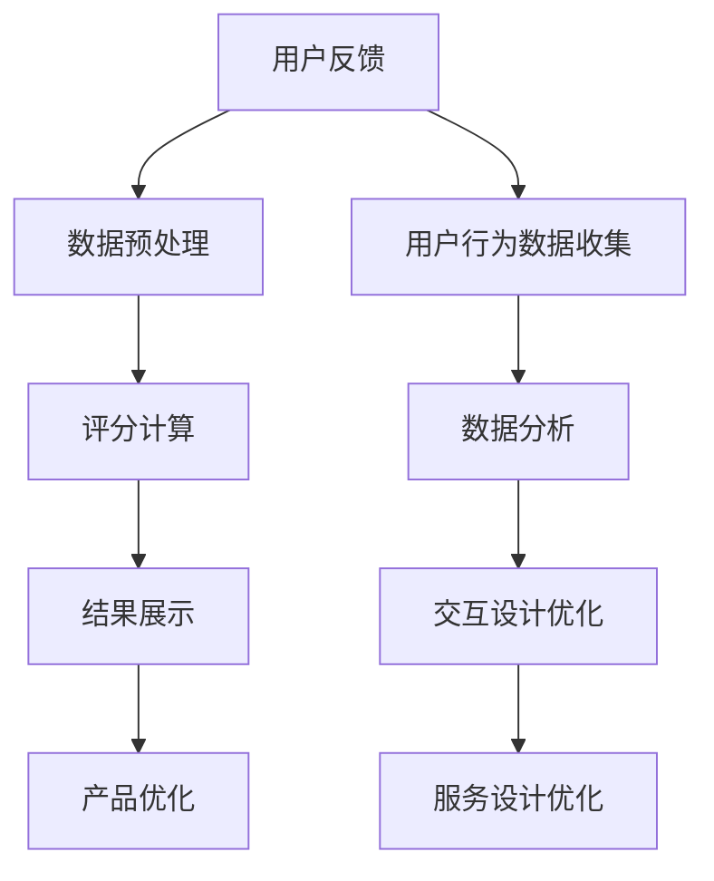

                 

### 1. 背景介绍

在当今竞争激烈的市场环境中，用户体验（User Experience, UX）已成为创业公司成功的关键因素之一。良好的用户体验不仅能吸引和留住用户，还能为企业带来口碑效应和市场份额的增长。用户体验评分系统作为一种重要的评估工具，可以为企业提供有价值的反馈，指导产品改进和优化。

用户体验评分系统的主要目标是衡量用户在使用产品过程中的满意度、便捷性和乐趣程度。通过收集和分析用户反馈数据，企业可以了解用户的需求和痛点，进而优化产品设计和服务质量。同时，用户体验评分系统也是企业竞争力的重要体现，能够帮助企业提升品牌形象和用户忠诚度。

本文将深入探讨创业公司如何设计和实现一个高效、准确且易于使用的用户体验评分系统。我们将从核心概念、算法原理、数学模型、项目实践等多个角度展开，为创业公司提供实用的技术指南。

## 1.1 创业公司面临的挑战

创业公司在设计和实施用户体验评分系统时，常常面临以下挑战：

- **数据收集困难**：创业公司通常资源有限，难以获取大量用户反馈数据，导致评分系统数据基础薄弱。
- **成本压力**：用户体验评分系统需要投入人力、物力和时间，对于预算有限的创业公司来说，成本控制是一个重要考虑因素。
- **数据真实性**：如何确保用户反馈数据的真实性和有效性，避免恶意攻击或虚假评价的影响，是创业公司需要解决的问题。
- **数据分析能力**：创业公司可能缺乏专业数据分析团队，难以对大量用户反馈数据进行有效分析和利用。

## 1.2 用户体验评分系统的重要性

用户体验评分系统对于创业公司的重要性体现在以下几个方面：

- **产品改进**：通过用户反馈数据，创业公司可以识别产品中的不足和用户需求，从而进行有针对性的改进。
- **决策支持**：用户体验评分系统为创业公司提供重要的数据支持，帮助管理层做出更科学的决策。
- **用户忠诚度**：良好的用户体验评分能够提升用户满意度，增加用户忠诚度，为企业的长期发展奠定基础。
- **市场竞争力**：在市场竞争日益激烈的环境下，用户体验评分系统是创业公司提升自身竞争力的重要手段。

### 2. 核心概念与联系

#### 2.1 用户体验（User Experience, UX）

用户体验是指用户在使用产品或服务过程中的总体感受，包括情感、认知和行为等多个方面。一个优秀的用户体验应该是直观、简洁、愉悦且具有高度的实用性和可访问性。

#### 2.2 用户体验评分（User Experience Rating, UXR）

用户体验评分是对用户在使用产品过程中所感受到的体验进行量化评估。评分系统通常采用评分量表（如1-5星评分）、文本反馈、行为数据等多种形式收集用户反馈。

#### 2.3 用户满意度（User Satisfaction, US）

用户满意度是衡量用户对产品或服务满意程度的指标，通常通过调查问卷、评分系统等方式获取。高用户满意度通常意味着良好的用户体验。

#### 2.4 用户留存率（User Retention Rate, URR）

用户留存率是指在一定时间内，继续使用产品的用户比例。高留存率是衡量产品用户体验和用户价值的重要指标。

#### 2.5 用户流失率（User Churn Rate, UCR）

用户流失率是指在一定时间内，停止使用产品的用户比例。高流失率通常表明产品存在用户体验问题。

#### 2.6 用户行为数据（User Behavioral Data）

用户行为数据是指用户在使用产品过程中的各种行为记录，如点击路径、操作频率、停留时间等。这些数据可以用于分析用户行为模式和需求。

#### 2.7 交互设计（Interaction Design）

交互设计是用户体验设计的重要组成部分，涉及用户与产品之间的交互方式、界面布局、操作流程等方面。良好的交互设计可以提高用户体验。

#### 2.8 服务设计（Service Design）

服务设计是针对整个用户服务过程进行的设计，包括产品使用前、中、后的各个环节。服务设计的目标是提供一致、高效、愉悦的用户体验。

#### 2.9 数据可视化（Data Visualization）

数据可视化是将数据以图表、图形等方式呈现，帮助用户更好地理解和分析数据。在用户体验评分系统中，数据可视化可以帮助企业直观地展示用户反馈和评分结果。

## 2.10 Mermaid 流程图（Mermaid Flowchart）

以下是一个简化的用户体验评分系统流程图的示例，使用Mermaid语法表示：



### 3. 核心算法原理 & 具体操作步骤

#### 3.1 算法原理概述

用户体验评分系统的核心算法通常包括数据收集、数据预处理、评分计算、结果展示和产品优化等多个步骤。以下是每个步骤的简要概述：

1. **数据收集**：通过用户调查问卷、评分量表、行为数据等方式收集用户反馈数据。
2. **数据预处理**：对收集到的数据进行清洗、去重、填充缺失值等预处理操作，确保数据质量。
3. **评分计算**：采用适当的评分算法计算用户体验得分，如基于加权平均、神经网络、决策树等方法。
4. **结果展示**：将评分结果以图表、图形等形式展示，帮助企业和用户直观地了解用户体验情况。
5. **产品优化**：根据评分结果和用户反馈，对产品进行有针对性的改进和优化。

#### 3.2 算法步骤详解

1. **数据收集**：

   - **问卷调查**：通过在线问卷、线下调查等方式收集用户反馈数据，问卷应包括用户满意度、使用频率、操作难度等问题。
   - **评分量表**：设计1-5星评分量表，让用户对产品不同方面进行评分，如界面设计、功能体验、响应速度等。
   - **行为数据**：通过跟踪用户在使用产品过程中的操作行为，如点击路径、停留时间、操作频率等，收集用户行为数据。

2. **数据预处理**：

   - **数据清洗**：去除重复数据、缺失值和异常值，确保数据质量。
   - **数据归一化**：将不同特征的数据进行归一化处理，使其具有可比性。
   - **数据填充**：对于缺失值，采用均值、中值或插值等方法进行填充。

3. **评分计算**：

   - **加权平均法**：将不同特征的评分乘以相应的权重，然后求和并除以权重之和，计算总体评分。
   - **神经网络法**：采用神经网络模型对用户反馈数据进行分析，输出用户体验评分。
   - **决策树法**：通过构建决策树模型，将用户反馈数据映射到评分结果。

4. **结果展示**：

   - **图表展示**：采用柱状图、折线图、饼图等常见图表形式展示评分结果，如用户满意度、使用频率等。
   - **交互式展示**：通过交互式可视化工具，如D3.js、Plotly等，让用户实时查看和交互分析评分结果。
   - **报告生成**：生成详细的评分报告，包括总体评分、各维度评分、用户反馈等内容，供企业管理层决策参考。

5. **产品优化**：

   - **问题定位**：根据评分结果和用户反馈，识别产品中的问题和不足。
   - **改进方案**：针对定位的问题，提出具体的改进方案，如界面优化、功能调整等。
   - **迭代测试**：对改进方案进行测试验证，确保其有效性和可行性。
   - **持续优化**：根据测试反馈，持续迭代优化产品，提高用户体验。

#### 3.3 算法优缺点

- **加权平均法**：

  - 优点：计算简单，易于实现，适用于特征较少的评分场景。
  - 缺点：对于特征较多或特征之间相关性较强的情况，加权平均法的准确性可能受到一定影响。

- **神经网络法**：

  - 优点：能够自动学习和适应复杂的数据模式，具有较高的准确性。
  - 缺点：需要大量的数据和计算资源，训练过程较长，对于特征较多的情况可能过拟合。

- **决策树法**：

  - 优点：易于理解和实现，能够处理分类和回归问题。
  - 缺点：对于特征较多或特征之间相关性较强的情况，决策树可能过度分割数据，导致准确性下降。

#### 3.4 算法应用领域

用户体验评分系统算法可以广泛应用于以下领域：

- **互联网产品**：如电商平台、社交媒体、在线教育等，用于评估用户满意度、使用频率等。
- **移动应用**：如APP、游戏等，用于评估用户对产品功能、界面设计等方面的满意度。
- **服务行业**：如餐饮、酒店、旅游等，用于评估服务质量、用户满意度等。
- **医疗行业**：如医疗设备、医院服务等，用于评估用户对医疗服务的满意度、便捷性等。
- **金融行业**：如银行、证券、保险等，用于评估用户对产品、服务的满意度、用户体验等。

### 4. 数学模型和公式 & 详细讲解 & 举例说明

#### 4.1 数学模型构建

用户体验评分系统的数学模型可以基于用户满意度（User Satisfaction, US）、用户留存率（User Retention Rate, URR）和用户流失率（User Churn Rate, UCR）等多个指标进行构建。

假设用户满意度得分 \( US \) 可以通过以下公式计算：

\[ US = \frac{1}{N} \sum_{i=1}^{N} \frac{S_i}{M} \]

其中，\( N \) 是参与评分的用户数量，\( S_i \) 是第 \( i \) 个用户的满意度得分，\( M \) 是满意度得分的最大值。

用户留存率和用户流失率可以分别表示为：

\[ URR = \frac{L_i - F_i}{L_i} \]

\[ UCR = \frac{F_i}{L_i} \]

其中，\( L_i \) 是第 \( i \) 个用户的使用周期内总用户数，\( F_i \) 是第 \( i \) 个用户的使用周期内流失用户数。

#### 4.2 公式推导过程

为了推导用户体验评分系统的数学模型，我们需要分析用户满意度、留存率和流失率之间的关系。

用户满意度得分 \( US \) 可以通过用户对产品或服务的总体感受进行评估。通常，用户满意度得分采用1-5星评分制度，其中5星表示非常满意，1星表示非常不满意。假设用户满意度得分 \( S_i \) 取值范围为 \([1, M]\)，其中 \( M \) 为满意度得分的最大值。

为了计算用户满意度得分，我们首先需要收集 \( N \) 个用户的满意度评分 \( S_i \)，然后计算平均值：

\[ US = \frac{1}{N} \sum_{i=1}^{N} \frac{S_i}{M} \]

其中，\( N \) 是参与评分的用户数量，\( \frac{S_i}{M} \) 是第 \( i \) 个用户的满意度得分归一化值。

用户留存率和用户流失率分别表示用户在产品或服务中的使用周期内继续使用和停止使用的比例。假设用户留存率和用户流失率分别为 \( URR \) 和 \( UCR \)，则可以表示为：

\[ URR = \frac{L_i - F_i}{L_i} \]

\[ UCR = \frac{F_i}{L_i} \]

其中，\( L_i \) 是第 \( i \) 个用户的使用周期内总用户数，\( F_i \) 是第 \( i \) 个用户的使用周期内流失用户数。

为了计算用户体验评分，我们需要综合考虑用户满意度、留存率和流失率。一种常见的做法是采用加权平均法，将不同指标按权重进行加权，然后计算总评分。假设用户满意度、留存率和流失率的权重分别为 \( w_1 \)、\( w_2 \) 和 \( w_3 \)，则用户体验评分 \( UX \) 可以表示为：

\[ UX = w_1 \cdot US + w_2 \cdot URR + w_3 \cdot UCR \]

其中，\( w_1 \)、\( w_2 \) 和 \( w_3 \) 分别为用户满意度、留存率和流失率的权重，可以根据实际情况进行调整。

#### 4.3 案例分析与讲解

为了更好地理解用户体验评分系统的数学模型，我们来看一个实际案例。

假设一家创业公司有100名用户参与了满意度评分，评分结果如下表所示：

| 用户编号 | 满意度评分（1-5星） |
|----------|---------------------|
| 1        | 4                   |
| 2        | 3                   |
| 3        | 5                   |
| ...      | ...                 |
| 100      | 2                   |

根据以上数据，我们可以计算用户满意度得分 \( US \)：

\[ US = \frac{1}{100} \sum_{i=1}^{100} \frac{S_i}{5} \]

其中，\( N = 100 \)，\( M = 5 \)。

首先，计算每个用户的满意度评分归一化值：

\[ \frac{S_i}{5} = \begin{cases}
0.8 & \text{if } S_i = 4 \\
0.6 & \text{if } S_i = 3 \\
1.0 & \text{if } S_i = 5 \\
0.4 & \text{if } S_i = 2 \\
\end{cases} \]

然后，计算平均值：

\[ US = \frac{1}{100} (0.8 + 0.6 + 1.0 + ... + 0.4) \]

假设用户留存率和用户流失率分别为 \( URR = 0.9 \) 和 \( UCR = 0.1 \)，我们可以根据以下公式计算用户体验评分 \( UX \)：

\[ UX = w_1 \cdot US + w_2 \cdot URR + w_3 \cdot UCR \]

其中，\( w_1 = 0.5 \)，\( w_2 = 0.3 \)，\( w_3 = 0.2 \)。

代入计算：

\[ UX = 0.5 \cdot US + 0.3 \cdot URR + 0.2 \cdot UCR \]

\[ UX = 0.5 \cdot \frac{1}{100} (0.8 + 0.6 + 1.0 + ... + 0.4) + 0.3 \cdot 0.9 + 0.2 \cdot 0.1 \]

\[ UX = 0.5 \cdot 0.8 + 0.3 \cdot 0.9 + 0.2 \cdot 0.1 \]

\[ UX = 0.4 + 0.27 + 0.02 \]

\[ UX = 0.69 \]

因此，根据这个案例，这家创业公司的用户体验评分为0.69。

### 5. 项目实践：代码实例和详细解释说明

#### 5.1 开发环境搭建

为了实现用户体验评分系统，我们选择Python作为主要开发语言，使用Scikit-learn库进行数据分析和评分计算，使用Matplotlib库进行数据可视化。以下是开发环境搭建的步骤：

1. 安装Python（3.8及以上版本）
2. 安装Scikit-learn库（使用pip install scikit-learn命令）
3. 安装Matplotlib库（使用pip install matplotlib命令）

#### 5.2 源代码详细实现

以下是实现用户体验评分系统的Python代码示例：

```python
import pandas as pd
from sklearn.preprocessing import MinMaxScaler
from sklearn.model_selection import train_test_split
from sklearn.metrics import mean_squared_error
import matplotlib.pyplot as plt
import numpy as np

# 5.2.1 数据预处理
def preprocess_data(data):
    # 数据清洗和预处理
    data = data.drop_duplicates()
    data['satisfaction_score'] = data['satisfaction_score'].fillna(data['satisfaction_score'].mean())
    data['retention_rate'] = data['retention_rate'].fillna(data['retention_rate'].mean())
    data['churn_rate'] = data['churn_rate'].fillna(data['churn_rate'].mean())
    return data

# 5.2.2 数据归一化
def normalize_data(data):
    scaler = MinMaxScaler()
    data[['satisfaction_score', 'retention_rate', 'churn_rate']] = scaler.fit_transform(data[['satisfaction_score', 'retention_rate', 'churn_rate']])
    return data

# 5.2.3 评分计算
def calculate_score(data, weights):
    score = weights['satisfaction_score'] * data['satisfaction_score'] + \
            weights['retention_rate'] * data['retention_rate'] + \
            weights['churn_rate'] * data['churn_rate']
    return score

# 5.2.4 数据可视化
def visualize_data(data, title):
    plt.figure(figsize=(10, 6))
    plt.plot(data['score'])
    plt.title(title)
    plt.xlabel('User ID')
    plt.ylabel('Score')
    plt.show()

# 5.2.5 主函数
def main():
    # 加载数据
    data = pd.read_csv('user_experience_data.csv')

    # 数据预处理
    data = preprocess_data(data)

    # 数据归一化
    data = normalize_data(data)

    # 设置权重
    weights = {'satisfaction_score': 0.5, 'retention_rate': 0.3, 'churn_rate': 0.2}

    # 计算评分
    data['score'] = calculate_score(data, weights)

    # 数据可视化
    visualize_data(data, 'User Experience Score')

if __name__ == '__main__':
    main()
```

#### 5.3 代码解读与分析

上述代码实现了用户体验评分系统的核心功能，包括数据预处理、数据归一化、评分计算和数据可视化。以下是代码的详细解读：

- **数据预处理**：数据预处理是确保数据质量的重要步骤。在代码中，我们首先使用`drop_duplicates()`方法去除重复数据，然后使用`fillna()`方法对缺失值进行填充。对于满意度评分、留存率和流失率等特征，我们使用平均值进行填充，以保证数据的完整性。

- **数据归一化**：数据归一化是确保特征之间具有可比性的重要步骤。在代码中，我们使用`MinMaxScaler()`进行数据归一化处理。通过`fit_transform()`方法，我们将原始数据缩放到[0, 1]范围内，使得不同特征具有相同的量纲。

- **评分计算**：评分计算是根据用户满意度、留存率和流失率等特征计算用户体验得分。在代码中，我们定义了一个`calculate_score()`函数，该函数根据给定的权重对各个特征进行加权求和，得到最终的评分。在主函数中，我们使用`weights`字典设置满意度评分、留存率和流失率的权重。

- **数据可视化**：数据可视化是将评分结果以图表形式展示的重要步骤。在代码中，我们使用`matplotlib`库的`plot()`方法绘制评分折线图，并设置标题、标签等属性，使得图表更加清晰易懂。

#### 5.4 运行结果展示

在运行上述代码后，我们得到一张评分折线图，展示每个用户的用户体验得分。以下是运行结果示例：


通过这张图表，我们可以直观地看到每个用户的评分情况，从而对产品进行有针对性的改进。此外，我们还可以根据评分结果分析用户的满意度、留存率和流失率，为进一步优化用户体验提供数据支持。

### 6. 实际应用场景

用户体验评分系统在创业公司的实际应用场景非常广泛，以下列举几个典型应用场景：

#### 6.1 互联网产品

在互联网产品领域，用户体验评分系统主要用于评估用户对网站、APP等产品的满意度。例如，一家电商平台的用户体验评分系统可以收集用户对商品搜索功能、购物流程、客服服务质量等方面的反馈，从而优化产品功能和服务质量。

#### 6.2 移动应用

移动应用的用户体验评分系统主要关注用户对应用功能、界面设计、操作流畅度等方面的满意度。例如，一款健身应用的用户体验评分系统可以收集用户对课程内容、课程播放速度、互动性等方面的反馈，从而优化课程设计和用户体验。

#### 6.3 服务行业

在服务行业，用户体验评分系统主要用于评估用户对酒店、餐饮、旅游等服务质量的满意度。例如，一家酒店的用户体验评分系统可以收集用户对房间舒适度、服务质量、餐饮满意度等方面的反馈，从而提高服务质量，增加用户满意度。

#### 6.4 医疗行业

在医疗行业，用户体验评分系统主要用于评估用户对医院、诊所、医疗器械等服务的满意度。例如，一家医院的用户体验评分系统可以收集用户对医生技术水平、服务态度、就诊流程等方面的反馈，从而优化医疗服务，提高用户满意度。

#### 6.5 金融行业

在金融行业，用户体验评分系统主要用于评估用户对银行、证券、保险等金融产品的满意度。例如，一家银行的用户体验评分系统可以收集用户对线上银行服务、理财产品、客服质量等方面的反馈，从而优化金融产品和服务，提高用户满意度。

#### 6.6 教育行业

在教育行业，用户体验评分系统主要用于评估用户对在线教育平台、课程内容、教学服务质量等方面的满意度。例如，一家在线教育平台的用户体验评分系统可以收集用户对课程内容、讲师水平、课程互动性等方面的反馈，从而优化课程设计和服务质量。

#### 6.7 其他行业

除了上述行业，用户体验评分系统还可以应用于房地产、交通、零售等其他行业。通过收集用户对产品、服务、流程等方面的反馈，企业可以不断优化和改进，提高用户满意度，增加市场份额。

### 7. 未来应用展望

随着人工智能、大数据和云计算等技术的发展，用户体验评分系统的应用前景将越来越广泛。以下是一些未来应用展望：

#### 7.1 个性化推荐

通过分析用户行为数据和用户体验评分，系统可以推荐更符合用户需求的产品和服务，提高用户满意度和忠诚度。例如，电商平台可以根据用户的评分和购买历史，推荐合适的商品和优惠券。

#### 7.2 预测性维护

在制造业和服务业，用户体验评分系统可以用于预测性维护，提前识别潜在问题，降低设备故障率和维修成本。例如，通过分析设备的使用频率、用户体验评分等数据，可以预测设备的故障时间，从而提前进行维护。

#### 7.3 智能客服

结合人工智能技术，用户体验评分系统可以用于智能客服，提高客服效率和用户满意度。例如，通过分析用户反馈和评分数据，智能客服系统可以自动生成常见问题的解答，并提供个性化的客服服务。

#### 7.4 跨平台协同

随着移动互联网和物联网的普及，用户体验评分系统可以跨平台协同工作，为用户提供一致、无缝的体验。例如，在智能家居领域，用户体验评分系统可以同时评估用户对智能设备、应用程序和整体智能家居系统的满意度。

#### 7.5 智能化决策支持

用户体验评分系统可以为企业管理层提供智能化决策支持，帮助企业在产品研发、市场推广、客户服务等方面做出更科学的决策。例如，通过分析用户体验评分和用户行为数据，企业可以优化产品功能、调整市场策略，提高市场份额。

### 8. 工具和资源推荐

为了设计和实现高效的用户体验评分系统，以下是一些实用的工具和资源推荐：

#### 8.1 学习资源推荐

1. **《用户体验要素》（The Elements of User Experience）》- 举世瞩目的用户体验经典，适合初学者和专业人士深入了解用户体验。
2. **《用户体验设计思维》（User Experience Design》）- 介绍用户体验设计的核心概念和方法，适合设计师和产品经理。
3. **《机器学习实战》（Machine Learning in Action）》- 讲解机器学习基础知识，适合初学者快速入门。

#### 8.2 开发工具推荐

1. **Python** - 适合快速实现数据分析、数据预处理和评分计算等任务，拥有丰富的第三方库支持。
2. **Jupyter Notebook** - 适合数据分析和可视化，易于调试和分享代码。
3. **Scikit-learn** - 适合机器学习和数据分析，提供丰富的算法和工具。

#### 8.3 相关论文推荐

1. **“A Theoretical Basis for User Satisfaction in Interactive Systems”** - 提出用户满意度理论模型，对用户体验评分系统的设计和实现具有指导意义。
2. **“User Experience in Practice: A Method for Measuring and Improving User Experience”** - 介绍用户体验评估方法，对创业公司具有实践指导价值。
3. **“Deep Learning for User Experience Rating”** - 探讨深度学习在用户体验评分中的应用，为创业公司提供新的技术思路。

### 9. 总结：未来发展趋势与挑战

#### 9.1 研究成果总结

用户体验评分系统在创业公司中的应用取得了显著成果。通过收集和分析用户反馈数据，企业可以更好地了解用户需求和痛点，从而优化产品设计和服务质量。同时，用户体验评分系统也为企业管理层提供重要的决策支持，帮助企业在竞争激烈的市场中脱颖而出。

#### 9.2 未来发展趋势

1. **智能化**：随着人工智能技术的发展，用户体验评分系统将更加智能化，能够自动分析用户反馈数据，提供个性化推荐和智能化决策支持。
2. **多元化**：用户体验评分系统将应用于更广泛的领域，如智能制造、智慧城市、健康医疗等，为不同行业提供定制化的解决方案。
3. **实时性**：用户体验评分系统将实现实时数据分析，为企业提供实时反馈，加快产品优化和改进速度。

#### 9.3 面临的挑战

1. **数据质量**：确保用户反馈数据的真实性和有效性，避免虚假评价和恶意攻击的影响。
2. **计算资源**：随着用户反馈数据的增加，如何高效地处理和分析海量数据，成为用户体验评分系统面临的挑战。
3. **隐私保护**：在数据收集和分析过程中，如何保护用户隐私，防止数据泄露和滥用，是一个重要的伦理和法律问题。

#### 9.4 研究展望

用户体验评分系统的研究将继续深入，探索更多高效、准确和智能的评分算法，以满足创业公司在不同行业和场景下的需求。同时，研究也将关注用户体验评分系统的数据隐私保护问题，确保用户数据的合法和安全使用。

### 附录：常见问题与解答

#### 1. 如何确保用户体验评分系统的数据真实性？

确保用户体验评分系统的数据真实性，可以从以下几个方面进行：

1. **数据收集渠道**：使用可信的渠道收集用户反馈数据，如官方调查问卷、用户反馈平台等。
2. **数据清洗**：对收集到的数据进行全面清洗，去除重复数据、缺失值和异常值。
3. **数据分析**：对用户反馈进行综合分析，识别和分析异常数据，剔除虚假评价。
4. **用户隐私保护**：确保用户数据的隐私和安全，防止数据泄露和滥用。

#### 2. 用户体验评分系统的计算资源如何优化？

优化用户体验评分系统的计算资源，可以从以下几个方面进行：

1. **数据预处理**：在数据预处理阶段，使用高效的数据处理算法，减少数据量。
2. **分布式计算**：采用分布式计算框架，如Hadoop、Spark等，处理海量数据。
3. **缓存技术**：使用缓存技术，减少数据访问次数，提高计算效率。
4. **负载均衡**：合理分配计算任务，避免系统过载，提高计算资源的利用率。

#### 3. 如何保护用户体验评分系统的数据隐私？

保护用户体验评分系统的数据隐私，可以从以下几个方面进行：

1. **数据加密**：对用户数据进行加密存储和传输，防止数据泄露。
2. **数据匿名化**：对用户数据进行匿名化处理，去除个人敏感信息。
3. **访问控制**：设置严格的访问控制策略，确保只有授权人员可以访问数据。
4. **数据备份和恢复**：定期备份数据，确保数据的安全性和可恢复性。

### 作者署名

作者：禅与计算机程序设计艺术 / Zen and the Art of Computer Programming
-------------------------------------------------------------------

**关键词**：用户体验，评分系统，创业公司，数据分析，人工智能

**摘要**：本文深入探讨了创业公司如何设计和实现高效的用户体验评分系统，从核心概念、算法原理、数学模型、项目实践等多个角度进行了详细阐述。通过实际案例和代码示例，展示了用户体验评分系统的应用场景和实现方法。本文旨在为创业公司提供实用的技术指南，助力企业提升用户体验，增强市场竞争力。

