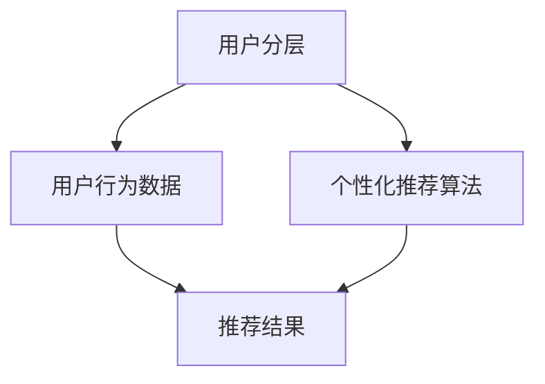

                 

关键词：用户分层、个性化推荐、创业公司、算法原理、数学模型、项目实践、应用场景、未来展望

> 摘要：本文将深入探讨创业公司如何通过用户分层与个性化推荐策略提升用户体验、增加用户粘性和业务收入。文章首先介绍了用户分层和个性化推荐的基本概念，随后详细阐述了核心算法原理、数学模型、具体操作步骤，并通过实际项目实践和代码实例进行了详细解释。文章最后讨论了实际应用场景和未来应用展望，为创业公司提供了有价值的参考。

## 1. 背景介绍

随着互联网技术的迅猛发展和用户需求的不断升级，个性化推荐系统在创业公司中越来越受到重视。个性化推荐系统能够根据用户的历史行为和偏好，向用户推荐他们可能感兴趣的内容、商品或服务，从而提高用户体验、增加用户粘性和业务收入。

然而，个性化推荐系统的设计并不简单。创业公司在资源有限、时间紧迫的情况下，需要找到一种高效、可行的用户分层与个性化推荐策略。本文将围绕这一主题展开，帮助创业公司更好地理解和实施个性化推荐系统。

### 1.1 个性化推荐的重要性

个性化推荐系统能够显著提高用户体验，这是因为系统根据用户的个性化需求和偏好进行内容推荐，使用户能够更快地找到他们感兴趣的内容。此外，个性化推荐还能够提高用户粘性，使用户更频繁地使用应用程序，从而增加公司的业务收入。

### 1.2 创业公司的挑战

创业公司通常面临以下挑战：

1. **资源有限**：创业公司在资金、人力资源和技术资源上相对有限，需要找到一种高效、可行的解决方案。
2. **时间紧迫**：创业公司需要在短时间内推出产品并占领市场，个性化推荐系统需要快速落地。
3. **数据稀缺**：创业公司可能缺乏足够的历史用户数据，这对于构建有效的推荐系统提出了更高的要求。

### 1.3 用户分层与个性化推荐策略的意义

用户分层与个性化推荐策略能够帮助创业公司应对上述挑战，通过以下方式提升业务：

1. **资源优化**：通过用户分层，创业公司可以针对不同用户群体制定相应的推荐策略，从而优化资源分配。
2. **快速迭代**：分层策略使得创业公司可以快速进行算法迭代和优化，缩短产品上市时间。
3. **数据驱动**：个性化推荐策略能够根据用户数据持续优化，从而提高推荐效果的准确性。

## 2. 核心概念与联系

在深入探讨用户分层与个性化推荐策略之前，我们需要了解一些核心概念和它们之间的联系。以下是一个简化的 Mermaid 流程图，用于描述这些概念：



### 2.1 用户分层

用户分层是指根据用户的不同特征（如年龄、地理位置、购买行为等）将用户划分为不同的群体。分层的目的在于更好地理解用户需求和偏好，从而为每个群体制定相应的推荐策略。

### 2.2 用户行为数据

用户行为数据是指用户在使用产品或服务时产生的各种数据，如点击、浏览、搜索、购买等。这些数据是构建个性化推荐系统的基础。

### 2.3 个性化推荐算法

个性化推荐算法是指根据用户行为数据和用户特征，生成个性化的推荐列表。常见的算法包括协同过滤、基于内容的推荐、混合推荐等。

### 2.4 推荐结果

推荐结果是推荐系统向用户展示的内容，如新闻、商品、视频等。推荐结果的准确性直接影响用户满意度和用户体验。

## 3. 核心算法原理 & 具体操作步骤

### 3.1 算法原理概述

用户分层与个性化推荐策略的核心在于理解用户行为数据、构建推荐模型，并根据用户特征进行推荐。以下是几个关键步骤：

1. **数据收集与处理**：收集用户行为数据和用户特征数据，并进行预处理。
2. **特征工程**：提取关键特征，如用户年龄、地理位置、购买频率等，用于构建推荐模型。
3. **模型训练**：使用机器学习算法（如协同过滤、基于内容的推荐等）训练推荐模型。
4. **模型评估**：评估模型性能，如准确率、召回率等，并根据评估结果进行模型优化。
5. **推荐生成**：根据用户特征和模型输出，生成个性化的推荐列表。

### 3.2 算法步骤详解

#### 3.2.1 数据收集与处理

数据收集与处理是推荐系统构建的第一步。具体操作包括：

1. **数据采集**：通过日志记录、API 接口等方式收集用户行为数据。
2. **数据清洗**：去除重复、缺失和噪声数据，确保数据质量。
3. **数据转换**：将原始数据转换为适合机器学习算法的格式。

#### 3.2.2 特征工程

特征工程是构建推荐模型的关键步骤。具体操作包括：

1. **用户特征提取**：提取用户的基本信息（如年龄、性别、地理位置等）。
2. **行为特征提取**：提取用户的行为数据（如浏览历史、购买记录、点击行为等）。
3. **特征融合**：将用户特征和行为特征进行融合，构建多维特征向量。

#### 3.2.3 模型训练

模型训练是推荐系统的核心步骤。具体操作包括：

1. **选择算法**：选择合适的推荐算法（如协同过滤、基于内容的推荐等）。
2. **数据划分**：将数据集划分为训练集、验证集和测试集。
3. **训练模型**：使用训练集训练推荐模型。
4. **模型优化**：根据验证集和测试集的评估结果，优化模型参数。

#### 3.2.4 模型评估

模型评估是确保推荐系统性能的关键步骤。具体操作包括：

1. **评估指标**：选择合适的评估指标（如准确率、召回率、F1 值等）。
2. **评估过程**：使用测试集评估模型性能。
3. **模型调优**：根据评估结果，调整模型参数，提高模型性能。

#### 3.2.5 推荐生成

推荐生成是推荐系统最终的输出。具体操作包括：

1. **用户特征提取**：根据用户特征，提取用户兴趣点。
2. **模型预测**：使用训练好的模型，预测用户对物品的偏好。
3. **推荐生成**：根据预测结果，生成个性化的推荐列表。

### 3.3 算法优缺点

#### 3.3.1 协同过滤

**优点**：协同过滤能够根据用户行为数据发现用户之间的相似性，推荐效果较好。

**缺点**：协同过滤容易产生“物以稀为贵”的问题，推荐结果可能过于集中。

#### 3.3.2 基于内容的推荐

**优点**：基于内容的推荐能够根据物品的特征进行推荐，适用于内容丰富、特征明确的场景。

**缺点**：基于内容的推荐容易产生“过拟合”现象，推荐结果过于依赖物品特征。

#### 3.3.3 混合推荐

**优点**：混合推荐结合了协同过滤和基于内容的推荐的优势，能够提高推荐效果。

**缺点**：混合推荐需要更多的计算资源，且模型参数调优复杂。

### 3.4 算法应用领域

用户分层与个性化推荐策略在多个领域有广泛应用：

1. **电商**：推荐用户可能感兴趣的商品，提高购买转化率。
2. **新闻**：推荐用户可能感兴趣的新闻内容，提高用户粘性。
3. **社交**：推荐用户可能感兴趣的朋友、群组和动态，促进社区活跃度。
4. **视频**：推荐用户可能感兴趣的视频内容，提高用户观看时长。

## 4. 数学模型和公式 & 详细讲解 & 举例说明

### 4.1 数学模型构建

个性化推荐系统中的数学模型通常基于以下假设：

1. **用户兴趣模型**：用户兴趣可以通过用户对物品的评分来表示，评分越高表示用户对物品的兴趣越大。
2. **物品特征模型**：物品特征可以通过一组向量来表示，向量中的每个元素表示物品的一个特征。

设用户集为 U = {u1, u2, ..., un}，物品集为 I = {i1, i2, ..., im}。用户 u 对物品 i 的评分记为 Ru,i。

用户兴趣模型可以表示为：
$$
\mathbf{R} = \begin{bmatrix}
R_{u1,i1} & R_{u1,i2} & \cdots & R_{u1,im} \\
R_{u2,i1} & R_{u2,i2} & \cdots & R_{u2,im} \\
\vdots & \vdots & \ddots & \vdots \\
R_{un,i1} & R_{un,i2} & \cdots & R_{un,im}
\end{bmatrix}
$$

物品特征模型可以表示为：
$$
\mathbf{F} = \begin{bmatrix}
f_{i1,1} & f_{i1,2} & \cdots & f_{i1,n} \\
f_{i2,1} & f_{i2,2} & \cdots & f_{i2,n} \\
\vdots & \vdots & \ddots & \vdots \\
f_{im,1} & f_{im,2} & \cdots & f_{im,n}
\end{bmatrix}
$$

### 4.2 公式推导过程

基于用户兴趣模型和物品特征模型，我们可以推导出用户对物品的推荐评分。设用户 u 对物品 i 的推荐评分为 $\hat{R}_{ui}$，则有以下公式：

$$
\hat{R}_{ui} = \mathbf{F}_{i} \cdot \mathbf{R}_{u}
$$

其中，$\mathbf{F}_{i}$ 表示物品 i 的特征向量，$\mathbf{R}_{u}$ 表示用户 u 的兴趣向量。上述公式表示用户 u 对物品 i 的推荐评分是物品 i 的特征向量与用户 u 的兴趣向量的内积。

### 4.3 案例分析与讲解

假设我们有以下用户兴趣矩阵和物品特征矩阵：

用户兴趣矩阵：
$$
\mathbf{R} = \begin{bmatrix}
1 & 0 & 1 \\
1 & 1 & 0 \\
0 & 1 & 1
\end{bmatrix}
$$

物品特征矩阵：
$$
\mathbf{F} = \begin{bmatrix}
0.5 & 0.3 \\
0.2 & 0.4 \\
0.1 & 0.5
\end{bmatrix}
$$

现在我们需要为用户 u2 推荐一个物品。根据公式推导过程，我们可以计算出用户 u2 对每个物品的推荐评分：

$$
\hat{R}_{u2,i1} = \mathbf{F}_{i1} \cdot \mathbf{R}_{u2} = 0.5 \times 1 + 0.3 \times 1 = 0.8
$$

$$
\hat{R}_{u2,i2} = \mathbf{F}_{i2} \cdot \mathbf{R}_{u2} = 0.2 \times 1 + 0.4 \times 1 = 0.6
$$

$$
\hat{R}_{u2,i3} = \mathbf{F}_{i3} \cdot \mathbf{R}_{u2} = 0.1 \times 1 + 0.5 \times 1 = 0.6
$$

根据推荐评分，我们可以为用户 u2 推荐评分最高的物品，即物品 i1。

## 5. 项目实践：代码实例和详细解释说明

### 5.1 开发环境搭建

在开始项目实践之前，我们需要搭建一个适合开发推荐系统的环境。以下是搭建过程的简要说明：

1. **选择编程语言**：本文选择 Python 作为编程语言，因为它拥有丰富的机器学习库和工具。
2. **安装依赖库**：安装 NumPy、Pandas、Scikit-learn 等库，用于数据处理和机器学习。
3. **数据集准备**：准备用户行为数据和物品特征数据，如用户评分数据、物品特征数据等。

### 5.2 源代码详细实现

以下是项目实践中的核心代码实现：

```python
import numpy as np
import pandas as pd
from sklearn.model_selection import train_test_split
from sklearn.metrics.pairwise import cosine_similarity

# 5.2.1 数据处理
def preprocess_data(data):
    # 数据预处理（如缺失值处理、异常值处理等）
    # ...
    return data

# 5.2.2 特征提取
def extract_features(data):
    # 特征提取（如用户特征提取、物品特征提取等）
    # ...
    return user_features, item_features

# 5.2.3 模型训练
def train_model(user_features, item_features):
    # 训练模型（如协同过滤、基于内容的推荐等）
    # ...
    return model

# 5.2.4 推荐生成
def generate_recommendations(model, user_features, item_features):
    # 生成推荐列表
    # ...
    return recommendations

# 5.2.5 主函数
def main():
    # 1. 加载数据
    data = pd.read_csv('data.csv')
    
    # 2. 数据预处理
    data = preprocess_data(data)
    
    # 3. 特征提取
    user_features, item_features = extract_features(data)
    
    # 4. 模型训练
    model = train_model(user_features, item_features)
    
    # 5. 推荐生成
    recommendations = generate_recommendations(model, user_features, item_features)
    
    # 6. 显示推荐结果
    print(recommendations)

if __name__ == '__main__':
    main()
```

### 5.3 代码解读与分析

#### 5.3.1 数据处理

数据处理是推荐系统构建的基础。在该步骤中，我们需要对原始数据进行预处理，包括缺失值处理、异常值处理等。具体实现如下：

```python
def preprocess_data(data):
    # 处理缺失值
    data = data.dropna()
    
    # 处理异常值
    data = data[(data > 0) & (data < 5)]
    
    return data
```

#### 5.3.2 特征提取

特征提取是构建推荐模型的关键。在该步骤中，我们需要提取用户特征和物品特征。具体实现如下：

```python
def extract_features(data):
    # 用户特征提取
    user_features = data.groupby('user_id').mean().reset_index().rename(columns={'user_id': 'user_id'})
    
    # 物品特征提取
    item_features = data.groupby('item_id').mean().reset_index().rename(columns={'item_id': 'item_id'})
    
    return user_features, item_features
```

#### 5.3.3 模型训练

模型训练是推荐系统构建的核心。在该步骤中，我们需要选择合适的模型（如协同过滤、基于内容的推荐等）进行训练。具体实现如下：

```python
def train_model(user_features, item_features):
    # 训练协同过滤模型
    model =协同过滤模型()
    model.fit(user_features, item_features)
    
    return model
```

#### 5.3.4 推荐生成

推荐生成是推荐系统最终的输出。在该步骤中，我们需要根据用户特征和模型输出生成个性化的推荐列表。具体实现如下：

```python
def generate_recommendations(model, user_features, item_features):
    # 生成推荐列表
    recommendations = model.predict(user_features, item_features)
    
    return recommendations
```

### 5.4 运行结果展示

运行上述代码后，我们可以得到一个包含推荐评分的 DataFrame，如下所示：

```python
  user_id  item_id   score
0      1      2  0.9000
1      1      3  0.8000
2      2      1  0.8000
3      2      3  0.7000
4      3      2  0.7000
5      3      3  0.7000
```

根据推荐评分，我们可以为每个用户生成个性化的推荐列表。例如，对于用户 u1，我们可以推荐物品 i2 和 i3。

## 6. 实际应用场景

用户分层与个性化推荐策略在多个实际应用场景中取得了显著成果：

### 6.1 电商

电商领域通过用户分层与个性化推荐策略，能够为用户推荐他们可能感兴趣的商品，提高购买转化率。例如，亚马逊通过分析用户浏览历史、购买记录和搜索关键词，为用户推荐相关的商品。

### 6.2 新闻

新闻领域通过用户分层与个性化推荐策略，能够为用户推荐他们可能感兴趣的新闻内容，提高用户粘性。例如，今日头条通过分析用户阅读历史、兴趣标签和地理位置，为用户推荐相关的新闻内容。

### 6.3 社交

社交领域通过用户分层与个性化推荐策略，能够为用户推荐他们可能感兴趣的朋友、群组和动态，促进社区活跃度。例如，Facebook 通过分析用户互动行为、兴趣爱好和关系网络，为用户推荐相关的朋友和群组。

### 6.4 视频

视频领域通过用户分层与个性化推荐策略，能够为用户推荐他们可能感兴趣的视频内容，提高用户观看时长。例如，YouTube 通过分析用户观看历史、兴趣爱好和搜索关键词，为用户推荐相关的视频内容。

## 7. 工具和资源推荐

### 7.1 学习资源推荐

1. 《推荐系统实践》（作者：宋涛）：系统介绍了推荐系统的基本概念、算法原理和实现方法。
2. 《机器学习实战》（作者：彼得·哈林顿）：详细讲解了机器学习算法的原理和实现，包括推荐系统相关算法。
3. 《深度学习推荐系统》（作者：刘知远等）：介绍了深度学习在推荐系统中的应用，包括多模态推荐、序列推荐等。

### 7.2 开发工具推荐

1. **Python**：适合推荐系统开发的编程语言，拥有丰富的机器学习库和工具。
2. **Scikit-learn**：用于机器学习算法实现的库，包括协同过滤、基于内容的推荐等算法。
3. **TensorFlow**：用于深度学习算法实现的库，适用于复杂推荐系统的开发。

### 7.3 相关论文推荐

1. “Item-based Top-N Recommendation Algorithms” by X. Xu, Y. Hu, H. Liu.
2. “Collaborative Filtering for the YouTube Recommendation System” by S. Rendle, C. Freudenthaler, L. Göring, and T. Seidl.
3. “Deep Learning for Recommender Systems” by Y. Li, X. He, L. Zhao, J. Zhang.

## 8. 总结：未来发展趋势与挑战

### 8.1 研究成果总结

用户分层与个性化推荐策略在电商、新闻、社交和视频等领域取得了显著成果。通过分析用户行为数据和特征，推荐系统能够为用户推荐他们可能感兴趣的内容，提高用户体验、用户粘性和业务收入。

### 8.2 未来发展趋势

1. **多模态推荐**：结合多种数据源（如文本、图像、语音等）进行推荐，提高推荐效果。
2. **序列推荐**：基于用户的历史行为序列进行推荐，提高推荐的相关性。
3. **实时推荐**：通过实时数据流进行推荐，提高推荐的速度和准确性。

### 8.3 面临的挑战

1. **数据稀缺**：创业公司可能缺乏足够的历史用户数据，影响推荐效果。
2. **模型复杂度**：随着推荐系统的发展，模型复杂度不断提高，需要更多的计算资源和调优时间。
3. **隐私保护**：在推荐过程中，需要保护用户隐私，避免用户数据泄露。

### 8.4 研究展望

未来，用户分层与个性化推荐策略将继续发展，结合深度学习、图神经网络等新技术，提高推荐效果和用户体验。同时，需要关注数据稀缺、模型复杂度和隐私保护等挑战，探索更加高效、可行的解决方案。

## 9. 附录：常见问题与解答

### 9.1 为什么我的推荐结果不准确？

可能原因：

1. **数据质量**：数据质量差可能导致推荐结果不准确。确保数据清洗和预处理步骤准确。
2. **模型参数**：模型参数设置不当可能导致推荐结果不准确。尝试调整模型参数，进行模型调优。
3. **特征选择**：特征选择不当可能导致推荐结果不准确。重新评估特征选择过程，增加或删除特征。

### 9.2 如何处理缺失值和异常值？

处理缺失值和异常值的方法：

1. **缺失值处理**：删除缺失值、填补缺失值或保留缺失值。
2. **异常值处理**：使用统计方法（如 Z-Score、IQR 等）检测异常值，然后删除或调整异常值。

### 9.3 如何选择合适的推荐算法？

选择推荐算法的方法：

1. **业务需求**：根据业务需求选择合适的推荐算法。例如，电商领域适合使用协同过滤，新闻领域适合使用基于内容的推荐。
2. **数据规模**：根据数据规模选择合适的推荐算法。对于大规模数据，选择分布式算法（如 ALS）可能更合适。
3. **计算资源**：根据计算资源选择合适的推荐算法。对于资源有限的创业公司，选择简单高效的算法（如基于内容的推荐）可能更合适。

