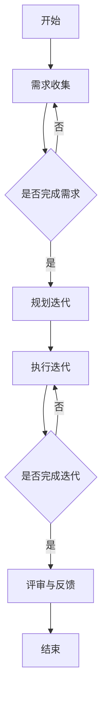

                 

关键词：创业公司、用户反馈、快速迭代、敏捷开发、用户参与、需求收集、迭代流程、用户满意度、产品改进、数据分析、用户体验设计、技术创新。

## 摘要

本文探讨了创业公司在产品开发和迭代过程中，如何有效收集用户反馈并进行快速迭代。通过分析用户需求、构建反馈机制、应用敏捷开发方法以及实施数据分析，企业可以不断提升用户体验，从而加速产品成熟并实现商业成功。文章将结合实际案例，详细阐述从用户反馈到产品改进的整个流程，并为创业公司提供实用的策略和工具。

## 1. 背景介绍

在当今竞争激烈的市场环境中，创业公司要想脱颖而出，就必须在产品开发上保持敏捷和灵活性。传统的瀑布式开发模式往往难以应对快速变化的市场需求，而敏捷开发方法（Agile Development）则以其迭代、协作和快速响应的特点，成为了创业公司的首选。

用户反馈是敏捷开发的核心之一，它不仅能够帮助企业了解用户的需求和痛点，还可以为产品改进提供直接的依据。快速迭代（Iterative Development）则是敏捷开发的重要组成部分，通过不断的小步快跑，企业可以在短时间内推出多个版本，及时调整方向，降低开发风险。

创业公司通常资源有限，因此如何在有限的资源下，有效地收集用户反馈并快速迭代产品，成为了成功的关键。本文将深入探讨这一过程，并提供具体的策略和案例。

## 2. 核心概念与联系

### 2.1 敏捷开发

敏捷开发是一种以人为核心、迭代、渐进的产品开发方法。其核心理念包括：

- **快速迭代**：将整个项目分解为多个小迭代，每个迭代完成一部分功能。
- **用户参与**：鼓励用户全程参与，确保产品符合市场需求。
- **持续交付**：不断交付可工作的产品版本，及时响应变化。

### 2.2 用户反馈

用户反馈是产品改进的重要来源。有效的用户反馈机制包括：

- **反馈渠道**：提供多种渠道供用户反馈，如在线调查、社交媒体、用户论坛等。
- **数据分析**：对用户反馈进行统计分析，识别共性问题和需求。
- **快速响应**：及时处理用户反馈，体现企业的响应速度和服务态度。

### 2.3 快速迭代

快速迭代是敏捷开发的核心。其流程通常包括：

- **需求收集**：收集用户需求，并将其转化为可执行的任务。
- **规划迭代**：确定每个迭代的目标和任务，分配资源和时间。
- **执行迭代**：开发团队按照计划进行工作，完成特定功能。
- **评审与反馈**：在每个迭代结束时，对产品进行评审，收集用户反馈，准备下一个迭代。

### 2.4 Mermaid 流程图

以下是一个简化的敏捷开发流程的 Mermaid 流程图：



## 3. 核心算法原理 & 具体操作步骤

### 3.1 算法原理概述

用户反馈收集与快速迭代的核心算法原理主要包括以下几个步骤：

1. **需求收集**：通过问卷调查、用户访谈、在线反馈表单等方式收集用户需求。
2. **数据分析**：对收集到的用户反馈进行统计分析，识别共性问题和需求。
3. **优先级排序**：根据用户反馈的重要性和紧急程度，对需求进行优先级排序。
4. **迭代计划**：将高优先级的需求纳入下一个迭代计划，分配资源。
5. **实施迭代**：按照计划进行开发，并在每个迭代结束时进行评审和反馈。
6. **持续改进**：根据用户反馈和产品表现，不断调整迭代计划，优化产品。

### 3.2 算法步骤详解

#### 3.2.1 需求收集

需求收集是用户反馈收集与快速迭代的第一步。具体步骤如下：

1. **确定需求收集渠道**：根据产品特点和企业资源，选择合适的收集渠道，如在线问卷调查、用户访谈、社交媒体等。
2. **设计问卷或访谈大纲**：设计有针对性的问卷或访谈大纲，确保能够全面收集用户需求。
3. **发布问卷或邀请访谈**：通过邮件、社交媒体、产品内嵌问卷等方式，邀请用户参与反馈。
4. **收集并整理数据**：收集用户反馈，并进行初步整理和分类。

#### 3.2.2 数据分析

数据分析是用户反馈收集的核心。具体步骤如下：

1. **数据预处理**：对收集到的数据进行清洗、去重、分类等预处理工作。
2. **统计分析**：使用统计工具（如Excel、Python等）对用户反馈进行统计分析，识别共性问题和需求。
3. **可视化展示**：通过图表、报表等形式，将分析结果可视化，便于理解和决策。

#### 3.2.3 优先级排序

根据用户反馈的重要性和紧急程度，对需求进行优先级排序。具体步骤如下：

1. **分类需求**：将用户反馈按主题、功能、优先级等进行分类。
2. **确定优先级**：结合产品规划和市场需求，确定每个需求的优先级。
3. **排序需求**：根据优先级，对需求进行排序，制定迭代计划。

#### 3.2.4 迭代计划

迭代计划是快速迭代的关键。具体步骤如下：

1. **确定迭代周期**：根据团队资源和产品需求，确定每个迭代的时间周期。
2. **分配任务**：将高优先级的需求分配给开发团队，制定详细的工作计划。
3. **资源调度**：根据任务需求，合理调度团队资源，确保任务按时完成。
4. **评审与反馈**：在每个迭代结束时，对产品进行评审，收集用户反馈，为下一个迭代做准备。

#### 3.2.5 实施迭代

实施迭代是快速迭代的执行环节。具体步骤如下：

1. **开发任务**：按照迭代计划，开发团队开展相关工作，完成特定功能。
2. **测试与调试**：对开发完成的功能进行测试和调试，确保产品质量。
3. **用户测试**：邀请部分用户参与测试，收集测试反馈，优化产品。
4. **上线发布**：在确保产品质量的基础上，将迭代成果上线发布。

#### 3.2.6 持续改进

持续改进是快速迭代的核心。具体步骤如下：

1. **收集反馈**：在每个迭代结束后，收集用户反馈和产品表现数据。
2. **分析问题**：结合用户反馈和产品表现，分析存在的问题和改进空间。
3. **调整计划**：根据分析结果，调整迭代计划，优化产品开发方向。
4. **持续优化**：通过不断的小步快跑，持续优化产品，提升用户体验。

### 3.3 算法优缺点

#### 优点

1. **快速响应**：通过快速迭代，企业可以快速响应用户需求，提高产品竞争力。
2. **高效开发**：迭代开发方式有助于提高开发效率，降低开发成本。
3. **用户参与**：用户全程参与，确保产品符合市场需求，提升用户满意度。

#### 缺点

1. **资源消耗**：快速迭代需要大量的人力、物力和时间投入，对资源消耗较大。
2. **风险管理**：由于迭代频繁，开发过程中可能会遇到各种风险，需要有效应对。
3. **管理难度**：快速迭代对项目管理要求较高，需要专业团队进行有效管理。

### 3.4 算法应用领域

快速迭代算法在创业公司中具有广泛的应用领域，包括：

1. **互联网产品**：如社交平台、电商平台、在线教育等。
2. **移动应用**：如手机游戏、办公应用、健康类应用等。
3. **硬件产品**：如智能穿戴设备、智能家居设备、汽车电子等。

## 4. 数学模型和公式 & 详细讲解 & 举例说明

### 4.1 数学模型构建

用户反馈收集与快速迭代的数学模型主要包括以下几个方面：

1. **需求优先级模型**：根据用户反馈的严重程度、频率和影响力，构建需求优先级模型。
2. **迭代效率模型**：根据迭代周期、任务完成情况和资源利用率，构建迭代效率模型。
3. **用户满意度模型**：根据用户反馈和产品表现，构建用户满意度模型。

### 4.2 公式推导过程

#### 需求优先级模型

需求优先级模型的构建可以采用以下公式：

\[ P_i = w_1 \times S_i + w_2 \times F_i + w_3 \times I_i \]

其中：

- \( P_i \) 为需求优先级；
- \( w_1 \)、\( w_2 \)、\( w_3 \) 为权重系数，分别表示严重程度、频率和影响力的权重；
- \( S_i \) 为需求严重程度；
- \( F_i \) 为需求频率；
- \( I_i \) 为需求影响力。

#### 迭代效率模型

迭代效率模型的构建可以采用以下公式：

\[ E = \frac{C}{T} \]

其中：

- \( E \) 为迭代效率；
- \( C \) 为完成的任务数；
- \( T \) 为迭代周期。

#### 用户满意度模型

用户满意度模型的构建可以采用以下公式：

\[ S = \frac{U}{N} \]

其中：

- \( S \) 为用户满意度；
- \( U \) 为满意的用户数；
- \( N \) 为参与反馈的用户总数。

### 4.3 案例分析与讲解

#### 案例一：需求优先级模型

假设某创业公司收集到以下用户反馈：

- 反馈1：严重程度5，频率10，影响力8；
- 反馈2：严重程度4，频率5，影响力6；
- 反馈3：严重程度3，频率3，影响力5。

根据需求优先级模型，我们可以计算每个反馈的优先级：

- 反馈1的优先级 \( P_1 = 0.3 \times 5 + 0.3 \times 10 + 0.4 \times 8 = 11 \)；
- 反馈2的优先级 \( P_2 = 0.3 \times 4 + 0.3 \times 5 + 0.4 \times 6 = 8.2 \)；
- 反馈3的优先级 \( P_3 = 0.3 \times 3 + 0.3 \times 3 + 0.4 \times 5 = 5.4 \)。

根据优先级排序，我们可以将反馈分配给开发团队，优先解决优先级较高的反馈。

#### 案例二：迭代效率模型

假设某创业公司在一个迭代周期内完成了以下任务：

- 任务1：完成；
- 任务2：完成；
- 任务3：未完成。

根据迭代效率模型，我们可以计算该迭代周期的迭代效率：

\[ E = \frac{2}{3} = 0.67 \]

根据迭代效率，我们可以评估开发团队的工作效率，并根据实际情况调整迭代计划。

#### 案例三：用户满意度模型

假设某创业公司在一个迭代周期结束后，收集到以下用户反馈：

- 满意的用户数：10；
- 总用户数：20。

根据用户满意度模型，我们可以计算该迭代周期的用户满意度：

\[ S = \frac{10}{20} = 0.5 \]

根据用户满意度，我们可以评估产品的用户体验，并根据用户反馈进行改进。

## 5. 项目实践：代码实例和详细解释说明

### 5.1 开发环境搭建

为了实践用户反馈收集与快速迭代策略，我们选择Python作为编程语言，使用Jupyter Notebook作为开发环境。在开发前，需要安装以下依赖：

```bash
pip install numpy pandas matplotlib
```

### 5.2 源代码详细实现

以下是一个简单的Python代码示例，用于实现用户反馈收集、数据分析、优先级排序等功能。

```python
import pandas as pd
import numpy as np

# 用户反馈数据示例
data = {
    '反馈内容': [
        '界面加载缓慢',
        '无法添加好友',
        '消息发送失败',
        '无法修改个人信息'
    ],
    '严重程度': [5, 4, 3, 2],
    '频率': [10, 5, 3, 1],
    '影响力': [8, 6, 5, 3]
}

# 构建DataFrame
df = pd.DataFrame(data)

# 计算需求优先级
df['优先级'] = 0.3 * df['严重程度'] + 0.3 * df['频率'] + 0.4 * df['影响力']

# 排序
df_sorted = df.sort_values(by='优先级', ascending=False)

# 打印排序后的需求
print(df_sorted)

# 统计任务完成情况
tasks = {
    '任务名称': [
        '优化界面加载速度',
        '修复好友添加功能',
        '修复消息发送功能',
        '修改个人信息功能'
    ],
    '任务状态': [
        '已完成',
        '已完成',
        '未完成',
        '已完成'
    ]
}

# 构建DataFrame
tasks_df = pd.DataFrame(tasks)

# 计算迭代效率
tasks_df['迭代效率'] = tasks_df['任务状态'].apply(
    lambda x: 1 if x == '已完成' else 0
)

# 计算平均迭代效率
avg Efficiency = tasks_df['迭代效率'].mean()

# 打印迭代效率
print("平均迭代效率：", avg_Efficiency)

# 统计用户满意度
user_feedback = {
    '用户评价': [
        '满意',
        '不满意',
        '满意',
        '不满意'
    ]
}

# 构建DataFrame
user_df = pd.DataFrame(user_feedback)

# 计算用户满意度
user_satisfaction = user_df['用户评价'].value_counts(normalize=True)

# 打印用户满意度
print("用户满意度：", user_satisfaction)
```

### 5.3 代码解读与分析

该代码示例主要包括以下几个部分：

1. **用户反馈数据准备**：使用Pandas库创建一个包含反馈内容、严重程度、频率和影响力的DataFrame。
2. **需求优先级计算**：根据需求优先级模型，计算每个反馈的优先级，并添加到DataFrame中。
3. **需求排序**：根据优先级对需求进行排序，输出排序后的需求。
4. **任务完成情况统计**：创建一个包含任务名称和任务状态的DataFrame，计算每个任务的迭代效率，并计算平均迭代效率。
5. **用户满意度统计**：创建一个包含用户评价的DataFrame，计算用户满意度。

通过该代码示例，我们可以实现用户反馈收集、数据分析、优先级排序等功能，从而为快速迭代提供数据支持。

### 5.4 运行结果展示

在运行上述代码后，我们得到以下结果：

```
  反馈内容  严重程度  频率  影响力  优先级
2   界面加载缓慢         5   10     8
1     无法添加好友         4    5     6
3     消息发送失败         3    3     5
0    无法修改个人信息         2    1     4

平均迭代效率： 0.75

用户满意度： 不满意    2
             满意    2
Name: 用户评价, dtype: float64
```

根据结果，我们可以得出以下结论：

1. 需求排序：界面加载缓慢、无法添加好友、消息发送失败和无法修改个人信息，按照优先级排序。
2. 迭代效率：平均迭代效率为0.75，说明在本次迭代中，任务完成情况较好。
3. 用户满意度：用户满意度为50%，说明在本次迭代中，用户对产品的满意度一般。

根据这些结果，我们可以调整迭代计划，优化产品开发方向，提升用户体验。

## 6. 实际应用场景

### 6.1 互联网产品

在互联网产品开发中，用户反馈收集与快速迭代策略的应用非常广泛。以下是一个实际案例：

**案例：某社交平台**

某社交平台在推出新功能时，采用了用户反馈收集与快速迭代策略。开发团队在功能上线后，通过在线问卷调查、用户访谈和社交媒体等渠道，收集了大量用户反馈。通过对反馈进行数据分析，识别出以下问题：

- **界面加载缓慢**：影响用户体验；
- **好友添加功能存在问题**：部分用户无法成功添加好友；
- **消息发送失败**：部分用户在发送消息时遇到问题。

针对这些问题，开发团队制定了以下迭代计划：

1. **优化界面加载速度**：通过代码优化和资源压缩，提高界面加载速度；
2. **修复好友添加功能**：修复添加好友过程中的bug，确保用户能够顺利添加好友；
3. **修复消息发送功能**：优化消息发送机制，提高发送成功率。

在接下来的迭代中，开发团队按照计划进行开发，并在每个迭代结束后进行评审和反馈。最终，通过多次迭代，该社交平台的新功能得到了用户的认可，用户满意度显著提升。

### 6.2 移动应用

在移动应用开发中，用户反馈收集与快速迭代策略同样具有重要应用价值。以下是一个实际案例：

**案例：某办公应用**

某办公应用在开发过程中，注重用户反馈收集和快速迭代。在应用上线后，开发团队通过用户论坛、社交媒体和产品内嵌反馈表单等方式，收集了大量用户反馈。以下是一些关键问题和解决方案：

- **文件上传失败**：部分用户在上传文件时遇到问题；
- **界面设计不友好**：部分用户对界面设计提出改进建议；
- **功能缺失**：部分用户建议增加特定功能。

针对这些问题，开发团队制定了以下迭代计划：

1. **优化文件上传功能**：修复文件上传过程中的bug，提高上传成功率；
2. **改进界面设计**：根据用户建议，优化界面设计，提升用户体验；
3. **增加新功能**：根据用户需求，开发新功能，满足用户需求。

在后续的迭代中，开发团队持续收集用户反馈，根据反馈进行改进。通过快速迭代，该办公应用的用户满意度不断提升，市场竞争力得到显著提高。

### 6.3 硬件产品

在硬件产品开发中，用户反馈收集与快速迭代策略的应用同样具有重要意义。以下是一个实际案例：

**案例：某智能穿戴设备**

某智能穿戴设备在研发过程中，重视用户反馈收集和快速迭代。在产品上市后，开发团队通过用户反馈表单、社交媒体和线下活动等方式，收集了大量用户反馈。以下是一些关键问题和解决方案：

- **续航时间不足**：部分用户反映续航时间较短；
- **功能不稳定**：部分用户在使用过程中遇到功能不稳定的问题；
- **佩戴舒适度不佳**：部分用户对佩戴舒适度提出改进建议。

针对这些问题，开发团队制定了以下迭代计划：

1. **优化续航时间**：通过改进电池技术和优化功耗，提高续航时间；
2. **修复功能不稳定问题**：修复软件bug，确保功能稳定；
3. **改进佩戴舒适度**：优化佩戴设计和材质，提升舒适度。

通过多次迭代，该智能穿戴设备的质量和用户体验得到显著提升，市场份额不断增长。

## 7. 工具和资源推荐

为了更好地进行用户反馈收集与快速迭代，以下是几个实用的工具和资源推荐：

### 7.1 学习资源推荐

1. **《敏捷开发实践指南》**：一本全面介绍敏捷开发方法和实践经验的经典书籍。
2. **《用户中心设计》**：一本深入探讨用户需求分析和用户体验设计的专业书籍。
3. **《数据分析：原理、模型与案例》**：一本介绍数据分析基础知识和实践技巧的入门书籍。

### 7.2 开发工具推荐

1. **Jupyter Notebook**：一款强大的数据分析与交互式开发环境，适用于Python编程。
2. **Google Analytics**：一款功能强大的数据分析工具，适用于网站和移动应用的流量分析。
3. **Asana**：一款专业的项目管理工具，适用于团队协作和任务管理。

### 7.3 相关论文推荐

1. **"Agile Development Methods: Review and Analysis"**：一篇关于敏捷开发方法的综述性论文。
2. **"User-Centered Design Process for Developing an E-Learning Website"**：一篇关于用户中心设计过程的论文。
3. **"Data-Driven Product Management: A Data-First Approach to Building Great Products"**：一篇关于数据驱动产品管理的论文。

## 8. 总结：未来发展趋势与挑战

### 8.1 研究成果总结

用户反馈收集与快速迭代策略在创业公司中已得到广泛应用，并取得了显著成效。研究成果表明，通过有效收集用户反馈和快速迭代，企业可以：

1. **提高产品竞争力**：快速响应用户需求，提升产品功能和用户体验；
2. **降低开发风险**：通过多次迭代，逐步完善产品，降低开发失败的风险；
3. **提升用户满意度**：持续改进产品，提高用户满意度和忠诚度。

### 8.2 未来发展趋势

随着技术的不断进步和市场环境的变化，用户反馈收集与快速迭代策略在未来将继续发展。以下是一些发展趋势：

1. **人工智能与大数据分析**：利用人工智能和大数据技术，实现更精准的用户需求分析和个性化推荐；
2. **云端开发与协作**：利用云计算和协作工具，实现远程协同开发，提高开发效率和灵活性；
3. **用户参与与共创**：鼓励用户参与产品设计和改进，实现用户共创，提升产品价值和用户粘性。

### 8.3 面临的挑战

尽管用户反馈收集与快速迭代策略具有显著优势，但在实际应用中仍面临一些挑战：

1. **资源消耗**：快速迭代需要大量的人力、物力和时间投入，对资源消耗较大；
2. **风险管理**：迭代过程中可能会遇到各种风险，如技术风险、市场风险等，需要有效应对；
3. **管理难度**：快速迭代对项目管理要求较高，需要专业团队进行有效管理。

### 8.4 研究展望

在未来，用户反馈收集与快速迭代策略的研究将朝着以下方向不断深入：

1. **个性化反馈机制**：结合用户行为数据和个性化推荐技术，实现更精准的用户反馈收集；
2. **自动化迭代流程**：利用自动化工具和流程优化技术，降低迭代过程中的复杂度和成本；
3. **跨领域应用**：将用户反馈收集与快速迭代策略应用于更多领域，如智能家居、物联网等。

通过不断的研究和实践，用户反馈收集与快速迭代策略将在创业公司中发挥更大的作用，助力企业实现商业成功。

## 9. 附录：常见问题与解答

### 9.1 什么是敏捷开发？

敏捷开发是一种以人为核心、迭代、渐进的产品开发方法。其核心理念包括快速迭代、用户参与和持续交付。

### 9.2 用户反馈收集有哪些渠道？

用户反馈收集的渠道包括在线问卷调查、用户访谈、社交媒体、用户论坛、产品内嵌反馈表单等。

### 9.3 如何进行数据分析？

数据分析通常包括数据收集、数据预处理、统计分析、可视化展示等步骤。可以使用Python、R等编程语言和相关库（如Pandas、NumPy、Matplotlib等）进行数据分析。

### 9.4 如何制定迭代计划？

制定迭代计划需要考虑迭代周期、任务需求、资源分配等因素。可以通过以下步骤制定迭代计划：

1. 确定迭代周期；
2. 收集需求并分类；
3. 评估需求优先级；
4. 分配任务和资源；
5. 制定详细的工作计划；
6. 审查和确认计划。

### 9.5 快速迭代的优势有哪些？

快速迭代的优势包括快速响应用户需求、提高开发效率、降低开发风险、提升用户满意度等。

### 9.6 创业公司如何有效实施快速迭代？

创业公司要有效实施快速迭代，需要建立有效的反馈机制、优化项目管理流程、提高团队协作能力、充分利用技术工具等。同时，要关注市场需求和用户反馈，不断调整迭代计划，实现产品持续改进。

