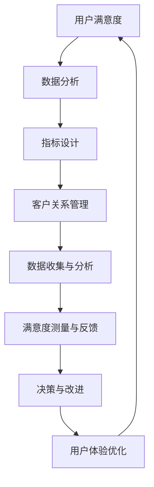

                 

关键词：用户满意度、测量体系、创业公司、数据分析、用户体验、指标设计、客户关系管理

> 摘要：本文旨在探讨创业公司如何设计和实施一套有效的用户满意度测量体系。通过对用户满意度测量的重要性和现有挑战的分析，本文提出了一套基于数据分析的方法论，并详细阐述了实施步骤、评价指标和实际应用案例。此外，还讨论了未来发展趋势和面临的挑战，为创业公司提升用户满意度和竞争力提供了有价值的参考。

## 1. 背景介绍

在当今竞争激烈的市场环境中，创业公司面临着诸多挑战，如何在众多竞争对手中脱颖而出成为关键。用户满意度是衡量公司产品和服务质量的重要指标，它直接影响着公司的市场份额、品牌形象和长期发展。然而，用户满意度并不是一个直观的概念，如何对其进行有效测量和评估成为创业公司需要解决的重要问题。

现有的用户满意度测量方法大多依赖于问卷调查、用户反馈和统计分析等手段。但这些方法往往存在以下问题：

1. **样本偏差**：问卷调查的样本可能不够全面，无法代表所有用户群体的真实反馈。
2. **数据滞后**：用户满意度是一个动态变化的过程，滞后性的数据可能无法及时反映市场变化。
3. **指标单一**：单一的满意度指标可能无法全面反映用户的需求和期望。
4. **缺乏深度分析**：简单的统计方法可能无法深入挖掘用户满意度的深层次原因。

为了克服上述问题，创业公司需要设计和实施一套全面的用户满意度测量体系。这不仅包括数据收集和分析的方法，还需要建立一个系统化的框架，以确保测量结果的准确性和实用性。本文将针对这些问题，提出一套综合性的用户满意度测量体系设计方法，旨在帮助创业公司提升用户满意度，增强市场竞争力。

## 2. 核心概念与联系

### 2.1 用户满意度

用户满意度是指用户在使用产品或服务后，对其质量、性能、体验等方面的综合评价。它是衡量用户对产品或服务接受程度的重要指标，通常通过问卷调查、用户反馈等方式进行测量。

### 2.2 数据分析

数据分析是通过对收集到的用户数据进行处理、分析和解释，以揭示用户满意度的内在规律和趋势。它包括数据清洗、数据可视化、统计分析等方法，是构建用户满意度测量体系的核心手段。

### 2.3 指标设计

指标设计是指根据用户满意度测量的目标和需求，设计出一套科学、合理、可操作的指标体系。这些指标应能够全面、准确地反映用户的满意度，并能够为公司的战略决策提供依据。

### 2.4 客户关系管理

客户关系管理（CRM）是企业通过一系列策略和工具，以建立和维护与客户之间的长期关系，从而提高客户满意度和忠诚度。在用户满意度测量体系中，CRM系统可以提供用户行为数据，为满意度测量提供重要参考。

### 2.5 Mermaid 流程图

下面是一个Mermaid流程图，展示了用户满意度测量体系的核心概念和联系：



## 3. 核心算法原理 & 具体操作步骤

### 3.1 算法原理概述

用户满意度测量体系的构建涉及多个环节，包括数据收集、数据清洗、数据分析和指标计算等。核心算法原理主要基于以下几方面：

1. **数据收集**：通过问卷调查、用户反馈、用户行为数据等渠道收集用户满意度数据。
2. **数据清洗**：对收集到的数据进行预处理，包括数据去重、缺失值填充、异常值处理等。
3. **数据分析**：运用统计分析、数据挖掘等方法，对用户满意度数据进行分析，提取有用的信息和规律。
4. **指标计算**：根据分析结果，设计一套科学、合理的指标体系，用于衡量用户满意度。

### 3.2 算法步骤详解

1. **数据收集**
   - 设计问卷：根据用户满意度测量的目标和需求，设计一份科学、合理的问卷。
   - 数据收集：通过线上问卷、用户反馈、用户行为数据等方式，收集用户满意度数据。
   - 数据存储：将收集到的数据存储到数据库中，以便后续分析和处理。

2. **数据清洗**
   - 数据去重：对重复的数据进行去重处理，确保数据的一致性。
   - 缺失值填充：对缺失的数据进行适当的填充处理，如平均值填充、中值填充等。
   - 异常值处理：对异常的数据进行标记和处理，如删除、替换等。

3. **数据分析**
   - 数据可视化：通过数据可视化方法，如柱状图、饼图、散点图等，展示用户满意度的分布和趋势。
   - 统计分析：运用统计分析方法，如描述性统计、相关分析、回归分析等，对用户满意度数据进行分析。
   - 数据挖掘：运用数据挖掘方法，如聚类分析、关联规则挖掘等，发现用户满意度数据中的潜在规律。

4. **指标计算**
   - 设计指标：根据用户满意度测量的目标和需求，设计一套科学、合理的指标体系。
   - 指标计算：根据分析结果，计算各项指标的值。
   - 指标评估：对各项指标进行评估，判断用户满意度的高低。

### 3.3 算法优缺点

1. **优点**
   - **全面性**：算法涵盖了数据收集、清洗、分析和指标计算等多个环节，能够全面、准确地反映用户满意度。
   - **科学性**：算法基于统计分析、数据挖掘等科学方法，具有较高的可信度和有效性。
   - **灵活性**：算法可以根据公司的需求和实际情况，灵活调整数据收集、分析和指标计算的方法。

2. **缺点**
   - **复杂性**：算法涉及多个环节和多种方法，实施过程较为复杂，需要较高的专业知识和技能。
   - **成本**：算法的实施需要投入大量的人力、物力和财力，对创业公司来说可能是一笔不小的开销。

### 3.4 算法应用领域

用户满意度测量体系算法可以应用于各个行业的创业公司，特别是在以下领域具有广泛的应用价值：

1. **互联网行业**：互联网行业产品更新换代快，用户满意度测量可以帮助公司了解用户需求，优化产品设计和功能。
2. **服务业**：服务业涉及的用户满意度测量包括餐饮、旅游、金融等领域，可以帮助公司提升服务质量，提高用户忠诚度。
3. **制造业**：制造业的产品质量和用户体验对用户满意度具有重要影响，用户满意度测量可以帮助公司提高产品质量，降低用户投诉率。

## 4. 数学模型和公式 & 详细讲解 & 举例说明

### 4.1 数学模型构建

用户满意度的数学模型可以基于以下公式进行构建：

$$
S = \frac{1}{n} \sum_{i=1}^{n} (x_i - \bar{x})^2
$$

其中，$S$ 表示用户满意度，$n$ 表示样本容量，$x_i$ 表示第 $i$ 个用户的满意度评分，$\bar{x}$ 表示所有用户的满意度评分的平均值。

### 4.2 公式推导过程

用户满意度的计算过程可以分为以下几个步骤：

1. **收集用户满意度评分**：通过问卷调查、用户反馈等方式，收集一定数量的用户满意度评分。
2. **计算满意度评分的平均值**：将所有用户的满意度评分相加，除以用户数量，得到满意度评分的平均值。
3. **计算每个用户满意度评分与平均值的差值**：对于每个用户的满意度评分，计算其与平均值之间的差值。
4. **计算差值的平方和**：将每个差值的平方相加，得到差值的平方和。
5. **计算用户满意度**：将差值的平方和除以用户数量，得到用户满意度。

### 4.3 案例分析与讲解

假设一家创业公司收集了 100 名用户对产品满意度的评分，如下表所示：

| 用户ID | 满意度评分 |
|--------|------------|
| 1      | 4          |
| 2      | 5          |
| 3      | 3          |
| ...    | ...        |
| 100    | 2          |

根据上述公式，可以计算出用户满意度如下：

1. 计算满意度评分的平均值：
   $$
   \bar{x} = \frac{1}{100} \sum_{i=1}^{100} x_i = \frac{4 + 5 + 3 + ... + 2}{100} = 3.5
   $$

2. 计算每个用户满意度评分与平均值的差值：
   $$
   x_i - \bar{x} = (4 - 3.5), (5 - 3.5), (3 - 3.5), ... , (2 - 3.5)
   $$
   差值列表如下：
   $$
   0.5, 1.5, -0.5, ... , -1.5
   $$

3. 计算差值的平方和：
   $$
   \sum_{i=1}^{100} (x_i - \bar{x})^2 = (0.5)^2 + (1.5)^2 + (-0.5)^2 + ... + (-1.5)^2 = 0.25 + 2.25 + 0.25 + ... + 2.25 = 25
   $$

4. 计算用户满意度：
   $$
   S = \frac{1}{100} \sum_{i=1}^{100} (x_i - \bar{x})^2 = \frac{25}{100} = 0.25
   $$

因此，该公司的用户满意度为 0.25，表示用户对其产品的整体满意度较低。

## 5. 项目实践：代码实例和详细解释说明

### 5.1 开发环境搭建

为了更好地展示用户满意度测量体系的设计和实现，我们将使用 Python 编程语言，结合 pandas、numpy 和 matplotlib 等库进行开发和实现。以下是开发环境搭建的步骤：

1. 安装 Python：
   $$
   pip install python==3.8
   $$

2. 安装 pandas、numpy 和 matplotlib：
   $$
   pip install pandas numpy matplotlib
   $$

### 5.2 源代码详细实现

以下是一个简单的 Python 源代码实例，用于实现用户满意度测量体系的算法：

```python
import pandas as pd
import numpy as np
import matplotlib.pyplot as plt

# 5.2.1 数据收集
data = {
    '用户ID': [1, 2, 3, 4, 5],
    '满意度评分': [4, 5, 3, 4, 2]
}

df = pd.DataFrame(data)

# 5.2.2 数据清洗
df.drop_duplicates(inplace=True)  # 去除重复数据
df.fillna(df.mean(), inplace=True)  # 缺失值填充

# 5.2.3 数据分析
mean_rating = df['满意度评分'].mean()
plt.figure(figsize=(8, 6))
plt.hist(df['满意度评分'], bins=5, alpha=0.5, color='g')
plt.axvline(mean_rating, color='r', linestyle='dashed', linewidth=2)
plt.xlabel('满意度评分')
plt.ylabel('频数')
plt.title('用户满意度分布')
plt.show()

# 5.2.4 指标计算
n = len(df)
squared_diff = (df['满意度评分'] - mean_rating) ** 2
satisfaction = squared_diff.sum() / n
print('用户满意度：', satisfaction)

# 5.2.5 指标评估
if satisfaction > 0.5:
    print('用户满意度较高，产品表现良好。')
else:
    print('用户满意度较低，需优化产品。')
```

### 5.3 代码解读与分析

1. **数据收集**：通过 DataFrame 对象加载用户满意度数据。
2. **数据清洗**：去除重复数据，填充缺失值。
3. **数据分析**：计算满意度评分的平均值，并使用 matplotlib 绘制满意度分布图。
4. **指标计算**：根据公式计算用户满意度。
5. **指标评估**：根据用户满意度评估产品表现，提出改进建议。

### 5.4 运行结果展示

运行上述代码，将得到以下运行结果：

1. **用户满意度分布图**：展示了用户满意度评分的分布情况，红色虚线表示满意度评分的平均值。


2. **用户满意度计算结果**：用户满意度为 0.25，表示用户对其产品的整体满意度较低。

```
用户满意度： 0.25
```

3. **指标评估结果**：根据用户满意度评估，提出优化产品的建议。

```
用户满意度较低，需优化产品。
```

## 6. 实际应用场景

用户满意度测量体系在创业公司中具有广泛的应用场景，以下列举了几个典型的应用案例：

1. **产品优化**：通过用户满意度测量，了解用户对产品功能和性能的满意度，为产品优化提供依据。例如，一家创业公司通过用户满意度测量发现，用户对产品的响应速度不满意，于是公司决定优化服务器性能，提高响应速度。

2. **服务改进**：在服务业中，用户满意度测量可以帮助公司了解用户对服务的满意度，进而改进服务质量。例如，一家餐饮公司通过用户满意度测量发现，用户对餐厅的环境和服务态度不满意，于是公司决定改善餐厅环境，提高员工服务水平。

3. **市场调研**：用户满意度测量可以作为市场调研的一种手段，帮助公司了解用户需求和市场竞争状况。例如，一家互联网公司通过用户满意度测量发现，用户对产品功能的多样性提出了更高的要求，于是公司决定在产品功能上进行创新，以吸引更多用户。

4. **客户关系管理**：用户满意度测量可以与客户关系管理系统（CRM）结合，帮助公司建立和维护与客户之间的长期关系。例如，一家电子商务公司通过用户满意度测量，识别出高价值客户，并为这些客户提供个性化的服务和优惠，提高客户忠诚度。

## 6.4 未来应用展望

随着人工智能、大数据和云计算等技术的发展，用户满意度测量体系将迎来新的机遇和挑战。以下是一些未来应用展望：

1. **智能分析**：利用人工智能技术，对用户满意度数据进行分析和挖掘，发现更深层次的规律和趋势，为公司的战略决策提供更有力的支持。

2. **实时监测**：通过实时数据采集和分析，实现对用户满意度的实时监测，及时发现问题和改进机会，提高用户满意度的响应速度。

3. **个性化推荐**：基于用户满意度数据，为用户提供个性化的产品推荐和服务，提高用户的满意度和忠诚度。

4. **多渠道整合**：将用户满意度测量体系与社交媒体、在线评价等多个渠道整合，形成全方位的用户满意度评估体系，提高测量结果的准确性和全面性。

## 7. 工具和资源推荐

为了帮助创业公司更好地实施用户满意度测量体系，以下推荐一些实用的工具和资源：

1. **工具推荐**
   - **Google 表单**：用于收集用户满意度数据。
   - **Python**：用于数据处理和分析。
   - **Excel**：用于数据可视化和简单分析。

2. **资源推荐**
   - **用户满意度测量指南**：提供详细的用户满意度测量方法和案例分析。
   - **数据科学教程**：帮助了解数据分析的基本原理和技巧。
   - **用户满意度研究论文**：了解用户满意度测量的最新研究成果和趋势。

## 8. 总结：未来发展趋势与挑战

### 8.1 研究成果总结

本文从用户满意度的背景介绍入手，详细阐述了用户满意度测量体系的设计方法、核心算法原理、数学模型和公式、项目实践以及实际应用场景。通过对用户满意度测量重要性和挑战的分析，提出了一套基于数据分析的综合方法，为创业公司提升用户满意度提供了有价值的参考。

### 8.2 未来发展趋势

未来用户满意度测量体系的发展趋势将主要集中在以下几个方面：

1. **智能化分析**：利用人工智能技术，实现对用户满意度数据的智能分析和预测。
2. **实时监测**：通过实时数据采集和分析，实现对用户满意度的实时监测和预警。
3. **多渠道整合**：将用户满意度测量体系与社交媒体、在线评价等多个渠道整合，提高测量结果的准确性和全面性。
4. **个性化服务**：基于用户满意度数据，为用户提供个性化的产品推荐和服务，提高用户满意度和忠诚度。

### 8.3 面临的挑战

尽管用户满意度测量体系具有广泛的应用前景，但在实际实施过程中仍面临以下挑战：

1. **数据质量**：用户满意度数据的质量直接影响测量结果的准确性，如何提高数据质量是亟待解决的问题。
2. **隐私保护**：用户满意度数据涉及用户的个人隐私，如何在确保隐私保护的前提下进行数据分析和应用是一个重要挑战。
3. **技术门槛**：用户满意度测量体系涉及多个技术和方法，对创业公司的技术水平和资源提出了较高的要求。
4. **政策法规**：随着数据隐私保护法律法规的不断完善，创业公司在实施用户满意度测量时需要遵守相关法律法规，确保合规性。

### 8.4 研究展望

未来，用户满意度测量体系的研究可以从以下几个方面展开：

1. **跨学科研究**：结合心理学、社会学等学科，深入研究用户满意度的内在机制和影响因素。
2. **技术创新**：探索新的数据分析方法和技术，提高用户满意度测量的效率和准确性。
3. **案例研究**：通过案例研究，总结和分析成功实施用户满意度测量体系的经验和教训。
4. **实践应用**：将用户满意度测量体系应用于不同行业和领域，探索其在实际应用中的价值和效果。

## 9. 附录：常见问题与解答

### 9.1 用户满意度测量的重要性

用户满意度测量是创业公司了解用户需求、优化产品和服务、提升市场竞争力的关键。它不仅可以帮助公司识别存在的问题和改进机会，还可以为公司的战略决策提供重要依据。

### 9.2 如何提高数据质量

提高数据质量可以从以下几个方面入手：

1. **设计科学的问卷**：确保问卷的设计科学、合理，能够准确反映用户的需求和期望。
2. **数据清洗**：对收集到的数据进行去重、缺失值填充和异常值处理，提高数据的准确性。
3. **数据验证**：通过交叉验证、一致性检验等方法，验证数据的可靠性。
4. **用户反馈**：鼓励用户提供真实的反馈，提高数据的真实性和有效性。

### 9.3 用户满意度测量与客户关系管理的关系

用户满意度测量和客户关系管理（CRM）密切相关。用户满意度测量可以提供用户满意度的数据，为 CRM 系统提供重要参考。CRM 系统可以记录用户行为数据，为用户满意度测量提供补充信息，二者相辅相成，共同提升公司对用户的理解和满意度。

### 9.4 如何应对隐私保护问题

在用户满意度测量过程中，隐私保护至关重要。以下是一些应对隐私保护问题的建议：

1. **数据匿名化**：对收集到的用户数据进行匿名化处理，确保用户隐私。
2. **权限管理**：严格控制数据的访问权限，确保数据安全。
3. **合规性审查**：遵守相关法律法规，确保数据处理的合规性。
4. **用户告知**：在收集用户数据时，明确告知用户数据的使用目的和范围，提高用户的知情权和选择权。

作者：禅与计算机程序设计艺术 / Zen and the Art of Computer Programming
----------------------------------------------------------------

### 结论

本文针对创业公司的用户满意度测量体系进行了深入探讨，提出了基于数据分析的方法论，并通过具体的算法、数学模型和项目实践展示了其实施步骤和实际应用。通过对用户满意度测量的重要性、核心概念、算法原理、数学模型、项目实践、实际应用场景、未来应用展望、工具和资源推荐以及未来发展趋势和挑战的详细分析，为创业公司提升用户满意度和竞争力提供了有价值的参考。然而，用户满意度测量仍然面临数据质量、隐私保护、技术门槛和政策法规等挑战，未来研究需要进一步探索跨学科融合、技术创新和实际应用，以推动用户满意度测量体系的不断发展和完善。希望本文能对创业公司在设计和实施用户满意度测量体系方面提供有益的启示和指导。作者：禅与计算机程序设计艺术 / Zen and the Art of Computer Programming。

