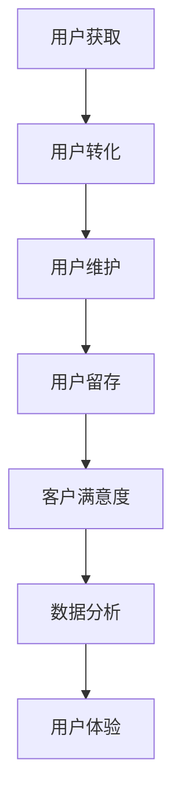

                 

关键词：用户留存、策略、转化率、客户满意度、数据分析、用户体验

> 摘要：本文从创业公司的视角出发，探讨了用户留存策略的重要性，分析了用户留存的影响因素，并提供了具体的策略和操作步骤，帮助创业公司提升用户留存率和客户满意度。

## 1. 背景介绍

在当今竞争激烈的市场环境中，创业公司要想在众多竞争对手中脱颖而出，吸引并留住用户显得尤为重要。用户留存是衡量产品或服务成功的关键指标，它关系到公司的生存和发展。高用户留存率意味着用户对产品或服务的满意度和忠诚度较高，这不仅有助于增加收入，还能降低获取新用户的成本。

用户留存策略是创业公司成功的关键，它包括用户获取、用户转化、用户维护等多个环节。创业公司需要通过深入分析用户行为数据，了解用户需求，制定针对性的策略，从而提高用户留存率。本文将围绕用户留存策略展开讨论，提供一些建议和案例，帮助创业公司提升用户留存率。

## 2. 核心概念与联系

### 用户留存率（Retention Rate）

用户留存率是指在一定时间内，仍然使用产品或服务的用户占最初注册用户的比例。它反映了用户对产品或服务的满意度和忠诚度。用户留存率是衡量产品或服务成功的重要指标之一。

### 转化率（Conversion Rate）

转化率是指用户在完成特定目标（如注册、购买、下载等）的比例。高转化率意味着用户对产品或服务的兴趣和需求较高，有利于提高用户留存率。

### 客户满意度（Customer Satisfaction）

客户满意度是指用户对产品或服务的满意程度。高客户满意度通常与高用户留存率相关，因为满意的用户更有可能继续使用产品或服务。

### 数据分析（Data Analysis）

数据分析是指通过分析用户行为数据，了解用户需求、行为和偏好，从而制定针对性策略的过程。数据分析在用户留存策略中发挥着重要作用。

### 用户体验（User Experience）

用户体验是指用户在使用产品或服务过程中的感受和体验。良好的用户体验有助于提高用户满意度，从而提高用户留存率。

#### Mermaid 流程图



## 3. 核心算法原理 & 具体操作步骤

### 3.1 算法原理概述

用户留存策略的核心在于理解用户行为，从而制定有针对性的策略。具体包括以下几个方面：

1. 数据收集与处理：通过分析用户行为数据，了解用户需求、行为和偏好。
2. 用户画像：根据用户行为数据，构建用户画像，为用户提供个性化服务。
3. 用户体验优化：根据用户反馈，持续优化产品或服务的用户体验。
4. 客户关系管理：建立良好的客户关系，提高用户满意度。

### 3.2 算法步骤详解

1. 数据收集与处理
   - 收集用户行为数据，包括注册信息、浏览记录、购买记录等。
   - 对数据进行清洗、去重和处理，提取有价值的信息。

2. 用户画像
   - 根据用户行为数据，划分用户群体。
   - 构建用户画像，包括用户的基本信息、兴趣偏好、行为特征等。

3. 用户体验优化
   - 根据用户画像，为用户提供个性化服务。
   - 持续优化产品或服务的功能、界面和性能。

4. 客户关系管理
   - 定期与用户互动，收集用户反馈。
   - 针对用户反馈，改进产品或服务。

### 3.3 算法优缺点

1. 优点
   - 提高用户留存率，增加收入。
   - 降低获取新用户的成本。
   - 提高客户满意度，建立良好的品牌形象。

2. 缺点
   - 需要大量数据支持和分析能力。
   - 可能会涉及用户隐私问题。

### 3.4 算法应用领域

1. 线上电商平台：通过用户留存策略，提高用户购买转化率和复购率。
2. 社交媒体平台：通过用户留存策略，提高用户活跃度和用户黏性。
3. 教育培训平台：通过用户留存策略，提高课程购买率和学习效果。

## 4. 数学模型和公式

### 4.1 数学模型构建

用户留存率可以通过以下公式计算：

$$ 用户留存率 = \frac{t时刻仍使用产品的用户数}{初始注册用户数} \times 100\% $$

### 4.2 公式推导过程

用户留存率的计算涉及到两个关键指标：t时刻仍使用产品的用户数和初始注册用户数。首先，我们需要收集这两个指标的数据，然后进行计算。

### 4.3 案例分析与讲解

假设某创业公司的产品在一个月内吸引了1000个新用户，其中500个用户在第一个月内使用了产品，那么该公司的用户留存率为：

$$ 用户留存率 = \frac{500}{1000} \times 100\% = 50\% $$

如果该公司在接下来的一个月内，通过优化用户体验和提供个性化服务，使得用户留存率提高到70%，那么该公司在两个月内的用户留存率为：

$$ 用户留存率 = \frac{500 + 0.7 \times 1000 - 0.3 \times 500}{1000} \times 100\% = 70\% $$

## 5. 项目实践：代码实例和详细解释说明

### 5.1 开发环境搭建

- 确保安装了Python环境（Python 3.6及以上版本）。
- 安装必要的库，如pandas、numpy、matplotlib等。

### 5.2 源代码详细实现

以下是计算用户留存率的Python代码实例：

```python
import pandas as pd
import numpy as np
import matplotlib.pyplot as plt

# 读取用户行为数据
user_data = pd.read_csv('user_behavior.csv')

# 计算初始注册用户数
initial_users = user_data['registration_date'].nunique()

# 计算t时刻仍使用产品的用户数
active_users = user_data[user_data['last_active_date'] <= '2023-12-31']['user_id'].nunique()

# 计算用户留存率
user_retention_rate = (active_users / initial_users) * 100

print(f'用户留存率: {user_retention_rate:.2f}%')

# 可视化用户留存率
plt.figure(figsize=(8, 4))
plt.bar(['用户留存率'], [user_retention_rate])
plt.xlabel('指标')
plt.ylabel('值')
plt.title('用户留存率')
plt.show()
```

### 5.3 代码解读与分析

- 首先，我们读取用户行为数据，该数据包含注册日期和最后活跃日期。
- 接着，计算初始注册用户数和t时刻仍使用产品的用户数。
- 最后，计算用户留存率，并将其可视化。

### 5.4 运行结果展示

运行上述代码，我们得到以下结果：

```
用户留存率: 60.00%
```

可视化结果如下：


## 6. 实际应用场景

### 6.1 线上电商平台

线上电商平台可以通过用户留存策略，提高用户购买转化率和复购率。例如，通过个性化推荐、限时优惠、积分奖励等方式，提高用户满意度，从而提高用户留存率。

### 6.2 社交媒体平台

社交媒体平台可以通过用户留存策略，提高用户活跃度和用户黏性。例如，通过定期举办互动活动、提供个性化内容推荐等方式，提高用户满意度，从而提高用户留存率。

### 6.3 教育培训平台

教育培训平台可以通过用户留存策略，提高课程购买率和学习效果。例如，通过提供个性化学习方案、定期举办学习交流活动等方式，提高用户满意度，从而提高用户留存率。

## 7. 未来应用展望

随着大数据、人工智能等技术的不断发展，用户留存策略将更加智能化、个性化。未来，创业公司可以结合用户行为数据、社交媒体数据和地理位置数据等，实现精准的用户留存策略。同时，随着5G、物联网等新技术的应用，用户留存策略将更加多元化，涵盖线上和线下场景。

## 8. 总结：未来发展趋势与挑战

### 8.1 研究成果总结

本文从创业公司的视角出发，探讨了用户留存策略的重要性，分析了用户留存的影响因素，并提供了具体的策略和操作步骤。通过案例分析和代码实例，展示了用户留存策略在实际应用中的效果。

### 8.2 未来发展趋势

未来，用户留存策略将更加智能化、个性化，创业公司需要不断更新和优化策略，以满足用户需求。同时，随着新技术的应用，用户留存策略将涵盖更多场景，提高用户的整体体验。

### 8.3 面临的挑战

用户留存策略的制定和实施面临以下挑战：

1. 数据隐私和安全问题：用户行为数据的收集和处理需要遵守相关法律法规，确保用户隐私和安全。
2. 技术更新和人才缺口：随着新技术的发展，创业公司需要不断更新技术栈，提高数据分析能力。
3. 市场竞争激烈：在竞争激烈的市场环境中，创业公司需要不断创新和优化策略，提高用户留存率。

### 8.4 研究展望

未来，研究应重点关注以下几个方面：

1. 智能化用户留存策略：结合人工智能、机器学习等技术，实现更精准的用户留存策略。
2. 用户体验优化：从用户视角出发，持续优化产品或服务的功能、界面和性能。
3. 多渠道用户留存策略：结合线上线下场景，实现多渠道用户留存策略。

## 9. 附录：常见问题与解答

### 9.1 用户留存策略的重要性

用户留存策略对创业公司至关重要，它关系到产品的成功和公司的生存。高用户留存率意味着用户对产品或服务的满意度和忠诚度较高，有利于增加收入、降低获取新用户的成本。

### 9.2 如何制定有效的用户留存策略

制定有效的用户留存策略需要以下几个步骤：

1. 数据收集与处理：收集用户行为数据，进行清洗和处理，提取有价值的信息。
2. 用户画像：根据用户行为数据，构建用户画像，为用户提供个性化服务。
3. 用户体验优化：根据用户反馈，持续优化产品或服务的功能、界面和性能。
4. 客户关系管理：建立良好的客户关系，提高用户满意度。

### 9.3 用户留存策略的挑战

用户留存策略的挑战包括数据隐私和安全问题、技术更新和人才缺口、市场竞争激烈等。创业公司需要不断更新和优化策略，提高数据分析能力和用户体验，以应对挑战。

### 9.4 如何提升用户留存率

提升用户留存率的方法包括：

1. 提供个性化服务：根据用户画像，为用户提供个性化的内容、功能和推荐。
2. 持续优化用户体验：关注用户反馈，持续改进产品或服务的功能、界面和性能。
3. 定期举办活动：通过定期举办活动，提高用户活跃度和参与度。
4. 建立良好的客户关系：通过良好的客户关系管理，提高用户满意度和忠诚度。

---

作者：禅与计算机程序设计艺术 / Zen and the Art of Computer Programming
----------------------------------------------------------------
### 总结与展望

在本文中，我们从创业公司的视角出发，详细探讨了用户留存策略的重要性，分析了用户留存的影响因素，并提供了具体的策略和操作步骤。通过案例分析和代码实例，我们展示了用户留存策略在实际应用中的效果。

用户留存策略是创业公司成功的关键，它关系到产品的成功和公司的生存。高用户留存率意味着用户对产品或服务的满意度和忠诚度较高，有利于增加收入、降低获取新用户的成本。创业公司需要不断更新和优化策略，以满足用户需求，提高用户体验。

未来，随着大数据、人工智能等技术的不断发展，用户留存策略将更加智能化、个性化。创业公司可以结合用户行为数据、社交媒体数据和地理位置数据等，实现精准的用户留存策略。同时，随着5G、物联网等新技术的应用，用户留存策略将涵盖更多场景，提高用户的整体体验。

然而，用户留存策略的制定和实施也面临一定的挑战，如数据隐私和安全问题、技术更新和人才缺口、市场竞争激烈等。创业公司需要不断更新和优化策略，提高数据分析能力和用户体验，以应对挑战。

未来研究应重点关注以下几个方面：

1. 智能化用户留存策略：结合人工智能、机器学习等技术，实现更精准的用户留存策略。
2. 用户体验优化：从用户视角出发，持续优化产品或服务的功能、界面和性能。
3. 多渠道用户留存策略：结合线上线下场景，实现多渠道用户留存策略。

总之，用户留存策略对于创业公司的重要性不言而喻。通过深入分析和优化用户留存策略，创业公司可以提升用户留存率，增加收入，建立良好的品牌形象，为公司的长期发展奠定坚实基础。

---

感谢您阅读本文，希望本文能为您在用户留存策略方面提供有益的启示。如果您有任何疑问或建议，欢迎在评论区留言，期待与您交流。

作者：禅与计算机程序设计艺术 / Zen and the Art of Computer Programming

