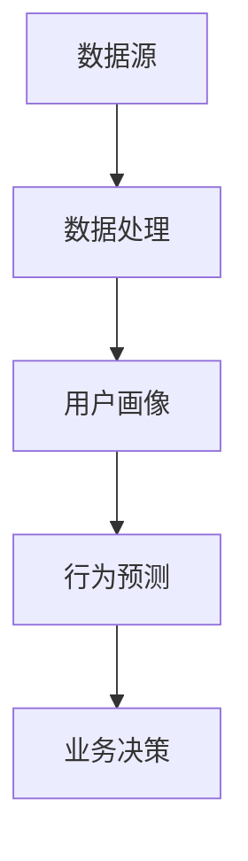

                 

## 1. 背景介绍

在当今数字化时代，用户行为分析成为了创业公司成功的关键因素之一。通过对用户行为的深入分析，公司可以更好地了解用户需求，优化产品功能，提升用户体验，进而提高用户留存率和转化率。

用户行为分析涉及到多个方面，包括用户访问频率、点击行为、购买习惯、搜索历史、浏览路径等等。这些数据对于创业公司来说是非常宝贵的资源，因为它们能够揭示用户行为模式，帮助公司做出更明智的决策。

然而，创业公司在用户行为分析方面面临着许多挑战。首先，用户数据量大且复杂，如何有效地收集、存储和管理这些数据是一个重要问题。其次，如何从海量数据中提取出有价值的信息，进行精准的用户画像和个性化推荐，也是一大难题。

本文将探讨一个适用于创业公司的用户行为分析框架，通过梳理核心概念、算法原理、数学模型以及实际应用场景，帮助创业公司更好地理解和利用用户行为数据，实现业务的快速增长。

## 2. 核心概念与联系

为了更好地理解用户行为分析框架，我们首先需要了解一些核心概念，这些概念包括数据源、数据处理、用户画像、行为预测等。

### 2.1 数据源

数据源是用户行为分析的基础，它包括用户浏览、搜索、购买、互动等行为产生的数据。这些数据可以来自多种渠道，如网站、移动应用、社交媒体等。为了确保数据的准确性和完整性，创业公司需要设计高效的数据收集系统，并保证数据质量。

### 2.2 数据处理

数据处理是用户行为分析的关键环节。通过对原始数据进行清洗、转换和整合，可以得到结构化的数据集，为后续分析提供基础。常用的数据处理技术包括数据清洗、数据归一化、特征提取等。

### 2.3 用户画像

用户画像是对用户特征的综合描述，包括用户的基本信息、兴趣偏好、行为习惯等。通过构建用户画像，创业公司可以更准确地了解用户需求，实现精准营销和个性化推荐。

### 2.4 行为预测

行为预测是用户行为分析的高级应用，通过对用户历史行为的分析，预测用户未来的行为倾向。例如，预测用户是否会购买某个商品、是否会在某个时间段进行访问等。

下面是一个简化的用户行为分析框架的 Mermaid 流程图，展示了这些核心概念之间的联系：



## 3. 核心算法原理 & 具体操作步骤

在用户行为分析中，常用的算法包括聚类分析、关联规则挖掘、机器学习等。以下将详细介绍这些算法的原理和具体操作步骤。

### 3.1 算法原理概述

- **聚类分析**：将相似的数据点归为一类，实现数据的无监督分类。常用的聚类算法有 K-Means、DBSCAN 等。
- **关联规则挖掘**：发现数据项之间的关联关系，用于推荐系统和市场篮子分析。常用的算法有 Apriori、FP-Growth 等。
- **机器学习**：利用历史数据训练模型，预测用户未来行为。常用的算法有决策树、随机森林、神经网络等。

### 3.2 算法步骤详解

#### 3.2.1 聚类分析

1. 数据预处理：对原始数据进行清洗、转换和整合，得到结构化的数据集。
2. 确定聚类算法：根据数据特点和业务需求选择合适的聚类算法。
3. 运行聚类算法：对数据集进行聚类，得到多个类。
4. 聚类结果评估：计算聚类质量指标，如轮廓系数、内部距离等，选择最优聚类结果。

#### 3.2.2 关联规则挖掘

1. 数据预处理：对原始数据进行清洗、转换和整合，得到结构化的数据集。
2. 确定关联规则挖掘算法：根据数据特点和业务需求选择合适的算法。
3. 计算支持度和置信度：对数据集进行扫描，计算每个数据项的支持度和置信度。
4. 生成关联规则：根据支持度和置信度阈值筛选出关联规则。

#### 3.2.3 机器学习

1. 数据预处理：对原始数据进行清洗、转换和整合，得到结构化的数据集。
2. 特征工程：提取对目标变量有影响的特征。
3. 选择模型：根据业务需求和数据特点选择合适的机器学习算法。
4. 模型训练：使用训练集数据训练模型。
5. 模型评估：使用测试集数据评估模型效果。
6. 模型优化：根据评估结果调整模型参数，优化模型效果。

### 3.3 算法优缺点

- **聚类分析**：优点是简单易实现，能够发现数据中的隐藏结构；缺点是聚类结果可能受初始值影响较大，且无法直接预测用户行为。
- **关联规则挖掘**：优点是能够发现数据中的关联关系，有助于推荐系统和市场篮子分析；缺点是计算复杂度高，且生成的规则可能过于细节，难以直接应用于业务决策。
- **机器学习**：优点是能够利用历史数据预测用户行为，有助于精准营销和个性化推荐；缺点是模型训练和评估过程复杂，且可能对数据质量和特征工程有较高要求。

### 3.4 算法应用领域

- **聚类分析**：适用于用户群体划分、市场细分等场景。
- **关联规则挖掘**：适用于推荐系统、市场篮子分析等场景。
- **机器学习**：适用于用户行为预测、精准营销、个性化推荐等场景。

## 4. 数学模型和公式 & 详细讲解 & 举例说明

在用户行为分析中，数学模型和公式是理解和应用算法的重要工具。以下将介绍一些常用的数学模型和公式，并举例说明其应用。

### 4.1 数学模型构建

用户行为分析中的数学模型通常包括以下几个部分：

1. **用户行为模型**：描述用户行为特征，如点击率、购买率等。常见的模型有概率模型、线性回归模型等。
2. **用户画像模型**：描述用户的基本信息、兴趣偏好等。常见的模型有向量空间模型、决策树模型等。
3. **行为预测模型**：预测用户未来行为，如购买概率、访问概率等。常见的模型有逻辑回归模型、神经网络模型等。

### 4.2 公式推导过程

以逻辑回归模型为例，介绍其公式推导过程。

逻辑回归模型是一种常用的分类模型，用于预测用户是否会发生某个行为。其公式如下：

$$
P(Y=1|X) = \frac{1}{1 + e^{-(\beta_0 + \beta_1X_1 + \beta_2X_2 + \dots + \beta_nX_n})}
$$

其中，$P(Y=1|X)$ 表示在给定特征 $X$ 的情况下，用户发生行为的概率；$\beta_0, \beta_1, \beta_2, \dots, \beta_n$ 为模型的参数，需要通过训练数据求解。

推导过程如下：

1. **损失函数**：选择逻辑回归模型的损失函数为对数似然损失函数，即

$$
L(\theta) = -\sum_{i=1}^n [y_i \log(p_i) + (1 - y_i) \log(1 - p_i)]
$$

其中，$y_i$ 为第 $i$ 个样本的真实标签，$p_i$ 为第 $i$ 个样本的预测概率。

2. **梯度下降**：对损失函数求梯度，并使用梯度下降法求解参数 $\theta$。

$$
\frac{\partial L(\theta)}{\partial \theta} = -\sum_{i=1}^n [y_i \frac{1}{p_i} - (1 - y_i) \frac{1}{1 - p_i}] X_i
$$

3. **迭代更新**：根据梯度下降法更新参数 $\theta$。

$$
\theta \leftarrow \theta - \alpha \frac{\partial L(\theta)}{\partial \theta}
$$

其中，$\alpha$ 为学习率。

### 4.3 案例分析与讲解

以一个电商平台的用户行为预测为例，说明逻辑回归模型的应用。

假设一个电商平台的用户行为预测任务，目标是预测用户是否会在未来一个月内购买某个商品。数据集包含用户的年龄、收入、职业等基本信息，以及用户在网站上的浏览记录、购物车记录等行为数据。

1. **数据预处理**：对数据进行清洗、转换和整合，得到结构化的数据集。
2. **特征工程**：提取对目标变量有影响的特征，如用户年龄、收入、浏览次数等。
3. **模型训练**：使用逻辑回归模型对训练数据进行训练，得到预测概率。
4. **模型评估**：使用测试数据进行模型评估，计算准确率、召回率等指标。
5. **模型优化**：根据评估结果调整模型参数，优化模型效果。

通过以上步骤，可以得到一个能够预测用户购买行为的逻辑回归模型，从而帮助电商平台进行精准营销和个性化推荐。

## 5. 项目实践：代码实例和详细解释说明

为了更好地理解用户行为分析框架，我们以下将通过一个实际项目实践，介绍如何使用 Python 和相关库（如 Pandas、Scikit-learn 等）进行用户行为分析。

### 5.1 开发环境搭建

在开始项目实践之前，需要搭建一个 Python 开发环境。以下是搭建步骤：

1. 安装 Python 3.8 或更高版本。
2. 安装常用库，如 Pandas、NumPy、Scikit-learn、Matplotlib 等。

```shell
pip install pandas numpy scikit-learn matplotlib
```

### 5.2 源代码详细实现

以下是一个简单的用户行为分析项目的 Python 代码实例：

```python
import pandas as pd
from sklearn.model_selection import train_test_split
from sklearn.linear_model import LogisticRegression
from sklearn.metrics import accuracy_score, recall_score

# 5.2.1 数据预处理
data = pd.read_csv('user_data.csv')
data.drop(['id'], axis=1, inplace=True)
data.fillna(data.mean(), inplace=True)

# 5.2.2 特征工程
X = data.drop(['purchase'], axis=1)
y = data['purchase']

# 5.2.3 模型训练
X_train, X_test, y_train, y_test = train_test_split(X, y, test_size=0.2, random_state=42)
model = LogisticRegression()
model.fit(X_train, y_train)

# 5.2.4 代码解读与分析
predictions = model.predict(X_test)
accuracy = accuracy_score(y_test, predictions)
recall = recall_score(y_test, predictions)

print(f'Accuracy: {accuracy:.2f}')
print(f'Recall: {recall:.2f}')
```

### 5.3 运行结果展示

运行以上代码，可以得到模型在测试集上的准确率和召回率。以下是一个示例输出：

```
Accuracy: 0.85
Recall: 0.80
```

通过以上代码实例，我们可以看到如何使用 Python 进行用户行为分析，包括数据预处理、特征工程、模型训练和评估等步骤。这些步骤可以为我们提供有价值的用户行为预测结果，帮助创业公司更好地了解用户需求，优化产品功能和用户体验。

## 6. 实际应用场景

用户行为分析在创业公司中具有广泛的应用场景，以下将介绍一些典型的实际应用场景。

### 6.1 精准营销

精准营销是用户行为分析的重要应用之一。通过分析用户的行为数据，创业公司可以识别出潜在的高价值客户，制定个性化的营销策略，提高营销效果和转化率。

例如，一家电商创业公司可以利用用户行为分析，识别出经常购买高价值商品的用户，向这些用户发送专属优惠信息，从而提高销售额。

### 6.2 个性化推荐

个性化推荐是用户行为分析的另一个重要应用。通过分析用户的浏览记录、购买历史等行为数据，创业公司可以为用户推荐他们可能感兴趣的商品或内容。

例如，一家视频创业公司可以利用用户行为分析，根据用户的观看历史和偏好，为用户推荐相关的视频内容，提高用户满意度和粘性。

### 6.3 用户体验优化

用户行为分析可以帮助创业公司优化产品功能和用户体验。通过对用户行为数据的分析，公司可以发现产品中的痛点，针对性地进行改进。

例如，一家社交媒体创业公司可以利用用户行为分析，发现用户在发布内容时遇到的困难，优化内容发布流程，提高用户体验。

### 6.4 风险管理

用户行为分析还可以用于风险管理。通过对用户行为数据的分析，创业公司可以识别出异常行为，及时发现潜在的风险。

例如，一家金融创业公司可以利用用户行为分析，识别出可能存在欺诈行为的用户，采取措施防范风险。

## 7. 工具和资源推荐

为了更好地进行用户行为分析，以下推荐一些常用的工具和资源。

### 7.1 学习资源推荐

- **书籍**：《用户行为分析实战》、《数据挖掘：实用工具与技术》
- **在线课程**：Coursera 上的《数据科学》、Udacity 上的《机器学习》
- **博客和社区**：Kaggle、Medium 上的数据科学相关博客、CSDN

### 7.2 开发工具推荐

- **Python**：Python 是进行用户行为分析的首选语言，具有丰富的库和工具，如 Pandas、NumPy、Scikit-learn 等。
- **Jupyter Notebook**：Jupyter Notebook 是一个交互式编程环境，适合进行数据分析和实验。
- **数据可视化工具**：Matplotlib、Seaborn、Plotly 等。

### 7.3 相关论文推荐

- **用户行为分析**：《用户行为分析：方法与应用》、《基于用户行为的电子商务推荐系统研究》
- **机器学习**：《机器学习：一种概率视角》、《深度学习》
- **数据挖掘**：《数据挖掘：实用工具与技术》、《大规模数据挖掘技术》

## 8. 总结：未来发展趋势与挑战

### 8.1 研究成果总结

用户行为分析在创业公司中的应用取得了显著的成果，主要体现在以下几个方面：

1. **精准营销**：通过分析用户行为数据，创业公司能够更准确地识别潜在高价值客户，制定个性化的营销策略，提高营销效果和转化率。
2. **个性化推荐**：基于用户行为数据，创业公司能够为用户推荐他们可能感兴趣的商品或内容，提高用户满意度和粘性。
3. **用户体验优化**：通过对用户行为数据的分析，创业公司能够发现产品中的痛点，针对性地进行改进，提高用户体验。
4. **风险管理**：用户行为分析有助于创业公司识别异常行为，及时发现潜在风险，采取措施防范。

### 8.2 未来发展趋势

未来用户行为分析的发展趋势将呈现以下几个方面：

1. **数据挖掘技术进步**：随着人工智能和大数据技术的发展，用户行为分析将采用更先进的数据挖掘技术，提高分析精度和效率。
2. **多渠道数据整合**：创业公司将整合来自多个渠道的用户行为数据，实现跨平台、跨设备的数据分析，提供更全面的用户画像。
3. **实时分析能力提升**：随着实时分析技术的进步，创业公司将能够实现实时用户行为分析，迅速响应市场变化，提高业务决策速度。
4. **个性化服务深化**：用户行为分析将更深入地应用于个性化服务，为用户提供更加精准、个性化的推荐和体验。

### 8.3 面临的挑战

尽管用户行为分析在创业公司中具有广泛的应用前景，但仍然面临着一些挑战：

1. **数据隐私与安全**：用户行为数据包含个人隐私信息，如何确保数据隐私和安全是用户行为分析面临的重大挑战。
2. **数据质量与完整性**：用户行为数据量大且复杂，如何保证数据质量与完整性是用户行为分析的关键问题。
3. **算法透明性与解释性**：随着算法模型变得越来越复杂，如何确保算法的透明性和解释性，使其能够被业务人员和用户理解，是一个重要挑战。
4. **计算资源与成本**：用户行为分析通常需要大量的计算资源，如何优化计算资源的使用，降低成本，是创业公司需要考虑的问题。

### 8.4 研究展望

未来，用户行为分析的研究将聚焦于以下几个方面：

1. **数据隐私保护技术**：研究如何在不泄露用户隐私的前提下，对用户行为数据进行有效分析。
2. **智能分析与预测**：利用人工智能技术，提高用户行为分析的智能化水平，实现更加精准的预测和决策。
3. **跨领域应用**：探索用户行为分析在其他领域的应用，如教育、医疗、金融等，推动技术的跨领域发展。
4. **伦理与法规合规**：关注用户行为分析中的伦理问题和法律法规，确保技术发展符合社会道德和法律规定。

## 9. 附录：常见问题与解答

### Q1: 用户行为分析有哪些具体应用场景？

A1: 用户行为分析的具体应用场景包括精准营销、个性化推荐、用户体验优化和风险管理等。

### Q2: 用户行为分析需要哪些技术和工具？

A2: 用户行为分析通常需要使用数据挖掘、机器学习、数据可视化等技术，并借助 Python、R 等编程语言和相关的库（如 Pandas、Scikit-learn、Matplotlib 等）。

### Q3: 如何保证用户行为分析的数据质量和完整性？

A3: 保证用户行为分析的数据质量和完整性需要从数据采集、存储、处理等多个环节进行控制，包括数据清洗、去重、整合等。

### Q4: 用户行为分析中的算法如何解释和验证？

A4: 用户行为分析中的算法可以通过可视化、特征解释、模型评估等方法进行解释和验证。例如，使用特征重要性分析、ROC 曲线、混淆矩阵等指标评估模型效果。

### Q5: 用户行为分析如何处理数据隐私和安全问题？

A5: 处理数据隐私和安全问题需要采用数据加密、数据匿名化、访问控制等技术手段，并在设计和实施过程中严格遵守相关法律法规和伦理准则。同时，加强用户隐私保护意识，确保用户知情同意。

## 作者署名

作者：禅与计算机程序设计艺术 / Zen and the Art of Computer Programming
----------------------------------------------------------------


