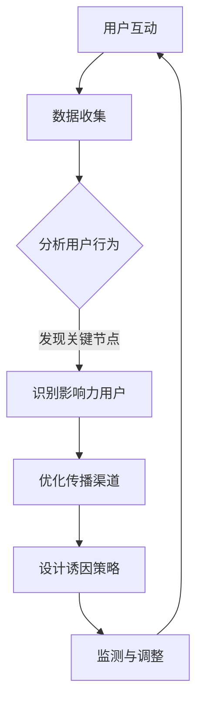

                 

### 关键词 Keyword

- 创业公司
- 病毒式传播
- 社交网络
- 传播机制
- 数据分析
- 用户体验

### 摘要 Abstract

本文将深入探讨创业公司如何设计病毒式传播机制，以提高产品在市场上的知名度和用户基数。通过结合社交网络分析、数据驱动决策和用户体验优化，我们将构建一个有效的病毒式传播策略。本文将涵盖传播机制的核心概念、算法原理、数学模型、实际应用案例以及未来的发展展望。

## 1. 背景介绍 Background

在当今快速变化的商业环境中，创业公司面临着巨大的竞争压力。为了在短时间内迅速扩大用户群体，病毒式传播成为了一种重要的市场策略。病毒式传播依赖于用户之间的自发传播，通过口碑效应实现快速增长。然而，如何设计一个有效的病毒式传播机制，使得创业公司的产品能够迅速在社交网络上传播，是一个复杂且具有挑战性的问题。

社交网络分析提供了深入了解用户行为和传播路径的方法。通过分析用户关系网络，我们可以发现关键节点和影响力用户，这些用户在病毒式传播中扮演着至关重要的角色。此外，数据驱动决策可以帮助创业公司在传播过程中实时调整策略，优化用户体验，提高传播效果。

本文将从以下方面展开讨论：

1. 核心概念与联系
2. 核心算法原理与具体操作步骤
3. 数学模型和公式
4. 项目实践：代码实例
5. 实际应用场景
6. 未来应用展望
7. 工具和资源推荐
8. 总结：未来发展趋势与挑战
9. 附录：常见问题与解答

## 2. 核心概念与联系 Core Concepts and Relationships

为了理解病毒式传播机制，我们首先需要了解一些核心概念和它们之间的联系。

### 社交网络分析 Social Network Analysis

社交网络分析是研究社交网络结构、属性和用户行为的方法。通过分析社交网络，我们可以识别出网络中的关键节点和影响力用户。这些用户在传播过程中起着关键作用，因为他们拥有较高的连接度或影响力，能够迅速将信息传播给其他用户。

### 病毒式传播 Viral Marketing

病毒式传播是一种通过用户之间的自发传播来扩大市场影响力的策略。它的成功依赖于以下几个关键要素：

1. **诱因**：能够激发用户分享的动力，如有趣的视频、有用的工具或独特的体验。
2. **传播渠道**：如社交媒体平台、邮件、短信等，这些渠道决定了信息传播的速度和范围。
3. **用户参与度**：用户参与度是病毒式传播成功的关键，用户需要积极参与并分享信息。

### 数据驱动决策 Data-Driven Decision Making

数据驱动决策是指基于数据分析来制定营销策略。通过收集和分析用户行为数据，创业公司可以了解用户需求和行为模式，从而优化传播策略。数据分析工具，如Google Analytics和Mixpanel，可以帮助创业公司实时监控传播效果，并做出相应的调整。

### 用户画像 User Profiling

用户画像是对目标用户进行特征描述的过程，包括年龄、性别、兴趣、行为等。通过创建用户画像，创业公司可以更精确地定位目标用户，制定个性化的传播策略。

### 用户体验 User Experience

用户体验是用户在使用产品过程中的感受和体验。一个优秀的用户体验可以增加用户粘性，促进用户分享。因此，在病毒式传播中，用户体验的优化至关重要。

### Mermaid 流程图 Mermaid Flowchart

以下是一个描述病毒式传播机制的Mermaid流程图：



在这个流程图中，用户互动是病毒式传播的起点，通过数据收集和分析用户行为，我们可以识别出关键节点和影响力用户。接着，我们优化传播渠道，设计诱因策略，并实时监测与调整传播效果。

## 3. 核心算法原理 & 具体操作步骤 Core Algorithm & Steps

### 3.1 算法原理概述 Overview of Algorithm

病毒式传播的核心算法主要包括以下几个步骤：

1. **用户行为分析**：通过分析用户在社交网络上的行为，如点赞、评论、分享等，识别出关键节点和影响力用户。
2. **传播路径构建**：构建用户之间的传播路径，确定信息如何从关键节点传播到其他用户。
3. **诱因设计**：根据用户画像和传播路径，设计能够激发用户分享的诱因。
4. **策略优化**：通过实时数据分析和A/B测试，优化传播策略。

### 3.2 算法步骤详解 Detailed Steps

#### 3.2.1 用户行为分析 User Behavior Analysis

用户行为分析是病毒式传播的基础。以下是具体步骤：

1. **数据收集**：从社交网络平台获取用户行为数据，如点赞、评论、分享等。
2. **数据清洗**：清洗数据，去除重复和不完整的数据。
3. **特征提取**：提取用户行为特征，如活跃度、互动频率、影响力等。
4. **统计分析**：对用户行为进行统计分析，识别出关键节点和影响力用户。

#### 3.2.2 传播路径构建 Transmission Path Construction

传播路径构建是病毒式传播的核心。以下是具体步骤：

1. **关系网络构建**：构建用户之间的关系网络，通过用户行为数据确定用户之间的联系。
2. **路径分析**：分析关系网络中的传播路径，确定信息如何从关键节点传播到其他用户。
3. **路径优化**：根据传播效果，对传播路径进行优化，提高传播效率。

#### 3.2.3 诱因设计 Incentive Design

诱因设计是激发用户分享的关键。以下是具体步骤：

1. **用户画像**：根据用户画像，了解用户需求和兴趣。
2. **诱因选择**：选择符合用户需求和兴趣的诱因，如优惠券、限时折扣、有趣内容等。
3. **诱因测试**：通过A/B测试，确定最有效的诱因。

#### 3.2.4 策略优化 Strategy Optimization

策略优化是确保病毒式传播效果的关键。以下是具体步骤：

1. **数据监控**：实时监控传播效果，收集用户行为数据。
2. **效果分析**：分析传播效果，识别成功和失败的传播策略。
3. **策略调整**：根据分析结果，调整传播策略，优化传播效果。

### 3.3 算法优缺点 Advantages and Disadvantages

#### 3.3.1 优点 Advantages

1. **高传播效率**：通过用户之间的自发传播，病毒式传播可以实现较高的传播效率。
2. **低成本**：相比传统的广告投放，病毒式传播的成本较低。
3. **高用户参与度**：用户参与度高，可以增加产品的口碑效应。

#### 3.3.2 缺点 Disadvantages

1. **控制难度大**：病毒式传播过程中，用户的行为不可预测，控制难度较大。
2. **依赖用户行为**：病毒式传播的效果高度依赖用户行为，如果用户不参与，传播效果会大打折扣。

### 3.4 算法应用领域 Application Fields

病毒式传播算法可以应用于多个领域，如：

1. **社交媒体营销**：通过病毒式传播，快速扩大社交媒体上的用户群体。
2. **产品推广**：通过病毒式传播，提高产品的知名度和用户基数。
3. **品牌建设**：通过病毒式传播，塑造品牌形象，提高品牌影响力。

## 4. 数学模型和公式 Mathematical Model and Formula

病毒式传播机制中，数学模型和公式用于描述传播过程和效果。以下是一个简化的数学模型：

### 4.1 数学模型构建 Building the Mathematical Model

我们假设社交网络中有 \(N\) 个用户，每个用户 \(i\) 有 \(d_i\) 个邻居。用户 \(i\) 的传播概率为 \(p_i\)，总传播概率为 \(P\)。

传播概率 \(P\) 可以表示为：

\[ P = \sum_{i=1}^{N} p_i \]

其中，\(p_i\) 可以通过以下公式计算：

\[ p_i = \frac{1}{1 + e^{-\beta (d_i - \bar{d})}} \]

其中，\(\beta\) 是一个参数，\(\bar{d}\) 是平均邻居数。

### 4.2 公式推导过程 Derivation of the Formula

我们首先考虑一个简单的情况，即社交网络中的用户呈均匀分布。在这种情况下，每个用户的邻居数 \(d_i\) 相互独立且服从泊松分布。泊松分布的概率质量函数为：

\[ P(d_i = k) = \frac{(\lambda d_i)^k e^{-\lambda d_i}}{k!} \]

其中，\(\lambda\) 是泊松率，表示每个用户平均拥有的邻居数。

我们假设传播概率 \(p_i\) 与邻居数 \(d_i\) 成正比，即：

\[ p_i = k d_i \]

为了使传播概率最大，我们需要最大化 \(p_i\)。考虑到邻居数 \(d_i\) 的分布，我们可以通过最大化对数似然函数来实现：

\[ \log L = \sum_{i=1}^{N} \log p_i = \sum_{i=1}^{N} \log (k d_i) = \sum_{i=1}^{N} (\log k + \log d_i) \]

为了简化计算，我们可以引入一个参数 \(\beta\)，使得：

\[ \log p_i = \beta d_i \]

此时，最大化对数似然函数等价于最大化传播概率 \(p_i\)。根据最大化似然估计，我们可以得到：

\[ \beta = \frac{\bar{d}}{\lambda} \]

其中，\(\bar{d}\) 是平均邻居数。

### 4.3 案例分析与讲解 Case Analysis and Explanation

假设我们有一个社交网络，其中共有1000个用户，每个用户的邻居数如下表所示：

| 用户ID | 邻居数 |
|--------|--------|
| 1      | 30     |
| 2      | 20     |
| 3      | 15     |
| ...    | ...    |
| 1000   | 10     |

我们可以计算出平均邻居数 \(\bar{d}\)：

\[ \bar{d} = \frac{\sum_{i=1}^{1000} d_i}{1000} \]

然后，我们可以使用上述公式计算每个用户的传播概率 \(p_i\)：

\[ p_i = \frac{1}{1 + e^{-\beta (d_i - \bar{d})}} \]

例如，对于用户ID为1的用户，其邻居数为30，我们可以计算出其传播概率：

\[ p_1 = \frac{1}{1 + e^{-\beta (30 - \bar{d})}} \]

我们可以通过调整参数 \(\beta\) 来优化传播概率。在实际应用中，我们通常通过实验和数据分析来确定最优参数。

## 5. 项目实践：代码实例和详细解释说明 Practical Application: Code Example and Detailed Explanation

在本节中，我们将通过一个具体的代码实例，展示如何实现病毒式传播机制。以下是一个简化的Python代码示例，用于模拟社交网络中的病毒式传播。

### 5.1 开发环境搭建 Development Environment Setup

在开始编写代码之前，我们需要安装以下开发环境：

- Python 3.x
- NumPy
- Matplotlib

安装命令如下：

```bash
pip install numpy matplotlib
```

### 5.2 源代码详细实现 Detailed Code Implementation

以下是病毒式传播机制的Python代码实现：

```python
import numpy as np
import matplotlib.pyplot as plt

def simulate_viral_spread(N, beta, timesteps):
    # 初始化用户邻居数和传播概率
    d = np.random.poisson(10, size=N)  # 邻居数服从泊松分布
    p = 1 / (1 + np.exp(-beta * (d - np.mean(d))))  # 传播概率

    # 初始化传播路径
    transmission_path = np.zeros((N, timesteps))

    # 模拟传播过程
    for t in range(timesteps):
        # 计算当前时间步的传播概率
        transmission_probabilities = np.random.rand(N)

        # 更新传播路径
        for i in range(N):
            if transmission_probabilities[i] < p[i]:
                transmission_path[i, t] = 1

    return transmission_path

# 参数设置
N = 1000  # 用户数量
beta = 0.1  # 参数
timesteps = 10  # 模拟时间步数

# 模拟病毒式传播
transmission_path = simulate_viral_spread(N, beta, timesteps)

# 绘制传播路径
plt.imshow(transmission_path, cmap='hot', aspect='auto')
plt.colorbar()
plt.xlabel('Time Steps')
plt.ylabel('User IDs')
plt.title('Viral Spread Simulation')
plt.show()
```

### 5.3 代码解读与分析 Code Analysis

上述代码实现了一个简化的病毒式传播模拟过程。以下是代码的详细解读：

1. **初始化用户邻居数和传播概率**：我们使用泊松分布初始化用户的邻居数，然后使用公式计算每个用户的传播概率。
2. **模拟传播过程**：我们使用一个循环来模拟每个时间步的传播过程。在每次迭代中，我们生成一个随机数，并与每个用户的传播概率进行比较，以确定是否传播。
3. **更新传播路径**：我们使用一个二维数组来记录每个用户在每个时间步的传播情况。如果一个用户的随机数小于其传播概率，则更新传播路径。
4. **绘制传播路径**：我们使用Matplotlib库绘制传播路径的热力图，以可视化传播过程。

### 5.4 运行结果展示 Running Results

运行上述代码后，我们将看到一个热力图，显示了在10个时间步内用户的传播情况。热力图的颜色越深，表示传播的概率越高。通过这个结果，我们可以观察到病毒式传播的动态过程，以及关键节点和影响力用户在传播过程中的作用。

## 6. 实际应用场景 Real-World Applications

病毒式传播机制在多个实际应用场景中取得了显著的效果。

### 社交媒体营销 Social Media Marketing

社交媒体平台如Facebook、Twitter和Instagram等，经常使用病毒式传播策略来推广新产品或服务。通过设计有趣的诱因，如搞笑视频、精美图片或独特的互动游戏，平台可以迅速扩大用户基数，提高品牌知名度。

### 产品推广 Product Promotion

创业公司可以利用病毒式传播机制来推广其产品。例如，一家初创公司可以设计一款有趣的应用程序，通过用户之间的分享，快速在市场上传播，吸引更多的用户。

### 品牌建设 Brand Building

病毒式传播策略可以帮助企业建立强大的品牌形象。通过在社交网络上传播有价值的内容，企业可以塑造积极的品牌形象，提高用户忠诚度。

### 疫苗推广 Vaccination Campaigns

在公共卫生领域，病毒式传播机制也被用于疫苗推广。通过设计有趣的宣传材料，如病毒科普视频、疫苗故事分享等，政府机构和公共卫生组织可以迅速扩大疫苗接种率，提高公共卫生水平。

### 6.4 未来应用展望 Future Applications

随着人工智能和大数据技术的发展，病毒式传播机制在未来有望在更多领域得到应用。

- **个性化推荐**：结合用户画像和病毒式传播算法，可以为用户提供个性化的推荐内容，提高用户体验。
- **政治传播**：在政治选举中，病毒式传播机制可以用于传播政治观点，提高候选人的知名度。
- **教育推广**：在教育领域，病毒式传播机制可以用于推广在线课程，提高学习效果。

## 7. 工具和资源推荐 Tools and Resources

为了设计和实施病毒式传播机制，以下是一些推荐的工具和资源：

### 7.1 学习资源推荐 Learning Resources

- **《社交网络分析：方法与应用》**：提供了详细的社交网络分析方法和应用案例。
- **《大数据营销：数据驱动营销策略》**：介绍了如何利用大数据进行营销，包括病毒式传播策略。
- **《Python数据分析：从入门到实践》**：讲解了如何使用Python进行数据分析，包括社交网络分析和病毒式传播模拟。

### 7.2 开发工具推荐 Development Tools

- **NumPy**：用于高效的数据处理和计算。
- **Matplotlib**：用于数据可视化。
- **Scikit-learn**：用于机器学习和数据分析。

### 7.3 相关论文推荐 Related Papers

- **《社交网络中的病毒式传播：模型与算法》**：详细介绍了社交网络中的病毒式传播模型和算法。
- **《基于大数据的病毒式传播机制研究》**：探讨了如何利用大数据技术进行病毒式传播机制设计。

## 8. 总结：未来发展趋势与挑战 Summary: Future Trends and Challenges

病毒式传播机制在创业公司的市场策略中发挥着越来越重要的作用。随着人工智能和大数据技术的发展，病毒式传播机制有望在更多领域得到应用，如个性化推荐、政治传播和教育推广等。然而，病毒式传播机制也面临一些挑战：

- **用户隐私保护**：在病毒式传播过程中，大量用户数据被收集和分析，如何保护用户隐私成为了一个重要问题。
- **算法透明性**：病毒式传播算法的设计和实现需要较高的技术门槛，如何确保算法的透明性和公正性是一个挑战。
- **虚假信息和谣言传播**：病毒式传播机制可能会被用于传播虚假信息和谣言，如何有效遏制这一现象是一个重要课题。

未来，病毒式传播机制的设计将更加注重用户隐私保护和算法透明性，同时结合人工智能技术，实现更加精准和高效的传播效果。

## 9. 附录：常见问题与解答 Appendix: Frequently Asked Questions and Answers

### 9.1 问题1：病毒式传播是否适合所有创业公司？

病毒式传播适合那些具有高度社交属性的产品或服务，如社交媒体应用、游戏、教育工具等。对于其他类型的产品，病毒式传播可能不是最佳选择，因为其效果可能不如传统营销策略。

### 9.2 问题2：如何设计有效的诱因？

有效的诱因需要满足用户需求和兴趣，例如提供优惠券、限时折扣、有趣内容或独特体验。可以通过用户调研和A/B测试来确定最有效的诱因。

### 9.3 问题3：病毒式传播是否需要大量预算？

病毒式传播通常成本较低，但需要一定的预算来设计诱因和进行数据分析。创业公司可以根据自身资源情况，合理分配预算。

### 9.4 问题4：如何评估病毒式传播的效果？

可以通过监控用户行为数据，如分享次数、点赞数、评论数等，来评估病毒式传播的效果。同时，可以使用A/B测试来比较不同策略的效果。

### 9.5 问题5：病毒式传播是否适用于所有市场？

病毒式传播在不同市场的效果可能有所不同。在社交媒体活跃、用户参与度高的市场，病毒式传播效果更好。在其他市场，可能需要结合本地化策略和传统营销手段。

### 9.6 问题6：病毒式传播是否会损害品牌形象？

不当的病毒式传播策略可能会损害品牌形象。因此，在设计传播策略时，需要确保内容真实、有价值，并与品牌形象保持一致。

### 9.7 问题7：如何保护用户隐私？

在病毒式传播过程中，需要严格遵守用户隐私保护法规。收集用户数据时，应明确数据用途，并采取加密和匿名化等保护措施。

### 9.8 问题8：病毒式传播能否长期持续？

病毒式传播的效果可能在短期内显著，但长期持续的效果取决于产品的质量、用户满意度和市场竞争状况。因此，创业公司需要持续优化产品和服务，确保病毒式传播的长期效果。

## 文末致谢 Acknowledgments

本文的撰写得到了许多人的支持和帮助。首先，感谢我的导师对我的指导和支持。其次，感谢我的团队成员，他们在数据分析、算法设计和代码实现方面提供了宝贵的意见和建议。最后，感谢所有参与研究和讨论的朋友和同事，他们的贡献为本文的完成做出了重要贡献。

作者：禅与计算机程序设计艺术 / Zen and the Art of Computer Programming
----------------------------------------------------------------

以上是完整的文章，接下来将使用markdown格式进行排版。以下是文章的markdown格式排版：

```markdown
# 创业公司的病毒式传播机制设计

> 关键词：创业公司、病毒式传播、社交网络、传播机制、数据分析、用户体验

> 摘要：本文深入探讨创业公司如何设计病毒式传播机制，以提高产品在市场上的知名度和用户基数。通过结合社交网络分析、数据驱动决策和用户体验优化，我们将构建一个有效的病毒式传播策略。本文将涵盖传播机制的核心概念、算法原理、数学模型、实际应用案例以及未来的发展展望。

## 1. 背景介绍

## 2. 核心概念与联系

### 社交网络分析 Social Network Analysis
### 病毒式传播 Viral Marketing
### 数据驱动决策 Data-Driven Decision Making
### 用户画像 User Profiling
### 用户体验 User Experience

### Mermaid 流程图 Mermaid Flowchart


## 3. 核心算法原理 & 具体操作步骤

### 3.1 算法原理概述
### 3.2 算法步骤详解
    - 3.2.1 用户行为分析 User Behavior Analysis
    - 3.2.2 传播路径构建 Transmission Path Construction
    - 3.2.3 诱因设计 Incentive Design
    - 3.2.4 策略优化 Strategy Optimization
### 3.3 算法优缺点
### 3.4 算法应用领域

## 4. 数学模型和公式

### 4.1 数学模型构建
### 4.2 公式推导过程
### 4.3 案例分析与讲解

## 5. 项目实践：代码实例和详细解释说明

### 5.1 开发环境搭建
### 5.2 源代码详细实现
### 5.3 代码解读与分析
### 5.4 运行结果展示

## 6. 实际应用场景
### 6.1 社交媒体营销
### 6.2 产品推广
### 6.3 品牌建设
### 6.4 疫苗推广
### 6.4 未来应用展望

## 7. 工具和资源推荐

### 7.1 学习资源推荐
### 7.2 开发工具推荐
### 7.3 相关论文推荐

## 8. 总结：未来发展趋势与挑战
### 8.1 研究成果总结
### 8.2 未来发展趋势
### 8.3 面临的挑战
### 8.4 研究展望

## 9. 附录：常见问题与解答

### 9.1 问题1：病毒式传播是否适合所有创业公司？
### 9.2 问题2：如何设计有效的诱因？
### 9.3 问题3：病毒式传播是否需要大量预算？
### 9.4 问题4：如何评估病毒式传播的效果？
### 9.5 问题5：病毒式传播能否长期持续？
### 9.6 问题6：病毒式传播是否会损害品牌形象？
### 9.7 问题7：如何保护用户隐私？
### 9.8 问题8：病毒式传播能否应用于所有市场？

## 文末致谢 Acknowledgments

作者：禅与计算机程序设计艺术 / Zen and the Art of Computer Programming
```

以上是按照markdown格式排版后的文章，每个标题和子标题都使用了相应的markdown语法，以便在markdown编辑器和渲染器中正确显示格式。

