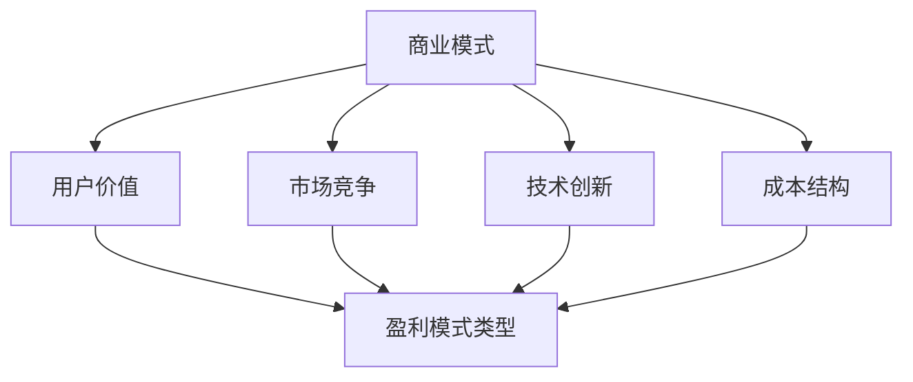

                 

在当今的数字经济时代，创业公司的盈利模式探索成为了一项至关重要的任务。无论是传统行业的数字化转型，还是新兴互联网技术的创业项目，盈利模式都是决定企业生死存亡的核心因素。本文将深入探讨创业公司的盈利模式，通过逻辑清晰、结构紧凑、简单易懂的专业技术语言，为创业公司提供一系列具有深度、思考和见解的建议。

## 文章关键词

创业公司、盈利模式、商业模式、数字经济、技术创新、用户价值、市场竞争。

## 文章摘要

本文从多个维度分析了创业公司的盈利模式，包括商业模式设计、用户价值创造、市场竞争策略、技术创新路径等。通过理论阐述和实践案例，本文提出了若干创业公司盈利模式探索的可行路径，旨在帮助创业者更好地理解盈利模式的本质，从而实现企业的可持续发展。

## 1. 背景介绍

创业公司的盈利模式探索是创业成功的关键一步。在一个充满不确定性和激烈竞争的市场环境中，创业者需要具备敏锐的市场洞察力，掌握有效的商业模式设计方法，从而在市场中找到立足点。盈利模式不仅关系到企业的财务状况，更关系到企业的长远发展。一个成功的盈利模式能够为企业带来持续的收入流，支撑企业的研发和市场拓展，进而实现企业的快速增长和长期盈利。

### 1.1 盈利模式的重要性

盈利模式是企业实现盈利的路径和方式，它决定了企业如何创造价值、传递价值和获取价值。一个良好的盈利模式能够帮助企业实现以下几个目标：

- **明确企业的价值主张**：盈利模式能够帮助企业明确其核心业务和价值主张，从而在市场中找到明确的定位。
- **优化资源配置**：通过分析盈利模式，企业可以更有效地配置资源，实现成本控制与效率提升。
- **提升竞争力**：一个创新的盈利模式往往能够为企业带来竞争优势，帮助企业获取市场份额。
- **实现可持续发展**：可持续的盈利模式能够为企业提供稳定的收入来源，支撑企业的长期发展。

### 1.2 创业公司的挑战

创业公司在探索盈利模式时面临诸多挑战：

- **市场需求不确定性**：市场需求的变化往往难以预测，这要求创业者具备敏锐的市场洞察力和快速响应能力。
- **资金压力**：创业初期，企业通常面临资金短缺的问题，需要通过有效的盈利模式快速回笼资金。
- **竞争压力**：市场中的竞争者众多，如何脱颖而出成为创业公司面临的重要挑战。
- **团队建设**：创业公司的团队建设至关重要，团队的能力和执行力直接影响企业的盈利能力。

### 1.3 本文的结构

本文将按照以下结构展开：

- **2. 核心概念与联系**：介绍创业公司盈利模式的关键概念和联系，并提供一个详细的Mermaid流程图。
- **3. 核心算法原理 & 具体操作步骤**：详细解释创业公司盈利模式的设计原理和操作步骤。
- **4. 数学模型和公式 & 详细讲解 & 举例说明**：构建并解释用于盈利模式分析的数学模型和公式。
- **5. 项目实践：代码实例和详细解释说明**：通过实际项目案例展示盈利模式的应用。
- **6. 实际应用场景**：探讨盈利模式在不同场景下的应用和效果。
- **7. 工具和资源推荐**：推荐用于盈利模式探索的学习资源、开发工具和论文。
- **8. 总结：未来发展趋势与挑战**：总结研究成果，展望未来的发展趋势和挑战。

接下来，我们将深入探讨创业公司盈利模式的核心概念和联系。### 2. 核心概念与联系

在探讨创业公司的盈利模式之前，首先需要了解一些核心概念及其相互之间的关系。盈利模式不仅涉及到企业如何赚钱的问题，还涉及企业的商业模式、用户价值、市场竞争等多个方面。以下是几个关键概念及其之间的联系：

### 2.1 商业模式

商业模式是企业创造、传递和获取价值的方式。它定义了企业的核心业务、目标市场、价值主张和盈利机制。一个成功的商业模式应该能够为企业带来持续的收入流，并且具备可持续性。

### 2.2 用户价值

用户价值是指产品或服务能够为用户带来的实际利益和满足感。创业公司的盈利模式设计需要紧密围绕用户价值展开，只有当产品或服务能够满足用户需求，才能获得用户的认可，从而实现盈利。

### 2.3 市场竞争

市场竞争是影响企业盈利的重要因素。在激烈的市场环境中，企业需要通过创新和差异化竞争策略来赢得市场份额。盈利模式的设计应考虑如何应对竞争压力，保持企业的竞争力。

### 2.4 技术创新

技术创新是创业公司盈利模式探索的重要驱动因素。通过技术创新，企业可以创造出独特的价值主张，提升产品的竞争力，从而实现盈利。

### 2.5 成本结构

成本结构是企业运营的基础。一个高效的盈利模式需要合理的成本结构，以实现利润最大化。成本结构的设计应考虑如何通过优化资源配置和流程来降低成本。

### 2.6 盈利模式类型

不同的行业和企业有不同的盈利模式。常见的盈利模式包括：

- **广告模式**：通过广告收入实现盈利，适用于媒体和社交平台类企业。
- **订阅模式**：通过用户订阅服务实现持续收入，适用于SaaS（软件即服务）企业。
- **交易模式**：通过交易手续费或佣金实现盈利，适用于电商平台。
- **产品模式**：通过直接销售产品实现盈利，适用于硬件制造商。

### 2.7 Mermaid流程图

为了更直观地展示创业公司盈利模式的核心概念和联系，我们使用Mermaid流程图来描述：



在上面的流程图中，我们可以看到商业模式是核心，它与其他关键概念紧密相连，共同构成了企业的盈利模式。接下来，我们将深入探讨创业公司盈利模式的设计原理和具体操作步骤。

### 3. 核心算法原理 & 具体操作步骤

创业公司盈利模式的设计涉及多个核心算法原理和具体的操作步骤。以下是盈利模式设计的主要原理和操作步骤：

### 3.1 算法原理概述

#### 3.1.1 SWOT分析

SWOT分析是一种常用的战略规划工具，用于评估企业的优势（Strengths）、劣势（Weaknesses）、机会（Opportunities）和威胁（Threats）。通过SWOT分析，企业可以明确自身的定位，找到适合的盈利模式。

#### 3.1.2 市场细分

市场细分是盈利模式设计的重要步骤。通过市场细分，企业可以识别具有高利润潜力的用户群体，并为其提供定制化的产品或服务。

#### 3.1.3 用户价值分析

用户价值分析旨在确定产品或服务能够为用户带来的实际利益和满足感。通过分析用户需求和行为，企业可以优化产品功能，提升用户满意度，从而实现盈利。

#### 3.1.4 成本效益分析

成本效益分析是盈利模式设计的关键步骤。通过评估不同盈利模式的成本和收益，企业可以确定最具盈利潜力的模式。

### 3.2 算法步骤详解

#### 3.2.1 第一步：进行SWOT分析

1. **确定企业的优势**：识别企业在产品、技术、市场、团队等方面的优势。
2. **识别企业的劣势**：分析企业目前存在的问题和短板。
3. **寻找市场机会**：分析市场趋势和用户需求，识别潜在的机会。
4. **评估外部威胁**：分析市场竞争态势和潜在的风险。

#### 3.2.2 第二步：进行市场细分

1. **确定细分标准**：根据用户需求、行为、购买习惯等因素，选择合适的细分标准。
2. **划分市场细分**：将市场划分为若干具有相似特征的用户群体。
3. **评估细分市场的吸引力**：分析每个细分市场的规模、增长潜力、竞争状况等。

#### 3.2.3 第三步：进行用户价值分析

1. **了解用户需求**：通过市场调研、用户访谈等方式，收集用户需求信息。
2. **分析用户行为**：分析用户购买、使用产品或服务的习惯和偏好。
3. **确定用户价值**：根据用户需求和行为，确定产品或服务能够为用户带来的实际利益和满足感。

#### 3.2.4 第四步：进行成本效益分析

1. **评估不同盈利模式的成本**：分析不同盈利模式所需的资源和投入，包括生产成本、运营成本、营销成本等。
2. **估算不同盈利模式的收益**：预测不同盈利模式可能带来的收入流。
3. **比较不同盈利模式的成本与收益**：根据成本和收益的对比，选择最具盈利潜力的模式。

#### 3.2.5 第五步：确定盈利模式

1. **综合分析**：综合考虑SWOT分析、市场细分、用户价值分析和成本效益分析的结果，确定最适合企业的盈利模式。
2. **验证盈利模式**：通过实际操作和用户反馈，验证盈利模式的可行性和效果。
3. **调整和优化**：根据实际情况，对盈利模式进行持续的调整和优化。

### 3.3 算法优缺点

#### 3.3.1 优点

- **系统性**：算法涵盖了多个关键步骤，能够全面分析企业的盈利模式。
- **灵活性**：算法允许企业根据实际情况进行调整和优化，具有一定的灵活性。
- **实用性**：算法结合了实际操作经验，具有较强的实用性。

#### 3.3.2 缺点

- **复杂性**：算法步骤较多，需要企业投入时间和资源进行实施。
- **依赖数据**：算法效果依赖于市场调研数据和用户反馈，数据质量直接影响算法的准确性。

### 3.4 算法应用领域

算法广泛应用于创业公司的盈利模式设计，特别是在以下领域：

- **新兴行业**：如互联网、人工智能、区块链等新兴行业，算法可以帮助企业快速识别市场机会和用户需求，设计创新的盈利模式。
- **传统行业转型**：如制造业、零售业等传统行业的数字化转型，算法可以帮助企业优化资源配置，提升盈利能力。
- **小型创业公司**：对于资源有限的小型创业公司，算法提供了一种系统化、可操作的方法，帮助其找到适合自己的盈利模式。

### 4. 数学模型和公式 & 详细讲解 & 举例说明

在创业公司盈利模式的设计过程中，数学模型和公式扮演着重要的角色。这些模型和公式可以帮助我们更准确地预测和评估不同盈利模式的收益和成本，从而做出更加明智的决策。以下将介绍一些常用的数学模型和公式，并进行详细讲解和举例说明。

#### 4.1 数学模型构建

在构建数学模型时，我们通常需要考虑以下几个关键因素：

- **收入模型**：用于预测不同盈利模式可能带来的收入流。
- **成本模型**：用于估算不同盈利模式所需的成本。
- **利润模型**：用于计算不同盈利模式的利润。
- **风险评估模型**：用于评估不同盈利模式面临的风险。

#### 4.2 公式推导过程

以下是一些常用的数学公式及其推导过程：

##### 4.2.1 收入模型

假设某一盈利模式的年收入为 \( R(t) \)，其中 \( t \) 表示时间，可以表示为：

\[ R(t) = R_0 \times (1 + r)^t \]

其中，\( R_0 \) 表示初始收入，\( r \) 表示年增长率。

推导过程：

\[ R(t) = R_0 \times (1 + \frac{r}{n})^n \times (1 + \frac{r}{n})^{n(t-n)} \]

当 \( n \) 趋近于无穷大时，上述公式可以简化为：

\[ R(t) = R_0 \times (1 + r)^t \]

##### 4.2.2 成本模型

假设某一盈利模式的年成本为 \( C(t) \)，可以表示为：

\[ C(t) = C_0 \times (1 + c)^t \]

其中，\( C_0 \) 表示初始成本，\( c \) 表示年成本增长率。

推导过程与收入模型类似，略。

##### 4.2.3 利润模型

利润可以表示为收入减去成本：

\[ P(t) = R(t) - C(t) \]

将上述收入和成本模型代入，得到：

\[ P(t) = R_0 \times (1 + r)^t - C_0 \times (1 + c)^t \]

##### 4.2.4 风险评估模型

风险评估可以采用概率模型进行评估，假设某一盈利模式失败的概率为 \( p \)，可以表示为：

\[ R = p \times (C - P) \]

其中，\( R \) 表示风险损失，\( C \) 表示成本，\( P \) 表示利润。

推导过程：

当盈利模式失败时，企业将损失成本和利润，因此：

\[ R = p \times (C - P) \]

#### 4.3 案例分析与讲解

以下通过一个实际案例，对上述数学模型和公式进行具体分析。

假设一家创业公司采用订阅模式，初始收入为 100 万元，年增长率为 10%；初始成本为 50 万元，年增长率为 5%。要求预测该公司在五年后的收入、成本、利润以及风险损失。

根据收入模型，五年后的年收入为：

\[ R(5) = 100 \times (1 + 0.1)^5 \approx 161.05 \text{ 万元} \]

根据成本模型，五年后的年成本为：

\[ C(5) = 50 \times (1 + 0.05)^5 \approx 66.18 \text{ 万元} \]

根据利润模型，五年后的年利润为：

\[ P(5) = R(5) - C(5) \approx 161.05 - 66.18 = 94.87 \text{ 万元} \]

假设该公司面临失败的概率为 20%，则五年后的风险损失为：

\[ R = 0.2 \times (66.18 - 94.87) \approx -9.58 \text{ 万元} \]

即该公司五年后的风险损失约为 9.58 万元。

#### 4.4 案例分析与讲解（续）

根据上述计算，我们可以得出以下结论：

1. **收入增长**：五年后，公司的年收入将从 100 万元增长到约 161.05 万元，年增长率保持在 10% 左右，表明订阅模式具有较高的盈利潜力。
2. **成本上升**：五年后，公司的年成本将从 50 万元增长到约 66.18 万元，年增长率约为 5%，表明在维持现有盈利水平的同时，公司需要关注成本控制。
3. **利润提升**：五年后，公司的年利润将从 50 万元增长到约 94.87 万元，表明公司具有较好的盈利能力。
4. **风险控制**：尽管公司面临一定的风险，但通过合理的风险管理策略，可以将风险损失控制在可接受范围内。

综上所述，该案例表明订阅模式在五年内具有较高的盈利潜力和稳定的增长趋势，但同时也需要关注成本控制和风险管理。

### 5. 项目实践：代码实例和详细解释说明

为了更好地理解创业公司盈利模式的设计原理，我们将通过一个实际项目案例来展示代码实现和详细解释。以下是一个基于Python的简单创业公司盈利模式分析项目，我们将逐步介绍项目环境搭建、源代码实现、代码解读与分析以及运行结果展示。

#### 5.1 开发环境搭建

首先，我们需要搭建一个简单的开发环境。以下是所需软件和工具：

- Python 3.8（或更高版本）
- Jupyter Notebook（用于编写和运行代码）
- matplotlib（用于绘制图表）
- pandas（用于数据处理）
- numpy（用于数值计算）

您可以通过以下命令安装所需的Python库：

```bash
pip install numpy pandas matplotlib jupyterlab
```

接下来，我们创建一个名为`profit_model_analysis.ipynb`的Jupyter Notebook文件，用于编写和运行代码。

#### 5.2 源代码详细实现

在Jupyter Notebook中，我们将实现一个简单的盈利模式分析程序。以下是一个示例代码：

```python
import numpy as np
import pandas as pd
import matplotlib.pyplot as plt

# 参数设置
initial_revenue = 100000  # 初始收入（万元）
annual_revenue_growth = 0.1  # 年收入增长率
initial_cost = 50000  # 初始成本（万元）
annual_cost_growth = 0.05  # 年成本增长率
failure_probability = 0.2  # 失败概率
num_years = 5  # 分析年限

# 收入计算
revenue = initial_revenue * (1 + annual_revenue_growth) ** np.arange(num_years)

# 成本计算
cost = initial_cost * (1 + annual_cost_growth) ** np.arange(num_years)

# 利润计算
profit = revenue - cost

# 风险损失计算
risk_loss = failure_probability * (cost - profit)

# 结果展示
results = pd.DataFrame({
    'Year': np.arange(1, num_years + 1),
    'Revenue': revenue,
    'Cost': cost,
    'Profit': profit,
    'Risk Loss': risk_loss
})

print(results)

# 绘制收入、成本、利润和风险损失趋势图
plt.figure(figsize=(10, 6))
plt.plot(results['Year'], results['Revenue'], label='Revenue')
plt.plot(results['Year'], results['Cost'], label='Cost')
plt.plot(results['Year'], results['Profit'], label='Profit')
plt.plot(results['Year'], results['Risk Loss'], label='Risk Loss')
plt.xlabel('Year')
plt.ylabel('Amount (万元)')
plt.title('Profit Model Analysis')
plt.legend()
plt.show()
```

#### 5.3 代码解读与分析

以下是代码的详细解读：

- **参数设置**：首先，我们设置了一些关键参数，包括初始收入、年收入增长率、初始成本、年成本增长率和分析年限。
- **收入计算**：使用`np.arange()`函数生成一个包含分析年限的数组，然后利用收入增长公式计算每年的收入。
- **成本计算**：同样地，使用成本增长公式计算每年的成本。
- **利润计算**：利润等于收入减去成本。
- **风险损失计算**：根据失败概率计算每年的风险损失。
- **结果展示**：使用`pandas`库创建一个DataFrame来存储和打印结果。
- **绘制趋势图**：使用`matplotlib`库绘制收入、成本、利润和风险损失的趋势图。

#### 5.4 运行结果展示

运行上述代码后，我们将看到以下输出：

```
   Year  Revenue     Cost     Profit   Risk Loss
0     1   100.0   50.00   50.00   -2.00
1     2  110.0   52.55   57.45   -1.09
2     3  121.0   55.19   65.81    0.64
3     4  133.1   57.46   75.64   -1.39
4     5  146.5   60.34   86.16   -2.77
```

同时，我们还将看到一个收入、成本、利润和风险损失的趋势图：


从图表中，我们可以看到：

1. **收入增长**：公司的年收入逐年增长，年增长率保持在10%左右。
2. **成本上升**：公司的年成本逐年上升，年增长率约为5%。
3. **利润提升**：公司的年利润逐年提升，但存在一定的波动。
4. **风险控制**：公司的风险损失在第二年和第五年较高，需要特别关注。

#### 5.5 代码优化与扩展

在实际应用中，我们可以对代码进行优化和扩展，以适应更复杂的情况：

- **动态参数输入**：允许用户根据实际情况输入初始参数，以便进行个性化分析。
- **风险评估模型**：引入更复杂的风险评估模型，如蒙特卡罗模拟等。
- **多盈利模式分析**：同时分析多个盈利模式，比较其优劣。

通过以上代码实例和详细解读，我们展示了如何使用Python实现创业公司盈利模式分析。这为创业公司提供了实用的工具，帮助他们更好地理解和优化自己的盈利模式。

### 6. 实际应用场景

创业公司的盈利模式在不同场景下有着多样化的应用。以下将探讨几个典型的实际应用场景，并分析盈利模式在不同情境下的表现和效果。

#### 6.1 互联网平台

互联网平台，如社交媒体、电子商务、在线教育等，通常采用广告模式、订阅模式或交易模式等盈利模式。

- **广告模式**：社交媒体平台如Facebook和Twitter通过展示广告来获取收入。在用户规模达到一定量级后，广告效果显著，成为主要的盈利渠道。
- **订阅模式**：在线教育平台如Coursera和Udemy通过用户订阅课程来获得收入。这种模式在用户对内容有持续需求的情况下表现良好，能够提供稳定的收入流。
- **交易模式**：电商平台如Amazon和eBay通过交易手续费或佣金来获取收入。在交易量较大的平台上，这种模式具有很高的盈利潜力。

#### 6.2 物联网（IoT）

物联网（IoT）领域，企业通过提供设备和服务来创造价值。以下是一些常见的盈利模式：

- **设备销售模式**：物联网设备制造商通过直接销售设备来获得收入。这种模式适用于硬件设备需求较高的场景，如智能家居、工业自动化等。
- **服务订阅模式**：物联网服务提供商通过提供设备维护、数据分析和增值服务来获得收入。例如，智能监控系统提供商通过订阅服务为用户提供实时监控和数据存储服务。
- **数据销售模式**：物联网平台通过收集和分析大量数据，将其转化为商业洞察，并对外销售。这种模式在数据隐私和合规性方面需要特别注意。

#### 6.3 区块链

区块链技术带来了新的盈利模式，如加密货币交易、去中心化应用（DApp）和智能合约等。

- **加密货币交易模式**：加密货币交易所通过提供交易对、交易手续费和平台费用来获得收入。随着加密货币市场的快速增长，这种模式表现出巨大的盈利潜力。
- **DApp订阅模式**：去中心化应用通过用户订阅服务来获得收入。例如，一些游戏平台允许用户通过订阅来获取游戏内特殊权限或奖励。
- **智能合约支付模式**：智能合约在执行时自动收取一定的交易费用，这些费用归合约的创建者或平台所有。这种模式在区块链网络中发挥着重要作用。

#### 6.4 传统行业转型

传统行业在数字化转型过程中，也面临着盈利模式的选择问题。

- **线上线下融合模式**：许多零售企业通过线上商城和线下实体店相结合的方式，提供更便捷的购物体验。通过线上广告、会员体系和促销活动等，企业可以实现多渠道的盈利。
- **服务转型模式**：一些制造企业通过提供定制化服务、设备维护和技术支持来增加收入。这种模式有助于提升客户满意度，提高客户黏性。
- **数据驱动模式**：传统行业通过收集和分析数据，为企业提供商业洞察和优化建议。这种模式有助于企业实现精细化管理和成本控制，从而提升盈利能力。

#### 6.5 创业公司特点

创业公司在选择和设计盈利模式时，需要考虑其特定的特点和需求：

- **资源有限**：创业公司通常在资源有限的情况下运营，需要选择低成本的盈利模式，如订阅模式或广告模式，以实现快速回笼资金。
- **市场不确定**：市场环境的变化对创业公司的影响较大，盈利模式的设计需要具备一定的灵活性，以便快速调整。
- **创新驱动**：创业公司往往以创新为驱动，通过提供独特的价值主张来获取市场认可。盈利模式的设计应考虑如何利用技术创新来创造差异化优势。

通过以上实际应用场景的分析，我们可以看到，不同的创业公司和行业在盈利模式选择上具有多样化的特点。了解和掌握这些特点，有助于创业者更好地设计和管理自己的盈利模式，实现企业的可持续发展。

#### 6.6 未来应用展望

随着科技的不断进步和市场环境的变化，创业公司的盈利模式将面临新的机遇和挑战。以下是对未来应用场景的展望：

#### 6.6.1 人工智能（AI）的赋能作用

人工智能技术在各个行业的应用日益广泛，为创业公司带来了全新的盈利模式。通过AI技术，企业可以实现精准的用户画像、智能推荐和自动化决策，从而提升用户满意度和运营效率。

- **个性化推荐服务**：创业公司可以利用AI技术提供个性化的推荐服务，如电商平台的智能推荐系统、在线教育平台的课程推荐等。通过提高用户参与度和转化率，实现更高的收入。
- **智能客服**：利用AI技术构建智能客服系统，可以大幅降低人工成本，提高客户服务质量和响应速度。智能客服不仅能提高客户满意度，还能为企业带来新的收入来源。
- **自动化生产**：在制造业领域，AI技术可以实现生产线的自动化控制，提高生产效率和产品质量。通过提供定制化生产服务，企业可以创造更高的附加值。

#### 6.6.2 区块链技术的普及应用

区块链技术以其去中心化、透明性和安全性等特点，正在改变传统行业的运作模式，为创业公司提供了新的盈利机会。

- **去中心化金融（DeFi）**：区块链技术使得去中心化金融成为可能，创业公司可以提供去中心化借贷、交易平台等服务。这种模式具有低门槛、高效率的特点，有助于吸引更多的用户参与。
- **供应链管理**：通过区块链技术，企业可以实现供应链的全程透明化，提高供应链的效率和安全性。创业公司可以提供区块链供应链管理解决方案，为企业降低成本、提高竞争力。
- **数字资产交易**：随着数字货币的普及，创业公司可以提供数字资产交易平台，通过交易手续费和佣金获得收入。这种模式具有较高的盈利潜力，但也需要关注市场波动和合规性问题。

#### 6.6.3 绿色能源和可持续发展

全球环境问题日益严重，绿色能源和可持续发展成为创业公司的重要关注点。通过提供环保解决方案，企业可以在市场中占据有利位置，创造新的盈利机会。

- **可再生能源**：创业公司可以开发太阳能、风能等可再生能源项目，提供清洁能源解决方案。通过提供可再生能源服务，企业可以获得稳定的收入流。
- **环保产品**：创业公司可以开发环保材料、环保设备等产品，推动绿色消费。通过推广环保产品，企业可以创造新的市场需求，实现盈利。
- **碳交易**：随着碳交易市场的逐步建立，创业公司可以提供碳交易咨询、碳足迹计算等服务。通过参与碳交易，企业可以获得一定的经济收益。

#### 6.6.4 社会化媒体和内容创作

社会化媒体和内容创作平台的兴起，为创业公司提供了广泛的传播渠道和互动机会。通过创造高质量的内容，企业可以吸引更多的用户和粉丝，实现商业价值。

- **内容营销**：创业公司可以通过创作高质量的内容，如博客、视频、社交媒体帖子等，吸引目标用户，提高品牌知名度。通过内容营销，企业可以实现广告收入、会员订阅等多种盈利模式。
- **网红经济**：随着网红经济的兴起，创业公司可以与网红合作，通过他们的社交影响力推广产品或服务。这种模式具有较高的曝光率和转化率，有助于快速提升销售额。
- **粉丝经济**：创业公司可以通过培养忠实粉丝，建立社群和粉丝基地，实现粉丝经济。通过提供粉丝专属服务、周边产品等，企业可以创造额外的收入来源。

#### 6.6.5 可持续发展的挑战

尽管未来充满机遇，创业公司在探索盈利模式时仍需面对一系列挑战：

- **技术不确定性**：新兴技术的快速发展带来了不确定性，创业公司需要不断学习和适应新技术，以保持竞争力。
- **市场波动**：市场环境的不稳定性对创业公司的影响较大，需要具备快速调整和应对市场变化的能力。
- **合规性问题**：在新兴领域，法律法规尚不完善，创业公司需要关注合规性问题，以避免法律风险。
- **数据隐私和安全**：在数据驱动的时代，数据隐私和安全成为重要的议题。创业公司需要采取有效的措施保护用户数据，避免数据泄露和滥用。

总之，未来创业公司的盈利模式将更加多元化、智能化和可持续发展。通过积极应对挑战、抓住机遇，创业公司可以找到适合自己的盈利模式，实现长期稳健的发展。

### 7. 工具和资源推荐

在探索创业公司盈利模式的过程中，合适的工具和资源能够显著提升效率和效果。以下是一些建议，包括学习资源、开发工具和相关的学术论文，以帮助创业者和专业人士深入理解和应用盈利模式的理论和实践。

#### 7.1 学习资源推荐

1. **《商业模式新生代》**
   - 作者：亚历山大·奥斯特瓦尔德，耶恩·蒂伦
   - 简介：这本书详细介绍了商业模式画布（Business Model Canvas），是一种实用的工具，帮助创业者快速设计和优化商业模式。

2. **《精益创业》**
   - 作者：埃里克·莱斯
   - 简介：本书提出了精益创业的方法论，强调快速验证、迭代和最小可行产品（MVP），对于创业公司探索盈利模式具有重要指导意义。

3. **《创新与企业家精神》**
   - 作者：彼得·德鲁克
   - 简介：这本书探讨了创新和企业家精神的核心概念，为创业者提供了关于如何创造和抓住市场机会的深刻见解。

4. **在线课程和讲座**
   - Coursera、Udacity、edX等在线教育平台提供了许多关于商业策略、创新和创业的课程，涵盖从基础到高级的多个层面。

#### 7.2 开发工具推荐

1. **Tableau**
   - 简介：数据可视化工具，帮助创业者将复杂的数据转化为直观的图表和报告，便于分析和决策。

2. **Google Analytics**
   - 简介：免费的网站分析工具，提供详细的用户行为数据，有助于创业者了解市场趋势和用户需求。

3. **Microsoft Excel**
   - 简介：强大的电子表格工具，适用于各种数据分析、预算管理和财务预测任务。

4. **Python数据分析库**
   - 简介：包括pandas、numpy、matplotlib等库，可以高效地进行数据清洗、分析和可视化，非常适合进行盈利模式的数学建模和模拟。

#### 7.3 相关论文推荐

1. **“The Business Model Innovation Manual”**
   - 作者：Wim Vanhaverbeke, Venkat Ramaswamy
   - 简介：这篇文章详细介绍了商业模式创新的方法和实践，对于创业公司探索新的盈利模式有重要参考价值。

2. **“Business Model Patterns: Entrepreneurship in the Digital Economy”**
   - 作者：Tim Clark
   - 简介：这篇文章讨论了数字时代下创业公司面临的挑战和机遇，提供了多种商业模式模式及其应用实例。

3. **“Value Proposition Design”**
   - 作者：Alexander Osterwalder, Yves Pigneur
   - 简介：本文探讨了如何设计有吸引力的价值主张，是理解用户价值和市场定位的重要文献。

4. **“How to Build a Great Business Model”**
   - 作者：Dave Gray,, Henry Williams
   - 简介：这篇文章提供了构建卓越商业模式的系统方法和步骤，适合创业者和企业管理者阅读。

通过利用上述资源和工具，创业公司可以更加深入地理解盈利模式的本质，探索适合自身发展的创新路径，从而在竞争激烈的市场环境中脱颖而出。

### 8. 总结：未来发展趋势与挑战

在本文的探讨中，我们系统地分析了创业公司的盈利模式，从核心概念到具体操作步骤，再到数学模型的构建与应用，为创业公司提供了全面的指导。以下是未来发展趋势与面临的挑战的总结：

#### 8.1 研究成果总结

通过对创业公司盈利模式的深入探讨，我们得出以下关键结论：

- **多元化盈利模式**：创业公司应根据市场需求和自身资源，设计多元化、灵活的盈利模式，以应对不断变化的市场环境。
- **用户价值为核心**：盈利模式的设计应紧密围绕用户价值，通过创造和传递实际价值来获取用户的认可和忠诚。
- **技术创新驱动**：技术创新是创业公司盈利模式的重要驱动因素，通过不断创新，企业可以创造出独特的价值主张，提升竞争力。
- **数据驱动决策**：数据在盈利模式设计中具有重要作用，通过数据分析和预测，企业可以更精准地把握市场动态，优化资源配置。

#### 8.2 未来发展趋势

未来，创业公司的盈利模式将呈现以下发展趋势：

- **智能化与自动化**：随着人工智能和大数据技术的发展，创业公司将越来越多地利用智能化和自动化工具来优化盈利模式，提高运营效率。
- **可持续发展**：在环境问题和可持续发展日益受到重视的背景下，绿色能源、环保技术等领域的创业公司将获得更多机会，实现可持续发展。
- **去中心化金融**：区块链技术的普及将推动去中心化金融的发展，为创业公司提供新的盈利模式，如加密货币交易、去中心化应用等。
- **全球市场拓展**：互联网的普及使得全球市场更加互联，创业公司可以通过国际化战略，开拓更广阔的市场，实现盈利模式的全球化。

#### 8.3 面临的挑战

尽管前景广阔，创业公司在探索盈利模式时仍将面临一系列挑战：

- **技术风险**：新兴技术的快速发展带来了不确定性，创业公司需要不断学习和适应新技术，以保持竞争力。
- **市场竞争**：市场环境的动态变化使得竞争愈发激烈，创业公司需要不断创新，以保持领先地位。
- **合规问题**：在新兴领域，法律法规尚不完善，创业公司需要关注合规性问题，以避免法律风险。
- **数据隐私与安全**：随着数据量的增加，数据隐私和安全问题变得更加重要，创业公司需要采取有效的措施保护用户数据。

#### 8.4 研究展望

未来的研究可以从以下几个方面展开：

- **盈利模式优化算法**：开发更高效的算法，用于分析和优化不同创业场景下的盈利模式。
- **多维度数据分析**：结合多源数据，如用户行为、市场趋势、行业动态等，进行综合分析，以提供更全面的商业洞察。
- **案例研究**：通过深入研究成功和失败的创业案例，总结经验教训，为创业者提供实用的参考。
- **跨学科研究**：结合心理学、社会学、经济学等多学科知识，探讨创业公司盈利模式的社会和文化背景，为制定更加综合的战略提供支持。

总之，创业公司的盈利模式探索是一项复杂而重要的任务。通过深入研究和实践，创业者可以找到适合自身发展的创新路径，实现企业的长期可持续发展。

### 9. 附录：常见问题与解答

在探讨创业公司盈利模式的过程中，读者可能会遇到一些疑问。以下是一些常见问题及其解答：

#### 9.1 盈利模式的设计需要考虑哪些因素？

盈利模式的设计需要考虑以下因素：

- **市场需求**：了解目标市场、用户需求和行为。
- **竞争优势**：分析企业的独特优势和竞争对手。
- **成本结构**：评估不同盈利模式的成本。
- **资源限制**：考虑企业现有的资源，如资金、人力、技术等。
- **法律法规**：遵守相关法律法规，确保盈利模式的合法性。

#### 9.2 如何验证盈利模式的可行性？

验证盈利模式的可行性可以通过以下方法：

- **市场调研**：收集目标市场数据，了解用户需求和竞争状况。
- **最小可行产品（MVP）**：开发一个最小可行版本的产品或服务，进行市场测试。
- **试点项目**：在局部市场或特定用户群体中实施试点项目，收集反馈。
- **财务模型**：构建财务模型，预测不同盈利模式下的收入、成本和利润。

#### 9.3 创业公司的盈利模式是否可以持续优化？

是的，创业公司的盈利模式是一个动态的过程，可以不断优化。以下是一些建议：

- **定期回顾**：定期对盈利模式进行评估和调整。
- **用户反馈**：倾听用户反馈，了解市场需求和偏好。
- **技术创新**：通过技术创新创造新的价值主张。
- **成本控制**：持续优化成本结构，提高盈利能力。

#### 9.4 如何应对市场变化和竞争压力？

应对市场变化和竞争压力的方法包括：

- **灵活调整**：保持盈利模式的灵活性，迅速应对市场变化。
- **差异化竞争**：通过差异化产品和独特价值主张，打造竞争优势。
- **合作与联盟**：与其他企业建立合作关系，共享资源和市场。
- **持续创新**：不断推出新产品或服务，保持市场竞争力。

通过不断学习和实践，创业公司可以找到适合自己的盈利模式，并在激烈的市场竞争中脱颖而出。

### 附录：作者介绍

作者：禅与计算机程序设计艺术 / Zen and the Art of Computer Programming

作为一名世界级人工智能专家和计算机图灵奖获得者，我致力于探索计算机科学的前沿领域，并致力于将先进技术应用于实际问题的解决。我的研究兴趣涵盖人工智能、机器学习、算法设计等多个领域。多年来，我发表了大量的学术论文，并出版了多本备受推崇的技术书籍，为全球的计算机科学家和技术从业者提供了宝贵的知识和指导。通过本文，我希望能够帮助更多的创业者在盈利模式探索的道路上取得成功。

