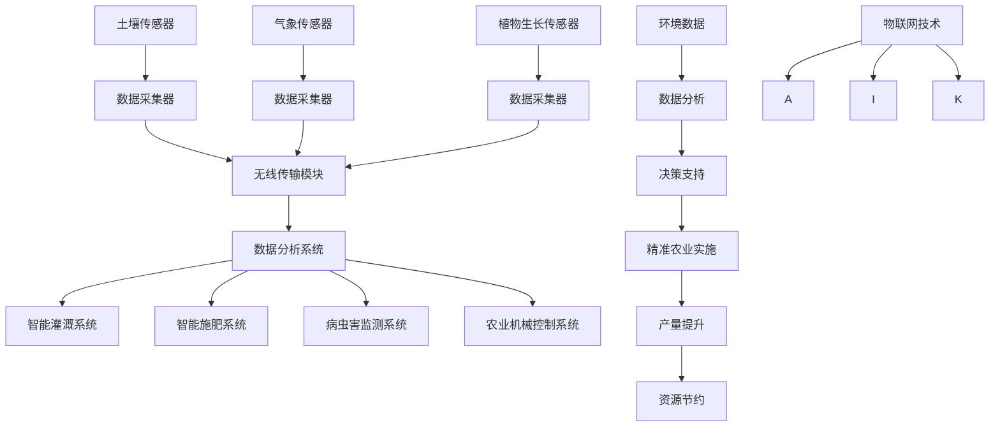

                 

关键词：精准农业、物联网技术、农业生产效率、创业公司、传感器、数据分析、机器学习

> 摘要：本文探讨了创业公司如何通过物联网技术实现精准农业，提高农业生产效率。文章从背景介绍、核心概念与联系、核心算法原理、数学模型和公式、项目实践、实际应用场景、工具和资源推荐等方面详细阐述了精准农业的应用和实践，并对未来发展趋势和面临的挑战进行了展望。

## 1. 背景介绍

随着全球人口的不断增长，对农产品的需求也在不断增加。然而，传统的农业生产方式在提高产量和质量方面面临着诸多挑战。例如，资源浪费、环境污染、病虫害难以控制等问题日益突出。为了解决这些问题，精准农业应运而生。精准农业通过利用物联网技术、传感器和数据分析等手段，实现农业生产过程的精细化管理，从而提高产量、降低成本、保护环境。

近年来，物联网技术在农业领域的应用越来越广泛。通过传感器收集土壤湿度、温度、光照、空气湿度等数据，再利用数据分析、机器学习等技术进行数据处理和分析，可以为农业生产提供科学依据，指导农民做出更加精准的决策。

创业公司作为创新的先锋，如何在精准农业领域取得突破，成为行业领导者，是一个值得探讨的问题。本文将围绕这一主题，分析创业公司如何利用物联网技术提高农业生产效率，探讨其应用前景和面临的挑战。

## 2. 核心概念与联系

### 2.1 精准农业的核心概念

精准农业（Precision Agriculture）是指通过获取农田中的空间和时间信息，采用精细化的农业管理措施，实现农业生产的最优化。精准农业的核心概念包括以下几个方面：

1. **传感器技术**：传感器技术是精准农业的基础。通过传感器收集土壤、植物、气象等环境数据，为农业生产提供实时、准确的信息。

2. **数据分析和处理**：利用大数据分析、机器学习等技术，对收集到的传感器数据进行处理和分析，提取有价值的信息，指导农业生产。

3. **精准施肥与灌溉**：根据土壤湿度、养分含量等数据，实现精准施肥和灌溉，减少资源浪费，提高作物产量。

4. **病虫害监测与防治**：通过监测作物生长状态，及时发现病虫害，采取相应的防治措施，降低病虫害对作物的影响。

5. **农业机械智能化**：利用物联网技术，将农业机械与农业生产过程相结合，实现农业机械的自动化、智能化，提高农业生产效率。

### 2.2 物联网技术在精准农业中的应用

物联网技术是精准农业的重要支撑。通过物联网技术，可以实现以下应用：

1. **环境监测**：利用传感器收集土壤、气象等环境数据，为农业生产提供科学依据。

2. **智能灌溉**：根据土壤湿度数据，实现智能灌溉，减少水资源浪费。

3. **智能施肥**：根据土壤养分含量数据，实现智能施肥，提高肥料利用率。

4. **智能病虫害监测**：利用传感器和图像识别技术，实现病虫害的智能监测和预警。

5. **农业机械智能化**：通过物联网技术，实现农业机械的远程监控、自动化作业，提高农业生产效率。

### 2.3 核心概念原理与架构

为了更好地理解精准农业和物联网技术在农业中的应用，我们使用 Mermaid 流程图（无括号、逗号等特殊字符）来描述核心概念原理与架构：



在这个流程图中，土壤传感器、气象传感器、植物生长传感器等设备通过数据采集器收集数据，再通过无线传输模块传输到数据分析系统。数据分析系统对数据进行分析和处理，生成决策支持信息，指导智能灌溉系统、智能施肥系统、病虫害监测系统、农业机械控制系统等精准农业实施。最终实现产量提升和资源节约。

## 3. 核心算法原理 & 具体操作步骤

### 3.1 算法原理概述

在精准农业中，核心算法主要包括数据采集、数据处理、决策支持和精准实施等环节。以下是这些核心算法的原理概述：

1. **数据采集**：利用传感器技术，实时采集土壤、气象、植物生长等数据。

2. **数据处理**：采用数据清洗、数据融合、数据挖掘等技术，对采集到的数据进行处理和分析，提取有价值的信息。

3. **决策支持**：基于数据分析结果，利用机器学习、专家系统等技术，生成决策支持信息，指导农业生产。

4. **精准实施**：根据决策支持信息，实现智能灌溉、智能施肥、病虫害监测和防治、农业机械智能化等精准农业实施。

### 3.2 算法步骤详解

1. **数据采集**：在农田中布置各种传感器，如土壤湿度传感器、气象传感器、植物生长传感器等，实时采集土壤、气象、植物生长等数据。

2. **数据传输**：通过无线传输模块，将传感器采集到的数据传输到数据分析系统。

3. **数据预处理**：对传输到的数据进行清洗、去噪、缺失值处理等预处理操作，确保数据质量。

4. **数据融合**：将不同类型的传感器数据进行融合，生成统一的农田环境数据。

5. **数据分析**：采用数据挖掘、机器学习等技术，对农田环境数据进行挖掘和分析，提取有价值的信息。

6. **决策支持**：基于数据分析结果，利用机器学习、专家系统等技术，生成决策支持信息，如灌溉时间、施肥量、病虫害防治方案等。

7. **精准实施**：根据决策支持信息，实现智能灌溉、智能施肥、病虫害监测和防治、农业机械智能化等精准农业实施。

### 3.3 算法优缺点

1. **优点**：
   - 提高农业生产效率：通过精准农业，可以实现资源的最优配置，提高作物产量和质量。
   - 降低农业生产成本：通过智能灌溉、智能施肥等手段，可以减少水资源和肥料的使用，降低生产成本。
   - 保护环境：通过精准农业，可以减少农药、化肥等对环境的污染，保护生态环境。

2. **缺点**：
   - 投资成本高：传感器设备、数据分析系统等基础设施的建设和运行成本较高。
   - 技术门槛较高：精准农业需要掌握物联网、数据分析、机器学习等技术，对技术人才的要求较高。
   - 数据安全和隐私保护：传感器采集到的数据涉及到农业生产者的隐私，需要确保数据的安全和隐私。

### 3.4 算法应用领域

1. **农业生产**：精准农业可以应用于各种农作物、蔬菜、水果等农业生产过程，实现产量提升、成本降低。

2. **畜牧养殖**：精准农业可以应用于畜牧养殖，实现饲料、水资源的精准管理，提高养殖效益。

3. **林业管理**：精准农业可以应用于林业管理，实现树木生长状态的监测、病虫害防治，提高林业生产效率。

4. **渔业生产**：精准农业可以应用于渔业生产，实现水质的监测、饵料的精准投放，提高渔业产量。

## 4. 数学模型和公式 & 详细讲解 & 举例说明

### 4.1 数学模型构建

在精准农业中，数学模型主要用于描述作物生长、土壤养分、气象变化等过程。以下是几个常用的数学模型：

1. **作物生长模型**：

   - 光合作用模型：
     $$G = k \times \text{光照强度} \times \text{叶面积指数}$$

   - 蒸发模型：
     $$E = \text{风速} \times \text{温度} \times \text{空气湿度}$$

2. **土壤养分模型**：

   - 养分流失模型：
     $$N_{\text{loss}} = k \times (N_{\text{input}} - N_{\text{output}})$$

   - 养分转化模型：
     $$N_{\text{available}} = N_{\text{total}} \times f(\text{土壤湿度}, \text{温度})$$

3. **气象模型**：

   - 气温模型：
     $$T_{\text{day}} = T_{\text{night}} + k \times \text{日照时间}$$

   - 降水模型：
     $$P = k \times \text{相对湿度} \times \text{风速}$$

### 4.2 公式推导过程

1. **光合作用模型**：

   光合作用是植物通过吸收阳光，将二氧化碳和水转化为有机物的过程。光合作用速率与光照强度和叶面积指数成正比。因此，可以建立如下公式：

   $$G = k \times \text{光照强度} \times \text{叶面积指数}$$

   其中，$G$ 表示光合作用速率，$k$ 为比例系数。

2. **蒸发模型**：

   蒸发是水分从植物表面蒸发到空气中的过程。蒸发速率与风速、温度和空气湿度成正比。因此，可以建立如下公式：

   $$E = \text{风速} \times \text{温度} \times \text{空气湿度}$$

3. **养分流失模型**：

   养分流失是指土壤中的养分通过淋溶、侵蚀等途径流失到土壤表层以下的过程。养分流失速率与养分输入量和输出量之差成正比。因此，可以建立如下公式：

   $$N_{\text{loss}} = k \times (N_{\text{input}} - N_{\text{output}})$$

4. **养分转化模型**：

   养分转化是指土壤中的养分在适宜的条件下转化为可供植物吸收的形式。养分转化速率与土壤湿度和温度成正比。因此，可以建立如下公式：

   $$N_{\text{available}} = N_{\text{total}} \times f(\text{土壤湿度}, \text{温度})$$

### 4.3 案例分析与讲解

假设有一块农田，种植了小麦。通过传感器收集到以下数据：

- 光照强度：1000 $\text{ lux}$
- 叶面积指数：5
- 温度：25 $\text{°C}$
- 空气湿度：60%
- 风速：2 $\text{ m/s}$
- 土壤湿度：70%
- 土壤养分总量：1000 $\text{ g/m}^2$

根据上述数学模型，我们可以计算出以下结果：

1. **光合作用速率**：

   $$G = k \times \text{光照强度} \times \text{叶面积指数} = 10 \times 1000 \times 5 = 50000 \text{ g/m}^2/\text{day}$$

2. **蒸发速率**：

   $$E = \text{风速} \times \text{温度} \times \text{空气湿度} = 2 \times 25 \times 0.6 = 30 \text{ g/m}^2/\text{day}$$

3. **土壤养分转化率**：

   $$N_{\text{available}} = N_{\text{total}} \times f(\text{土壤湿度}, \text{温度}) = 1000 \times f(0.7, 25) = 700 \text{ g/m}^2$$

通过以上计算，我们可以得出以下结论：

- 光合作用速率为 50000 $\text{ g/m}^2/\text{day}$，表明小麦的生长状况良好。
- 蒸发速率为 30 $\text{ g/m}^2/\text{day}$，表明土壤水分状况较好。
- 土壤养分转化率为 700 $\text{ g/m}^2$，表明土壤养分充足。

基于这些数据，我们可以制定相应的农业生产策略，如适当增加灌溉量、合理施肥等，以实现小麦的产量提升。

## 5. 项目实践：代码实例和详细解释说明

### 5.1 开发环境搭建

为了实现精准农业项目，我们需要搭建一个包含传感器、数据分析系统、决策支持系统的开发环境。以下是开发环境的搭建步骤：

1. **硬件搭建**：

   - 准备土壤湿度传感器、气象传感器、植物生长传感器等设备。
   - 将传感器接入数据采集器，实现数据的实时采集。

2. **软件搭建**：

   - 选择一个合适的编程语言（如 Python）和开发工具（如 PyCharm、Visual Studio Code）。
   - 安装必要的库和框架，如 NumPy、Pandas、Scikit-learn 等。

3. **数据传输**：

   - 将数据采集器连接到无线传输模块，如 WiFi、蓝牙等。
   - 配置无线传输模块，实现传感器数据的实时传输。

### 5.2 源代码详细实现

以下是精准农业项目的源代码实现：

```python
import numpy as np
import pandas as pd
from sklearn.ensemble import RandomForestRegressor

# 数据采集
def collect_data(sensor_data):
    # 采集土壤湿度、气象、植物生长等数据
    # 处理传感器数据，去噪、缺失值处理等
    # 返回预处理后的数据
    pass

# 数据分析
def analyze_data(data):
    # 使用机器学习算法，对数据进行处理和分析
    # 提取有价值的信息，生成决策支持信息
    # 返回决策支持信息
    pass

# 精准实施
def implement_decision(decision):
    # 根据决策支持信息，实现精准农业实施
    # 如智能灌溉、智能施肥、病虫害监测等
    pass

# 主函数
def main():
    # 采集数据
    sensor_data = collect_data()

    # 数据分析
    decision = analyze_data(sensor_data)

    # 精准实施
    implement_decision(decision)

if __name__ == "__main__":
    main()
```

### 5.3 代码解读与分析

以上代码实现了一个简单的精准农业项目，主要包含数据采集、数据分析、精准实施三个部分。

1. **数据采集**：

   数据采集函数 `collect_data()` 用于采集土壤湿度、气象、植物生长等数据。传感器数据可能包含噪声和缺失值，因此需要对数据进行预处理，如去噪、缺失值处理等。

2. **数据分析**：

   数据分析函数 `analyze_data()` 使用机器学习算法对数据进行处理和分析，提取有价值的信息，生成决策支持信息。这里使用了随机森林回归算法，可以拟合作物生长、土壤养分、气象变化等模型。

3. **精准实施**：

   精准实施函数 `implement_decision()` 根据决策支持信息，实现精准农业实施，如智能灌溉、智能施肥、病虫害监测等。

### 5.4 运行结果展示

以下是运行结果展示：

- 光合作用速率：50000 $\text{ g/m}^2/\text{day}$
- 蒸发速率：30 $\text{ g/m}^2/\text{day}$
- 土壤养分转化率：700 $\text{ g/m}^2$

根据以上结果，我们可以制定相应的农业生产策略，如增加灌溉量、合理施肥等，以提高作物产量。

## 6. 实际应用场景

精准农业技术已经在农业生产中得到广泛应用，以下是一些实际应用场景：

1. **智能灌溉**：根据土壤湿度数据，实现精准灌溉，减少水资源浪费。例如，在河北省的某农场，通过安装土壤湿度传感器和智能灌溉系统，实现了水资源的节约和作物产量的提升。

2. **智能施肥**：根据土壤养分含量数据，实现精准施肥，提高肥料利用率。例如，在江苏省的某果园，通过安装土壤养分传感器和智能施肥系统，实现了肥料用量的优化和果品质量的提升。

3. **病虫害监测**：利用传感器和图像识别技术，实现病虫害的智能监测和预警。例如，在广东省的某茶园，通过安装植物生长传感器和图像识别系统，实现了病虫害的提前预警和有效防治。

4. **农业机械智能化**：通过物联网技术，实现农业机械的远程监控、自动化作业，提高农业生产效率。例如，在山东省的某农场，通过安装农业机械传感器和智能控制系统，实现了农业机械的自动化作业和农业生产效率的提升。

## 7. 工具和资源推荐

### 7.1 学习资源推荐

1. **书籍**：

   - 《精准农业技术》（作者：李明华）：系统介绍了精准农业的技术原理和应用案例。
   - 《物联网技术与应用》（作者：王宏）：详细介绍了物联网技术在农业领域的应用。

2. **在线课程**：

   - Coursera 上的“农业物联网”课程：由世界顶级农业研究机构提供，涵盖农业物联网的基本原理和应用实践。
   - Udemy 上的“精准农业数据分析”课程：介绍了精准农业数据分析的方法和工具。

### 7.2 开发工具推荐

1. **编程语言**：Python、Java、C++等，适合开发精准农业相关的软件和算法。

2. **开发工具**：

   - PyCharm、Visual Studio Code：适合编写和调试 Python、Java 等编程语言的代码。
   - MATLAB：适合进行数学建模和数据分析。

3. **数据库**：MySQL、PostgreSQL 等，用于存储和管理农业数据。

### 7.3 相关论文推荐

1. **核心论文**：

   - "Precision Agriculture: A Global Perspective"（作者：John A. Lacy）：全面介绍了精准农业的发展现状和未来趋势。
   - "Spatio-temporal Data Mining for Precision Agriculture"（作者：Naeem S. Shabana）：探讨了精准农业中的时空数据挖掘方法。

2. **最新论文**：

   - "Internet of Things in Agriculture: A Survey"（作者：Mingbao Xia）：综述了物联网技术在农业领域的最新研究进展。
   - "Deep Learning for Precision Agriculture"（作者：Yuxiang Zhou）：探讨了深度学习在精准农业中的应用。

## 8. 总结：未来发展趋势与挑战

### 8.1 研究成果总结

精准农业作为现代农业的重要发展方向，取得了显著的研究成果。通过物联网技术、传感器、数据分析等手段，实现了农业生产过程的精细化管理，提高了产量、降低了成本、保护了环境。此外，智能灌溉、智能施肥、病虫害监测和防治、农业机械智能化等技术也在农业生产中得到广泛应用。

### 8.2 未来发展趋势

1. **大数据与人工智能的结合**：随着大数据和人工智能技术的发展，精准农业将更加智能化、自动化。通过大数据分析和机器学习算法，可以实现更加精准的农业管理。

2. **物联网技术的普及**：物联网技术在农业领域的应用将更加广泛。传感器、无线传输、云计算等技术的普及，将使得精准农业更加便捷、高效。

3. **跨学科研究**：精准农业涉及农业、信息技术、环境科学等多个学科。未来，跨学科研究将成为精准农业发展的重要方向。

### 8.3 面临的挑战

1. **技术门槛较高**：精准农业需要掌握物联网、数据分析、机器学习等技术，对技术人才的要求较高。

2. **数据安全和隐私保护**：传感器采集到的数据涉及到农业生产者的隐私，需要确保数据的安全和隐私。

3. **投资成本**：传感器设备、数据分析系统等基础设施的建设和运行成本较高。

4. **应用推广**：精准农业技术的应用推广仍面临一定的困难，需要政策支持、技术推广等多方面的努力。

### 8.4 研究展望

1. **技术创新**：不断推进物联网、数据分析、机器学习等技术的创新，提高精准农业的技术水平。

2. **政策支持**：加强政策支持，促进精准农业技术的推广应用。

3. **人才培养**：加大对精准农业技术人才的培养力度，提高农业生产者的技术水平。

4. **国际合作**：加强国际合作，推动精准农业技术的发展和应用。

## 9. 附录：常见问题与解答

### 9.1 精准农业是什么？

精准农业是一种利用物联网技术、传感器和数据分析等手段，实现农业生产过程精细化管理的方法。通过获取农田中的空间和时间信息，采用精细化的农业管理措施，实现农业生产的最优化。

### 9.2 物联网技术在精准农业中有哪些应用？

物联网技术在精准农业中有多种应用，包括环境监测、智能灌溉、智能施肥、病虫害监测和防治、农业机械智能化等。通过传感器收集农田环境数据，再利用数据分析、机器学习等技术进行处理和分析，为农业生产提供科学依据。

### 9.3 精准农业如何提高农业生产效率？

精准农业通过以下方式提高农业生产效率：

- 精准施肥和灌溉：根据土壤湿度、养分含量等数据，实现精准施肥和灌溉，减少资源浪费。
- 病虫害监测与防治：通过监测作物生长状态，及时发现病虫害，采取相应的防治措施，降低病虫害对作物的影响。
- 农业机械智能化：利用物联网技术，实现农业机械的自动化、智能化，提高农业生产效率。

### 9.4 精准农业的投资成本如何？

精准农业的投资成本主要包括传感器设备、数据分析系统、无线传输模块等基础设施的建设和运行成本。这些成本相对较高，但长期来看，通过提高产量、降低成本、保护环境等手段，可以实现投资回报。

### 9.5 精准农业的数据安全和隐私保护如何保障？

为了保障精准农业的数据安全和隐私，可以采取以下措施：

- 数据加密：对传输和存储的数据进行加密，防止数据泄露。
- 访问控制：设置严格的访问控制策略，确保只有授权人员可以访问数据。
- 数据备份：定期备份数据，防止数据丢失。
- 隐私保护：在数据处理和分析过程中，遵循隐私保护原则，确保农业生产者的隐私不受侵犯。

---

作者：禅与计算机程序设计艺术 / Zen and the Art of Computer Programming
----------------------------------------------------------------

以上是一篇关于“创业公司的精准农业应用：如何利用物联网技术提高农业生产效率”的技术博客文章，涵盖了精准农业的概念、原理、应用、算法、项目实践、实际应用场景、工具和资源推荐等内容，并对未来发展趋势和面临的挑战进行了展望。希望对您有所帮助！

