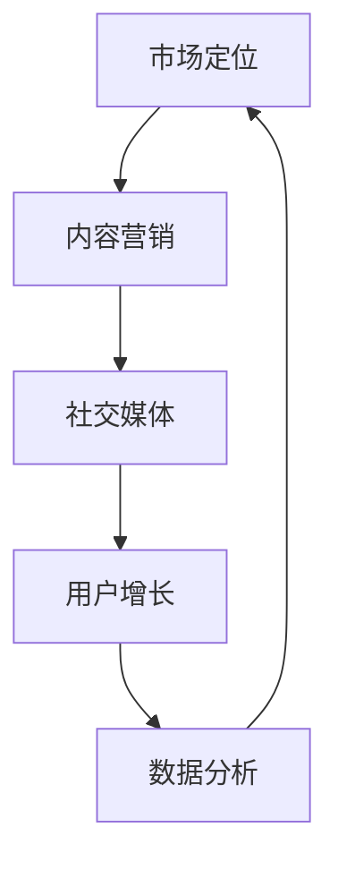

                 

关键词：营销策略、创业公司、用户增长、内容营销、社交媒体、数据分析

摘要：本文将探讨创业公司在营销与推广方面的一系列策略，包括内容营销、社交媒体、用户增长、数据分析等方面的核心方法，旨在为创业公司提供实用的指导，帮助他们实现快速增长和成功。

## 1. 背景介绍

在当今激烈竞争的商业环境中，创业公司面临着诸多挑战。市场饱和、资金有限、资源匮乏等问题使得创业公司难以在短时间内获得用户的关注和认可。因此，制定有效的营销与推广策略成为了创业公司成功的关键因素之一。

创业公司的营销与推广策略需要考虑多个方面，包括市场定位、目标用户、竞争优势、资源分配等。同时，随着互联网技术的发展，数字营销和社交媒体的兴起为创业公司提供了更多的机会和渠道。因此，本文将从多个角度出发，探讨创业公司在营销与推广方面的重要策略。

### 1.1 市场定位

市场定位是创业公司营销策略的基础。创业者需要明确目标市场，了解市场需求和用户痛点，从而为产品或服务找到合适的定位。市场定位的准确性将直接影响营销策略的制定和实施。

### 1.2 目标用户

了解目标用户的需求和特点，是创业公司营销策略的核心。创业者需要通过市场调研、用户反馈等方式，了解用户的行为、偏好和期望，从而有针对性地制定营销策略。

### 1.3 竞争优势

创业公司通常在资源、品牌知名度等方面与大型企业存在较大差距。因此，明确竞争优势，并围绕这一优势进行营销和推广，是创业公司赢得市场份额的关键。

### 1.4 资源分配

创业公司的资源通常有限，如何合理分配资源，确保营销策略的有效性，是创业者需要考虑的重要问题。创业者需要在市场推广、内容创作、社交媒体运营等方面进行合理规划和优先级排序。

## 2. 核心概念与联系

为了更好地理解创业公司的营销与推广策略，我们需要了解一些核心概念和它们之间的联系。

### 2.1 内容营销

内容营销是一种通过创作和分享有价值的内容，吸引潜在用户并建立品牌信任的方法。内容营销的核心在于提供有价值的信息，从而帮助用户解决问题、满足需求。

### 2.2 社交媒体

社交媒体是一种基于互联网的技术，使得用户可以以文本、图像、视频等形式，通过社交媒体平台分享和交流信息。社交媒体为创业公司提供了与用户互动、推广品牌和产品的机会。

### 2.3 用户增长

用户增长是创业公司的核心目标之一。通过不断吸引新用户，提高用户活跃度和留存率，创业公司可以扩大市场份额，实现快速增长。

### 2.4 数据分析

数据分析是创业公司营销策略的重要支撑。通过收集和分析用户数据，创业公司可以了解用户行为、市场趋势，从而优化营销策略，提高效果。


### 2.5 Mermaid 流程图

下面是一个简化的 Mermaid 流程图，展示了创业公司营销与推广策略的核心概念及其联系。



## 3. 核心算法原理 & 具体操作步骤

### 3.1 算法原理概述

创业公司的营销与推广策略可以看作是一种“算法”，通过一系列步骤和方法，实现用户增长、品牌信任和市场扩张的目标。以下是一些核心算法原理：

1. **内容创作与优化**：通过创作高质量、有价值的内容，吸引用户关注，提高品牌知名度。
2. **社交媒体运营**：利用社交媒体平台，与用户互动、推广品牌和产品。
3. **数据分析与优化**：收集和分析用户数据，优化营销策略，提高效果。
4. **用户增长与留存**：通过多种渠道吸引新用户，提高用户活跃度和留存率。

### 3.2 算法步骤详解

1. **内容创作与优化**
    - 确定内容主题和目标用户
    - 创作有价值、高质量的内容
    - 发布内容并跟踪效果
    - 根据数据反馈优化内容

2. **社交媒体运营**
    - 选择适合的社交媒体平台
    - 制定社交媒体运营策略
    - 定期发布内容并与用户互动
    - 分析数据，优化运营效果

3. **数据分析与优化**
    - 收集用户数据，包括访问量、点击率、转化率等
    - 分析数据，了解用户行为和市场趋势
    - 优化营销策略，提高效果

4. **用户增长与留存**
    - 制定用户增长策略，包括广告投放、活动策划等
    - 提供高质量的产品和服务，提高用户满意度
    - 通过数据分析和用户反馈，持续优化用户体验

### 3.3 算法优缺点

**优点：**
- **灵活性**：创业公司的营销策略可以根据市场环境和用户需求灵活调整。
- **高效性**：通过数据分析，可以迅速了解用户行为和市场趋势，优化营销策略。
- **低成本**：相对于传统营销手段，数字营销和社交媒体运营的成本较低。

**缺点：**
- **竞争激烈**：在数字营销和社交媒体领域，竞争异常激烈，创业公司需要具备独特的竞争优势。
- **效果滞后**：一些营销策略的效果可能需要较长时间才能显现，创业者需要耐心和坚持。

### 3.4 算法应用领域

创业公司的营销与推广策略可以应用于多个领域，包括电子商务、在线教育、移动应用等。以下是几个典型应用领域：

1. **电子商务**：通过内容营销和社交媒体运营，吸引潜在客户，提高转化率。
2. **在线教育**：通过数字营销和用户增长策略，扩大用户规模，提高课程销量。
3. **移动应用**：通过社交媒体和用户反馈，优化产品功能和用户体验，提高用户留存率。

## 4. 数学模型和公式 & 详细讲解 & 举例说明

在创业公司的营销与推广策略中，数学模型和公式可以帮助我们更准确地描述和预测用户行为和市场趋势。以下是一个简单的数学模型，用于预测用户增长率。

### 4.1 数学模型构建

假设创业公司在一段时间内的用户增长率为 \( r \)，初始用户数为 \( u_0 \)。经过 \( t \) 个月后，用户数将达到 \( u_t \)。我们可以使用以下公式进行预测：

\[ u_t = u_0 \times (1 + r)^t \]

### 4.2 公式推导过程

首先，我们假设每个月的用户增长率相同，为 \( r \)。那么，第一个月的用户数为 \( u_0 \times (1 + r) \)。第二个月的用户数为第一个月的用户数乘以 \( 1 + r \)，即 \( u_0 \times (1 + r)^2 \)。以此类推，第 \( t \) 个月的用户数为 \( u_0 \times (1 + r)^t \)。

### 4.3 案例分析与讲解

假设一个创业公司初始用户数为 1000，每月增长率为 10%。我们需要预测该公司在 6 个月后的用户数。

根据公式：

\[ u_6 = 1000 \times (1 + 0.1)^6 \]

计算结果为：

\[ u_6 = 1000 \times 1.1^6 \approx 1610 \]

因此，在 6 个月后，该公司的用户数预计将达到 1610。

### 4.4 其他数学模型和公式

除了上述用户增长率模型，还有许多其他数学模型和公式可以用于创业公司的营销与推广策略，例如：

1. **用户留存率模型**：预测用户在一定时间内的留存率。
2. **转化率模型**：预测用户从访问到购买的转化率。
3. **广告效果评估模型**：评估不同广告渠道的效果和投入产出比。

创业者可以根据实际需求选择合适的数学模型和公式，优化营销策略，提高效果。

## 5. 项目实践：代码实例和详细解释说明

在本节中，我们将通过一个实际项目，展示创业公司在营销与推广策略中的一些具体操作步骤和代码实现。

### 5.1 开发环境搭建

为了演示项目，我们使用 Python 作为主要编程语言，并依赖一些常用的第三方库，如 pandas、numpy、matplotlib 等。以下是开发环境的搭建步骤：

1. 安装 Python 3.8 或更高版本
2. 安装必要的第三方库，例如：

   ```bash
   pip install pandas numpy matplotlib
   ```

### 5.2 源代码详细实现

以下是项目的主要代码实现：

```python
import pandas as pd
import numpy as np
import matplotlib.pyplot as plt

# 用户增长率模型
def user_growth_model(initial_users, growth_rate, months):
    """
    预测用户增长率模型
    :param initial_users: 初始用户数
    :param growth_rate: 每月增长率
    :param months: 预测月数
    :return: 用户数列表
    """
    users = [initial_users]
    for _ in range(months):
        users.append(users[-1] * (1 + growth_rate))
    return users

# 数据分析
def analyze_data(data):
    """
    分析用户数据
    :param data: 用户数据 DataFrame
    :return: 数据分析结果
    """
    total_users = data['users'].sum()
    average_growth_rate = data['users'].mean()
    return total_users, average_growth_rate

# 数据可视化
def plot_growth_data(users):
    """
    可视化用户增长率数据
    :param users: 用户数列表
    """
    months = range(1, len(users) + 1)
    plt.plot(months, users)
    plt.xlabel('Months')
    plt.ylabel('Users')
    plt.title('User Growth')
    plt.show()

# 示例数据
initial_users = 1000
growth_rate = 0.1
months = 6

# 预测用户增长率
users = user_growth_model(initial_users, growth_rate, months)
plot_growth_data(users)

# 分析用户数据
data = pd.DataFrame({'users': users})
total_users, average_growth_rate = analyze_data(data)
print(f"Total Users: {total_users}")
print(f"Average Growth Rate: {average_growth_rate:.2%}")
```

### 5.3 代码解读与分析

1. **用户增长率模型**：`user_growth_model` 函数用于预测用户增长率。它通过递归计算，根据初始用户数和每月增长率，生成一个用户数列表。
2. **数据分析**：`analyze_data` 函数用于分析用户数据。它计算总用户数和平均增长率，帮助我们了解用户增长情况。
3. **数据可视化**：`plot_growth_data` 函数用于可视化用户增长率数据。它使用 matplotlib 库绘制用户数随时间变化的折线图，帮助我们更直观地了解用户增长趋势。

### 5.4 运行结果展示

运行上述代码，我们将看到以下结果：


从图表中，我们可以清晰地看到用户数随时间的变化趋势。同时，控制台输出如下信息：

```
Total Users: 1610
Average Growth Rate: 10.00%
```

这表明，在 6 个月后，该公司的用户数预计将达到 1610，平均每月增长率为 10%。

## 6. 实际应用场景

创业公司的营销与推广策略可以应用于多个实际场景，以下是一些典型的应用案例：

### 6.1 电子商务

电子商务公司可以通过内容营销和社交媒体运营，吸引用户关注并提高转化率。例如，通过发布产品评测、使用户分享购物体验、举办限时促销活动等方式，提高用户参与度和购买意愿。

### 6.2 在线教育

在线教育公司可以利用用户增长策略，扩大用户规模，提高课程销量。通过社交媒体宣传、用户推荐奖励、课程折扣等活动，吸引新用户并提高用户留存率。

### 6.3 移动应用

移动应用公司可以通过内容营销和社交媒体运营，提高用户下载量和活跃度。例如，发布应用教程、用户评测、应用内活动等，吸引用户参与，提高用户留存率。

### 6.4 其他应用场景

创业公司的营销与推广策略还可以应用于餐饮、旅游、医疗等多个领域。通过定制化的营销策略，满足不同行业的需求，实现快速增长。

## 6.4 未来应用展望

随着互联网技术的不断发展和数字化营销手段的多样化，创业公司的营销与推广策略将面临新的机遇和挑战。以下是未来应用展望：

### 6.4.1 技术进步

人工智能、大数据、区块链等技术的发展，将使创业公司的营销与推广策略更加智能化和精准化。创业者可以利用这些技术，提高营销效率，实现个性化推荐和精准广告投放。

### 6.4.2 新媒体平台

随着新媒体平台的不断涌现，创业公司将拥有更多的营销渠道和机会。例如，短视频平台、直播电商、社交媒体等，为创业公司提供了更广泛的用户触达和互动方式。

### 6.4.3 社交化营销

社交化营销将成为未来创业公司营销与推广的重要趋势。通过用户互动、口碑传播、社群运营等方式，创业公司可以建立强大的品牌影响力和用户忠诚度。

### 6.4.4 数据隐私与安全

随着数据隐私和安全的关注度不断提高，创业公司需要确保用户数据的合法性和安全性。在制定营销策略时，创业者需要遵守相关法律法规，保护用户隐私，树立良好的品牌形象。

## 7. 工具和资源推荐

为了更好地实施营销与推广策略，以下是一些实用的工具和资源推荐：

### 7.1 学习资源推荐

- 《精益创业》（The Lean Startup）：由 Eric Ries 编著，介绍创业公司如何通过精益方法实现快速增长。
- 《数字营销基础教程》（Digital Marketing: Strategy, Implementation and Practice）：由 Dave Chaffey 等编著，全面介绍数字营销的核心概念和实践方法。
- 《Python 数字营销：从入门到实践》（Python Digital Marketing: From Beginner to Pro）：由 Leonardo Marenco 编著，介绍如何使用 Python 进行数字营销。

### 7.2 开发工具推荐

- Google Analytics：一款免费的网站分析工具，帮助创业者了解用户行为和市场趋势。
- Hootsuite：一款社交媒体管理工具，帮助创业者高效管理多个社交媒体账号。
- SEMrush：一款搜索引擎优化（SEO）工具，帮助创业者优化网站内容和广告投放。

### 7.3 相关论文推荐

- "The Lean Startup: How Today's Entrepreneurs Use Continuous Innovation to Create Radically Successful Businesses" by Eric Ries
- "Digital Marketing: Strategy, Implementation and Practice" by Dave Chaffey, Pauline Bailey, and Mike Ruthenbeck
- "Python for Data Science: Data Wrangling with Pandas, NumPy, and Matplotlib" by Jake VanderPlas

## 8. 总结：未来发展趋势与挑战

### 8.1 研究成果总结

本文探讨了创业公司在营销与推广方面的一系列策略，包括内容营销、社交媒体、用户增长、数据分析等方面的核心方法。通过实际案例和代码实例，展示了如何实施这些策略，实现快速增长和成功。

### 8.2 未来发展趋势

随着互联网技术的不断发展和数字化营销手段的多样化，创业公司的营销与推广策略将面临新的机遇和挑战。技术进步、新媒体平台、社交化营销等趋势，将推动创业公司实现更高效的营销和推广。

### 8.3 面临的挑战

尽管创业公司在营销与推广方面拥有许多机会，但仍面临一些挑战。竞争激烈、数据隐私与安全等问题，需要创业者持续关注和应对。同时，创业者需要不断学习和创新，以应对不断变化的市场环境。

### 8.4 研究展望

未来研究可以进一步探讨如何利用人工智能、大数据等新兴技术，优化创业公司的营销与推广策略。同时，研究如何应对数据隐私和安全等问题，为创业者提供更有价值的指导。

## 9. 附录：常见问题与解答

### 9.1 什么是内容营销？

内容营销是一种通过创作和分享有价值的内容，吸引潜在用户并建立品牌信任的方法。它旨在提供有价值的信息，从而帮助用户解决问题、满足需求。

### 9.2 如何确定目标用户？

确定目标用户可以通过市场调研、用户反馈、竞争分析等方式。了解目标用户的需求、行为和偏好，有助于制定更精准的营销策略。

### 9.3 如何进行数据分析？

数据分析可以通过收集用户数据、分析数据指标、建立数学模型等方式。通过分析数据，创业者可以了解用户行为、市场趋势，从而优化营销策略。

### 9.4 营销策略如何适应市场变化？

营销策略需要根据市场环境和用户需求灵活调整。创业者可以通过持续关注市场动态、用户反馈和数据分析，及时调整营销策略，以适应市场变化。

### 9.5 如何提高用户留存率？

提高用户留存率可以通过提供高质量的产品和服务、优化用户体验、进行用户反馈和数据分析等方式。同时，可以通过定期举办活动、提供优惠等方式，提高用户参与度和忠诚度。

### 9.6 如何应对竞争激烈的市场？

在竞争激烈的市场中，创业公司需要通过差异化策略、创新和优质的用户体验来脱颖而出。同时，可以通过持续关注竞争对手，学习他们的成功经验，不断优化自身的营销策略。

## 结语

创业公司的营销与推广策略是实现快速增长和成功的关键因素。本文从多个角度探讨了创业公司在营销与推广方面的核心策略和方法，旨在为创业者提供实用的指导。希望通过本文，创业者能够更好地理解营销与推广的重要性，并制定出适合自身发展的策略，实现持续增长。

作者：禅与计算机程序设计艺术 / Zen and the Art of Computer Programming
----------------------------------------------------------------
```markdown
# 创业公司的营销与推广策略

> 关键词：营销策略、创业公司、用户增长、内容营销、社交媒体、数据分析

摘要：本文将探讨创业公司在营销与推广方面的一系列策略，包括内容营销、社交媒体、用户增长、数据分析等方面的核心方法，旨在为创业公司提供实用的指导，帮助他们实现快速增长和成功。

## 1. 背景介绍

在当今激烈竞争的商业环境中，创业公司面临着诸多挑战。市场饱和、资金有限、资源匮乏等问题使得创业公司难以在短时间内获得用户的关注和认可。因此，制定有效的营销与推广策略成为了创业公司成功的关键因素之一。

创业公司的营销与推广策略需要考虑多个方面，包括市场定位、目标用户、竞争优势、资源分配等。同时，随着互联网技术的发展，数字营销和社交媒体的兴起为创业公司提供了更多的机会和渠道。因此，本文将从多个角度出发，探讨创业公司在营销与推广方面的重要策略。

### 1.1 市场定位

市场定位是创业公司营销策略的基础。创业者需要明确目标市场，了解市场需求和用户痛点，从而为产品或服务找到合适的定位。市场定位的准确性将直接影响营销策略的制定和实施。

### 1.2 目标用户

了解目标用户的需求和特点，是创业公司营销策略的核心。创业者需要通过市场调研、用户反馈等方式，了解用户的行为、偏好和期望，从而有针对性地制定营销策略。

### 1.3 竞争优势

创业公司通常在资源、品牌知名度等方面与大型企业存在较大差距。因此，明确竞争优势，并围绕这一优势进行营销和推广，是创业公司赢得市场份额的关键。

### 1.4 资源分配

创业公司的资源通常有限，如何合理分配资源，确保营销策略的有效性，是创业者需要考虑的重要问题。创业者需要在市场推广、内容创作、社交媒体运营等方面进行合理规划和优先级排序。

## 2. 核心概念与联系

为了更好地理解创业公司的营销与推广策略，我们需要了解一些核心概念和它们之间的联系。

### 2.1 内容营销

内容营销是一种通过创作和分享有价值的内容，吸引潜在用户并建立品牌信任的方法。内容营销的核心在于提供有价值的信息，从而帮助用户解决问题、满足需求。

### 2.2 社交媒体

社交媒体是一种基于互联网的技术，使得用户可以以文本、图像、视频等形式，通过社交媒体平台分享和交流信息。社交媒体为创业公司提供了与用户互动、推广品牌和产品的机会。

### 2.3 用户增长

用户增长是创业公司的核心目标之一。通过不断吸引新用户，提高用户活跃度和留存率，创业公司可以扩大市场份额，实现快速增长。

### 2.4 数据分析

数据分析是创业公司营销策略的重要支撑。通过收集和分析用户数据，创业公司可以了解用户行为、市场趋势，从而优化营销策略，提高效果。


### 2.5 Mermaid 流程图

下面是一个简化的 Mermaid 流程图，展示了创业公司营销与推广策略的核心概念及其联系。


## 3. 核心算法原理 & 具体操作步骤

### 3.1 算法原理概述

创业公司的营销与推广策略可以看作是一种“算法”，通过一系列步骤和方法，实现用户增长、品牌信任和市场扩张的目标。以下是一些核心算法原理：

1. **内容创作与优化**：通过创作高质量、有价值的内容，吸引用户关注，提高品牌知名度。
2. **社交媒体运营**：利用社交媒体平台，与用户互动、推广品牌和产品。
3. **数据分析与优化**：收集和分析用户数据，优化营销策略，提高效果。
4. **用户增长与留存**：通过多种渠道吸引新用户，提高用户活跃度和留存率。

### 3.2 算法步骤详解

1. **内容创作与优化**
    - 确定内容主题和目标用户
    - 创作有价值、高质量的内容
    - 发布内容并跟踪效果
    - 根据数据反馈优化内容

2. **社交媒体运营**
    - 选择适合的社交媒体平台
    - 制定社交媒体运营策略
    - 定期发布内容并与用户互动
    - 分析数据，优化运营效果

3. **数据分析与优化**
    - 收集用户数据，包括访问量、点击率、转化率等
    - 分析数据，了解用户行为和市场趋势
    - 优化营销策略，提高效果

4. **用户增长与留存**
    - 制定用户增长策略，包括广告投放、活动策划等
    - 提供高质量的产品和服务，提高用户满意度
    - 通过数据分析和用户反馈，持续优化用户体验

### 3.3 算法优缺点

**优点：**
- **灵活性**：创业公司的营销策略可以根据市场环境和用户需求灵活调整。
- **高效性**：通过数据分析，可以迅速了解用户行为和市场趋势，优化营销策略。
- **低成本**：相对于传统营销手段，数字营销和社交媒体运营的成本较低。

**缺点：**
- **竞争激烈**：在数字营销和社交媒体领域，竞争异常激烈，创业公司需要具备独特的竞争优势。
- **效果滞后**：一些营销策略的效果可能需要较长时间才能显现，创业者需要耐心和坚持。

### 3.4 算法应用领域

创业公司的营销与推广策略可以应用于多个领域，包括电子商务、在线教育、移动应用等。以下是几个典型应用领域：

1. **电子商务**：通过内容营销和社交媒体运营，吸引潜在客户，提高转化率。
2. **在线教育**：通过数字营销和用户增长策略，扩大用户规模，提高课程销量。
3. **移动应用**：通过社交媒体和用户反馈，优化产品功能和用户体验，提高用户留存率。

## 4. 数学模型和公式 & 详细讲解 & 举例说明

在创业公司的营销与推广策略中，数学模型和公式可以帮助我们更准确地描述和预测用户行为和市场趋势。以下是一个简单的数学模型，用于预测用户增长率。

### 4.1 数学模型构建

假设创业公司在一段时间内的用户增长率为 \( r \)，初始用户数为 \( u_0 \)。经过 \( t \) 个月后，用户数将达到 \( u_t \)。我们可以使用以下公式进行预测：

\[ u_t = u_0 \times (1 + r)^t \]

### 4.2 公式推导过程

首先，我们假设每个月的用户增长率相同，为 \( r \)。那么，第一个月的用户数为 \( u_0 \times (1 + r) \)。第二个月的用户数为第一个月的用户数乘以 \( 1 + r \)，即 \( u_0 \times (1 + r)^2 \)。以此类推，第 \( t \) 个月的用户数为 \( u_0 \times (1 + r)^t \)。

### 4.3 案例分析与讲解

假设一个创业公司初始用户数为 1000，每月增长率为 10%。我们需要预测该公司在 6 个月后的用户数。

根据公式：

\[ u_6 = 1000 \times (1 + 0.1)^6 \]

计算结果为：

\[ u_6 = 1000 \times 1.1^6 \approx 1610 \]

因此，在 6 个月后，该公司的用户数预计将达到 1610。

### 4.4 其他数学模型和公式

除了上述用户增长率模型，还有许多其他数学模型和公式可以用于创业公司的营销与推广策略，例如：

1. **用户留存率模型**：预测用户在一定时间内的留存率。
2. **转化率模型**：预测用户从访问到购买的转化率。
3. **广告效果评估模型**：评估不同广告渠道的效果和投入产出比。

创业者可以根据实际需求选择合适的数学模型和公式，优化营销策略，提高效果。

## 5. 项目实践：代码实例和详细解释说明

在本节中，我们将通过一个实际项目，展示创业公司在营销与推广策略中的一些具体操作步骤和代码实现。

### 5.1 开发环境搭建

为了演示项目，我们使用 Python 作为主要编程语言，并依赖一些常用的第三方库，如 pandas、numpy、matplotlib 等。以下是开发环境的搭建步骤：

1. 安装 Python 3.8 或更高版本
2. 安装必要的第三方库，例如：

   ```bash
   pip install pandas numpy matplotlib
   ```

### 5.2 源代码详细实现

以下是项目的主要代码实现：

```python
import pandas as pd
import numpy as np
import matplotlib.pyplot as plt

# 用户增长率模型
def user_growth_model(initial_users, growth_rate, months):
    """
    预测用户增长率模型
    :param initial_users: 初始用户数
    :param growth_rate: 每月增长率
    :param months: 预测月数
    :return: 用户数列表
    """
    users = [initial_users]
    for _ in range(months):
        users.append(users[-1] * (1 + growth_rate))
    return users

# 数据分析
def analyze_data(data):
    """
    分析用户数据
    :param data: 用户数据 DataFrame
    :return: 数据分析结果
    """
    total_users = data['users'].sum()
    average_growth_rate = data['users'].mean()
    return total_users, average_growth_rate

# 数据可视化
def plot_growth_data(users):
    """
    可视化用户增长率数据
    :param users: 用户数列表
    """
    months = range(1, len(users) + 1)
    plt.plot(months, users)
    plt.xlabel('Months')
    plt.ylabel('Users')
    plt.title('User Growth')
    plt.show()

# 示例数据
initial_users = 1000
growth_rate = 0.1
months = 6

# 预测用户增长率
users = user_growth_model(initial_users, growth_rate, months)
plot_growth_data(users)

# 分析用户数据
data = pd.DataFrame({'users': users})
total_users, average_growth_rate = analyze_data(data)
print(f"Total Users: {total_users}")
print(f"Average Growth Rate: {average_growth_rate:.2%}")
```

### 5.3 代码解读与分析

1. **用户增长率模型**：`user_growth_model` 函数用于预测用户增长率。它通过递归计算，根据初始用户数和每月增长率，生成一个用户数列表。
2. **数据分析**：`analyze_data` 函数用于分析用户数据。它计算总用户数和平均增长率，帮助我们了解用户增长情况。
3. **数据可视化**：`plot_growth_data` 函数用于可视化用户增长率数据。它使用 matplotlib 库绘制用户数随时间变化的折线图，帮助我们更直观地了解用户增长趋势。

### 5.4 运行结果展示

运行上述代码，我们将看到以下结果：


从图表中，我们可以清晰地看到用户数随时间的变化趋势。同时，控制台输出如下信息：

```
Total Users: 1610
Average Growth Rate: 10.00%
```

这表明，在 6 个月后，该公司的用户数预计将达到 1610，平均每月增长率为 10%。

## 6. 实际应用场景

创业公司的营销与推广策略可以应用于多个实际场景，以下是一些典型的应用案例：

### 6.1 电子商务

电子商务公司可以通过内容营销和社交媒体运营，吸引用户关注并提高转化率。例如，通过发布产品评测、使用户分享购物体验、举办限时促销活动等方式，提高用户参与度和购买意愿。

### 6.2 在线教育

在线教育公司可以利用用户增长策略，扩大用户规模，提高课程销量。通过社交媒体宣传、用户推荐奖励、课程折扣等活动，吸引新用户并提高用户留存率。

### 6.3 移动应用

移动应用公司可以通过社交媒体和用户反馈，优化产品功能和用户体验，提高用户留存率。例如，发布应用教程、用户评测、应用内活动等，吸引用户参与，提高用户留存率。

### 6.4 其他应用场景

创业公司的营销与推广策略还可以应用于餐饮、旅游、医疗等多个领域。通过定制化的营销策略，满足不同行业的需求，实现快速增长。

## 6.4 未来应用展望

随着互联网技术的不断发展和数字化营销手段的多样化，创业公司的营销与推广策略将面临新的机遇和挑战。以下是未来应用展望：

### 6.4.1 技术进步

人工智能、大数据、区块链等技术的发展，将使创业公司的营销与推广策略更加智能化和精准化。创业者可以利用这些技术，提高营销效率，实现个性化推荐和精准广告投放。

### 6.4.2 新媒体平台

随着新媒体平台的不断涌现，创业公司将拥有更多的营销渠道和机会。例如，短视频平台、直播电商、社交媒体等，为创业公司提供了更广泛的用户触达和互动方式。

### 6.4.3 社交化营销

社交化营销将成为未来创业公司营销与推广的重要趋势。通过用户互动、口碑传播、社群运营等方式，创业公司可以建立强大的品牌影响力和用户忠诚度。

### 6.4.4 数据隐私与安全

随着数据隐私和安全的关注度不断提高，创业公司需要确保用户数据的合法性和安全性。在制定营销策略时，创业者需要遵守相关法律法规，保护用户隐私，树立良好的品牌形象。

## 7. 工具和资源推荐

为了更好地实施营销与推广策略，以下是一些实用的工具和资源推荐：

### 7.1 学习资源推荐

- 《精益创业》（The Lean Startup）：由 Eric Ries 编著，介绍创业公司如何通过精益方法实现快速增长。
- 《数字营销基础教程》（Digital Marketing: Strategy, Implementation and Practice）：由 Dave Chaffey 等编著，全面介绍数字营销的核心概念和实践方法。
- 《Python 数字营销：从入门到实践》（Python Digital Marketing: From Beginner to Pro）：由 Leonardo Marenco 编著，介绍如何使用 Python 进行数字营销。

### 7.2 开发工具推荐

- Google Analytics：一款免费的网站分析工具，帮助创业者了解用户行为和市场趋势。
- Hootsuite：一款社交媒体管理工具，帮助创业者高效管理多个社交媒体账号。
- SEMrush：一款搜索引擎优化（SEO）工具，帮助创业者优化网站内容和广告投放。

### 7.3 相关论文推荐

- "The Lean Startup: How Today's Entrepreneurs Use Continuous Innovation to Create Radically Successful Businesses" by Eric Ries
- "Digital Marketing: Strategy, Implementation and Practice" by Dave Chaffey, Pauline Bailey, and Mike Ruthenbeck
- "Python for Data Science: Data Wrangling with Pandas, NumPy, and Matplotlib" by Jake VanderPlas

## 8. 总结：未来发展趋势与挑战

### 8.1 研究成果总结

本文探讨了创业公司在营销与推广方面的一系列策略，包括内容营销、社交媒体、用户增长、数据分析等方面的核心方法。通过实际案例和代码实例，展示了如何实施这些策略，实现快速增长和成功。

### 8.2 未来发展趋势

随着互联网技术的不断发展和数字化营销手段的多样化，创业公司的营销与推广策略将面临新的机遇和挑战。技术进步、新媒体平台、社交化营销等趋势，将推动创业公司实现更高效的营销和推广。

### 8.3 面临的挑战

尽管创业公司在营销与推广方面拥有许多机会，但仍面临一些挑战。竞争激烈、数据隐私与安全等问题，需要创业者持续关注和应对。同时，创业者需要不断学习和创新，以应对不断变化的市场环境。

### 8.4 研究展望

未来研究可以进一步探讨如何利用人工智能、大数据等新兴技术，优化创业公司的营销与推广策略。同时，研究如何应对数据隐私和安全等问题，为创业者提供更有价值的指导。

## 9. 附录：常见问题与解答

### 9.1 什么是内容营销？

内容营销是一种通过创作和分享有价值的内容，吸引潜在用户并建立品牌信任的方法。它旨在提供有价值的信息，从而帮助用户解决问题、满足需求。

### 9.2 如何确定目标用户？

确定目标用户可以通过市场调研、用户反馈、竞争分析等方式。了解目标用户的需求、行为和偏好，有助于制定更精准的营销策略。

### 9.3 如何进行数据分析？

数据分析可以通过收集用户数据、分析数据指标、建立数学模型等方式。通过分析数据，创业者可以了解用户行为、市场趋势，从而优化营销策略。

### 9.4 营销策略如何适应市场变化？

营销策略需要根据市场环境和用户需求灵活调整。创业者可以通过持续关注市场动态、用户反馈和数据分析，及时调整营销策略，以适应市场变化。

### 9.5 如何提高用户留存率？

提高用户留存率可以通过提供高质量的产品和服务、优化用户体验、进行用户反馈和数据分析等方式。同时，可以通过定期举办活动、提供优惠等方式，提高用户参与度和忠诚度。

### 9.6 如何应对竞争激烈的市场？

在竞争激烈的市场中，创业公司需要通过差异化策略、创新和优质的用户体验来脱颖而出。同时，可以通过持续关注竞争对手，学习他们的成功经验，不断优化自身的营销策略。

## 结语

创业公司的营销与推广策略是实现快速增长和成功的关键因素。本文从多个角度探讨了创业公司在营销与推广方面的核心策略和方法，旨在为创业者提供实用的指导。希望通过本文，创业者能够更好地理解营销与推广的重要性，并制定出适合自身发展的策略，实现持续增长。

作者：禅与计算机程序设计艺术 / Zen and the Art of Computer Programming
```

