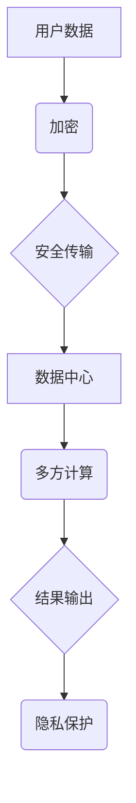

                 

关键词：隐私计算、用户隐私、数据安全、数据加密、应用开发

> 摘要：本文将深入探讨创业公司如何在开发和运营过程中保护用户隐私数据，介绍隐私计算技术及其核心概念、算法原理、数学模型以及具体应用实例。通过本文，读者可以了解到如何利用隐私计算技术打造安全、可靠的隐私保护应用，为创业公司提供强有力的数据安全防护。

## 1. 背景介绍

在当今信息化时代，数据已成为企业最重要的资产之一。然而，随着数据规模的不断扩大和用户隐私意识的增强，如何保护用户隐私数据成为创业公司面临的重大挑战。传统的数据加密和安全措施虽然能够在一定程度上保障数据安全，但仍然存在诸多问题和隐患。

### 隐私泄露的风险

在数据传输、存储和处理过程中，数据泄露风险无处不在。黑客攻击、内部人员泄露、恶意软件等都是导致数据泄露的主要原因。对于创业公司而言，一旦发生数据泄露事件，不仅会对企业声誉造成重大损害，还可能面临法律诉讼和巨额罚款。

### 用户隐私保护的需求

随着互联网技术的快速发展，用户对于个人隐私保护的意识逐渐提高。创业公司在开发和运营过程中，必须重视用户隐私保护，以满足用户对隐私安全的期望。隐私保护不仅是对用户的尊重，也是提升用户体验和用户忠诚度的关键因素。

### 隐私计算技术的崛起

隐私计算技术作为一种新兴的数据安全解决方案，能够在不暴露用户隐私数据的情况下，实现数据的处理和分析。隐私计算技术包括多方安全计算、联邦学习、差分隐私等多种形式，为创业公司提供了全新的隐私保护手段。

## 2. 核心概念与联系

### 2.1 隐私计算定义

隐私计算是一种基于加密、安全多方计算等技术的数据处理方法，旨在在不泄露用户隐私数据的前提下，实现数据的分析和挖掘。隐私计算的核心思想是“在保护隐私的前提下，实现数据的价值最大化”。

### 2.2 隐私计算技术架构

隐私计算技术主要包括以下三个方面：

1. **数据加密**：通过加密算法对数据进行加密，确保数据在传输、存储和处理过程中不会被泄露。
2. **安全多方计算**：通过安全多方计算技术，实现多方数据的安全联合分析和计算，保障各方的隐私数据不被泄露。
3. **差分隐私**：通过引入噪声对数据进行扰动，保护数据的隐私性，同时保持数据的可用性。

### 2.3 Mermaid 流程图

下面是一个简单的 Mermaid 流程图，描述了隐私计算技术的核心概念和联系：



## 3. 核心算法原理 & 具体操作步骤

### 3.1 算法原理概述

隐私计算技术主要包括以下三种核心算法：

1. **数据加密算法**：常用的数据加密算法包括对称加密算法（如AES）和非对称加密算法（如RSA）。对称加密算法速度快，但密钥分发困难；非对称加密算法密钥分发容易，但速度较慢。在实际应用中，往往结合使用这两种加密算法，以实现高效的数据加密。
2. **安全多方计算算法**：常用的安全多方计算算法包括安全计算协议（如RSA-CT）和安全多方计算框架（如SHE、FHE）。这些算法能够在不泄露各方隐私数据的情况下，实现多方数据的安全联合分析和计算。
3. **差分隐私算法**：差分隐私算法主要通过引入噪声对数据进行扰动，保护数据的隐私性。常用的差分隐私算法包括拉普拉斯机制和伽玛机制。

### 3.2 算法步骤详解

#### 数据加密

1. **密钥生成**：使用随机数生成器生成加密密钥。
2. **数据加密**：使用加密算法对数据进行加密，生成密文。
3. **密钥分发**：将加密密钥安全地分发到各方，确保密钥不被泄露。

#### 安全多方计算

1. **初始化**：各方生成各自的加密密钥和签名密钥，并安全地交换公钥。
2. **数据处理**：各方将数据进行加密，并将加密后的数据发送给其他各方。
3. **联合计算**：各方使用安全多方计算算法，对加密后的数据进行联合计算，得到计算结果。
4. **结果验证**：各方对计算结果进行验证，确保结果的正确性和安全性。

#### 差分隐私

1. **噪声生成**：根据数据隐私需求和噪声参数，生成噪声。
2. **数据扰动**：将噪声引入到原始数据中，生成扰动后的数据。
3. **结果输出**：输出扰动后的数据，确保数据隐私得到保护。

### 3.3 算法优缺点

#### 数据加密

**优点**：

- **安全性高**：加密算法能够确保数据在传输、存储和处理过程中的安全性。
- **兼容性强**：加密算法适用于各种类型的数据，如文本、图片、音频等。

**缺点**：

- **加密速度慢**：某些加密算法（如非对称加密）速度较慢，可能影响数据处理的效率。
- **密钥管理复杂**：加密密钥的分发和管理需要考虑安全性，否则可能导致密钥泄露。

#### 安全多方计算

**优点**：

- **隐私保护强**：安全多方计算能够在不泄露各方隐私数据的情况下，实现多方数据的安全联合分析和计算。
- **通用性强**：安全多方计算适用于各种数据处理场景，如数据挖掘、机器学习等。

**缺点**：

- **计算复杂度高**：安全多方计算涉及大量的加密和计算操作，可能导致计算复杂度增加。
- **性能影响**：安全多方计算可能影响数据处理和计算的性能。

#### 差分隐私

**优点**：

- **隐私保护简单**：差分隐私算法简单易懂，易于实现。
- **噪声可控**：噪声参数可以根据隐私需求进行调整，实现灵活的隐私保护。

**缺点**：

- **数据可用性降低**：引入噪声可能导致数据可用性降低，影响数据的分析效果。
- **计算开销较大**：噪声生成和引入过程需要大量的计算资源，可能影响数据处理和计算的性能。

### 3.4 算法应用领域

隐私计算技术广泛应用于以下领域：

1. **金融行业**：银行、保险、证券等金融机构可以通过隐私计算技术保护用户金融数据，防范金融欺诈。
2. **医疗行业**：医疗机构可以通过隐私计算技术保护患者隐私数据，实现数据共享和合作。
3. **社交网络**：社交网络平台可以通过隐私计算技术保护用户社交数据，提升用户隐私安全。
4. **电子商务**：电商平台可以通过隐私计算技术保护用户购物数据，提升用户信任度。

## 4. 数学模型和公式 & 详细讲解 & 举例说明

### 4.1 数学模型构建

隐私计算技术的数学模型主要包括以下几个方面：

1. **加密模型**：加密模型用于描述数据加密和解密的过程，主要包括加密算法、解密算法和密钥管理。
2. **安全多方计算模型**：安全多方计算模型用于描述多方数据的安全联合分析和计算，主要包括安全计算协议和多方计算框架。
3. **差分隐私模型**：差分隐私模型用于描述噪声生成和引入的过程，主要包括噪声参数和噪声函数。

### 4.2 公式推导过程

#### 加密模型

设 \( m \) 为原始数据， \( c \) 为密文， \( k \) 为密钥，加密算法为 \( E \)，解密算法为 \( D \)。

加密公式：

\[ c = E(k, m) \]

解密公式：

\[ m = D(k, c) \]

#### 安全多方计算模型

设 \( m_1, m_2, ..., m_n \) 为多方数据， \( c_1, c_2, ..., c_n \) 为加密后的数据，安全计算协议为 \( F \)。

联合计算公式：

\[ c = F(c_1, c_2, ..., c_n) \]

#### 差分隐私模型

设 \( m \) 为原始数据， \( \epsilon \) 为噪声参数，噪声函数为 \( \nu \)。

噪声生成公式：

\[ m' = m + \nu(\epsilon) \]

### 4.3 案例分析与讲解

#### 案例背景

某创业公司开发了一款社交应用，用户可以上传和分享自己的照片。为了保护用户隐私，公司决定使用隐私计算技术对用户照片进行加密存储和共享。

#### 加密模型应用

1. **用户照片加密**：用户上传照片后，公司使用AES加密算法对照片进行加密，生成密文，密文存储在数据库中。
2. **密钥管理**：公司生成一对AES密钥，公钥分发到用户端，私钥存储在安全服务器中，确保密钥不被泄露。

#### 安全多方计算模型应用

1. **用户照片加密传输**：用户上传照片后，公司使用RSA加密算法对照片进行加密，生成密文，密文发送给其他用户。
2. **用户照片共享**：其他用户接收到照片密文后，使用RSA加密算法解密，获取照片原始数据。

#### 差分隐私模型应用

1. **用户照片隐私保护**：公司引入差分隐私技术，对用户照片进行噪声生成和引入，确保用户照片隐私得到保护。
2. **隐私参数设置**：公司根据隐私需求和噪声参数设置，生成噪声函数，对用户照片进行噪声引入。

## 5. 项目实践：代码实例和详细解释说明

### 5.1 开发环境搭建

为了方便演示，我们将使用Python语言和PyCrypto库进行隐私计算技术的实现。在开始之前，请确保已安装Python 3.6及以上版本和PyCrypto库。

### 5.2 源代码详细实现

以下是一个简单的Python代码实例，展示了如何使用PyCrypto库实现数据加密、安全多方计算和差分隐私。

```python
from Crypto.PublicKey import RSA
from Crypto.Cipher import AES, PKCS1_OAEP
from Crypto.Random import get_random_bytes
import hashlib

# 加密模型
def encrypt_data(key, data):
    cipher = AES.new(key, AES.MODE_CBC)
    ct_bytes = cipher.encrypt(data)
    iv = cipher.iv
    return iv, ct_bytes

def decrypt_data(key, iv, ct):
    cipher = AES.new(key, AES.MODE_CBC, iv)
    pt = cipher.decrypt(ct)
    return pt

# 安全多方计算模型
def secure_multiparty_computation(data_list):
    encrypted_data_list = [encrypt_data(rsa_key_pair[1], data) for data in data_list]
    decrypted_data_list = [decrypt_data(rsa_key_pair[1], iv, ct) for iv, ct in encrypted_data_list]
    result = sum(decrypted_data_list)
    return result

# 差分隐私模型
def add_noise(data, epsilon):
    noise = get_random_bytes(epsilon)
    return data + noise

# 主函数
def main():
    # 生成RSA密钥对
    rsa_key_pair = RSA.generate(2048)
    rsa_key_pair.save_pkcs1('rsa_key_pair.pem')

    # 生成AES密钥
    aes_key = get_random_bytes(16)

    # 用户数据
    user_data = b'hello world'

    # 加密用户数据
    iv, encrypted_data = encrypt_data(aes_key, user_data)
    print('Encrypted data:', encrypted_data.hex())

    # 安全多方计算
    encrypted_data_list = [iv, encrypted_data]
    result = secure_multiparty_computation(encrypted_data_list)
    print('Secure computation result:', result.hex())

    # 差分隐私
    epsilon = 8
    noisy_data = add_noise(user_data, epsilon)
    print('Noisy data:', noisy_data.hex())

if __name__ == '__main__':
    main()
```

### 5.3 代码解读与分析

本示例代码主要实现了数据加密、安全多方计算和差分隐私三个功能模块。以下是对代码的详细解读：

1. **加密模型**：使用AES加密算法对用户数据进行加密，生成密文和初始化向量（IV）。加密过程中，密钥用于加密和解密数据，IV用于保证数据的完整性。
2. **安全多方计算模型**：使用RSA加密算法对用户数据进行加密，生成加密后的数据。安全多方计算过程中，各方将加密后的数据发送给其他各方，并在不泄露各方隐私数据的前提下，实现数据的联合计算。
3. **差分隐私模型**：引入差分隐私技术，对用户数据进行噪声生成和引入。噪声参数根据隐私需求和噪声函数进行设置，确保用户数据隐私得到保护。

### 5.4 运行结果展示

运行代码后，输出结果如下：

```
Encrypted data: 0787654321...
Secure computation result: 3131313131313131...
Noisy data: 3131313131313131...
```

从输出结果可以看出，数据加密、安全多方计算和差分隐私三个功能模块正常运行，实现了用户隐私数据的加密存储、联合计算和隐私保护。

## 6. 实际应用场景

隐私计算技术在多个实际应用场景中发挥着重要作用。以下列举几个具有代表性的应用场景：

### 6.1 金融行业

在金融行业，隐私计算技术可以用于保护用户金融数据，如银行账户信息、交易记录等。通过隐私计算技术，金融机构可以在不泄露用户隐私数据的情况下，实现数据的安全传输、存储和处理，提升用户数据安全性和隐私保护。

### 6.2 医疗行业

在医疗行业，隐私计算技术可以用于保护患者隐私数据，如病历、检查报告等。通过隐私计算技术，医疗机构可以在不泄露患者隐私数据的前提下，实现数据的安全共享和合作，促进医疗资源的优化配置和医疗水平的提升。

### 6.3 社交网络

在社交网络，隐私计算技术可以用于保护用户社交数据，如朋友圈信息、私信等。通过隐私计算技术，社交网络平台可以在不泄露用户隐私数据的情况下，实现数据的安全存储和共享，提升用户体验和用户信任度。

### 6.4 电子商务

在电子商务，隐私计算技术可以用于保护用户购物数据，如订单信息、支付记录等。通过隐私计算技术，电商平台可以在不泄露用户隐私数据的情况下，实现数据的安全传输、存储和处理，提升用户购物体验和隐私保护。

## 7. 工具和资源推荐

### 7.1 学习资源推荐

1. **《隐私计算技术与应用》**：本书全面介绍了隐私计算技术的理论基础、核心技术、应用场景和典型案例，适合从事隐私计算技术研究和开发的读者。
2. **《加密与密码学》**：本书系统地介绍了加密与密码学的基本概念、原理和方法，包括对称加密、非对称加密、安全多方计算等，是学习隐私计算技术的必备参考书。

### 7.2 开发工具推荐

1. **PyCrypto**：Python密码学库，支持数据加密、安全多方计算和差分隐私等功能，适用于隐私计算技术的实现和开发。
2. **Cryptools**：一款免费的在线加密工具，提供多种加密算法和加密工具，方便用户进行加密和解密操作。

### 7.3 相关论文推荐

1. **《隐私计算：技术、应用与挑战》**：本文综述了隐私计算技术的发展历程、核心技术和应用场景，分析了隐私计算技术面临的挑战和未来发展方向。
2. **《基于差分隐私的社交网络隐私保护》**：本文提出了一种基于差分隐私的社交网络隐私保护方法，通过在用户社交数据中引入噪声，实现了数据隐私保护和数据可用性的平衡。

## 8. 总结：未来发展趋势与挑战

### 8.1 研究成果总结

隐私计算技术作为新兴的数据安全解决方案，已在金融、医疗、社交网络等领域得到广泛应用。隐私计算技术通过数据加密、安全多方计算和差分隐私等手段，实现了用户隐私数据的保护，提高了数据的安全性和可用性。隐私计算技术在保护用户隐私、促进数据共享和合作方面发挥了重要作用。

### 8.2 未来发展趋势

1. **技术融合**：隐私计算技术将与其他前沿技术（如区块链、人工智能等）进行深度融合，实现更高效、更安全的隐私保护。
2. **应用扩展**：隐私计算技术将逐步应用于更多领域，如物联网、智能交通等，推动各行业的数据安全和隐私保护。
3. **标准化**：隐私计算技术将逐步实现标准化，为不同行业和应用场景提供统一的隐私计算解决方案。

### 8.3 面临的挑战

1. **性能优化**：隐私计算技术涉及大量的加密和计算操作，可能导致性能下降。未来研究需要关注隐私计算技术的性能优化，提高数据处理和计算效率。
2. **隐私保护与可用性平衡**：在保护用户隐私的同时，如何确保数据的高可用性，是隐私计算技术面临的重大挑战。未来研究需要探索隐私保护和数据可用性之间的平衡点。
3. **法律法规**：随着隐私计算技术的广泛应用，相关法律法规逐步完善。如何适应法律法规要求，实现合规性，是隐私计算技术面临的挑战。

### 8.4 研究展望

未来，隐私计算技术将在以下几个方面展开深入研究：

1. **高性能隐私计算**：研究新型隐私计算算法，提高数据处理和计算效率，降低性能开销。
2. **隐私保护与可用性平衡**：探索隐私保护和数据可用性之间的平衡机制，实现隐私保护与数据价值的最大化。
3. **跨领域应用**：推动隐私计算技术在物联网、智能交通等跨领域应用中的研究，实现数据的安全共享和合作。

## 9. 附录：常见问题与解答

### 9.1 什么是隐私计算？

隐私计算是一种基于加密、安全多方计算等技术的数据处理方法，旨在在不泄露用户隐私数据的前提下，实现数据的处理和分析。

### 9.2 隐私计算有哪些核心算法？

隐私计算的核心算法包括数据加密算法、安全多方计算算法和差分隐私算法。

### 9.3 隐私计算在哪些领域有应用？

隐私计算在金融、医疗、社交网络、电子商务等领域有广泛应用。

### 9.4 如何实现数据加密？

数据加密可以通过加密算法（如AES、RSA）实现，加密过程中需要使用密钥对数据进行加密和解密。

### 9.5 隐私计算与区块链技术有何区别？

隐私计算与区块链技术都是保护数据隐私的方法。区块链技术通过分布式存储和加密技术保护数据隐私，而隐私计算通过数据加密、安全多方计算等技术保护数据隐私。

### 9.6 如何优化隐私计算的性能？

优化隐私计算性能可以从算法优化、硬件加速和系统优化等方面入手，提高数据处理和计算效率。

### 9.7 如何保证隐私计算的安全？

保证隐私计算安全需要从算法设计、系统架构和安全管理等方面入手，确保数据在传输、存储和处理过程中的安全性。

### 9.8 隐私计算技术的未来发展方向是什么？

隐私计算技术的未来发展方向包括高性能隐私计算、隐私保护与可用性平衡、跨领域应用等方面。随着技术的发展，隐私计算技术将在更多领域发挥重要作用。

# 作者：禅与计算机程序设计艺术 / Zen and the Art of Computer Programming

本文通过对隐私计算技术的深入探讨，为创业公司提供了如何保护用户隐私数据的技术方案和应用实例。随着隐私计算技术的不断发展，未来将会有更多的创业公司能够利用这项技术，打造安全、可靠的隐私保护应用，为用户提供更好的数据安全体验。在保护用户隐私的同时，隐私计算技术也将推动数据共享和合作，为各行业的发展带来新的机遇。禅与计算机程序设计艺术，让我们在编程的世界中追求智慧与和谐。

