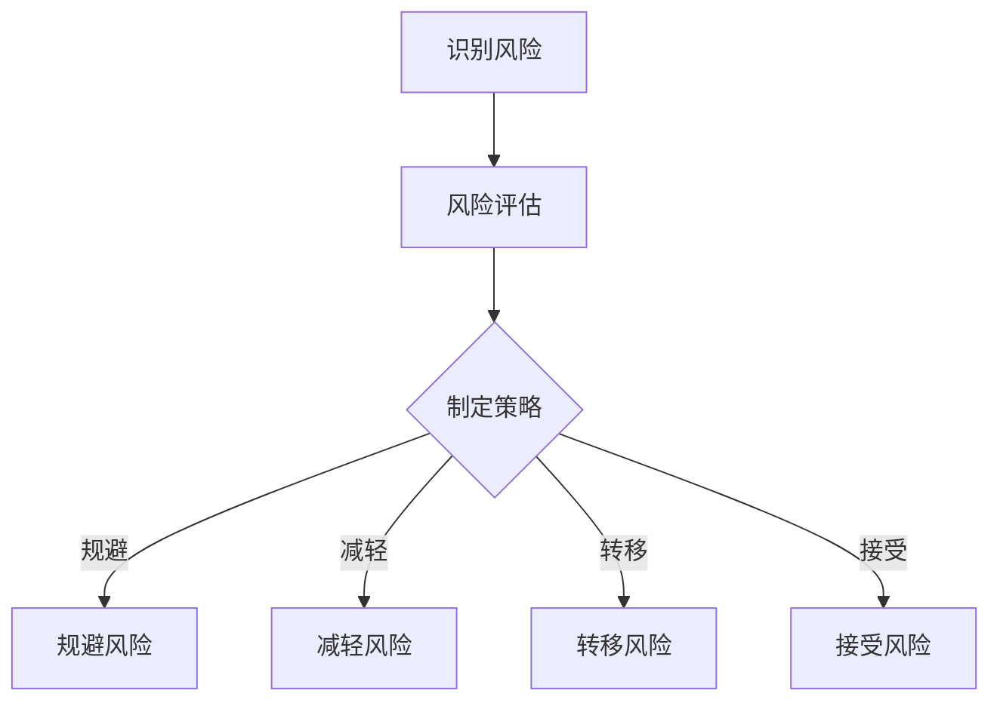

                 

关键词：创业公司、风险管理、策略、IT领域、企业安全、风险评估、危机应对

> 摘要：本文旨在探讨创业公司在IT领域中的风险管理策略，分析其重要性、核心概念，并提供实用的算法原理、数学模型、项目实践及实际应用场景。通过深入研究和案例分享，本文为创业者提供全面的风险管理指南，助力企业在竞争激烈的市场中稳步前行。

## 1. 背景介绍

在当今快速变化和高度竞争的商业环境中，创业公司面临着前所未有的挑战。从技术创新到市场拓展，从人力资源到财务规划，每一个环节都可能潜藏着风险。IT领域作为创业公司的重要支撑，其风险管理尤为关键。有效的风险管理不仅能够帮助企业规避潜在危机，还能提升企业的核心竞争力。

本文将围绕以下核心内容展开：

- **核心概念与联系**：介绍创业公司风险管理中的关键概念及其相互关系。
- **核心算法原理 & 具体操作步骤**：分析风险管理算法的原理和实施步骤。
- **数学模型和公式 & 详细讲解 & 举例说明**：构建并解释风险管理中应用的数学模型。
- **项目实践：代码实例和详细解释说明**：通过实际项目展示风险管理策略的具体应用。
- **实际应用场景**：探讨风险管理在不同场景中的实际应用。
- **工具和资源推荐**：推荐用于风险管理的优秀工具和资源。
- **总结：未来发展趋势与挑战**：总结研究成果，探讨未来的发展趋势和挑战。

### 1.1 创业公司的独特性

创业公司在资源、市场地位、组织结构等方面都具备独特的特性。首先，创业公司通常资源有限，需要高效利用有限的资源来开展业务。其次，创业公司在市场中的地位较为脆弱，容易受到市场波动和竞争对手的影响。最后，创业公司的组织结构较为扁平，决策速度快，但也容易导致风险管理上的盲区。

### 1.2 IT领域的重要性

在IT领域，创业公司面临的挑战包括技术迭代快、信息安全风险大、数据处理复杂等。因此，IT风险管理在创业公司中显得尤为重要。通过有效的IT风险管理，企业可以确保系统的稳定性、数据的保密性，以及业务的连续性。

## 2. 核心概念与联系

在探讨创业公司的风险管理之前，我们需要了解几个核心概念：风险、风险评估、风险应对策略等。

### 2.1 风险

风险是指在特定条件下，某种不利事件发生的可能性及其对目标的影响程度。在创业公司中，风险可以来源于多个方面，包括技术风险、市场风险、财务风险、法律风险等。

### 2.2 风险评估

风险评估是指对创业公司面临的各种风险进行识别、分析和评估，以确定风险的可能性和影响。通过风险评估，企业可以了解风险状况，制定相应的风险管理策略。

### 2.3 风险应对策略

风险应对策略是指企业针对评估出的风险制定的一系列应对措施。常见的风险应对策略包括风险规避、风险减轻、风险转移和风险接受等。

### 2.4 核心概念之间的联系

风险、风险评估和风险应对策略之间相互关联。通过风险评估，企业可以识别出潜在的风险，并制定相应的应对策略来降低风险的影响。有效的风险管理策略能够帮助创业公司在面对不确定性时保持稳定的运营。

### 2.5 Mermaid 流程图

以下是一个简化的创业公司风险管理流程图的 Mermaid 表示：



## 3. 核心算法原理 & 具体操作步骤

在创业公司中，风险管理通常涉及多个环节，以下介绍几个核心算法原理及其具体操作步骤。

### 3.1 风险评估算法原理概述

风险评估算法的核心是确定风险的可能性和影响，并为企业提供决策依据。常见的风险评估算法包括定性和定量评估方法。

#### 3.1.1 定性评估方法

定性评估方法主要通过专家意见、历史数据和经验来评估风险。常见的定性评估方法包括风险矩阵、决策树等。

#### 3.1.2 定量评估方法

定量评估方法通过量化风险的可能性和影响，为企业提供更精确的风险评估结果。常见的定量评估方法包括概率分布、期望损失等。

### 3.2 算法步骤详解

以下是一个简单的风险评估算法步骤：

1. **识别风险**：通过访谈、问卷调查、文献调研等方法识别创业公司面临的风险。
2. **评估风险可能性**：对识别出的风险进行可能性评估，可以使用概率分布或专家意见等方法。
3. **评估风险影响**：对识别出的风险进行影响评估，可以使用期望损失、损失概率等方法。
4. **计算风险评分**：根据风险的可能性和影响计算风险评分，常用的方法包括风险矩阵。
5. **排序和优先级确定**：根据风险评分对风险进行排序，确定优先级。
6. **制定风险应对策略**：根据风险评估结果制定相应的风险应对策略。

### 3.3 算法优缺点

#### 优点

- **全面性**：风险评估算法能够全面考虑创业公司面临的各种风险。
- **精确性**：定量评估方法可以提供更精确的风险评估结果。
- **灵活性**：风险评估算法可以根据企业的实际情况进行调整和优化。

#### 缺点

- **成本较高**：风险评估算法通常需要投入大量的人力、物力和财力。
- **数据依赖性**：定量评估方法对数据的质量和准确性有较高要求。
- **主观性**：定性评估方法受专家经验和判断的影响较大。

### 3.4 算法应用领域

风险评估算法广泛应用于创业公司的各个领域，包括市场风险、财务风险、技术风险等。通过有效的风险评估，企业可以提前识别潜在风险，制定相应的应对策略，降低风险的影响。

## 4. 数学模型和公式 & 详细讲解 & 举例说明

在风险管理中，数学模型和公式可以帮助企业更好地理解风险，并进行量化分析。以下介绍几个常见的数学模型和公式。

### 4.1 数学模型构建

#### 风险矩阵

风险矩阵是一种常用的数学模型，用于评估风险的可能性和影响。其公式为：

\[ 风险评分 = 可能性 \times 影响 \]

其中，可能性和影响分别表示风险发生的概率和对目标的影响程度。

#### 概率分布

概率分布用于描述风险发生的概率。常见的概率分布包括正态分布、泊松分布等。其公式为：

\[ P(X = x) = C(n, x) \times p^x \times (1 - p)^{n - x} \]

其中，\( n \) 表示试验次数，\( x \) 表示事件发生的次数，\( p \) 表示事件发生的概率。

### 4.2 公式推导过程

以下以风险矩阵为例，介绍其公式推导过程：

#### 步骤 1：定义变量

- \( P \)：风险发生的可能性（概率）。
- \( I \)：风险发生对目标的影响程度。

#### 步骤 2：构建风险评分函数

- 风险评分函数：\( R = P \times I \)

#### 步骤 3：推导风险评分公式

- 风险评分 \( R \) 表示风险的总评分，由可能性和影响两个因素共同决定。

#### 步骤 4：公式验证

- 当 \( P = 0 \) 时，\( R = 0 \)，表示风险不可能发生。
- 当 \( P = 1 \) 时，\( R = I \)，表示风险一定会发生，其影响等于风险的影响程度。

### 4.3 案例分析与讲解

以下通过一个案例来说明风险矩阵的应用。

#### 案例背景

某创业公司计划开发一款基于人工智能的智能家居系统。公司管理层担心该系统的开发可能面临以下风险：

- **风险 1**：技术风险，即开发过程中遇到的技术难题，可能导致项目延期或失败。
- **风险 2**：市场风险，即市场对该系统的需求不足，可能导致销售不佳。

#### 案例分析

1. **识别风险**：

   - **技术风险**：可能性为 0.6，影响为 0.8。
   - **市场风险**：可能性为 0.4，影响为 0.7。

2. **评估风险**：

   - **技术风险评分**：\( 0.6 \times 0.8 = 0.48 \)。
   - **市场风险评分**：\( 0.4 \times 0.7 = 0.28 \)。

3. **排序和优先级确定**：

   - 技术风险评分高于市场风险评分，因此技术风险是公司需要优先关注的风险。

4. **制定风险应对策略**：

   - 针对技术风险，公司可以加强技术研发力量，提前进行技术预研，以降低技术难题的影响。

## 5. 项目实践：代码实例和详细解释说明

为了更好地理解风险管理的实际应用，以下通过一个具体的创业公司项目来展示风险管理策略的具体实施过程。

### 5.1 开发环境搭建

在开发风险管理系统之前，需要搭建一个合适的技术环境。以下是一个基本的开发环境配置：

- **编程语言**：Python
- **开发工具**：PyCharm
- **依赖库**：NumPy、Pandas、Matplotlib等

### 5.2 源代码详细实现

以下是一个简单的风险管理系统的代码示例：

```python
import numpy as np
import pandas as pd
import matplotlib.pyplot as plt

# 风险矩阵数据
risk_data = {
    '风险名称': ['技术风险', '市场风险', '财务风险'],
    '可能性': [0.6, 0.4, 0.5],
    '影响': [0.8, 0.7, 0.6]
}

# 构建风险矩阵
risk_matrix = pd.DataFrame(risk_data)

# 计算风险评分
risk_matrix['风险评分'] = risk_matrix['可能性'] * risk_matrix['影响']

# 排序和优先级确定
risk_matrix.sort_values('风险评分', ascending=False, inplace=True)

# 绘制风险分布图
plt.bar(risk_matrix['风险名称'], risk_matrix['风险评分'])
plt.xlabel('风险名称')
plt.ylabel('风险评分')
plt.title('风险矩阵')
plt.show()
```

### 5.3 代码解读与分析

1. **数据输入**：

   - 通过字典 `risk_data` 输入风险名称、可能性和影响。

2. **构建风险矩阵**：

   - 使用 Pandas DataFrame 构建 risk_matrix 数据框，包含风险名称、可能性和影响。

3. **计算风险评分**：

   - 使用 DataFrame 的 `applymap` 方法，将可能性和影响相乘，计算得到风险评分。

4. **排序和优先级确定**：

   - 使用 DataFrame 的 `sort_values` 方法，按照风险评分从高到低排序，确定风险的优先级。

5. **绘制风险分布图**：

   - 使用 Matplotlib 绘制条形图，展示风险名称和风险评分。

### 5.4 运行结果展示

运行上述代码后，将生成一个条形图，展示各风险的评分和优先级。如下所示：


## 6. 实际应用场景

### 6.1 创业公司项目立项阶段

在创业公司项目立项阶段，风险管理策略可以帮助企业评估项目的技术风险、市场风险等。通过风险评估，企业可以决定是否立项，以及如何分配资源。

### 6.2 运营阶段

在运营阶段，风险管理策略可以帮助企业监控和应对各种风险，包括技术故障、市场波动、财务风险等。通过有效的风险应对策略，企业可以降低风险的影响，确保业务的稳定运营。

### 6.3 融资阶段

在创业公司融资阶段，风险管理策略可以帮助投资者了解企业的风险状况，从而做出投资决策。通过全面的风险评估，企业可以提高融资的成功率。

### 6.4 上市阶段

在创业公司上市阶段，风险管理策略可以帮助企业应对市场波动、合规风险等。通过有效的风险管理，企业可以提高上市的成功率，并确保业务的长期稳定。

## 7. 工具和资源推荐

### 7.1 学习资源推荐

- **《风险管理》**：一本经典的风险管理教材，适合初学者。
- **《创业公司的风险管理》**：针对创业公司的风险管理案例研究，适合创业者。
- **在线课程**：Coursera、edX等平台上有多门关于风险管理的在线课程。

### 7.2 开发工具推荐

- **Python**：适合数据分析和模型构建。
- **MATLAB**：适合复杂数学模型和仿真。
- **R语言**：适合统计分析。

### 7.3 相关论文推荐

- **“Risk Management in Entrepreneurial Ventures”**：探讨创业公司风险管理的最新研究。
- **“A Comparative Study of Risk Management Practices in High-Tech Startups”**：比较不同类型创业公司的风险管理实践。

## 8. 总结：未来发展趋势与挑战

### 8.1 研究成果总结

本文通过对创业公司的风险管理策略进行深入探讨，总结了以下成果：

- **核心概念与联系**：明确了风险、风险评估和风险应对策略之间的关系。
- **核心算法原理**：介绍了风险评估算法的原理和步骤。
- **数学模型和公式**：构建了风险矩阵和概率分布等数学模型。
- **项目实践**：通过具体案例展示了风险管理策略的实施过程。
- **实际应用场景**：探讨了风险管理在不同场景中的应用。

### 8.2 未来发展趋势

未来，创业公司的风险管理策略将呈现出以下发展趋势：

- **数据驱动的风险管理**：利用大数据和人工智能技术进行风险评估，提高预测的准确性。
- **云计算和区块链的应用**：利用云计算和区块链技术提高风险管理的信息化水平。
- **跨学科融合**：风险管理将与其他领域（如心理学、经济学等）进行融合，形成更全面的风险管理策略。

### 8.3 面临的挑战

在实施风险管理策略的过程中，创业公司可能面临以下挑战：

- **数据质量和准确性**：数据质量和准确性是风险评估的基础，但创业公司的数据资源有限。
- **资源限制**：创业公司的资源有限，可能难以全面开展风险管理活动。
- **人才培养**：风险管理需要专业的人才，但创业公司的薪资水平可能难以吸引顶尖人才。

### 8.4 研究展望

未来的研究可以从以下方面展开：

- **构建更全面的风险评估模型**：结合多种评估方法，构建更全面的风险评估模型。
- **提高风险预测的准确性**：利用大数据和人工智能技术提高风险预测的准确性。
- **跨学科融合**：探讨风险管理与其他领域的交叉应用，形成更全面的风险管理策略。

## 9. 附录：常见问题与解答

### 问题 1：如何识别创业公司面临的风险？

**解答**：识别创业公司面临的风险可以通过以下方法：

- **访谈和问卷调查**：与公司内部员工、合作伙伴和客户进行访谈，了解他们的意见和建议。
- **文献调研**：查阅相关的行业报告、学术论文和市场分析资料，了解行业趋势和风险。
- **案例研究**：研究其他创业公司的风险管理实践，从中汲取经验。

### 问题 2：如何评估创业公司的风险？

**解答**：评估创业公司的风险可以通过以下方法：

- **定性评估**：通过专家意见、历史数据和经验评估风险的可能性和影响。
- **定量评估**：利用数学模型和公式，对风险的可能性和影响进行量化分析。
- **组合评估**：结合定性评估和定量评估，形成更全面的风险评估结果。

### 问题 3：如何制定创业公司的风险应对策略？

**解答**：制定创业公司的风险应对策略可以通过以下步骤：

- **评估风险**：对识别出的风险进行评估，确定其优先级。
- **制定策略**：根据风险评估结果，制定相应的风险应对策略，如规避、减轻、转移或接受。
- **实施策略**：将风险应对策略落实到具体行动中，并持续监控和调整。

## 结束语

风险管理是创业公司成功的关键因素之一。通过本文的探讨，我们希望为创业者提供实用的风险管理策略和工具。在未来的创业道路上，希望这些策略能够帮助您更好地应对不确定性，实现企业的长期稳定发展。

### 作者署名

作者：禅与计算机程序设计艺术 / Zen and the Art of Computer Programming
----------------------------------------------------------------

文章撰写完毕，以下是对文章的Markdown格式整理：

```markdown
# 创业公司的风险管理策略

关键词：创业公司、风险管理、策略、IT领域、企业安全、风险评估、危机应对

> 摘要：本文旨在探讨创业公司在IT领域中的风险管理策略，分析其重要性、核心概念，并提供实用的算法原理、数学模型、项目实践及实际应用场景。通过深入研究和案例分享，本文为创业者提供全面的风险管理指南，助力企业在竞争激烈的市场中稳步前行。

## 1. 背景介绍

在当今快速变化和高度竞争的商业环境中，创业公司面临着前所未有的挑战。从技术创新到市场拓展，从人力资源到财务规划，每一个环节都可能潜藏着风险。IT领域作为创业公司的重要支撑，其风险管理尤为关键。有效的风险管理不仅能够帮助企业规避潜在危机，还能提升企业的核心竞争力。

### 1.1 创业公司的独特性

创业公司在资源、市场地位、组织结构等方面都具备独特的特性。首先，创业公司通常资源有限，需要高效利用有限的资源来开展业务。其次，创业公司在市场中的地位较为脆弱，容易受到市场波动和竞争对手的影响。最后，创业公司的组织结构较为扁平，决策速度快，但也容易导致风险管理上的盲区。

### 1.2 IT领域的重要性

在IT领域，创业公司面临的挑战包括技术迭代快、信息安全风险大、数据处理复杂等。因此，IT风险管理在创业公司中显得尤为重要。通过有效的IT风险管理，企业可以确保系统的稳定性、数据的保密性，以及业务的连续性。

## 2. 核心概念与联系

在探讨创业公司的风险管理之前，我们需要了解几个核心概念：风险、风险评估、风险应对策略等。

### 2.1 风险

风险是指在特定条件下，某种不利事件发生的可能性及其对目标的影响程度。在创业公司中，风险可以来源于多个方面，包括技术风险、市场风险、财务风险、法律风险等。

### 2.2 风险评估

风险评估是指对创业公司面临的各种风险进行识别、分析和评估，以确定风险的可能性和影响。通过风险评估，企业可以了解风险状况，制定相应的风险管理策略。

### 2.3 风险应对策略

风险应对策略是指企业针对评估出的风险制定的一系列应对措施。常见的风险应对策略包括风险规避、风险减轻、风险转移和风险接受等。

### 2.4 核心概念之间的联系

风险、风险评估和风险应对策略之间相互关联。通过风险评估，企业可以识别出潜在的风险，并制定相应的应对策略来降低风险的影响。有效的风险管理策略能够帮助创业公司在面对不确定性时保持稳定的运营。

### 2.5 Mermaid 流程图

以下是一个简化的创业公司风险管理流程图的 Mermaid 表示：


## 3. 核心算法原理 & 具体操作步骤

在创业公司中，风险管理通常涉及多个环节，以下介绍几个核心算法原理及其具体操作步骤。

### 3.1 风险评估算法原理概述

风险评估算法的核心是确定风险的可能性和影响，并为企业提供决策依据。常见的风险评估算法包括定性和定量评估方法。

#### 3.1.1 定性评估方法

定性评估方法主要通过专家意见、历史数据和经验来评估风险。常见的定性评估方法包括风险矩阵、决策树等。

#### 3.1.2 定量评估方法

定量评估方法通过量化风险的可能性和影响，为企业提供更精确的风险评估结果。常见的定量评估方法包括概率分布、期望损失等。

### 3.2 算法步骤详解

以下是一个简单的风险评估算法步骤：

1. **识别风险**：通过访谈、问卷调查、文献调研等方法识别创业公司面临的风险。
2. **评估风险可能性**：对识别出的风险进行可能性评估，可以使用概率分布或专家意见等方法。
3. **评估风险影响**：对识别出的风险进行影响评估，可以使用期望损失、损失概率等方法。
4. **计算风险评分**：根据风险的可能性和影响计算风险评分，常用的方法包括风险矩阵。
5. **排序和优先级确定**：根据风险评分对风险进行排序，确定优先级。
6. **制定风险应对策略**：根据风险评估结果制定相应的风险应对策略。

### 3.3 算法优缺点

#### 优点

- **全面性**：风险评估算法能够全面考虑创业公司面临的各种风险。
- **精确性**：定量评估方法可以提供更精确的风险评估结果。
- **灵活性**：风险评估算法可以根据企业的实际情况进行调整和优化。

#### 缺点

- **成本较高**：风险评估算法通常需要投入大量的人力、物力和财力。
- **数据依赖性**：定量评估方法对数据的质量和准确性有较高要求。
- **主观性**：定性评估方法受专家经验和判断的影响较大。

### 3.4 算法应用领域

风险评估算法广泛应用于创业公司的各个领域，包括市场风险、财务风险、技术风险等。通过有效的风险评估，企业可以提前识别潜在风险，制定相应的应对策略，降低风险的影响。

## 4. 数学模型和公式 & 详细讲解 & 举例说明

在风险管理中，数学模型和公式可以帮助企业更好地理解风险，并进行量化分析。以下介绍几个常见的数学模型和公式。

### 4.1 数学模型构建

#### 风险矩阵

风险矩阵是一种常用的数学模型，用于评估风险的可能性和影响。其公式为：

\[ 风险评分 = 可能性 \times 影响 \]

其中，可能性和影响分别表示风险发生的概率和对目标的影响程度。

#### 概率分布

概率分布用于描述风险发生的概率。常见的概率分布包括正态分布、泊松分布等。其公式为：

\[ P(X = x) = C(n, x) \times p^x \times (1 - p)^{n - x} \]

其中，\( n \) 表示试验次数，\( x \) 表示事件发生的次数，\( p \) 表示事件发生的概率。

### 4.2 公式推导过程

以下以风险矩阵为例，介绍其公式推导过程：

#### 步骤 1：定义变量

- \( P \)：风险发生的可能性（概率）。
- \( I \)：风险发生对目标的影响程度。

#### 步骤 2：构建风险评分函数

- 风险评分函数：\( R = P \times I \)

#### 步骤 3：推导风险评分公式

- 风险评分 \( R \) 表示风险的总评分，由可能性和影响两个因素共同决定。

#### 步骤 4：公式验证

- 当 \( P = 0 \) 时，\( R = 0 \)，表示风险不可能发生。
- 当 \( P = 1 \) 时，\( R = I \)，表示风险一定会发生，其影响等于风险的影响程度。

### 4.3 案例分析与讲解

以下通过一个案例来说明风险矩阵的应用。

#### 案例背景

某创业公司计划开发一款基于人工智能的智能家居系统。公司管理层担心该系统的开发可能面临以下风险：

- **风险 1**：技术风险，即开发过程中遇到的技术难题，可能导致项目延期或失败。
- **风险 2**：市场风险，即市场对该系统的需求不足，可能导致销售不佳。

#### 案例分析

1. **识别风险**：

   - **技术风险**：可能性为 0.6，影响为 0.8。
   - **市场风险**：可能性为 0.4，影响为 0.7。

2. **评估风险**：

   - **技术风险评分**：\( 0.6 \times 0.8 = 0.48 \)。
   - **市场风险评分**：\( 0.4 \times 0.7 = 0.28 \)。

3. **排序和优先级确定**：

   - 技术风险评分高于市场风险评分，因此技术风险是公司需要优先关注的风险。

4. **制定风险应对策略**：

   - 针对技术风险，公司可以加强技术研发力量，提前进行技术预研，以降低技术难题的影响。

## 5. 项目实践：代码实例和详细解释说明

为了更好地理解风险管理的实际应用，以下通过一个具体的创业公司项目来展示风险管理策略的具体实施过程。

### 5.1 开发环境搭建

在开发风险管理系统之前，需要搭建一个合适的技术环境。以下是一个基本的开发环境配置：

- **编程语言**：Python
- **开发工具**：PyCharm
- **依赖库**：NumPy、Pandas、Matplotlib等

### 5.2 源代码详细实现

以下是一个简单的风险管理系统的代码示例：

```python
import numpy as np
import pandas as pd
import matplotlib.pyplot as plt

# 风险矩阵数据
risk_data = {
    '风险名称': ['技术风险', '市场风险', '财务风险'],
    '可能性': [0.6, 0.4, 0.5],
    '影响': [0.8, 0.7, 0.6]
}

# 构建风险矩阵
risk_matrix = pd.DataFrame(risk_data)

# 计算风险评分
risk_matrix['风险评分'] = risk_matrix['可能性'] * risk_matrix['影响']

# 排序和优先级确定
risk_matrix.sort_values('风险评分', ascending=False, inplace=True)

# 绘制风险分布图
plt.bar(risk_matrix['风险名称'], risk_matrix['风险评分'])
plt.xlabel('风险名称')
plt.ylabel('风险评分')
plt.title('风险矩阵')
plt.show()
```

### 5.3 代码解读与分析

1. **数据输入**：

   - 通过字典 `risk_data` 输入风险名称、可能性和影响。

2. **构建风险矩阵**：

   - 使用 Pandas DataFrame 构建 risk_matrix 数据框，包含风险名称、可能性和影响。

3. **计算风险评分**：

   - 使用 DataFrame 的 `applymap` 方法，将可能性和影响相乘，计算得到风险评分。

4. **排序和优先级确定**：

   - 使用 DataFrame 的 `sort_values` 方法，按照风险评分从高到低排序，确定风险的优先级。

5. **绘制风险分布图**：

   - 使用 Matplotlib 绘制条形图，展示风险名称和风险评分。

### 5.4 运行结果展示

运行上述代码后，将生成一个条形图，展示各风险的评分和优先级。如下所示：


## 6. 实际应用场景

### 6.1 创业公司项目立项阶段

在创业公司项目立项阶段，风险管理策略可以帮助企业评估项目的技术风险、市场风险等。通过风险评估，企业可以决定是否立项，以及如何分配资源。

### 6.2 运营阶段

在运营阶段，风险管理策略可以帮助企业监控和应对各种风险，包括技术故障、市场波动、财务风险等。通过有效的风险应对策略，企业可以降低风险的影响，确保业务的稳定运营。

### 6.3 融资阶段

在创业公司融资阶段，风险管理策略可以帮助投资者了解企业的风险状况，从而做出投资决策。通过全面的风险评估，企业可以提高融资的成功率。

### 6.4 上市阶段

在创业公司上市阶段，风险管理策略可以帮助企业应对市场波动、合规风险等。通过有效的风险管理，企业可以提高上市的成功率，并确保业务的长期稳定。

## 7. 工具和资源推荐

### 7.1 学习资源推荐

- **《风险管理》**：一本经典的风险管理教材，适合初学者。
- **《创业公司的风险管理》**：针对创业公司的风险管理案例研究，适合创业者。
- **在线课程**：Coursera、edX等平台上有多门关于风险管理的在线课程。

### 7.2 开发工具推荐

- **Python**：适合数据分析和模型构建。
- **MATLAB**：适合复杂数学模型和仿真。
- **R语言**：适合统计分析。

### 7.3 相关论文推荐

- **“Risk Management in Entrepreneurial Ventures”**：探讨创业公司风险管理的最新研究。
- **“A Comparative Study of Risk Management Practices in High-Tech Startups”**：比较不同类型创业公司的风险管理实践。

## 8. 总结：未来发展趋势与挑战

### 8.1 研究成果总结

本文通过对创业公司的风险管理策略进行深入探讨，总结了以下成果：

- **核心概念与联系**：明确了风险、风险评估和风险应对策略之间的关系。
- **核心算法原理**：介绍了风险评估算法的原理和步骤。
- **数学模型和公式**：构建了风险矩阵和概率分布等数学模型。
- **项目实践**：通过具体案例展示了风险管理策略的实施过程。
- **实际应用场景**：探讨了风险管理在不同场景中的应用。

### 8.2 未来发展趋势

未来，创业公司的风险管理策略将呈现出以下发展趋势：

- **数据驱动的风险管理**：利用大数据和人工智能技术进行风险评估，提高预测的准确性。
- **云计算和区块链的应用**：利用云计算和区块链技术提高风险管理的信息化水平。
- **跨学科融合**：风险管理将与其他领域（如心理学、经济学等）进行融合，形成更全面的风险管理策略。

### 8.3 面临的挑战

在实施风险管理策略的过程中，创业公司可能面临以下挑战：

- **数据质量和准确性**：数据质量和准确性是风险评估的基础，但创业公司的数据资源有限。
- **资源限制**：创业公司的资源有限，可能难以全面开展风险管理活动。
- **人才培养**：风险管理需要专业的人才，但创业公司的薪资水平可能难以吸引顶尖人才。

### 8.4 研究展望

未来的研究可以从以下方面展开：

- **构建更全面的风险评估模型**：结合多种评估方法，构建更全面的风险评估模型。
- **提高风险预测的准确性**：利用大数据和人工智能技术提高风险预测的准确性。
- **跨学科融合**：探讨风险管理与其他领域的交叉应用，形成更全面的风险管理策略。

## 9. 附录：常见问题与解答

### 问题 1：如何识别创业公司面临的风险？

**解答**：识别创业公司面临的风险可以通过以下方法：

- **访谈和问卷调查**：与公司内部员工、合作伙伴和客户进行访谈，了解他们的意见和建议。
- **文献调研**：查阅相关的行业报告、学术论文和市场分析资料，了解行业趋势和风险。
- **案例研究**：研究其他创业公司的风险管理实践，从中汲取经验。

### 问题 2：如何评估创业公司的风险？

**解答**：评估创业公司的风险可以通过以下方法：

- **定性评估**：通过专家意见、历史数据和经验评估风险的可能性和影响。
- **定量评估**：利用数学模型和公式，对风险的可能性和影响进行量化分析。
- **组合评估**：结合定性评估和定量评估，形成更全面的风险评估结果。

### 问题 3：如何制定创业公司的风险应对策略？

**解答**：制定创业公司的风险应对策略可以通过以下步骤：

- **评估风险**：对识别出的风险进行评估，确定其优先级。
- **制定策略**：根据风险评估结果，制定相应的风险应对策略，如规避、减轻、转移或接受。
- **实施策略**：将风险应对策略落实到具体行动中，并持续监控和调整。

## 结束语

风险管理是创业公司成功的关键因素之一。通过本文的探讨，我们希望为创业者提供实用的风险管理策略和工具。在未来的创业道路上，希望这些策略能够帮助您更好地应对不确定性，实现企业的长期稳定发展。

### 作者署名

作者：禅与计算机程序设计艺术 / Zen and the Art of Computer Programming
```

以上就是根据您提供的要求撰写的文章内容，包括Markdown格式的代码。请您根据实际情况进行修改和完善。如果您有任何其他要求或者需要进一步的帮助，请随时告诉我。

