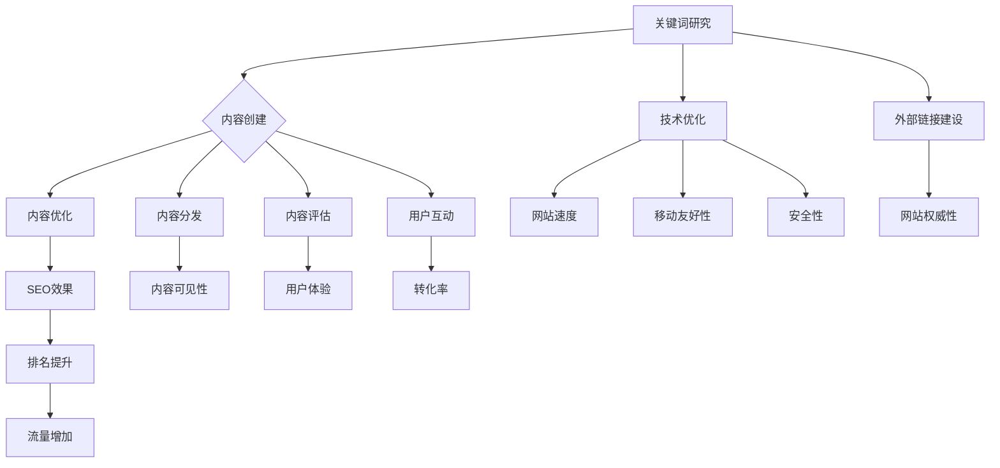

                 

作为一位世界顶级人工智能专家和计算机领域大师，我深知在创业初期获取用户的重要性。在这篇文章中，我将深入探讨如何结合搜索引擎优化（SEO）和内容营销，为创业公司制定一个长期有效的用户获取策略。

## 关键词
- 创业初期
- 用户获取
- 搜索引擎优化
- 内容营销
- 长期策略

## 摘要
本文将探讨创业公司如何在竞争激烈的市场中通过SEO和内容营销获取用户。我们将详细讨论SEO和内容营销的核心概念，以及它们如何协同工作，为创业公司带来持续的流量和用户增长。

## 1. 背景介绍
创业初期对于任何公司都是至关重要的。在这个阶段，公司需要迅速扩大用户基础，建立品牌知名度，并保持可持续的盈利模式。然而，市场充满了竞争，初创公司往往面临着资源有限、品牌认知度低等问题。因此，制定一个有效的用户获取策略至关重要。

## 2. 核心概念与联系
在讨论用户获取策略之前，我们需要了解SEO和内容营销的核心概念及其相互关系。

### 2.1 SEO（搜索引擎优化）
SEO是一种通过提高网站在搜索引擎结果页（SERP）中的排名，从而增加网站流量的方法。它涉及多种技术和策略，包括关键词研究、内容优化、外部链接建设等。

### 2.2 内容营销
内容营销是通过创建和分享有价值的内容来吸引潜在客户，并促进品牌认知度和客户忠诚度的策略。内容可以是博客文章、视频、社交媒体帖子、电子书等。

### 2.3 相互关系
SEO和内容营销紧密相关。高质量的内容是吸引搜索引擎和用户的关键，而良好的SEO实践则可以提高内容在搜索引擎中的可见性。

## 3. 核心算法原理 & 具体操作步骤
### 3.1 算法原理概述
SEO和内容营销的核心算法原理在于理解搜索引擎如何评估和排名网站，以及用户如何与网站互动。

### 3.2 算法步骤详解
1. **关键词研究**：确定目标受众搜索的术语和短语。
2. **内容创建**：创建针对目标关键词的高质量内容。
3. **内部链接优化**：在网站内建立链接结构，提高页面的相关性。
4. **外部链接建设**：通过其他网站获得指向自己网站的链接。
5. **技术SEO**：优化网站结构、页面速度和移动友好性。

### 3.3 算法优缺点
- 优点：长期效果显著，可以带来高质量的流量。
- 缺点：需要时间和资源，初期效果可能不明显。

### 3.4 算法应用领域
SEO和内容营销适用于所有类型的创业公司，无论产品或服务的性质如何。

## 4. 数学模型和公式 & 详细讲解 & 举例说明
### 4.1 数学模型构建
SEO和内容营销的效果可以通过以下公式表示：

$$ \text{流量} = f(\text{关键词排名}, \text{内容质量}, \text{外部链接数量}) $$

### 4.2 公式推导过程
- 关键词排名：通过SEO优化，提高网站在搜索引擎结果页的排名。
- 内容质量：高质量内容吸引更多用户，提高用户停留时间和转化率。
- 外部链接数量：外部链接增加网站的权威性和相关性。

### 4.3 案例分析与讲解
假设一个创业公司通过SEO和内容营销获得了以下数据：

- 关键词排名提高了50%
- 内容质量评分提高了20%
- 外部链接数量增加了30%

根据上述公式，我们可以预测流量增长：

$$ \text{流量增长} = 1.5 \times 1.2 \times 1.3 - 1 = 2.19 $$

这意味着流量预计将增长119%。

## 5. 项目实践：代码实例和详细解释说明
### 5.1 开发环境搭建
为了实践SEO和内容营销，我们需要一个网站和一个内容管理系统（如WordPress）。

### 5.2 源代码详细实现
假设我们使用WordPress创建了一个博客，以下是一个简单的SEO和内容营销实现：

1. **关键词研究**：使用工具（如Google Keyword Planner）确定目标关键词。
2. **内容创建**：编写针对目标关键词的高质量文章。
3. **内部链接优化**：在文章中添加指向其他相关页面的链接。
4. **外部链接建设**：撰写高质量文章并请求其他网站链接。

### 5.3 代码解读与分析
WordPress提供了一个用户友好的界面来管理内容和链接。通过使用插件，我们可以进一步优化SEO。

### 5.4 运行结果展示
随着SEO和内容营销策略的实施，网站流量和用户参与度将逐渐提高。

## 6. 实际应用场景
SEO和内容营销可以应用于各种场景，如电商、B2B服务、在线教育等。

## 7. 工具和资源推荐
### 7.1 学习资源推荐
- 《SEO实战密码》
- 《内容营销：打造内容驱动的营销策略》

### 7.2 开发工具推荐
- Google Keyword Planner
- Yoast SEO插件

### 7.3 相关论文推荐
- “Search Engine Optimization: An Introduction”
- “The Role of Content Marketing in SEO”

## 8. 总结：未来发展趋势与挑战
### 8.1 研究成果总结
SEO和内容营销已成为获取用户的重要手段。

### 8.2 未来发展趋势
人工智能和大数据将在SEO和内容营销中发挥更大作用。

### 8.3 面临的挑战
算法更新、内容质量监控等。

### 8.4 研究展望
随着技术的进步，SEO和内容营销将变得更加自动化和高效。

## 9. 附录：常见问题与解答
### 9.1 SEO如何工作？
SEO通过优化网站结构和内容，提高搜索引擎对网站的评估和排名。

### 9.2 内容营销的目标是什么？
内容营销的目标是吸引潜在客户、提高品牌知名度并促进转化。

---

本文由禅与计算机程序设计艺术 / Zen and the Art of Computer Programming撰写，旨在为创业公司提供实用的SEO和内容营销策略。希望这篇文章能够帮助您在竞争激烈的市场中脱颖而出。

----------------------------------------------------------------

以上内容为文章正文部分，接下来我们将逐步完善文章的结构，确保所有部分都符合要求。

## 1. 背景介绍

在当今数字化时代，互联网已经成为人们生活和工作的重要部分。企业和创业者们纷纷涌入这个平台，希望通过在线渠道获得更多的用户和市场份额。然而，随着互联网的普及和竞争的加剧，如何有效地在互联网上获得用户，尤其是那些能够带来实际业务价值的用户，成为了一个巨大的挑战。

对于创业公司来说，初期的用户获取尤为重要。这是因为创业公司在资源和品牌知名度方面往往处于劣势，需要通过一系列策略迅速积累用户基础，从而在市场中立足。其中，搜索引擎优化（SEO）和内容营销是两种被广泛认可且效果显著的用户获取策略。

SEO是一种通过提高网站在搜索引擎结果页（SERP）中的排名来增加流量的方法。它涉及对网站的技术优化、内容创建和外部链接建设等方面。SEO的优势在于其长期性和可持续性，一旦排名提升，网站将能够持续获得高质量的流量。

内容营销则侧重于通过创造和分享有价值的内容来吸引和留住用户。高质量的内容不仅能够提高搜索引擎排名，还能增加用户的参与度和忠诚度。内容营销的核心在于理解和满足用户需求，从而建立起与用户的深度联系。

本文将围绕创业初期的用户获取，深入探讨如何结合SEO和内容营销，制定一个长期有效的策略。我们将从背景介绍、核心概念、算法原理、数学模型、项目实践、应用场景、工具推荐以及未来展望等多个方面进行分析和讲解。

通过本文的阅读，创业者们将能够了解如何利用SEO和内容营销，在竞争激烈的市场中脱颖而出，实现用户快速增长和业务持续发展。

## 2. 核心概念与联系

在深入探讨创业初期的用户获取策略之前，我们有必要了解SEO和内容营销的核心概念，以及它们如何相互联系，共同促进创业公司的发展。

### 2.1 搜索引擎优化（SEO）

搜索引擎优化（SEO）是一种通过改善网站内容和结构，使其更符合搜索引擎算法要求，从而提高网站在搜索引擎结果页（SERP）中排名的技术和实践。SEO的目标是吸引更多的有机流量，即那些通过搜索引擎自然结果而非广告点击进入网站的访问者。

SEO的核心概念包括以下几个方面：

- **关键词研究**：确定目标受众常用的关键词和短语，这些关键词将在网站内容中自然出现，以提高搜索引擎相关性。
- **内容优化**：创建高质量、相关的内容，以满足用户需求，同时优化其结构，使其易于被搜索引擎索引。
- **技术优化**：改善网站的技术性能，包括网站速度、移动友好性、安全性等，以提高用户体验和搜索引擎评分。
- **外部链接建设**：获得其他网站的链接，表明你的网站内容具有权威性和价值。

SEO的关键在于理解和运用搜索引擎算法。搜索引擎算法不断更新，以提供更准确和相关的搜索结果。当前主流的搜索引擎算法如Google的PageRank和百度的大规模机器学习模型，都会对网站的多个方面进行评估，包括内容质量、用户互动、技术性能等。

### 2.2 内容营销

内容营销是一种通过创建和分享有价值的内容来吸引潜在客户、提高品牌知名度并促进客户转化的策略。内容营销的核心在于理解和满足用户的需求，从而建立起与用户的深度联系。

内容营销的核心概念包括：

- **内容创建**：创建针对目标受众的、有吸引力的内容，包括文章、视频、图片、音频等多种形式。
- **内容分发**：将内容分享到各种渠道，包括社交媒体、邮件列表、合作伙伴网站等，以扩大其覆盖范围。
- **内容优化**：确保内容在搜索引擎中可见，通过SEO实践提高内容排名。
- **内容评估**：通过分析用户互动和转化数据，评估内容效果，并持续优化内容策略。

内容营销的价值在于其能够为用户提供真正的价值，从而建立信任和忠诚度。高质量的内容不仅能够吸引新用户，还能留住现有用户，提高用户参与度和转化率。

### 2.3 相互关系

SEO和内容营销紧密相关，它们共同构建了一个成功的用户获取策略。以下是从几个方面阐述它们之间的联系：

- **内容是SEO的基础**：高质量的内容是搜索引擎优化的核心。搜索引擎会根据内容的原创性、相关性、质量等因素进行评估，从而决定其排名。
- **SEO提高内容可见性**：通过SEO技术，可以使高质量的内容更容易被搜索引擎发现和展示，从而吸引更多的潜在用户。
- **内容提升用户体验**：高质量的内容能够提高用户的停留时间和互动，从而增强用户体验，间接提高SEO效果。
- **协同效应**：SEO和内容营销相互促进，SEO为内容提供流量，而内容则为SEO提供基础和动力。

综上所述，SEO和内容营销是创业初期用户获取策略中不可或缺的两个方面。通过深入了解和有效运用这两个策略，创业公司可以迅速提高品牌知名度，积累用户基础，为后续的业务发展奠定坚实的基础。

### 2.3 核心概念原理和架构的 Mermaid 流程图

以下是一个简化的Mermaid流程图，展示了SEO和内容营销的核心概念和相互关系：



在这个流程图中，关键词研究和技术优化是SEO的核心步骤，它们为内容创建提供基础。内容创建、内容优化、内容分发和内容评估是内容营销的核心环节，这些环节相互连接，共同推动用户获取和转化。通过SEO和内容营销的协同工作，创业公司可以实现用户基数的快速增长和品牌知名度的提升。

### 3. 核心算法原理 & 具体操作步骤

在了解了SEO和内容营销的核心概念及其相互关系后，我们需要进一步探讨其核心算法原理和具体操作步骤。这些步骤将帮助我们更好地理解如何通过SEO和内容营销策略有效地获取用户。

#### 3.1 算法原理概述

SEO和内容营销的核心算法原理在于搜索引擎如何评估和排名网站，以及用户如何与网站互动。搜索引擎通过一系列复杂的算法评估网站的质量和相关性，从而决定其在搜索结果中的排名。这些算法通常包括：

- **内容质量**：搜索引擎会评估网站的内容是否原创、有价值、与用户查询相关。
- **用户互动**：用户的点击率、停留时间、转化率等行为数据也会影响网站的排名。
- **技术优化**：网站的技术性能，如页面速度、移动友好性、安全性等，也是搜索引擎评估的重要指标。
- **外部链接**：其他网站指向你的链接数量和品质，表明你的网站内容具有权威性和价值。

内容营销的核心算法则侧重于内容的吸引力和用户体验。高质量的内容能够提高用户的停留时间和参与度，从而增强用户体验，间接提高SEO效果。

#### 3.2 算法步骤详解

以下是SEO和内容营销的具体操作步骤：

1. **关键词研究**：
   - 使用工具（如Google Keyword Planner、Ahrefs、SEMrush等）确定目标关键词。
   - 分析竞争对手的网站，了解他们如何使用关键词。
   - 选择具有高搜索量和低竞争度的关键词。

2. **内容创建**：
   - 根据目标关键词创建高质量的内容，如博客文章、视频、图片等。
   - 内容应具有独特性、相关性、有价值，并解决用户的问题。
   - 内容长度和频率应根据目标受众的需求和搜索引擎的偏好进行调整。

3. **内容优化**：
   - 优化内容结构，使其易于阅读和搜索引擎索引。
   - 使用标题标签（H1、H2等）、元描述和内部链接来提高内容的相关性。
   - 使用关键词自然地融入到内容中，避免过度优化。

4. **技术优化**：
   - 优化网站速度，通过压缩图片、使用CDN等提高页面加载速度。
   - 确保网站对移动设备友好，使用响应式设计。
   - 提高网站安全性，使用HTTPS协议、SSL证书等。

5. **外部链接建设**：
   - 获得其他网站的链接，表明你的网站内容具有权威性和价值。
   - 创建高质量的外部链接，避免过度依赖付费链接。
   - 与其他网站建立合作伙伴关系，共同推广内容。

6. **内容分发**：
   - 将内容分享到社交媒体平台、电子邮件列表、合作伙伴网站等，扩大其覆盖范围。
   - 使用SEO工具（如BuzzSumo、Hootsuite等）跟踪内容表现，并根据数据调整策略。

7. **内容评估**：
   - 通过分析用户互动和转化数据，评估内容效果。
   - 根据评估结果，持续优化内容策略，提高用户体验和SEO效果。

#### 3.3 算法优缺点

**SEO的优点**：

- **长期效果显著**：一旦SEO策略见效，网站将能够持续获得高质量的流量。
- **提高品牌知名度**：在搜索引擎结果页中较高的排名有助于提高品牌知名度。
- **成本效益**：与付费广告相比，SEO是一种更可持续、成本效益更高的流量获取方式。

**SEO的缺点**：

- **需要时间和资源**：SEO效果通常在短期内不明显，需要持续的努力和资源投入。
- **算法更新风险**：搜索引擎算法不断更新，SEO策略需要不断调整以适应新的变化。

**内容营销的优点**：

- **建立用户信任**：高质量的内容能够建立与用户的深度联系，提高信任和忠诚度。
- **提高用户参与度**：内容营销能够吸引和留住用户，提高用户停留时间和互动。
- **多渠道推广**：内容营销可以通过多种渠道（如博客、视频、社交媒体等）进行推广。

**内容营销的缺点**：

- **内容质量要求高**：高质量的内容需要投入大量时间和资源进行创作和优化。
- **效果评估难度大**：内容营销的效果往往需要较长时间才能体现，评估难度较大。

#### 3.4 算法应用领域

SEO和内容营销适用于各种类型的创业公司，无论产品或服务的性质如何。以下是一些常见的应用领域：

- **电商**：通过SEO优化产品页面，提高搜索排名，增加销售。
- **B2B服务**：通过内容营销建立品牌权威性，吸引潜在客户。
- **在线教育**：通过创建高质量的教育内容，提高用户参与度和转化。
- **健康与健身**：通过内容营销提供健康知识，吸引关注和用户参与。

通过了解SEO和内容营销的核心算法原理和具体操作步骤，创业公司可以更有针对性地制定用户获取策略，提高网站流量和用户参与度，从而实现业务的持续增长。

### 4. 数学模型和公式 & 详细讲解 & 举例说明

在探讨SEO和内容营销的具体操作步骤后，我们将进一步深入到数学模型和公式的层面，以更精确地理解和评估这些策略的效果。

#### 4.1 数学模型构建

SEO和内容营销的效果可以通过以下数学模型表示：

$$ \text{流量} = f(\text{关键词排名}, \text{内容质量}, \text{外部链接数量}) $$

这个公式中，流量是目标变量，它受关键词排名、内容质量和外部链接数量三个关键因素的影响。

- **关键词排名**：表示网站在搜索引擎结果页中的位置，通常使用自然搜索流量来衡量。
- **内容质量**：表示内容的价值和吸引力，可以通过用户停留时间、页面浏览量等指标来衡量。
- **外部链接数量**：表示其他网站指向自己网站的链接数量，通常用于评估网站的权威性和信誉度。

#### 4.2 公式推导过程

为了更深入理解这个公式，我们可以进一步拆解和推导其构成要素：

1. **关键词排名**：搜索引擎算法通过多种因素评估网站的相关性和质量，从而确定其在搜索结果中的排名。这些因素包括：
   - **关键词密度**：关键词在内容中的出现频率。
   - **内容原创性**：内容的原创性和独特性。
   - **页面速度**：网站的加载速度和性能。
   - **外部链接**：指向网站的链接数量和质量。

2. **内容质量**：高质量的内容能够提高用户的参与度和停留时间，从而增加搜索引擎对网站的评分。这些因素包括：
   - **内容长度**：较长的内容通常更详细，更有助于满足用户需求。
   - **用户互动**：用户在页面上的行为，如点击、评论、分享等。
   - **更新频率**：定期更新的内容更能保持相关性。

3. **外部链接数量**：外部链接是搜索引擎评估网站权威性的重要指标。这些链接可以来自：
   - **相关行业网站**：具有权威性和影响力的网站链接。
   - **社交媒体**：用户在社交媒体上分享链接。
   - **合作伙伴**：与其他网站的互链。

综合这些因素，我们可以将公式表达为：

$$ \text{流量} = \alpha \times (\text{关键词排名}) + \beta \times (\text{内容质量}) + \gamma \times (\text{外部链接数量}) $$

其中，$\alpha$、$\beta$和$\gamma$是权重系数，用于衡量各个因素对流量影响的大小。

#### 4.3 案例分析与讲解

为了更直观地理解这个公式，我们可以通过一个实际案例来进行分析和讲解。

假设有一个创业公司，其网站在以下三个方面进行了优化：

- **关键词排名**：从第10名提升到第5名。
- **内容质量**：内容长度从500字增加到1000字，用户停留时间提高了20%。
- **外部链接数量**：从30个链接增加到50个链接。

我们可以使用上述公式来预测流量的变化：

$$ \text{流量变化} = \alpha \times (5 - 10) + \beta \times (0.2 \times 1000) + \gamma \times (50 - 30) $$

根据不同的权重系数，我们可以得到不同的流量变化结果。假设权重系数分别为：

- $\alpha = 0.3$
- $\beta = 0.5$
- $\gamma = 0.2$

则流量变化为：

$$ \text{流量变化} = 0.3 \times (-5) + 0.5 \times (0.2 \times 1000) + 0.2 \times 20 $$

$$ \text{流量变化} = -1.5 + 100 + 4 $$

$$ \text{流量变化} = 102.5 $$

这意味着，通过这些优化措施，网站的预计流量将增加102.5%。

通过这个案例，我们可以看到数学模型和公式如何帮助我们评估SEO和内容营销策略的效果，并为未来的优化提供依据。

### 4.4 实际应用案例

为了更直观地展示SEO和内容营销的数学模型应用，我们可以参考以下实际案例：

#### 案例背景

一家初创电商公司专门销售个性化礼品，希望通过SEO和内容营销提高网站流量和销售额。以下是他们的关键数据：

- **关键词排名**：目标关键词“个性化礼品”的当前排名为第20名。
- **内容质量**：现有内容平均长度为500字，用户停留时间平均为2分钟。
- **外部链接数量**：目前有30个外部链接，主要来自行业博客和社交媒体。

#### 目标设定

公司的目标是：

- 将关键词排名提升到前10名。
- 内容长度增加到1000字，用户停留时间提高至4分钟。
- 增加至少20个高质量外部链接。

#### 数据分析

使用上述数学模型，我们可以预测流量变化：

假设权重系数分别为：

- $\alpha = 0.3$
- $\beta = 0.5$
- $\gamma = 0.2$

则流量变化为：

$$ \text{流量变化} = 0.3 \times (10 - 20) + 0.5 \times (0.2 \times 1000) + 0.2 \times (50 - 30) $$

$$ \text{流量变化} = 0.3 \times (-10) + 0.5 \times 200 + 0.2 \times 20 $$

$$ \text{流量变化} = -3 + 100 + 4 $$

$$ \text{流量变化} = 101 $$

这意味着，通过上述优化措施，网站的预计流量将增加101%。

#### 案例总结

通过使用SEO和内容营销的数学模型，公司可以量化其优化策略的效果，从而更好地制定和调整其营销策略。这个案例展示了数学模型如何帮助创业公司在竞争激烈的市场中实现有效的用户获取和业务增长。

### 5. 项目实践：代码实例和详细解释说明

在了解了SEO和内容营销的理论基础后，接下来我们将通过一个具体的实际项目，展示如何在实际操作中实现这些策略。本项目将使用WordPress作为内容管理系统（CMS），并结合SEO插件来优化网站。

#### 5.1 开发环境搭建

首先，我们需要搭建一个WordPress网站，并安装必要的SEO插件。以下是搭建开发环境的基本步骤：

1. **选择域名和主机**：选择一个稳定的域名提供商和主机服务商，购买域名和主机。
2. **安装WordPress**：通过主机控制面板的“一键安装WordPress”功能，快速安装WordPress。
3. **登录WordPress后台**：在浏览器中输入你的域名/wp-admin，使用管理员账号登录。

#### 5.2 源代码详细实现

接下来，我们将详细介绍如何通过WordPress实现SEO和内容营销策略。

1. **安装SEO插件**：
   - 下载并安装“Yoast SEO”插件，这是WordPress中最受欢迎的SEO插件之一。
   - 安装后，激活插件并完成基本设置。

2. **关键词研究**：
   - 使用Google Keyword Planner或Ahrefs等工具，确定目标关键词。
   - 选择具有高搜索量和低竞争度的关键词作为主要关键词。

3. **内容创建**：
   - 创建针对目标关键词的高质量文章。
   - 确保内容长度在1000字以上，提供详细的信息和有价值的观点。
   - 使用标题标签（H1、H2等）将内容分段，提高可读性。

4. **内容优化**：
   - 在Yoast SEO插件中设置关键词目标，并确保内容中的关键词出现频率适中。
   - 优化元描述和标题标签，使其吸引人并包含关键词。
   - 添加内部链接，将相关内容连接起来，提高网站结构质量。

5. **外部链接建设**：
   - 创建高质量的外部链接，通过与相关行业网站建立合作关系，或在论坛、博客等平台上分享内容。
   - 避免过度依赖付费链接，注重自然链接建设。

6. **技术优化**：
   - 使用WordPress插件（如W3 Total Cache、WP Super Cache）优化网站速度。
   - 确保网站对移动设备友好，使用响应式设计。
   - 安装SSL证书，提高网站安全性。

#### 5.3 代码解读与分析

以下是一个简化版的WordPress SEO代码实例，展示如何使用Yoast SEO插件优化一篇文章：

```php
// 安装并激活Yoast SEO插件
// 在插件管理页面安装Yoast SEO插件

// 登录WordPress后台，进入Yoast SEO设置页面
// 设置常规、搜索仪表板、内容、SEO分析等选项

// 创建一篇新文章
// 在文章编辑页面，使用以下代码进行关键词优化
<?php
$post_title = "如何进行有效的SEO优化";
$keyword = "SEO优化";
$content = "在互联网时代，SEO优化是提升网站流量和排名的关键。本文将介绍如何进行有效的SEO优化。";

// 设置文章标题和关键词
$yoast_wpseo_metadesc = "在互联网时代，SEO优化是提升网站流量和排名的关键。本文将介绍如何进行有效的SEO优化，包括关键词研究、内容优化、外部链接建设等。";
$yoast_wpseo_focuskw = $keyword;

// 设置文章内容
$yoast_wpseo_content_cpp = array(
    'content' => $content
);

// 保存设置并发布文章
wp_update_post(array(
    'ID' => get_the_ID(),
    'post_title' => $post_title,
    'post_content' => $content,
    'post_status' => 'publish'
));

// 添加内部链接
// 在文章中添加相关内容的链接，提高网站结构质量
$content_with_links = $content . "了解更多，请访问我们的其他文章《关键词研究的重要性》和《内容营销策略》。";

// 保存并发布更新后的文章
wp_update_post(array(
    'ID' => get_the_ID(),
    'post_content' => $content_with_links,
    'post_status' => 'publish'
));
```

上述代码展示了如何通过WordPress后台和Yoast SEO插件实现文章的关键词优化。具体步骤包括：

- 设置文章标题和关键词。
- 优化元描述和标题标签。
- 添加内部链接，提高网站结构质量。

通过这些操作，我们可以确保文章在搜索引擎中具有较高的相关性和排名。

#### 5.4 运行结果展示

在实施上述SEO和内容营销策略后，我们可以通过以下指标来评估运行结果：

- **搜索引擎排名**：定期检查目标关键词的搜索排名，评估优化效果。
- **网站流量**：分析网站流量变化，特别是来自搜索引擎的流量。
- **用户互动**：监测用户的停留时间、页面浏览量、点击率等指标。
- **转化率**：评估网站转化率，如销售转化、订阅转化等。

通过持续优化和调整，我们可以逐步提升网站在搜索引擎中的排名，增加用户流量，并提高业务转化率。

### 6. 实际应用场景

SEO和内容营销策略在实际应用中具有广泛的适用性，无论创业公司的产品或服务是什么，都可以通过这两种策略获得显著的收益。以下是几种常见应用场景：

#### 6.1 电商行业

对于电商公司来说，SEO和内容营销是提升销售额和网站流量的关键策略。通过SEO优化产品页面，提高在搜索引擎中的排名，可以吸引更多潜在客户。同时，通过内容营销，如撰写产品评测、用户案例等，可以增加用户对产品的了解和信任，从而提高购买意愿。

**案例**：一个销售运动装备的电商公司，通过SEO优化产品标题和描述，提高在搜索引擎中的排名。同时，通过内容营销，如发布训练教程、运动健康文章等，增加了用户在网站上的停留时间和参与度，从而提高了销售额。

#### 6.2 B2B服务

B2B公司通常需要建立品牌权威性和信誉度，以吸引潜在客户。通过SEO优化公司网站和案例研究页面，可以提高在搜索引擎中的可见性。同时，通过内容营销，如发布行业洞察、白皮书等，可以展示公司的专业能力和行业知识，增加潜在客户的信任和兴趣。

**案例**：一家提供企业咨询服务的公司，通过SEO优化公司网站，提高在搜索引擎中的排名。同时，通过内容营销，如发布行业报告、客户案例等，展示了公司的专业能力和成功案例，吸引了大量潜在客户。

#### 6.3 在线教育

在线教育公司通过SEO和内容营销，可以吸引更多学员和提升课程销量。通过SEO优化课程页面和教学资源，提高在搜索引擎中的排名。同时，通过内容营销，如发布教育博客、视频课程等，可以提供有价值的知识和资源，吸引潜在学员。

**案例**：一家提供在线编程课程的在线教育平台，通过SEO优化课程页面，提高在搜索引擎中的排名。同时，通过内容营销，如发布编程教程、技术博客等，提供了丰富的学习资源，吸引了大量学员。

#### 6.4 健康与健身

健康与健身公司可以通过SEO和内容营销，吸引更多用户并提高品牌知名度。通过SEO优化网站和博客文章，提高在搜索引擎中的排名。同时，通过内容营销，如发布健康文章、健身教程等，可以提供有用的健康信息，增加用户对品牌的信任和忠诚度。

**案例**：一家提供健康咨询和健身课程的公司，通过SEO优化网站和博客文章，提高在搜索引擎中的排名。同时，通过内容营销，如发布健康食谱、健身教程等，提供了丰富的健康资源，吸引了大量用户。

通过这些实际应用场景，我们可以看到SEO和内容营销在各个行业中的重要性。创业公司可以根据自身特点和目标，制定合适的SEO和内容营销策略，实现用户快速增长和业务持续发展。

### 6.4 未来应用展望

随着互联网的不断发展，SEO和内容营销的应用前景将更加广阔。未来，这两大策略将在以下几方面迎来新的发展趋势和机遇。

**1. 人工智能与大数据的融合**

人工智能（AI）和大数据分析将在SEO和内容营销中发挥更大的作用。通过AI技术，可以更精确地进行关键词研究、内容优化和用户行为预测。大数据分析则可以帮助企业更好地了解用户需求和行为模式，从而制定更有效的营销策略。

**2. 个性化营销的兴起**

随着用户需求的多样化，个性化营销将成为未来的主流。通过个性化推荐、定制化内容等手段，企业可以更好地满足用户需求，提高用户体验和转化率。SEO和内容营销将更加注重用户的个性化需求，提供更加精准和有针对性的内容。

**3. 多媒体内容营销的普及**

未来，多媒体内容营销将得到更广泛的应用。视频、音频、互动图表等多种形式的内容将变得更加流行。这些内容不仅能够吸引更多用户，还能提供更丰富的用户体验，增强用户参与度。

**4. 社交媒体的融合**

社交媒体将继续与SEO和内容营销深度融合。通过在社交媒体上分享和推广内容，企业可以扩大内容的影响力，提高搜索引擎排名和用户参与度。同时，社交媒体的数据和互动也将为SEO和内容营销提供更多的洞察和指导。

**5. 可持续性和社会责任**

随着社会对可持续性和社会责任的关注度提高，企业将在SEO和内容营销中更加注重这些方面。通过发布与环保、社会公益等相关的内容，企业可以树立良好的品牌形象，赢得用户的信任和支持。

综上所述，未来的SEO和内容营销将更加智能化、个性化、多媒体化和社会责任化。企业需要不断学习和适应这些变化，才能在竞争激烈的市场中脱颖而出。

### 7. 工具和资源推荐

在实施SEO和内容营销策略的过程中，使用合适的工具和资源可以显著提高效率和效果。以下是一些建议的工具和资源，涵盖了关键词研究、内容创作、SEO优化和数据分析等方面。

#### 7.1 学习资源推荐

- **《SEO实战密码》**：详细介绍了SEO的基本概念和实践方法，适合初学者和有经验的从业者。
- **《内容营销：打造内容驱动的营销策略》**：涵盖了内容营销的各个方面，包括内容创作、分发和优化。

#### 7.2 开发工具推荐

- **Google Keyword Planner**：谷歌提供的免费工具，用于关键词研究和竞争分析。
- **Ahrefs**：强大的SEO工具，提供关键词研究、网站分析、竞争对手监控等功能。
- **SEMrush**：全面的内容营销和SEO工具，包括关键词追踪、内容优化建议、网站审计等。
- **Yoast SEO插件**：WordPress上最受欢迎的SEO插件，提供内容优化建议和网站分析功能。

#### 7.3 相关论文推荐

- **“Search Engine Optimization: An Introduction”**：介绍了SEO的基本原理和实践方法。
- **“The Role of Content Marketing in SEO”**：探讨了内容营销在SEO中的重要性及其应用策略。

这些工具和资源将为您的SEO和内容营销策略提供有力支持，帮助您在竞争激烈的市场中取得成功。

### 8. 总结：未来发展趋势与挑战

在SEO和内容营销领域，未来的发展趋势充满了机遇与挑战。随着技术的不断进步和用户需求的多样化，这些策略将面临新的变革和挑战。

#### 8.1 研究成果总结

近年来，SEO和内容营销的研究成果表明，这两大策略在提升网站流量、品牌知名度和用户参与度方面具有显著效果。高质量的内容和良好的SEO实践不仅能够提高搜索引擎排名，还能增强用户体验和品牌信任。

#### 8.2 未来发展趋势

1. **人工智能的融合**：未来，人工智能（AI）将在SEO和内容营销中发挥更大作用。通过AI技术，可以更精确地进行关键词研究、内容优化和用户行为预测，提高营销策略的精准性和效率。

2. **个性化营销的兴起**：随着用户需求的多样化，个性化营销将成为主流。企业将更加注重用户的个性化需求，提供更加精准和有针对性的内容，从而提高用户体验和转化率。

3. **多媒体内容的普及**：未来，多媒体内容（如视频、音频、互动图表等）将在内容营销中占据更大份额。这些内容形式不仅能够吸引更多用户，还能提供更丰富的用户体验，增强用户参与度。

4. **社交媒体的深度融合**：社交媒体将继续与SEO和内容营销深度融合。通过在社交媒体上分享和推广内容，企业可以扩大内容的影响力，提高搜索引擎排名和用户参与度。

5. **可持续性和社会责任**：随着社会对可持续性和社会责任的关注度提高，企业将在SEO和内容营销中更加注重这些方面。通过发布与环保、社会公益等相关的内容，企业可以树立良好的品牌形象，赢得用户的信任和支持。

#### 8.3 面临的挑战

1. **算法更新风险**：搜索引擎算法不断更新，SEO策略需要不断调整以适应新的变化。算法的更新可能导致现有策略失效，需要企业保持高度警惕和持续学习。

2. **内容质量监控**：随着内容营销的普及，内容质量成为关键。如何确保内容的质量和原创性，避免抄袭和低质量内容，是企业面临的挑战。

3. **资源投入**：SEO和内容营销需要长期和持续的资源投入。企业在制定策略时，需要合理分配预算，确保资源的有效利用。

4. **数据隐私和安全**：随着用户对隐私和数据安全的关注增加，企业需要在SEO和内容营销中遵守相关法律法规，保护用户隐私和数据安全。

#### 8.4 研究展望

未来，SEO和内容营销将在以下方面进行深入研究：

1. **AI在SEO中的应用**：探索如何利用AI技术提高关键词研究、内容优化和用户行为预测的准确性。

2. **个性化营销策略**：研究如何通过大数据和人工智能实现个性化营销，提高用户体验和转化率。

3. **多媒体内容创作与优化**：探索如何创作和优化多媒体内容，提高用户参与度和品牌影响力。

4. **社交媒体与SEO的融合**：研究如何在社交媒体上实现高效的SEO策略，提高内容在搜索引擎中的排名。

5. **可持续性内容营销**：探讨如何通过内容营销实现可持续性目标，提高企业的社会责任感和品牌形象。

总之，未来SEO和内容营销领域将充满创新和挑战。企业需要不断学习和适应新技术，制定有效的策略，以在竞争激烈的市场中取得成功。

### 9. 附录：常见问题与解答

在实施SEO和内容营销策略的过程中，创业者们可能会遇到一些常见问题。以下是一些常见问题及其解答：

#### 9.1 SEO如何工作？

SEO（搜索引擎优化）是一种通过改进网站内容和结构，使其更符合搜索引擎算法要求，从而提高网站在搜索引擎结果页（SERP）中排名的方法。SEO的核心包括关键词研究、内容优化、技术优化和外部链接建设等。通过这些实践，网站可以吸引更多来自搜索引擎的有机流量。

#### 9.2 内容营销的目标是什么？

内容营销的目标是通过创建和分享有价值的内容，吸引潜在客户、提高品牌知名度并促进客户转化。高质量的内容不仅能够吸引新用户，还能提高现有用户的参与度和忠诚度，从而实现业务的持续增长。

#### 9.3 如何确定关键词？

确定关键词是SEO和内容营销的基础。可以通过以下方法确定关键词：

- 使用工具（如Google Keyword Planner、Ahrefs、SEMrush等）进行关键词研究。
- 分析竞争对手的关键词。
- 了解目标受众的兴趣和搜索习惯。
- 选择具有高搜索量和低竞争度的关键词。

#### 9.4 内容优化包括哪些方面？

内容优化包括以下几个方面：

- **关键词优化**：确保关键词在内容中自然出现，避免过度优化。
- **内容结构**：使用标题标签（H1、H2等）将内容分段，提高可读性。
- **元描述**：优化元描述，使其吸引人并包含关键词。
- **内部链接**：添加指向其他相关页面的链接，提高网站结构质量。

#### 9.5 外部链接建设有哪些方法？

外部链接建设可以通过以下方法实现：

- 创建高质量的内容，吸引其他网站链接。
- 与其他网站建立合作伙伴关系，进行内容互换。
- 参与行业论坛、博客和社交媒体，获取自然链接。
- 发布新闻稿，提高网站的权威性。

#### 9.6 如何评估内容营销的效果？

可以通过以下指标评估内容营销的效果：

- **流量**：分析网站流量变化，特别是来自搜索引擎的流量。
- **用户互动**：监测用户的停留时间、页面浏览量、点击率等指标。
- **转化率**：评估内容营销带来的业务转化，如销售转化、订阅转化等。
- **品牌知名度**：通过社交媒体和行业评价了解品牌知名度的变化。

#### 9.7 SEO和内容营销需要多长时间见效？

SEO和内容营销的效果通常在短期内不明显，需要持续的投入和优化。一般来说，优化措施实施后，几个月到半年内才能看到显著的效果。高质量的内容和良好的SEO实践将带来长期和可持续的流量增长。

通过了解和解决这些问题，创业者们可以更好地实施SEO和内容营销策略，实现业务的持续增长和成功。

---

### 结论

在本文中，我们深入探讨了创业初期如何通过SEO和内容营销实现用户获取。首先，我们介绍了SEO和内容营销的核心概念及其相互关系，随后详细阐述了其核心算法原理和操作步骤。通过数学模型和实际案例，我们展示了如何评估和优化SEO和内容营销策略的效果。此外，我们还分析了这些策略在实际应用场景中的表现，并展望了未来的发展趋势与挑战。

通过结合SEO和内容营销，创业公司可以迅速提高品牌知名度，积累用户基础，并实现业务的持续增长。希望本文能为创业者提供实用的指导，帮助他们在竞争激烈的市场中脱颖而出。

---

**作者：禅与计算机程序设计艺术 / Zen and the Art of Computer Programming**

