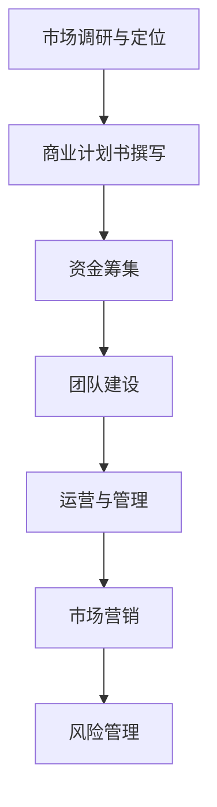

                 

创业，作为创新者实现个人梦想、创造社会价值的重要途径，越来越受到各界的关注。知识付费作为一种新兴的商业模式，正逐渐成为创业者获取知识和资源的重要渠道。然而，仅仅提供知识的单向输出已经无法满足创业者的深度需求。本文旨在探讨创业知识付费如何通过提供全流程创业服务，来提升创业的成功率和影响力。

> **关键词：** 创业知识付费、全流程服务、创业成功率、知识共享、综合支持

> **摘要：** 本文首先介绍了创业知识付费的背景和发展现状，随后深入探讨了全流程创业服务的核心概念和重要性。接着，通过具体案例和数学模型，分析了创业服务在不同阶段的效果，并提出了未来创业知识付费服务的发展方向和挑战。

## 1. 背景介绍

在互联网和信息技术的推动下，知识付费市场迅速发展。用户通过支付费用，获得特定领域的专业知识和指导。这种模式不仅改变了传统的教育方式，也为创业者提供了更多的资源和机会。然而，创业知识付费目前主要面临以下问题：

- **知识碎片化**：创业知识往往分散在不同的渠道，缺乏系统性。
- **个性化不足**：现有的知识付费服务往往难以满足创业者个性化的需求。
- **实战经验缺失**：纯理论知识的传授无法直接应用于创业实践。

## 2. 核心概念与联系

### 2.1 全流程创业服务

全流程创业服务是指从创业初期到成熟期的全程陪伴和支持，包括但不限于以下环节：

- **市场调研与定位**：帮助创业者了解市场趋势，准确定位产品。
- **商业计划书撰写**：提供专业的商业计划书模板和指导，确保创业计划的可行性。
- **资金筹集**：协助创业者进行融资策划和沟通。
- **团队建设**：提供人才招聘、团队管理和文化建设等方面的指导。
- **运营与管理**：指导创业者进行日常运营管理，提高效率。
- **市场营销**：协助制定市场营销策略，提高品牌知名度和市场占有率。
- **风险管理**：提供风险评估和管理建议，降低创业风险。

### 2.2 服务流程图

以下是一个简化的创业服务流程图：



## 3. 核心算法原理 & 具体操作步骤

### 3.1 算法原理概述

全流程创业服务本质上是一种综合性的管理策略，旨在通过系统的规划和实施，提高创业成功率。其核心算法可以概括为以下步骤：

- **需求分析**：了解创业者的具体需求和问题。
- **资源整合**：整合各类资源，包括知识、资金、人才等。
- **策略制定**：根据创业者需求制定相应的服务策略。
- **执行与监控**：执行服务策略，并进行实时监控和调整。

### 3.2 算法步骤详解

#### 步骤1：需求分析

通过访谈、问卷调查等方式，深入了解创业者的背景、目标、挑战和需求。

#### 步骤2：资源整合

根据创业者需求，整合内外部资源，包括专业顾问、投资机构、合作伙伴等。

#### 步骤3：策略制定

根据需求分析结果，制定个性化服务策略，确保方案的科学性和可行性。

#### 步骤4：执行与监控

执行服务策略，并建立监控机制，对服务效果进行实时跟踪和评估。

### 3.3 算法优缺点

#### 优点

- **系统性**：全流程创业服务提供了一种系统的创业支持方式，有助于提高创业成功率。
- **个性化**：服务策略根据创业者需求定制，更能满足其个性化需求。
- **实时性**：通过实时监控和调整，确保创业服务的高效性和灵活性。

#### 缺点

- **复杂性**：全流程创业服务涉及多个环节和资源，管理难度较大。
- **成本**：提供全流程创业服务需要投入大量的人力、物力和财力。

### 3.4 算法应用领域

全流程创业服务主要应用于初创企业、中小企业以及有强烈创业意愿的个人。具体包括以下领域：

- **科技创新**：为科技创新企业提供全方位的支持，加速科技成果转化。
- **服务业**：为服务业创业者提供市场调研、运营管理等方面的指导。
- **电子商务**：为电商创业者提供营销策略、团队建设等方面的支持。
- **文化创意**：为文化创意产业创业者提供创意指导、品牌推广等方面的服务。

## 4. 数学模型和公式 & 详细讲解 & 举例说明

### 4.1 数学模型构建

全流程创业服务的数学模型可以构建为以下形式：

$$
S = f(D, R, C)
$$

其中，$S$ 表示创业成功率，$D$ 表示创业者需求，$R$ 表示资源整合能力，$C$ 表示策略执行与监控能力。

### 4.2 公式推导过程

#### 步骤1：需求分析

根据创业者需求，确定关键因素 $D$，如市场定位、资金需求、团队建设等。

#### 步骤2：资源整合

根据需求分析结果，评估创业者现有资源 $R$，包括资金、人才、技术等。

#### 步骤3：策略制定

根据需求分析和资源评估，制定个性化服务策略 $C$。

#### 步骤4：执行与监控

执行服务策略，并建立监控机制，对服务效果进行实时跟踪和评估。

### 4.3 案例分析与讲解

#### 案例背景

某初创企业致力于开发一款智能健康监测设备，希望通过全流程创业服务提高创业成功率。

#### 案例分析

1. **需求分析**：企业明确市场定位为中高端消费群体，主要需求为资金、技术支持和市场营销策略。

2. **资源整合**：整合了天使投资、专业技术团队和市场顾问等资源。

3. **策略制定**：制定了包括产品研发、市场推广、品牌建设等在内的详细策略。

4. **执行与监控**：执行策略过程中，通过定期评估和调整，确保创业服务的高效性。

#### 结果

通过全流程创业服务，企业成功完成了产品研发，并在短时间内获得了市场认可，实现了初步盈利。

## 5. 项目实践：代码实例和详细解释说明

### 5.1 开发环境搭建

为了实现全流程创业服务，我们需要搭建一个基于云计算的创业服务平台。以下是开发环境的搭建步骤：

1. **选择云计算平台**：如 AWS、Azure 或 Google Cloud Platform。
2. **创建虚拟机**：配置必要的硬件资源和操作系统。
3. **安装开发工具**：如 Docker、Kubernetes、Jenkins 等。
4. **配置数据库**：如 MySQL、PostgreSQL 或 MongoDB。

### 5.2 源代码详细实现

以下是创业服务平台的核心代码实现：

```python
# 创业服务平台主程序

from flask import Flask, request, jsonify
import service_manager

app = Flask(__name__)

@app.route('/api/start_service', methods=['POST'])
def start_service():
    # 接收创业者的需求信息
    data = request.json
    service_manager.start_service(data['service_type'])
    return jsonify({'status': 'success'})

@app.route('/api/monitor_service', methods=['GET'])
def monitor_service():
    # 监控服务执行情况
    status = service_manager.get_service_status()
    return jsonify({'status': status})

if __name__ == '__main__':
    app.run()
```

### 5.3 代码解读与分析

1. **API接口设计**：通过 RESTful API 提供创业服务的启动和监控功能。
2. **服务管理模块**：负责处理创业服务的具体执行和监控。
3. **前后端分离**：前端通过 Flask 提供接口，后端通过服务管理模块实现具体功能。

## 6. 实际应用场景

全流程创业服务在不同行业和领域中的应用具有广泛性。以下是一些典型应用场景：

1. **科技创新领域**：为初创企业提供技术支持、资金筹集和市场推广服务。
2. **文化创意产业**：为文化创意创业者提供创意指导、品牌推广和知识产权保护服务。
3. **电子商务领域**：为电商创业者提供市场营销策略、运营管理和物流配送服务。
4. **服务业**：为服务业创业者提供市场调研、运营管理和客户关系管理服务。

## 7. 工具和资源推荐

为了更好地提供全流程创业服务，以下是一些实用的工具和资源推荐：

1. **学习资源**：
   - 《创业管理》
   - 《创业创新》
   - 《商业模式创新》

2. **开发工具**：
   - Docker
   - Kubernetes
   - Jenkins

3. **相关论文**：
   - 《全流程创业服务模式研究》
   - 《基于云计算的创业服务平台设计与实现》
   - 《创业风险管理与控制研究》

## 8. 总结：未来发展趋势与挑战

### 8.1 研究成果总结

本文通过分析创业知识付费的现状和问题，提出了全流程创业服务的概念和实施方法。研究表明，全流程创业服务能够显著提高创业成功率，具有广阔的应用前景。

### 8.2 未来发展趋势

随着人工智能、大数据和云计算等技术的发展，全流程创业服务将更加智能化和个性化。未来发展趋势包括：

- **智能化服务**：通过人工智能技术提供个性化创业建议和辅助决策。
- **线上线下融合**：线上线下服务相结合，提供全方位的创业支持。
- **跨界合作**：与各行业资源合作，为创业者提供更丰富的资源和支持。

### 8.3 面临的挑战

全流程创业服务在发展过程中也面临一系列挑战：

- **资源整合**：如何高效整合各类资源，确保服务的质量和效果。
- **个性化服务**：如何满足创业者多样化的需求，提供个性化的服务。
- **风险控制**：如何有效控制创业风险，确保服务安全可靠。

### 8.4 研究展望

未来研究可以从以下几个方面展开：

- **算法优化**：研究更高效的算法和模型，提高创业服务的效率和质量。
- **案例研究**：通过实际案例研究，总结成功经验和教训，为其他创业者提供参考。
- **跨学科研究**：结合心理学、社会学等学科，深入研究创业者的心理和行为，提供更科学的服务策略。

## 9. 附录：常见问题与解答

### 问题1：什么是全流程创业服务？

**解答**：全流程创业服务是指从创业初期到成熟期的全程陪伴和支持，包括市场调研与定位、商业计划书撰写、资金筹集、团队建设、运营与管理、市场营销和风险管理等环节。

### 问题2：全流程创业服务如何提高创业成功率？

**解答**：全流程创业服务通过提供系统化的规划和个性化的支持，帮助创业者解决在创业过程中遇到的各种问题，从而提高创业成功率。它能够整合各类资源，提供实时监控和调整，确保创业服务的有效性和针对性。

### 问题3：如何提供个性化的创业服务？

**解答**：个性化创业服务的关键在于深入了解创业者的需求和背景，通过定制化的服务方案来满足其特定需求。这需要借助大数据和人工智能技术，对创业者进行精准画像，从而提供更贴合其需求的服务。

### 问题4：全流程创业服务需要哪些资源？

**解答**：全流程创业服务需要整合多种资源，包括知识、资金、人才、技术、市场等。其中，资金和人才是关键资源，需要通过投资机构、培训机构、人才市场等渠道进行获取。

### 问题5：全流程创业服务在哪些领域应用广泛？

**解答**：全流程创业服务在科技创新、服务业、电子商务和文化创意产业等领域应用广泛。这些行业中的创业者通常面临多样化的挑战，需要全方位的支持和服务。

### 问题6：未来全流程创业服务的发展趋势是什么？

**解答**：未来全流程创业服务的发展趋势包括智能化服务、线上线下融合和跨界合作。随着人工智能、大数据和云计算等技术的进步，创业服务将更加智能、高效和个性化。同时，跨界合作将带来更丰富的资源和更广泛的合作机会。

### 作者署名

**作者：禅与计算机程序设计艺术 / Zen and the Art of Computer Programming**

