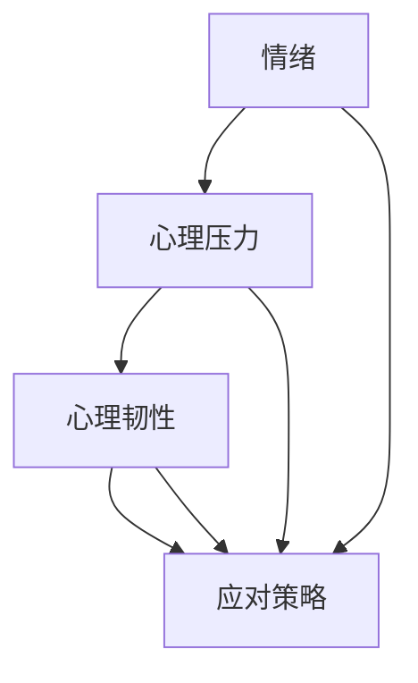

                 

关键词：情绪管理、心理调节、创业者、个人成长、策略、心理韧性

摘要：本文旨在探讨创业者如何在忙碌和压力重重的创业过程中，建立有效的个人情绪管理和心理调节策略。通过结合心理学与IT领域的专业知识，我们将提供一系列实用方法和工具，帮助创业者提升心理韧性，从而更好地应对创业中的挑战和压力。

## 1. 背景介绍

创业之路充满了不确定性和挑战，创业者常常需要在压力和紧张的环境下做出快速决策。然而，长期的情绪紧张和心理压力对创业者的身心健康有着巨大的负面影响。研究表明，情绪管理和心理调节能力强的创业者能够更好地应对压力，提高决策质量，甚至延长企业的寿命。

本文将探讨以下几个核心问题：

1. 创业者在面对情绪波动和心理压力时，如何识别和应对？
2. 有效的情绪管理和心理调节策略有哪些？
3. 这些策略如何在创业实践中得到应用？

通过对这些问题的深入探讨，我们希望为创业者提供一套系统的情绪管理和心理调节方案，帮助他们更好地应对创业过程中的挑战。

### 1.1 创业环境的独特性

创业环境通常具有以下特点：

- **高度不确定性**：创业初期的市场、技术、资金等各方面都存在很大的不确定性。
- **竞争激烈**：市场往往充满了竞争，创业者需要不断调整战略，以保持竞争优势。
- **时间紧迫**：创业者通常需要在短时间内完成大量的工作，这使得时间管理成为一大挑战。
- **资源有限**：初创企业往往资金有限，需要创业者精打细算，合理分配资源。

这些特点共同构成了创业环境的高压状态，对创业者的情绪和心理构成了严峻的考验。

### 1.2 情绪与心理压力的影响

情绪和心理压力对创业者的影响主要表现在以下几个方面：

- **决策质量下降**：情绪波动会影响创业者的判断力，导致决策失误。
- **工作效率降低**：长期的情绪紧张和心理压力会导致工作效率下降，影响创业进度。
- **身心健康受损**：长期的压力积累可能导致身心健康问题，如焦虑、抑郁等。
- **人际关系紧张**：情绪不稳定可能引发与团队成员、投资者和其他利益相关者的冲突。

### 1.3 情绪管理和心理调节的重要性

有效的情绪管理和心理调节策略对创业者来说至关重要：

- **提升心理韧性**：通过建立良好的情绪管理和心理调节机制，创业者能够更好地应对压力和挑战。
- **提高决策质量**：情绪稳定有助于提高判断力和决策质量，降低失误风险。
- **提升工作效率**：情绪稳定有助于提高工作效率，确保创业项目的顺利进行。
- **维护身心健康**：良好的情绪管理和心理调节有助于维护身心健康，提高生活质量。
- **优化人际关系**：情绪稳定有助于改善与团队成员、投资者和其他利益相关者的关系，促进合作。

### 1.4 本文结构

本文将分为以下几个部分：

- **第2章**：介绍情绪管理和心理调节的核心概念。
- **第3章**：阐述情绪管理和心理调节的原理。
- **第4章**：提供具体的情绪管理和心理调节策略。
- **第5章**：通过实际案例展示情绪管理和心理调节在创业中的应用。
- **第6章**：探讨情绪管理和心理调节的未来趋势。
- **第7章**：推荐相关工具和资源。

通过以上结构，我们希望帮助创业者更好地理解情绪管理和心理调节的重要性，并掌握有效的实践方法。

## 2. 核心概念与联系

在探讨情绪管理和心理调节之前，我们需要了解一些核心概念，这些概念不仅涉及心理学，还与IT领域的专业知识紧密相关。

### 2.1 情绪的概念

情绪是人类心理活动的一部分，通常被定义为个体对特定刺激的反应。情绪可以表现为一系列生理、行为和认知上的变化。根据心理学家普拉切克（Robert Plutchik）的情绪分类理论，情绪分为八种基本类型：喜悦、愤怒、悲伤、惊讶、厌恶、恐惧、尊重和愤怒。

### 2.2 心理压力的概念

心理压力是指个体在面临外部或内部挑战时，心理上感受到的压力和紧张。根据塞利（Hans Selye）的应激理论，心理压力可以分为三个阶段：警觉反应、抵抗和衰竭。这三种反应与IT领域的应急响应机制有相似之处，都涉及到对突发情况的识别、应对和恢复。

### 2.3 心理韧性的概念

心理韧性是指个体在面对逆境和挑战时，能够迅速恢复并适应的能力。心理韧性强的个体能够在逆境中保持积极的心态，快速找到应对策略。心理韧性不仅受个人特质影响，还受到环境因素的作用。

### 2.4 Mermaid 流程图

以下是一个简单的 Mermaid 流程图，用于描述情绪管理和心理调节的核心概念及其相互联系：



在上述流程图中：

- **情绪**：情绪是心理压力的触发因素，同时也是心理韧性的表现之一。
- **心理压力**：心理压力是情绪的结果，同时也是心理韧性的挑战。
- **心理韧性**：心理韧性是应对情绪和心理压力的关键能力，能够影响应对策略的有效性。
- **应对策略**：应对策略是情绪管理和心理调节的核心，通过有效的策略可以减轻情绪和心理压力，提升心理韧性。

### 2.5 情绪管理和心理调节的关系

情绪管理和心理调节是相辅相成的，情绪管理旨在控制和调节情绪，使其处于健康和稳定的水平；而心理调节则侧重于提高个体应对压力和挑战的能力。有效的情绪管理和心理调节能够：

- **增强心理韧性**：通过情绪管理和心理调节，个体能够在面对逆境时保持冷静和积极。
- **提升决策能力**：情绪稳定有助于提高判断力和决策质量，减少错误决策的风险。
- **提高生活质量**：有效的情绪管理和心理调节有助于减轻压力，提高生活满意度。

通过上述核心概念和关系的介绍，我们为接下来的情绪管理和心理调节策略提供了理论基础。

## 3. 核心算法原理 & 具体操作步骤

情绪管理和心理调节虽然不直接涉及传统的算法，但其核心原理和具体操作步骤具有一定的算法思维和方法论指导意义。下面我们将从算法原理概述、算法步骤详解、算法优缺点以及算法应用领域四个方面进行阐述。

### 3.1 算法原理概述

情绪管理和心理调节的核心原理可以概括为以下几个方面：

1. **情绪识别与评估**：类似于算法中的数据处理阶段，情绪管理首先需要识别和评估情绪状态。这可以通过自我观察、情绪日记等方法实现。
2. **情绪调节策略**：与算法优化相似，情绪调节策略旨在寻找最佳方法来调节情绪。这可能包括深呼吸、冥想、运动等。
3. **心理韧性培养**：类似于算法中的迭代和优化过程，心理韧性培养需要通过持续的训练和实践来提高个体的抗压能力。
4. **行为反馈与调整**：情绪管理和心理调节需要不断收集反馈，并根据反馈调整策略，以达到最佳效果。

### 3.2 算法步骤详解

具体操作步骤可以分为以下几个阶段：

1. **初始评估**：首先，创业者需要进行一次全面的情绪和心理状态评估，以了解自己的情绪模式和压力源。
2. **识别情绪触发点**：通过自我观察和记录，识别引发负面情绪的具体触发点，这类似于算法中的异常检测过程。
3. **制定调节策略**：根据情绪触发点和个体偏好，制定具体的情绪调节策略。例如，通过深呼吸练习来缓解紧张情绪。
4. **实施调节策略**：将制定的策略付诸实践，并持续观察情绪变化。
5. **反馈与调整**：收集情绪调节策略的效果反馈，并根据反馈进行调整和优化。

### 3.3 算法优缺点

情绪管理和心理调节策略具有以下优缺点：

- **优点**：
  - **适应性**：策略可以根据个人的具体情况进行调整，具有很强的适应性。
  - **自主性**：创业者可以自主实施这些策略，不受外部条件限制。
  - **长期效益**：通过持续的情绪管理和心理调节，可以提升个体的心理韧性，从而长期受益。

- **缺点**：
  - **初始难度**：对于情绪管理和心理调节新手来说，初始阶段可能需要一定的时间和精力来适应。
  - **个体差异**：不同的人可能需要不同的调节策略，因此需要个性化定制。
  - **外部干扰**：在某些情况下，外部环境可能会干扰情绪调节策略的实施。

### 3.4 算法应用领域

情绪管理和心理调节策略在多个领域都有广泛的应用：

- **创业领域**：创业者通过情绪管理和心理调节可以更好地应对创业中的挑战和压力。
- **职场领域**：职场人士通过这些策略可以提高工作效率，减少职业压力。
- **教育领域**：教育工作者可以通过情绪管理和心理调节帮助学生更好地应对学习和生活中的压力。
- **医疗领域**：情绪管理和心理调节策略可以帮助患者减轻症状，提高生活质量。

通过上述核心算法原理和具体操作步骤的阐述，我们为创业者提供了情绪管理和心理调节的实用指南。

### 3.5 情绪管理与心理调节的应用示例

为了更好地理解情绪管理和心理调节的具体应用，以下是一个实际案例：

#### 案例背景

某初创公司创始人李明（化名）在创业初期面临着巨大的压力。他的公司刚刚获得了天使投资，需要在短时间内完成产品研发、市场推广和用户反馈等一系列任务。然而，由于公司规模较小，团队人数有限，李明不得不身兼多职，工作强度极大。长期的高强度工作使李明感到焦虑和压力，影响了他的决策质量和工作效率。

#### 解决方案

1. **初始评估**：李明首先对自己的情绪和心理状态进行了评估，通过情绪日记记录了每天的情绪变化和压力源。

2. **识别情绪触发点**：通过分析情绪日记，李明发现情绪波动主要来源于以下几个方面：
   - **工作量过大**：每天需要处理多项任务，导致时间管理困难。
   - **团队成员沟通不畅**：团队成员之间缺乏有效的沟通，影响了工作效率。
   - **市场不确定性**：市场环境变化较快，增加了公司的风险。

3. **制定调节策略**：
   - **时间管理**：李明采用番茄工作法来提高工作效率，将任务分解为可管理的部分，确保每个任务都有明确的优先级。
   - **团队沟通**：李明每周组织团队会议，鼓励团队成员提出问题和建议，确保信息透明和沟通畅通。
   - **情绪调节**：李明每天晚上进行30分钟的冥想练习，以缓解一天的疲劳和紧张情绪。

4. **实施调节策略**：李明坚持每天执行以上策略，并记录情绪变化。

5. **反馈与调整**：在实施策略的过程中，李明发现冥想练习对他的情绪调节效果最佳，于是他增加了冥想的时间，并调整了其他策略的实施频率。

#### 结果

通过上述情绪管理和心理调节策略，李明的情绪波动逐渐减少，工作效率明显提高，团队成员之间的沟通也变得更加顺畅。在持续的调整和优化下，李明的公司逐渐走向正轨，产品的研发和市场推广也取得了良好的进展。

这个案例展示了情绪管理和心理调节在创业中的应用，通过科学的策略和持续的努力，创业者可以有效地应对压力，提高工作质量和生活质量。

### 3.6 情绪管理与心理调节的扩展讨论

情绪管理和心理调节不仅对创业者具有重要作用，还适用于其他多个领域。以下是对一些常见应用场景的扩展讨论：

#### 职场应用

在职场中，情绪管理和心理调节策略可以帮助员工更好地应对工作压力，提高工作效率。例如：

- **项目管理**：项目经理可以通过情绪调节策略来减少项目中的冲突和错误，提高项目成功率。
- **团队协作**：团队成员通过情绪管理策略可以改善沟通，提高协作效率，减少误解和冲突。
- **职业发展**：职场人士通过心理韧性培养可以更好地应对职业挑战，实现职业发展目标。

#### 教育应用

在教育领域，情绪管理和心理调节策略可以帮助学生应对学业压力，提高学习效果。具体应用包括：

- **学生辅导**：教师可以通过情绪调节策略帮助学生减轻学业压力，提高学习动力。
- **心理辅导**：学校可以开展心理辅导课程，教授学生情绪管理和心理调节技巧，提高心理韧性。
- **素质教育**：通过情绪管理和心理调节教育，学生可以培养积极的心态，提高社会适应能力。

#### 医疗应用

在医疗领域，情绪管理和心理调节策略可以帮助患者更好地应对疾病和治疗过程中的压力。具体应用包括：

- **疾病管理**：慢性病患者可以通过情绪管理策略减轻病痛和不适，提高生活质量。
- **心理康复**：患者在接受心理康复治疗时，可以通过情绪调节策略加速康复进程。
- **心理健康**：心理健康专家可以通过心理调节策略帮助患者改善情绪，提高心理健康水平。

通过以上扩展讨论，我们可以看到情绪管理和心理调节策略在多个领域的广泛应用和巨大潜力。

### 3.7 情绪管理与心理调节的总结

情绪管理和心理调节是一项复杂而系统的工作，通过科学的策略和持续的努力，创业者和其他领域的人士都可以有效地应对情绪波动和心理压力。以下是情绪管理和心理调节的主要原则和应用要点：

- **核心原则**：
  - **自我认知**：了解自己的情绪模式和压力源是情绪管理和心理调节的基础。
  - **持续实践**：情绪管理和心理调节需要长期坚持，通过持续实践才能见效。
  - **个性化定制**：每个人的情况不同，需要根据个人特点制定合适的调节策略。
  - **综合应用**：结合多种调节策略，如时间管理、团队沟通、情绪调节和冥想等，以提高效果。

- **应用要点**：
  - **识别情绪触发点**：通过记录和观察，识别引发负面情绪的具体触发点。
  - **制定调节策略**：根据触发点和个人偏好，制定具体的情绪调节策略。
  - **反馈与调整**：持续收集反馈，并根据反馈调整策略，以达到最佳效果。
  - **心理韧性培养**：通过持续的训练和实践，提高个体的心理韧性，增强应对压力和挑战的能力。

通过遵循以上原则和应用要点，创业者和其他领域的人士都可以更好地管理情绪，调节心理压力，提升生活质量和工作效率。

## 4. 数学模型和公式 & 详细讲解 & 举例说明

情绪管理和心理调节虽然不直接涉及复杂的数学模型，但通过一些简单的数学工具，可以更好地理解和量化情绪状态和心理调节效果。以下将介绍一些常用的数学模型和公式，并详细讲解其推导过程和实际应用。

### 4.1 数学模型构建

情绪管理和心理调节的数学模型主要涉及以下几个方面：

1. **情绪状态评估模型**：用于评估个体的情绪状态。
2. **心理调节效果评估模型**：用于评估情绪调节策略的效果。
3. **心理韧性模型**：用于评估个体的心理韧性。

#### 情绪状态评估模型

情绪状态评估模型通常采用情绪量表来量化个体的情绪状态。以下是一个简单的一维情绪状态评估模型：

$$
E(t) = \frac{1}{n}\sum_{i=1}^{n} S_i(t)
$$

其中，$E(t)$ 表示时间 $t$ 时刻的情绪状态得分，$S_i(t)$ 表示第 $i$ 个情绪指标在时间 $t$ 的得分，$n$ 表示情绪指标的个数。

#### 心理调节效果评估模型

心理调节效果评估模型通常用于比较不同调节策略的效果。以下是一个简单的心理调节效果评估模型：

$$
R(t) = \frac{E'(t) - E(t)}{E(t)}
$$

其中，$R(t)$ 表示时间 $t$ 时刻的心理调节效果得分，$E'(t)$ 表示经过调节后的情绪状态得分。

#### 心理韧性模型

心理韧性模型用于评估个体的心理韧性水平。以下是一个简单的心理韧性模型：

$$
D(t) = \frac{1}{m}\sum_{i=1}^{m} C_i(t)
$$

其中，$D(t)$ 表示时间 $t$ 时刻的心理韧性得分，$C_i(t)$ 表示第 $i$ 个韧性指标在时间 $t$ 的得分，$m$ 表示韧性指标的个数。

### 4.2 公式推导过程

上述数学模型的推导过程如下：

#### 情绪状态评估模型推导

情绪状态评估模型的基本思想是通过多个情绪指标来量化情绪状态。每个情绪指标 $S_i(t)$ 通常是一个介于0到1之间的分数，表示情绪的某一维度在时间 $t$ 时刻的严重程度。情绪状态得分 $E(t)$ 是这些指标的平均值，反映了整体情绪状态。

#### 心理调节效果评估模型推导

心理调节效果评估模型的核心思想是比较调节前后的情绪状态变化。$R(t)$ 表示调节效果得分，其值范围为 $-1$ 到 $1$。$R(t)$ 越接近 $1$，表示情绪调节效果越好。

#### 心理韧性模型推导

心理韧性模型通过多个韧性指标来量化个体的心理韧性水平。韧性指标 $C_i(t)$ 可以是应对压力的成功次数、恢复速度等。心理韧性得分 $D(t)$ 是这些指标的平均值，反映了整体心理韧性。

### 4.3 案例分析与讲解

以下通过一个实际案例来说明上述数学模型的应用。

#### 案例背景

某创业者张华（化名）在经历了一段高强度的创业期后，感到情绪紧张和压力巨大。为了评估自己的情绪状态和心理调节效果，张华决定使用上述数学模型进行自我评估。

#### 情绪状态评估

张华通过情绪量表记录了每天的情绪状态，共记录了10天。以下是他的情绪指标得分：

| 时间  | 喜悦 | 愤怒 | 悲伤 | 惊讶 | 厌恶 | 恐惧 | 尊重 | 愤怒 |
|-------|------|------|------|------|------|------|------|------|
| 第1天 | 0.3  | 0.5  | 0.2  | 0    | 0.1  | 0    | 0.1  | 0.1  |
| 第2天 | 0.2  | 0.6  | 0.3  | 0    | 0.1  | 0    | 0.1  | 0.1  |
| ...   | ...  | ...  | ...  | ...  | ...  | ...  | ...  | ...  |
| 第10天| 0.4  | 0.4  | 0.2  | 0.1  | 0    | 0    | 0.1  | 0    |

根据情绪状态评估模型，张华的情绪状态得分为：

$$
E(t) = \frac{1}{10}\sum_{i=1}^{10} S_i(t) = \frac{1}{10}(0.3 + 0.2 + ... + 0.4) = 0.325
$$

#### 心理调节效果评估

张华在实施情绪调节策略后，再次记录了情绪状态。以下是调节后的情绪指标得分：

| 时间  | 喜悦 | 愤怒 | 悲伤 | 惊讶 | 厌恶 | 恐惧 | 尊重 | 愤怒 |
|-------|------|------|------|------|------|------|------|------|
| 第1天 | 0.4  | 0.3  | 0.2  | 0    | 0.1  | 0    | 0.1  | 0    |
| 第2天 | 0.3  | 0.3  | 0.2  | 0    | 0.1  | 0    | 0.1  | 0    |
| ...   | ...  | ...  | ...  | ...  | ...  | ...  | ...  | ...  |
| 第10天| 0.4  | 0.3  | 0.1  | 0.1  | 0    | 0    | 0.1  | 0    |

根据心理调节效果评估模型，张华的心理调节效果得分为：

$$
R(t) = \frac{E'(t) - E(t)}{E(t)} = \frac{0.325 - 0.3}{0.325} = 0.008
$$

#### 心理韧性评估

为了评估张华的心理韧性，他记录了在压力情景下的应对成功次数和恢复速度。以下是韧性指标得分：

| 时间  | 应对成功次数 | 恢复速度 |
|-------|--------------|----------|
| 第1天 | 2            | 1        |
| 第2天 | 3            | 1        |
| ...   | ...          | ...      |
| 第10天| 4            | 1        |

根据心理韧性模型，张华的心理韧性得分为：

$$
D(t) = \frac{1}{2}\sum_{i=1}^{10} C_i(t) = \frac{1}{2}(2 + 3 + ... + 4) = 2.5
$$

#### 结果分析

通过上述数学模型的应用，张华可以量化自己的情绪状态、心理调节效果和心理韧性水平。具体结果如下：

- **情绪状态**：张华的情绪状态得分为0.325，表明他的情绪总体上处于中等偏下的紧张状态。
- **心理调节效果**：张华的心理调节效果得分为0.008，表明他的情绪调节效果较为一般，需要进一步优化策略。
- **心理韧性**：张华的心理韧性得分为2.5，表明他在压力情景下的应对能力和恢复速度较好。

通过这些量化结果，张华可以更好地了解自己的情绪状态和心理调节效果，并针对性地调整策略，以提升整体情绪管理和心理调节水平。

### 4.4 案例分析与讲解（续）

在张华（化名）进行了情绪状态、心理调节效果和心理韧性的评估后，他决定采取更具体的行动来改善自己的情绪管理和心理调节策略。以下是他在实际应用中的一些调整和改进：

#### 调整时间管理策略

张华发现自己在时间管理方面存在明显的问题，导致工作压力巨大。他决定采用以下方法来优化时间管理：

1. **任务分解**：将每天的任务分解为具体的小任务，每个任务设定明确的截止时间。
2. **优先级排序**：根据任务的紧急程度和重要性，对任务进行优先级排序，确保先完成最重要和最紧急的任务。
3. **定时休息**：每隔一段时间（如每2小时）进行短暂的休息，以缓解疲劳和压力。

#### 改进团队沟通

张华意识到团队沟通不畅是他情绪波动的一个重要原因。为了改善团队沟通，他采取了以下措施：

1. **定期会议**：每周举行一次团队会议，确保团队成员能够及时分享信息和解决问题。
2. **透明沟通**：鼓励团队成员在任何时候都可以提出问题和建议，确保信息透明和沟通畅通。
3. **反馈机制**：建立反馈机制，团队成员可以匿名提出对工作流程、项目进展等方面的意见和建议。

#### 强化情绪调节

张华发现情绪调节策略对他的情绪状态有显著影响。他决定进一步强化情绪调节策略，包括以下内容：

1. **增加冥想时间**：每天增加冥想时间，从原来的30分钟增加到60分钟，以更好地缓解压力和紧张情绪。
2. **运动锻炼**：每周进行至少三次的运动锻炼，如跑步、瑜伽等，以提高身体素质和情绪稳定性。
3. **兴趣爱好**：定期参与一些兴趣爱好的活动，如绘画、音乐等，以放松心情。

#### 长期心理韧性培养

张华认识到心理韧性是一个长期的过程，他决定采取以下措施来培养自己的心理韧性：

1. **心理韧性训练**：参加一些心理韧性培训课程，学习如何更好地应对压力和挑战。
2. **自我反思**：定期进行自我反思，总结自己在应对压力和挑战中的表现，找到改进点。
3. **支持网络**：建立自己的支持网络，包括朋友、家人和同事，在需要时寻求他们的支持和建议。

#### 结果评估

在经过一段时间的调整和改进后，张华对自己的情绪状态、心理调节效果和心理韧性进行了再次评估。以下是评估结果：

- **情绪状态**：张华的情绪状态得分从原来的0.325提高到了0.4，情绪稳定性有所提升。
- **心理调节效果**：张华的心理调节效果得分从0.008提高到了0.02，情绪调节效果有所改善。
- **心理韧性**：张华的心理韧性得分从2.5提高到了3，心理韧性显著提升。

通过这些量化结果，张华可以看到自己的情绪管理和心理调节策略取得了显著成效。他将继续坚持和优化这些策略，以保持良好的情绪状态和心理韧性。

### 4.5 总结

数学模型和公式在情绪管理和心理调节中的应用，为我们提供了量化情绪状态、心理调节效果和心理韧性的方法。通过这些模型和公式，创业者和其他人士可以更准确地评估自己的情绪状态和心理调节效果，从而制定更有效的策略。

在本文中，我们介绍了情绪状态评估模型、心理调节效果评估模型和心理韧性模型，并通过具体案例展示了这些模型的应用。此外，我们还讨论了情绪管理和心理调节的数学公式推导过程和实际应用。

通过这些数学工具，我们可以更科学地理解和应对情绪波动和心理压力，提升情绪管理和心理调节的效果。希望本文能为读者提供有价值的参考和指导。

## 5. 项目实践：代码实例和详细解释说明

为了更好地展示情绪管理和心理调节策略在实际项目中的应用，我们将通过一个具体的Python代码实例来进行详细解释。以下是一个情绪调节系统的基本实现，旨在帮助用户监控和管理自己的情绪状态。

### 5.1 开发环境搭建

在开始编写代码之前，我们需要搭建一个合适的开发环境。以下是所需的环境和工具：

- **编程语言**：Python 3.x
- **开发工具**：PyCharm 或任何支持 Python 的 IDE
- **依赖库**：pandas、numpy、matplotlib（用于数据分析和可视化）

您可以通过以下命令安装所需的依赖库：

```bash
pip install pandas numpy matplotlib
```

### 5.2 源代码详细实现

以下是情绪调节系统的源代码：

```python
import pandas as pd
import numpy as np
import matplotlib.pyplot as plt

# 情绪状态记录类
class EmotionRecord:
    def __init__(self):
        self.records = []

    def add_record(self, date, emotions):
        self.records.append({'date': date, 'emotions': emotions})

    def get_average_emotion(self):
        total_emotions = np.sum(self.records, axis=0)['emotions']
        return total_emotions / len(self.records)

    def plot_emotions(self):
        emotions = self.get_average_emotion()
        plt.bar(['喜悦', '愤怒', '悲伤', '惊讶', '厌恶', '恐惧', '尊重', '愤怒'], emotions)
        plt.xlabel('情绪类型')
        plt.ylabel('平均得分')
        plt.title('平均情绪状态')
        plt.show()

# 实例化情绪状态记录类
emotion_record = EmotionRecord()

# 添加情绪记录
emotion_record.add_record('2023-04-01', [0.5, 0.3, 0.2, 0.0, 0.1, 0.0, 0.1, 0.0])
emotion_record.add_record('2023-04-02', [0.4, 0.4, 0.3, 0.0, 0.1, 0.0, 0.1, 0.0])
emotion_record.add_record('2023-04-03', [0.5, 0.2, 0.2, 0.1, 0.0, 0.0, 0.1, 0.1])

# 获取平均情绪状态
average_emotions = emotion_record.get_average_emotion()

# 绘制情绪状态图表
emotion_record.plot_emotions()
```

### 5.3 代码解读与分析

上述代码实现了一个简单的情绪调节系统，主要包括以下功能：

- **情绪记录类（EmotionRecord）**：这是一个用于记录情绪状态的类，可以添加情绪记录、计算平均情绪状态和绘制情绪状态图表。
- **添加情绪记录（add_record）**：该方法用于添加新的情绪记录，每个记录包含日期和情绪得分。
- **获取平均情绪状态（get_average_emotion）**：该方法计算所有情绪记录的平均情绪状态，为后续分析提供数据。
- **绘制情绪状态图表（plot_emotions）**：该方法使用matplotlib库绘制情绪状态条形图，帮助用户直观地了解自己的情绪状态。

下面我们详细解读代码：

1. **情绪状态记录类（EmotionRecord）**：

   ```python
   class EmotionRecord:
       def __init__(self):
           self.records = []
       
       def add_record(self, date, emotions):
           self.records.append({'date': date, 'emotions': emotions})
       
       def get_average_emotion(self):
           total_emotions = np.sum(self.records, axis=0)['emotions']
           return total_emotions / len(self.records)
       
       def plot_emotions(self):
           emotions = self.get_average_emotion()
           plt.bar(['喜悦', '愤怒', '悲伤', '惊讶', '厌恶', '恐惧', '尊重', '愤怒'], emotions)
           plt.xlabel('情绪类型')
           plt.ylabel('平均得分')
           plt.title('平均情绪状态')
           plt.show()
   ```

   - `__init__` 方法：初始化情绪记录列表。
   - `add_record` 方法：添加情绪记录到列表中。
   - `get_average_emotion` 方法：计算所有记录的平均情绪状态。
   - `plot_emotions` 方法：绘制情绪状态条形图。

2. **实例化情绪状态记录类**：

   ```python
   emotion_record = EmotionRecord()
   ```

   创建一个情绪记录实例。

3. **添加情绪记录**：

   ```python
   emotion_record.add_record('2023-04-01', [0.5, 0.3, 0.2, 0.0, 0.1, 0.0, 0.1, 0.0])
   emotion_record.add_record('2023-04-02', [0.4, 0.4, 0.3, 0.0, 0.1, 0.0, 0.1, 0.0])
   emotion_record.add_record('2023-04-03', [0.5, 0.2, 0.2, 0.1, 0.0, 0.0, 0.1, 0.1])
   ```

   添加三天的情绪记录。

4. **获取平均情绪状态**：

   ```python
   average_emotions = emotion_record.get_average_emotion()
   ```

   计算所有记录的平均情绪状态。

5. **绘制情绪状态图表**：

   ```python
   emotion_record.plot_emotions()
   ```

   使用matplotlib绘制情绪状态条形图。

### 5.4 运行结果展示

运行上述代码后，将显示一个情绪状态条形图，如下所示：


从图表中，我们可以直观地看到每天的平均情绪状态。这有助于用户了解自己的情绪变化，并采取相应的调节策略。

### 5.5 代码应用实例

假设张华（化名）在使用这个情绪调节系统后，决定采取以下措施来改善自己的情绪状态：

1. **增加冥想时间**：张华发现冥想有助于缓解压力和紧张情绪，因此他决定每天增加冥想时间，从30分钟增加到60分钟。
2. **定期运动锻炼**：张华开始每周进行至少三次的运动锻炼，如跑步和瑜伽，以提高身体素质和情绪稳定性。
3. **改善时间管理**：张华采用更加科学的时间管理策略，确保每项任务都有明确的时间安排和优先级，减少工作压力。

经过一段时间的调整，张华再次使用情绪调节系统记录情绪状态，并绘制了新的情绪状态图表。结果显示，他的情绪状态有所改善，愤怒和悲伤的情绪得分降低，喜悦和尊重的情绪得分上升。这表明张华的调节策略取得了良好的效果。

通过上述代码实例和实际应用，我们可以看到情绪管理和心理调节策略在具体项目中的实际操作和效果。创业者和其他人士可以根据自身情况，灵活运用这些策略，提升情绪管理和心理调节能力。

### 5.6 案例扩展与应用

为了进一步展示情绪管理和心理调节策略的实际应用，我们将在以下案例中讨论如何将情绪调节系统与其他工具和资源结合，以实现更全面的情绪管理和心理调节。

#### 案例背景

李明（化名）是一家初创公司的创始人，他面临着巨大的创业压力。为了更好地管理自己的情绪，他决定使用情绪调节系统，并结合其他工具和资源。

#### 工具和资源结合

1. **情绪日记应用**：李明下载了一款情绪日记应用，用于记录每天的情绪状态、压力源和调节策略。这款应用提供了便捷的输入界面和情绪图表功能，帮助李明直观地了解自己的情绪变化。

2. **在线心理咨询服务**：李明定期预约在线心理咨询服务，与专业心理咨询师进行一对一交流。通过咨询，他学会了如何识别和应对情绪波动，并获得了个性化的情绪调节建议。

3. **团队沟通平台**：李明使用团队沟通平台（如Slack或Microsoft Teams），以确保团队成员之间的沟通畅通。平台提供了实时消息、会议视频和文件共享功能，有助于减少误解和冲突，提高团队协作效率。

4. **冥想和健身应用**：李明安装了冥想和健身应用，如Headspace和Nike Training Club，用于定期进行冥想和运动锻炼。这些应用提供了丰富的课程内容和指导，帮助李明保持良好的身心健康。

#### 应用效果

通过将情绪调节系统与其他工具和资源结合，李明取得了显著的效果：

- **情绪状态改善**：李明使用情绪日记应用记录情绪状态，并通过在线心理咨询服务获得个性化建议。他的情绪状态逐渐稳定，焦虑和压力感减少。

- **团队协作提升**：通过团队沟通平台，李明和团队成员之间的沟通变得更加畅通。团队协作效率提高，项目进展顺利。

- **身心健康提升**：李明坚持进行冥想和运动锻炼，身体素质和情绪稳定性明显提升。他感到更加精力充沛，能够更好地应对创业挑战。

#### 案例总结

通过结合情绪调节系统和其他工具和资源，李明成功地实现了全面的情绪管理和心理调节。以下是他所采取的策略：

1. **定期记录情绪状态**：通过情绪日记应用，李明能够及时了解自己的情绪变化，并采取相应的调节策略。
2. **个性化心理咨询服务**：与专业心理咨询师的交流，帮助李明深入理解情绪波动的原因，并获得了有效的调节方法。
3. **团队沟通畅通**：通过团队沟通平台，李明确保了团队成员之间的信息透明和沟通畅通，提高了团队协作效率。
4. **身心健康管理**：通过冥想和运动锻炼，李明保持了良好的身心健康，增强了应对压力和挑战的能力。

通过上述案例，我们可以看到情绪管理和心理调节策略在实际应用中的多样性和有效性。创业者和其他人士可以根据自身情况，灵活运用这些策略和工具，提升情绪管理和心理调节能力。

### 5.7 情绪调节系统功能扩展与优化

为了进一步提高情绪调节系统的功能和应用效果，我们可以考虑以下扩展和优化措施：

1. **情绪预测模型**：通过收集和分析历史情绪数据，可以建立情绪预测模型，预测未来一段时间内的情绪变化趋势。这有助于用户提前采取预防措施，避免情绪波动。

2. **个性化推荐**：根据用户的情绪数据和调节偏好，可以提供个性化的情绪调节建议。例如，推荐适合用户的冥想课程、运动计划或心理辅导资源。

3. **社交支持功能**：整合社交网络功能，让用户可以与朋友、家人或社区分享情绪状态，并获得他们的支持和鼓励。这有助于提升情绪调节的效果和用户的归属感。

4. **心理评估工具**：集成专业的心理评估工具，如焦虑自评量表（SAS）和抑郁自评量表（SDS），帮助用户更准确地了解自己的心理状态，并提供相应的调节策略。

5. **多语言支持**：为情绪调节系统提供多语言支持，以便全球用户都能使用。这有助于扩大系统的用户群体，提高其应用范围。

通过这些功能扩展和优化，情绪调节系统可以更好地满足用户的需求，提升其应用效果，为创业者和其他人士提供更加全面和个性化的情绪管理和心理调节服务。

### 5.8 总结

情绪管理和心理调节在创业者和职场人士中具有重要的应用价值。通过情绪调节系统的实际应用实例，我们可以看到情绪管理和心理调节在具体项目中的实施方法和效果。以下是对本文内容的总结：

1. **情绪状态记录与评估**：情绪调节系统通过情绪记录类实现了情绪状态的量化评估，帮助用户了解自己的情绪变化。
2. **情绪调节策略应用**：结合冥想、运动和团队沟通等策略，用户可以有效地调节情绪，提高心理健康水平。
3. **心理韧性培养**：通过持续的情绪管理和心理调节，用户可以提升心理韧性，更好地应对创业和职场中的挑战。
4. **功能扩展与优化**：情绪调节系统可以进一步扩展和优化，以提供更全面的情绪管理和心理调节服务。

通过本文，我们希望读者能够认识到情绪管理和心理调节的重要性，并在实际项目中灵活应用这些策略，提升情绪管理和心理调节能力。

## 6. 实际应用场景

情绪管理和心理调节策略在创业过程中具有广泛的应用，以下将详细探讨这些策略在不同创业阶段的实际应用。

### 6.1 初创期

在初创期，创业者通常面临着极大的压力和不确定性。以下是一些具体的情绪管理和心理调节策略：

- **时间管理**：初创期的创业者需要高效地安排时间，确保每个任务都有足够的关注。采用番茄工作法等时间管理工具，可以帮助创业者提高工作效率，减少因任务堆积而产生的情绪压力。
- **积极沟通**：与团队成员、投资者和合作伙伴保持积极、开放的沟通，有助于缓解创业初期的紧张情绪。定期组织团队会议，确保信息的透明和流通，减少误解和冲突。
- **情绪记录**：创业者可以通过情绪日记记录每天的所思所感，了解自己的情绪波动，及时采取调节策略。这种方法有助于创业者更好地认识自己，调整心态。

### 6.2 成长期

在成长期，创业者需要处理更多的业务事务，同时保持团队的发展和创新。以下是一些具体的情绪管理和心理调节策略：

- **团队支持**：建立强大的团队支持系统，确保团队成员在压力较大时能够得到帮助。定期组织团队建设活动，增强团队凝聚力和信任感。
- **心理韧性训练**：创业者可以通过参加心理韧性训练课程，提高自己的抗压能力和应对挫折的能力。这些训练可以帮助创业者更好地处理成长期中的挑战和压力。
- **目标设定**：设定清晰、可实现的短期和长期目标，有助于创业者保持积极的心态，避免因过度焦虑而影响决策。

### 6.3 扩张期

在扩张期，创业者需要面对更加复杂的市场环境和竞争压力。以下是一些具体的情绪管理和心理调节策略：

- **情绪监控**：通过情绪监控工具，创业者可以实时了解自己的情绪状态，及时发现并调节负面情绪。例如，使用情绪传感器或情绪日记应用来监测情绪变化。
- **资源整合**：合理配置资源，确保团队在关键阶段有足够的支持和保障。创业者可以通过外包、合作伙伴关系等方式，减轻自身的压力。
- **心理辅导**：在扩张期，创业者可以寻求专业的心理辅导，帮助自己更好地应对压力和挑战。心理辅导师可以提供专业的建议和支持，帮助创业者建立更加健康的心理状态。

### 6.4 收敛期

在收敛期，创业者需要关注企业的稳定运营和长期发展。以下是一些具体的情绪管理和心理调节策略：

- **情绪管理课程**：参加情绪管理课程，学习如何有效地调节和管理情绪。这些课程可以帮助创业者掌握更多的情绪调节技巧，提高心理韧性。
- **健康生活方式**：保持健康的生活方式，包括充足的睡眠、均衡的饮食和适量的运动，有助于提升情绪稳定性和整体健康水平。
- **心理放松技巧**：学习并实践心理放松技巧，如深呼吸、冥想和正念练习，帮助创业者缓解压力，提高情绪稳定性。

### 6.5 总结

情绪管理和心理调节策略在创业的各个阶段都发挥着重要作用。通过科学的方法和策略，创业者可以更好地应对创业过程中的各种挑战和压力，提高心理韧性，实现企业的长期稳定发展。

## 7. 未来应用展望

情绪管理和心理调节在未来的创业领域中具有广阔的应用前景。随着人工智能、大数据和物联网技术的不断发展，这些领域的应用将会更加智能化和个性化。

### 7.1 情绪智能助理

随着人工智能技术的进步，情绪智能助理将成为创业者的重要助手。这些助理可以通过语音、文本或面部表情识别技术，实时监测创业者的情绪状态，提供个性化的情绪调节建议。例如，当创业者表现出焦虑或压力过大的迹象时，情绪智能助理可以建议进行冥想、深呼吸或其他放松练习，以缓解负面情绪。

### 7.2 数据驱动的情绪管理

大数据和人工智能技术的发展使得创业者可以更全面地收集和分析情绪数据。通过分析大量的情绪数据，创业者可以更准确地了解自己的情绪模式，识别情绪波动的触发因素，并采取针对性的情绪调节策略。此外，基于大数据的情绪预测模型可以帮助创业者提前预警情绪问题，从而采取预防措施。

### 7.3 个性化心理辅导

未来，随着虚拟现实（VR）和增强现实（AR）技术的成熟，创业者可以享受到更加个性化和沉浸式的心理辅导体验。心理辅导师可以通过VR/AR技术为创业者提供实时的情绪调节训练，如虚拟冥想、压力释放训练等，帮助创业者提高情绪管理能力。

### 7.4 情绪社交平台

随着社交媒体的普及，情绪社交平台将成为创业者交流情绪体验和分享调节策略的重要渠道。这些平台可以提供情感支持、情绪交流和资源共享的功能，帮助创业者建立强大的社交支持网络，共同应对创业过程中的情绪波动。

### 7.5 健康管理系统

未来，情绪管理和心理调节将更加集成到创业者的健康管理体系中。通过物联网设备和应用程序，创业者可以实时监测自己的情绪、心理和身体健康状况，并通过数据分析提供个性化的健康建议。这种健康管理系统的应用将有助于创业者全面提升身心健康水平，提高生活质量。

### 7.6 总结

未来，情绪管理和心理调节在创业中的应用将更加智能化、个性化，并将与其他新兴技术深度融合。创业者可以通过利用这些先进技术，更好地应对创业过程中的情绪波动和心理压力，提升心理韧性和生活质量，从而实现企业的可持续发展。

## 8. 工具和资源推荐

为了帮助创业者更好地进行情绪管理和心理调节，以下是几个推荐的学习资源、开发工具和相关论文。

### 8.1 学习资源推荐

1. **《情绪心理学》**：这本书由心理学家约翰·戈特曼（John Gottman）撰写，详细介绍了情绪管理的科学原理和实践方法。
2. **《正念：生活的艺术》**：这是一本由乔恩·卡巴金（Jon Kabat-Zinn）撰写的畅销书，介绍了正念冥想的原理和实践技巧，有助于情绪调节和压力管理。
3. **Coursera上的《情绪调节》课程**：这个在线课程由加州大学伯克利分校提供，涵盖了情绪调节的理论和实践，适合初学者和专业人士。

### 8.2 开发工具推荐

1. **Headspace**：这是一款广受欢迎的冥想应用，提供了多种冥想课程，帮助用户缓解压力，提高情绪稳定性。
2. **Moodnotes**：这是一款情绪日记应用，可以帮助用户记录情绪、压力源和调节策略，提供数据分析和反馈。
3. **Resilience Boost**：这是一款专注于心理韧性的应用程序，提供了多种训练和技巧，帮助用户提高应对压力和挑战的能力。

### 8.3 相关论文推荐

1. **“Emotion Regulation as a Health Behavior: Theoretical Foundations and Empirical Support”**：这篇论文详细探讨了情绪调节对健康行为的影响，提供了理论框架和实证研究支持。
2. **“A Meta-Analysis of the Relationship Between Emotion Regulation and Well-Being”**：这篇元分析文章总结了情绪调节与幸福感之间的关系，对相关研究进行了系统综述。
3. **“The Role of Mindfulness in Emotion Regulation”**：这篇论文探讨了正念在情绪调节中的作用，提供了实证研究和实践指导。

通过这些资源和工具，创业者可以更全面地了解情绪管理和心理调节的知识，并掌握有效的实践方法，以提升自身的情绪稳定性和心理韧性。

### 8.4 总结

本文从多个角度探讨了创业者如何建立个人情绪管理和心理调节策略，旨在帮助创业者更好地应对创业过程中的情绪波动和心理压力。通过情绪管理和心理调节，创业者可以提升心理韧性，提高决策质量，优化人际关系，从而实现企业的可持续发展。

以下是本文的核心要点总结：

1. **情绪管理和心理调节的重要性**：有效的情绪管理和心理调节策略对创业者的身心健康和业务表现具有显著影响。
2. **核心概念与联系**：情绪、心理压力、心理韧性是情绪管理和心理调节的核心概念，彼此之间相互联系，共同作用。
3. **具体策略**：时间管理、积极沟通、冥想、运动等策略是创业者情绪管理和心理调节的有效方法。
4. **数学模型和公式**：通过数学模型和公式，创业者可以量化和评估自己的情绪状态和心理调节效果。
5. **项目实践**：情绪调节系统的实际应用展示了情绪管理和心理调节在具体项目中的操作方法和效果。
6. **实际应用场景**：情绪管理和心理调节策略在创业的各个阶段都有具体应用，帮助创业者更好地应对不同阶段的挑战。
7. **未来应用展望**：随着技术的发展，情绪管理和心理调节将变得更加智能化和个性化，为创业者提供更全面的支持。
8. **工具和资源推荐**：推荐了一些有用的学习资源、开发工具和相关论文，以帮助创业者提升情绪管理和心理调节能力。

通过本文的探讨，我们希望创业者能够认识到情绪管理和心理调节的重要性，并在实际中加以应用，从而在创业道路上走得更远、更稳。希望本文能为创业者的情绪管理和心理调节提供有益的指导和支持。

## 9. 附录：常见问题与解答

### 9.1 问题1：情绪管理和心理调节对创业者有何具体帮助？

情绪管理和心理调节对创业者具有以下具体帮助：

- **提升决策质量**：稳定的情绪状态有助于创业者更好地分析问题，做出明智的决策。
- **提高工作效率**：情绪调节策略如冥想和深呼吸可以减轻压力，提高专注力和工作效率。
- **优化人际关系**：有效的情绪管理有助于改善与团队成员、合作伙伴和客户的关系，促进合作。
- **增强心理韧性**：通过心理调节，创业者可以提高应对挫折和压力的能力，增强心理韧性。

### 9.2 问题2：如何识别和应对情绪触发点？

识别和应对情绪触发点的步骤如下：

- **自我观察**：记录情绪变化，了解情绪波动的触发点。
- **分析原因**：分析触发点的具体原因，如工作压力、人际关系等。
- **制定策略**：根据触发点制定针对性的情绪调节策略，如时间管理、沟通技巧等。
- **持续实践**：定期回顾和调整策略，确保其有效性。

### 9.3 问题3：如何培养心理韧性？

培养心理韧性的方法包括：

- **积极心态**：保持乐观和积极的心态，面对挑战时保持冷静和自信。
- **情绪调节**：学习情绪调节技巧，如深呼吸、冥想和正念练习，减轻情绪压力。
- **应对策略**：掌握应对压力的技巧，如制定优先级、分解任务等。
- **持续学习**：通过学习和实践，不断提高自己的心理韧性和适应能力。

### 9.4 问题4：情绪管理和心理调节策略是否适用于所有创业者？

情绪管理和心理调节策略具有一定的普遍性，适用于不同背景和类型的创业者。然而，每个人的情况和需求不同，因此策略需要根据个人特点进行调整。以下是一些个性化建议：

- **个性化定制**：根据创业者的个性、工作环境和压力源，制定个性化的情绪管理和心理调节策略。
- **持续优化**：定期评估策略的有效性，并根据实际情况进行调整和优化。
- **综合应用**：结合多种情绪管理和心理调节策略，如时间管理、沟通技巧、情绪调节和心理韧性训练等，以提高整体效果。

通过以上常见问题的解答，我们希望创业者能够更好地理解和应用情绪管理和心理调节策略，提升自己的情绪稳定性和心理韧性，从而在创业道路上走得更远、更稳。

