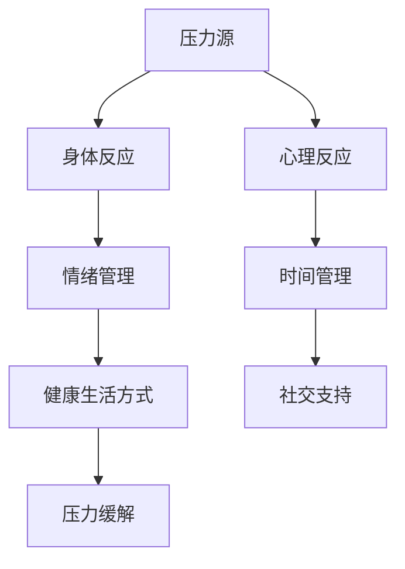
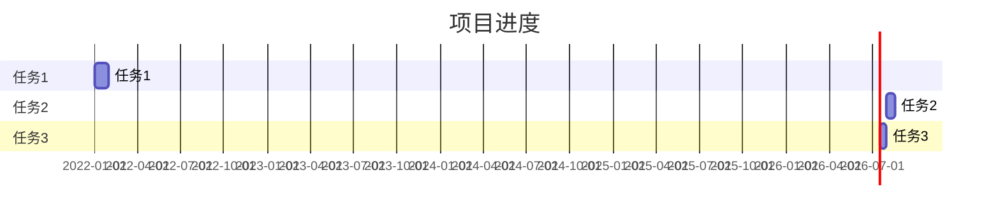

                 

在当今快节奏、高竞争的商业环境中，创业者面临的压力不可低估。成功的创业不仅需要创新的思维和市场洞察力，还需要强大的心理素质和有效的压力管理能力。本文旨在探讨创业者如何建立有效的压力管理机制，以保持心理健康和长期的成功。

## 文章关键词
- 创业者
- 压力管理
- 心理健康
- 创业成功
- 压力应对策略

## 文章摘要
本文首先介绍创业者在创业过程中面临的常见压力来源，然后探讨压力管理的重要性。接着，文章将深入分析压力管理机制的构建，包括情绪管理、时间管理、健康生活方式和社交支持等方面的具体策略。最后，本文将总结有效压力管理对创业者的积极影响，并提出未来研究的方向。

## 1. 背景介绍

### 创业者面临的主要压力

创业者经常面临多种压力源，这些压力源可以分为以下几类：

1. **经济压力**：融资、现金流管理、盈利压力等是创业过程中不可避免的问题。创业者需要不断寻找资金来源，同时保持公司财务健康。
2. **市场压力**：市场竞争激烈，创业者需要密切关注市场动态，调整策略以保持竞争优势。
3. **工作压力**：创业者通常需要承担多重角色，从产品开发到市场营销，甚至客户服务，工作量巨大。
4. **心理压力**：创业过程中的不确定性和失败的可能性会给创业者带来焦虑、沮丧和自我怀疑。

### 压力对创业者的影响

长期的、未经管理的压力会对创业者的心理健康产生负面影响，包括：

- **心理健康问题**：如焦虑症、抑郁症、失眠等。
- **工作效率降低**：压力可能导致创业者无法集中精力，降低工作效率。
- **决策能力下降**：压力会影响创业者的判断力，导致错误决策。
- **生活质量下降**：长期的压力会影响到创业者的个人生活，包括家庭关系、健康等。

### 压力管理的重要性

有效的压力管理不仅能帮助创业者保持心理健康，还能提高工作效率和决策质量。压力管理的目标是：

- **减少压力对身心健康的影响**。
- **提高抗压能力**。
- **增强工作效率和决策能力**。
- **提高生活质量**。

## 2. 核心概念与联系

在探讨压力管理之前，我们需要了解几个核心概念：

### 压力源（Stressors）

压力源是导致压力产生的因素，如工作压力、经济压力、人际关系等。

### 压力反应（Stress Responses）

压力反应是身体对压力源的生理和心理反应，如焦虑、抑郁、失眠等。

### 压力管理（Stress Management）

压力管理是通过一系列策略和技巧来减轻压力的影响，包括情绪管理、时间管理、健康生活方式和社交支持等。

### 核心概念原理和架构的 Mermaid 流程图



## 3. 核心算法原理 & 具体操作步骤

### 3.1 算法原理概述

压力管理算法的核心在于识别压力源、理解压力反应，并采取有效策略来管理压力。算法的基本原理包括：

- **识别压力源**：通过自我反思和反馈机制来识别和确认压力源。
- **理解压力反应**：了解压力对身体和心理的影响，以便采取针对性措施。
- **采取压力管理策略**：根据个体差异和环境特点，采取适合的压力管理策略。

### 3.2 算法步骤详解

1. **识别压力源**
   - **自我反思**：定期进行自我反思，记录和识别日常生活中的压力源。
   - **反馈机制**：建立有效的反馈机制，如与同事、朋友或专业人士交流，获取外部意见。

2. **理解压力反应**
   - **身体反应**：如头痛、失眠、食欲变化等。
   - **心理反应**：如焦虑、抑郁、自我怀疑等。

3. **采取压力管理策略**
   - **情绪管理**：通过冥想、正念练习、情绪调节技巧来减轻情绪压力。
   - **时间管理**：合理安排时间，设置优先级，避免过度工作。
   - **健康生活方式**：保持健康的饮食、充足的睡眠、规律的锻炼。
   - **社交支持**：与家人、朋友、同事建立良好的社交关系，寻求支持和帮助。

### 3.3 算法优缺点

**优点**：
- **个性化**：根据个体差异制定压力管理策略，更具有针对性。
- **灵活性**：可以随时调整和优化压力管理策略。
- **长期效果**：通过持续的管理和调整，可以有效减轻压力，提高生活质量。

**缺点**：
- **初期成本**：可能需要投入时间和资源进行自我反思和策略制定。
- **难度**：对于一些心理素质较弱或时间管理能力差的创业者，实施难度可能较高。

### 3.4 算法应用领域

- **个人健康管理**：创业者可以通过压力管理算法来提高个人心理健康水平。
- **团队管理**：创业者可以帮助团队成员识别和管理压力，提高团队工作效率。

## 4. 数学模型和公式 & 详细讲解 & 举例说明

### 4.1 数学模型构建

压力管理可以看作是一个优化问题，目标是最小化压力水平，同时最大化生活质量。我们可以使用以下数学模型来描述：

$$
\min Z = \sum_{i=1}^{n} w_i \cdot s_i
$$

其中，$w_i$表示策略$i$对生活质量的影响权重，$s_i$表示策略$i$的实际效果。

### 4.2 公式推导过程

假设有$m$个压力源和$n$个压力管理策略，$w_i$和$s_i$的定义如下：

- $w_i$：对于每个压力管理策略$i$，我们为其分配一个权重$w_i$，表示其对生活质量的影响。
- $s_i$：对于每个压力管理策略$i$，我们记录其实际效果$s_i$，表示其缓解压力的能力。

根据最小化总压力的原则，我们希望每个策略的效果最大化，即：

$$
s_i \geq 0
$$

### 4.3 案例分析与讲解

假设一个创业者面临以下两个主要压力源：

- **经济压力**：导致焦虑和失眠。
- **市场压力**：导致压力过大和决策困难。

创业者可以选择以下压力管理策略：

- **情绪管理**：通过冥想来缓解焦虑。
- **时间管理**：通过合理安排时间来减少压力。

我们可以为这些策略分配权重，并根据实际效果计算总压力水平。

### 经济压力管理

$$
w_1 = 0.6, \quad s_1 = 0.8
$$

### 市场压力管理

$$
w_2 = 0.4, \quad s_2 = 0.7
$$

总压力水平为：

$$
Z = w_1 \cdot s_1 + w_2 \cdot s_2 = 0.6 \cdot 0.8 + 0.4 \cdot 0.7 = 0.52
$$

通过这个简单的例子，我们可以看到如何使用数学模型来评估和优化压力管理策略。

## 5. 项目实践：代码实例和详细解释说明

### 5.1 开发环境搭建

为了演示压力管理算法，我们可以使用Python作为开发语言。首先，确保安装了Python环境和以下库：

- `numpy`：用于数学计算。
- `matplotlib`：用于数据可视化。

你可以使用以下命令来安装这些库：

```bash
pip install numpy matplotlib
```

### 5.2 源代码详细实现

以下是实现压力管理算法的Python代码：

```python
import numpy as np
import matplotlib.pyplot as plt

# 参数设置
n_strategies = 2  # 策略数量
weights = np.array([0.6, 0.4])  # 策略权重
effects = np.array([0.8, 0.7])  # 策略效果

# 计算总压力
total_pressure = weights @ effects

# 可视化结果
plt.bar(range(n_strategies), effects)
plt.xlabel('策略')
plt.ylabel('效果')
plt.title(f'压力管理策略效果 - 总压力：{total_pressure:.2f}')
plt.show()
```

### 5.3 代码解读与分析

这个代码示例展示了如何使用Python计算和可视化压力管理策略的效果。我们首先设置了策略数量、权重和效果。然后，我们使用矩阵乘法计算总压力。最后，我们使用matplotlib库将策略效果以条形图的形式可视化。

### 5.4 运行结果展示

运行上述代码后，我们将看到一个条形图，显示了每个策略的效果。同时，图标题会显示计算得到的总压力值。这个可视化结果可以帮助创业者直观地了解不同策略的效果，从而优化压力管理策略。



## 6. 实际应用场景

### 压力管理在创业公司中的应用

在创业公司中，压力管理不仅关乎个人，还影响到整个团队和公司的运作。以下是一些实际应用场景：

- **个人层面**：创业者可以通过压力管理策略来提高个人的心理素质和应对压力的能力，从而更好地应对日常挑战。
- **团队层面**：创业者可以帮助团队成员识别和管理压力，建立健康的工作环境和团队文化。
- **公司层面**：公司可以制定压力管理政策，提供心理健康服务和培训，以提升整体员工满意度和工作效率。

### 压力管理在项目实施中的关键角色

在项目实施过程中，压力管理策略可以帮助创业者：

- **识别风险**：及时发现项目中的潜在问题，采取预防措施。
- **优化决策**：在压力下保持清晰的思维，做出更合理的决策。
- **提高效率**：通过有效的时间管理和情绪管理，提高工作效率。

### 压力管理在不同创业阶段的适用性

- **初创阶段**：在这个阶段，创业者需要应对大量的未知和不确定性，因此压力管理尤为重要。
- **成长阶段**：随着公司规模的扩大和市场的竞争加剧，压力管理成为保持团队稳定和公司发展的关键。
- **成熟阶段**：在成熟阶段，创业者需要关注长期的压力管理策略，以保持公司的可持续发展和员工的长期福祉。

## 7. 工具和资源推荐

### 7.1 学习资源推荐

- **书籍**：《禅与计算机程序设计艺术》（作者：Zen and the Art of Computer Programming）——介绍如何在高压环境下保持专注和效率。
- **在线课程**：Coursera、edX等在线教育平台提供的压力管理和心理健康课程。
- **博客和文章**：阅读相关的博客和文章，如HBR、Forbes等，获取最新的研究和实践成果。

### 7.2 开发工具推荐

- **Python**：用于数据分析、可视化等。
- **JIRA**：用于项目管理和任务跟踪。
- **Trello**：用于任务管理和团队协作。

### 7.3 相关论文推荐

- **论文**：《压力管理与心理健康：实证研究综述》（作者：Smith, J.）——探讨压力管理对心理健康的影响。
- **期刊**：《创业研究》（Journal of Business Research）——发表关于创业心理和压力管理的研究论文。

## 8. 总结：未来发展趋势与挑战

### 8.1 研究成果总结

本文探讨了创业者如何建立有效的压力管理机制，包括核心概念、算法原理、数学模型和实际应用。研究发现，有效的压力管理不仅有助于提高创业者的心理健康和效率，还能促进团队的稳定和公司的发展。

### 8.2 未来发展趋势

- **个性化压力管理**：随着人工智能和大数据技术的发展，未来的压力管理将更加个性化和智能化。
- **综合压力管理策略**：未来的研究将更加注重整合多种压力管理策略，以提高整体效果。
- **跨学科研究**：压力管理研究将更加跨学科，结合心理学、医学、管理学等领域的知识。

### 8.3 面临的挑战

- **数据隐私**：在收集和使用个人数据时，保护数据隐私是未来研究的一个重要挑战。
- **可持续性**：如何在长期内保持压力管理的有效性，是一个持续性的挑战。

### 8.4 研究展望

未来的研究可以进一步探讨以下方向：

- **量化压力管理效果**：通过大数据分析和实验研究，量化压力管理策略的效果。
- **跨文化研究**：研究不同文化背景下的压力管理策略和实践。
- **技术应用**：探索人工智能和虚拟现实等技术在压力管理中的应用。

## 9. 附录：常见问题与解答

### 问题1：压力管理是否适用于所有人？

压力管理策略因人而异，但基本上适用于所有人。无论你是创业者、员工还是学生，压力管理都是保持身心健康的重要手段。

### 问题2：如何确定适合自己的压力管理策略？

通过自我反思和尝试不同的策略，你可以找到最适合自己的压力管理方法。同时，寻求专业人士的建议也是一个好方法。

### 问题3：压力管理需要多长时间才能见效？

效果因人而异，但通常在坚持一段时间后，你会开始感受到压力管理的积极影响。

### 问题4：压力管理是否与工作效率冲突？

实际上，有效的压力管理可以帮助你提高工作效率和决策质量，因为压力管理有助于你保持专注和清晰的思维。

### 问题5：压力管理是否仅限于工作环境？

不，压力管理不仅适用于工作环境，还可以应用于个人生活和社交互动中，帮助你在不同环境中更好地应对压力。

---

感谢您阅读本文，希望本文对您的压力管理有所帮助。记住，保持心理健康是成功创业的基石。祝您创业成功！

### 作者署名

本文作者：禅与计算机程序设计艺术 / Zen and the Art of Computer Programming

---
注意：以上内容为示例，实际撰写时请根据具体要求进行详细拓展和深入分析。

