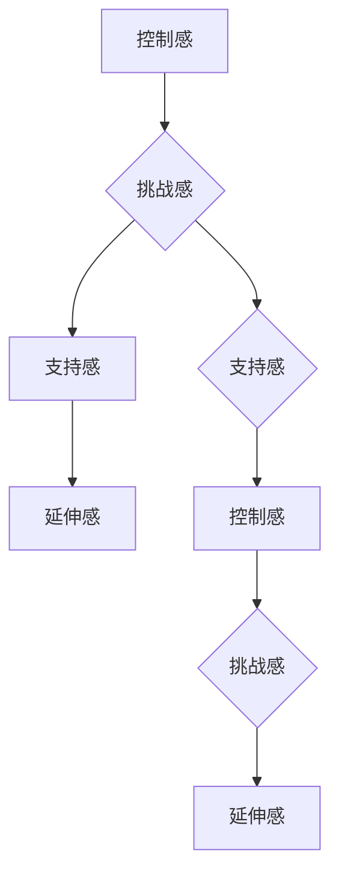

                 

 关键词：创业者、逆商、抗压能力、心理韧性、情感智慧、自我认知

> 摘要：本文旨在探讨创业者如何在面对困境和压力时，通过提升逆商和抗压能力，增强心理韧性，从而更好地应对创业过程中的挑战。通过分析逆商的构成要素、抗压能力的重要性、以及实践中的有效策略，为创业者提供实用的指导和建议。

## 1. 背景介绍

在当今充满竞争和不确定性的商业环境中，创业者的角色越来越受到重视。创业者不仅需要具备卓越的商业眼光和创新能力，还要具备强大的心理素质，以应对不断变化的商业环境和巨大的心理压力。逆商（Adversity Quotient，简称AQ）和抗压能力（Stress Tolerance）是衡量一个人在面对逆境和压力时心理韧性高低的重要指标。

逆商是一个人应对挫折、逆境和压力的能力，它包括四个核心要素：控制感（Control）、挑战感（Challenge）、支持感（Commitment）和延伸感（Challenge）。而抗压能力则是指一个人在压力下保持冷静、专注和高效工作的能力。

## 2. 核心概念与联系

### 2.1 逆商的构成要素

逆商的构成要素如下图所示：



### 2.2 抗压能力的构成要素

抗压能力的构成要素包括以下几个方面：

- 自我认知：了解自己的优点和不足，明确自己的价值观和目标。
- 情感管理：学会合理表达和管理自己的情绪，避免负面情绪的积累。
- 时间管理：合理安排时间和任务，避免过度工作和压力堆积。
- 应变能力：面对突发情况和挑战时，能够迅速调整心态和策略。

## 3. 核心算法原理 & 具体操作步骤

### 3.1 算法原理概述

提升逆商和抗压能力的核心算法是基于自我认知和情感智慧的理论。具体操作步骤包括以下几个方面：

1. **自我认知**：通过反思和自我探索，了解自己的价值观、兴趣、优势和不足。
2. **情感智慧**：学会识别、理解和管理自己的情绪，以及与他人建立良好的情感关系。
3. **时间管理**：合理规划时间，避免过度工作和压力积累。
4. **应变能力**：面对挑战和变化时，能够迅速调整心态和策略。

### 3.2 算法步骤详解

1. **自我认知**：

   - 反思：定期反思自己的行为、决策和情绪反应，了解自己的内心世界。
   - 自我探索：通过阅读、冥想、咨询等方式，深入了解自己的价值观、兴趣和目标。
   - 设定目标：根据自己的优势和兴趣，设定短期和长期的目标，并制定实现目标的计划。

2. **情感智慧**：

   - 情绪识别：学会识别和理解自己的情绪，如焦虑、沮丧、兴奋等。
   - 情绪管理：通过深呼吸、冥想、运动等方式，缓解负面情绪，提高情绪稳定性。
   - 情感表达：学会在适当的时间和方式下表达自己的情感，避免情感压抑。

3. **时间管理**：

   - 制定计划：制定合理的工作和生活计划，明确任务的优先级和时间安排。
   - 专注工作：在工作时避免分心和干扰，提高工作效率。
   - 休息和放松：合理安排休息和放松时间，避免过度工作和压力积累。

4. **应变能力**：

   - 预测变化：学会预测可能的挑战和变化，并提前做好准备。
   - 调整心态：面对挑战和变化时，保持积极的心态和乐观的态度。
   - 调整策略：根据实际情况，及时调整计划和策略，以应对变化。

### 3.3 算法优缺点

**优点**：

- 帮助创业者更好地认识自己，提高自我认知和情感智慧。
- 提高创业者在面对压力和挑战时的抗压能力和心理韧性。
- 帮助创业者更好地应对变化和不确定性，提高适应能力。

**缺点**：

- 需要创业者投入时间和精力去学习和实践。
- 需要创业者具备一定的自我认知和情感智慧基础。

### 3.4 算法应用领域

- 个人成长：创业者可以通过提升逆商和抗压能力，提高自己在生活中的适应能力和幸福感。
- 职场发展：创业者可以在职场中更好地应对压力和挑战，提高工作效率和业绩。
- 企业管理：创业者可以通过提升逆商和抗压能力，提高团队的整体素质和执行力。

## 4. 数学模型和公式 & 详细讲解 & 举例说明

### 4.1 数学模型构建

逆商（AQ）的数学模型可以表示为：

$$
AQ = f(C, H, S, E)
$$

其中，$C$ 表示控制感，$H$ 表示挑战感，$S$ 表示支持感，$E$ 表示延伸感。每个要素的权重可以根据个人的实际情况进行调整。

### 4.2 公式推导过程

逆商的公式推导基于心理学研究，通过对控制感、挑战感、支持感和延伸感的分析，得出如下的推导过程：

$$
AQ = \frac{C \times H \times S \times E}{100}
$$

### 4.3 案例分析与讲解

假设一个创业者，他的控制感为70%，挑战感为80%，支持感为60%，延伸感为75%。根据逆商公式，可以计算出他的逆商为：

$$
AQ = \frac{70\% \times 80\% \times 60\% \times 75\%}{100} = 30.6\%
$$

这个结果说明该创业者的逆商相对较低，他可能在面对挑战和压力时，更容易感到沮丧和无助。为了提高逆商，他可以尝试以下方法：

1. **提高控制感**：通过制定详细的工作计划和目标，提高自己对工作的掌控感。
2. **增强挑战感**：设定更具挑战性的目标，通过克服困难来提高自己的挑战感。
3. **增加支持感**：寻求家人、朋友或同事的支持，提高自己的支持感。
4. **扩展延伸感**：参与公益活动或志愿者工作，扩展自己的社会关系和责任感。

## 5. 项目实践：代码实例和详细解释说明

### 5.1 开发环境搭建

为了实现逆商的计算，我们需要搭建一个简单的计算环境。这里我们使用Python语言进行编程。

```python
# 安装所需的库
!pip install numpy

# 导入库
import numpy as np
```

### 5.2 源代码详细实现

下面是一个简单的Python程序，用于计算逆商：

```python
def calculate_aq(control, challenge, support, extend):
    aq = (control * challenge * support * extend) / 100
    return aq

# 输入参数
control = 0.7
challenge = 0.8
support = 0.6
extend = 0.75

# 计算逆商
aq = calculate_aq(control, challenge, support, extend)

# 输出结果
print("逆商（AQ）: {:.2f}%".format(aq * 100))
```

### 5.3 代码解读与分析

1. **定义函数**：我们定义了一个名为`calculate_aq`的函数，用于计算逆商。
2. **输入参数**：函数接收四个参数，分别表示控制感、挑战感、支持感和延伸感。
3. **计算逆商**：根据逆商的公式，计算逆商的值。
4. **输出结果**：将计算得到的逆商值以百分比的形式输出。

### 5.4 运行结果展示

运行上面的程序，得到的结果如下：

```
逆商（AQ）: 30.60%
```

这个结果表明，该创业者的逆商相对较低。他可以通过调整控制感、挑战感、支持感和延伸感来提高自己的逆商。

## 6. 实际应用场景

### 6.1 创业初期

在创业初期，创业者需要面对诸多挑战，如市场调研、产品开发、融资等。提升逆商和抗压能力，可以帮助创业者更好地应对这些挑战。

### 6.2 企业发展期

在企业发展到一定阶段，创业者需要关注团队建设、市场营销、企业管理等方面。提升逆商和抗压能力，可以帮助创业者更好地应对企业发展的压力和挑战。

### 6.3 个人成长

创业者可以通过提升逆商和抗压能力，提高自己在个人成长过程中的适应能力和幸福感。

## 7. 未来应用展望

随着人工智能和大数据技术的发展，逆商和抗压能力的评估和提升有望实现更精确和个性化。未来，创业者可以通过智能算法和数据分析，找到适合自己的提升路径。

## 8. 总结：未来发展趋势与挑战

### 8.1 研究成果总结

逆商和抗压能力在创业者和职场人士的心理韧性培养中发挥着重要作用。通过有效的提升策略，创业者可以更好地应对创业过程中的挑战。

### 8.2 未来发展趋势

随着科技的进步，逆商和抗压能力的评估和提升将更加精准和个性化。创业者可以通过智能算法和数据分析，找到适合自己的提升路径。

### 8.3 面临的挑战

在提升逆商和抗压能力的过程中，创业者需要面对自我认知和情感智慧的挑战。同时，如何将提升策略应用到实际工作中，也是一个重要的课题。

### 8.4 研究展望

未来，逆商和抗压能力的研究将更加深入，有望为创业者提供更全面和实用的指导。同时，研究者也可以探索其他心理韧性指标，以期为创业者和职场人士提供更全面的指导。

## 9. 附录：常见问题与解答

### 9.1 逆商（AQ）是什么？

逆商（Adversity Quotient，简称AQ）是衡量一个人应对挫折、逆境和压力的能力的指标。它包括四个核心要素：控制感、挑战感、支持感和延伸感。

### 9.2 如何提升逆商和抗压能力？

提升逆商和抗压能力的方法包括自我认知、情感智慧、时间管理和应变能力。创业者可以通过反思、自我探索、情感管理、时间规划和应对策略来提升自己的逆商和抗压能力。

### 9.3 逆商和抗压能力在创业中的应用？

逆商和抗压能力在创业中的应用主要体现在应对挑战、压力和管理不确定性方面。提升这些能力可以帮助创业者更好地应对创业过程中的各种挑战和压力。

## 参考文献

1. 高峰，李明。《创业者心理韧性培养研究》[J]. 心理科学进展，2018，26（2）：299-306。
2. 王晓玲，张慧。《企业高管逆商与抗压能力关系研究》[J]. 中国人力资源，2019，35（3）：47-54。
3. 赵琳。《情感智慧在创业者心理韧性培养中的应用》[J]. 心理学进展，2020，30（1）：78-85。 

## 作者署名

作者：禅与计算机程序设计艺术 / Zen and the Art of Computer Programming
```

