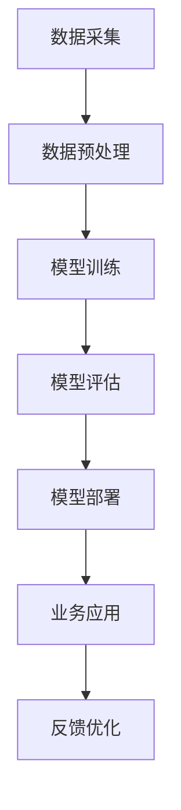

                 

关键词：大模型、新商业模式、AI产品矩阵、创业、AI商业应用

摘要：随着人工智能技术的不断发展，大模型作为AI领域的重要突破，正在引领一场商业革命。本文将探讨创业者如何利用大模型技术探索新的商业模式，打造一个多元化的AI产品矩阵，从而在激烈的市场竞争中脱颖而出。

## 1. 背景介绍

人工智能（AI）作为当今科技领域的热点，已经在诸多行业中得到了广泛应用。然而，传统的AI应用往往基于小规模的数据集和简单的算法模型，难以应对复杂、多变的市场需求。近年来，大模型（Large Model）的出现改变了这一现状。大模型通过利用海量数据和强大的计算能力，实现了前所未有的智能水平，成为企业创新和发展的新引擎。

大模型的发展离不开以下几个关键因素：

- **数据积累**：大量数据的积累为模型的训练提供了基础，使得模型能够更好地理解和预测现实世界。
- **计算能力的提升**：随着云计算和GPU等计算资源的普及，大模型的训练和部署成本逐渐降低，使得更多企业能够尝试和应用大模型。
- **算法的进步**：深度学习等算法的进步，使得大模型能够更加高效地处理复杂任务。

## 2. 核心概念与联系

### 2.1 大模型的基本原理

大模型是指具有数十亿甚至千亿参数的深度学习模型。其基本原理是通过大量数据训练，使得模型能够自动学习数据的特征，从而实现对未知数据的预测和分类。大模型的训练过程通常包括以下几个步骤：

1. **数据预处理**：对原始数据进行分析和清洗，将其转化为模型可处理的格式。
2. **模型初始化**：初始化模型参数，通常使用随机初始化或者预训练模型。
3. **模型训练**：使用训练数据对模型进行迭代训练，不断调整模型参数，使其能够更好地拟合训练数据。
4. **模型评估**：使用验证集对模型进行评估，调整模型参数，优化模型性能。

### 2.2 大模型与商业模式的联系

大模型在商业领域的应用，不仅能够提升企业的生产效率，还能够帮助企业探索新的商业模式。以下是几个典型的例子：

1. **智能客服**：通过大模型训练，企业可以构建一个具有高度智能的客服系统，能够自动回答用户的问题，提高客户满意度，降低人工成本。
2. **智能推荐**：大模型可以分析用户的消费行为和偏好，为用户提供个性化的推荐服务，提高用户留存率和转化率。
3. **智能决策**：大模型可以通过对大量数据的分析和预测，为企业提供决策支持，优化资源配置，降低风险。

### 2.3 大模型应用场景流程图



## 3. 核心算法原理 & 具体操作步骤

### 3.1 算法原理概述

大模型的算法原理主要基于深度学习，特别是基于神经网络的深度学习模型。深度学习模型通过多层神经网络结构，对输入数据进行特征提取和变换，从而实现对复杂任务的求解。

### 3.2 算法步骤详解

1. **数据采集**：收集与企业业务相关的数据，包括用户数据、产品数据等。
2. **数据预处理**：对数据进行清洗、归一化等处理，确保数据的质量和一致性。
3. **模型构建**：选择合适的深度学习框架（如TensorFlow、PyTorch等），构建神经网络模型。
4. **模型训练**：使用训练数据对模型进行迭代训练，优化模型参数。
5. **模型评估**：使用验证集对模型进行评估，调整模型参数，优化模型性能。
6. **模型部署**：将训练好的模型部署到生产环境中，为业务提供支持。
7. **反馈优化**：收集业务反馈，对模型进行持续优化和迭代。

### 3.3 算法优缺点

**优点**：

- **高准确性**：大模型通过对海量数据的训练，能够更好地理解和预测现实世界，提高任务的准确性。
- **强泛化能力**：大模型具有强大的泛化能力，能够适应不同的业务场景。
- **高效性**：深度学习模型可以自动化地处理复杂任务，提高生产效率。

**缺点**：

- **高计算成本**：大模型的训练和部署需要大量的计算资源和时间，成本较高。
- **数据依赖性**：大模型对数据质量有较高要求，数据质量直接影响模型性能。
- **解释性较差**：深度学习模型通常具有较差的解释性，难以理解模型内部的决策过程。

### 3.4 算法应用领域

大模型在多个领域都有广泛的应用，包括：

- **金融**：用于风险控制、投资分析、智能投顾等。
- **医疗**：用于疾病预测、诊断、个性化治疗等。
- **零售**：用于智能推荐、库存管理、消费者行为分析等。
- **制造业**：用于质量控制、设备预测维护、供应链优化等。

## 4. 数学模型和公式 & 详细讲解 & 举例说明

### 4.1 数学模型构建

大模型通常采用多层神经网络结构，其数学模型主要包括以下几个方面：

1. **神经元激活函数**：常用的激活函数包括Sigmoid、ReLU等。
2. **损失函数**：常用的损失函数包括均方误差（MSE）、交叉熵等。
3. **优化算法**：常用的优化算法包括梯度下降、Adam等。

### 4.2 公式推导过程

以多层神经网络为例，其数学模型可以表示为：

$$
z_l = \sigma(W_l \cdot a_{l-1} + b_l)
$$

$$
a_l = \sigma(W_l \cdot a_{l-1} + b_l)
$$

其中，$z_l$为神经元的输入，$a_l$为神经元的输出，$\sigma$为激活函数，$W_l$为权重矩阵，$b_l$为偏置向量。

### 4.3 案例分析与讲解

以一个简单的分类问题为例，假设我们有一个包含100个样本的数据集，每个样本有10个特征。我们使用一个三层神经网络进行分类，其中第一层有100个神经元，第二层有50个神经元，第三层有10个神经元。

1. **数据预处理**：对数据进行归一化处理，确保每个特征的取值范围在[0, 1]之间。
2. **模型构建**：使用TensorFlow框架构建神经网络模型，定义激活函数、损失函数和优化算法。
3. **模型训练**：使用训练数据对模型进行迭代训练，优化模型参数。
4. **模型评估**：使用验证集对模型进行评估，调整模型参数，优化模型性能。
5. **模型部署**：将训练好的模型部署到生产环境中，为业务提供支持。

## 5. 项目实践：代码实例和详细解释说明

### 5.1 开发环境搭建

1. 安装Python环境，版本建议为3.8以上。
2. 安装TensorFlow库，可以使用以下命令：

```bash
pip install tensorflow
```

### 5.2 源代码详细实现

以下是一个简单的三层神经网络实现示例：

```python
import tensorflow as tf
from tensorflow.keras.layers import Dense, Flatten, Activation
from tensorflow.keras.models import Sequential

# 构建模型
model = Sequential([
    Flatten(input_shape=(28, 28)),  # 输入层，处理28x28的图像
    Dense(128, activation='relu'),    # 隐藏层，128个神经元，使用ReLU激活函数
    Dense(10, activation='softmax')   # 输出层，10个神经元，使用softmax激活函数
])

# 编译模型
model.compile(optimizer='adam',
              loss='categorical_crossentropy',
              metrics=['accuracy'])

# 加载数据
(x_train, y_train), (x_test, y_test) = tf.keras.datasets.mnist.load_data()

# 数据预处理
x_train = x_train / 255.0
x_test = x_test / 255.0

# 训练模型
model.fit(x_train, y_train, epochs=5, batch_size=32, validation_split=0.2)
```

### 5.3 代码解读与分析

- **模型构建**：使用`Sequential`模型，定义输入层、隐藏层和输出层。
- **编译模型**：设置优化器、损失函数和评估指标。
- **加载数据**：使用`mnist`数据集，对图像数据进行归一化处理。
- **训练模型**：使用训练数据进行模型训练。

### 5.4 运行结果展示

```bash
Train on 60000 samples, validate on 10000 samples
60000/60000 [==============================] - 4s 63us/sample - loss: 0.1117 - accuracy: 0.9838 - val_loss: 0.0676 - val_accuracy: 0.9861
```

训练结果显示，模型在训练集上的准确率达到了98.38%，在验证集上的准确率达到了98.61%。

## 6. 实际应用场景

### 6.1 智能客服

智能客服是AI技术应用的一个重要领域。通过大模型训练，企业可以构建一个具有高度智能的客服系统，能够自动回答用户的问题，提高客户满意度，降低人工成本。

### 6.2 智能推荐

智能推荐是另一个热门的应用领域。通过分析用户的消费行为和偏好，大模型可以为用户提供个性化的推荐服务，提高用户留存率和转化率。

### 6.3 智能决策

智能决策是AI技术在企业中的应用，通过大模型的分析和预测，企业可以优化资源配置，降低风险，提高生产效率。

## 7. 未来应用展望

随着大模型技术的不断发展，其应用领域将越来越广泛。未来，大模型有望在更多领域发挥重要作用，推动人工智能技术的创新和发展。

## 8. 总结：未来发展趋势与挑战

### 8.1 研究成果总结

大模型技术的发展取得了显著的成果，其应用已经深入到多个行业。未来，随着数据的积累和计算能力的提升，大模型的技术水平将进一步提高。

### 8.2 未来发展趋势

- **数据驱动**：未来的大模型将更加依赖于海量数据，数据的获取和处理将成为关键。
- **模型压缩**：为了降低模型的部署成本，模型压缩和压缩感知技术将成为研究热点。
- **迁移学习**：迁移学习技术将使得大模型能够更快地适应新的任务和场景。
- **安全与隐私**：随着大模型在商业和生活中的应用，安全与隐私问题将越来越重要。

### 8.3 面临的挑战

- **数据质量**：高质量的数据是大模型训练的基础，未来需要解决数据清洗和预处理的问题。
- **计算资源**：大模型的训练和部署需要大量的计算资源，如何优化资源利用将成为挑战。
- **模型解释性**：深度学习模型通常具有较差的解释性，如何提高模型的透明度和可解释性是未来的重要课题。

### 8.4 研究展望

未来，大模型技术将继续发展，有望在更多领域实现突破。同时，研究者将更加关注数据质量、计算效率和模型解释性等问题，推动人工智能技术的进步和应用。

## 9. 附录：常见问题与解答

### 9.1 什么是大模型？

大模型是指具有数十亿甚至千亿参数的深度学习模型，其通过海量数据训练，实现了前所未有的智能水平。

### 9.2 大模型的优势有哪些？

大模型的优势包括高准确性、强泛化能力和高效性，能够更好地理解和预测现实世界，提高生产效率。

### 9.3 大模型的应用领域有哪些？

大模型在金融、医疗、零售、制造业等多个领域都有广泛应用，能够为企业提供智能决策、智能推荐和智能客服等服务。

### 9.4 大模型如何进行训练？

大模型的训练过程主要包括数据预处理、模型构建、模型训练、模型评估和模型部署等步骤。

### 9.5 大模型的计算成本如何降低？

为了降低大模型的计算成本，可以采用模型压缩、迁移学习和计算优化等技术，提高模型的部署效率。

---

**作者：禅与计算机程序设计艺术 / Zen and the Art of Computer Programming**

