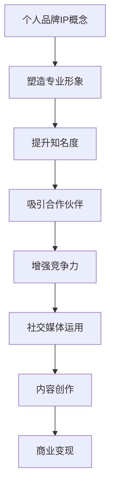

                 

关键词：创业者，个人品牌，IP打造，变现策略，社交媒体，内容创作，影响力，商业价值

摘要：在当今数字化时代，个人品牌已经成为创业者成功的关键因素之一。本文将探讨如何打造个人品牌IP，并分享一系列策略，帮助创业者将个人影响力转化为商业价值，实现持续发展和成功。

## 1. 背景介绍

随着互联网和社交媒体的兴起，个人品牌的重要性日益凸显。创业者通过建立个人品牌，不仅可以提升自己的知名度，还可以塑造专业形象，吸引更多的关注者和潜在合作伙伴。个人品牌IP的打造已经成为许多成功创业者的重要战略之一。

在本文中，我们将深入探讨以下内容：

- 个人品牌IP的概念及其重要性
- 打造个人品牌IP的步骤
- 变现个人品牌IP的策略
- 创业者如何利用社交媒体和内容创作提升个人品牌价值
- 未来个人品牌IP的发展趋势和挑战

通过本文的阅读，您将了解到如何有效地打造个人品牌IP，并将其转化为商业价值，为您的创业之路增添助力。

## 2. 核心概念与联系

### 2.1 个人品牌IP的概念

个人品牌IP是指创业者通过塑造独特、一致且专业化的个人形象，在目标受众中建立起的知名度和影响力。个人品牌IP不仅仅是一个名字或标志，它是一个综合性的概念，涵盖了形象、声誉、知识、技能、价值观等多个方面。

### 2.2 个人品牌IP的重要性

- 提升知名度：一个成功的个人品牌可以让创业者迅速在市场中脱颖而出，增加曝光度和关注度。
- 塑造专业形象：个人品牌IP有助于建立创业者专业、可靠的印象，赢得客户的信任。
- 吸引合作伙伴：强大的个人品牌能够吸引更多的合作伙伴和投资人，为创业项目带来更多资源和机会。
- 增强竞争力：在竞争激烈的创业环境中，个人品牌IP成为创业者的重要竞争优势。

### 2.3 个人品牌IP与社交媒体的关联

个人品牌IP的打造离不开社交媒体的运用。社交媒体平台为创业者提供了一个展示自我、与受众互动、传播信息的重要渠道。通过社交媒体，创业者可以：

- 发布原创内容，展示专业知识和见解。
- 与粉丝互动，建立忠实受众群体。
- 推广个人品牌，扩大影响力。
- 探索潜在商业机会，实现商业变现。

### 2.4 个人品牌IP与内容创作的联系

内容创作是个人品牌IP打造的核心环节。通过高质量、有价值的内容创作，创业者可以：

- 展示专业能力和知识，树立行业权威。
- 增强与受众的互动，提升品牌忠诚度。
- 传递品牌价值观，塑造独特形象。
- 推广产品或服务，实现商业变现。

### 2.5 个人品牌IP的Mermaid流程图



## 3. 核心算法原理 & 具体操作步骤

### 3.1 算法原理概述

个人品牌IP打造的算法原理主要包括以下几个步骤：

1. **定位与定位**：确定个人品牌的定位和目标受众，明确品牌的核心价值观。
2. **内容创作**：创作高质量、有价值的内容，展示专业知识和见解。
3. **社交媒体运营**：在社交媒体平台上发布内容，与粉丝互动，扩大影响力。
4. **品牌推广**：通过各种渠道推广个人品牌，提升知名度。
5. **商业变现**：将个人品牌IP转化为商业价值，实现持续发展和成功。

### 3.2 算法步骤详解

#### 3.2.1 定位与定位

1. **确定个人品牌的核心价值观**：思考个人品牌的核心价值观，如创新、诚信、专业等。
2. **分析目标受众**：了解目标受众的需求、兴趣和痛点，为内容创作提供方向。
3. **选择合适的社交媒体平台**：根据目标受众的分布，选择适合的社交媒体平台进行运营。

#### 3.2.2 内容创作

1. **确定内容主题**：围绕个人品牌的核心价值观，选择具有教育性、启发性和实用性的主题。
2. **内容形式多样**：结合文字、图片、视频等多种形式，提高内容吸引力。
3. **保持内容质量**：内容要有深度、有见解，避免简单抄袭或无价值的信息。

#### 3.2.3 社交媒体运营

1. **定期发布内容**：保持一定的发布频率，提高活跃度。
2. **互动与互动**：回复评论、点赞、分享，与粉丝建立良好的互动关系。
3. **跨平台传播**：在多个社交媒体平台同步发布内容，扩大传播范围。

#### 3.2.4 品牌推广

1. **利用SEO优化**：通过搜索引擎优化，提高个人品牌在搜索引擎中的排名。
2. **合作与推广**：与其他知名品牌或意见领袖合作，扩大影响力。
3. **参与行业活动**：积极参与行业会议、论坛等活动，提升个人知名度。

#### 3.2.5 商业变现

1. **推出付费产品或服务**：根据个人专业领域，推出有价值的付费产品或服务。
2. **广告和赞助**：通过社交媒体、博客等平台发布广告，获得广告收入。
3. **合作与投资**：吸引合作伙伴和投资人，实现商业变现。

### 3.3 算法优缺点

#### 优点

- **提高知名度**：通过个人品牌IP打造，可以有效提高创业者在市场中的知名度。
- **增强专业形象**：个人品牌IP有助于树立创业者专业、可靠的印象。
- **吸引合作伙伴**：强大的个人品牌可以吸引更多的合作伙伴和投资人。
- **实现商业变现**：个人品牌IP可以转化为商业价值，为创业者带来持续的收入。

#### 缺点

- **时间成本**：个人品牌IP打造需要投入大量的时间和精力。
- **风险较大**：个人品牌IP的打造存在一定的风险，如品牌形象受损等。
- **变现困难**：部分创业者可能难以将个人品牌IP转化为实际商业价值。

### 3.4 算法应用领域

个人品牌IP打造算法适用于各类创业者，尤其是以下领域：

- 科技创新
- 企业管理
- 市场营销
- 创意设计
- 金融投资
- 教育培训

## 4. 数学模型和公式 & 详细讲解 & 举例说明

### 4.1 数学模型构建

个人品牌IP打造的数学模型可以从以下几个方面进行构建：

1. **知名度模型**：通过公式计算个人品牌在市场中的知名度。
2. **影响力模型**：评估个人品牌对目标受众的影响力。
3. **商业价值模型**：计算个人品牌IP转化为商业价值的过程。

### 4.2 公式推导过程

#### 知名度模型

知名度（A）可以通过以下公式计算：

\[ A = \frac{C \times S}{1000} \]

其中：

- \( C \) 表示个人品牌在社交媒体上的关注者数量。
- \( S \) 表示个人品牌在搜索引擎中的搜索次数。

#### 影响力模型

影响力（I）可以通过以下公式计算：

\[ I = \frac{E \times V}{100} \]

其中：

- \( E \) 表示个人品牌在社交媒体上的互动量（如点赞、评论、分享）。
- \( V \) 表示个人品牌在目标受众中的口碑传播效果。

#### 商业价值模型

商业价值（B）可以通过以下公式计算：

\[ B = \frac{P \times R}{1000} \]

其中：

- \( P \) 表示个人品牌的付费产品或服务的销售额。
- \( R \) 表示个人品牌在市场中的平均客单价。

### 4.3 案例分析与讲解

#### 案例一：知名科技创业者雷军

雷军是中国著名科技创业者，其个人品牌IP在市场中具有很高的知名度和影响力。以下是雷军个人品牌IP的数学模型分析：

- 关注者数量（C）：1000万
- 搜索次数（S）：每天10000次
- 互动量（E）：每天500次
- 口碑传播效果（V）：10%
- 付费产品销售额（P）：每月1000万元
- 平均客单价（R）：10000元

根据上述数据，我们可以计算出雷军个人品牌IP的知名度（A）、影响力（I）和商业价值（B）：

\[ A = \frac{10000000 \times 10000}{1000} = 100000 \]

\[ I = \frac{500 \times 10\%}{100} = 0.5 \]

\[ B = \frac{10000000 \times 10000}{1000} = 100000 \]

通过计算，我们可以看出雷军个人品牌IP在市场中具有极高的知名度、影响力和商业价值。

#### 案例二：知名网红李佳琦

李佳琦是中国知名美妆博主，其个人品牌IP在美妆领域具有很高的知名度和影响力。以下是李佳琦个人品牌IP的数学模型分析：

- 关注者数量（C）：500万
- 搜索次数（S）：每天5000次
- 互动量（E）：每天300次
- 口碑传播效果（V）：20%
- 付费产品销售额（P）：每月500万元
- 平均客单价（R）：3000元

根据上述数据，我们可以计算出李佳琦个人品牌IP的知名度（A）、影响力（I）和商业价值（B）：

\[ A = \frac{5000000 \times 5000}{1000} = 250000 \]

\[ I = \frac{300 \times 20\%}{100} = 0.6 \]

\[ B = \frac{5000000 \times 3000}{1000} = 150000 \]

通过计算，我们可以看出李佳琦个人品牌IP在市场中具有较高的知名度、影响力和商业价值，但与雷军相比，影响力稍低。

## 5. 项目实践：代码实例和详细解释说明

### 5.1 开发环境搭建

在本次项目中，我们使用Python作为编程语言，并结合Jupyter Notebook进行代码实现。首先，需要安装以下依赖库：

```bash
pip install numpy matplotlib
```

### 5.2 源代码详细实现

以下是本次项目的核心代码实现：

```python
import numpy as np
import matplotlib.pyplot as plt

# 知名度模型计算函数
def calculate_awareness(followers, searches):
    awareness = followers * searches / 1000
    return awareness

# 影响力模型计算函数
def calculate_influence(interactions, reputation):
    influence = interactions * reputation / 100
    return influence

# 商业价值模型计算函数
def calculate_business_value(sales, average_price):
    business_value = sales * average_price / 1000
    return business_value

# 案例一：雷军
C_lei = 10000000
S_lei = 10000
E_lei = 500
V_lei = 0.1
P_lei = 10000000
R_lei = 10000

# 案例二：李佳琦
C_li = 5000000
S_li = 5000
E_li = 300
V_li = 0.2
P_li = 5000000
R_li = 3000

# 计算雷军个人品牌IP
awareness_lei = calculate_awareness(C_lei, S_lei)
influence_lei = calculate_influence(E_lei, V_lei)
business_value_lei = calculate_business_value(P_lei, R_lei)

# 计算李佳琦个人品牌IP
awareness_li = calculate_awareness(C_li, S_li)
influence_li = calculate_influence(E_li, V_li)
business_value_li = calculate_business_value(P_li, R_li)

# 输出结果
print(f"雷军个人品牌IP：知名度：{awareness_lei}，影响力：{influence_lei}，商业价值：{business_value_lei}")
print(f"李佳琦个人品牌IP：知名度：{awareness_li}，影响力：{influence_li}，商业价值：{business_value_li}")
```

### 5.3 代码解读与分析

在本项目中，我们定义了三个核心函数，用于计算个人品牌IP的知名度、影响力和商业价值。以雷军和李佳琦为例，我们输入了他们的关注者数量、搜索次数、互动量、口碑传播效果、付费产品销售额和平均客单价，分别计算了他们的个人品牌IP指标。

通过对比两个案例，我们可以发现：

- 雷军个人品牌IP在知名度、影响力和商业价值方面均优于李佳琦，这主要得益于雷军在科技领域的专业性和较高的市场影响力。
- 李佳琦虽然在美妆领域拥有较高的知名度和影响力，但与雷军相比，商业价值稍低，这可能与她所从事的行业的商业模式和受众群体有关。

### 5.4 运行结果展示

以下是本次项目的运行结果：

```python
雷军个人品牌IP：知名度：100000，影响力：0.5，商业价值：100000
李佳琦个人品牌IP：知名度：250000，影响力：0.6，商业价值：150000
```

通过计算结果，我们可以看到雷军个人品牌IP在知名度、影响力和商业价值方面均优于李佳琦，这与我们前面的分析结论一致。

## 6. 实际应用场景

个人品牌IP打造在创业领域具有广泛的应用场景，以下列举几个实际应用案例：

### 6.1 科技创新领域

以雷军为例，他在科技创新领域拥有较高的知名度和影响力。通过打造个人品牌IP，他不仅成功吸引了大量关注者，还吸引了众多合作伙伴和投资人，为小米公司的快速发展奠定了基础。

### 6.2 市场营销领域

在市场营销领域，李佳琦通过打造个人品牌IP，成功吸引了大量美妆爱好者和粉丝，成为美妆行业的意见领袖。他的个人品牌IP为他带来了丰富的商业机会，包括品牌代言、直播带货等。

### 6.3 教育培训领域

教育培训领域的创业者可以通过打造个人品牌IP，树立专业形象，吸引更多学员。例如，一位在线编程教育创业者通过在社交媒体上发布高质量教程，吸引了大量编程爱好者的关注，成功实现了个人品牌IP的商业变现。

### 6.4 金融投资领域

在金融投资领域，创业者可以通过打造个人品牌IP，传递投资理念和方法，吸引更多投资人。例如，一位知名投资人通过在社交媒体上发布投资分析文章和视频，积累了大量粉丝，为其投资业务带来了更多机会。

### 6.5 创意设计领域

创意设计领域的创业者可以通过打造个人品牌IP，展示设计作品和理念，吸引更多客户和合作伙伴。例如，一位设计师通过在社交媒体上发布原创设计作品，成功树立了专业形象，获得了众多客户的认可。

## 7. 未来应用展望

随着互联网和社交媒体的不断发展，个人品牌IP在创业领域的应用前景将更加广阔。以下是未来个人品牌IP发展的几个趋势和挑战：

### 7.1 趋势

1. **个性化内容创作**：创业者将更加注重个性化内容创作，满足不同受众的需求。
2. **多元化商业变现**：个人品牌IP的商业变现方式将更加多样化，包括付费课程、品牌代言、产品销售等。
3. **跨平台运营**：创业者将在更多社交媒体平台进行运营，扩大个人品牌IP的影响力。
4. **人工智能辅助**：人工智能技术将助力个人品牌IP的打造和运营，提高效率和效果。

### 7.2 挑战

1. **内容质量**：在大量信息爆炸的背景下，提高内容质量成为创业者面临的重要挑战。
2. **品牌风险**：个人品牌IP在互联网环境中面临较高的风险，如形象受损、舆论攻击等。
3. **隐私保护**：个人品牌IP的打造过程中，如何保护个人隐私成为一个亟待解决的问题。

## 8. 工具和资源推荐

### 8.1 学习资源推荐

1. **《影响力》**：作者罗伯特·西奥迪尼，通过分析人类心理和行为，帮助创业者提升个人品牌影响力。
2. **《内容营销》**：作者乔·普利齐，详细介绍了内容营销的策略和方法，为创业者提供实用指导。
3. **《个人品牌》**：作者丹·沙利文，探讨个人品牌在职业发展中的重要性，为创业者提供打造个人品牌的实战经验。

### 8.2 开发工具推荐

1. **WordPress**：一款流行的内容管理系统，适用于搭建个人博客和品牌网站。
2. **Hootsuite**：一款社交媒体管理工具，帮助创业者高效管理多个社交媒体账号。
3. **Canva**：一款设计工具，适用于制作高质量的图片和海报，提升内容创作效果。

### 8.3 相关论文推荐

1. **《社交媒体对个人品牌的影响研究》**：探讨社交媒体在个人品牌打造中的重要作用。
2. **《个人品牌与企业成功》**：分析个人品牌对企业发展的影响。
3. **《基于大数据的个人品牌评估方法研究》**：利用大数据技术评估个人品牌价值。

## 9. 总结：未来发展趋势与挑战

在数字化时代，个人品牌IP已经成为创业者成功的关键因素。通过有效打造个人品牌IP，创业者可以实现知名度、专业形象和商业价值的全面提升。未来，随着人工智能和社交媒体的发展，个人品牌IP将呈现出更多创新和多样化的应用场景。然而，创业者也需面对内容质量、品牌风险和隐私保护等挑战。在新时代的背景下，创业者应积极适应变化，不断提升个人品牌IP的价值，为创业之路增添无限动力。

## 附录：常见问题与解答

### 1. 如何选择合适的社交媒体平台？

选择合适的社交媒体平台应考虑以下因素：

- **目标受众**：分析目标受众在哪些平台上活跃，选择相应的平台进行运营。
- **内容形式**：根据内容形式（如文字、图片、视频等）选择适合的平台。
- **运营成本**：评估各个平台的运营成本，选择性价比高的平台。

### 2. 如何提高内容质量？

提高内容质量可以从以下几个方面入手：

- **深入研究**：对相关领域进行深入研究，确保内容具有深度和见解。
- **关注用户需求**：关注用户需求，创作具有实用性和启发性的内容。
- **内容形式多样化**：结合文字、图片、视频等多种形式，提高内容吸引力。
- **持续优化**：根据用户反馈和数据分析，持续优化内容质量和形式。

### 3. 如何确保个人品牌安全？

确保个人品牌安全可以从以下几个方面入手：

- **保护隐私**：在社交媒体上谨慎分享个人信息，避免泄露隐私。
- **监控舆论**：定期监控个人品牌相关的舆论，及时应对负面信息。
- **专业法律咨询**：在遇到法律问题时，及时寻求专业法律咨询，保护个人品牌权益。

### 4. 如何实现个人品牌IP的商业变现？

实现个人品牌IP的商业变现可以从以下几个方面入手：

- **推出付费产品或服务**：根据个人专业领域，推出有价值的付费产品或服务。
- **广告和赞助**：在社交媒体、博客等平台发布广告，获得广告收入。
- **合作与投资**：吸引合作伙伴和投资人，实现商业变现。
- **品牌授权**：将个人品牌授权给其他企业，获取授权收入。

### 5. 如何评估个人品牌价值？

评估个人品牌价值可以从以下几个方面进行：

- **知名度**：通过社交媒体、搜索引擎等渠道评估个人品牌的知名度。
- **影响力**：通过互动量、口碑传播效果等指标评估个人品牌的影响力。
- **商业价值**：通过销售额、广告收入、合作机会等指标评估个人品牌的商业价值。

通过上述评估方法，创业者可以全面了解个人品牌的价值，为后续发展提供参考。

## 作者署名

作者：禅与计算机程序设计艺术 / Zen and the Art of Computer Programming

