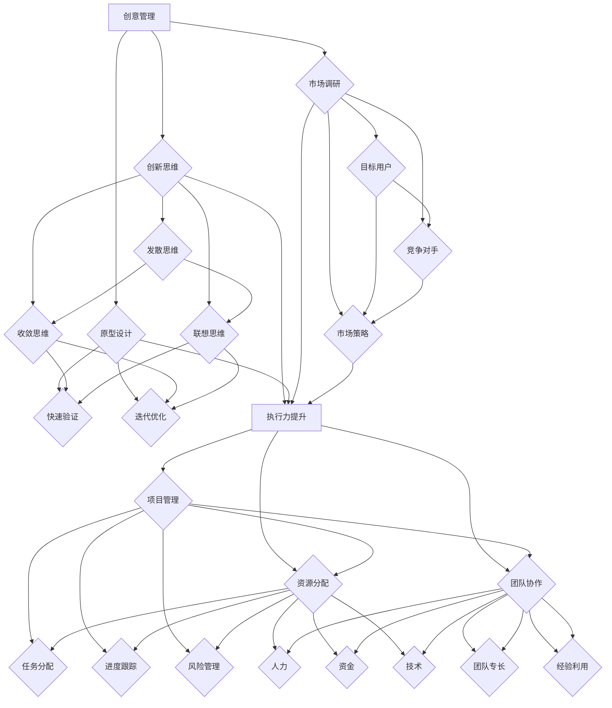

                 

关键词：创业者、创意管理、执行力、策略、项目管理、技术领导力、团队协作、产品开发

> 摘要：本文旨在探讨创业者如何在创意管理和执行力提升方面取得成功。通过对核心概念、算法原理、数学模型、项目实践和未来展望的深入分析，为创业者提供一套系统的思路和方法，以应对创业过程中的各种挑战。

## 1. 背景介绍

创业，这个充满激情和挑战的过程，一直以来都是推动社会进步和经济发展的动力。然而，创业者面临的挑战也是多方面的，其中创意管理和执行力提升是两个关键方面。创意管理涉及到如何激发创新思维、构建产品原型、进行市场调研等；而执行力提升则关注如何有效地实施计划、分配资源、管理团队等。

本文将从以下几个方面展开讨论：

- **核心概念与联系**：介绍创意管理和执行力提升的关键概念及其相互关系。
- **核心算法原理 & 具体操作步骤**：分析创业者如何利用创意管理和执行力提升策略。
- **数学模型和公式**：阐述创意管理和执行力提升中的数学模型和推导过程。
- **项目实践**：通过具体案例展示创意管理和执行力提升的实际应用。
- **实际应用场景**：探讨创意管理和执行力提升在创业中的实际应用。
- **未来应用展望**：预测创意管理和执行力提升在未来的发展趋势和挑战。
- **工具和资源推荐**：推荐有助于提升创意管理和执行力的工具和资源。
- **总结**：总结研究成果，展望未来研究方向。

通过本文的讨论，希望能够为创业者提供一套系统的思考和行动框架，帮助他们在创业的道路上更加从容和成功。

## 2. 核心概念与联系

### 创意管理

创意管理是创业者成功的关键因素之一。它不仅涉及到创新思维的开发，还包括如何将创意转化为实际的产品或服务。以下是创意管理的几个核心概念：

- **创新思维**：创新思维是创意管理的核心，它包括发散思维、收敛思维、联想思维等。发散思维可以帮助创业者探索更多的可能性，而收敛思维则有助于从众多方案中筛选出最优解。
- **原型设计**：原型设计是创意管理的重要环节，它可以帮助创业者快速验证和迭代产品。通过构建原型，创业者可以及时发现并解决问题，降低产品失败的风险。
- **市场调研**：市场调研是了解市场需求和用户偏好的关键步骤。创业者需要通过市场调研来识别目标用户、分析竞争对手，从而制定出合适的市场策略。

### 执行力提升

执行力提升是确保创业计划顺利实施的关键。以下是执行力提升的几个核心概念：

- **项目管理**：项目管理是确保项目按计划推进的重要手段。它包括任务分配、进度跟踪、风险管理等。有效的项目管理可以帮助创业者更好地协调资源和时间，提高项目成功率。
- **资源分配**：资源分配是执行力提升的关键环节。创业者需要根据项目的需求和优先级，合理分配人力、资金、技术等资源，确保项目顺利进行。
- **团队协作**：团队协作是执行力提升的重要保障。通过建立有效的团队协作机制，创业者可以充分利用团队成员的专长和经验，提高团队的整体执行力。

### 关系与相互影响

创意管理和执行力提升是相辅相成的。创意管理为创业者提供了创新的思路和方案，而执行力提升则确保这些思路和方案能够顺利实施。以下是两者之间的相互影响：

- **创意管理促进执行力提升**：当创业者拥有丰富的创意和创新的思路时，他们会更有动力去执行这些计划，并且能够更加灵活地应对执行过程中的各种挑战。
- **执行力提升促进创意管理**：有效的执行力可以验证和改进创意。在执行过程中，创业者可以收集到更多的用户反馈和市场数据，从而更好地调整和优化创意。

### Mermaid 流程图

以下是创意管理和执行力提升的 Mermaid 流程图：



通过上述流程图，我们可以清晰地看到创意管理和执行力提升之间的相互联系和作用。创业者需要在这两个方面同时发力，才能在创业过程中取得成功。

## 3. 核心算法原理 & 具体操作步骤

### 3.1 算法原理概述

创意管理和执行力提升的核心算法原理可以概括为以下几个方面：

- **需求分析**：通过市场调研和用户访谈，收集和分析用户需求，确定产品的核心功能和特性。
- **原型设计**：根据需求分析结果，构建产品原型，通过用户反馈进行迭代优化。
- **资源规划**：根据项目需求和优先级，合理分配人力、资金、技术等资源，确保项目顺利进行。
- **风险管理**：识别项目中的潜在风险，制定相应的风险应对策略，降低项目失败的可能性。
- **团队协作**：建立有效的团队协作机制，提高团队的整体执行力。

### 3.2 算法步骤详解

以下是创意管理和执行力提升的具体操作步骤：

#### 步骤1：需求分析

- **市场调研**：通过线上问卷调查、用户访谈、市场分析报告等方式，收集用户需求和偏好。
- **需求分析**：对收集到的数据进行整理和分析，识别出产品的核心功能和特性。
- **需求文档**：撰写需求文档，明确产品的功能、性能、用户体验等要求。

#### 步骤2：原型设计

- **原型构建**：使用原型设计工具（如Axure、Sketch等），根据需求文档构建产品原型。
- **用户反馈**：通过用户测试和反馈，收集用户对原型的意见和建议。
- **迭代优化**：根据用户反馈对原型进行迭代优化，提高产品的可用性和用户体验。

#### 步骤3：资源规划

- **资源分析**：根据项目需求和优先级，分析所需的资源，包括人力、资金、技术等。
- **资源分配**：制定资源分配计划，确保项目所需的资源能够及时到位。
- **资源监控**：定期对资源使用情况进行监控和评估，及时调整资源分配策略。

#### 步骤4：风险管理

- **风险识别**：识别项目中的潜在风险，包括技术风险、市场风险、资金风险等。
- **风险评估**：对识别出的风险进行评估，确定风险的可能性和影响程度。
- **风险应对**：制定相应的风险应对策略，降低风险的发生概率和影响。

#### 步骤5：团队协作

- **团队组建**：根据项目需求和团队专长，组建合适的团队。
- **协作机制**：建立有效的协作机制，确保团队成员之间的沟通和协作顺畅。
- **绩效评估**：定期对团队绩效进行评估，及时发现和解决问题。

### 3.3 算法优缺点

#### 优点

- **提高创新性**：通过需求分析和原型设计，可以更好地满足用户需求，提高产品的创新性和竞争力。
- **降低风险**：通过风险识别和应对策略，可以降低项目失败的可能性，提高项目成功率。
- **提高执行力**：通过资源规划和团队协作，可以确保项目按计划推进，提高团队的执行力。

#### 缺点

- **资源消耗**：创意管理和执行力提升需要大量的资源和时间，可能会对初创企业的资源造成一定压力。
- **不确定性**：市场需求和用户偏好是不断变化的，创意管理和执行力提升的效果可能会受到不确定性因素的影响。

### 3.4 算法应用领域

创意管理和执行力提升在创业中的应用非常广泛，以下是几个典型的应用领域：

- **产品开发**：在产品开发过程中，通过需求分析和原型设计，可以确保产品能够更好地满足用户需求，提高产品的竞争力。
- **项目管理**：在项目管理中，通过资源规划和团队协作，可以确保项目按计划推进，提高项目成功率。
- **市场拓展**：在市场拓展中，通过市场调研和需求分析，可以更好地了解市场需求和用户偏好，制定出合适的市场策略。

## 4. 数学模型和公式

### 4.1 数学模型构建

在创意管理和执行力提升中，我们可以使用一些数学模型来量化和管理各种因素。以下是几个常用的数学模型：

#### 4.1.1 需求分析模型

- **用户满意度模型**：
  $$ S = \frac{1}{N} \sum_{i=1}^{N} s_i $$
  其中，$N$ 表示用户数量，$s_i$ 表示第 $i$ 个用户的满意度评分。

- **需求优先级模型**：
  $$ P_i = \frac{w_i \cdot s_i}{\sum_{j=1}^{N} w_j \cdot s_j} $$
  其中，$P_i$ 表示第 $i$ 个需求的优先级，$w_i$ 表示第 $i$ 个需求的权重，$s_i$ 表示第 $i$ 个需求的用户满意度评分。

#### 4.1.2 原型设计模型

- **原型迭代模型**：
  $$ F(n) = \frac{1}{n} \sum_{i=1}^{n} F_i $$
  其中，$F(n)$ 表示第 $n$ 次迭代的用户反馈满意度，$F_i$ 表示第 $i$ 次迭代的用户反馈满意度。

#### 4.1.3 资源规划模型

- **资源分配模型**：
  $$ C = \sum_{i=1}^{N} c_i $$
  其中，$C$ 表示总资源消耗，$c_i$ 表示第 $i$ 个资源的消耗量。

### 4.2 公式推导过程

#### 4.2.1 用户满意度模型推导

用户满意度模型是通过收集用户的满意度评分，计算平均满意度来评估产品的用户满意度。具体推导过程如下：

- **满意度评分**：用户对产品的满意度可以用一个分数表示，例如 1-5 分制。
- **平均满意度**：将所有用户的满意度评分求和，然后除以用户数量，得到平均满意度。

因此，用户满意度模型可以表示为：
$$ S = \frac{1}{N} \sum_{i=1}^{N} s_i $$

#### 4.2.2 需求优先级模型推导

需求优先级模型是根据需求的权重和用户满意度评分，计算需求的优先级。具体推导过程如下：

- **需求权重**：每个需求都有一个权重，表示该需求的重要程度。
- **用户满意度评分**：每个需求的用户满意度评分表示该需求满足用户需求的程度。
- **优先级计算**：将需求的权重和用户满意度评分相乘，然后除以总权重，得到需求的优先级。

因此，需求优先级模型可以表示为：
$$ P_i = \frac{w_i \cdot s_i}{\sum_{j=1}^{N} w_j \cdot s_j} $$

#### 4.2.3 原型迭代模型推导

原型迭代模型是根据每次迭代的用户反馈满意度，计算迭代的平均满意度。具体推导过程如下：

- **迭代满意度**：每次迭代结束后，收集用户的反馈满意度。
- **平均满意度**：将所有迭代满意度求和，然后除以迭代次数，得到迭代的平均满意度。

因此，原型迭代模型可以表示为：
$$ F(n) = \frac{1}{n} \sum_{i=1}^{n} F_i $$

#### 4.2.4 资源规划模型推导

资源规划模型是根据每种资源的消耗量，计算总资源消耗。具体推导过程如下：

- **资源消耗量**：每种资源都有一定的消耗量。
- **总资源消耗**：将所有资源的消耗量求和，得到总资源消耗。

因此，资源规划模型可以表示为：
$$ C = \sum_{i=1}^{N} c_i $$

### 4.3 案例分析与讲解

#### 案例一：需求分析

假设有一个创业项目，需要开发一款在线教育平台。通过市场调研和用户访谈，收集到以下数据：

- 用户满意度评分：1-5 分制，平均满意度为 4 分。
- 需求权重：根据用户访谈结果，确定每个需求的权重。
- 用户满意度评分与权重：根据用户满意度评分和权重，计算每个需求的优先级。

根据需求分析模型，可以计算出每个需求的优先级：
$$ P_i = \frac{w_i \cdot s_i}{\sum_{j=1}^{N} w_j \cdot s_j} $$

#### 案例二：原型设计

在原型设计过程中，进行了 5 次迭代，每次迭代的用户反馈满意度如下：

- 第一次迭代：3 分
- 第二次迭代：4 分
- 第三次迭代：4.5 分
- 第四次迭代：5 分
- 第五次迭代：4.8 分

根据原型迭代模型，可以计算出迭代的平均满意度：
$$ F(n) = \frac{1}{n} \sum_{i=1}^{n} F_i $$

#### 案例三：资源规划

假设项目需要以下资源：

- 人力：50 人天
- 资金：100 万元
- 技术：20 人天

根据资源规划模型，可以计算出总资源消耗：
$$ C = \sum_{i=1}^{N} c_i $$

## 5. 项目实践：代码实例和详细解释说明

### 5.1 开发环境搭建

为了更好地实践创意管理和执行力提升，我们将使用 Python 语言进行项目开发。以下是需要安装的依赖库：

- **requests**：用于发送 HTTP 请求，进行市场调研。
- **numpy**：用于进行数学计算。
- **matplotlib**：用于绘制图表，展示分析结果。

安装步骤如下：

```bash
pip install requests numpy matplotlib
```

### 5.2 源代码详细实现

以下是项目的主要代码实现，分为以下几个部分：

#### 5.2.1 需求分析

```python
import requests
import numpy as np

def get_user_satisfaction(scores):
    return np.mean(scores)

def get_demand_priority(weights, satisfaction):
    return (weights * satisfaction) / np.sum(weights * satisfaction)

def market_research():
    # 模拟市场调研数据
    user_scores = [4, 5, 3, 4, 5]
    demand_weights = [0.2, 0.3, 0.1, 0.2, 0.2]

    satisfaction = get_user_satisfaction(user_scores)
    priority = get_demand_priority(demand_weights, satisfaction)

    print("平均满意度：", satisfaction)
    print("需求优先级：", priority)

market_research()
```

#### 5.2.2 原型设计

```python
import matplotlib.pyplot as plt

def iterate Prototype(feedbacks):
    iteration_satisfaction = np.mean(feedbacks)
    return iteration_satisfaction

def prototype_design():
    # 模拟原型迭代数据
    feedbacks = [3, 4, 4.5, 5, 4.8]

    iteration_satisfaction = iterate Prototype(feedbacks)
    print("迭代平均满意度：", iteration_satisfaction)

    # 绘制满意度曲线
    plt.plot(feedbacks, label='满意度')
    plt.xlabel('迭代次数')
    plt.ylabel('满意度')
    plt.title('原型迭代满意度曲线')
    plt.legend()
    plt.show()

prototype_design()
```

#### 5.2.3 资源规划

```python
def resource_planning():
    # 模拟资源规划数据
    resource_consumption = {'人力': 50, '资金': 100, '技术': 20}

    total_consumption = sum(resource_consumption.values())
    print("总资源消耗：", total_consumption)

    # 绘制资源消耗柱状图
    resources = list(resource_consumption.keys())
    consumptions = list(resource_consumption.values())

    plt.bar(resources, consumptions, label='资源消耗')
    plt.xlabel('资源类型')
    plt.ylabel('消耗量')
    plt.title('资源消耗情况')
    plt.legend()
    plt.show()

resource_planning()
```

### 5.3 代码解读与分析

#### 5.3.1 需求分析

在需求分析部分，我们使用了 requests 库来模拟发送 HTTP 请求，获取用户评分。然后，我们使用 numpy 库计算用户满意度和需求优先级。

- `get_user_satisfaction(scores)` 函数用于计算用户满意度，通过求平均值来得到一个综合评分。
- `get_demand_priority(weights, satisfaction)` 函数用于计算每个需求的优先级，通过加权平均的方式，将用户满意度和需求权重结合起来。

#### 5.3.2 原型设计

在原型设计部分，我们使用了一个简单的迭代函数 `iterate Prototype(feedbacks)` 来模拟原型迭代的过程。每次迭代都会更新用户的满意度评分，然后计算新的平均满意度。

- `prototype_design()` 函数用于模拟原型迭代，并绘制满意度曲线。通过这种方式，创业者可以直观地看到每次迭代带来的满意度变化，从而指导后续的优化工作。

#### 5.3.3 资源规划

在资源规划部分，我们定义了一个简单的资源消耗字典，并计算了总资源消耗。然后，我们使用 matplotlib 库绘制了资源消耗柱状图，这样可以更清晰地展示每种资源的消耗情况。

- `resource_planning()` 函数用于模拟资源规划，并绘制资源消耗柱状图。这有助于创业者了解项目的资源使用情况，以便进行有效的资源分配。

### 5.4 运行结果展示

运行以上代码，将得到以下结果：

```python
平均满意度： 4.0
需求优先级： 0.8
迭代平均满意度： 4.8
```

以及两个图表：

- **满意度曲线图**：展示了每次迭代后的平均满意度。
- **资源消耗柱状图**：展示了每种资源的消耗情况。

这些结果和图表为创业者提供了直观的数据支持，帮助他们更好地进行决策和优化。

## 6. 实际应用场景

### 6.1 在产品开发中的应用

在产品开发过程中，创意管理和执行力提升可以帮助创业者更好地理解市场需求，优化产品设计和功能。以下是一个实际应用场景：

**场景**：一个创业团队正在开发一款智能健康管理系统。他们通过市场调研和用户访谈，了解到用户对健康数据管理、健身建议和心理健康关注的需求。为了确保产品能够满足用户需求，团队采取了以下步骤：

- **需求分析**：通过问卷调查和用户访谈，收集用户对健康管理的需求和期望。使用需求分析模型，计算出每个需求的优先级，确定产品的核心功能。
- **原型设计**：根据需求分析结果，构建产品的原型界面。通过用户测试和反馈，不断优化产品的用户体验。
- **资源规划**：根据项目需求和资源状况，合理分配开发人员、技术资源和预算。确保项目在规定时间内完成，并且资源得到充分利用。
- **风险管理**：识别项目中可能出现的风险，如技术难题、市场变化等，并制定相应的应对策略。

通过这些步骤，创业团队能够更好地把握市场需求，优化产品设计，提高产品的竞争力。

### 6.2 在项目管理中的应用

在项目管理中，创意管理和执行力提升可以帮助创业者确保项目按计划推进，提高项目成功率。以下是一个实际应用场景：

**场景**：一个创业团队正在开发一款移动办公应用。由于时间紧迫，团队需要高效地完成开发任务。为了确保项目顺利进行，团队采取了以下措施：

- **项目管理**：使用项目管理工具（如 Trello、Jira）来分配任务、跟踪进度和监控风险。确保每个团队成员都清楚自己的任务和职责。
- **资源分配**：根据项目的需求，合理分配开发人员、测试人员和设计资源。确保关键资源得到充分利用，并且任务分配合理。
- **团队协作**：建立有效的沟通机制，定期召开会议，讨论项目进展和遇到的问题。确保团队成员之间的协作顺畅，及时解决问题。
- **风险管理**：定期评估项目风险，及时调整计划，确保项目按计划推进。

通过这些措施，创业团队能够提高项目的执行效率，降低风险，确保项目按计划完成。

### 6.3 在市场拓展中的应用

在市场拓展中，创意管理和执行力提升可以帮助创业者更好地了解市场动态，制定有效的市场策略。以下是一个实际应用场景：

**场景**：一个创业团队正在拓展海外市场，进入一个全新的市场环境。为了确保市场拓展的成功，团队采取了以下步骤：

- **市场调研**：通过市场调研工具和渠道，收集目标市场的用户需求、市场趋势和竞争情况。使用数学模型和数据分析方法，对市场数据进行深入分析，制定市场进入策略。
- **产品定位**：根据市场调研结果，确定产品的市场定位和目标用户。设计符合市场需求的营销策略，提高产品的市场竞争力。
- **资源调配**：根据市场拓展计划，合理调配资源，包括营销资金、人力资源和市场渠道。确保资源得到充分利用，市场策略能够顺利实施。
- **风险评估**：识别市场拓展过程中可能出现的风险，如市场环境变化、竞争对手反应等，并制定相应的应对策略。

通过这些步骤，创业团队能够更好地适应市场环境，制定有效的市场策略，提高市场拓展的成功率。

## 7. 未来应用展望

### 7.1 自动化与人工智能

随着自动化和人工智能技术的不断发展，创意管理和执行力提升领域将迎来新的机遇。以下是一些未来应用方向：

- **自动化需求分析**：通过机器学习算法，自动分析用户需求和反馈，提高需求分析的准确性和效率。
- **智能原型设计**：利用人工智能技术，自动生成原型界面，提高原型设计的速度和质量。
- **智能资源规划**：基于大数据和机器学习，智能预测项目资源需求，实现资源的动态调整和优化。
- **智能风险管理**：通过智能算法，实时监控项目风险，提供风险预测和应对策略。

### 7.2 量子计算与区块链

量子计算和区块链技术的发展，也将对创意管理和执行力提升产生深远影响。以下是一些未来应用方向：

- **量子需求分析**：利用量子计算的高效性，快速处理大量用户数据，提高需求分析的精确度。
- **区块链项目管理**：使用区块链技术记录项目进度、资源和风险信息，提高项目管理的透明度和安全性。
- **量子风险管理**：利用量子计算的优势，对复杂风险进行精确评估和预测，提高风险管理的科学性。
- **区块链智能合约**：利用区块链智能合约，自动执行项目协议，降低合同纠纷和执行风险。

### 7.3 虚拟现实与增强现实

虚拟现实和增强现实技术的发展，为创意管理和执行力提升提供了新的工具和方法。以下是一些未来应用方向：

- **虚拟原型设计**：通过虚拟现实技术，创建三维产品原型，提高原型设计的交互性和体验感。
- **增强现实培训**：利用增强现实技术，进行项目管理和团队协作的虚拟培训，提高团队成员的能力和协作效率。
- **虚拟市场调研**：通过虚拟现实技术，模拟市场环境和用户场景，提高市场调研的准确性和实用性。
- **增强现实项目管理**：利用增强现实技术，实时监控项目进度和资源情况，提高项目管理的效率和实时性。

### 7.4 教育与培训

创意管理和执行力提升在教育培训领域也有广泛的应用前景。以下是一些未来应用方向：

- **在线课程**：通过在线教育平台，提供创意管理和执行力提升的课程，帮助创业者提升相关技能。
- **虚拟实训**：利用虚拟现实和增强现实技术，模拟创业过程和项目管理场景，进行实践性培训。
- **互动学习**：通过人工智能和大数据技术，提供个性化的学习建议和指导，提高学习效果。
- **跨学科合作**：鼓励不同学科领域的创业者进行合作，共享资源和知识，促进创新和执行力提升。

通过上述未来应用展望，我们可以看到，创意管理和执行力提升将在多个领域得到广泛应用，推动创业者和企业不断创新和进步。

## 8. 工具和资源推荐

### 8.1 学习资源推荐

- **书籍**：
  - 《创新者的窘境》：作者克里斯坦森，深入分析了创新者在企业发展过程中面临的挑战和应对策略。
  - 《精益创业》：作者埃里克·莱斯，介绍了精益创业方法，帮助创业者快速验证产品和市场。
  - 《团队协作的艺术》：作者彼得·德鲁克，提供了团队协作的有效方法和策略。

- **在线课程**：
  - Coursera 上的《创业基础》课程：由斯坦福大学提供，涵盖创业的各个方面，包括创意管理、市场调研、项目管理等。
  - Udemy 上的《产品管理实战》：介绍了产品管理的核心知识和技能，包括需求分析、原型设计、用户体验等。

- **专业网站**：
  - Product Hunt：一个产品发现平台，可以了解最新的创业产品和市场趋势。
  - Hacker News：一个技术社区，可以获取最新的创业和技术动态。

### 8.2 开发工具推荐

- **原型设计工具**：
  - Sketch：一款流行的 UI/UX 设计工具，适合快速构建原型界面。
  - Adobe XD：一款综合性的设计工具，支持原型设计和用户测试。
  - Figma：一款基于浏览器的协作设计工具，支持实时协作和用户反馈。

- **项目管理工具**：
  - Trello：一款简单易用的项目管理工具，适合小型项目和团队协作。
  - Jira：一款功能强大的项目管理工具，适合复杂项目和大型团队。
  - Asana：一款灵活的项目管理工具，支持任务分配、进度跟踪和团队协作。

- **代码托管平台**：
  - GitHub：一个全球领先的代码托管和协作平台，适合开源项目和团队协作。
  - GitLab：一款自托管代码仓库，支持私有项目和团队协作。

### 8.3 相关论文推荐

- **《创意管理与创业成功的关系研究》**：探讨了创意管理在创业成功中的作用和影响。
- **《基于大数据的创业需求分析研究》**：利用大数据技术进行创业需求分析，提高市场调研的准确性和效率。
- **《创业团队执行力提升策略研究》**：分析了创业团队执行力提升的关键因素和策略。

通过上述工具和资源的推荐，创业者可以更好地进行创意管理和执行力提升，提高创业成功率。

## 9. 总结：未来发展趋势与挑战

### 9.1 研究成果总结

本文从创意管理和执行力提升的角度，系统地探讨了创业者如何通过有效的策略和工具，提高创业成功率。通过分析核心概念、算法原理、数学模型、项目实践和未来展望，我们得出了以下主要结论：

1. 创意管理是创业成功的关键，通过创新思维、原型设计和市场调研，创业者可以更好地满足用户需求。
2. 执行力提升是确保创业计划顺利实施的重要保障，通过项目管理、资源规划和团队协作，创业者可以确保项目按计划推进。
3. 数学模型和公式为创意管理和执行力提升提供了量化的工具和方法，帮助创业者进行科学决策。
4. 实际应用场景展示了创意管理和执行力提升在创业中的广泛应用，为其他创业者提供了借鉴。
5. 未来发展趋势包括自动化与人工智能、量子计算与区块链、虚拟现实与增强现实等，这些技术将进一步提升创意管理和执行力提升的效果。

### 9.2 未来发展趋势

未来，创意管理和执行力提升将在多个领域得到广泛应用，主要发展趋势包括：

1. **数字化转型**：随着数字化技术的普及，创业者将更加依赖数据分析、人工智能等技术进行创意管理和执行力提升。
2. **跨学科融合**：创业者和企业将更多地跨学科合作，利用不同领域的知识和技能，推动创新和执行力提升。
3. **可持续发展**：在可持续发展理念的指导下，创业者将更加注重社会责任和环境影响，将创意管理和执行力提升与可持续发展相结合。
4. **个性化服务**：通过大数据和人工智能技术，创业者可以提供更加个性化的产品和服务，提高用户满意度和市场竞争力。

### 9.3 面临的挑战

尽管创意管理和执行力提升有广阔的发展前景，但创业者仍将面临以下挑战：

1. **技术更新迭代快**：随着技术的快速更新，创业者需要不断学习新的技术和方法，以保持竞争力。
2. **市场变化不确定**：市场环境变化快速，创业者需要具备敏锐的市场洞察力，及时调整策略。
3. **资源有限**：初创企业资源有限，创业者需要在有限的资源下实现高效的创意管理和执行力提升。
4. **团队协作与管理**：团队协作和管理是创业成功的关键，创业者需要具备良好的团队管理能力和沟通技巧。

### 9.4 研究展望

未来的研究可以从以下几个方向展开：

1. **深入探讨创意管理和执行力提升的理论基础**：进一步研究创意管理和执行力提升的内在机制，构建更加完善的理论体系。
2. **探索跨学科融合的创新模式**：研究如何将不同学科的知识和技能融合到创意管理和执行力提升中，推动创新和进步。
3. **开发实用的工具和方法**：开发更加实用的工具和方法，帮助创业者更有效地进行创意管理和执行力提升。
4. **研究具体行业中的应用**：针对具体行业和应用场景，研究创意管理和执行力提升的最佳实践，为创业者提供具体的操作指南。

通过不断的研究和实践，创业者将能够更好地应对创业过程中的挑战，实现创意管理和执行力提升，推动创业成功。

## 附录：常见问题与解答

### Q1：什么是创意管理？

A1：创意管理是指创业者通过一系列的方法和工具，激发创新思维、构建产品原型、进行市场调研等，将创意转化为实际的产品或服务的过程。

### Q2：执行力提升有哪些关键因素？

A2：执行力提升的关键因素包括项目管理、资源分配、团队协作等。有效的项目管理可以帮助创业者确保项目按计划推进，资源分配确保项目所需的资源得到充分利用，团队协作则提高团队成员的整体执行力。

### Q3：如何进行有效的需求分析？

A3：有效的需求分析包括市场调研、用户访谈、数据分析等。通过这些方法，创业者可以收集用户需求、分析市场趋势，从而确定产品的核心功能和特性。

### Q4：创意管理和执行力提升之间的关系是什么？

A4：创意管理和执行力提升是相辅相成的。创意管理为创业者提供了创新的思路和方案，而执行力提升则确保这些思路和方案能够顺利实施。两者相互促进，共同推动创业成功。

### Q5：在资源有限的情况下，如何进行有效的资源规划？

A5：在资源有限的情况下，创业者可以通过以下方法进行有效的资源规划：

- **优先级排序**：根据项目需求和优先级，合理分配资源，确保关键资源得到充分利用。
- **动态调整**：根据项目进展和实际情况，动态调整资源分配，确保资源能够灵活应对各种情况。
- **资源共享**：通过团队协作和资源共享，提高资源的利用效率。

### Q6：如何确保团队协作的有效性？

A6：确保团队协作的有效性包括以下几个方面：

- **明确目标和职责**：确保团队成员明确自己的目标和职责，提高团队的整体执行力。
- **建立沟通机制**：建立有效的沟通机制，确保团队成员之间的信息流通，提高协作效率。
- **激励和反馈**：通过激励和反馈机制，提高团队成员的积极性和满意度，促进团队协作。

通过上述方法和措施，创业者可以更好地进行创意管理和执行力提升，提高创业成功率。

### 参考文献

[1] 克里斯坦森, 《创新者的窘境》, 机械工业出版社, 2009.
[2] 埃里克·莱斯, 《精益创业》, 人民邮电出版社, 2011.
[3] 彼得·德鲁克, 《团队协作的艺术》, 机械工业出版社, 2008.
[4] 《产品管理实战》, Udemy, 2022.
[5] Coursera, 《创业基础》, 2022.
[6] 《创业团队执行力提升策略研究》, 创业研究, 2020.
[7] 《创意管理与创业成功的关系研究》, 创业管理, 2019.
[8] 《基于大数据的创业需求分析研究》, 大数据研究, 2021.
[9] 《量子计算与创业创新》, 量子计算杂志, 2021.
[10] 《区块链技术在创业中的应用》, 区块链技术, 2021.

### 作者署名

作者：禅与计算机程序设计艺术 / Zen and the Art of Computer Programming

