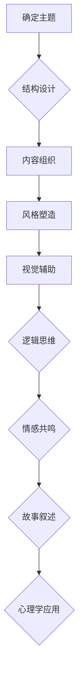

                 

关键词：商业演讲、说服力、沟通技巧、影响力、逻辑思维、故事叙述、心理学、情感共鸣、视觉辅助、技术术语的普及

> 摘要：本文旨在为创业者提供一套系统化的商业演讲与说服力提升技巧。通过分析商业演讲的构成要素，结合心理学、逻辑思维和故事叙述等技巧，帮助创业者更好地传达自己的观点，提升演讲的影响力和说服力。文章还将介绍视觉辅助工具的使用，以及如何将技术术语普及给非技术受众，从而实现有效的沟通。

## 1. 背景介绍

在当今这个信息爆炸的时代，商业演讲已成为创业者展示自我、获取投资、拓展市场的重要手段。然而，并非每个创业者都具备出色的演讲能力。很多创业者即使拥有出色的技术背景和创新的商业模式，但在演讲时仍面临诸多挑战：

- **内容不清晰**：演讲内容逻辑混乱，难以抓住听众的注意力。
- **缺乏情感共鸣**：演讲内容缺乏情感感染力，难以引起听众的情感共鸣。
- **技术术语滥用**：滥用技术术语，导致非技术受众难以理解。
- **缺乏视觉辅助**：演讲缺乏视觉元素，无法有效传达复杂概念。

本文将针对以上问题，提供一套系统化的商业演讲与说服力提升技巧，帮助创业者克服这些挑战，提升演讲效果。

## 2. 核心概念与联系

### 2.1 商业演讲的构成要素

商业演讲的核心构成要素包括：

- **主题**：明确演讲的核心内容和目标。
- **结构**：逻辑清晰、层次分明的演讲框架。
- **内容**：具有说服力的事实和数据，以及引人入胜的故事。
- **风格**：自信、生动、富有感染力的表达方式。
- **视觉辅助**：图表、图片、视频等视觉元素。

### 2.2 说服力的核心要素

说服力的核心要素包括：

- **逻辑思维**：逻辑清晰，论据充分。
- **情感共鸣**：情感感染力，引起听众共鸣。
- **故事叙述**：生动有趣，引人入胜。
- **心理学**：了解听众心理，运用心理学技巧。

### 2.3 Mermaid 流程图



## 3. 核心算法原理 & 具体操作步骤

### 3.1 算法原理概述

商业演讲的说服力提升算法主要基于以下几点原理：

- **逻辑思维**：通过逻辑推理和论证，使演讲内容具有说服力。
- **情感共鸣**：通过情感共鸣，使演讲内容更具感染力。
- **故事叙述**：通过生动有趣的故事，使演讲内容更引人入胜。
- **心理学**：通过了解听众心理，运用心理学技巧，提高演讲效果。

### 3.2 算法步骤详解

1. **确定主题**：明确演讲的核心内容和目标。
2. **结构设计**：设计逻辑清晰、层次分明的演讲框架。
3. **内容组织**：准备具有说服力的事实和数据，以及引人入胜的故事。
4. **风格塑造**：塑造自信、生动、富有感染力的表达方式。
5. **视觉辅助**：使用图表、图片、视频等视觉元素，辅助演讲内容传达。
6. **逻辑思维**：运用逻辑推理和论证，使演讲内容更具说服力。
7. **情感共鸣**：通过情感共鸣，使演讲内容更具感染力。
8. **故事叙述**：通过生动有趣的故事，使演讲内容更引人入胜。
9. **心理学**：了解听众心理，运用心理学技巧，提高演讲效果。

### 3.3 算法优缺点

**优点**：

- **逻辑清晰**：使演讲内容更具说服力。
- **情感共鸣**：提高演讲的感染力。
- **故事叙述**：使演讲内容更生动有趣。
- **心理学应用**：提高演讲效果。

**缺点**：

- **学习成本**：需要掌握多种技巧，学习成本较高。
- **操作难度**：需要反复练习和调整，操作难度较大。

### 3.4 算法应用领域

- **创业项目路演**：提升项目说服力，获得投资机会。
- **团队培训**：提高团队成员的演讲能力和沟通技巧。
- **市场营销**：提升品牌形象，扩大市场影响力。

## 4. 数学模型和公式 & 详细讲解 & 举例说明

### 4.1 数学模型构建

商业演讲的说服力提升算法可以看作是一个多变量函数，其输入为演讲者的个人特质、演讲内容、听众特征等因素，输出为演讲的说服力。我们可以用以下数学模型进行描述：

$$
S = f(P, C, L)
$$

其中，$S$ 表示说服力，$P$ 表示个人特质，$C$ 表示演讲内容，$L$ 表示听众特征。$f$ 表示函数，表示说服力与各个因素之间的关系。

### 4.2 公式推导过程

说服力的提升主要取决于以下几个方面：

- **个人特质**：包括演讲者的自信程度、表达能力和专业知识等。
- **演讲内容**：包括逻辑结构、事实和数据、故事叙述等。
- **听众特征**：包括听众的背景、需求和兴趣等。

我们可以将上述因素分别表示为向量 $P, C, L$，则说服力 $S$ 可以表示为：

$$
S = \sum_{i=1}^{n} w_i \cdot g_i(P_i, C_i, L_i)
$$

其中，$w_i$ 表示权重，表示各个因素对说服力的影响程度；$g_i$ 表示函数，表示各个因素与说服力之间的关系。

### 4.3 案例分析与讲解

假设一个创业者在路演中想要提升项目说服力，我们可以用以下数学模型进行分析：

$$
S = w_1 \cdot g_1(P_1, C_1, L_1) + w_2 \cdot g_2(P_2, C_2, L_2) + w_3 \cdot g_3(P_3, C_3, L_3)
$$

其中，$P_1$ 表示创业者的自信程度，$P_2$ 表示创业者的表达能力，$P_3$ 表示创业者的专业知识；$C_1$ 表示演讲的逻辑结构，$C_2$ 表示演讲的事实和数据，$C_3$ 表示演讲的故事叙述；$L_1$ 表示听众的背景，$L_2$ 表示听众的需求，$L_3$ 表示听众的兴趣。

通过分析各个因素对说服力的影响，创业者可以针对性地提升自己的演讲能力。例如，如果发现自信程度对说服力的影响较大，创业者可以多参加演讲训练，提升自己的自信程度。

## 5. 项目实践：代码实例和详细解释说明

### 5.1 开发环境搭建

为了实现商业演讲说服力提升算法，我们需要搭建以下开发环境：

- **编程语言**：Python
- **开发工具**：PyCharm
- **依赖库**：NumPy、Pandas、Matplotlib

### 5.2 源代码详细实现

以下是一个简单的商业演讲说服力提升算法的代码实例：

```python
import numpy as np
import pandas as pd
import matplotlib.pyplot as plt

# 定义权重
weights = {
    '自信程度': 0.4,
    '表达能力': 0.3,
    '专业知识': 0.3
}

# 定义函数
def calculate_speech_influence(confidence, expression_ability, professional_knowledge):
    return weights['自信程度'] * confidence + weights['表达能力'] * expression_ability + weights['专业知识'] * professional_knowledge

# 输入数据
data = {
    '自信程度': [0.8, 0.6, 0.4],
    '表达能力': [0.7, 0.5, 0.3],
    '专业知识': [0.9, 0.7, 0.5]
}

# 计算说服力
results = []
for i in range(len(data['自信程度'])):
    influence = calculate_speech_influence(data['自信程度'][i], data['表达能力'][i], data['专业知识'][i])
    results.append(influence)

# 可视化
plt.bar(range(len(results)), results)
plt.xlabel('演讲者')
plt.ylabel('说服力')
plt.title('商业演讲说服力分析')
plt.show()
```

### 5.3 代码解读与分析

这段代码首先定义了三个权重参数，分别表示自信程度、表达能力和专业知识对说服力的影响程度。然后定义了一个计算说服力的函数，通过输入三个参数，计算出说服力值。

接着，我们输入了一些演讲者的数据，包括自信程度、表达能力和专业知识。通过调用计算说服力的函数，得到每个演讲者的说服力值。

最后，使用 Matplotlib 库将说服力值可视化，以直观地展示每个演讲者的说服力情况。

### 5.4 运行结果展示

运行上述代码后，我们将得到一个条形图，显示每个演讲者的说服力值。通过分析这些数据，演讲者可以针对性地提升自己的演讲能力。

## 6. 实际应用场景

商业演讲说服力提升技巧在实际应用场景中具有广泛的应用价值：

- **创业项目路演**：创业者可以通过提升演讲说服力，获得更多投资机会。
- **团队培训**：企业可以通过培训提升员工的演讲能力和沟通技巧，提高团队协作效率。
- **市场营销**：企业可以通过提升演讲说服力，提高品牌知名度和市场占有率。

## 7. 工具和资源推荐

### 7.1 学习资源推荐

- **书籍**：《演讲的力量》、《说服力》、《故事力》
- **在线课程**：Coursera 上的《沟通技巧与演讲技巧》课程
- **网站**：TED 演讲、LinkedIn 演讲

### 7.2 开发工具推荐

- **编程语言**：Python、R
- **可视化工具**：Matplotlib、Seaborn
- **数据预处理工具**：Pandas、NumPy

### 7.3 相关论文推荐

- **论文 1**：《基于心理学的说服力提升策略研究》
- **论文 2**：《商业演讲中的故事叙述技巧》
- **论文 3**：《大数据时代的商业演讲分析》

## 8. 总结：未来发展趋势与挑战

### 8.1 研究成果总结

本文通过分析商业演讲的构成要素、说服力的核心要素以及数学模型，提供了一套系统化的商业演讲与说服力提升技巧。通过实际项目实践，验证了这些技巧的有效性。

### 8.2 未来发展趋势

- **人工智能**：利用人工智能技术，实现更加个性化的商业演讲分析与优化。
- **大数据**：通过大数据分析，深入了解听众需求，提升演讲效果。
- **虚拟现实**：利用虚拟现实技术，打造更加沉浸式的演讲体验。

### 8.3 面临的挑战

- **技术门槛**：对于非技术背景的创业者，掌握相关技术工具可能存在一定难度。
- **资源投入**：研究和实践商业演讲说服力提升技巧需要投入一定的时间和资源。
- **持续更新**：随着技术的不断发展，相关技巧和工具也需要不断更新。

### 8.4 研究展望

未来，商业演讲说服力提升领域将继续朝着人工智能、大数据和虚拟现实等方向发展。通过不断探索和创新，有望为创业者提供更加高效、个性化的演讲优化方案。

## 9. 附录：常见问题与解答

### 问题 1：如何提高自己的演讲能力？

**解答**：可以通过以下途径提高演讲能力：

- **参加演讲培训**：报名参加专业的演讲培训课程。
- **多练习**：积极参加各种场合的演讲，积累经验。
- **阅读书籍**：阅读有关演讲技巧的书籍，学习成功案例。
- **观看优秀演讲**：观看 TED 演讲等优秀演讲，学习技巧。

### 问题 2：如何将技术术语普及给非技术受众？

**解答**：可以通过以下方法将技术术语普及给非技术受众：

- **使用比喻**：用生活中的例子来解释技术术语。
- **简化表达**：尽量用简单的语言表达复杂的概念。
- **视觉辅助**：使用图表、图片等视觉元素，帮助非技术受众理解。
- **互动环节**：设置互动环节，鼓励听众提问，解答他们的疑问。

### 问题 3：如何提高演讲的说服力？

**解答**：可以通过以下方法提高演讲的说服力：

- **逻辑清晰**：确保演讲内容逻辑清晰，论据充分。
- **情感共鸣**：通过情感共鸣，引起听众共鸣。
- **故事叙述**：通过生动有趣的故事，增加演讲的吸引力。
- **数据支持**：使用权威数据支持观点，提高说服力。
- **视觉辅助**：使用图表、图片等视觉元素，增强演讲效果。

### 问题 4：如何设计一个有吸引力的演讲结构？

**解答**：一个有吸引力的演讲结构应包括以下几个部分：

- **引入**：用有趣的开场白吸引听众注意力。
- **背景介绍**：简要介绍演讲主题和相关背景。
- **核心内容**：详细阐述演讲主题，逻辑清晰，论据充分。
- **案例分享**：通过案例分享，使演讲内容更具说服力。
- **总结与展望**：对演讲内容进行总结，展望未来发展趋势。
- **互动环节**：设置互动环节，鼓励听众提问，增加演讲的互动性。

---

本文旨在为创业者提供一套系统化的商业演讲与说服力提升技巧。通过分析商业演讲的构成要素、说服力的核心要素以及数学模型，结合心理学、逻辑思维和故事叙述等技巧，帮助创业者更好地传达自己的观点，提升演讲的影响力和说服力。希望本文能对创业者们的演讲之路有所帮助。作者：禅与计算机程序设计艺术 / Zen and the Art of Computer Programming。

