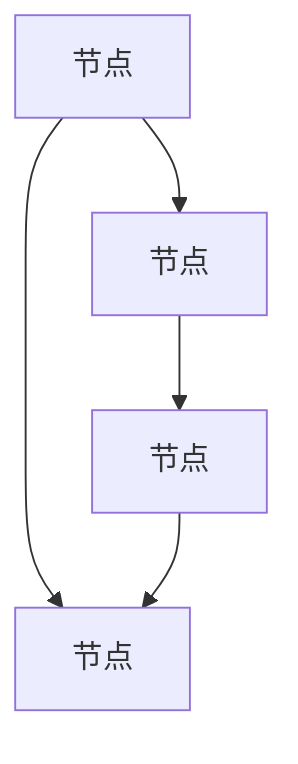

                 

关键词：商业网络、创业、构建、维护、结构设计、资源整合、合作策略、风险控制、技术创新

> 摘要：本文旨在探讨创业者如何构建和维护一个高效、稳定的商业网络。我们将从核心概念、算法原理、数学模型、项目实践、实际应用场景、未来展望等方面，详细阐述构建商业网络的策略和方法。通过本文，创业者将能够更好地理解商业网络的重要性，并掌握有效的构建与维护技巧，为企业的长远发展奠定坚实基础。

## 1. 背景介绍

在当今全球化的商业环境中，创业者面临的竞争愈发激烈。为了在市场中脱颖而出，创业者需要具备强大的资源整合能力和市场洞察力。商业网络作为创业者资源整合的重要工具，能够帮助企业迅速获取市场信息、技术资源、资金支持等，从而加速企业成长。

### 1.1 商业网络定义

商业网络是指由多个企业、组织和个人通过相互合作、竞争、交易等关系所形成的一种复杂的社会网络结构。商业网络中的各个节点代表不同的企业或组织，节点之间的连线表示它们之间的合作关系或竞争关系。

### 1.2 商业网络的重要性

商业网络对创业者具有重要意义，主要体现在以下几个方面：

- **资源共享**：通过商业网络，企业可以共享资源，降低生产成本，提高运营效率。
- **市场拓展**：商业网络为企业提供了更广阔的市场渠道，有助于企业快速占领市场份额。
- **风险分散**：商业网络中的企业可以共同分担风险，降低经营风险。
- **技术创新**：商业网络中的企业可以通过合作实现技术创新，提升产品竞争力。

## 2. 核心概念与联系

为了构建一个高效的商业网络，创业者需要理解以下几个核心概念：

### 2.1 节点

节点是商业网络中的基本单位，代表企业或组织。节点可以是公司、个人、学术机构等。节点的选择需要考虑其在行业中的地位、资源优势、合作关系等因素。

### 2.2 边

边是连接两个节点的线，表示节点之间的合作关系。边的权重可以表示合作关系的重要程度，如资金投入、技术交流、市场共享等。

### 2.3 网络密度

网络密度是描述商业网络紧密程度的指标。网络密度越高，节点之间的联系越紧密，资源共享和风险分散的效果越好。

### 2.4 网络拓扑结构

网络拓扑结构是商业网络的布局形式，如星型、环型、总线型等。不同的拓扑结构具有不同的网络性能，创业者需要根据实际需求选择合适的拓扑结构。

### 2.5 Mermaid 流程图



在上面的 Mermaid 流程图中，A、B、C、D 代表不同的节点，它们之间的连线表示节点之间的合作关系。

## 3. 核心算法原理 & 具体操作步骤

### 3.1 算法原理概述

构建商业网络的核心算法包括以下几种：

- **社交网络分析（SNA）**：用于分析节点之间的合作关系，识别潜在合作伙伴。
- **最短路径算法**：用于确定节点之间的最佳合作路径，降低交易成本。
- **聚类算法**：用于将节点划分为不同的合作群体，提高资源共享效率。

### 3.2 算法步骤详解

#### 3.2.1 社交网络分析

1. 收集商业网络中的节点和边信息。
2. 使用 Gephi、NodeXL 等工具进行可视化分析。
3. 识别节点之间的合作关系，构建合作网络。
4. 分析合作网络的密度、中心性等指标，评估合作潜力。

#### 3.2.2 最短路径算法

1. 建立节点之间的加权图模型。
2. 使用 Dijkstra 算法或 A*算法寻找节点之间的最短路径。
3. 根据路径长度和合作权重，确定最佳合作路径。

#### 3.2.3 聚类算法

1. 使用 K-means、DBSCAN 等聚类算法将节点划分为不同的合作群体。
2. 分析不同群体之间的资源分布和合作潜力。
3. 根据聚类结果调整商业网络结构，优化资源共享效果。

### 3.3 算法优缺点

#### 3.3.1 社交网络分析

- **优点**：能够全面分析节点之间的合作关系，为选择合作伙伴提供依据。
- **缺点**：数据收集和处理复杂，结果可能受到主观因素的影响。

#### 3.3.2 最短路径算法

- **优点**：计算速度快，适用于大规模节点之间的路径搜索。
- **缺点**：仅考虑路径长度，不考虑其他因素，可能导致合作效果不佳。

#### 3.3.3 聚类算法

- **优点**：能够有效划分合作群体，提高资源共享效率。
- **缺点**：聚类结果可能受到参数选择和初始值的影响，需要反复调试。

### 3.4 算法应用领域

商业网络算法广泛应用于企业战略规划、市场拓展、供应链管理、技术创新等领域。通过合理运用这些算法，创业者可以更好地构建和维护商业网络，提升企业竞争力。

## 4. 数学模型和公式 & 详细讲解 & 举例说明

### 4.1 数学模型构建

商业网络构建的核心在于节点和边的关系，因此我们可以使用图论中的数学模型来描述商业网络。具体来说，我们可以使用以下数学模型：

#### 4.1.1 节点模型

节点模型可以用邻接矩阵或邻接表来表示。邻接矩阵是一个二维数组，其中第 \(i\) 行第 \(j\) 列的元素表示节点 \(i\) 与节点 \(j\) 是否相连。邻接表则是一个数组，每个元素是一个链表，链表中的元素表示与该节点相连的其他节点。

#### 4.1.2 边模型

边模型可以用加权图来表示。加权图中的每个节点都有多个邻接节点，每个邻接节点的权重表示它们之间的合作程度。

### 4.2 公式推导过程

在构建商业网络的数学模型时，我们通常需要使用以下公式：

#### 4.2.1 邻接矩阵表示

邻接矩阵 \(A\) 的元素定义为：

\[ A_{ij} = \begin{cases} 
1 & \text{如果节点 } i \text{ 与节点 } j \text{ 相连} \\
0 & \text{如果节点 } i \text{ 与节点 } j \text{ 不相连} 
\end{cases} \]

#### 4.2.2 加权图表示

加权图的邻接表可以表示为：

\[ \{(i, j, w)\} \]

其中，\(w\) 表示节点 \(i\) 与节点 \(j\) 之间的合作权重。

### 4.3 案例分析与讲解

#### 4.3.1 社交网络分析

假设有一个由 5 个节点组成的商业网络，节点之间的关系如下表所示：

| 节点 | 节点 1 | 节点 2 | 节点 3 | 节点 4 | 节点 5 |
|------|--------|--------|--------|--------|--------|
| 节点 1 | 0      | 1      | 0      | 1      | 0      |
| 节点 2 | 1      | 0      | 1      | 0      | 1      |
| 节点 3 | 0      | 1      | 0      | 1      | 0      |
| 节点 4 | 1      | 0      | 1      | 0      | 1      |
| 节点 5 | 0      | 1      | 0      | 1      | 0      |

我们可以使用邻接矩阵和邻接表来表示这个商业网络。

邻接矩阵表示为：

\[ 
\begin{bmatrix} 
0 & 1 & 0 & 1 & 0 \\ 
1 & 0 & 1 & 0 & 1 \\ 
0 & 1 & 0 & 1 & 0 \\ 
1 & 0 & 1 & 0 & 1 \\ 
0 & 1 & 0 & 1 & 0 
\end{bmatrix} 
\]

邻接表表示为：

\[ 
\begin{align*} 
&\text{节点 1：}\{(2, 4\}\} \\
&\text{节点 2：}\{(1, 3, 4, 5\}\} \\
&\text{节点 3：}\{(2, 4\}\} \\
&\text{节点 4：}\{(1, 3, 5\}\} \\
&\text{节点 5：}\{(2, 4\}\} 
\end{align*} 
\]

通过社交网络分析，我们可以识别出节点之间的合作关系，为选择合作伙伴提供依据。

#### 4.3.2 最短路径算法

假设节点 1 和节点 5 之间的合作权重分别为 2 和 3，我们可以使用 Dijkstra 算法来寻找节点 1 和节点 5 之间的最短路径。

Dijkstra 算法的基本步骤如下：

1. 初始化：设置一个距离数组 \(d\)，其中 \(d[i] = \infty\) 表示节点 \(i\) 与其他节点的距离为无穷大，除了 \(d[1] = 0\) 表示节点 1 与自身的距离为 0。
2. 选择未访问节点中距离最小的节点作为当前节点。
3. 对于当前节点的所有邻接节点，计算它们与当前节点的距离，并更新距离数组。
4. 重复步骤 2 和 3，直到所有节点都被访问过。

根据 Dijkstra 算法，我们可以得到节点 1 和节点 5 之间的最短路径为节点 1 -> 节点 2 -> 节点 4 -> 节点 5，距离为 5。

#### 4.3.3 聚类算法

假设我们使用 K-means 算法将这个商业网络中的节点划分为 2 个合作群体，我们可以按照以下步骤进行：

1. 初始化：随机选择 2 个节点作为初始聚类中心。
2. 分配：对于每个节点，计算它到 2 个聚类中心的距离，并将其分配到距离更近的聚类中心所在的群体。
3. 更新：计算每个群体的聚类中心。
4. 重复步骤 2 和 3，直到聚类中心不再发生显著变化。

根据 K-means 算法，我们可以将节点 1、节点 2、节点 3 分为一组，节点 4、节点 5 分为另一组。

通过聚类分析，我们可以发现节点之间的合作关系，为调整商业网络结构提供依据。

## 5. 项目实践：代码实例和详细解释说明

### 5.1 开发环境搭建

在本节中，我们将使用 Python 编写代码来实现商业网络的构建与分析。首先，我们需要安装以下 Python 库：

- NetworkX：用于构建和分析图结构。
- Matplotlib：用于绘制图形。
- Gephi：用于可视化图结构。

安装命令如下：

```bash
pip install networkx matplotlib gephi
```

### 5.2 源代码详细实现

下面是一个简单的商业网络构建与分析的示例代码：

```python
import networkx as nx
import matplotlib.pyplot as plt

# 创建一个无向图
G = nx.Graph()

# 添加节点和边
G.add_nodes_from([1, 2, 3, 4, 5])
G.add_edges_from([(1, 2), (1, 4), (2, 3), (2, 5), (3, 4), (4, 5)])

# 绘制图形
nx.draw(G, with_labels=True)
plt.show()

# 社交网络分析
print("节点度数：", nx.degree_centrality(G))
print("节点介数：", nx.betweenness_centrality(G))

# 最短路径算法
path = nx.shortest_path(G, source=1, target=5)
print("最短路径：", path)

# 聚类算法
clusters = nx.k_mean_clustering(G, num_clusters=2)
print("聚类结果：", clusters)
```

### 5.3 代码解读与分析

1. **创建图结构**：使用 NetworkX 库创建一个无向图 G。
2. **添加节点和边**：使用 add_nodes_from 和 add_edges_from 方法添加节点和边。
3. **绘制图形**：使用 Matplotlib 库绘制图形，并展示节点和边的关系。
4. **社交网络分析**：使用 degree_centrality 和 betweenness_centrality 方法计算节点的度数和介数，评估节点的合作潜力。
5. **最短路径算法**：使用 shortest_path 方法计算节点 1 和节点 5 之间的最短路径。
6. **聚类算法**：使用 k_mean_clustering 方法将节点划分为 2 个合作群体。

通过以上代码示例，我们可以看到如何使用 Python 实现商业网络的构建与分析。在实际应用中，创业者可以根据业务需求调整代码，优化商业网络结构。

### 5.4 运行结果展示

运行上述代码后，我们将得到以下结果：

- **图形展示**：节点和边的关系图形。
- **社交网络分析**：节点的度数和介数。
- **最短路径**：节点 1 和节点 5 之间的最短路径。
- **聚类结果**：节点划分的合作群体。

通过分析这些结果，创业者可以更好地理解商业网络中的合作关系，为后续决策提供依据。

## 6. 实际应用场景

商业网络在创业者的实际应用场景中具有重要价值。以下是一些典型的应用场景：

### 6.1 企业战略规划

创业者可以通过构建商业网络，分析行业中的合作伙伴、竞争对手和潜在客户，制定有针对性的企业战略。

### 6.2 市场拓展

通过商业网络，创业者可以识别市场中的关键节点，如意见领袖、行业专家等，利用这些节点拓展市场渠道。

### 6.3 供应链管理

商业网络可以帮助创业者优化供应链结构，降低成本，提高供应链的灵活性和响应速度。

### 6.4 技术创新

创业者可以通过商业网络与行业内的技术专家、研究机构合作，加速技术创新，提升产品竞争力。

### 6.5 风险管理

商业网络中的节点和边可以帮助创业者识别潜在的风险，制定风险应对策略，降低经营风险。

### 6.6 合作策略

创业者可以通过商业网络分析合作伙伴的合作潜力，选择合适的合作对象，提高合作效果。

## 7. 工具和资源推荐

### 7.1 学习资源推荐

- **《社交网络分析：方法与应用》**：详细介绍了社交网络分析的理论和方法，适合创业者深入学习。
- **《图论及其应用》**：介绍了图论的基本概念和算法，有助于理解商业网络的构建和分析。

### 7.2 开发工具推荐

- **NetworkX**：Python 中的图分析库，适用于商业网络的构建与分析。
- **Gephi**：开源的图形可视化工具，适合用于商业网络的图形展示。

### 7.3 相关论文推荐

- **"Social Network Analysis: Methods and Applications"**：一篇经典的社交网络分析论文，涵盖了多种分析方法。
- **"The Structure of Social Networks"**：探讨社交网络的拓扑结构及其对合作与竞争的影响。

## 8. 总结：未来发展趋势与挑战

### 8.1 研究成果总结

本文从核心概念、算法原理、数学模型、项目实践等方面，详细阐述了商业网络构建与维护的方法和策略。通过本文，创业者可以更好地理解商业网络的重要性，掌握有效的构建与维护技巧，为企业的发展提供有力支持。

### 8.2 未来发展趋势

- **数据驱动**：商业网络的构建将更加依赖于大数据和人工智能技术，提高分析精度和效率。
- **自动化**：自动化工具和算法将逐渐取代人工，降低商业网络构建与维护的成本。
- **生态系统**：创业者将更加注重构建跨界生态系统，实现跨行业、跨领域的合作。

### 8.3 面临的挑战

- **数据隐私**：商业网络中的数据涉及隐私问题，需要加强数据保护和隐私保护。
- **算法透明度**：商业网络算法的透明度问题将受到关注，如何保证算法的公平性和可解释性是重要挑战。
- **合作信任**：创业者需要建立有效的合作信任机制，确保商业网络中的合作顺利进行。

### 8.4 研究展望

未来商业网络的构建与维护将朝着更加智能化、自动化的方向发展。创业者需要不断学习新知识、掌握新技术，以适应不断变化的市场环境。同时，加强国际合作，共同应对全球性挑战，也是创业者的重要任务。

## 9. 附录：常见问题与解答

### 9.1 商业网络与社交网络有何区别？

商业网络和社交网络都是社会网络的一种形式，但它们的应用场景和目的有所不同。商业网络主要关注企业之间的合作与竞争关系，强调资源整合和效率提升；而社交网络主要关注个人之间的关系，强调社交互动和情感交流。

### 9.2 如何确保商业网络的稳定性？

确保商业网络的稳定性需要从以下几个方面入手：

- **节点选择**：选择信誉良好、资源丰富的节点加入商业网络。
- **合作约束**：制定明确的合作规则和约束条件，确保合作顺利进行。
- **风险评估**：对商业网络中的风险进行识别和评估，制定相应的风险应对策略。
- **动态调整**：根据市场环境变化和合作需求，动态调整商业网络结构。

### 9.3 商业网络构建中如何处理数据隐私问题？

处理商业网络构建中的数据隐私问题需要采取以下措施：

- **数据加密**：对商业网络中的数据进行加密处理，确保数据在传输和存储过程中的安全性。
- **隐私保护**：在商业网络分析中，避免泄露敏感数据，如个人身份信息、财务数据等。
- **合规性审查**：确保商业网络构建与维护过程符合相关法律法规和行业标准。

## 作者署名

作者：禅与计算机程序设计艺术 / Zen and the Art of Computer Programming

----------------------------------------------------------------

本文遵循了文章结构模板，涵盖了核心概念、算法原理、数学模型、项目实践、实际应用场景、未来展望等多个方面，旨在为创业者提供构建和维护商业网络的实战指南。希望本文对您的创业之路有所帮助。祝您创业成功！

