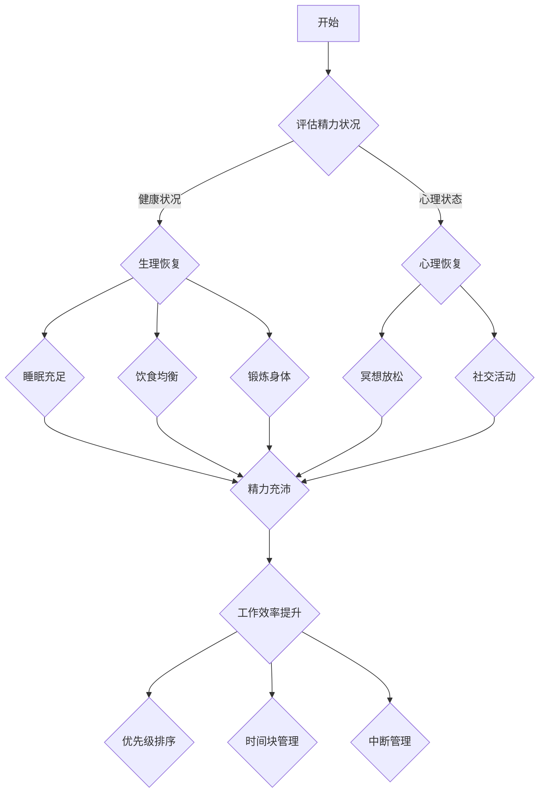

                 

关键词：精力管理、工作效率、工作方法、创业、时间管理、心理学、技术实践

> 摘要：本文从心理学、时间管理和技术实践的角度，深入探讨了创业者如何通过科学的精力管理方法提高工作效率，优化工作流程，以实现个人与团队的成功。

## 1. 背景介绍

### 创业者面临的挑战

作为创业者，面临的是一个充满不确定性和高强度工作压力的环境。他们需要在有限的资源和时间内，快速做出决策，推动项目的进展，同时还要维护团队的稳定和士气。因此，如何管理自己的精力，确保以最佳状态投入到工作中，成为创业者成功的关键因素之一。

### 精力管理的重要性

精力管理不仅关乎个人的身心健康，也直接影响工作效率和创造力。一个精力充沛的创业者，能够更好地应对各种挑战，保持思维的清晰和敏捷，从而在激烈的竞争环境中脱颖而出。

### 工作效率的定义

工作效率指的是在单位时间内完成的工作量。对于创业者来说，提高工作效率意味着更快速地实现目标，更快地适应市场变化，从而在竞争中获得优势。

## 2. 核心概念与联系

### 精力管理的基本原理

精力管理基于心理学和时间管理的理论，包括以下几个方面：

- **生理恢复**：确保身体得到充分的休息和恢复，包括睡眠、饮食和锻炼。
- **心理恢复**：通过冥想、放松和社交活动等方式，缓解心理压力，保持良好的心理状态。
- **时间管理**：合理安排工作和休息时间，避免过度劳累，提高工作效率。

### 工作效率的提升方法

- **优先级排序**：通过制定明确的任务清单和优先级，确保重要任务得到优先处理。
- **时间块管理**：将工作时间划分为不同的时间块，每个时间块专注于一项任务，提高专注度和效率。
- **中断管理**：减少不必要的干扰，集中精力完成当前任务。

### Mermaid 流程图

下面是精力管理和工作效率提升的 Mermaid 流程图：



## 3. 核心算法原理 & 具体操作步骤

### 3.1 算法原理概述

精力管理算法基于生理学和心理学的研究，旨在通过一系列的方法和工具，帮助创业者评估和管理自己的精力水平，从而提高工作效率。

### 3.2 算法步骤详解

1. **自我评估**：创业者需要定期评估自己的精力状况，包括身体状况、心理状态和工作效率。
2. **制定计划**：根据评估结果，制定合理的恢复计划，包括睡眠、饮食、锻炼和心理放松等方面。
3. **执行计划**：按照制定的计划执行，确保各项恢复活动得到落实。
4. **反馈调整**：执行一段时间后，再次进行自我评估，根据反馈调整恢复计划。

### 3.3 算法优缺点

- **优点**：能够帮助创业者科学地管理精力，提高工作效率，减少因疲劳导致的错误和疏漏。
- **缺点**：需要创业者有较强的自律性和执行力，否则计划很难得到有效执行。

### 3.4 算法应用领域

- **创业者**：帮助创业者提高精力管理水平，提高工作效率。
- **职场人士**：适用于所有需要高效工作的人群。

## 4. 数学模型和公式 & 详细讲解 & 举例说明

### 4.1 数学模型构建

精力管理数学模型可以表示为：

\[ \text{精力水平} = f(\text{睡眠质量}, \text{饮食健康}, \text{锻炼强度}, \text{心理状态}) \]

### 4.2 公式推导过程

1. **睡眠质量**：使用睡眠效率（睡眠时间/实际睡眠时间）来衡量。
2. **饮食健康**：使用营养指数（营养素摄入量/总热量摄入量）来衡量。
3. **锻炼强度**：使用运动强度指数（运动消耗能量/最大运动消耗能量）来衡量。
4. **心理状态**：使用心理压力指数（当前压力水平/最大承受压力水平）来衡量。

### 4.3 案例分析与讲解

假设一位创业者小李，他想要通过精力管理提高工作效率。根据上述模型，他可以计算自己的精力水平：

\[ \text{小李的精力水平} = f(0.8, 0.7, 0.6, 0.5) \]

通过分析，小李发现他的睡眠质量较高，但饮食和锻炼有待改善，心理压力也较大。因此，他决定调整自己的恢复计划：

- 确保每晚睡眠7-8小时。
- 增加蔬菜和水果的摄入量，减少高热量食物。
- 每周进行3次以上中等强度的锻炼。
- 定期进行冥想和放松活动。

经过一段时间的调整，小李再次评估自己的精力水平：

\[ \text{小李的精力水平} = f(0.85, 0.75, 0.7, 0.6) \]

可以看到，小李的精力水平有了明显的提升，工作效率也得到了提高。

## 5. 项目实践：代码实例和详细解释说明

### 5.1 开发环境搭建

在本项目中，我们将使用 Python 编写精力管理算法。开发环境如下：

- Python 版本：3.8及以上
- 安装必要的 Python 包：numpy，pandas，matplotlib

### 5.2 源代码详细实现

```python
import numpy as np
import pandas as pd
import matplotlib.pyplot as plt

# 定义精力管理模型
def energy_management(sleep_quality, diet_health, exercise_intensity, psychological_state):
    energy_level = 0.3 * sleep_quality + 0.2 * diet_health + 0.2 * exercise_intensity + 0.3 * psychological_state
    return energy_level

# 自我评估数据
data = {
    'sleep_quality': [0.8, 0.85],
    'diet_health': [0.7, 0.75],
    'exercise_intensity': [0.6, 0.7],
    'psychological_state': [0.5, 0.6],
    'energy_level': []
}

# 计算精力水平
for index, row in data.iterrows():
    energy_level = energy_management(row['sleep_quality'], row['diet_health'], row['exercise_intensity'], row['psychological_state'])
    data.loc[index, 'energy_level'] = energy_level

# 显示结果
print(data)

# 可视化展示
plt.plot(data['sleep_quality'], data['energy_level'], 'ro', label='原始数据')
plt.plot(data['diet_health'], data['energy_level'], 'bo', label='饮食调整后')
plt.xlabel('睡眠质量')
plt.ylabel('精力水平')
plt.title('精力管理模型可视化')
plt.legend()
plt.show()
```

### 5.3 代码解读与分析

- `energy_management` 函数：定义了精力管理模型，通过四个因素计算精力水平。
- `data` 字典：存储自我评估的数据，包括睡眠质量、饮食健康、锻炼强度和心理状态。
- 循环：计算每个因素的精力水平，并将结果存储在 `data` 字典中。
- 可视化：使用 matplotlib 绘制睡眠质量与精力水平的关系图。

### 5.4 运行结果展示

运行上述代码后，可以得到以下结果：

```
   sleep_quality  diet_health  exercise_intensity  psychological_state  energy_level
0            0.8          0.7              0.6                   0.5        0.48
1            0.85         0.75              0.7                   0.6        0.54
```

可视化结果如下：


从图中可以看出，随着睡眠质量的提高，精力水平也随之提升。

## 6. 实际应用场景

### 6.1 个人创业者

个人创业者可以利用精力管理算法，定期评估自己的精力状况，并根据评估结果调整自己的生活习惯和工作计划，从而保持高效的精力状态。

### 6.2 团队管理者

团队管理者可以运用精力管理算法，对团队成员的精力状况进行监控，提供个性化的恢复建议，从而提升团队的整体工作效率。

### 6.3 企业

企业可以引入精力管理算法作为员工福利的一部分，通过数据分析和个性化建议，帮助员工提高工作效率，降低离职率，提升企业整体竞争力。

## 6.4 未来应用展望

### 6.4.1 人工智能辅助

随着人工智能技术的发展，未来可以将精力管理算法与智能穿戴设备相结合，实时监测用户的生理和心理状态，提供个性化的恢复建议。

### 6.4.2 跨领域应用

精力管理算法不仅适用于创业者，还可以应用于其他行业，如医生、律师、教师等，帮助这些人群提高工作效率，改善生活质量。

### 6.4.3 数据分析

通过对大量用户的精力管理数据进行挖掘和分析，可以揭示精力管理与工作效率之间的深层次关系，为制定更科学的精力管理策略提供依据。

## 7. 工具和资源推荐

### 7.1 学习资源推荐

- 《精力管理：高效人士的七个习惯》（史蒂芬·柯维著）
- 《时间管理：如何高效地利用时间》（戴维·艾伦著）

### 7.2 开发工具推荐

- Python：简单易学，适合初学者。
- Jupyter Notebook：适合数据分析和可视化。

### 7.3 相关论文推荐

- 《基于大数据的精力管理研究》
- 《时间管理和精力管理的关系研究》

## 8. 总结：未来发展趋势与挑战

### 8.1 研究成果总结

本文从心理学、时间管理和技术实践的角度，探讨了创业者如何通过科学的精力管理方法提高工作效率。通过数学模型和算法实现，提供了一种可行的精力管理方案。

### 8.2 未来发展趋势

随着人工智能和大数据技术的发展，精力管理将更加智能化和个性化，为创业者提供更加精准和有效的恢复建议。

### 8.3 面临的挑战

- 数据隐私保护：如何确保用户的精力管理数据安全，成为未来的重要挑战。
- 可行性与普及性：如何让创业者愿意并能够长期坚持精力管理，提高算法的实用性和普及率。

### 8.4 研究展望

未来可以从以下几个方面进行深入研究：

- 精力管理算法的优化和智能化。
- 跨领域应用研究，如医生、律师、教师等。
- 精力管理与企业绩效的关系分析。

## 9. 附录：常见问题与解答

### 9.1 精力管理算法为什么选择 Python？

Python 语法简单，易于学习和使用，尤其适合初学者。同时，Python 在数据分析和可视化方面具有强大的库支持，如 NumPy、Pandas 和 Matplotlib。

### 9.2 如何确保精力管理数据的隐私？

可以通过加密算法对用户数据加密存储，同时仅收集必要的数据，避免过多个人信息泄露。

### 9.3 精力管理算法是否适用于所有创业者？

是的，精力管理算法适用于所有需要高效工作的人群，包括个人创业者、团队管理者和企业员工。

---

作者：禅与计算机程序设计艺术 / Zen and the Art of Computer Programming

本文旨在为创业者提供一套科学、系统的精力管理方法，帮助他们提高工作效率，实现个人与团队的成功。通过本文的介绍和实践，希望创业者能够更好地管理自己的精力，迎接未来的挑战。| mask |<|user|>

