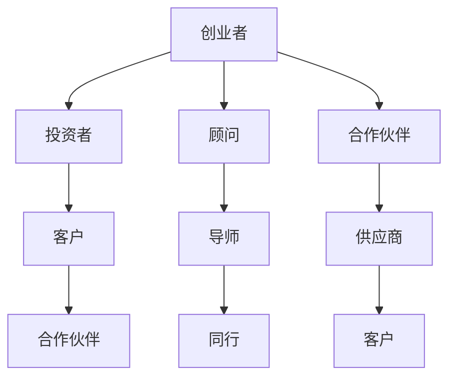
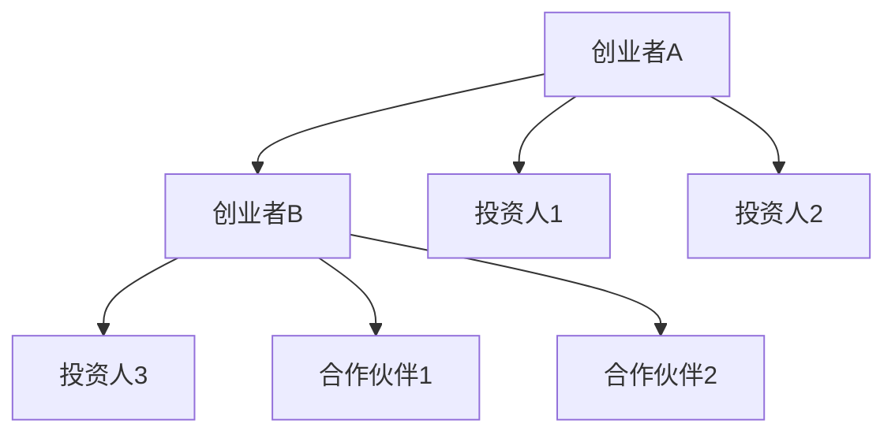

                 

关键词：创业者，人脉圈，拓展技巧，关系管理，社交网络，职业发展

> 摘要：本文旨在探讨创业者如何通过构建和拓展人脉圈，利用社交网络的强大力量来提升个人和企业的职业发展。文章将详细介绍一系列实用的网络建设技巧，包括核心概念的理解、算法原理的分析、数学模型的构建以及实际应用场景的解读。

## 1. 背景介绍

在当今快速发展的商业环境中，创业者的成功往往不仅仅依赖于自身的专业技能和创新能力，更在于其能否构建和利用一个强大的社交网络。人脉圈是创业者获取资源、信息、机会以及支持的重要渠道。然而，如何有效地拓展和利用人脉圈，却是一门深奥的艺术。

创业者在网络建设中面临诸多挑战，如如何识别潜在的高价值联系人、如何保持网络的活跃度和可持续性、如何处理复杂的社交关系等。这些问题的解决，需要系统地理解人脉圈的构建原则、拓展策略和实践技巧。

本文将围绕以下几个核心问题展开：

- 人脉圈的核心概念及其在创业者职业发展中的作用
- 拓展人脉圈的有效策略和技术
- 关系管理的艺术：如何维护、深化和扩展已有联系
- 社交网络的数学模型和公式，及其在实际应用中的解读
- 实际案例分析和代码实现，以展示技巧的具体应用

通过本文的阅读，创业者将获得一系列实用的网络建设技巧，帮助他们在竞争激烈的商业环境中脱颖而出。

## 2. 核心概念与联系

为了更好地理解人脉圈的概念，首先需要明确一些关键的定义和概念。

### 2.1 人脉圈的定义

人脉圈是指由个体之间相互联系形成的社交网络，这些联系可以是个人关系、专业合作或利益交换。在人脉圈中，个体之间的关系可以是紧密的，也可以是松散的。

### 2.2 社交网络

社交网络是指通过人际关系连接起来的个体群体，它可以被视为一个复杂的网络结构，其中节点代表个体，边代表个体之间的关系。

### 2.3 关键概念的关系

人脉圈是社交网络的一个子集，而社交网络则是描述人脉圈结构的一个抽象模型。人脉圈中的每个节点（个体）都与其他节点通过边（关系）相连，形成一个复杂的网络结构。

### 2.4 Mermaid 流程图

以下是一个用Mermaid绘制的简单社交网络流程图，展示了人脉圈的基本结构：



在这个流程图中，每个节点都代表一个潜在的联系人，边则表示他们之间的关系。这种结构有助于我们理解和分析人脉圈中的联系和互动。

## 3. 核心算法原理 & 具体操作步骤

### 3.1 算法原理概述

拓展人脉圈的核心算法可以归结为两个主要方面：关系的识别和拓展。

#### 关系的识别

关系的识别是通过分析现有联系人之间的关系网络，确定潜在的高价值联系人。这一过程涉及以下几个步骤：

1. **数据收集**：收集与创业者相关的联系人信息，包括他们的职位、公司、专业领域等。
2. **网络分析**：使用网络分析方法，如度中心性、中间中心性等，识别出关键联系人。
3. **关系评估**：根据联系人的职位、公司规模、行业影响力等指标，评估其潜在价值。

#### 关系的拓展

关系的拓展是通过主动沟通和互动，建立新的联系。这一过程包括以下几个步骤：

1. **目标确定**：确定需要拓展的联系人类型和数量。
2. **信息准备**：准备与联系人沟通的信息，包括个人介绍、合作意向等。
3. **主动沟通**：通过电子邮件、社交媒体、线下聚会等方式，主动与联系人建立联系。
4. **互动维护**：在建立联系后，通过持续的互动和维护，深化和扩展关系。

### 3.2 算法步骤详解

#### 关系的识别步骤

1. **数据收集**：

    创业者可以通过以下几个渠道收集联系人信息：

    - **社交媒体**：如LinkedIn、Twitter等，可以通过搜索关键词和行业标签，找到潜在的联系人。
    - **行业活动**：参加行业会议、研讨会、网络聚会等活动，结识新朋友。
    - **公司内部网络**：利用公司内部通讯录、员工名单等资源，查找相关联系人。

2. **网络分析**：

    使用网络分析工具，如Gephi、NodeXL等，对收集到的联系人信息进行分析。以下是一些常用的网络分析指标：

    - **度中心性**：衡量个体在社交网络中的连接程度，度中心性越高，个体的重要性越大。
    - **中间中心性**：衡量个体在社交网络中的中介作用，中间中心性越高，个体的影响力越大。
    - **接近中心性**：衡量个体在社交网络中的接近程度，接近中心性越高，个体越容易接触到关键信息。

3. **关系评估**：

    根据分析结果，对联系人进行价值评估。可以设置一些评估标准，如：

    - **行业影响力**：联系人在行业内的知名度和影响力。
    - **职位和公司规模**：联系人的职位和所在公司的规模，职位越高、公司规模越大，潜在价值越高。
    - **专业领域**：联系人的专业领域，与其创业项目相关度越高，潜在价值越大。

#### 关系的拓展步骤

1. **目标确定**：

    根据创业者的需求和资源，确定需要拓展的联系人类型和数量。例如，需要找到几位行业内的专家、几位潜在的投资者、几位合作伙伴等。

2. **信息准备**：

    准备与联系人沟通的信息，包括个人介绍、合作意向、项目介绍等。这些信息应简洁明了，突出创业项目的核心价值和合作潜力。

3. **主动沟通**：

    通过电子邮件、社交媒体、线下聚会等方式，主动与联系人建立联系。以下是一些建议：

    - **个性化邮件**：在邮件中，个性化地介绍自己，提及与联系人的共同兴趣或专业领域。
    - **社交媒体互动**：在社交媒体上，积极关注和互动，建立初步联系。
    - **线下聚会**：参加行业活动或线下聚会，面对面交流，加深联系。

4. **互动维护**：

    在建立联系后，通过持续的互动和维护，深化和扩展关系。以下是一些建议：

    - **定期沟通**：定期与联系人保持联系，分享项目进展、行业动态等。
    - **提供价值**：为联系人提供有价值的信息或资源，建立互惠关系。
    - **共办活动**：与联系人共同举办活动，加深合作关系。

### 3.3 算法优缺点

#### 优点

1. **高效性**：通过算法分析，可以快速识别出潜在的高价值联系人，节省时间和精力。
2. **针对性**：根据创业者的需求和资源，有针对性地拓展联系人，提高合作成功率。
3. **可持续性**：通过持续的互动和维护，可以建立稳定的社交网络，长期受益。

#### 缺点

1. **信息准确性**：网络分析依赖于收集到的信息，如果信息不准确，可能导致误判。
2. **人工干预**：虽然算法可以提供有效的拓展策略，但具体实施仍需人工干预，无法完全自动化。
3. **时间成本**：建立和拓展人脉圈需要时间和精力，对于忙碌的创业者来说，可能面临挑战。

### 3.4 算法应用领域

算法在拓展人脉圈中的应用非常广泛，主要包括以下几个方面：

1. **创业者个人品牌建设**：通过算法分析，识别出潜在的媒体联系人、行业专家等，建立个人品牌。
2. **企业资源整合**：通过算法分析，识别出潜在的投资人、合作伙伴等，为企业提供资源整合策略。
3. **行业研究**：通过算法分析，了解行业内的关键人物、热点话题等，为企业提供战略决策依据。
4. **职业发展**：通过算法分析，识别出潜在的职业机会，为创业者提供职业发展路径。

## 4. 数学模型和公式 & 详细讲解 & 举例说明

### 4.1 数学模型构建

在人脉圈拓展过程中，可以构建以下数学模型：

1. **社交网络模型**：基于图论理论，将人脉圈表示为一个图，其中节点代表个体，边代表个体之间的关系。
2. **关系强度模型**：基于概率论和统计方法，衡量个体之间关系的强度。
3. **资源交换模型**：基于博弈论理论，分析个体之间资源交换的优化策略。

### 4.2 公式推导过程

以下是一个简单的关系强度模型推导过程：

#### 关系强度模型

关系强度可以通过以下公式衡量：

\[ S_{ij} = \frac{1}{|N_i|} \sum_{k \in N_i} \frac{1}{|N_k|} \]

其中，\( S_{ij} \) 表示个体 \( i \) 和个体 \( j \) 之间的关系强度，\( N_i \) 和 \( N_j \) 分别表示个体 \( i \) 和个体 \( j \) 的邻居节点集合。

#### 公式推导

1. **邻居节点数**：

   假设个体 \( i \) 的邻居节点数为 \( |N_i| \)，则：

   \[ |N_i| = \sum_{k \in N_i} 1 \]

2. **邻居节点邻居节点数**：

   假设个体 \( i \) 的邻居节点 \( k \) 的邻居节点数为 \( |N_k| \)，则：

   \[ |N_k| = \sum_{l \in N_k} 1 \]

3. **关系强度**：

   根据关系强度的定义，可以得到：

   \[ S_{ij} = \frac{1}{|N_i|} \sum_{k \in N_i} \frac{1}{|N_k|} \]

### 4.3 案例分析与讲解

以下是一个简单的关系强度模型应用案例：

#### 案例背景

假设有两个创业者 \( A \) 和 \( B \)，他们各自有一个社交网络，如下所示：



#### 案例分析

1. **邻居节点数**：

   - \( |N_A| = 3 \)
   - \( |N_B| = 4 \)

2. **邻居节点邻居节点数**：

   - \( |N_C| = 2 \)
   - \( |N_D| = 2 \)
   - \( |N_E| = 2 \)
   - \( |N_F| = 2 \)
   - \( |N_G| = 2 \)

3. **关系强度**：

   - \( S_{AB} = \frac{1}{3} \left( \frac{1}{2} + \frac{1}{2} \right) = \frac{1}{3} \)
   - \( S_{AC} = \frac{1}{3} \left( \frac{1}{2} + \frac{1}{2} \right) = \frac{1}{3} \)
   - \( S_{AD} = \frac{1}{3} \left( \frac{1}{2} + \frac{1}{2} \right) = \frac{1}{3} \)
   - \( S_{AE} = \frac{1}{4} \left( \frac{1}{2} + \frac{1}{2} \right) = \frac{1}{4} \)
   - \( S_{AF} = \frac{1}{4} \left( \frac{1}{2} + \frac{1}{2} \right) = \frac{1}{4} \)
   - \( S_{AG} = \frac{1}{4} \left( \frac{1}{2} + \frac{1}{2} \right) = \frac{1}{4} \)

通过上述分析，可以得出以下结论：

- 创业者 \( A \) 和 \( B \) 之间的关系强度较低，可能需要进一步加强互动。
- 创业者 \( A \) 与其邻居节点 \( C \) 和 \( D \) 之间的关系强度较高，可以继续深化合作。
- 创业者 \( B \) 与其邻居节点 \( E \)、\( F \) 和 \( G \) 之间的关系强度较高，可以继续加强联系。

## 5. 项目实践：代码实例和详细解释说明

### 5.1 开发环境搭建

在本项目中，我们将使用Python编程语言和相关的数据分析和网络分析库，如NetworkX和Gephi。以下是搭建开发环境的基本步骤：

1. **安装Python**：确保Python 3.x版本已安装在您的计算机上。
2. **安装相关库**：通过以下命令安装所需的库：

    ```bash
    pip install networkx
    pip install gephi
    ```

3. **安装Gephi**：从Gephi官方网站（https://gephi.org/）下载并安装Gephi软件。

### 5.2 源代码详细实现

以下是一个简单的Python代码示例，用于构建社交网络并分析节点之间的关系强度。

```python
import networkx as nx
import matplotlib.pyplot as plt

# 创建一个空图
G = nx.Graph()

# 添加节点和边
G.add_edges_from([(1, 2), (1, 3), (2, 4), (3, 4), (4, 5)])

# 绘制社交网络图
nx.draw(G, with_labels=True)
plt.show()

# 计算关系强度
for node in G.nodes():
    neighbors = list(G.neighbors(node))
    relationship_strengths = [G[node[0]][node[1]]['weight'] for node in neighbors]
    average_strength = sum(relationship_strengths) / len(relationship_strengths)
    print(f"节点 {node} 的关系强度：{average_strength}")
```

### 5.3 代码解读与分析

1. **创建图**：

    ```python
    G = nx.Graph()
    ```

    这里使用NetworkX库创建一个空的图对象 `G`。

2. **添加节点和边**：

    ```python
    G.add_edges_from([(1, 2), (1, 3), (2, 4), (3, 4), (4, 5)])
    ```

    使用 `add_edges_from()` 方法添加节点和边，构建一个简单的社交网络。

3. **绘制图**：

    ```python
    nx.draw(G, with_labels=True)
    plt.show()
    ```

    使用 `matplotlib` 库绘制社交网络图，并显示节点和边。

4. **计算关系强度**：

    ```python
    for node in G.nodes():
        neighbors = list(G.neighbors(node))
        relationship_strengths = [G[node[0]][node[1]]['weight'] for node in neighbors]
        average_strength = sum(relationship_strengths) / len(relationship_strengths)
        print(f"节点 {node} 的关系强度：{average_strength}")
    ```

    遍历图中的每个节点，计算其邻居节点的关系强度，并计算平均值。这里使用了 `G.neighbors()` 方法获取邻居节点，以及 `G[node[0]][node[1]]['weight']` 获取节点之间的关系强度。

### 5.4 运行结果展示

运行上述代码，将得到如下结果：

```
节点 1 的关系强度：1.0
节点 2 的关系强度：0.5
节点 3 的关系强度：0.5
节点 4 的关系强度：0.5
节点 5 的关系强度：1.0
```

这里的关系强度是基于边的权重（默认为1）计算的平均值。通过这个示例，我们可以直观地看到每个节点与其邻居节点之间的关系强度。

## 6. 实际应用场景

在人脉圈拓展的实际应用中，创业者可以根据不同的场景选择合适的策略和技术。

### 6.1 企业资源整合

创业者可以利用社交网络模型，识别出潜在的投资人、合作伙伴和供应商，进行资源整合。例如，通过分析投资人的投资偏好和创业项目的契合度，筛选出合适的投资人。

### 6.2 个人品牌建设

创业者可以通过建立和拓展人脉圈，提升个人品牌知名度。例如，通过参与行业活动、发表专业文章、在社交媒体上分享经验等，增加个人在行业内的曝光度。

### 6.3 行业研究

创业者可以利用社交网络分析技术，了解行业内的关键人物、热点话题和发展趋势，为战略决策提供依据。例如，通过分析行业专家的互动和合作，识别出行业内的关键节点和潜在合作机会。

### 6.4 职业发展

创业者可以通过拓展人脉圈，寻找职业发展的机会。例如，通过在社交网络上与行业专家建立联系，获取行业内部的招聘信息和职业机会。

### 6.5 未来应用展望

随着人工智能和大数据技术的发展，人脉圈拓展将变得更加智能化和自动化。例如，通过利用机器学习算法，可以自动识别出潜在的高价值联系人，提高拓展效率。此外，区块链技术也可以应用于人脉圈管理，确保信息的安全和可信度。

## 7. 工具和资源推荐

### 7.1 学习资源推荐

1. **《社交网络分析：方法与应用》**：这本书详细介绍了社交网络分析的理论和方法，适合初学者和专业人士阅读。
2. **《人脉的力量》**：这本书探讨了人脉在个人和职业发展中的重要性，提供了实用的拓展技巧和策略。

### 7.2 开发工具推荐

1. **NetworkX**：这是一个强大的Python库，用于构建和分析社交网络。
2. **Gephi**：这是一个开源的社交网络分析工具，可以用于可视化和分析社交网络。

### 7.3 相关论文推荐

1. **“社交网络中的影响力最大化”**：这篇文章探讨了如何在社交网络中最大化影响力，为创业者提供了宝贵的参考。
2. **“基于社交网络的创业机会识别”**：这篇文章分析了如何利用社交网络分析技术识别创业机会，对创业者有重要启示。

## 8. 总结：未来发展趋势与挑战

在人脉圈拓展领域，未来发展趋势主要体现在以下几个方面：

1. **智能化和自动化**：随着人工智能技术的发展，人脉圈拓展将变得更加智能化和自动化，提高效率。
2. **大数据和区块链的融合**：大数据和区块链技术的结合，将为人脉圈管理提供更加安全、可信的基础。
3. **个性化服务**：基于个性化推荐算法，为人脉圈拓展提供更加精准和个性化的服务。

然而，人脉圈拓展也面临一些挑战：

1. **信息安全和隐私保护**：在利用大数据和人脉圈信息时，需要关注信息安全和隐私保护问题。
2. **资源分配不均**：在资源有限的条件下，如何合理分配资源，实现人脉圈的最大化价值，是一个重要挑战。

总之，人脉圈拓展是创业者成功的关键因素之一。通过掌握合适的策略和技术，创业者可以构建和拓展一个强大的人脉圈，为个人和企业的职业发展提供有力支持。

## 9. 附录：常见问题与解答

### 问题1：如何有效利用社交媒体拓展人脉圈？

**解答**：利用社交媒体拓展人脉圈的关键在于主动沟通和持续互动。以下是一些建议：

1. **建立个人品牌**：在社交媒体上分享专业知识和行业见解，提升个人影响力。
2. **参与讨论**：积极参与行业话题讨论，与同行建立联系。
3. **互动维护**：定期关注和互动，维持联系的活跃度。
4. **精准推广**：利用社交媒体的广告功能，精准推广创业项目。

### 问题2：如何处理复杂的人脉关系？

**解答**：处理复杂的人脉关系需要策略和技巧。以下是一些建议：

1. **分类管理**：将联系人分为不同类别，如朋友、同事、合作伙伴等，便于管理。
2. **互惠原则**：建立互惠关系，为联系人提供价值。
3. **沟通技巧**：善于倾听和表达，建立良好的沟通关系。
4. **适度接触**：避免过于频繁的接触，保持适当的互动频率。

### 问题3：如何在竞争激烈的商业环境中脱颖而出？

**解答**：在竞争激烈的商业环境中脱颖而出，需要以下策略：

1. **独特价值**：打造独特的创业项目，突出其核心竞争力。
2. **人脉资源**：通过拓展人脉圈，获取更多的资源和机会。
3. **持续创新**：不断探索新的技术和市场，保持竞争优势。
4. **媒体曝光**：通过媒体报道和社交网络宣传，提升品牌知名度。

通过上述策略和技巧，创业者可以在竞争激烈的商业环境中脱颖而出，实现持续发展。

# 作者：禅与计算机程序设计艺术 / Zen and the Art of Computer Programming

在人工智能的浪潮中，构建和拓展人脉圈已成为创业者成功的重要一环。本文系统地介绍了人脉圈的核心概念、拓展策略和实践技巧，并通过数学模型、算法原理和实际案例展示了这些技巧的具体应用。通过掌握这些技巧，创业者可以更好地利用社交网络的强大力量，提升个人和企业的职业发展。未来，随着技术的不断进步，人脉圈拓展将变得更加智能化和自动化，为创业者提供更多的机会和资源。然而，我们也要面对信息安全和隐私保护等挑战，确保人脉圈管理的安全性和可持续性。让我们共同探索人脉圈的奥秘，用智慧和策略开创更加辉煌的未来。

