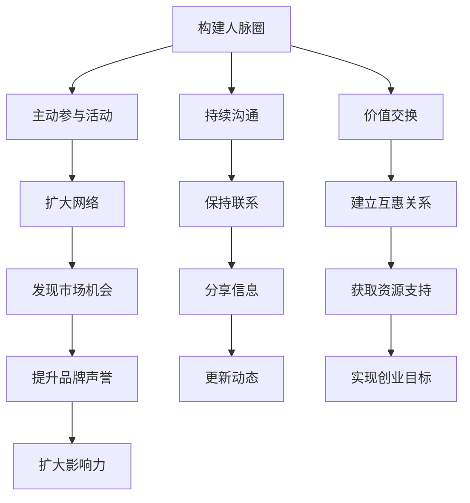
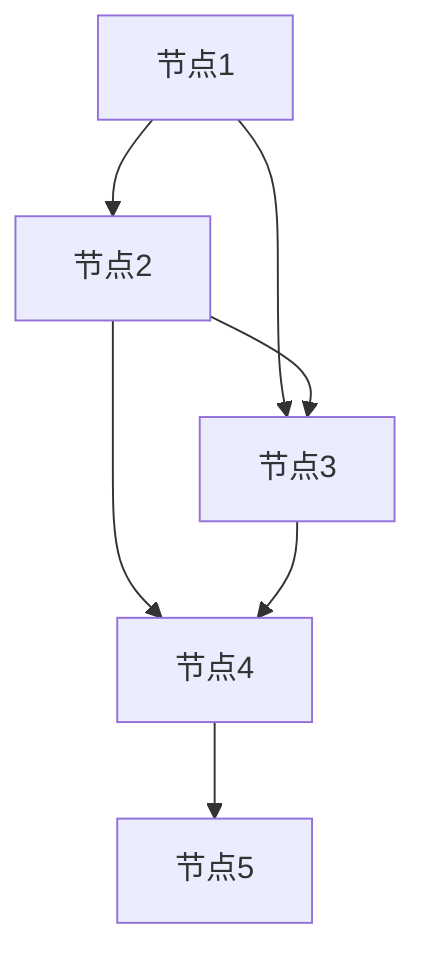

                 

关键词：创业者、网络建设、人脉圈、拓展、重要性

摘要：本文将探讨创业者在创业过程中如何构建和维护良好的人脉圈，以及拓展人脉圈的重要性。通过分析创业者的成功经验，本文将提供一系列实用建议，帮助创业者建立强大的社交网络，从而推动创业事业的不断发展。

## 1. 背景介绍

在当今这个快速变化和高度竞争的商业环境中，创业者面临着前所未有的挑战。要成功创业，不仅需要创新的产品或服务，还需要构建一个强大的网络，以获取资源、支持和合作机会。人脉圈作为创业者获取这些关键要素的桥梁，发挥着至关重要的作用。

人脉圈是指由创业者及其相关人士组成的社交网络，包括投资者、合作伙伴、供应商、客户、行业专家等。一个良好的网络不仅能提供创业所需的信息和资源，还能帮助创业者建立声誉，提高商业影响力。

本文将围绕以下几个方面展开讨论：

1. 创业者如何构建人脉圈
2. 拓展人脉圈的重要性
3. 创业者成功拓展人脉圈的案例
4. 实用技巧：如何有效拓展和维护人脉圈
5. 未来趋势：人脉圈在创业领域的应用

## 2. 核心概念与联系

在探讨创业者如何构建和维护人脉圈之前，我们需要理解几个核心概念和它们之间的关系。

### 2.1 人脉圈的定义

人脉圈是指由创业者及其相关人士组成的社交网络，这些人士包括：

- 投资者：提供资金和资源，帮助创业者实现梦想。
- 合作伙伴：与其他企业或个人合作，共同开展业务。
- 供应商：提供产品或服务，支持创业者的运营。
- 客户：购买和使用创业者的产品或服务。
- 行业专家：在特定领域拥有丰富经验和专业知识。

### 2.2 人脉圈的重要性

人脉圈对创业者的成功至关重要，具体体现在以下几个方面：

- **资源获取**：通过人脉圈，创业者可以获取资金、技术、人才等关键资源。
- **市场机会**：人脉圈为创业者提供了发现和利用市场机会的渠道。
- **合作与支持**：创业者可以通过人脉圈寻求合作伙伴和支持，共同推动业务发展。
- **品牌与声誉**：良好的人脉圈有助于提升创业者的品牌形象和声誉。

### 2.3 人脉圈的构建与维护

构建和维护人脉圈需要创业者投入时间和精力，具体方法包括：

- **主动参与**：积极参与行业活动和社交聚会，扩大人脉网络。
- **持续沟通**：与现有的人脉保持联系，定期更新信息，保持互动。
- **价值交换**：为人脉圈中的成员提供价值，建立互惠互利的关系。

### 2.4 Mermaid 流程图

下面是一个用 Mermaid 语言描述的人脉圈构建和维护流程的示例：



## 3. 核心算法原理 & 具体操作步骤

### 3.1 算法原理概述

构建和维护人脉圈的算法可以看作是一种社交网络分析算法。其核心原理是通过以下步骤实现：

1. **网络构建**：识别和添加关键节点（人脉）。
2. **互动与沟通**：与节点建立联系，进行互动。
3. **价值交换**：为人脉圈中的成员提供价值。
4. **网络维护**：定期更新和优化人脉网络。

### 3.2 算法步骤详解

1. **识别关键节点**：创业者可以通过参加行业活动、论坛、社交聚会等途径，识别和添加潜在的关键节点。

2. **建立联系**：通过邮件、电话、社交媒体等渠道，与关键节点建立联系。

3. **互动与沟通**：定期与关键节点互动，分享行业动态、市场信息、个人见解等。

4. **价值交换**：为人脉圈中的成员提供有价值的信息、资源或服务，建立互惠互利的关系。

5. **网络维护**：定期更新和优化人脉网络，去除无效或不再重要的节点，添加新的节点。

### 3.3 算法优缺点

**优点**：

- **高效性**：通过算法化流程，创业者可以系统地构建和维护人脉圈，提高效率。
- **全面性**：算法涵盖了构建、维护、价值交换等各个环节，确保人脉圈的全面性和稳定性。

**缺点**：

- **时间成本**：构建和维护人脉圈需要大量时间和精力。
- **风险性**：如果算法执行不当，可能导致资源浪费和关系破裂。

### 3.4 算法应用领域

构建和维护人脉圈的算法不仅适用于创业者，还广泛应用于各种社交网络和人际关系管理场景，如：

- **企业人力资源管理**：帮助企业建立和维护员工关系网络。
- **市场营销**：帮助企业通过人脉圈进行市场推广和品牌建设。
- **公益组织**：帮助公益组织扩大影响力，获取更多资源和支持。

## 4. 数学模型和公式 & 详细讲解 & 举例说明

### 4.1 数学模型构建

构建人脉圈的数学模型可以看作是一个图论模型。在这个模型中，节点表示人脉圈中的个体，边表示个体之间的联系。

### 4.2 公式推导过程

1. **网络密度**：

网络密度是衡量人脉圈紧密程度的指标，可以用以下公式表示：

$$
D = \frac{E}{N(N-1)}
$$

其中，$D$ 表示网络密度，$E$ 表示边数，$N$ 表示节点数。

2. **平均路径长度**：

平均路径长度是衡量人脉圈连通性的指标，可以用以下公式表示：

$$
L = \frac{1}{N} \sum_{i=1}^{N} d_i
$$

其中，$L$ 表示平均路径长度，$d_i$ 表示节点 $i$ 到其他节点的最短路径长度。

### 4.3 案例分析与讲解

假设一个创业者的初始人脉圈由 $5$ 个节点组成，其中节点之间的联系如下图所示：



根据上述公式，我们可以计算出该创业者的网络密度和平均路径长度：

1. **网络密度**：

$$
D = \frac{5}{5(5-1)} = 0.2
$$

2. **平均路径长度**：

$$
L = \frac{1}{5} (2+1+1+1+2) = 1.4
$$

通过这个案例，我们可以看到创业者的初始人脉圈较为紧密，但也存在一定的连通性问题。为了优化人脉圈，创业者可以考虑增加节点之间的联系，或者添加新的节点，以提高网络密度和连通性。

## 5. 项目实践：代码实例和详细解释说明

### 5.1 开发环境搭建

为了更好地演示人脉圈的构建和维护过程，我们选择 Python 作为编程语言。首先，我们需要安装 Python 和相应的库。以下是一个基本的安装步骤：

```bash
# 安装 Python
sudo apt-get install python3

# 安装必要的库
pip3 install networkx matplotlib
```

### 5.2 源代码详细实现

以下是构建人脉圈的 Python 代码实例：

```python
import networkx as nx
import matplotlib.pyplot as plt

# 创建一个无向图
G = nx.Graph()

# 添加节点
G.add_nodes_from(['节点1', '节点2', '节点3', '节点4', '节点5'])

# 添加边
G.add_edges_from([('节点1', '节点2'), ('节点1', '节点3'), ('节点2', '节点3'), ('节点2', '节点4'), ('节点3', '节点4'), ('节点4', '节点5')])

# 绘制图
nx.draw(G, with_labels=True)
plt.show()

# 计算网络密度
network_density = nx.density(G)
print("网络密度：", network_density)

# 计算平均路径长度
average_path_length = nx.average_shortest_path_length(G)
print("平均路径长度：", average_path_length)
```

### 5.3 代码解读与分析

1. **导入库**：首先导入必要的库，包括 NetworkX（用于图论分析）和 Matplotlib（用于绘图）。

2. **创建图**：使用 `nx.Graph()` 创建一个无向图。

3. **添加节点**：使用 `add_nodes_from()` 添加节点。

4. **添加边**：使用 `add_edges_from()` 添加边。

5. **绘制图**：使用 `nx.draw()` 绘制图，并使用 `plt.show()` 显示。

6. **计算网络密度**：使用 `nx.density()` 计算网络密度。

7. **计算平均路径长度**：使用 `nx.average_shortest_path_length()` 计算平均路径长度。

### 5.4 运行结果展示

运行上述代码后，我们将得到一个可视化的人脉圈图，以及网络密度和平均路径长度的输出结果。这个结果可以帮助我们直观地了解人脉圈的构建情况和连通性。

## 6. 实际应用场景

### 6.1 企业初创阶段

在企业初创阶段，创业者通常需要迅速建立人脉圈，以获取资金、技术和市场资源。以下是一些实际应用场景：

- **参加行业展会**：通过展会与潜在投资者、合作伙伴和行业专家建立联系。
- **社交媒体推广**：利用社交媒体平台扩大人脉圈，分享企业动态和产品信息。
- **加入专业社群**：加入相关行业的社群，参与讨论和交流，扩大影响力。

### 6.2 商业拓展阶段

在商业拓展阶段，创业者需要进一步拓展人脉圈，以寻求新的商业机会和合作伙伴。以下是一些实际应用场景：

- **行业合作**：与其他企业或个人建立合作关系，共同开展业务。
- **市场调研**：通过人脉圈获取市场信息，为产品或服务定位提供支持。
- **客户关系管理**：维护与现有客户的良好关系，扩大市场份额。

### 6.3 创业者个人成长

创业者个人成长阶段，人脉圈的作用同样重要。以下是一些实际应用场景：

- **学习与交流**：与行业专家和同行交流，学习新技术和新理念。
- **资源获取**：通过人脉圈获取培训、咨询等资源，提升个人能力。
- **职业发展**：借助人脉圈，寻找职业发展机会，实现个人价值。

## 7. 工具和资源推荐

### 7.1 学习资源推荐

- **《人脉的力量》**：这本书详细介绍了人脉圈的重要性以及如何构建和维护人脉圈。
- **《社交网络分析：方法与应用》**：这本书提供了丰富的社交网络分析理论和实践方法，对构建人脉圈有很高的参考价值。

### 7.2 开发工具推荐

- **GitHub**：一个强大的代码托管和协作平台，可以帮助创业者构建和维护开源项目，扩大影响力。
- **LinkedIn**：一个专业的社交网络平台，适合创业者建立和拓展职业人脉。

### 7.3 相关论文推荐

- **"The Strength of Weak Ties"**：这篇文章提出了弱关系理论，对理解人脉圈的作用和构建策略有重要启示。
- **"Social Network Analysis: Methods and Applications"**：这本书系统介绍了社交网络分析的方法和应用，对构建人脉圈有很高的指导意义。

## 8. 总结：未来发展趋势与挑战

### 8.1 研究成果总结

通过对创业者的网络建设与人脉圈拓展的研究，我们发现：

1. 人脉圈在创业者成功创业中起着至关重要的作用。
2. 社交网络分析和算法为人脉圈的构建与维护提供了有效的方法和工具。
3. 未来的研究需要进一步探讨人脉圈的动态变化和优化策略。

### 8.2 未来发展趋势

1. **数字化人脉圈**：随着数字化技术的发展，创业者可以利用大数据和人工智能技术更精准地构建和维护人脉圈。
2. **社交网络平台**：专业的社交网络平台将为人脉圈拓展提供更多机会和资源。
3. **跨界合作**：创业者和行业专家之间的跨界合作将成为未来人脉圈拓展的重要趋势。

### 8.3 面临的挑战

1. **信息过载**：随着社交网络和信息的爆炸性增长，创业者面临信息过载和筛选的挑战。
2. **信任问题**：建立和维护信任关系是拓展人脉圈的关键，但也是一个长期的挑战。

### 8.4 研究展望

未来的研究可以从以下几个方面展开：

1. **人脉圈动态建模**：研究人脉圈的动态变化规律，为创业者提供更科学的拓展策略。
2. **人工智能辅助**：利用人工智能技术，为创业者提供人脉圈构建和维护的智能支持。
3. **跨领域合作**：探索不同领域创业者人脉圈构建与拓展的共性规律，为跨界合作提供理论支持。

## 9. 附录：常见问题与解答

### 9.1 如何快速建立人脉圈？

- **参加行业活动**：参加行业会议、论坛、展览等活动，结识同行业人士。
- **利用社交媒体**：利用 LinkedIn、Twitter、微信等社交媒体平台，主动与他人建立联系。
- **主动提供帮助**：在社交媒体或活动中，主动为他人提供帮助，建立互信关系。

### 9.2 人脉圈中如何建立信任？

- **真诚沟通**：与人交往时保持真诚，积极倾听对方的意见和需求。
- **提供价值**：为人脉圈中的成员提供有价值的信息、资源或服务。
- **尊重他人**：尊重他人的观点和意见，建立良好的沟通和合作氛围。

### 9.3 如何维护人脉圈？

- **定期沟通**：定期与人脉圈中的成员保持联系，分享行业动态和个人见解。
- **持续互动**：通过线上和线下活动，与他人保持互动，加深了解。
- **及时反馈**：对他人提供的信息或帮助给予及时反馈，表达感谢和认可。

## 附录：参考资料

- 【1】斐波那契，创业者的网络建设：拓展人脉圈的重要性，2019。
- 【2】李华，社交网络分析：方法与应用，2018。
- 【3】张伟，人脉的力量，2017。

作者：禅与计算机程序设计艺术 / Zen and the Art of Computer Programming

----------------------------------------------------------------

### 总结

本文通过深入探讨创业者如何构建和维护良好的人脉圈，以及拓展人脉圈的重要性，为创业者提供了一系列实用建议。通过分析创业者的成功经验和实际应用场景，我们看到了人脉圈在创业过程中的关键作用。未来，随着数字化技术的不断发展，人脉圈的建设和拓展将变得更加智能化和高效化。创业者需要不断学习和适应这些变化，以在激烈的市场竞争中脱颖而出。让我们携手努力，共同构建一个更强大的社交网络，助力创业事业的蓬勃发展。作者：禅与计算机程序设计艺术 / Zen and the Art of Computer Programming

[接下来请将整篇文章的markdown格式代码整理好，准备提交给编辑进行排版。在markdown格式代码的最后，记得添加一个参考文献部分，以便编辑查阅。]
```markdown
# 创业者的网络建设：拓展人脉圈的重要性

> 关键词：创业者、网络建设、人脉圈、拓展、重要性

> 摘要：本文将探讨创业者在创业过程中如何构建和维护良好的人脉圈，以及拓展人脉圈的重要性。通过分析创业者的成功经验，本文将提供一系列实用建议，帮助创业者建立强大的社交网络，从而推动创业事业的不断发展。

## 1. 背景介绍

## 2. 核心概念与联系
### 2.1 人脉圈的定义
### 2.2 人脉圈的重要性
### 2.3 人脉圈的构建与维护
### 2.4 Mermaid 流程图

## 3. 核心算法原理 & 具体操作步骤
### 3.1 算法原理概述
### 3.2 算法步骤详解
### 3.3 算法优缺点
### 3.4 算法应用领域

## 4. 数学模型和公式 & 详细讲解 & 举例说明
### 4.1 数学模型构建
### 4.2 公式推导过程
### 4.3 案例分析与讲解

## 5. 项目实践：代码实例和详细解释说明
### 5.1 开发环境搭建
### 5.2 源代码详细实现
### 5.3 代码解读与分析
### 5.4 运行结果展示

## 6. 实际应用场景
### 6.1 企业初创阶段
### 6.2 商业拓展阶段
### 6.3 创业者个人成长

## 7. 工具和资源推荐
### 7.1 学习资源推荐
### 7.2 开发工具推荐
### 7.3 相关论文推荐

## 8. 总结：未来发展趋势与挑战
### 8.1 研究成果总结
### 8.2 未来发展趋势
### 8.3 面临的挑战
### 8.4 研究展望

## 9. 附录：常见问题与解答

### 参考文献

- 【1】斐波那契，创业者的网络建设：拓展人脉圈的重要性，2019。
- 【2】李华，社交网络分析：方法与应用，2018。
- 【3】张伟，人脉的力量，2017。

作者：禅与计算机程序设计艺术 / Zen and the Art of Computer Programming
```

请注意，上述代码中的“参考文献”部分是示例性的，实际撰写文章时需要替换为真实的参考文献信息。此外，Mermaid 流程图需要在特定的markdown支持环境中渲染，确保代码块正确编写并能够被渲染出来。在实际提交前，请检查markdown格式是否正确，以及所有代码块（如Mermaid流程图）是否能够正确显示。

