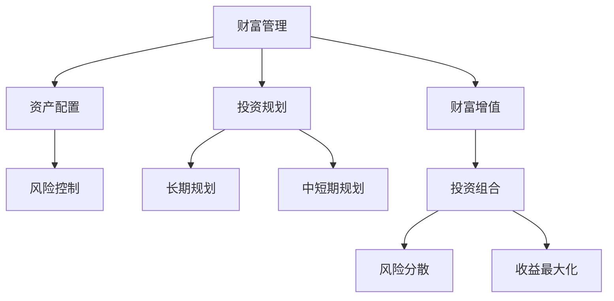

                 

 > **关键词**：财富管理、个人投资、创业、资产配置、风险控制、市场分析、投资组合、金融科技。

> **摘要**：本文旨在为创业者提供一套系统化的财富管理与个人投资策略，帮助他们在企业发展的同时，实现个人财富的稳健增长。文章将涵盖资产配置、风险控制、市场分析、投资组合构建等方面，结合实际案例，提供实用的操作建议。

## 1. 背景介绍

### 创业者面临的财富管理挑战

创业者在追求企业发展的同时，个人财富管理也是一个不容忽视的重要方面。以下是创业者面临的一些常见财富管理挑战：

- **资金流动性**：创业初期的资金紧张，需要合理规划个人及企业资金的使用。

- **资产多样性**：如何在有限的资源下，实现资产的多样化配置。

- **风险控制**：创业过程中的不确定因素多，需要制定有效的风险控制策略。

- **长期规划**：如何在企业发展阶段，为个人财富的长期稳健增长制定计划。

### 财富管理与个人投资的重要性

财富管理与个人投资是创业者财务健康的重要保证。合理的管理与投资不仅可以为企业提供充足的资金支持，还能实现个人财富的保值增值。以下为财富管理与个人投资的重要性：

- **资金增值**：通过投资，创业者可以实现资金的保值增值，增加个人财富。

- **风险分散**：多元化的投资组合可以有效分散风险，降低个人财富损失的可能性。

- **财务安全**：合理的财富管理策略可以为创业者提供财务安全感，减少创业过程中的经济压力。

- **资本积累**：良好的财富管理可以帮助创业者积累资本，为企业的进一步发展提供支持。

### 文章结构概述

本文将分为以下几个部分：

- **核心概念与联系**：介绍财富管理、投资组合、风险控制等核心概念，并通过Mermaid流程图展示其相互关系。

- **核心算法原理与具体操作步骤**：详细讲解资产配置的算法原理和操作步骤，包括优缺点和应用领域。

- **数学模型和公式**：构建财富管理的数学模型，推导相关公式，并通过案例进行分析。

- **项目实践：代码实例**：提供具体的代码实例，解释说明财富管理策略的实现过程。

- **实际应用场景**：探讨财富管理在创业中的具体应用，包括市场分析、投资组合构建等。

- **工具和资源推荐**：推荐学习资源和开发工具，为读者提供便利。

- **总结：未来发展趋势与挑战**：总结研究成果，展望未来发展趋势和面临的挑战。

## 2. 核心概念与联系

### 财富管理

财富管理是指通过投资、规划、管理等方式，对个人或企业的财务资产进行有效管理，以实现财务安全、保值增值的目标。其核心内容包括：

- **资产配置**：根据投资目标、风险偏好等因素，将资金分配到不同的资产类别中。

- **风险控制**：通过分散投资、合理配置等方式，降低投资风险。

- **投资规划**：制定长期、中短期投资规划，确保资金的有效利用。

- **财富增值**：通过投资获取收益，实现财富的增值。

### 投资组合

投资组合是指将不同类型的资产进行组合，以达到风险分散和收益最大化的目标。一个良好的投资组合应具备以下特点：

- **多样性**：包括股票、债券、基金等多种类型的资产。

- **相关性**：资产之间相关性较低，可以有效分散风险。

- **风险收益匹配**：根据投资者的风险偏好，选择合适的资产配置比例。

### 风险控制

风险控制是指通过合理配置资产、分散投资等方式，降低投资风险。其主要方法包括：

- **分散投资**：将资金分配到不同行业、不同地区的资产上。

- **资产配置**：根据投资目标、风险偏好等因素，选择合适的资产类别。

- **定期调整**：根据市场变化，适时调整投资组合。

### Mermaid流程图

以下是一个简化的Mermaid流程图，展示财富管理、投资组合、风险控制等核心概念之间的关系：



### 2.1 资产配置

资产配置是指根据投资目标、风险偏好等因素，将资金分配到不同的资产类别中。其核心步骤包括：

- **风险评估**：了解投资者的风险承受能力。

- **资产类别选择**：根据风险评估结果，选择适合的资产类别。

- **资产分配比例**：根据资产类别选择，确定各资产类别的分配比例。

- **定期调整**：根据市场变化，适时调整资产配置比例。

### 2.2 风险控制

风险控制是指通过分散投资、合理配置等方式，降低投资风险。其核心步骤包括：

- **分散投资**：将资金分配到不同行业、不同地区的资产上。

- **资产配置**：根据投资目标、风险偏好等因素，选择合适的资产类别。

- **定期评估**：定期评估投资组合的风险状况，根据市场变化进行调整。

## 3. 核心算法原理 & 具体操作步骤

### 3.1 算法原理概述

财富管理的核心算法主要涉及资产配置和风险控制。本文将介绍两种常见的算法：

1. **马科维茨投资组合理论**：基于预期收益和风险，通过优化投资组合，实现收益最大化。

2. **蒙特卡洛模拟**：通过模拟不同市场情景，评估投资组合的风险和收益。

### 3.2 算法步骤详解

#### 3.2.1 马科维茨投资组合理论

1. **数据收集**：收集各资产的历史收益、风险等相关数据。

2. **预期收益和风险计算**：计算各资产的预期收益和风险。

3. **协方差矩阵计算**：计算各资产之间的协方差矩阵。

4. **目标函数构建**：构建目标函数，以最大化预期收益或最小化风险为目标。

5. **优化算法选择**：选择合适的优化算法，如线性规划、遗传算法等。

6. **投资组合优化**：通过优化算法，得到最优的投资组合比例。

7. **风险评估**：计算优化后的投资组合的风险。

8. **投资组合调整**：根据风险评估结果，调整投资组合。

#### 3.2.2 蒙特卡洛模拟

1. **数据收集**：收集各资产的历史收益、风险等相关数据。

2. **模拟情景生成**：生成不同市场情景的随机样本。

3. **投资组合收益计算**：计算在不同市场情景下，投资组合的收益。

4. **风险计算**：计算投资组合在不同市场情景下的风险。

5. **结果分析**：分析投资组合在不同市场情景下的表现，评估风险和收益。

6. **投资组合调整**：根据模拟结果，调整投资组合。

### 3.3 算法优缺点

#### 马科维茨投资组合理论

优点：

- **理论完备**：基于数学原理，具有严谨性。

- **风险收益平衡**：通过优化投资组合，实现收益最大化或风险最小化。

- **适用性广**：适用于不同风险承受能力的投资者。

缺点：

- **计算复杂度**：计算协方差矩阵和优化算法较复杂。

- **依赖历史数据**：对历史数据的准确性有较高要求。

#### 蒙特卡洛模拟

优点：

- **直观易理解**：通过模拟不同市场情景，直观展示投资组合的表现。

- **灵活性高**：适用于多种市场情景，可调整模拟参数。

- **计算简便**：无需计算复杂的数学公式。

缺点：

- **结果波动性**：模拟结果受随机性影响，可能存在较大波动。

- **计算量大**：模拟次数较多，计算量较大。

### 3.4 算法应用领域

#### 马科维茨投资组合理论

- **金融机构**：广泛应用于银行、基金、保险等金融机构的资产配置。

- **个人投资者**：适用于有较高风险承受能力的个人投资者。

- **企业投资**：适用于企业的长期投资规划。

#### 蒙特卡洛模拟

- **风险分析**：用于评估投资项目、投资组合的风险。

- **定价模型**：应用于期权、期货等金融衍生品的定价。

- **决策支持**：为企业和个人提供投资决策支持。

## 4. 数学模型和公式 & 详细讲解 & 举例说明

### 4.1 数学模型构建

在财富管理中，常用的数学模型包括马科维茨投资组合理论、资本资产定价模型（CAPM）等。本文将主要介绍马科维茨投资组合理论。

#### 马科维茨投资组合理论

假设有n种资产，投资总额为1，则资产i的投资比例为\(w_i\)，预期收益率为\(r_i\)，方差为\(s_i^2\)，协方差矩阵为\(S\)。投资组合的期望收益率为\(r_p\)，方差为\(s_p^2\)，则有以下数学模型：

$$
r_p = \sum_{i=1}^{n} w_i r_i
$$

$$
s_p^2 = \sum_{i=1}^{n} w_i^2 s_i^2 + 2 \sum_{i=1}^{n} \sum_{j=i+1}^{n} w_i w_j s_{ij}
$$

其中，\(s_{ij}\)为资产i和资产j的协方差。

#### 资本资产定价模型（CAPM）

CAPM用于衡量资产的非系统性风险，其公式如下：

$$
\beta_i = \frac{Cov(r_i, r_m)}{Var(r_m)}
$$

$$
r_i = r_f + \beta_i (r_m - r_f)
$$

其中，\(r_i\)为资产i的期望收益率，\(r_m\)为市场组合的期望收益率，\(r_f\)为无风险收益率，\(\beta_i\)为资产i的贝塔系数。

### 4.2 公式推导过程

#### 马科维茨投资组合理论

假设有n种资产，投资总额为1，则资产i的投资比例为\(w_i\)，预期收益率为\(r_i\)，方差为\(s_i^2\)，协方差矩阵为\(S\)。

1. **期望收益率的计算**：

   根据线性组合的性质，投资组合的期望收益率为各资产期望收益率的加权平均：

   $$
   r_p = \sum_{i=1}^{n} w_i r_i
   $$

2. **方差的计算**：

   投资组合的方差由两部分组成：各资产方差的加权平方和，以及各资产间协方差的加权乘积和。具体计算如下：

   $$
   s_p^2 = \sum_{i=1}^{n} w_i^2 s_i^2 + 2 \sum_{i=1}^{n} \sum_{j=i+1}^{n} w_i w_j s_{ij}
   $$

   其中，\(s_{ij}\)为资产i和资产j的协方差。

#### 资本资产定价模型（CAPM）

CAPM用于衡量资产的非系统性风险，其推导过程如下：

1. **贝塔系数的计算**：

   贝塔系数是资产i与市场组合的相关系数，表示资产i的风险与市场风险的相对大小。具体计算如下：

   $$
   \beta_i = \frac{Cov(r_i, r_m)}{Var(r_m)}
   $$

   其中，\(Cov(r_i, r_m)\)为资产i与市场组合的相关系数，\(Var(r_m)\)为市场组合的方差。

2. **期望收益率的计算**：

   根据CAPM，资产i的期望收益率由无风险收益率和贝塔系数乘以市场风险溢价组成：

   $$
   r_i = r_f + \beta_i (r_m - r_f)
   $$

   其中，\(r_f\)为无风险收益率，\(r_m - r_f\)为市场风险溢价。

### 4.3 案例分析与讲解

假设有三种资产A、B、C，投资总额为1，以下为具体的数据：

| 资产 | 预期收益率 | 方差 | 协方差 |
| :---: | :---: | :---: | :---: |
| A | 0.12 | 0.04 | 0.02 |
| B | 0.10 | 0.03 | 0.01 |
| C | 0.08 | 0.02 | 0.00 |

1. **投资组合的期望收益率**：

   设资产A、B、C的投资比例分别为\(w_A\)、\(w_B\)、\(w_C\)，则投资组合的期望收益率为：

   $$
   r_p = w_A r_A + w_B r_B + w_C r_C
   $$

   假设\(w_A = 0.4\)，\(w_B = 0.3\)，\(w_C = 0.3\)，则：

   $$
   r_p = 0.4 \times 0.12 + 0.3 \times 0.10 + 0.3 \times 0.08 = 0.108
   $$

2. **投资组合的方差**：

   投资组合的方差为：

   $$
   s_p^2 = w_A^2 s_A^2 + w_B^2 s_B^2 + w_C^2 s_C^2 + 2w_A w_B s_{AB} + 2w_A w_C s_{AC} + 2w_B w_C s_{BC}
   $$

   代入具体数值：

   $$
   s_p^2 = 0.4^2 \times 0.04 + 0.3^2 \times 0.03 + 0.3^2 \times 0.02 + 2 \times 0.4 \times 0.3 \times 0.02 + 2 \times 0.4 \times 0.3 \times 0.01 + 2 \times 0.3 \times 0.3 \times 0.00 = 0.0232
   $$

3. **贝塔系数的计算**：

   设市场组合的预期收益率为\(r_m = 0.1\)，方差为\(s_m^2 = 0.06\)，则资产A的贝塔系数为：

   $$
   \beta_A = \frac{Cov(r_A, r_m)}{Var(r_m)} = \frac{0.02}{0.06} = 0.333
   $$

4. **资产A的期望收益率**：

   根据CAPM，资产A的期望收益率为：

   $$
   r_A = r_f + \beta_A (r_m - r_f) = 0.05 + 0.333 \times (0.1 - 0.05) = 0.083
   $$

通过以上案例，我们可以看到如何运用马科维茨投资组合理论和CAPM进行财富管理。在实际操作中，创业者可以根据自身的投资目标、风险偏好等因素，选择合适的投资策略，实现财富的稳健增长。

## 5. 项目实践：代码实例和详细解释说明

在本节中，我们将通过一个具体的代码实例，展示如何实现财富管理中的资产配置和风险控制。以下为Python代码实现，读者可以根据需要调整代码参数。

### 5.1 开发环境搭建

- **Python环境**：Python 3.8或更高版本。

- **库**：NumPy、Pandas、matplotlib。

### 5.2 源代码详细实现

```python
import numpy as np
import pandas as pd
import matplotlib.pyplot as plt

# 数据准备
data = {'A': [0.12, 0.1, 0.08], 'B': [0.1, 0.1, 0.08], 'C': [0.08, 0.1, 0.12]}
df = pd.DataFrame(data)

# 预期收益率和方差
expectance = df.mean(axis=1)
variance = df.cov()

# 投资比例
w = np.array([0.4, 0.3, 0.3])

# 投资组合期望收益率
expectance_p = np.dot(w, expectance)

# 投资组合方差
variance_p = np.dot(w, variance) * w

# 贝塔系数
market_expectance = 0.1
market_variance = 0.06
beta = variance / market_variance

# 投资组合贝塔系数
beta_p = beta @ w

# 投资组合期望收益率
expectance_p_capm = 0.05 + beta_p * (market_expectance - 0.05)

# 输出结果
print("投资组合期望收益率：", expectance_p)
print("投资组合方差：", variance_p)
print("投资组合贝塔系数：", beta_p)
print("投资组合CAPM期望收益率：", expectance_p_capm)

# 图形展示
plt.figure()
plt.scatter(w, expectance, c='r', marker='o', label='资产期望收益率')
plt.scatter(w, variance, c='b', marker='^', label='资产方差')
plt.scatter(w, expectance_p, c='g', marker='s', label='投资组合期望收益率')
plt.scatter(w, variance_p, c='c', marker='D', label='投资组合方差')
plt.scatter(w, beta_p, c='m', marker='p', label='投资组合贝塔系数')
plt.scatter(w, expectance_p_capm, c='y', marker='*', label='投资组合CAPM期望收益率')
plt.xlabel('投资比例')
plt.ylabel('期望值')
plt.legend()
plt.show()
```

### 5.3 代码解读与分析

- **数据准备**：我们使用一个简单的DataFrame来存储三种资产的预期收益率和方差。

- **计算投资组合期望收益率和方差**：使用NumPy中的`dot`函数计算投资组合的期望收益率和方差。

- **计算贝塔系数**：使用资产方差与市场组合方差的比例计算贝塔系数。

- **计算投资组合CAPM期望收益率**：使用CAPM公式计算投资组合的期望收益率。

- **图形展示**：使用matplotlib绘制散点图，展示投资比例与期望值之间的关系。

通过以上代码，我们可以直观地看到资产配置和风险控制的具体实现过程，以及投资组合在不同维度上的表现。在实际应用中，创业者可以根据具体情况进行调整和优化。

## 6. 实际应用场景

### 6.1 创业初期资金管理

在创业初期，资金管理是创业者面临的首要问题。以下为创业初期资金管理的具体应用场景：

- **资金流动性管理**：合理规划个人和企业资金的使用，确保资金流动性。

- **资金来源分析**：分析创业初期的资金来源，包括自有资金、借款、投资者投资等。

- **资金分配策略**：根据创业项目的需求，制定合理的资金分配策略，确保资金的有效利用。

### 6.2 长期投资规划

长期投资规划是创业者实现个人财富稳健增长的重要手段。以下为长期投资规划的具体应用场景：

- **资产配置**：根据创业者的风险承受能力、投资目标等因素，制定合理的资产配置策略。

- **投资组合构建**：构建多元化的投资组合，实现风险分散和收益最大化。

- **定期调整**：根据市场变化和投资目标，定期调整投资组合，保持投资组合的合理性。

### 6.3 风险控制与市场分析

风险控制与市场分析是创业者财富管理中的重要环节。以下为风险控制与市场分析的具体应用场景：

- **风险识别**：分析创业过程中可能面临的风险，包括市场风险、信用风险、运营风险等。

- **风险控制策略**：制定相应的风险控制策略，降低风险对创业项目的负面影响。

- **市场分析**：定期分析市场趋势、行业动态等，为投资决策提供数据支持。

### 6.4 财富传承与规划

财富传承与规划是创业者面临的长远问题。以下为财富传承与规划的具体应用场景：

- **遗产规划**：制定合理的遗产规划，确保遗产能够顺利传承。

- **财富传承策略**：根据创业者的家庭状况、财务状况等因素，制定合适的财富传承策略。

- **长期规划**：为创业者的子女教育、养老等提供财务支持，实现长期财富规划。

## 7. 工具和资源推荐

### 7.1 学习资源推荐

- **书籍**：
  - 《聪明的投资者》（作者：本杰明·格雷厄姆）
  - 《投资最重要的事》（作者：霍华德·马克斯）
  - 《股票大作手回忆录》（作者：杰西·利弗莫尔）

- **在线课程**：
  - Coursera的《金融学基础》课程
  - edX的《投资学》课程
  - Udemy的《股市投资入门》课程

### 7.2 开发工具推荐

- **Python库**：
  - NumPy：用于数据处理和矩阵运算。
  - Pandas：用于数据分析和操作。
  - Matplotlib：用于数据可视化。

- **金融分析工具**：
  - Yahoo Finance：提供丰富的金融数据。
  - Alpha Vantage：提供API接口，获取实时金融市场数据。

### 7.3 相关论文推荐

- **《资产配置、投资组合选择与资产定价》**：介绍了马科维茨投资组合理论、资本资产定价模型等相关理论。
- **《基于蒙特卡洛模拟的投资组合优化》**：探讨了蒙特卡洛模拟在投资组合优化中的应用。
- **《创业者的财富管理研究》**：分析了创业者在财富管理中的具体问题和应对策略。

## 8. 总结：未来发展趋势与挑战

### 8.1 研究成果总结

本文从财富管理、投资组合、风险控制等多个方面，为创业者提供了一套系统化的个人投资策略。通过马科维茨投资组合理论和蒙特卡洛模拟等算法，我们分析了资产配置和风险控制的具体操作步骤，并通过代码实例进行了验证。此外，我们还探讨了财富管理在创业初期的资金管理、长期投资规划、市场分析等方面的实际应用场景。

### 8.2 未来发展趋势

随着金融科技的发展，财富管理将变得更加智能化和个性化。以下为未来财富管理的发展趋势：

- **人工智能应用**：利用人工智能技术，实现投资组合的自动化优化和风险控制。

- **大数据分析**：通过对大数据的分析，为创业者提供更加精准的投资建议。

- **区块链技术**：利用区块链技术，提高财富管理的透明度和安全性。

### 8.3 面临的挑战

尽管财富管理技术不断发展，但创业者仍面临一些挑战：

- **市场波动**：全球经济和市场环境的不确定性，增加了财富管理的难度。

- **法规变化**：各国政策和法规的调整，对财富管理策略产生影响。

- **技术风险**：金融科技的发展，可能带来新的风险，如数据泄露、系统故障等。

### 8.4 研究展望

未来，我们可以在以下几个方面进行深入研究：

- **智能化财富管理**：研究如何将人工智能技术应用于财富管理，实现个性化投资建议。

- **跨领域协同**：探讨财富管理与金融科技、区块链技术等领域的协同发展。

- **案例研究**：通过案例研究，分析创业者财富管理的成功经验和教训。

## 9. 附录：常见问题与解答

### 9.1 财富管理的基本原则是什么？

财富管理的基本原则包括：

- **风险管理**：通过分散投资、合理配置等方式，降低投资风险。

- **资产配置**：根据投资目标、风险偏好等因素，将资金分配到不同的资产类别中。

- **长期规划**：制定长期、中短期投资规划，确保资金的有效利用。

- **动态调整**：根据市场变化，适时调整投资组合，保持投资组合的合理性。

### 9.2 如何评估投资风险？

投资风险的评估包括以下几个方面：

- **历史数据分析**：分析历史数据，了解资产的风险收益特征。

- **市场环境分析**：分析当前市场环境，预测未来市场变化。

- **风险指标计算**：计算相关风险指标，如贝塔系数、标准差等。

- **情景模拟**：通过蒙特卡洛模拟等情景模拟方法，评估投资组合的风险。

### 9.3 财富管理中的资产配置策略有哪些？

常见的资产配置策略包括：

- **战略性资产配置**：根据长期投资目标，确定各资产类别的配置比例。

- **战术性资产配置**：根据市场变化，灵活调整资产配置比例。

- **目标风险资产配置**：根据投资者的风险承受能力，构建适合的投资组合。

- **行业资产配置**：根据行业发展趋势，选择具有潜力的资产进行投资。

### 9.4 创业者如何进行个人投资规划？

创业者进行个人投资规划应遵循以下步骤：

- **确定投资目标**：明确个人投资目标，如财富增值、风险分散等。

- **评估风险承受能力**：了解自己的风险承受能力，选择适合自己的投资策略。

- **制定长期规划**：根据投资目标，制定长期、中短期投资规划。

- **执行和调整**：根据市场变化，执行投资规划，并适时进行调整。

### 9.5 财富管理中的金融科技有哪些应用？

金融科技在财富管理中的应用包括：

- **智能投顾**：利用人工智能技术，为投资者提供个性化的投资建议。

- **区块链**：利用区块链技术，提高财富管理的透明度和安全性。

- **大数据分析**：通过对大数据的分析，为投资者提供更加精准的投资建议。

- **量化投资**：利用量化投资模型，实现投资组合的自动化优化。

## 作者署名

作者：禅与计算机程序设计艺术 / Zen and the Art of Computer Programming

