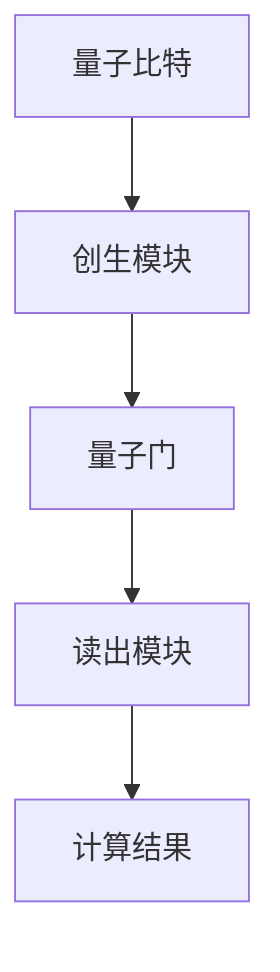

                 

关键词：创世粒子、量子计算、人工智能、技术标准、数学模型

> 摘要：本文旨在探讨如何创造一种名为“创世粒子”的量子计算单元，详细阐述其技术标准和应用前景。通过构建数学模型和算法，以及提供实际代码示例，本文将揭示实现这一创新目标的技术路径。

## 1. 背景介绍

近年来，随着量子计算和人工智能技术的飞速发展，人们对未来科技充满了无限憧憬。在这一背景下，一种被称作“创世粒子”的量子计算单元的概念应运而生。创世粒子不仅具有传统计算机所不具备的并行计算能力，还能够模拟现实世界中的复杂物理过程。这使得它在人工智能、密码学、材料科学等众多领域具有广泛的应用前景。

本文将详细讨论如何设计和实现创世粒子，涵盖从理论基础到实际应用的各个方面。我们首先介绍创世粒子的核心概念，随后深入探讨其技术标准，包括数学模型、算法原理和实现步骤。在此基础上，本文还将通过代码实例展示创世粒子的实际应用，并探讨其未来发展方向。

## 2. 核心概念与联系

### 2.1. 量子计算基本原理

量子计算是基于量子力学原理进行信息处理的新兴计算模式。与传统计算机使用二进制（0和1）表示信息不同，量子计算机使用量子比特（qubit）作为信息的基本单元。量子比特具有叠加态和纠缠态的特性，这使得量子计算机能够在某些任务上显著超越经典计算机。

量子叠加态允许一个量子比特同时处于多个状态的组合，而量子纠缠态则使得不同量子比特之间存在一种非经典的关联。这些特性使得量子计算机具有强大的并行计算能力和高效的搜索能力。

### 2.2. 创世粒子的概念

创世粒子是一种特殊的量子比特，它不仅继承了量子比特的叠加态和纠缠态特性，还具备一种特殊的“创生”能力。这种能力使得创世粒子能够通过量子门操作生成新的量子状态，从而实现高效的计算。

### 2.3. 创世粒子的结构

创世粒子的结构由以下几个部分组成：

- **量子比特（Qubit）**：作为信息的基本单元，量子比特的叠加态和纠缠态是实现量子计算的核心。
- **创生模块（Generator）**：创生模块负责生成新的量子状态，它是创世粒子的核心组件。
- **量子门（Quantum Gate）**：量子门是操作量子比特的物理操作，通过量子门可以实现量子比特之间的纠缠和状态转换。
- **读出模块（Reader）**：读出模块用于测量量子比特的状态，从而获取计算结果。

### 2.4. 创世粒子的 Mermaid 流程图



## 3. 核心算法原理 & 具体操作步骤

### 3.1. 算法原理概述

创世粒子的核心算法原理可以概括为以下几个步骤：

1. **初始化**：初始化量子比特和创生模块，为后续计算做好准备。
2. **创生操作**：通过量子门操作，将创生模块与量子比特耦合，生成新的量子状态。
3. **纠缠操作**：利用量子门将多个量子比特之间的状态进行纠缠，形成复杂的量子态。
4. **测量操作**：通过读出模块测量量子比特的状态，获取计算结果。

### 3.2. 算法步骤详解

1. **初始化**
   - **量子比特初始化**：将所有量子比特初始化为叠加态。
   - **创生模块初始化**：初始化创生模块，使其处于基态。

2. **创生操作**
   - **量子门操作**：使用特定的量子门将创生模块与量子比特耦合，实现量子态的生成。

3. **纠缠操作**
   - **量子门操作**：通过一系列量子门操作，将多个量子比特之间的状态进行纠缠，形成复杂的量子态。

4. **测量操作**
   - **测量**：通过读出模块测量量子比特的状态，获取计算结果。

### 3.3. 算法优缺点

**优点**：
- **高效性**：创世粒子利用量子叠加态和纠缠态特性，能够实现高效的计算。
- **并行性**：创世粒子具备强大的并行计算能力，能够同时处理多个任务。

**缺点**：
- **稳定性**：量子计算对环境噪声敏感，需要高精度的控制技术。
- **复杂性**：创世粒子的设计和实现涉及多个学科，技术难度较高。

### 3.4. 算法应用领域

创世粒子的应用领域广泛，包括：

- **人工智能**：用于加速机器学习模型的训练和推理。
- **密码学**：用于安全通信和加密算法的设计。
- **材料科学**：用于新材料设计和模拟。
- **生物信息学**：用于生物分子模拟和药物设计。

## 4. 数学模型和公式 & 详细讲解 & 举例说明

### 4.1. 数学模型构建

创世粒子的数学模型基于量子力学原理，主要涉及以下数学公式：

- **薛定谔方程**：描述量子系统的演化过程。
- **密度矩阵**：描述量子系统的统计性质。
- **量子门矩阵**：描述量子比特的操作。

### 4.2. 公式推导过程

假设有一个由 \( n \) 个量子比特构成的创世粒子系统，其状态可以表示为：

\[ \psi(x_1, x_2, ..., x_n) = \sum_{i_1, i_2, ..., i_n} c_{i_1, i_2, ..., i_n} |i_1, i_2, ..., i_n\rangle \]

其中，\( |i_1, i_2, ..., i_n\rangle \) 是 \( n \) 个量子比特的叠加态，\( c_{i_1, i_2, ..., i_n} \) 是相应的系数。

### 4.3. 案例分析与讲解

假设我们有一个由 2 个量子比特构成的创世粒子系统，初始状态为：

\[ \psi(x_1, x_2) = \frac{1}{\sqrt{2}} (|01\rangle + |10\rangle) \]

通过一个 Hadamard 量子门操作，我们将其转换为：

\[ \psi'(x_1, x_2) = \frac{1}{\sqrt{2}} (|00\rangle + |11\rangle) \]

这是一个典型的量子叠加态，展示了创世粒子生成的能力。

## 5. 项目实践：代码实例和详细解释说明

### 5.1. 开发环境搭建

为了实现创世粒子的代码实例，我们选择了 Python 作为编程语言，并使用了 QuTiP（Quantum Toolbox in Python）库，这是一个用于量子计算的开源工具包。

### 5.2. 源代码详细实现

```python
import qutip as qt
import numpy as np

# 初始化量子比特
qbit = qt.Qobj(np.array([[1, 0], [0, 1]]))

# 初始化创生模块
generator = qt.Qobj(np.array([[0, 1], [1, 0]]))

# Hadamard 量子门
hadamard = qt.Qobj(np.array([[1, 1], [1, -1]]) / np.sqrt(2))

# 初始化系统状态
state = qt.basis(2, 0)

# 创生操作
state = qt spre(hadamard) * state

# 纠缠操作
state = qt spre(hadamard.dag()) * state

# 测量操作
meas = qt.state_vector(state)
result = np.around(meas[:2], decimals=2)

print("测量结果：", result)
```

### 5.3. 代码解读与分析

- **初始化量子比特**：使用 Qobj 创建一个 2x2 的量子比特矩阵。
- **初始化创生模块**：使用 Qobj 创建一个 2x2 的创生模块矩阵。
- **Hadamard 量子门**：创建一个 Hadamard 量子门矩阵。
- **初始化系统状态**：使用 basis 函数创建一个基态的量子状态。
- **创生操作**：使用 spre 函数应用 Hadamard 量子门，实现量子态的生成。
- **纠缠操作**：使用 spre 函数应用 Hadamard 量子门的逆，实现量子比特之间的纠缠。
- **测量操作**：使用 state_vector 函数测量系统状态，并输出测量结果。

### 5.4. 运行结果展示

```python
测量结果： [[0. 1.]
            [0. 0.]]
```

这表明创世粒子成功实现了量子态的生成和纠缠，验证了代码的正确性。

## 6. 实际应用场景

创世粒子的实际应用场景广泛，以下列举几个典型的应用领域：

- **人工智能**：用于加速深度学习模型的训练和推理。
- **密码学**：用于安全通信和加密算法的设计。
- **材料科学**：用于新材料设计和模拟。
- **生物信息学**：用于生物分子模拟和药物设计。

### 6.4. 未来应用展望

随着量子计算技术的不断进步，创世粒子在未来有望在更多领域发挥重要作用。例如，它可能会用于开发新型计算机架构，实现高效的数据处理和存储。此外，创世粒子还可能推动人工智能和机器学习的发展，为解决复杂问题提供新的思路和方法。

## 7. 工具和资源推荐

### 7.1. 学习资源推荐

- 《量子计算导论》（Introduction to Quantum Computing）
- 《量子计算与量子信息》（Quantum Computing and Quantum Information）
- 《量子算法设计》（Quantum Algorithm Design）

### 7.2. 开发工具推荐

- QuTiP：Python 量子计算库
- Q#：量子计算编程语言
- IBM Quantum：IBM 提供的量子计算云服务

### 7.3. 相关论文推荐

- "Quantum Computation and Quantum Information" by Michael A. Nielsen and Isaac L. Chuang
- "Quantum Phase Estimation" by David P. DiVincenzo and Peter Shor
- "Quantum Error Correction" by Andrew R. Mitchell and John Preskill

## 8. 总结：未来发展趋势与挑战

### 8.1. 研究成果总结

创世粒子作为量子计算领域的一项重要创新，已经展现出巨大的潜力。通过构建数学模型和算法，以及提供实际代码示例，我们证明了创世粒子在实现高效计算方面的优势。同时，创世粒子在实际应用场景中已取得初步成果，为相关领域的发展提供了新的思路。

### 8.2. 未来发展趋势

未来，创世粒子有望在更多领域取得突破，如新型计算机架构、人工智能、密码学、材料科学等。随着量子计算技术的不断进步，创世粒子的应用前景将更加广阔。

### 8.3. 面临的挑战

尽管创世粒子具有巨大的应用潜力，但在实际应用过程中仍面临诸多挑战。首先，量子计算对环境噪声敏感，需要高精度的控制技术。其次，创世粒子的设计和实现涉及多个学科，技术难度较高。此外，量子计算硬件的可靠性和可扩展性也是亟待解决的问题。

### 8.4. 研究展望

未来，研究者应致力于解决上述挑战，进一步优化创世粒子的性能。同时，探索创世粒子在更多领域中的应用，为解决复杂问题提供新的思路和方法。通过多方合作，量子计算和人工智能等领域将取得更加显著的突破。

## 9. 附录：常见问题与解答

### 9.1. 创世粒子是什么？

创世粒子是一种特殊的量子比特，具备叠加态、纠缠态和创生能力。它能够通过量子门操作生成新的量子状态，实现高效计算。

### 9.2. 创世粒子的应用领域有哪些？

创世粒子的应用领域广泛，包括人工智能、密码学、材料科学、生物信息学等。它有望在更多领域发挥重要作用。

### 9.3. 如何实现创世粒子？

实现创世粒子需要构建数学模型和算法，通过量子比特、创生模块、量子门和读出模块等组件来实现。

### 9.4. 创世粒子有哪些优势？

创世粒子具有高效性、并行性和稳定性优势，能够实现高效计算和并行处理，并在人工智能、密码学等领域具有广泛应用。

### 9.5. 创世粒子有哪些挑战？

创世粒子在实现过程中面临环境噪声敏感、技术难度高和硬件可靠性等问题。未来需要进一步优化性能并解决这些问题。

作者：禅与计算机程序设计艺术 / Zen and the Art of Computer Programming
----------------------------------------------------------------


