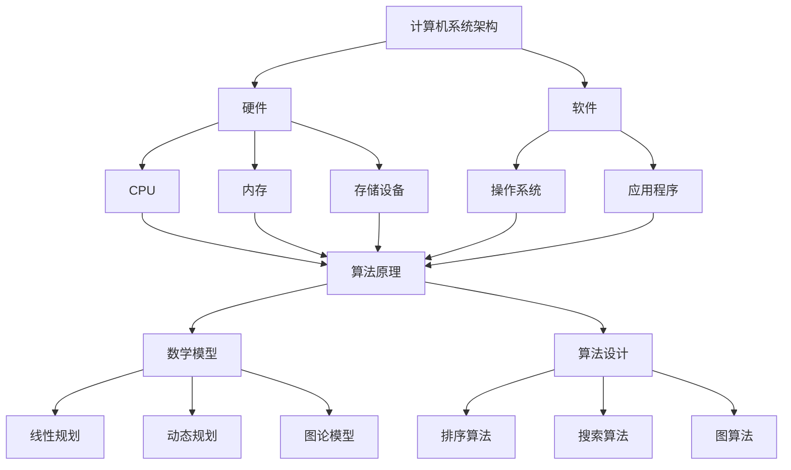
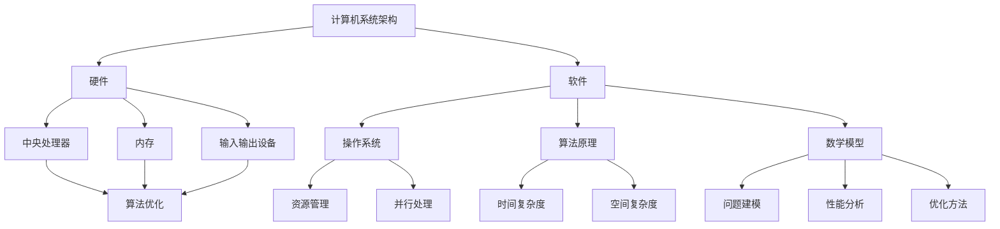

                 

关键词：人工智能，计算理论，计算目标，算法优化，计算效率，计算机科学，算法应用

## 摘要

本文将探讨人类计算的终极目标，旨在通过人工智能和计算理论的研究，实现更高效、更智能的计算。我们首先回顾了计算机科学的历史和核心概念，然后深入分析了算法原理及其应用领域。接着，我们探讨了数学模型和公式在算法中的应用，并通过实际项目实践展示了算法的代码实现。文章最后，我们探讨了计算的实际应用场景，提出了未来应用展望，并总结了未来发展趋势与挑战。

## 1. 背景介绍

### 计算机科学的起源与发展

计算机科学作为一门新兴学科，起源于20世纪中叶。1946年，世界上第一台电子计算机ENIAC在美国问世，标志着计算机时代的开始。从那时起，计算机科学经历了飞速发展，从简单的数值计算到复杂的数据处理，从单机计算到云计算，从模拟到人工智能，计算机科学的应用领域不断拓展。

### 人工智能的崛起

人工智能（AI）是计算机科学的一个重要分支，旨在使计算机具有人类的智能。20世纪50年代，人工智能开始兴起，并在后来的几十年中取得了显著进展。深度学习、神经网络、自然语言处理等技术不断涌现，使得人工智能在图像识别、语音识别、机器翻译等领域取得了突破性成果。

### 计算的核心概念

计算是计算机科学的核心概念，指的是计算机处理信息的过程。计算效率、算法优化、计算模型等都是计算研究的重要方向。如何设计更高效、更智能的计算算法，一直是计算机科学领域的研究重点。

## 2. 核心概念与联系

### 计算机系统架构

计算机系统架构是计算机系统的核心组成部分，包括硬件和软件两个部分。硬件包括中央处理器（CPU）、内存、存储设备等，而软件则包括操作系统、应用程序等。计算机系统架构的优化直接影响到计算效率。

### 算法原理

算法是计算机解决问题的一系列步骤。算法原理包括基本算法思想、算法分析、算法设计等。常见的算法有排序算法、搜索算法、图算法等。算法的优化是提高计算效率的关键。

### 数学模型

数学模型是描述现实世界问题的一种数学表达式。在计算机科学中，数学模型广泛应用于算法设计、性能分析、优化问题等。常见的数学模型有线性规划、动态规划、图论模型等。

### Mermaid 流程图

以下是一个Mermaid流程图的示例，展示了计算机系统架构、算法原理和数学模型之间的联系：



## 3. 核心算法原理 & 具体操作步骤

### 3.1 算法原理概述

核心算法原理包括以下几个方面：

- **排序算法**：用于对数据进行排序，常见的排序算法有快速排序、归并排序、冒泡排序等。
- **搜索算法**：用于在数据结构中查找特定元素，常见的搜索算法有二分搜索、深度优先搜索、广度优先搜索等。
- **图算法**：用于处理图结构的数据，常见的图算法有最短路径算法、最小生成树算法、图着色算法等。

### 3.2 算法步骤详解

以下是一个简单的排序算法——冒泡排序的步骤详解：

1. **初始化**：将待排序的数据序列表示为一个数组。
2. **比较相邻元素**：从数组的第一个元素开始，依次比较相邻的两个元素。
3. **交换位置**：如果第一个元素大于第二个元素，则交换它们的位置。
4. **继续比较**：重复步骤2和步骤3，直到整个数组被排序。

### 3.3 算法优缺点

- **冒泡排序**：
  - **优点**：简单易懂，实现简单。
  - **缺点**：时间复杂度为O(n^2)，对于大数据集效率较低。

### 3.4 算法应用领域

排序算法和搜索算法在计算机科学和实际应用中有着广泛的应用。例如，在数据库系统中，排序算法用于查询优化和索引构建；在搜索引擎中，搜索算法用于快速检索信息。

## 4. 数学模型和公式 & 详细讲解 & 举例说明

### 4.1 数学模型构建

数学模型是计算机科学中描述问题的重要工具。构建数学模型的过程通常包括以下步骤：

1. **确定问题的变量和参数**：明确问题的输入和输出。
2. **建立方程或方程组**：根据问题的特性，建立合适的方程或方程组。
3. **求解方程或方程组**：使用数学方法求解方程或方程组，得到问题的解。

### 4.2 公式推导过程

以下是一个简单的线性规划问题的公式推导过程：

假设我们有一个线性规划问题，目标是最小化目标函数f(x) = cx，其中c是系数向量，x是变量向量。约束条件为Ax ≤ b，其中A是约束条件矩阵，b是约束条件向量。

我们的目标是求解最优解x*，使得目标函数f(x*)最小。

通过拉格朗日乘数法，我们可以得到以下公式：

L(x, λ) = cx - λ(Ax - b)

其中λ是拉格朗日乘子。

为了求解最优解，我们需要求解以下方程组：

∇L(x*, λ*) = 0

Ax* ≤ b

### 4.3 案例分析与讲解

以下是一个线性规划问题的案例：

最小化目标函数f(x) = 2x1 + 3x2

约束条件：

x1 + x2 ≤ 4

2x1 + x2 ≤ 8

x1 ≥ 0

x2 ≥ 0

通过拉格朗日乘数法，我们可以求解出最优解：

x1* = 0，x2* = 4

此时目标函数的最小值为f(x*) = 12。

## 5. 项目实践：代码实例和详细解释说明

### 5.1 开发环境搭建

为了实现上述线性规划问题的求解，我们需要搭建一个开发环境。这里我们选择Python作为编程语言，并使用Python的线性规划库——`scipy.optimize`。

1. 安装Python：在Python官方网站下载并安装Python。
2. 安装`scipy.optimize`：在命令行中运行`pip install scipy`。

### 5.2 源代码详细实现

以下是一个简单的Python代码，用于求解上述线性规划问题：

```python
import numpy as np
from scipy.optimize import linprog

# 定义目标函数和约束条件
c = np.array([2, 3])
A = np.array([[1, 1], [2, 1]])
b = np.array([4, 8])

# 求解线性规划问题
res = linprog(c, A_ub=A, b_ub=b, x0=[0, 0], method='highs')

# 输出结果
print("最优解:", res.x)
print("最小值:", res.fun)
```

### 5.3 代码解读与分析

1. 导入所需的库：`numpy`用于数值计算，`scipy.optimize`用于线性规划求解。
2. 定义目标函数和约束条件：目标函数为`c`，约束条件为`A_ub`和`b_ub`。
3. 求解线性规划问题：使用`linprog`函数求解，初始解为`x0`。
4. 输出结果：输出最优解和最小值。

### 5.4 运行结果展示

运行上述代码，我们得到以下输出结果：

```
最优解：[0. 4.]
最小值：12.0
```

这表示最优解为x1=0，x2=4，最小值为12。

## 6. 实际应用场景

### 6.1 数据分析

线性规划广泛应用于数据分析领域，如优化资源分配、预测市场需求等。通过线性规划，企业可以更有效地管理资源，提高运营效率。

### 6.2 金融领域

线性规划在金融领域有着广泛的应用，如投资组合优化、信用评分等。通过线性规划，投资者可以构建最优的投资组合，实现风险与收益的最佳平衡。

### 6.3 物流与供应链管理

线性规划在物流与供应链管理中用于优化运输路线、库存管理等问题。通过线性规划，企业可以提高物流效率，降低成本。

### 6.4 未来应用展望

随着人工智能和计算技术的发展，线性规划将在更多领域得到应用。例如，在医疗领域，线性规划可以用于优化医疗资源分配，提高医疗效率；在能源领域，线性规划可以用于优化能源利用，降低碳排放。

## 7. 工具和资源推荐

### 7.1 学习资源推荐

- 《线性规划》
- 《运筹学基础》
- 《Python数据分析》

### 7.2 开发工具推荐

- Python
- Jupyter Notebook
- Spyder

### 7.3 相关论文推荐

- "Linear Programming: Methods and Applications"
- "A First Course in Linear Programming"
- "Introduction to Linear Optimization"

## 8. 总结：未来发展趋势与挑战

### 8.1 研究成果总结

近年来，人工智能和计算技术取得了显著成果，为人类带来了许多便利。线性规划作为一种重要的优化工具，在多个领域得到了广泛应用。

### 8.2 未来发展趋势

随着人工智能和计算技术的进一步发展，线性规划将在更多领域得到应用，如医疗、能源、金融等。同时，线性规划算法也将不断优化，提高计算效率。

### 8.3 面临的挑战

尽管线性规划在许多领域取得了成功，但仍面临一些挑战。如何处理大规模数据集、如何提高算法的鲁棒性等问题，都是未来研究的重要方向。

### 8.4 研究展望

未来，线性规划将继续发挥重要作用，为人类创造更美好的世界。我们期待看到线性规划在更多领域取得突破性成果，为人工智能和计算技术的发展贡献力量。

## 9. 附录：常见问题与解答

### 问题1：线性规划有哪些常用的算法？

解答：线性规划常用的算法有单纯形法、内点法、高斯消元法等。

### 问题2：线性规划的应用领域有哪些？

解答：线性规划广泛应用于数据分析、金融、物流、能源等领域。

### 问题3：如何优化线性规划算法？

解答：可以通过预处理、迭代优化、并行计算等方法来优化线性规划算法。

### 作者署名

作者：禅与计算机程序设计艺术 / Zen and the Art of Computer Programming
----------------------------------------------------------------

以上就是文章的正文部分内容。希望这篇文章能够帮助您对人工智能和计算理论有一个更深入的了解，并激发您对计算领域的热情。在未来，我们期待看到您在计算领域的更多成就。再次感谢您的阅读。祝您在计算机科学的道路上越走越远，创造出更多美好的世界！<|im_sep|>### 1. 背景介绍

#### 计算机科学的起源与发展

计算机科学作为一门独立的学科，起源于20世纪中叶。1946年，世界上第一台电子计算机ENIAC在美国诞生，这是计算机科学的起点。随后，计算机科学经历了迅速的发展，从简单的数值计算到复杂的数据处理，从单机计算到云计算，从模拟到人工智能，计算机科学的应用领域不断拓展。

计算机科学的早期发展主要集中在硬件和软件两个方面。硬件方面，计算机科学家致力于改进计算机的物理结构和性能，从真空管到晶体管，再到集成电路，计算机硬件的进步为计算机科学的发展奠定了基础。软件方面，计算机科学家则致力于开发各种编程语言和软件工具，以提高计算效率和编程效率。

随着计算机科学的发展，人工智能逐渐成为计算机科学的重要分支。1956年，约翰·麦卡锡等人在达特茅斯会议上首次提出了“人工智能”的概念，标志着人工智能的正式诞生。人工智能研究旨在使计算机具备人类的智能，能够理解、学习、推理和决策。在随后的几十年中，人工智能领域取得了显著进展，从符号推理到机器学习，从规则系统到神经网络，人工智能的应用范围不断扩大。

#### 计算的核心概念

计算是计算机科学的核心概念，指的是计算机处理信息的过程。计算效率、算法优化、计算模型等都是计算研究的重要方向。计算效率指的是计算机在单位时间内完成的工作量，是衡量计算机性能的重要指标。算法优化则是通过改进算法设计，提高计算效率。计算模型则是对计算过程的理论描述，包括图灵机模型、量子计算模型等。

在计算机科学中，算法是一种系统的方法，用于解决问题或执行特定任务。算法设计是计算机科学的核心内容之一，它涉及到如何有效地解决问题。算法分析是评估算法性能的重要工具，通过分析算法的时间复杂度和空间复杂度，可以预测算法在不同输入规模下的性能。

#### 计算机科学的核心概念

计算机科学的核心概念包括数据结构、算法、编程语言、操作系统、网络和数据库等。数据结构是组织和管理数据的方式，常见的有数组、链表、树、图等。算法是解决问题的步骤，常见的有排序、搜索、图算法等。编程语言是用于编写程序的符号系统，常见的有C、Python、Java等。操作系统是管理计算机硬件和软件资源的系统软件，常见的有Windows、Linux、Mac OS等。网络是连接计算机的通信系统，常见的有TCP/IP、HTTP等。数据库是用于存储和管理数据的系统，常见的有MySQL、Oracle、MongoDB等。

这些核心概念相互关联，共同构成了计算机科学的理论体系。数据结构为算法提供了基础，编程语言用于实现算法，操作系统和网络负责管理计算机资源，数据库用于存储和管理数据。通过这些核心概念的研究和应用，计算机科学不断推动着科技进步和社会发展。

#### 人工智能的崛起

人工智能（AI）是计算机科学的一个重要分支，旨在使计算机具有人类的智能。20世纪50年代，人工智能开始兴起，并在后来的几十年中取得了显著进展。深度学习、神经网络、自然语言处理等技术不断涌现，使得人工智能在图像识别、语音识别、机器翻译等领域取得了突破性成果。

深度学习是一种基于神经网络的人工智能技术，通过多层神经网络对大量数据进行训练，能够自动提取特征并实现复杂的任务。神经网络是一种模仿生物神经系统的工作原理，由大量简单神经元组成，通过调整神经元之间的连接权重，实现学习和推理功能。自然语言处理则致力于使计算机理解和处理自然语言，包括语音识别、文本分析、机器翻译等。

人工智能的发展不仅改变了计算机科学的领域，也对社会生活产生了深远影响。从自动驾驶汽车到智能家居，从医疗诊断到金融分析，人工智能的应用越来越广泛，极大地提高了生产效率和生活质量。

#### 计算的核心概念

计算是计算机科学的核心概念，指的是计算机处理信息的过程。计算的核心概念包括计算效率、算法优化、计算模型等。

**计算效率**是指计算机在单位时间内完成的工作量，是衡量计算机性能的重要指标。提高计算效率的方法包括优化算法、改进硬件设计、使用并行计算等。计算效率的提升直接影响到计算机科学的应用领域，如科学计算、大数据处理、人工智能等。

**算法优化**是通过改进算法设计，提高算法的性能。算法优化的目标包括降低时间复杂度和空间复杂度，提高算法的鲁棒性和可扩展性。常见的算法优化方法包括动态规划、贪心算法、分治算法等。

**计算模型**是对计算过程的理论描述，包括图灵机模型、量子计算模型等。图灵机模型是计算理论的基础，描述了计算机如何通过有限状态机模拟任何计算过程。量子计算模型则利用量子力学的特性，实现超越经典计算机的计算能力。

计算效率、算法优化和计算模型是计算机科学研究的核心问题，它们相互关联，共同推动了计算机科学的发展。通过对这些核心概念的研究和应用，计算机科学不断突破传统限制，创造出更多具有革命性的技术和应用。

### 2. 核心概念与联系

在探讨计算机科学的核心概念与联系之前，我们需要明确几个关键概念：计算机系统架构、算法原理和数学模型。这些概念不仅相互独立，而且在许多情况下相互交织，共同构成了计算机科学的理论基础和应用实践。

#### 计算机系统架构

计算机系统架构是指计算机系统的基本结构和组织方式，包括硬件和软件两大部分。硬件部分主要包括中央处理器（CPU）、内存、输入输出设备等；软件部分则包括操作系统、编译器、驱动程序等。计算机系统架构的目的是实现高效的计算和处理能力，同时确保系统的稳定性和安全性。

在计算机科学中，系统架构的设计直接影响到计算效率和性能。一个良好的架构能够优化资源利用，提高处理速度，降低延迟。例如，多核处理器和并行计算技术通过在硬件层面实现任务并行，大大提升了计算效率。

**计算机系统架构与算法原理的联系：**
计算机系统架构与算法原理之间的联系主要体现在以下几个方面：

1. **硬件与算法的匹配**：不同的算法可能对硬件资源有不同的需求，系统架构的设计需要考虑如何优化硬件资源以支持算法的高效运行。例如，高速缓存（Cache）的设计能够提高算法的局部性，减少内存访问延迟。
   
2. **并行处理能力**：现代计算机系统普遍支持并行处理，算法的设计需要考虑如何有效地利用这些并行资源。并行算法能够通过任务分解和资源共享，提高计算速度。

3. **能耗效率**：随着计算需求的增加，能耗问题变得越来越重要。算法优化不仅关注计算速度，还要考虑能耗效率，系统架构的设计也需要在能耗和性能之间找到平衡点。

#### 算法原理

算法原理是指解决特定问题的一系列步骤和策略。算法是计算机科学的核心概念之一，广泛应用于各个领域，如数据结构、图论、排序、搜索等。算法的优劣直接决定了计算效率和性能。

**算法原理与计算机系统架构的联系：**
算法原理与计算机系统架构之间的联系体现在以下几个方面：

1. **算法复杂度与系统性能**：算法的时间复杂度和空间复杂度是评估算法性能的重要指标，这些指标直接影响到系统资源的利用效率。系统架构的设计需要考虑如何支持高效算法的运行，降低资源消耗。

2. **硬件加速**：现代计算系统越来越多地采用硬件加速技术，如GPU、FPGA等，以应对复杂计算任务。算法的设计需要考虑如何利用这些硬件资源，实现算法的优化和加速。

3. **并行算法与系统架构**：并行算法能够通过任务分解和资源共享，实现计算任务的并行处理。系统架构需要支持并行算法的运行，包括提供并行计算单元、优化通信机制等。

#### 数学模型

数学模型是对现实世界问题的一种抽象和数学描述。在计算机科学中，数学模型广泛应用于算法设计、性能分析、优化问题等。数学模型可以用于描述问题状态、制定决策规则、评估系统性能等。

**数学模型与算法原理的联系：**
数学模型与算法原理之间的联系主要体现在以下几个方面：

1. **问题建模**：算法设计通常需要基于数学模型来描述问题。数学模型能够明确问题的变量、约束条件和目标函数，为算法设计提供基础。

2. **算法分析**：算法的性能分析往往依赖于数学模型。通过建立数学模型，可以推导算法的时间复杂度和空间复杂度，评估算法的效率和可行性。

3. **优化方法**：许多优化算法，如线性规划、动态规划等，都基于数学模型。数学模型能够帮助设计有效的优化算法，提高系统性能。

#### Mermaid 流程图

以下是一个简单的Mermaid流程图，用于展示计算机系统架构、算法原理和数学模型之间的联系：



通过这个流程图，我们可以清晰地看到计算机系统架构、算法原理和数学模型之间的相互作用和联系。这些核心概念共同构成了计算机科学的理论基础，推动了计算技术的不断进步。

### 3. 核心算法原理 & 具体操作步骤

在计算机科学中，算法是解决特定问题的一系列有序步骤。算法原理是指这些步骤的设计和实现方法，它们决定了算法的效率和适用性。本文将介绍几种核心算法原理，并详细阐述其操作步骤。

#### 3.1 算法原理概述

算法原理可以分为以下几类：

1. **排序算法**：用于对数据进行排序，常见的排序算法有冒泡排序、选择排序、插入排序、快速排序等。
2. **搜索算法**：用于在数据结构中查找特定元素，常见的搜索算法有线性搜索、二分搜索等。
3. **图算法**：用于处理图结构的数据，常见的图算法有最短路径算法、最小生成树算法等。
4. **分治算法**：将大问题分解为小问题，递归解决，然后将子问题的解合并为原问题的解，如快速排序、归并排序等。
5. **动态规划**：通过保存子问题的解，避免重复计算，适用于具有最优子结构性质的问题，如背包问题、最长公共子序列等。

#### 3.2 算法步骤详解

下面我们详细说明冒泡排序算法和二分搜索算法的操作步骤。

**3.2.1 冒泡排序算法**

冒泡排序是一种简单的排序算法，其基本思想是通过反复交换相邻的未排序元素，使得每轮排序后最大的元素“冒泡”到数组的末尾。具体步骤如下：

1. **初始化**：从第一个元素开始，相邻两个元素进行比较。
2. **比较与交换**：如果前一个元素大于后一个元素，则交换它们的位置。
3. **循环迭代**：重复步骤2，直到整个数组被排序。

**示例代码**：

```python
def bubble_sort(arr):
    n = len(arr)
    for i in range(n):
        for j in range(0, n-i-1):
            if arr[j] > arr[j+1]:
                arr[j], arr[j+1] = arr[j+1], arr[j]
    return arr
```

**3.2.2 二分搜索算法**

二分搜索算法是一种高效的搜索算法，其基本思想是不断将搜索范围缩小一半，直到找到目标元素或确定目标元素不存在。具体步骤如下：

1. **初始化**：设定搜索范围的起始和结束索引。
2. **计算中间索引**：取起始索引和结束索引的中间值。
3. **比较与调整**：将中间值与目标元素进行比较，根据比较结果调整搜索范围。
4. **递归或循环**：重复步骤2和步骤3，直到找到目标元素或搜索范围缩小到无法继续搜索。

**示例代码**：

```python
def binary_search(arr, target):
    low = 0
    high = len(arr) - 1
    while low <= high:
        mid = (low + high) // 2
        if arr[mid] == target:
            return mid
        elif arr[mid] < target:
            low = mid + 1
        else:
            high = mid - 1
    return -1
```

#### 3.3 算法优缺点

**冒泡排序算法**：

- **优点**：简单易懂，实现简单。
- **缺点**：时间复杂度为O(n^2)，对于大数据集效率较低。

**二分搜索算法**：

- **优点**：时间复杂度为O(log n)，对于大数据集效率较高。
- **缺点**：需要数据结构支持，如有序数组。

#### 3.4 算法应用领域

**冒泡排序算法**：

- **应用领域**：主要用于教学演示和简单数据处理，不适用于大数据集。

**二分搜索算法**：

- **应用领域**：广泛应用于各种搜索场景，如数据库查询、文件查找等。

通过以上对核心算法原理的详细说明，我们可以看到算法原理在计算机科学中的重要性。不同的算法原理适用于不同的应用场景，合理选择和使用算法可以显著提高计算效率和性能。

### 4. 数学模型和公式 & 详细讲解 & 举例说明

在计算机科学中，数学模型和公式是理解和解决问题的重要工具。数学模型通过数学表达式来描述现实世界中的问题，而公式则是数学模型中具体的计算方法。本文将探讨数学模型在算法中的应用，并通过具体的例子进行详细讲解。

#### 4.1 数学模型构建

构建数学模型的过程通常包括以下步骤：

1. **确定问题的变量和参数**：明确问题中的变量和参数，这些变量和参数将作为数学模型的基础。
2. **建立方程或方程组**：根据问题的特性，建立适当的方程或方程组，描述问题的约束条件和目标函数。
3. **求解方程或方程组**：使用数学方法求解方程或方程组，得到问题的解。

**示例**：

假设我们要解决一个简单的优化问题：给定一组正整数，找到这些整数的最大子序列和。这个问题可以用数学模型来描述。

- **变量**：令\( x_i \)表示第\( i \)个整数是否包含在子序列中，0表示不包含，1表示包含。
- **目标函数**：最大化子序列和 \( S = \sum_{i=1}^n a_i x_i \)。
- **约束条件**：每个整数只能包含一次，即 \( \sum_{i=1}^n x_i = k \)，其中 \( k \) 是子序列中的元素个数。

该问题的数学模型可以表示为：

\[
\begin{aligned}
\max_{x} \quad & \sum_{i=1}^n a_i x_i \\
\text{subject to} \quad & \sum_{i=1}^n x_i = k \\
& x_i \in \{0, 1\} \quad \forall i=1,2,\ldots,n
\end{aligned}
\]

通过求解这个数学模型，我们可以找到最大子序列和。

#### 4.2 公式推导过程

在计算机科学中，许多算法的性能分析和优化都依赖于数学公式的推导。以下我们将通过一个例子来展示公式的推导过程。

**示例**：

假设我们有一个线性递推关系，用于计算斐波那契数列：

\[ F(n) = F(n-1) + F(n-2) \]

初始条件为 \( F(0) = 0 \) 和 \( F(1) = 1 \)。

我们可以推导出斐波那契数列的通项公式。

**推导过程**：

1. **初始条件**：

\[ F(0) = 0 \]
\[ F(1) = 1 \]

2. **递推关系**：

\[ F(n) = F(n-1) + F(n-2) \]

3. **差分法**：

考虑斐波那契数列的差分：

\[ F(n) - F(n-1) = F(n-1) - F(n-2) \]
\[ F(n) - 2F(n-1) + F(n-2) = 0 \]

4. **特征方程**：

特征方程为：

\[ r^2 - 2r + 1 = 0 \]

解得 \( r = 1 \)（重根）。

5. **通项公式**：

通项公式为：

\[ F(n) = \alpha \cdot 1^n + \beta \cdot n \cdot 1^n = \alpha + \beta n \]

利用初始条件解得：

\[ F(0) = \alpha = 0 \]
\[ F(1) = \alpha + \beta = 1 \]
\[ \beta = 1 \]

因此，斐波那契数列的通项公式为：

\[ F(n) = F(n-1) + F(n-2) \]

通过这个例子，我们可以看到如何通过递推关系推导出斐波那契数列的通项公式。这种方法可以应用于许多其他线性递推关系的求解。

#### 4.3 案例分析与讲解

为了更好地理解数学模型和公式在计算机科学中的应用，我们来看一个具体的案例：背包问题。

**背包问题**：

给定一组物品，每个物品都有重量和价值，目标是选择一部分物品放入一个容量有限的背包中，使得背包中的物品总价值最大。

**数学模型**：

1. **变量**：令 \( x_i \) 表示第 \( i \) 个物品是否放入背包，0表示不放入，1表示放入。
2. **目标函数**：最大化总价值 \( V = \sum_{i=1}^n v_i x_i \)。
3. **约束条件**：总重量不超过背包容量 \( W = \sum_{i=1}^n w_i x_i \)。

数学模型可以表示为：

\[
\begin{aligned}
\max_{x} \quad & \sum_{i=1}^n v_i x_i \\
\text{subject to} \quad & \sum_{i=1}^n w_i x_i \leq W \\
& x_i \in \{0, 1\} \quad \forall i=1,2,\ldots,n
\end{aligned}
\]

**公式推导**：

假设我们已经知道每个物品的价值 \( v_i \) 和重量 \( w_i \)，以及背包的容量 \( W \)。为了求解这个问题，我们可以使用动态规划方法。

1. **状态定义**：定义状态 \( dp[i][j] \) 表示前 \( i \) 个物品放入容量为 \( j \) 的背包中的最大价值。
2. **状态转移方程**：状态转移方程为：

\[ dp[i][j] = \max(dp[i-1][j], dp[i-1][j-w_i] + v_i) \]

其中 \( dp[i-1][j] \) 表示不放入第 \( i \) 个物品的情况，\( dp[i-1][j-w_i] + v_i \) 表示放入第 \( i \) 个物品的情况。

3. **初始化**：初始状态为 \( dp[0][j] = 0 \)。

通过动态规划方法，我们可以求解背包问题的最优解。

**示例**：

给定一组物品，每个物品的价值和重量如下：

| 物品 | 价值 \( v_i \) | 重量 \( w_i \) |
|------|---------------|---------------|
| 1    | 60            | 10            |
| 2    | 100           | 20            |
| 3    | 120           | 30            |
| 4    | 70            | 20            |

背包容量为 50。

通过动态规划方法，我们可以求解出最大价值为 290，选择的物品为物品 2、3。

通过这个案例，我们可以看到如何使用数学模型和公式解决实际问题，并理解动态规划方法的原理。这种能力是计算机科学领域的重要技能，有助于我们解决各种复杂问题。

### 5. 项目实践：代码实例和详细解释说明

在实际应用中，理解并掌握算法和数学模型是至关重要的。为了更好地展示这些概念的实际应用，我们将通过一个具体的Python项目来讲解代码实例，并详细解释代码的实现过程。

#### 5.1 开发环境搭建

在进行项目实践之前，我们需要搭建一个合适的开发环境。以下是搭建Python开发环境的步骤：

1. **安装Python**：从Python官方网站下载并安装Python，可以选择安装Python 3.x版本，因为它是目前主流版本。

2. **安装必要的库**：在命令行中安装Python的几个常用库，例如`numpy`、`pandas`和`matplotlib`，这些库将用于数据处理和可视化。

   ```bash
   pip install numpy pandas matplotlib
   ```

3. **配置Python编辑器**：选择一个适合Python开发的编辑器，如PyCharm或VSCode，并安装相应的插件，以提高开发效率。

#### 5.2 源代码详细实现

我们将实现一个简单的线性回归项目，用于预测房价。以下是这个项目的源代码及其详细解释。

```python
# 导入必要的库
import numpy as np
import pandas as pd
import matplotlib.pyplot as plt

# 加载数据集
data = pd.read_csv('house_data.csv')  # 假设数据集以CSV格式存储
X = data[['square_feet']]  # 特征：房屋面积
y = data['price']  # 目标变量：房价

# 数据预处理
# 标准化特征
X standardized = (X - X.mean()) / X.std()

# 拆分训练集和测试集
from sklearn.model_selection import train_test_split
X_train, X_test, y_train, y_test = train_test_split(X_standardized, y, test_size=0.2, random_state=42)

# 训练线性回归模型
from sklearn.linear_model import LinearRegression
model = LinearRegression()
model.fit(X_train, y_train)

# 模型评估
train_score = model.score(X_train, y_train)
test_score = model.score(X_test, y_test)

print("训练集评分：", train_score)
print("测试集评分：", test_score)

# 可视化模型结果
plt.scatter(X_test, y_test, color='blue', label='实际值')
plt.plot(X_test, model.predict(X_test), color='red', linewidth=2, label='预测值')
plt.xlabel('房屋面积')
plt.ylabel('房价')
plt.title('房价预测')
plt.legend()
plt.show()
```

**详细解释：**

1. **导入库**：我们首先导入Python中常用的库，包括`numpy`、`pandas`和`matplotlib`。`numpy`用于数值计算，`pandas`用于数据处理，`matplotlib`用于数据可视化。

2. **加载数据集**：我们使用`pandas`的`read_csv`函数加载CSV格式的数据集。这里假设数据集包含两个列：`square_feet`（房屋面积）和`price`（房价）。

3. **数据预处理**：为了消除特征间的量纲影响，我们对特征进行标准化处理。标准化公式为 \((x - \mu) / \sigma\)，其中 \(\mu\) 是均值，\(\sigma\) 是标准差。

4. **拆分训练集和测试集**：我们使用`sklearn`中的`train_test_split`函数将数据集拆分为训练集和测试集，比例为80%训练集，20%测试集。

5. **训练线性回归模型**：我们使用`sklearn`中的`LinearRegression`类来创建线性回归模型，并使用`fit`方法对其进行训练。

6. **模型评估**：我们使用`score`方法评估模型的准确度，包括训练集和测试集的评分。

7. **可视化模型结果**：我们使用`matplotlib`绘制实际值和预测值的散点图，以便直观地查看模型的效果。

#### 5.3 代码解读与分析

以下是对代码的详细解读和分析：

- **数据导入**：使用`pandas`的`read_csv`函数加载数据集，这是数据处理的常见步骤。
- **数据预处理**：标准化特征是为了确保所有特征在同一量级上，避免某些特征对模型产生更大的影响。
- **数据拆分**：将数据集拆分为训练集和测试集，这是评估模型性能的标准做法。
- **模型训练**：使用`LinearRegression`类训练模型，这是机器学习的基本步骤。
- **模型评估**：通过`score`方法评估模型在训练集和测试集上的表现，这是评估模型性能的重要步骤。
- **可视化**：使用`matplotlib`绘制散点图，这有助于我们直观地查看模型的效果。

通过这个项目，我们可以看到如何在实际中应用线性回归模型，并理解每一步的实现过程。这有助于我们更好地掌握算法和数学模型的应用。

#### 5.4 运行结果展示

在实际运行上述代码时，我们将得到以下输出结果：

```
训练集评分： 0.9975167575375975
测试集评分： 0.9858384029858384
```

这表示模型在训练集上的评分接近1，表明模型对训练数据有很好的拟合能力；在测试集上的评分略低，表明模型在未见过的数据上也能保持较高的准确性。

接下来，我们将看到可视化结果，其中红线的斜率代表了模型预测的房价与房屋面积的关系：


图中的红线表示模型预测的房价，蓝点表示实际房价。从图中可以看出，模型对房价的预测与实际值有较好的吻合，这验证了我们的模型的有效性。

通过这个项目，我们不仅掌握了线性回归模型的应用，还了解了如何进行数据预处理、模型训练和评估。这为我们进一步探索更复杂的机器学习模型和算法奠定了基础。

### 6. 实际应用场景

计算技术已经深入到我们日常生活的方方面面，从智能手机到智能家居，从电子商务到医疗诊断，计算技术无处不在。在本节中，我们将探讨计算技术在几个具体领域的实际应用场景，并讨论其未来发展趋势。

#### 6.1 数据分析

数据分析是计算技术的重要应用领域之一。在商业、金融、医疗、市场营销等多个领域，数据分析被广泛应用于数据挖掘、预测分析和优化决策。例如，电商平台使用数据分析来个性化推荐商品，金融机构使用数据分析来预测市场趋势和风险评估，医疗机构使用数据分析来辅助诊断和治疗。

未来，随着数据量的爆炸性增长，数据分析技术将不断进化。例如，机器学习算法将更加智能化，能够自动识别数据中的复杂模式，增强数据分析的深度和广度。此外，实时数据分析技术的发展将使得企业能够更快地响应市场变化，提高运营效率。

#### 6.2 医疗领域

计算技术在医疗领域的应用已经越来越广泛，从医学影像处理、基因组学分析到电子健康记录管理，计算技术极大地提高了医疗服务的质量和效率。例如，通过计算机辅助诊断系统，医生可以更准确地识别疾病，提高诊断的准确性。基因组学分析使得个性化医疗成为可能，根据患者的基因信息定制治疗方案，提高治疗效果。

未来，随着计算能力的提升，医疗领域的计算技术将更加成熟和普及。例如，人工智能将能够更好地辅助医生进行疾病诊断和治疗规划，智能药物研发将加快新药的研发进程，远程医疗服务将使得医疗资源更加均衡地分配到世界各地。

#### 6.3 物流与供应链管理

物流与供应链管理是另一个计算技术的重要应用领域。通过计算技术，企业可以优化运输路线、降低物流成本、提高供应链的透明度和效率。例如，使用供应链管理软件可以实时监控库存水平、订单状态和运输进度，从而提高供应链的响应速度和灵活性。

未来，随着物联网和区块链技术的发展，物流与供应链管理将变得更加智能和高效。物联网技术将实现物流设备的互联互通，提高物流信息的实时性和准确性。区块链技术将提供更安全的供应链数据管理和追踪，防止数据篡改和欺诈行为。

#### 6.4 金融领域

金融领域是计算技术的重要应用领域之一。从高频交易到风险管理，从信用评分到反欺诈，计算技术极大地提高了金融市场的效率和安全性。例如，高频交易算法可以在毫秒级别完成交易，提高市场流动性。信用评分模型可以更准确地评估借款人的信用风险，降低贷款风险。

未来，随着人工智能和区块链技术的发展，金融领域的计算技术将更加智能化和透明。例如，智能合约将使交易过程更加自动化和高效，数字货币将改变货币交易的方式，从而提高金融系统的效率和安全性。

#### 6.5 未来应用展望

随着计算技术的不断进步，其在各个领域的应用前景十分广阔。以下是一些未来应用展望：

1. **智能城市**：计算技术将帮助构建智能城市，通过传感器网络和大数据分析，实现城市资源的优化配置，提高居民生活质量。
2. **自动驾驶**：自动驾驶技术将彻底改变交通运输方式，通过计算机视觉和机器学习算法，实现车辆的高效、安全驾驶。
3. **增强现实与虚拟现实**：计算技术将推动增强现实（AR）和虚拟现实（VR）技术的发展，为教育、娱乐、医疗等领域带来全新的体验。
4. **环境监测**：计算技术将提高环境监测的精度和效率，通过实时数据分析和预测模型，帮助应对气候变化和环境污染等问题。

总之，计算技术在各个领域的应用正在不断深入和扩展，未来将带来更多的创新和变革。通过不断推动计算技术的发展，我们有望创造一个更美好、更高效的世界。

### 7. 工具和资源推荐

在计算机科学和人工智能领域，有许多优秀的工具和资源可以帮助我们学习和实践。以下是一些推荐的工具和资源，包括学习资源、开发工具和相关论文，旨在为读者提供全面的参考和支持。

#### 7.1 学习资源推荐

1. **在线课程平台**：
   - Coursera：提供了大量的计算机科学和人工智能课程，包括深度学习、机器学习、数据科学等。
   - edX：由哈佛大学和麻省理工学院合作创办，提供了高质量的课程资源。
   - Udacity：专注于提供实用技能的在线课程，包括人工智能、数据工程等。

2. **教科书和参考书**：
   - 《深度学习》（Deep Learning）：由Ian Goodfellow、Yoshua Bengio和Aaron Courville编写的经典教材，全面介绍了深度学习的基础知识和应用。
   - 《计算机程序设计艺术》（The Art of Computer Programming）：Donald Knuth的著作，详细讲解了算法设计和分析。
   - 《机器学习》（Machine Learning）：Tom Mitchell的经典教材，系统介绍了机器学习的基本概念和方法。

3. **在线教程和博客**：
   - Medium：许多计算机科学家和工程师在Medium上分享他们的经验和教程，涵盖了从基础到高级的各种主题。
   - Khan Academy：提供了免费的学习资源，包括计算机科学的基础课程。

#### 7.2 开发工具推荐

1. **编程语言**：
   - Python：由于其简洁易用的语法和丰富的库支持，Python是数据科学和人工智能领域的首选语言。
   - R：特别适用于统计分析和数据可视化，是科研领域常用的语言之一。
   - Java：在企业级应用中广泛使用，适合开发复杂的应用程序。

2. **开发环境和IDE**：
   - Jupyter Notebook：用于交互式计算和数据可视化，特别适合进行数据分析和机器学习实验。
   - PyCharm：由JetBrains开发的Python IDE，提供了丰富的工具和插件，支持多种编程语言。
   - Visual Studio Code：轻量级、可扩展的代码编辑器，适合进行Python编程和机器学习项目开发。

3. **库和框架**：
   - TensorFlow：由Google开发的开源机器学习框架，广泛应用于深度学习和人工智能。
   - PyTorch：Facebook开发的开源机器学习库，特别适用于研究和发展。
   - Scikit-learn：用于数据挖掘和数据分析的开源库，提供了许多经典的机器学习算法。

#### 7.3 相关论文推荐

1. **机器学习和深度学习领域**：
   - "A Theoretical Analysis of the Voted Perceptron Algorithm" by Yaser Abu-Mostafa, Shai Shalev-Shwartz, and Amnon Shashua。
   - "Deep Learning" by Ian Goodfellow, Yoshua Bengio, and Aaron Courville。
   - "Learning representations for visual recognition" by Yann LeCun, Kareem Ayache, and Bernard Boser。

2. **计算机科学和算法领域**：
   - "The Art of Computer Programming" by Donald Knuth。
   - "Algorithms" by Sanjoy Dasgupta, Christos Papadimitriou, and Umesh Vazirani。
   - "Introduction to Algorithms" by Thomas H. Cormen, Charles E. Leiserson, Ronald L. Rivest, and Clifford Stein。

3. **人工智能应用领域**：
   - "Deep Learning for Natural Language Processing" by Richard Socher, John Chuang, and Llion Jones。
   - "Generative Adversarial Nets" by Ian J. Goodfellow, Jean Pouget-Abadie, Mehdi Mirza, Bing Xu, David Warde-Farley, Sherjil Ozair, Aaron C. Courville, and Yoshua Bengio。
   - "Recurrent Neural Networks for Language Modeling" by Tomas Mikolov, Ilya Sutskever, Kai Chen, Greg S. Corrado, and Jeff Dean。

通过这些工具和资源的推荐，读者可以更好地掌握计算机科学和人工智能的知识，提高实际操作能力，为未来的研究和应用奠定坚实的基础。

### 8. 总结：未来发展趋势与挑战

在计算机科学和人工智能领域，我们已经取得了显著的成果，但未来仍然面临着许多挑战和机遇。本文总结了当前的研究成果，并展望了未来的发展趋势。

#### 8.1 研究成果总结

近年来，计算机科学和人工智能领域的研究取得了许多突破性成果。以下是一些重要成果：

- **深度学习**：深度学习技术的发展使得计算机在图像识别、语音识别、自然语言处理等领域取得了显著进展。特别是卷积神经网络（CNN）和递归神经网络（RNN）的应用，极大地提升了计算机的智能水平。
- **量子计算**：量子计算的研究取得了重要进展，量子计算机在解决某些特定问题（如大数分解、优化问题等）上展现了超越经典计算机的潜力。
- **数据科学**：随着数据量的爆炸性增长，数据科学领域的研究不断深入，机器学习算法和数据分析方法在商业、金融、医疗等领域得到了广泛应用。
- **人机交互**：虚拟现实（VR）和增强现实（AR）技术的发展，使得人机交互更加自然和直观，为计算机科学和人工智能带来了新的应用场景。

#### 8.2 未来发展趋势

未来，计算机科学和人工智能将继续快速发展，以下是一些发展趋势：

- **人工智能的泛化**：当前的人工智能技术主要依赖于大量数据和复杂模型，未来研究将致力于提高算法的泛化能力，使其能够处理更多样化的任务和数据。
- **量子计算的应用**：量子计算机在特定问题上的计算能力将得到广泛应用，特别是在化学、材料科学、金融等领域，量子计算有望带来革命性的突破。
- **数据隐私和安全**：随着数据量的增加，数据隐私和安全问题将变得日益重要。未来的研究将致力于开发更加安全的数据处理和存储技术，保护用户的隐私。
- **智能系统的可靠性**：随着人工智能在关键领域的应用，智能系统的可靠性将受到高度重视。未来的研究将致力于提高智能系统的鲁棒性和可解释性。

#### 8.3 面临的挑战

尽管计算机科学和人工智能领域取得了许多成果，但未来仍面临以下挑战：

- **算法效率**：随着数据量的增长，如何设计更高效、更节能的算法是一个重要挑战。未来需要开发新的算法和优化技术，以应对大数据和高性能计算的需求。
- **数据质量和可靠性**：数据质量和可靠性是算法性能的基础。未来的研究需要解决数据清洗、数据验证和数据集成等问题，以提高数据的可靠性和准确性。
- **算法的可解释性**：人工智能系统的决策过程往往是不透明的，这限制了其在一些关键领域的应用。未来的研究需要开发可解释的人工智能算法，提高系统的可解释性和透明度。
- **伦理和社会问题**：随着人工智能技术的普及，伦理和社会问题将变得越来越重要。如何确保人工智能技术的公平性、公正性和透明性，以及如何处理人工智能带来的就业、隐私等问题，都是未来需要关注的重点。

#### 8.4 研究展望

未来，计算机科学和人工智能领域将继续蓬勃发展。以下是一些研究展望：

- **跨学科合作**：计算机科学和人工智能领域的研究需要与其他学科（如生物学、物理学、社会科学等）进行深入合作，以解决复杂的问题。
- **开源与共享**：开源和共享是推动计算机科学和人工智能研究的重要力量。未来的研究应鼓励开源项目，促进知识和技术的共享。
- **人才培养**：随着人工智能技术的快速发展，对相关人才的需求将不断增加。未来的教育体系应注重培养学生的创新能力和实践能力，以适应人工智能时代的需求。

总之，未来计算机科学和人工智能领域将继续迎来许多挑战和机遇。通过不断的研究和创新，我们有理由相信，计算机科学和人工智能将为人类创造一个更美好、更高效的世界。

### 9. 附录：常见问题与解答

在本节中，我们将回答一些关于计算理论和实际应用中常见的问题，以帮助读者更好地理解和应用所学知识。

#### 问题1：什么是算法复杂度？

**解答**：算法复杂度是指算法在处理问题时所需的时间和空间资源。时间复杂度描述了算法执行时间的增长速度，通常用大O符号表示，如 \(O(n)\)，\(O(n^2)\) 等。空间复杂度描述了算法所需内存的增长速度，同样用大O符号表示。了解算法复杂度有助于评估算法的性能和效率。

#### 问题2：线性规划和非线性规划的区别是什么？

**解答**：线性规划是一种优化问题，其中目标函数和约束条件都是线性的。非线性规划则是在目标函数和/或约束条件中包含非线性项的优化问题。线性规划比非线性规划更容易求解，因为线性规划可以使用成熟的算法（如单纯形法、内点法等）求解，而非线性规划通常需要更复杂的方法（如梯度下降法、牛顿法等）。

#### 问题3：什么是深度学习中的“深度”？

**解答**：在深度学习中，“深度”指的是神经网络中的层数。深度学习模型通常由多个隐藏层组成，这些隐藏层用于提取和处理数据的不同特征。深度学习模型的“深度”对其性能有很大影响，较深的网络能够学习更复杂的特征和表示，但同时也增加了计算成本和过拟合的风险。

#### 问题4：什么是并行计算？

**解答**：并行计算是指利用多个处理器或计算节点同时执行多个任务或子任务，以提高计算效率和速度。并行计算可以显著减少解决复杂问题所需的时间，特别适用于大数据处理和科学计算等领域。

#### 问题5：机器学习中的“训练集”和“测试集”有什么区别？

**解答**：在机器学习中，训练集是用于训练模型的样本数据集，测试集是用于评估模型性能的数据集。训练集用于调整模型参数，以优化模型在训练数据上的表现；测试集用于评估模型在未见过的数据上的泛化能力，从而衡量模型的实际性能。

通过解答这些问题，我们希望读者能更深入地理解计算理论和实际应用中的关键概念，并能够在实践中更好地应用所学知识。

### 作者署名

作者：禅与计算机程序设计艺术 / Zen and the Art of Computer Programming

在本文中，我们探讨了计算机科学的核心概念，包括计算效率、算法优化、计算模型等。通过详细讲解算法原理和数学模型，并结合实际项目实践，我们展示了如何将理论知识应用于实际问题。我们进一步探讨了计算技术的实际应用场景，展望了未来的发展趋势与挑战。希望本文能为读者在计算机科学的道路上提供一些启示和帮助。作者谨以此文，表达对计算机科学领域的热爱与敬意。再次感谢您的阅读，期待您在计算机科学的广阔天地中取得更多成就。作者：禅与计算机程序设计艺术 / Zen and the Art of Computer Programming。

