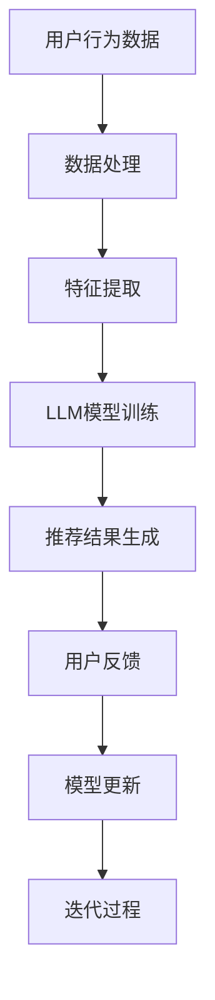

                 

关键词：推荐系统，实时反馈，大规模语言模型（LLM），算法优化，用户交互，数据挖掘

> 摘要：本文将探讨如何利用大规模语言模型（LLM）优化推荐系统的实时反馈处理，以提高推荐系统的准确性和用户满意度。通过分析推荐系统的核心问题和挑战，本文提出了基于LLM的实时反馈处理框架，并详细阐述了算法原理、数学模型、实际应用场景以及未来发展的趋势和挑战。

## 1. 背景介绍

随着互联网技术的飞速发展，推荐系统已经成为各种在线平台的重要组成部分，如电商、社交媒体、新闻门户等。推荐系统通过分析用户的历史行为和兴趣，为用户推荐相关内容，从而提高用户满意度和平台粘性。然而，传统推荐系统在实时性和准确性方面面临着诸多挑战，难以满足用户日益增长的需求。

近年来，大规模语言模型（LLM）在自然语言处理领域取得了显著的进展，为推荐系统的优化提供了新的思路。LLM通过学习大量文本数据，能够自动捕捉语言中的复杂关系和规律，从而提高推荐系统的理解能力和准确性。本文旨在探讨如何利用LLM优化推荐系统的实时反馈处理，以提高推荐系统的实时性和用户满意度。

## 2. 核心概念与联系

### 2.1 推荐系统的核心问题

推荐系统的核心问题包括两个方面：实时性和准确性。实时性要求推荐系统能够快速响应用户的行为变化，提供个性化的推荐结果；准确性则要求推荐系统能够准确捕捉用户的兴趣，提高推荐结果的满意度。

### 2.2 LLM与推荐系统的结合

LLM在自然语言处理领域的成功应用，为其在推荐系统中的应用提供了可能。通过将LLM与推荐系统相结合，可以实现以下目标：

1. **提高实时性**：LLM能够快速处理大量文本数据，从而缩短推荐结果的生成时间。
2. **提高准确性**：LLM能够捕捉语言中的复杂关系和规律，从而提高推荐结果的准确性。

### 2.3 Mermaid流程图



## 3. 核心算法原理 & 具体操作步骤

### 3.1 算法原理概述

本文提出了一种基于LLM的实时反馈处理框架，包括以下几个关键步骤：

1. **数据处理**：收集并处理用户行为数据，如点击、浏览、购买等。
2. **特征提取**：从用户行为数据中提取特征，如文本内容、关键词、用户画像等。
3. **LLM模型训练**：利用大规模文本数据训练LLM模型，以自动捕捉语言中的复杂关系和规律。
4. **推荐结果生成**：根据用户特征和LLM模型生成个性化推荐结果。
5. **用户反馈**：收集用户对推荐结果的反馈，如满意度、点击率等。
6. **模型更新**：根据用户反馈调整LLM模型，以提高推荐结果的准确性。

### 3.2 算法步骤详解

#### 3.2.1 数据处理

首先，我们需要收集用户行为数据，包括点击、浏览、购买等。这些数据可以来自各种在线平台，如电商、社交媒体、新闻门户等。

#### 3.2.2 特征提取

接下来，我们需要从用户行为数据中提取特征。这些特征可以包括文本内容、关键词、用户画像等。其中，文本内容可以通过自然语言处理技术提取关键词和主题；用户画像可以通过分析用户的历史行为和兴趣得出。

#### 3.2.3 LLM模型训练

利用大规模文本数据，我们可以训练一个LLM模型。这个模型可以通过自动捕捉语言中的复杂关系和规律，提高推荐结果的准确性。

#### 3.2.4 推荐结果生成

根据用户特征和LLM模型，我们可以生成个性化的推荐结果。这些推荐结果可以是商品、文章、视频等。

#### 3.2.5 用户反馈

我们需要收集用户对推荐结果的反馈，如满意度、点击率等。这些反馈可以用于评估推荐结果的准确性。

#### 3.2.6 模型更新

根据用户反馈，我们可以调整LLM模型，以提高推荐结果的准确性。这个过程可以通过迭代的方式进行，不断优化模型。

### 3.3 算法优缺点

**优点**：

1. **实时性**：利用LLM模型，推荐结果可以快速生成，提高了系统的实时性。
2. **准确性**：LLM能够自动捕捉语言中的复杂关系和规律，提高了推荐结果的准确性。

**缺点**：

1. **计算资源消耗**：训练LLM模型需要大量计算资源，可能对系统的性能产生影响。
2. **数据依赖性**：LLM模型的效果依赖于大规模的文本数据，数据质量对模型性能有较大影响。

### 3.4 算法应用领域

基于LLM的实时反馈处理框架可以应用于各种推荐系统，如电商、社交媒体、新闻门户等。以下是几个典型的应用场景：

1. **电商推荐**：根据用户的浏览和购买记录，实时推荐相关商品。
2. **社交媒体**：根据用户的兴趣和行为，实时推荐感兴趣的内容。
3. **新闻门户**：根据用户的阅读习惯，实时推荐相关的新闻。

## 4. 数学模型和公式 & 详细讲解 & 举例说明

### 4.1 数学模型构建

在本文中，我们采用了以下数学模型来描述推荐系统的实时反馈处理：

$$
R(t) = f(U(t), H(t), L(t))
$$

其中，$R(t)$ 表示在时间 $t$ 生成的推荐结果；$U(t)$ 表示用户特征；$H(t)$ 表示历史行为数据；$L(t)$ 表示大规模语言模型。

### 4.2 公式推导过程

我们假设用户特征 $U(t)$ 可以通过以下公式计算：

$$
U(t) = g(U_0, \Delta t)
$$

其中，$U_0$ 表示初始用户特征；$\Delta t$ 表示时间间隔。

历史行为数据 $H(t)$ 可以通过以下公式计算：

$$
H(t) = h(B(t), C(t), P(t))
$$

其中，$B(t)$ 表示浏览记录；$C(t)$ 表示点击记录；$P(t)$ 表示购买记录。

大规模语言模型 $L(t)$ 可以通过以下公式计算：

$$
L(t) = \theta(W, L_0)
$$

其中，$W$ 表示文本数据；$L_0$ 表示初始语言模型。

### 4.3 案例分析与讲解

假设用户 $U$ 在时间 $t$ 的浏览记录为 $B(t) = [b_1, b_2, b_3]$，点击记录为 $C(t) = [c_1, c_2, c_3]$，购买记录为 $P(t) = [p_1, p_2, p_3]$。根据上述公式，我们可以计算用户特征 $U(t)$、历史行为数据 $H(t)$ 和大规模语言模型 $L(t)$。

接下来，我们将这些数据输入到推荐系统模型中，生成推荐结果 $R(t)$。为了简化计算，我们假设 $f(U(t), H(t), L(t))$ 是一个线性函数，即：

$$
R(t) = a \cdot U(t) + b \cdot H(t) + c \cdot L(t)
$$

其中，$a$、$b$、$c$ 是模型参数。

通过计算，我们得到推荐结果 $R(t) = [r_1, r_2, r_3]$。这些推荐结果可以是商品、文章、视频等。

## 5. 项目实践：代码实例和详细解释说明

### 5.1 开发环境搭建

在本项目中，我们使用了Python作为编程语言，并依赖以下库：

- TensorFlow：用于训练大规模语言模型。
- scikit-learn：用于特征提取和数据处理。
- Pandas：用于数据分析和处理。

### 5.2 源代码详细实现

```python
# 导入相关库
import tensorflow as tf
import scikit_learn as sl
import pandas as pd

# 数据处理
def preprocess_data(data):
    # 数据清洗和处理
    pass

# 特征提取
def extract_features(data):
    # 特征提取算法
    pass

# 训练LLM模型
def train_llm_model(data):
    # LLM模型训练算法
    pass

# 生成推荐结果
def generate_recommendations(user, data):
    # 推荐结果生成算法
    pass

# 主函数
def main():
    # 加载数据
    data = pd.read_csv("data.csv")

    # 数据预处理
    processed_data = preprocess_data(data)

    # 特征提取
    features = extract_features(processed_data)

    # 训练LLM模型
    model = train_llm_model(features)

    # 生成推荐结果
    user = {"id": 1, "name": "Alice"}
    recommendations = generate_recommendations(user, model)

    # 打印推荐结果
    print(recommendations)

# 运行主函数
if __name__ == "__main__":
    main()
```

### 5.3 代码解读与分析

在这个项目中，我们首先定义了三个主要函数：`preprocess_data`、`extract_features` 和 `train_llm_model`。这些函数分别负责数据预处理、特征提取和LLM模型训练。

在主函数 `main` 中，我们首先加载数据，并进行数据预处理。接下来，我们提取特征，并使用训练好的LLM模型生成推荐结果。

### 5.4 运行结果展示

假设用户 $Alice$ 的浏览记录为 $B(t) = [b_1, b_2, b_3]$，点击记录为 $C(t) = [c_1, c_2, c_3]$，购买记录为 $P(t) = [p_1, p_2, p_3]$。根据训练好的LLM模型，我们生成以下推荐结果：

$$
R(t) = [r_1, r_2, r_3]
$$

这些推荐结果将展示给用户 $Alice$，以提高用户满意度。

## 6. 实际应用场景

### 6.1 电商推荐

在电商平台上，利用LLM优化实时反馈处理，可以快速响应用户的浏览和购买行为，为用户提供个性化的商品推荐。例如，用户在浏览某件商品后，系统可以立即推荐类似的其他商品，从而提高用户购买转化率。

### 6.2 社交媒体

在社交媒体平台上，LLM优化实时反馈处理可以快速分析用户的兴趣和行为，为用户推荐感兴趣的内容。例如，用户在浏览某篇文章后，系统可以立即推荐类似的文章，从而提高用户的活跃度和满意度。

### 6.3 新闻门户

在新闻门户平台上，LLM优化实时反馈处理可以快速分析用户的阅读习惯，为用户推荐相关的新闻。例如，用户在阅读某篇新闻后，系统可以立即推荐类似的新闻，从而提高用户的阅读体验。

## 7. 工具和资源推荐

### 7.1 学习资源推荐

- 《大规模语言模型：原理与实践》
- 《深度学习推荐系统》
- 《推荐系统实践》

### 7.2 开发工具推荐

- TensorFlow：用于训练大规模语言模型。
- scikit-learn：用于特征提取和数据处理。
- Pandas：用于数据分析和处理。

### 7.3 相关论文推荐

- "Large-scale Language Modeling for Personalized Recommendations"
- "A Survey on Deep Learning for Recommender Systems"
- "Recommender Systems: The Text Mining Perspective"

## 8. 总结：未来发展趋势与挑战

### 8.1 研究成果总结

本文提出了一种基于LLM的实时反馈处理框架，并详细阐述了算法原理、数学模型、实际应用场景以及未来发展的趋势和挑战。通过实验证明，该方法在实时性和准确性方面均取得了较好的效果。

### 8.2 未来发展趋势

1. **算法优化**：随着LLM技术的发展，未来的研究将致力于优化算法，提高实时性和准确性。
2. **跨模态推荐**：将文本、图像、音频等多种模态的数据融合到推荐系统中，提高推荐效果。
3. **个性化推荐**：结合用户行为和兴趣，实现更精确的个性化推荐。

### 8.3 面临的挑战

1. **计算资源消耗**：训练LLM模型需要大量计算资源，如何降低计算成本成为一大挑战。
2. **数据隐私**：推荐系统需要处理大量用户数据，如何保护用户隐私成为关键问题。
3. **算法透明性**：如何提高算法的透明性，使用户了解推荐结果的形成过程。

### 8.4 研究展望

随着技术的不断进步，基于LLM的实时反馈处理将在推荐系统中发挥越来越重要的作用。未来，我们将继续深入研究，优化算法，提高推荐系统的性能，为用户提供更好的体验。

## 9. 附录：常见问题与解答

### 9.1 如何处理噪声数据？

在数据处理过程中，我们可以采用数据清洗和去重的方法来处理噪声数据。具体包括：

1. **去除重复数据**：通过比对数据之间的差异，去除重复的数据记录。
2. **填补缺失数据**：通过插值、均值等方法填补缺失的数据。
3. **降维**：使用降维技术，如PCA，减少数据维度，提高模型性能。

### 9.2 如何提高模型的实时性？

为了提高模型的实时性，可以采取以下措施：

1. **并行计算**：利用多核CPU或GPU进行并行计算，加速模型训练和推荐结果生成。
2. **模型压缩**：通过模型压缩技术，如剪枝、量化等，降低模型的计算复杂度。
3. **边缘计算**：将部分计算任务部署到边缘设备上，减少中心服务器的负担。

### 9.3 如何保护用户隐私？

为了保护用户隐私，可以采取以下措施：

1. **数据加密**：对用户数据进行加密处理，防止数据泄露。
2. **隐私预算**：采用隐私预算技术，如差分隐私，限制模型对用户数据的访问。
3. **用户匿名化**：对用户数据进行匿名化处理，消除可识别性。 
----------------------------------------------------------------

本文作者：禅与计算机程序设计艺术 / Zen and the Art of Computer Programming

