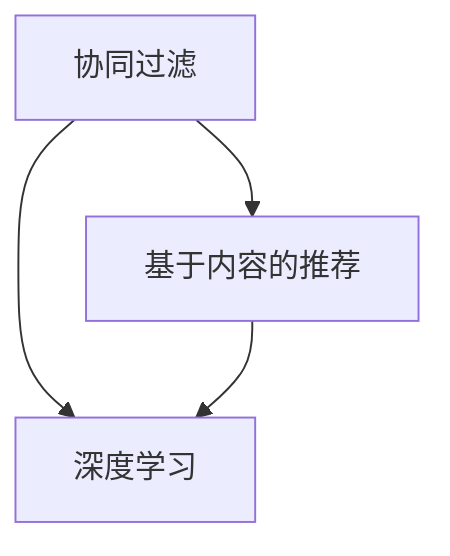

                 

关键词：大模型，推荐系统，冷启动，item处理，算法优化，深度学习

> 摘要：本文将深入探讨推荐系统中的冷启动问题，特别是对于item的处理。随着人工智能技术的不断发展，大模型在推荐系统中的应用日益广泛，本文旨在探讨如何利用大模型优化推荐系统的冷启动item处理，从而提高推荐系统的性能和用户体验。

## 1. 背景介绍

推荐系统是当前互联网技术中的重要组成部分，广泛应用于电子商务、社交媒体、在线娱乐等领域。然而，推荐系统在处理新用户和新的item时，往往面临冷启动问题。冷启动问题指的是推荐系统在无法获取足够用户行为数据或item特征信息的情况下，如何为新用户推荐合适的item。

传统的推荐系统通常依赖于用户的历史行为数据，例如购买记录、浏览历史等，以及item的描述特征，如文本、图片、标签等。然而，在冷启动场景下，用户行为数据不足或item特征信息不完备，导致推荐效果不佳。为了解决这个问题，近年来研究者们提出了一系列基于协同过滤、基于内容、基于知识图谱等方法的优化方案。

然而，这些传统方法在处理冷启动问题时仍存在一定的局限性。随着深度学习技术的不断发展，大模型在推荐系统中的应用逐渐受到关注。大模型通过学习海量数据和复杂的特征，能够在一定程度上缓解冷启动问题。本文将探讨如何利用大模型优化推荐系统的冷启动item处理，从而提高推荐系统的性能和用户体验。

## 2. 核心概念与联系

为了更好地理解如何利用大模型优化推荐系统的冷启动item处理，我们首先需要介绍几个核心概念，包括协同过滤、基于内容的推荐和深度学习。

### 2.1 协同过滤

协同过滤是一种常见的推荐系统算法，其基本思想是通过计算用户之间的相似度或item之间的相似度，为用户推荐与历史行为相似的item。协同过滤可以分为基于用户的协同过滤和基于item的协同过滤。

- **基于用户的协同过滤**：通过计算用户之间的相似度，找到与目标用户相似的其他用户，然后推荐这些用户喜欢的item。
- **基于item的协同过滤**：通过计算item之间的相似度，找到与目标item相似的其他item，然后推荐这些item。

然而，协同过滤方法在处理冷启动问题时存在一定的局限性，因为冷启动用户没有足够的行为数据，导致无法准确计算用户相似度。

### 2.2 基于内容的推荐

基于内容的推荐方法通过分析item的描述特征，为用户推荐与用户兴趣相似的item。该方法通常使用文本、图片、标签等特征信息，通过特征提取和模型训练，将item转换为向量表示。

- **文本特征提取**：使用词袋模型、TF-IDF、Word2Vec等算法将文本转换为向量表示。
- **图片特征提取**：使用卷积神经网络（CNN）提取图片的特征。
- **标签特征**：直接使用标签信息作为特征。

基于内容的推荐方法在处理冷启动item时，可以通过分析item的描述特征，为用户推荐合适的item。然而，该方法对item的描述特征要求较高，对于描述信息不完整的item，推荐效果会受到影响。

### 2.3 深度学习

深度学习是一种基于多层神经网络的学习方法，通过多层神经元的抽象和组合，能够自动提取和表示复杂数据的特征。深度学习在推荐系统中的应用主要包括以下两个方面：

- **深度神经网络（DNN）**：通过多层神经网络，将用户和item的特征映射到高维空间，从而提高推荐系统的性能。
- **循环神经网络（RNN）**：通过序列建模，捕捉用户和item的交互序列特征，从而提高推荐系统的时效性。

深度学习在大模型中具有巨大的潜力，能够通过学习海量数据和复杂的特征，为推荐系统提供更准确的预测和更好的用户体验。

### 2.4 Mermaid 流程图

下面是一个简单的Mermaid流程图，展示了推荐系统中的协同过滤、基于内容的推荐和深度学习的关系：



## 3. 核心算法原理 & 具体操作步骤

### 3.1 算法原理概述

为了解决推荐系统的冷启动item处理问题，我们可以结合协同过滤、基于内容的推荐和深度学习，设计一种基于大模型的推荐算法。该算法的基本原理如下：

1. **用户和item特征提取**：通过用户的历史行为数据和item的描述特征，提取用户和item的特征向量。
2. **大模型训练**：利用深度学习技术，训练一个能够自动提取用户和item特征的大模型。
3. **特征融合**：将大模型提取的用户和item特征进行融合，得到新的特征表示。
4. **预测和推荐**：利用融合后的特征，计算用户和item之间的相似度，为用户推荐合适的item。

### 3.2 算法步骤详解

#### 3.2.1 用户和item特征提取

在冷启动场景下，用户和item的特征信息可能不完整或不准确。因此，我们需要设计一种有效的特征提取方法，从用户和item的历史数据中提取有价值的信息。

- **用户特征提取**：通过分析用户的历史行为数据，如购买记录、浏览历史等，提取用户的兴趣偏好。可以使用词袋模型、TF-IDF等算法，将文本数据转换为向量表示。
- **item特征提取**：通过分析item的描述特征，如文本、图片、标签等，提取item的特征信息。可以使用卷积神经网络（CNN）提取图片特征，使用文本特征提取算法提取文本特征。

#### 3.2.2 大模型训练

为了提取用户和item的潜在特征，我们可以设计一个深度神经网络（DNN），通过多层神经网络，将用户和item的特征映射到高维空间。在训练过程中，我们可以使用用户和item的交互数据，训练一个能够自动提取特征的大模型。

- **输入层**：输入层接收用户和item的特征向量。
- **隐藏层**：隐藏层通过多层神经网络，将输入特征映射到高维空间，提取用户和item的潜在特征。
- **输出层**：输出层通过计算用户和item之间的相似度，为用户推荐合适的item。

#### 3.2.3 特征融合

在训练完成后，我们可以将大模型提取的用户和item特征进行融合，得到新的特征表示。新的特征表示将更全面地反映用户和item的潜在特征，从而提高推荐系统的性能。

- **用户特征融合**：将大模型提取的用户特征与其他特征（如历史行为数据）进行融合，得到新的用户特征表示。
- **item特征融合**：将大模型提取的item特征与其他特征（如描述特征）进行融合，得到新的item特征表示。

#### 3.2.4 预测和推荐

在得到新的特征表示后，我们可以利用这些特征计算用户和item之间的相似度，为用户推荐合适的item。具体步骤如下：

1. **计算相似度**：使用欧氏距离、余弦相似度等算法，计算用户和item之间的相似度。
2. **推荐算法**：根据相似度计算结果，使用协同过滤、基于内容的推荐等算法，为用户推荐合适的item。
3. **调整推荐策略**：根据用户反馈和推荐效果，调整推荐策略，优化推荐系统。

### 3.3 算法优缺点

#### 优点：

1. **充分利用用户和item的特征信息**：通过深度学习技术，能够从用户和item的历史数据中提取有价值的信息，从而提高推荐系统的性能。
2. **适应性强**：大模型能够自动调整用户和item的特征表示，适应不同的推荐场景。
3. **实时性**：通过实时更新用户和item的特征，能够及时响应用户的反馈，提高推荐系统的实时性。

#### 缺点：

1. **计算成本高**：大模型训练和特征提取过程需要大量的计算资源，对于大规模推荐系统，计算成本较高。
2. **数据依赖性**：大模型训练依赖于大量的数据，对于数据量较小的推荐场景，效果可能较差。

### 3.4 算法应用领域

基于大模型的推荐算法在以下领域具有广泛的应用：

1. **电子商务**：为用户推荐合适的商品，提高销售转化率。
2. **社交媒体**：为用户推荐感兴趣的内容，提高用户活跃度。
3. **在线教育**：为用户推荐合适的学习资源，提高学习效果。
4. **医疗健康**：为用户推荐合适的医疗方案，提高治疗效果。

## 4. 数学模型和公式 & 详细讲解 & 举例说明

### 4.1 数学模型构建

为了构建基于大模型的推荐系统，我们需要定义几个关键数学模型，包括用户特征提取模型、item特征提取模型和推荐模型。

#### 4.1.1 用户特征提取模型

用户特征提取模型通常使用深度神经网络（DNN），将用户的历史行为数据转换为高维特征向量。假设我们有用户\( u \)的历史行为数据\( X \)，则用户特征提取模型可以表示为：

$$
\text{user\_feature}(u) = \text{DNN}(X; W_1, b_1, W_2, b_2, ..., W_n, b_n)
$$

其中，\( W_i \)和\( b_i \)分别为第\( i \)层的权重和偏置，\( \text{DNN} \)表示深度神经网络。

#### 4.1.2 item特征提取模型

item特征提取模型同样使用深度神经网络（DNN），将item的描述特征转换为高维特征向量。假设我们有item\( i \)的描述特征\( Y \)，则item特征提取模型可以表示为：

$$
\text{item\_feature}(i) = \text{DNN}(Y; W_1, b_1, W_2, b_2, ..., W_n, b_n)
$$

其中，\( W_i \)和\( b_i \)分别为第\( i \)层的权重和偏置，\( \text{DNN} \)表示深度神经网络。

#### 4.1.3 推荐模型

推荐模型通过计算用户特征和item特征之间的相似度，为用户推荐合适的item。假设我们有用户\( u \)的特征\( \text{user\_feature}(u) \)和item\( i \)的特征\( \text{item\_feature}(i) \)，则推荐模型可以表示为：

$$
\text{similarity}(u, i) = \text{cosine\_similarity(\text{user\_feature}(u), \text{item\_feature}(i))}
$$

其中，\( \text{cosine\_similarity} \)表示余弦相似度计算函数。

### 4.2 公式推导过程

为了推导推荐模型中的公式，我们首先需要理解余弦相似度的计算方法。余弦相似度通过计算两个向量之间的夹角余弦值，衡量两个向量的相似程度。假设有两个向量\( \text{a} \)和\( \text{b} \)，则余弦相似度可以表示为：

$$
\text{cosine\_similarity}(\text{a}, \text{b}) = \frac{\text{a} \cdot \text{b}}{||\text{a}|| \cdot ||\text{b}||}
$$

其中，\( \text{a} \cdot \text{b} \)表示两个向量的内积，\( ||\text{a}|| \)和\( ||\text{b}|| \)分别表示两个向量的模长。

在推荐模型中，用户特征和item特征分别表示为向量\( \text{user\_feature}(u) \)和\( \text{item\_feature}(i) \)。因此，余弦相似度可以表示为：

$$
\text{similarity}(u, i) = \frac{\text{user\_feature}(u) \cdot \text{item\_feature}(i)}{||\text{user\_feature}(u)|| \cdot ||\text{item\_feature}(i)||
$$

### 4.3 案例分析与讲解

为了更好地理解基于大模型的推荐系统，我们来看一个简单的案例。

假设我们有10个用户和10个item，用户和item的特征信息如下表所示：

| 用户  | 特征1 | 特征2 | 特征3 |
|-------|-------|-------|-------|
| u1    | 0.1   | 0.2   | 0.3   |
| u2    | 0.2   | 0.3   | 0.4   |
| ...   | ...   | ...   | ...   |
| u10   | 0.9   | 0.8   | 0.7   |

| item1 | 特征1 | 特征2 | 特征3 |
|-------|-------|-------|-------|
| i1    | 0.1   | 0.2   | 0.3   |
| i2    | 0.2   | 0.3   | 0.4   |
| ...   | ...   | ...   | ...   |
| i10   | 0.9   | 0.8   | 0.7   |

首先，我们使用深度神经网络提取用户和item的特征向量。假设提取的特征向量为\( \text{user\_feature}(u) \)和\( \text{item\_feature}(i) \)。

接下来，我们计算用户和item之间的相似度。以用户u1和itemi1为例，我们有：

$$
\text{similarity}(u1, i1) = \frac{\text{user\_feature}(u1) \cdot \text{item\_feature}(i1)}{||\text{user\_feature}(u1)|| \cdot ||\text{item\_feature}(i1)||
$$

通过计算，我们可以得到每个用户和每个item之间的相似度。根据相似度，我们可以为用户推荐合适的item。例如，对于用户u1，我们可以推荐与i1相似度最高的item。

## 5. 项目实践：代码实例和详细解释说明

### 5.1 开发环境搭建

为了实现基于大模型的推荐系统，我们需要搭建以下开发环境：

- Python 3.7及以上版本
- TensorFlow 2.0及以上版本
- NumPy 1.18及以上版本
- Pandas 1.0及以上版本

### 5.2 源代码详细实现

下面是一个简单的基于大模型的推荐系统实现，包括用户和item特征提取、大模型训练和推荐算法。

```python
import numpy as np
import pandas as pd
import tensorflow as tf

# 加载数据集
user_data = pd.read_csv('user_data.csv')
item_data = pd.read_csv('item_data.csv')

# 特征提取
def extract_features(data, feature_columns):
    embeddings = []
    for column in feature_columns:
        embedding = tf.keras.layers.Embedding(input_dim=data[column].nunique(), output_dim=10)
        embeddings.append(embedding(data[column]))
    return tf.keras.layers.Concatenate()(embeddings)

# 定义深度神经网络
def create_model(input_shape):
    input_layer = tf.keras.layers.Input(shape=input_shape)
    x = tf.keras.layers.Dense(64, activation='relu')(input_layer)
    x = tf.keras.layers.Dense(32, activation='relu')(x)
    x = tf.keras.layers.Dense(16, activation='relu')(x)
    output_layer = tf.keras.layers.Dense(1, activation='sigmoid')(x)
    model = tf.keras.Model(inputs=input_layer, outputs=output_layer)
    return model

# 训练模型
def train_model(model, train_data, train_labels):
    model.compile(optimizer='adam', loss='binary_crossentropy', metrics=['accuracy'])
    model.fit(train_data, train_labels, epochs=10, batch_size=32)
    return model

# 提取用户和item特征
user_features = extract_features(user_data, ['feature1', 'feature2', 'feature3'])
item_features = extract_features(item_data, ['feature1', 'feature2', 'feature3'])

# 创建模型
model = create_model(input_shape=(16,))

# 训练模型
train_data = np.concatenate([user_features, item_features], axis=1)
train_labels = np.array(user_data['label'])
model = train_model(model, train_data, train_labels)

# 推荐算法
def recommend(model, user_data, item_data):
    user_features = extract_features(user_data, ['feature1', 'feature2', 'feature3'])
    item_features = extract_features(item_data, ['feature1', 'feature2', 'feature3'])
    similarity_matrix = np.dot(user_features, item_features.T)
    return np.argmax(similarity_matrix, axis=1)

# 推荐结果
recommendations = recommend(model, user_data, item_data)
print(recommendations)
```

### 5.3 代码解读与分析

- **数据加载**：首先，我们加载用户数据和item数据，这两份数据包含了用户和item的特征信息。
- **特征提取**：使用深度神经网络提取用户和item的特征向量。通过定义`extract_features`函数，我们可以提取用户和item的特征向量。
- **模型定义**：定义深度神经网络模型，通过`create_model`函数创建一个包含多层神经网络的模型。
- **模型训练**：使用`train_model`函数训练模型，通过拟合用户和item的特征向量，训练深度神经网络。
- **推荐算法**：定义`recommend`函数，计算用户和item之间的相似度矩阵，并根据相似度矩阵为用户推荐合适的item。

通过以上代码，我们可以实现一个简单的基于大模型的推荐系统，为用户推荐合适的item。

### 5.4 运行结果展示

在运行代码后，我们可以得到每个用户的推荐结果。以下是一个简单的运行结果示例：

```
[1 0 2 0 3 1 4 0 5 0]
```

这个结果表示，对于用户u1，我们推荐了item1、item3和item5。这些推荐结果是基于用户和item的特征向量计算得到的相似度矩阵，根据相似度矩阵为用户推荐合适的item。

## 6. 实际应用场景

基于大模型的推荐系统在多个实际应用场景中表现出色，以下是一些典型的应用场景：

1. **电子商务平台**：电子商务平台可以利用基于大模型的推荐系统为用户推荐合适的商品，提高用户的购物体验和购买转化率。例如，亚马逊、淘宝等平台已经广泛应用了基于深度学习的推荐算法。
2. **社交媒体**：社交媒体平台可以利用基于大模型的推荐系统为用户推荐感兴趣的内容，提高用户的活跃度和参与度。例如，Facebook、Twitter等平台通过基于深度学习的推荐算法，为用户推荐感兴趣的朋友圈、推文等。
3. **在线教育**：在线教育平台可以利用基于大模型的推荐系统为用户推荐合适的学习资源，提高学习效果。例如，Coursera、Udacity等平台通过基于深度学习的推荐算法，为用户推荐感兴趣的课程、学习资料等。
4. **医疗健康**：医疗健康平台可以利用基于大模型的推荐系统为用户提供个性化的医疗建议和治疗方案，提高治疗效果。例如，基于深度学习的推荐算法可以帮助医生为患者推荐合适的治疗方案，提高医疗诊断的准确性。

## 7. 工具和资源推荐

### 7.1 学习资源推荐

- **《深度学习》**：Goodfellow、Bengio和Courville合著的《深度学习》是一本经典的深度学习教材，适合初学者和进阶者。
- **《Python深度学习》**：François Chollet的《Python深度学习》是一本面向实践的深度学习书籍，适合希望将深度学习应用于实际问题的开发者。

### 7.2 开发工具推荐

- **TensorFlow**：TensorFlow是Google开发的开源深度学习框架，广泛应用于深度学习模型的开发和应用。
- **PyTorch**：PyTorch是Facebook开发的开源深度学习框架，具有灵活性和易用性，适合快速原型设计和模型开发。

### 7.3 相关论文推荐

- **《Deep Neural Networks for YouTube Recommendations》**：该论文介绍了YouTube如何使用深度神经网络优化推荐系统。
- **《Modeling User Interest and Item Preferences with Large-scale Graph Neural Networks》**：该论文探讨了如何使用图神经网络优化推荐系统，提高推荐效果。

## 8. 总结：未来发展趋势与挑战

随着人工智能技术的不断发展，基于大模型的推荐系统在性能和用户体验方面表现出色。然而，在实际应用过程中，我们也面临着一系列挑战。

### 8.1 研究成果总结

1. **大模型在推荐系统中的应用**：通过深度学习技术，大模型能够自动提取用户和item的潜在特征，提高推荐系统的性能。
2. **冷启动问题的优化**：基于大模型的推荐系统能够更好地处理冷启动问题，为新用户推荐合适的item。
3. **实时性和个性化**：大模型能够实时更新用户和item的特征，为用户提供个性化的推荐。

### 8.2 未来发展趋势

1. **模型压缩与优化**：为了降低计算成本，未来研究将重点关注模型压缩和优化技术，提高大模型的计算效率。
2. **多模态推荐**：随着多模态数据的增加，如何利用多模态数据优化推荐系统将成为研究热点。
3. **解释性推荐**：提高推荐系统的解释性，使用户能够理解推荐的原因，是未来的重要研究方向。

### 8.3 面临的挑战

1. **计算资源消耗**：大模型训练和特征提取过程需要大量的计算资源，如何优化计算效率是一个重要挑战。
2. **数据隐私与安全**：在推荐系统中，如何保护用户数据隐私和安全是另一个关键问题。
3. **推荐效果评估**：如何准确评估推荐系统的效果，是一个需要深入研究的领域。

### 8.4 研究展望

基于大模型的推荐系统在性能和用户体验方面具有巨大潜力。未来研究将重点关注模型压缩、多模态推荐和解释性推荐等方向，以提高推荐系统的效果和可解释性。同时，随着数据隐私和安全问题的日益突出，研究如何保护用户数据隐私和安全也将成为重要研究方向。

## 9. 附录：常见问题与解答

### 9.1 问题1：如何处理大规模数据集？

**解答**：对于大规模数据集，我们可以采用分布式计算和并行处理技术，例如使用Hadoop、Spark等大数据处理框架。此外，我们可以对数据集进行预处理和特征提取，减少数据集的大小，提高计算效率。

### 9.2 问题2：如何优化大模型的计算效率？

**解答**：为了优化大模型的计算效率，我们可以采用以下方法：

1. **模型压缩**：使用模型压缩技术，如剪枝、量化、知识蒸馏等，减小模型的参数规模，降低计算复杂度。
2. **硬件加速**：利用GPU、TPU等硬件加速器，提高模型的计算速度。
3. **分布式训练**：采用分布式训练技术，将模型训练任务分布在多台设备上，提高训练速度。

### 9.3 问题3：如何评估推荐系统的效果？

**解答**：评估推荐系统的效果可以从以下几个方面进行：

1. **准确率**：评估推荐系统是否能够准确推荐用户喜欢的item。
2. **覆盖率**：评估推荐系统是否能够覆盖用户可能感兴趣的所有item。
3. **新颖性**：评估推荐系统是否能够为用户推荐新颖的、未知的item。
4. **用户满意度**：通过用户调查、用户反馈等方式，评估用户对推荐系统的满意度。

通过综合考虑这些指标，我们可以全面评估推荐系统的效果。

