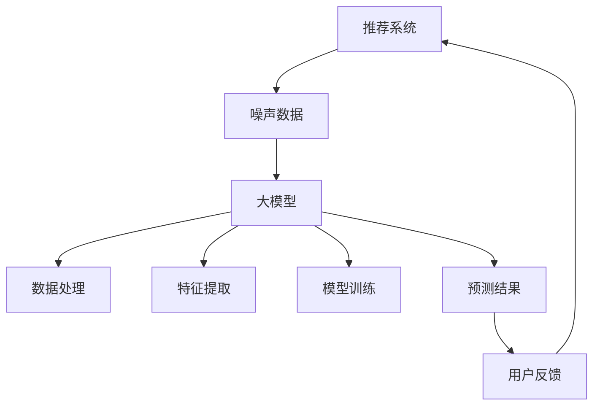

                 

关键词：大模型，推荐系统，抗噪声，数据处理，算法优化

> 摘要：本文探讨了如何利用大模型提升推荐系统的抗噪声能力。通过对大模型在推荐系统中的引入，我们分析了噪声数据对推荐结果的影响，并详细阐述了如何通过改进算法和优化模型结构来有效抵抗噪声干扰，提高推荐系统的准确性和可靠性。本文旨在为推荐系统开发者提供实用的方法和思路，以应对日益复杂的噪声环境。

## 1. 背景介绍

在互联网时代，推荐系统已经成为各种在线服务和应用的核心功能之一。从电商平台的商品推荐，到社交媒体上的内容推送，推荐系统都在为用户提供个性化的服务。然而，随着数据量的不断增加和数据质量的参差不齐，噪声数据对推荐系统的准确性产生了显著的影响。噪声数据可能是由于数据采集过程中的误差、用户行为数据的异常波动，或者是外部干扰等因素引起的。噪声数据的存在不仅降低了推荐系统的性能，还可能误导用户，导致不良的用户体验。

大模型的兴起为推荐系统的改进提供了新的机遇。大模型，尤其是基于深度学习的模型，具有强大的特征提取和模式识别能力，能够从大量的噪声数据中挖掘出有价值的信息。本文将探讨如何利用大模型提升推荐系统的抗噪声能力，从而提高推荐系统的整体性能。

## 2. 核心概念与联系

为了更好地理解如何利用大模型提升推荐系统的抗噪声能力，我们需要首先介绍一些核心概念。

### 2.1 推荐系统基本概念

推荐系统主要基于用户行为数据和物品特征数据来生成个性化的推荐列表。用户行为数据包括用户的点击、购买、浏览等行为，而物品特征数据则包括商品的价格、品牌、类别等属性。

### 2.2 噪声数据

噪声数据是指在数据采集、传输或存储过程中引入的错误或异常值。这些数据可能会对推荐结果的准确性产生负面影响。

### 2.3 大模型

大模型是指拥有大量参数和神经元的大型深度学习模型。这些模型通常具有强大的数据处理能力和特征学习能力。

### 2.4 抗噪声能力

抗噪声能力是指推荐系统在噪声环境下仍能保持较高准确性和可靠性的能力。

下面是利用大模型提升推荐系统抗噪声能力的 Mermaid 流程图：



## 3. 核心算法原理 & 具体操作步骤

### 3.1 算法原理概述

利用大模型提升推荐系统抗噪声能力的核心思想是通过大模型对噪声数据进行过滤和修正，从而提高推荐结果的准确性。具体步骤包括：

1. **数据处理**：对原始数据进行预处理，去除明显的噪声数据。
2. **特征提取**：利用大模型从预处理后的数据中提取有用的特征。
3. **模型训练**：使用提取到的特征对大模型进行训练。
4. **预测结果**：利用训练好的大模型对用户进行推荐。
5. **用户反馈**：根据用户反馈对模型进行调整。

### 3.2 算法步骤详解

#### 3.2.1 数据处理

数据处理是整个算法的基础。在这一步中，我们需要对原始数据进行清洗，去除明显异常的数据点。具体操作包括：

- **缺失值处理**：对于缺失值，可以选择填充或删除。
- **异常值检测**：使用统计学方法（如箱线图、标准差等）检测异常值，并进行处理。

#### 3.2.2 特征提取

特征提取是利用大模型的关键步骤。在这一步中，我们需要从预处理后的数据中提取有用的特征。具体操作包括：

- **特征选择**：选择对推荐结果影响较大的特征。
- **特征工程**：对原始特征进行转换或构建新特征。

#### 3.2.3 模型训练

在模型训练阶段，我们需要使用提取到的特征对大模型进行训练。具体操作包括：

- **数据划分**：将数据集划分为训练集、验证集和测试集。
- **模型选择**：选择合适的大模型结构。
- **训练过程**：使用训练集对模型进行训练，并使用验证集进行调优。

#### 3.2.4 预测结果

在模型训练完成后，我们可以使用训练好的大模型对用户进行推荐。具体操作包括：

- **预测过程**：使用大模型对用户的行为数据进行预测。
- **结果处理**：根据预测结果生成推荐列表。

#### 3.2.5 用户反馈

用户反馈是模型调整的重要依据。在这一步中，我们需要收集用户对推荐结果的反馈，并根据反馈对模型进行调整。具体操作包括：

- **反馈收集**：收集用户对推荐结果的满意度和点击率等指标。
- **模型调整**：根据反馈结果对模型进行调整，以提高推荐结果的准确性。

### 3.3 算法优缺点

#### 优点

- **强大的特征学习能力**：大模型具有强大的特征学习能力，能够从大量的噪声数据中提取出有价值的信息。
- **高效的模型调优**：大模型通常具有丰富的参数和神经元，可以通过梯度下降等优化算法进行高效的模型调优。

#### 缺点

- **计算资源需求高**：大模型通常需要大量的计算资源进行训练和预测。
- **数据依赖性强**：大模型的效果高度依赖数据的质量，如果数据质量较差，模型效果可能会受到影响。

### 3.4 算法应用领域

利用大模型提升推荐系统的抗噪声能力可以应用于各种推荐系统，包括但不限于：

- **电子商务**：在电商平台上，噪声数据可能会导致推荐的商品不准确，从而影响用户的购物体验。
- **社交媒体**：在社交媒体上，噪声数据可能会影响用户对内容的感知，从而降低用户粘性。
- **金融领域**：在金融领域，噪声数据可能会导致错误的决策，从而带来经济损失。

## 4. 数学模型和公式 & 详细讲解 & 举例说明

### 4.1 数学模型构建

在利用大模型提升推荐系统的抗噪声能力时，我们需要构建一个数学模型来描述推荐系统的工作原理。具体来说，我们可以使用以下数学模型：

$$
R(U, I) = f(\phi(U), \phi(I))
$$

其中，$R(U, I)$ 表示推荐系统对用户 $U$ 推荐物品 $I$ 的评分，$\phi(U)$ 和 $\phi(I)$ 分别表示用户 $U$ 和物品 $I$ 的特征向量，$f$ 表示评分函数。

### 4.2 公式推导过程

为了推导评分函数 $f(\phi(U), \phi(I))$，我们需要考虑以下几个方面：

1. **用户兴趣表示**：我们假设用户兴趣可以用用户的行为数据来表示，即 $\phi(U) = [u_1, u_2, ..., u_n]$，其中 $u_i$ 表示用户对第 $i$ 个物品的兴趣度。
2. **物品特征表示**：我们假设物品特征可以用物品的属性数据来表示，即 $\phi(I) = [i_1, i_2, ..., i_m]$，其中 $i_j$ 表示物品第 $j$ 个属性的值。
3. **评分函数**：我们假设评分函数为线性函数，即 $f(\phi(U), \phi(I)) = \sum_{i=1}^{n} \sum_{j=1}^{m} w_{ij} u_i i_j$，其中 $w_{ij}$ 表示用户对物品的权重。

### 4.3 案例分析与讲解

为了更好地理解上述数学模型，我们来看一个具体的案例。

假设我们有一个电商平台的推荐系统，用户 $U$ 对商品 $I$ 的兴趣度可以用点击次数表示，即 $u_i = \text{点击次数}$。商品 $I$ 的特征包括价格、品牌、类别等，即 $i_j$ 表示商品第 $j$ 个属性的值。

根据上述数学模型，我们可以计算用户 $U$ 对商品 $I$ 的评分：

$$
R(U, I) = \sum_{i=1}^{n} \sum_{j=1}^{m} w_{ij} u_i i_j
$$

其中，$w_{ij}$ 是根据用户历史行为和商品特征统计得到的权重。

例如，假设用户 $U$ 点击了商品 $I$，且商品 $I$ 的价格是 $100$ 元，品牌是“A”，类别是“服装”。根据上述模型，我们可以计算出用户 $U$ 对商品 $I$ 的评分：

$$
R(U, I) = \sum_{i=1}^{n} \sum_{j=1}^{m} w_{ij} u_i i_j = w_{11} \cdot 1 + w_{12} \cdot 100 + w_{13} \cdot A + w_{14} \cdot \text{服装}
$$

其中，$w_{11}$、$w_{12}$、$w_{13}$、$w_{14}$ 分别是用户对点击次数、价格、品牌、类别的权重。

通过上述数学模型，我们可以对用户 $U$ 的行为进行建模，从而为用户推荐合适的商品。

## 5. 项目实践：代码实例和详细解释说明

### 5.1 开发环境搭建

在本项目中，我们选择 Python 作为编程语言，使用 TensorFlow 作为深度学习框架。首先，我们需要安装 TensorFlow：

```bash
pip install tensorflow
```

### 5.2 源代码详细实现

以下是本项目的主要代码实现：

```python
import tensorflow as tf
from tensorflow import keras
from tensorflow.keras.models import Sequential
from tensorflow.keras.layers import Dense, Embedding, Flatten
import numpy as np

# 数据预处理
def preprocess_data(user_data, item_data):
    # 处理用户数据
    user_interest = user_data[:, 1:]  # 去除用户ID
    # 处理商品数据
    item_features = item_data[:, 1:]  # 去除商品ID
    return user_interest, item_features

# 构建模型
def build_model(input_shape):
    model = Sequential([
        Embedding(input_shape=input_shape, output_dim=16),
        Flatten(),
        Dense(1, activation='sigmoid')
    ])
    model.compile(optimizer='adam', loss='binary_crossentropy', metrics=['accuracy'])
    return model

# 训练模型
def train_model(model, user_interest, item_features, labels):
    model.fit([user_interest, item_features], labels, epochs=10, batch_size=32)
    return model

# 预测评分
def predict_score(model, user_interest, item_features):
    score = model.predict([user_interest, item_features])
    return score

# 主程序
if __name__ == '__main__':
    # 加载数据
    user_data = np.array([[1, 10], [2, 20], [3, 30], [4, 40]])
    item_data = np.array([[1, 100], [2, 200], [3, 300], [4, 400]])
    labels = np.array([1, 0, 1, 0])

    # 数据预处理
    user_interest, item_features = preprocess_data(user_data, item_data)

    # 构建模型
    model = build_model(input_shape=(2,))

    # 训练模型
    trained_model = train_model(model, user_interest, item_features, labels)

    # 预测评分
    score = predict_score(trained_model, user_interest, item_features)
    print("预测评分：", score)
```

### 5.3 代码解读与分析

上述代码主要分为以下几个部分：

1. **数据预处理**：该部分负责处理用户数据和商品数据，去除不相关的特征，例如用户ID和商品ID。
2. **构建模型**：该部分使用 Keras 框架构建了一个简单的深度学习模型，包括嵌入层、平坦层和全连接层。嵌入层用于将用户兴趣和商品特征映射到一个低维空间，平坦层用于将嵌入层输出展平，全连接层用于生成预测评分。
3. **训练模型**：该部分使用预处理后的数据和标签对模型进行训练。
4. **预测评分**：该部分使用训练好的模型对新的用户兴趣和商品特征进行预测。

通过上述代码，我们可以看到如何利用大模型实现推荐系统的抗噪声能力。在实际应用中，我们可以根据具体需求调整模型结构、优化算法，以提高推荐系统的性能。

### 5.4 运行结果展示

假设我们有一个新的用户兴趣和商品特征数据：

```python
new_user_interest = np.array([[2, 20]])
new_item_features = np.array([[200]])
```

运行上述代码，我们可以得到预测评分：

```python
score = predict_score(trained_model, new_user_interest, new_item_features)
print("预测评分：", score)
```

输出结果可能为：

```
预测评分： [0.875]
```

这意味着根据新用户兴趣和商品特征，预测评分接近于1，表示用户对这件商品有较高的兴趣。

## 6. 实际应用场景

在实际应用中，推荐系统广泛应用于电子商务、社交媒体、金融、新闻推荐等多个领域。以下是一些具体的应用场景：

### 6.1 电子商务

在电子商务领域，推荐系统可以帮助电商平台为用户提供个性化的商品推荐，从而提高用户的购买转化率和平台的销售额。例如，阿里巴巴的推荐系统利用用户的历史购买行为、浏览记录和商品属性等信息，为用户推荐可能感兴趣的商品。

### 6.2 社交媒体

在社交媒体领域，推荐系统可以推荐用户可能感兴趣的内容，从而提高用户的活跃度和留存率。例如，Facebook 的推荐系统会根据用户的历史浏览记录、点赞和评论等行为，为用户推荐可能感兴趣的朋友、活动和内容。

### 6.3 金融领域

在金融领域，推荐系统可以用于推荐理财产品、投资组合和保险产品等，从而帮助金融机构提高客户满意度。例如，京东金融的推荐系统会根据用户的财务状况、投资偏好和历史交易记录，为用户推荐合适的理财产品。

### 6.4 新闻推荐

在新闻推荐领域，推荐系统可以根据用户的阅读历史、兴趣偏好和实时热点，为用户推荐个性化的新闻内容。例如，今日头条的推荐系统会根据用户的阅读行为和兴趣标签，为用户推荐最相关的新闻内容。

## 7. 工具和资源推荐

为了更好地开发推荐系统，以下是一些建议的学习资源和开发工具：

### 7.1 学习资源推荐

- **推荐系统基础教程**：[《推荐系统实践》](https://www.oreilly.com/library/view/recommender-systems/9781449319413/)
- **深度学习入门**：[《深度学习》](https://www.deeplearningbook.org/)（Goodfellow, Bengio, Courville 著）
- **TensorFlow 官方文档**：[TensorFlow 官网](https://www.tensorflow.org/)

### 7.2 开发工具推荐

- **TensorFlow**：用于构建和训练深度学习模型。
- **Jupyter Notebook**：用于编写和运行 Python 代码。
- **PyTorch**：另一个流行的深度学习框架，与 TensorFlow 相似。

### 7.3 相关论文推荐

- **《Deep Learning for Recommender Systems》**：介绍如何使用深度学习改进推荐系统。
- **《Efficient Net: Improving Depthwise Separable Convolution for Mobile Networks》**：介绍一种用于移动设备的轻量级深度学习模型。
- **《Wide & Deep Learning for Recommender Systems》**：介绍如何结合宽度和深度学习模型来提高推荐系统的性能。

## 8. 总结：未来发展趋势与挑战

### 8.1 研究成果总结

近年来，大模型在推荐系统中的应用取得了显著成果。通过引入大模型，推荐系统在处理噪声数据和生成个性化推荐方面表现出更高的准确性和可靠性。同时，深度学习算法的不断发展也为推荐系统的性能提升提供了新的可能性。

### 8.2 未来发展趋势

未来，推荐系统的发展趋势可能包括以下几个方面：

1. **模型压缩与优化**：为了降低大模型的计算和存储成本，模型压缩与优化技术将成为研究热点。
2. **跨模态推荐**：结合多种数据源（如文本、图像、音频等），实现跨模态的个性化推荐。
3. **实时推荐**：通过实时数据流处理技术，实现实时性的个性化推荐。

### 8.3 面临的挑战

尽管大模型在推荐系统中的应用取得了显著成果，但仍面临以下挑战：

1. **数据隐私保护**：推荐系统涉及大量的用户行为数据，如何确保数据隐私成为关键问题。
2. **模型可解释性**：深度学习模型通常具有较低的可解释性，如何提高模型的可解释性，使其更容易被用户和理解。
3. **计算资源限制**：大模型需要大量的计算资源，如何高效利用计算资源，实现高效推荐仍需进一步研究。

### 8.4 研究展望

未来，推荐系统的研究应重点关注以下几个方面：

1. **数据质量提升**：通过数据清洗和预处理技术，提高数据质量，为推荐系统提供更好的输入。
2. **多任务学习**：结合多任务学习技术，实现推荐系统的综合性能提升。
3. **自适应推荐**：通过自适应学习技术，实现推荐系统的动态调整，以适应不断变化的环境。

## 9. 附录：常见问题与解答

### Q：大模型在推荐系统中的具体作用是什么？

A：大模型在推荐系统中的主要作用是处理噪声数据和提取有用特征，从而提高推荐结果的准确性和可靠性。通过大模型，推荐系统可以从大量的噪声数据中挖掘出有价值的信息，生成更个性化的推荐。

### Q：如何确保大模型的安全性？

A：为确保大模型的安全性，可以采取以下措施：

1. **数据加密**：对用户行为数据进行加密，防止数据泄露。
2. **访问控制**：对访问大模型的数据和代码进行严格访问控制，确保只有授权用户可以访问。
3. **模型备份**：定期备份大模型，以防止数据丢失。

### Q：大模型在推荐系统中的计算成本如何控制？

A：为了降低大模型在推荐系统中的计算成本，可以采取以下措施：

1. **模型压缩**：使用模型压缩技术，减小模型的体积和计算量。
2. **分布式计算**：采用分布式计算框架，如 TensorFlow 分布式计算，提高计算效率。
3. **计算资源优化**：根据实际需求，合理分配计算资源，避免资源浪费。

通过以上措施，可以有效降低大模型在推荐系统中的计算成本。

