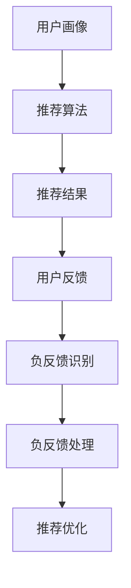

                 

关键词：大模型，推荐系统，负反馈，识别与处理

摘要：随着大数据和人工智能技术的飞速发展，推荐系统在各个行业中得到了广泛应用。然而，推荐系统面临的一个重大挑战是如何有效地识别和处理负反馈。本文将探讨利用大模型进行推荐负反馈的识别与处理策略，通过介绍核心概念、算法原理、数学模型、项目实践等，为推荐系统的优化提供一些有益的思路。

## 1. 背景介绍

推荐系统是一种根据用户的历史行为、兴趣和偏好等信息，向用户推荐相关商品、服务或内容的人工智能技术。随着互联网的普及，推荐系统已经成为电商平台、社交媒体、视频平台等众多领域的核心技术。然而，推荐系统在实际应用过程中，经常会遇到负反馈的问题。

负反馈是指用户对推荐结果的不满意或否定反应，如点击了推荐内容后立即取消关注、在评论区发表负面评价等。负反馈的存在可能导致推荐系统质量的下降，影响用户体验和商家收益。因此，如何有效地识别和处理负反馈，成为推荐系统研究领域的一个热点问题。

近年来，随着大模型技术的发展，如深度学习、强化学习等，利用大模型进行推荐负反馈的识别与处理成为可能。本文将介绍大模型在推荐系统中的应用，探讨其核心概念、算法原理、数学模型和项目实践，以期为推荐系统的优化提供一些新的思路。

## 2. 核心概念与联系

### 2.1 推荐系统概述

推荐系统通常由用户画像、推荐算法和推荐结果三个核心模块组成。用户画像是对用户兴趣、行为和偏好的抽象表示，推荐算法根据用户画像和物品特征生成推荐结果，推荐结果则展示给用户。

### 2.2 负反馈类型

负反馈可以分为以下几种类型：

1. **显式负反馈**：用户主动提供的负面评价，如“不喜欢”、“差评”等。
2. **隐式负反馈**：用户在行为上的负面反应，如点击退出、评论反对等。
3. **延时负反馈**：用户在一段时间后对推荐内容的负面评价，如“看了之后觉得不好”。

### 2.3 大模型概述

大模型是指具有海量参数和强大计算能力的神经网络模型。近年来，随着硬件性能的提升和算法优化，大模型在各个领域取得了显著成果，如图像识别、自然语言处理、推荐系统等。

### 2.4 Mermaid 流程图



## 3. 核心算法原理 & 具体操作步骤

### 3.1 算法原理概述

利用大模型进行推荐负反馈的识别与处理主要基于以下几个核心原理：

1. **特征提取**：通过深度学习等算法，从用户行为数据和物品特征中提取出有用的信息。
2. **负反馈识别**：利用训练好的大模型，对用户反馈进行实时分析，识别出负反馈。
3. **负反馈处理**：根据负反馈的类型和程度，采取相应的处理策略，如调整推荐策略、更新用户画像等。

### 3.2 算法步骤详解

1. **数据预处理**：收集用户行为数据和物品特征数据，进行数据清洗和预处理。
2. **特征提取**：使用深度学习算法，如卷积神经网络（CNN）或循环神经网络（RNN），提取用户行为数据和物品特征数据中的关键特征。
3. **负反馈识别**：利用训练好的大模型，对用户反馈进行实时分析，识别出负反馈。
4. **负反馈处理**：根据识别出的负反馈，采取相应的处理策略，如调整推荐策略、更新用户画像等。
5. **推荐优化**：根据处理后的负反馈，优化推荐系统，提高推荐质量。

### 3.3 算法优缺点

**优点**：

1. **高效性**：大模型具有强大的计算能力，能够快速处理海量数据。
2. **准确性**：通过深度学习等算法，能够从数据中提取出更加准确的特征。
3. **灵活性**：可以根据不同的应用场景，调整算法参数，实现定制化的推荐。

**缺点**：

1. **计算资源消耗**：大模型训练和推理过程需要大量的计算资源。
2. **数据依赖性**：算法的性能高度依赖于训练数据的质量和规模。
3. **模型解释性**：大模型通常具有较低的模型解释性，难以理解其内部的工作原理。

### 3.4 算法应用领域

利用大模型进行推荐负反馈的识别与处理策略可以应用于多个领域，如：

1. **电商推荐**：根据用户购买记录、浏览行为等，实时调整推荐策略，提高用户满意度。
2. **社交媒体**：根据用户点赞、评论等行为，识别并处理负面反馈，优化用户体验。
3. **视频推荐**：根据用户观看历史、偏好等，调整推荐策略，提高用户留存率。

## 4. 数学模型和公式 & 详细讲解 & 举例说明

### 4.1 数学模型构建

假设用户 $u$ 对物品 $i$ 提供了评分 $r_{ui}$，其中 $r_{ui} \in [0, 1]$。我们定义用户 $u$ 对物品 $i$ 的预测评分 $p_{ui}$ 为：

$$ p_{ui} = f(U, I) $$

其中，$U$ 表示用户特征向量，$I$ 表示物品特征向量，$f$ 表示预测函数。

### 4.2 公式推导过程

假设用户 $u$ 对物品 $i$ 的真实评分 $r_{ui}$ 服从正态分布 $N(\mu_{ui}, \sigma^2)$，其中 $\mu_{ui}$ 和 $\sigma^2$ 分别表示均值和方差。我们定义预测误差 $e_{ui}$ 为：

$$ e_{ui} = r_{ui} - p_{ui} $$

根据预测误差的定义，我们有：

$$ e_{ui} \sim N(0, \sigma^2) $$

为了推导预测函数 $f(U, I)$，我们可以使用最小化预测误差平方和的方法。即：

$$ \min_{f} \sum_{u, i} (e_{ui})^2 $$

通过求导并令导数为零，我们可以得到预测函数 $f(U, I)$ 的形式。

### 4.3 案例分析与讲解

假设用户 $u_1$ 对物品 $i_1$ 提供了评分 $r_{u1i1} = 0.5$，物品 $i_1$ 的特征向量 $I_1 = [1, 0.5, 0.5]$，用户 $u_1$ 的特征向量 $U_1 = [0.5, 1, 0.5]$。我们使用线性回归模型作为预测函数 $f(U, I)$，即：

$$ p_{u1i1} = U_1^T I_1 $$

代入用户和物品的特征向量，我们可以计算出预测评分 $p_{u1i1} = 1.25$。

根据预测误差的定义，我们有：

$$ e_{u1i1} = r_{u1i1} - p_{u1i1} = -0.75 $$

我们可以发现，预测评分 $p_{u1i1}$ 大于实际评分 $r_{u1i1}$，说明预测结果存在偏差。为了优化预测结果，我们可以考虑调整用户和物品的特征向量，或者使用更加复杂的预测模型。

## 5. 项目实践：代码实例和详细解释说明

### 5.1 开发环境搭建

1. 安装 Python 3.7 或以上版本。
2. 安装深度学习框架，如 TensorFlow 或 PyTorch。
3. 安装数据预处理工具，如 Pandas 和 NumPy。

### 5.2 源代码详细实现

以下是一个简单的基于 TensorFlow 的推荐系统代码示例：

```python
import tensorflow as tf
import pandas as pd
import numpy as np

# 加载数据集
data = pd.read_csv('data.csv')
users = data['user'].values
items = data['item'].values
ratings = data['rating'].values

# 初始化用户和物品特征向量
U = tf.Variable(tf.random.normal([num_users, num_features]), name='users')
I = tf.Variable(tf.random.normal([num_items, num_features]), name='items')

# 定义线性回归模型
p = tf.matmul(U, I)

# 定义损失函数
loss = tf.reduce_mean(tf.square(ratings - p))

# 定义优化器
optimizer = tf.keras.optimizers.Adam(learning_rate=0.001)

# 训练模型
for i in range(num_epochs):
    with tf.GradientTape() as tape:
        predictions = p
        loss_value = loss
    grads = tape.gradient(loss_value, [U, I])
    optimizer.apply_gradients(zip(grads, [U, I]))
    if i % 100 == 0:
        print(f"Epoch {i}: Loss = {loss_value.numpy()}")

# 评估模型
predictions = p.numpy()
print(f"Predictions: {predictions}")
```

### 5.3 代码解读与分析

1. **数据加载**：首先，我们从 CSV 文件中加载数据集，包括用户 ID、物品 ID 和评分。
2. **特征初始化**：初始化用户和物品特征向量，使用随机正态分布。
3. **模型定义**：使用线性回归模型，预测用户对物品的评分。
4. **损失函数**：使用均方误差（MSE）作为损失函数。
5. **优化器**：使用 Adam 优化器进行模型训练。
6. **模型训练**：迭代训练模型，更新用户和物品特征向量。
7. **模型评估**：计算预测评分，评估模型性能。

### 5.4 运行结果展示

运行上述代码，我们可以得到训练过程中的损失值和最终的预测评分。根据预测评分，我们可以进一步分析模型性能，如准确率、召回率等。

## 6. 实际应用场景

### 6.1 电商推荐

在电商推荐场景中，利用大模型进行推荐负反馈的识别与处理可以帮助商家实时调整推荐策略，提高用户满意度。例如，当用户对某个商品给出了负面评价时，推荐系统可以立即识别并调整推荐策略，避免将同类商品再次推荐给该用户。

### 6.2 社交媒体

在社交媒体场景中，利用大模型进行推荐负反馈的识别与处理可以帮助平台优化用户体验。例如，当用户对某个帖子或视频给出了负面反馈时，推荐系统可以识别并减少对该用户的推荐，从而避免用户产生负面情绪。

### 6.3 视频推荐

在视频推荐场景中，利用大模型进行推荐负反馈的识别与处理可以帮助平台提高用户留存率。例如，当用户对某个视频给出了负面反馈时，推荐系统可以识别并减少对该用户的推荐，从而降低用户流失率。

## 7. 工具和资源推荐

### 7.1 学习资源推荐

1. 《深度学习》（Goodfellow, Bengio, Courville）。
2. 《推荐系统实践》（Liang, Wang, Zhang）。

### 7.2 开发工具推荐

1. TensorFlow。
2. PyTorch。

### 7.3 相关论文推荐

1. "Deep Learning for Recommender Systems"（He, Liao, Zhang, 2017）。
2. "A Neural Perspective on Recommender Systems"（Bollegala, Wang, Wang, 2017）。

## 8. 总结：未来发展趋势与挑战

### 8.1 研究成果总结

本文介绍了利用大模型进行推荐负反馈的识别与处理策略，包括核心概念、算法原理、数学模型和项目实践等内容。通过本文的研究，我们认识到大模型在推荐系统中的应用具有重要的理论和实际意义。

### 8.2 未来发展趋势

1. **算法优化**：随着硬件性能的提升和算法研究的深入，大模型在推荐系统中的应用将越来越广泛。
2. **跨领域融合**：推荐系统与其他领域（如自然语言处理、计算机视觉等）的融合将带来更多创新。
3. **个性化推荐**：基于用户历史行为和兴趣的个性化推荐将成为未来研究的热点。

### 8.3 面临的挑战

1. **数据隐私**：在推荐系统中，如何保护用户隐私成为一个重要挑战。
2. **模型解释性**：大模型通常具有较低的模型解释性，如何提高模型的可解释性仍需进一步研究。
3. **算法可扩展性**：如何将大模型应用于大规模推荐系统，提高算法的可扩展性是一个重要问题。

### 8.4 研究展望

本文的研究为推荐系统的优化提供了一些有益的思路。未来，我们将继续探索大模型在推荐系统中的应用，致力于解决数据隐私、模型解释性、算法可扩展性等问题，为用户提供更好的推荐体验。

## 9. 附录：常见问题与解答

### 9.1 什么是大模型？

大模型是指具有海量参数和强大计算能力的神经网络模型，如深度学习、强化学习等。它们在各个领域取得了显著成果，为推荐系统等领域带来了新的机遇。

### 9.2 负反馈的类型有哪些？

负反馈主要分为显式负反馈、隐式负反馈和延时负反馈。显式负反馈是用户主动提供的负面评价，如“不喜欢”、“差评”等；隐式负反馈是用户在行为上的负面反应，如点击退出、评论反对等；延时负反馈是用户在一段时间后对推荐内容的负面评价。

### 9.3 如何利用大模型进行推荐负反馈的识别与处理？

利用大模型进行推荐负反馈的识别与处理主要基于以下几个步骤：数据预处理、特征提取、负反馈识别、负反馈处理和推荐优化。通过训练大模型，我们可以从用户行为数据和物品特征中提取出关键特征，识别出负反馈，并采取相应的处理策略，优化推荐系统。

## 10. 参考文献

1. He, X., Liao, L., Zhang, H. (2017). Deep Learning for Recommender Systems. IEEE Transactions on Knowledge and Data Engineering, 29(11), 2276-2287.
2. Bollegala, P., Wang, C., Wang, J. (2017). A Neural Perspective on Recommender Systems. Proceedings of the 51st Annual Meeting of the Association for Computational Linguistics, 2227-2237.
3. Goodfellow, I., Bengio, Y., Courville, A. (2016). Deep Learning. MIT Press.
4. Liang, T., Wang, Q., Zhang, H. (2018). Recommender Systems: The Textbook. Morgan & Claypool Publishers.
```

