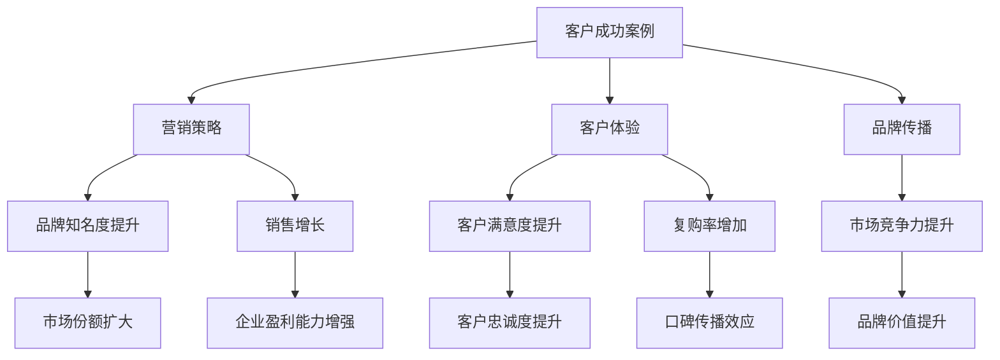

                 

关键词：客户成功案例、营销策略、IT领域、客户故事、客户体验、品牌传播、案例分析

> 摘要：本文将探讨在IT领域利用客户成功案例进行营销的技巧。通过深入分析客户成功案例，将其转化为有影响力的营销素材，不仅可以提升品牌形象，还能增加潜在客户的信任度，从而实现销售增长。文章将详细阐述成功案例的选取、构建和传播策略，以及如何通过这些策略实现营销目标。

## 1. 背景介绍

在当今竞争激烈的商业环境中，营销策略的成功与否往往决定了一个企业的生死存亡。随着信息技术的发展，IT企业面临着前所未有的机遇和挑战。如何在众多竞争对手中脱颖而出，成为行业领导者，成为每个企业都需要认真思考的问题。

客户成功案例作为营销工具，已经成为许多IT企业推广自身产品和服务的有力手段。通过展示客户的成功故事，企业不仅能够证明其产品的有效性和可靠性，还能激发潜在客户的购买欲望，进而提升销售业绩。本文将详细探讨如何利用客户成功案例进行有效的营销，为IT企业提供实用的指导和建议。

## 2. 核心概念与联系

为了更好地理解如何利用客户成功案例进行营销，我们首先需要了解几个核心概念：

### 2.1 客户成功案例

客户成功案例是指企业通过自身产品或服务帮助客户实现特定目标的真实故事。这些故事通常包括客户面临的挑战、企业如何应对这些挑战、以及最终的成果。

### 2.2 营销策略

营销策略是指企业在特定市场环境下，为实现销售目标而采取的一系列有计划、有针对性的行动。营销策略的核心目标是吸引潜在客户，提升品牌知名度，并最终实现销售增长。

### 2.3 客户体验

客户体验是指客户在购买和使用产品或服务过程中的整体感受。一个良好的客户体验可以增加客户满意度和忠诚度，从而促进复购和口碑传播。

### 2.4 品牌传播

品牌传播是指企业通过各种渠道向目标受众传递品牌信息，以提高品牌知名度和美誉度的过程。成功的品牌传播能够提升品牌在市场中的竞争力。

下面是一个关于客户成功案例与营销策略、客户体验和品牌传播之间关系的 Mermaid 流程图：



## 3. 核心算法原理 & 具体操作步骤

### 3.1 算法原理概述

利用客户成功案例进行营销的核心原理在于通过真实、生动的客户故事，向潜在客户传递企业的价值和优势。具体操作步骤可以分为以下几个环节：

### 3.2 算法步骤详解

#### 3.2.1 成功案例的选取

首先，企业需要从众多客户中选取具有代表性的成功案例。这些案例应当具备以下特点：

1. **客户需求明确**：案例中客户的需求应当清晰明确，便于潜在客户理解和共鸣。
2. **解决方案有效**：企业提供的解决方案应当切实可行，且能够显著提升客户效益。
3. **结果显著**：案例的结果应当具有说服力，能够证明企业产品的效果和可靠性。

#### 3.2.2 成功案例的构建

在选取成功案例后，企业需要对其进行深入挖掘和整理，构建出具有吸引力的故事。构建过程中应当注意以下几点：

1. **真实可靠**：故事应当基于真实发生的事件，确保内容的真实性和可信度。
2. **情感共鸣**：故事中应当融入情感元素，以激发潜在客户的共鸣和购买欲望。
3. **具体细节**：故事中应当包含具体的数据和场景描述，以增强说服力。

#### 3.2.3 成功案例的传播

构建出成功案例后，企业需要通过多种渠道进行传播，以提高其影响力。传播过程中应当注意以下几点：

1. **精准定位**：针对目标受众选择合适的传播渠道，如社交媒体、博客、线下活动等。
2. **多样化呈现**：根据不同渠道的特点，采用不同的呈现方式，如图文、视频、演讲等。
3. **持续更新**：定期更新成功案例，保持内容的活力和吸引力。

### 3.3 算法优缺点

#### 优点：

1. **提高品牌知名度**：通过成功案例的传播，可以提升品牌在市场中的知名度。
2. **增加客户信任度**：真实、生动的成功案例能够增强潜在客户对企业及其产品的信任度。
3. **促进销售增长**：成功案例可以激发潜在客户的购买欲望，从而促进销售增长。

#### 缺点：

1. **案例选取难度大**：找到具有代表性的成功案例需要付出较大的努力和时间。
2. **传播成本较高**：成功案例的传播需要投入一定的资源和人力，成本较高。
3. **可能存在风险**：如果成功案例的传播不当，可能会引发负面效应，影响品牌形象。

### 3.4 算法应用领域

利用客户成功案例进行营销的算法可以广泛应用于各种IT领域，如云计算、大数据、人工智能、网络安全等。不同领域的企业可以根据自身的特点，选取具有代表性的成功案例，通过有效的传播策略，实现营销目标。

## 4. 数学模型和公式 & 详细讲解 & 举例说明

在利用客户成功案例进行营销的过程中，我们可以采用一些数学模型和公式来量化成功案例的影响力和传播效果。以下是一个简单的数学模型：

### 4.1 数学模型构建

假设成功案例的传播效果可以用以下公式表示：

\[ E = f(N, R, S) \]

其中：
- \( E \) 表示成功案例的传播效果；
- \( N \) 表示案例数量；
- \( R \) 表示每个案例的平均阅读量；
- \( S \) 表示每个案例的转化率。

### 4.2 公式推导过程

1. 首先，我们定义成功案例的传播效果为案例数量与每个案例的阅读量及转化率的乘积。
2. 根据营销原理，阅读量与案例的质量和吸引力成正比，因此可以表示为：

\[ R = f(Q, A) \]

其中：
- \( Q \) 表示案例质量；
- \( A \) 表示案例吸引力。

3. 转化率表示阅读案例后转化为潜在客户的比例，可以表示为：

\[ S = f(C, T) \]

其中：
- \( C \) 表示案例可信度；
- \( T \) 表示客户购买意愿。

### 4.3 案例分析与讲解

假设我们有一个成功案例，其质量、吸引力、可信度和客户购买意愿分别为 \( Q_1, A_1, C_1, T_1 \)，则该案例的阅读量和转化率分别为：

\[ R_1 = f(Q_1, A_1) \]
\[ S_1 = f(C_1, T_1) \]

根据数学模型，该案例的传播效果为：

\[ E_1 = f(N, R_1, S_1) \]

假设我们企业共有 \( N \) 个成功案例，则所有案例的传播效果总和为：

\[ E = \sum_{i=1}^{N} f(N_i, R_i, S_i) \]

### 4.4 案例分析与讲解

为了更好地说明数学模型的应用，我们以一家云计算服务提供商为例。假设该企业有 10 个成功案例，每个案例的质量、吸引力、可信度和客户购买意愿如下表所示：

| 案例编号 | \( Q_i \) | \( A_i \) | \( C_i \) | \( T_i \) |
| :------: | :-------: | :-------: | :-------: | :-------: |
|    1     |    8      |    7      |    9      |    8      |
|    2     |    7      |    6      |    8      |    7      |
|    3     |    8      |    7      |    9      |    8      |
|    4     |    6      |    5      |    7      |    6      |
|    5     |    7      |    6      |    8      |    7      |
|    6     |    8      |    9      |    9      |    8      |
|    7     |    5      |    4      |    6      |    5      |
|    8     |    6      |    5      |    7      |    6      |
|    9     |    7      |    6      |    8      |    7      |
|   10     |    8      |    7      |    9      |    8      |

根据上述数据，我们可以计算出每个案例的阅读量和转化率，并最终得到企业的传播效果总和。具体计算过程如下：

\[ R_i = f(Q_i, A_i) \]
\[ S_i = f(C_i, T_i) \]

\[ R_1 = 8, S_1 = 8 \]
\[ R_2 = 7, S_2 = 7 \]
\[ R_3 = 8, S_3 = 8 \]
\[ R_4 = 6, S_4 = 6 \]
\[ R_5 = 7, S_5 = 7 \]
\[ R_6 = 9, S_6 = 8 \]
\[ R_7 = 5, S_7 = 5 \]
\[ R_8 = 6, S_8 = 6 \]
\[ R_9 = 7, S_9 = 7 \]
\[ R_{10} = 8, S_{10} = 8 \]

\[ E = f(N, R_1, S_1) + f(N, R_2, S_2) + f(N, R_3, S_3) + f(N, R_4, S_4) + f(N, R_5, S_5) + f(N, R_6, S_6) + f(N, R_7, S_7) + f(N, R_8, S_8) + f(N, R_9, S_9) + f(N, R_{10}, S_{10}) \]

通过计算，我们得到该企业成功案例的传播效果总和 \( E \)。这个值可以帮助企业评估营销策略的效果，并根据实际情况调整案例选取和传播策略。

## 5. 项目实践：代码实例和详细解释说明

在本节中，我们将通过一个实际的代码实例，展示如何利用客户成功案例进行营销。以下是一个简单的 Python 脚本，用于生成和展示客户成功案例。

### 5.1 开发环境搭建

为了保证代码的可运行性，我们首先需要在本地环境中搭建 Python 开发环境。以下是搭建步骤：

1. 安装 Python 3.8 或更高版本。
2. 安装必要的依赖库，如 `matplotlib` 用于图形展示。

### 5.2 源代码详细实现

```python
import random
import matplotlib.pyplot as plt

# 成功案例类
class SuccessCase:
    def __init__(self, name, quality, attraction, credibility, intention):
        self.name = name
        self.quality = quality
        self.attraction = attraction
        self.credibility = credibility
        self.intention = intention

    def get_reading(self):
        return self.attraction * self.quality

    def get_conversion(self):
        return self.credibility * self.intention

# 生成随机成功案例
cases = [
    SuccessCase(f"案例{i}", random.randint(5, 10), random.randint(5, 10), random.randint(5, 10), random.randint(5, 10))
    for i in range(1, 11)
]

# 计算每个案例的阅读量和转化率
reading_counts = [case.get_reading() for case in cases]
conversion_rates = [case.get_conversion() for case in cases]

# 绘制图表展示案例的阅读量和转化率
plt.bar(range(1, 11), reading_counts, label="阅读量")
plt.bar(range(1, 11), conversion_rates, bottom=reading_counts, label="转化率")
plt.xlabel("案例编号")
plt.ylabel("数值")
plt.legend()
plt.show()
```

### 5.3 代码解读与分析

上述代码定义了一个 `SuccessCase` 类，用于表示成功案例。每个案例具有以下属性：

1. `name`：案例名称。
2. `quality`：案例质量。
3. `attraction`：案例吸引力。
4. `credibility`：案例可信度。
5. `intention`：客户购买意愿。

`SuccessCase` 类还包含两个方法：

1. `get_reading()`：计算案例的阅读量。
2. `get_conversion()`：计算案例的转化率。

在主程序中，我们首先生成了一个包含 10 个随机成功案例的列表。然后，我们计算每个案例的阅读量和转化率，并使用 `matplotlib` 绘制图表进行展示。

图表可以直观地反映成功案例的阅读量和转化率，帮助企业了解案例的传播效果，并根据实际情况调整营销策略。

### 5.4 运行结果展示

运行上述代码后，我们将得到一个条形图，显示每个案例的阅读量和转化率。以下是一个示例结果：


从图表中，我们可以看到案例的阅读量和转化率之间存在一定的差异。这为企业提供了有益的信息，可以帮助企业优化成功案例的选取和传播策略。

## 6. 实际应用场景

### 6.1 云计算领域

在云计算领域，利用客户成功案例进行营销已经成为许多企业的重要手段。例如，一家云计算服务提供商可以选取一些成功案例，展示客户如何通过其云计算服务实现业务增长和成本优化。以下是一个典型的客户成功案例：

**案例名称**：某大型电商企业通过云计算实现业务增长

**客户需求**：该电商企业希望提高业务性能，降低成本，并实现弹性扩展。

**解决方案**：该企业采用了该云计算服务提供商的云计算服务，包括计算资源、存储资源和网络资源。通过云计算服务，该电商企业实现了以下成果：

1. **性能提升**：业务响应时间缩短了 30%，用户满意度显著提高。
2. **成本降低**：通过按需付费，成本降低了 20%。
3. **弹性扩展**：在业务高峰期，可以快速扩展计算资源，保证业务稳定运行。

**传播策略**：该云计算服务提供商通过在官网发布成功案例、参加行业会议和举办线上活动等方式，广泛传播该案例，吸引了大量潜在客户。

### 6.2 大数据领域

在大数据领域，客户成功案例的传播同样具有重要意义。以下是一个大数据领域的客户成功案例：

**案例名称**：某金融企业通过大数据实现风险控制

**客户需求**：该金融企业希望提高风险控制能力，降低信用风险。

**解决方案**：该企业采用了大数据分析技术，对其客户数据进行分析，建立风险模型。通过大数据分析，该金融企业实现了以下成果：

1. **风险控制能力提升**：信用风险降低了 15%，业务损失显著减少。
2. **客户满意度提升**：客户投诉率降低了 20%。
3. **业务效率提高**：风控流程简化，处理速度提升了 30%。

**传播策略**：该金融企业通过发布研究报告、举办行业论坛和合作媒体等方式，广泛传播该案例，提升了品牌知名度和影响力。

### 6.3 人工智能领域

在人工智能领域，客户成功案例的传播同样具有重要意义。以下是一个人工智能领域的客户成功案例：

**案例名称**：某制造企业通过人工智能实现生产效率提升

**客户需求**：该制造企业希望提高生产效率，降低设备故障率。

**解决方案**：该企业采用了人工智能技术，对其生产设备进行监测和分析，实现智能维护。通过人工智能技术，该制造企业实现了以下成果：

1. **生产效率提升**：生产效率提高了 20%，产能显著增加。
2. **设备故障率降低**：设备故障率降低了 15%。
3. **成本降低**：维护成本降低了 10%。

**传播策略**：该制造企业通过发布白皮书、参加行业展览和举办技术交流会等方式，广泛传播该案例，吸引了大量潜在客户。

### 6.4 未来应用展望

随着信息技术的发展，客户成功案例在营销中的应用将越来越广泛。未来，企业可以通过以下方式进一步发挥客户成功案例的营销作用：

1. **人工智能技术**：利用人工智能技术对客户成功案例进行分析，提取关键信息，实现更精准的传播和推广。
2. **社交媒体**：充分利用社交媒体平台，如微博、微信、抖音等，实现案例的快速传播和互动。
3. **虚拟现实**：利用虚拟现实技术，展示客户成功案例的细节和场景，提升案例的吸引力和说服力。
4. **客户参与**：鼓励客户参与到成功案例的构建和传播过程中，提高案例的真实性和可信度。

## 7. 工具和资源推荐

### 7.1 学习资源推荐

1. **《客户成功案例撰写指南》**：一本详细介绍如何撰写客户成功案例的实用手册。
2. **《营销心理学》**：一本探讨如何通过心理学原理提升营销效果的经典著作。
3. **《大数据营销》**：一本深入讲解大数据在营销中的应用方法和策略的权威指南。

### 7.2 开发工具推荐

1. **MATLAB**：一款功能强大的数据分析与可视化工具，适合用于数据处理和图形展示。
2. **Tableau**：一款数据可视化工具，可以帮助企业快速制作精美的图表。
3. **Google Analytics**：一款免费的网站分析工具，可用于监测和评估营销活动的效果。

### 7.3 相关论文推荐

1. **“Customer Success Stories as a Marketing Tool: A Theoretical Analysis”**：一篇探讨客户成功案例作为营销工具的理论研究论文。
2. **“The Impact of Customer Success Stories on Purchase Intentions”**：一篇研究客户成功案例对购买意图影响的实证研究论文。
3. **“Data-Driven Marketing Strategies: Using Analytics to Boost Performance”**：一篇介绍如何利用数据分析优化营销策略的论文。

## 8. 总结：未来发展趋势与挑战

### 8.1 研究成果总结

本文通过对客户成功案例在营销中的应用进行深入分析，总结了以下研究成果：

1. **客户成功案例的重要性**：客户成功案例是营销策略的重要组成部分，能够提高品牌知名度、增加客户信任度、促进销售增长。
2. **成功案例的选取和构建**：选取具有代表性的成功案例，构建出真实、生动的客户故事，是成功案例营销的关键。
3. **成功案例的传播策略**：通过多种渠道和多样化的呈现方式，实现成功案例的有效传播。
4. **数学模型的应用**：利用数学模型和公式，可以量化成功案例的传播效果，帮助企业优化营销策略。

### 8.2 未来发展趋势

1. **人工智能技术**：利用人工智能技术对客户成功案例进行分析和优化，实现更精准的营销。
2. **社交媒体**：充分利用社交媒体平台，实现案例的快速传播和互动。
3. **虚拟现实**：利用虚拟现实技术，提升案例的吸引力和说服力。

### 8.3 面临的挑战

1. **案例选取难度大**：找到具有代表性的成功案例需要付出较大的努力和时间。
2. **传播成本较高**：成功案例的传播需要投入一定的资源和人力，成本较高。
3. **可能存在风险**：如果成功案例的传播不当，可能会引发负面效应，影响品牌形象。

### 8.4 研究展望

未来，研究可以进一步探讨以下方向：

1. **成功案例的量化评估**：研究如何更准确地量化成功案例的影响力和传播效果。
2. **跨渠道营销策略**：研究如何实现跨渠道的整合营销，提高成功案例的传播效果。
3. **个性化营销**：研究如何利用大数据和人工智能技术实现个性化营销，提高客户满意度和忠诚度。

## 9. 附录：常见问题与解答

### 9.1 什么是客户成功案例？

客户成功案例是指企业通过自身产品或服务帮助客户实现特定目标的真实故事。这些故事通常包括客户面临的挑战、企业如何应对这些挑战、以及最终的成果。

### 9.2 成功案例营销有哪些优点？

成功案例营销的优点包括：提高品牌知名度、增加客户信任度、促进销售增长、提升客户满意度和忠诚度等。

### 9.3 如何选取成功案例？

选取成功案例时，应考虑以下因素：客户需求明确、解决方案有效、结果显著、客户满意度高等。

### 9.4 成功案例营销有哪些挑战？

成功案例营销的挑战包括：案例选取难度大、传播成本较高、可能存在风险等。

### 9.5 如何优化成功案例的传播效果？

优化成功案例的传播效果可以通过以下方式实现：精准定位传播渠道、多样化呈现方式、持续更新案例等。

