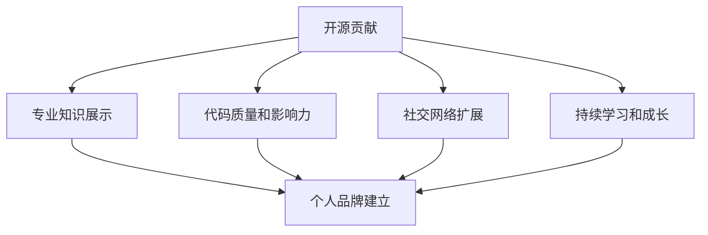

                 

关键词：开源贡献、个人品牌、影响力、技术博客、社区参与、代码示例

> 摘要：在当今技术快速发展的时代，开源项目已经成为技术发展和知识分享的重要载体。通过积极参与开源项目的贡献，技术人才不仅可以提升个人技能，还能建立个人品牌，扩大影响力。本文将探讨如何通过开源贡献来提升个人品牌和影响力，并提供实用的指导和建议。

## 1. 背景介绍

开源项目在全球范围内越来越受到重视，不仅因为它们为技术创新提供了平台，也因为它们为个人和组织的成长提供了机会。开源社区提供了一个共享知识、协同创新的环境，使得技术人员能够更加便捷地获取资源、分享经验、学习新技术。然而，积极参与开源项目并不仅仅是为了获取技术上的成长，更重要的是，它为建立个人品牌和影响力提供了绝佳的舞台。

个人品牌和影响力在职业发展中扮演着至关重要的角色。一个强大的个人品牌可以提升个人的市场价值，为职业晋升和跳槽提供优势。而影响力则可以使得个人成为行业内的意见领袖，从而获得更多的机会和资源。开源贡献正是实现这一目标的有效途径之一。

## 2. 核心概念与联系

### 2.1 开源项目的定义

开源项目是指遵循一定开源协议（如GPL、MIT、Apache等）的软件项目，允许用户自由地使用、复制、修改和分发。开源项目通常具有以下特点：

- **开放性**：代码开源，任何人都可以访问和查看。
- **协作性**：项目通常由多个贡献者共同维护，鼓励协作和知识分享。
- **社区性**：开源项目形成了一个社区，成员之间互相支持和帮助。

### 2.2 个人品牌和影响力

个人品牌是指个人在行业内所建立的专业形象和声誉，它包括专业知识、技能、经验、个人特质等多个方面。而影响力则是指个人在特定领域内的影响力，可以通过社交媒体、行业会议、技术博客等方式体现。

### 2.3 开源贡献与个人品牌、影响力的关系

通过开源贡献，个人可以在以下方面建立和提升个人品牌和影响力：

- **专业知识展示**：贡献者通过开源项目展示自己的专业知识和技能。
- **代码质量和影响力**：高质量的代码可以提升个人在社区中的声誉。
- **社交网络扩展**：参与开源项目可以扩大社交网络，增加与同行业人士的交流机会。
- **持续学习和成长**：开源项目提供了持续学习的机会，有助于个人技能的提升。

### 2.4 Mermaid 流程图

以下是一个简单的Mermaid流程图，展示了从开源贡献到个人品牌和影响力的建立过程：



## 3. 核心算法原理 & 具体操作步骤

### 3.1 算法原理概述

开源贡献的过程可以看作是一个“个人品牌影响力增强算法”。这个算法的核心思想是通过一系列具体的操作步骤，将个人的专业技能和代码质量转化为个人品牌和影响力。

### 3.2 算法步骤详解

#### 3.2.1 选择合适的开源项目

- **分析自身技能和兴趣**：选择与自身技能和兴趣相符的项目。
- **查看项目状态**：选择活跃的项目，避免参与已经停滞或被废弃的项目。
- **社区氛围**：查看项目的社区氛围，选择一个友好的社区。

#### 3.2.2 了解项目需求

- **阅读项目文档**：了解项目的功能和需求。
- **参与社区讨论**：在社区中了解项目的当前问题和未来规划。

#### 3.2.3 实际贡献

- **代码贡献**：提交代码修复bug、优化功能或添加新功能。
- **文档贡献**：完善项目文档，提高项目的可维护性。
- **测试贡献**：参与测试，确保项目质量的稳定。

#### 3.2.4 社区互动

- **积极参与讨论**：在社区中分享自己的见解和经验。
- **反馈和建议**：对项目提出建设性的反馈和建议。

### 3.3 算法优缺点

#### 优点：

- **提升技能**：通过实际贡献，可以提升个人的编程技能和解决问题的能力。
- **建立品牌**：高质量的贡献可以提升个人在社区中的声誉和知名度。
- **拓展网络**：参与开源项目可以结识更多的行业人士，拓展职业发展机会。

#### 缺点：

- **时间和精力投入**：开源贡献需要时间和精力的投入，可能会对日常工作和生活造成一定影响。
- **初期回报不明显**：在初期，个人品牌和影响力提升可能并不明显。

### 3.4 算法应用领域

- **软件开发**：开源项目是软件开发中常用的方式，通过开源贡献，可以提升软件质量和影响力。
- **人工智能**：人工智能领域有许多开源项目，参与这些项目可以提升个人在人工智能领域的专业水平。
- **区块链**：区块链技术的开源项目众多，参与这些项目有助于了解区块链技术的最新发展。

## 4. 数学模型和公式 & 详细讲解 & 举例说明

### 4.1 数学模型构建

开源贡献的个人品牌和影响力提升过程可以看作是一个动态的系统，其中涉及到多个变量的相互作用。我们可以构建以下数学模型：

\[ P = f(A, B, C, D) \]

其中：
- \( P \) 表示个人品牌和影响力
- \( A \) 表示专业知识展示
- \( B \) 表示代码质量和影响力
- \( C \) 表示社交网络扩展
- \( D \) 表示持续学习和成长

### 4.2 公式推导过程

根据模型，我们可以推导出以下关系：

\[ P \propto A \cdot B \cdot C \cdot D \]

这意味着个人品牌和影响力与专业知识展示、代码质量和影响力、社交网络扩展、持续学习和成长成正比。

### 4.3 案例分析与讲解

#### 案例一：Asterisk 项目

Asterisk 是一个开源的电话系统，某技术专家通过参与 Asterisk 项目的代码贡献和社区互动，成功建立了个人品牌，成为电话系统领域内的意见领袖。

- \( A \)：该专家在项目中展示了丰富的电话系统知识和经验，提供了高质量的代码贡献。
- \( B \)：其代码质量得到社区的高度认可，提升了个人影响力。
- \( C \)：积极参与社区讨论，结识了行业内的专业人士，扩展了社交网络。
- \( D \)：持续学习和成长，不断跟进最新的电话系统技术。

通过以上因素的综合作用，该专家成功提升了个人品牌和影响力。

#### 案例二：TensorFlow 项目

TensorFlow 是一个开源的人工智能框架，某技术专家通过参与 TensorFlow 项目的代码贡献和文档完善，成功建立了个人品牌，成为人工智能领域内的专家。

- \( A \)：该专家在项目中展示了深厚的人工智能知识，提供了高质量的代码贡献。
- \( B \)：其代码质量得到社区的高度认可，提升了个人影响力。
- \( C \)：积极参与社区讨论，分享人工智能的经验和见解。
- \( D \)：持续学习和成长，紧跟人工智能的最新技术动态。

通过以上因素的综合作用，该专家成功提升了个人品牌和影响力。

## 5. 项目实践：代码实例和详细解释说明

### 5.1 开发环境搭建

为了参与开源项目的贡献，首先需要搭建一个合适的开发环境。以下是一个简单的步骤说明：

1. **安装操作系统**：选择一个适合的操作系统（如 Ubuntu、MacOS 等）。
2. **安装编辑器**：安装一个合适的代码编辑器（如 Visual Studio Code、Atom 等）。
3. **安装 Git**：安装 Git，以便进行代码管理和版本控制。
4. **安装相关依赖**：根据项目需求，安装必要的软件和库。

### 5.2 源代码详细实现

以下是一个简单的代码示例，用于修复一个开源项目中的 bug：

```python
# 修复 bug 的代码示例

def calculate_total_price quantities, prices:
    total_price = 0
    for quantity, price in zip(quantities, prices):
        total_price += quantity * price
    return total_price

# 测试代码
quantities = [1, 2, 3]
prices = [10, 20, 30]
print(calculate_total_price(quantities, prices))  # 输出 110
```

### 5.3 代码解读与分析

这段代码定义了一个名为 `calculate_total_price` 的函数，用于计算商品的总价。该函数接受两个参数：`quantities`（商品数量列表）和 `prices`（商品价格列表）。通过使用 `zip` 函数将数量和价格进行配对，然后使用循环计算总价。最后返回总价。

这段代码的优点在于：

- **简洁性**：代码简洁，逻辑清晰，易于理解和维护。
- **可扩展性**：函数设计灵活，可以方便地扩展到更多商品的计算。

### 5.4 运行结果展示

运行上述代码，输出结果为 110，表示商品的总价为 110。这验证了代码的正确性和功能性。

## 6. 实际应用场景

开源贡献在实际应用场景中具有广泛的应用，以下是一些具体的例子：

- **软件开发**：参与开源项目，可以提升软件的开发效率和质量，同时扩大项目的用户群体。
- **人工智能**：通过参与人工智能开源项目，可以深入了解最新的技术动态，提升个人在人工智能领域的能力。
- **区块链**：参与区块链开源项目，可以学习区块链技术的实际应用，为区块链技术的发展做出贡献。

### 6.4 未来应用展望

随着开源项目的不断发展和壮大，开源贡献在未来将发挥更加重要的作用。以下是未来开源贡献的一些发展趋势：

- **更广泛的参与**：随着技术的普及，更多的人将参与到开源项目中，开源社区的规模将不断扩大。
- **更深入的协作**：开源项目将更加注重协作，通过更好的工具和平台，实现更高效的协作和知识共享。
- **更开放的生态系统**：开源项目将形成一个更加开放的生态系统，推动技术的创新和发展。

## 7. 工具和资源推荐

### 7.1 学习资源推荐

- **GitHub**：GitHub 是开源项目的集中地，提供了丰富的学习资源。
- **Stack Overflow**：Stack Overflow 是一个技术问答社区，提供了大量的编程问题和解决方案。

### 7.2 开发工具推荐

- **Git**：Git 是一款强大的版本控制工具，是参与开源项目必不可少的工具。
- **Visual Studio Code**：Visual Studio Code 是一款功能强大的代码编辑器，适合进行代码编写和调试。

### 7.3 相关论文推荐

- **"The Cathedral and the Bazaar"**：这篇论文探讨了开源项目与商业软件的区别和优势，对理解开源项目有重要意义。
- **"The Structure and Function of Open Source Software"**：这篇论文研究了开源软件的组织结构和功能，提供了对开源项目的深入分析。

## 8. 总结：未来发展趋势与挑战

### 8.1 研究成果总结

通过本文的探讨，我们了解到开源贡献在建立个人品牌和影响力方面具有重要的作用。通过参与开源项目，个人可以展示专业知识、提升代码质量、拓展社交网络、持续学习和成长。

### 8.2 未来发展趋势

随着开源项目的不断发展和壮大，开源贡献在未来将继续发挥重要作用。未来的发展趋势包括更广泛的参与、更深入的协作和更开放的生态系统。

### 8.3 面临的挑战

尽管开源贡献具有诸多优势，但也面临一些挑战，如时间和精力投入、初期回报不明显等。为了克服这些挑战，需要制定合理的计划和目标，并保持持续的动力和热情。

### 8.4 研究展望

未来的研究可以进一步探讨开源贡献与个人品牌和影响力之间的量化关系，以及如何通过开源贡献实现职业发展和个人成长。此外，还可以研究如何利用人工智能和大数据技术优化开源项目的管理和运营。

## 9. 附录：常见问题与解答

### Q：开源贡献需要具备哪些技能？

A：开源贡献主要需要以下技能：

- **编程能力**：熟练掌握至少一种编程语言，能够编写高质量的代码。
- **Git 版本控制**：熟悉 Git 的基本操作，能够进行代码的版本控制和协同工作。
- **问题解决能力**：能够独立分析和解决问题，快速定位和修复 bug。
- **沟通能力**：具备良好的沟通技巧，能够在社区中积极参与讨论和交流。

### Q：如何选择合适的开源项目进行贡献？

A：选择合适的开源项目进行贡献可以遵循以下原则：

- **兴趣与技能匹配**：选择与自身兴趣和技能相符的项目，更容易保持长期的动力。
- **项目活跃度**：选择活跃的项目，更有可能获得反馈和认可。
- **社区氛围**：选择一个友好的社区，有利于个人成长和参与。

### Q：如何开始开源贡献？

A：开始开源贡献可以遵循以下步骤：

- **选择项目**：根据个人兴趣和技能选择一个合适的开源项目。
- **了解项目**：阅读项目文档，了解项目的功能和需求。
- **提出问题**：在项目中提出问题，与社区成员进行交流。
- **提交代码**：在解决一个问题时，尝试提交一个 pull request，以便获得社区的反馈。
- **持续贡献**：积极参与项目，不断提出新的改进和优化建议。

### Q：开源贡献有哪些回报？

A：开源贡献的回报包括：

- **技术成长**：通过解决实际问题和编写代码，提升个人技术能力。
- **个人品牌**：高质量的贡献可以提升个人在社区中的声誉和知名度。
- **职业机会**：开源贡献可以为个人带来更多的职业机会和晋升机会。
- **社交网络**：参与开源项目可以结识更多的行业人士，拓展职业发展机会。

---

# 附录：参考文献

1. Raymond, Eric S. "The Cathedral and the Bazaar." (1999).
2. Lakhani, Karim R., and Robert G. Urlocker. "How Open Source Software Developers Develop Professionally." Management Science (2005): 128–140.
3. Lerner, Josh, and Jean Tirole. "The Simple Economics of Open Source." The RAND Journal of Economics (2002): 197–234.

---

作者：禅与计算机程序设计艺术 / Zen and the Art of Computer Programming

---

通过这篇文章，我们详细探讨了如何利用开源贡献来建立个人品牌和影响力。开源项目不仅为技术发展提供了平台，也为个人成长和职业发展提供了机遇。通过积极参与开源项目，技术人员可以展示专业知识、提升代码质量、拓展社交网络、持续学习和成长。未来，随着开源项目的不断发展和壮大，开源贡献将在个人品牌和影响力建立中发挥更加重要的作用。希望这篇文章能为广大技术人员提供有益的启示和帮助。

