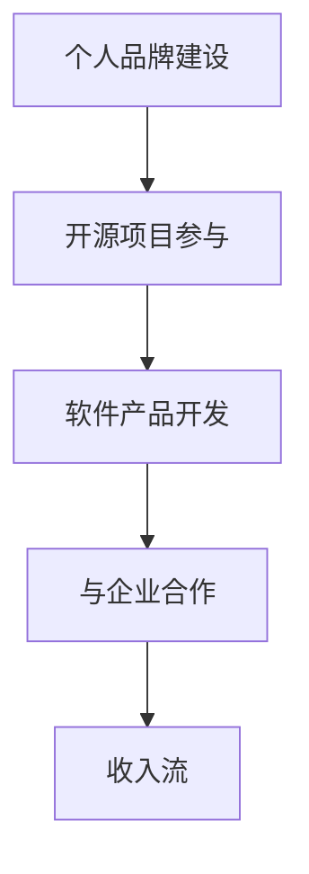
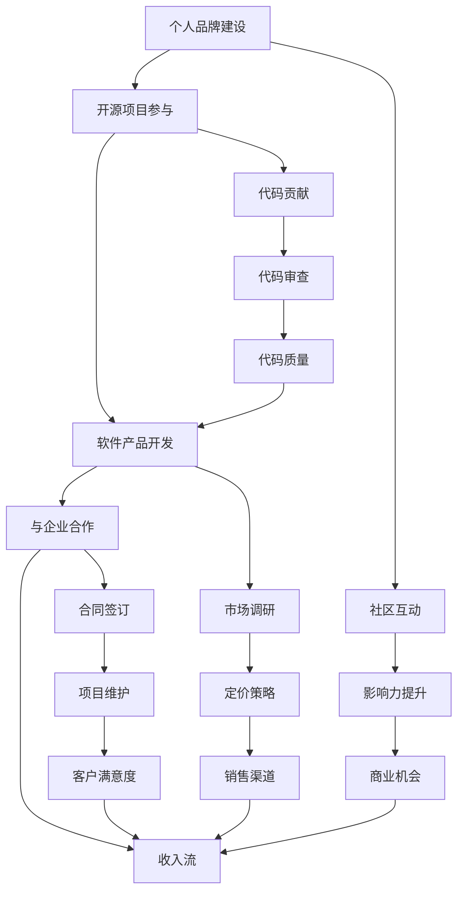

                 

 在当今这个数字化时代，开源项目已经成为软件开发不可或缺的一部分。它们不仅为开发者提供了一个协作和分享的平台，而且还推动了技术的创新和进步。然而，许多开发者可能会担心，贡献开源项目是否会占用他们宝贵的时间，进而影响他们的收入。本文将探讨如何利用开源项目创造收入流，帮助开发者实现个人和项目的双赢。

## 文章关键词

- 开源项目
- 创造收入
- 个人品牌
- 软件产品
- 企业合作

## 文章摘要

本文将介绍如何通过参与开源项目来创造收入流。我们将探讨个人品牌建设、软件产品开发和与企业合作等策略，以及如何平衡开源贡献与商业利益。通过实际案例和经验分享，我们希望为开发者提供实用的指导和建议。

### 1. 背景介绍

开源项目起源于20世纪90年代，随着互联网的普及，它们逐渐成为软件开发的主流模式。开源项目的核心理念是开放性、协作性和共享性。开发者可以通过开源项目来分享代码、交流经验，并且共同改进软件。如今，开源项目不仅涵盖了操作系统、数据库、编程语言等底层技术，还延伸到了前端框架、后端服务、移动应用等各个领域。

尽管开源项目对开发者个人和社区都有很多好处，但许多人仍然担心它会对他们的收入产生负面影响。事实上，开源项目不仅可以为开发者带来职业发展机会，还可以成为一种创造收入的有效途径。本文将介绍几种实现这一目标的方法。

### 2. 核心概念与联系

要利用开源项目创造收入流，我们首先需要理解几个核心概念，包括个人品牌建设、软件产品开发和与企业合作。以下是一个简化的 Mermaid 流程图，展示了这些概念之间的联系：



#### 个人品牌建设

个人品牌建设是利用开源项目创造收入的基础。通过参与开源项目，开发者可以在社区中建立自己的声誉和影响力。这不仅有助于提升个人知名度，还可以吸引潜在的商业机会。

#### 软件产品开发

软件产品开发是另一种利用开源项目的策略。开发者可以利用开源项目中的代码和技术，开发自己的软件产品，并通过销售或订阅服务来创造收入。

#### 与企业合作

与企业合作是开源项目创造收入的另一个重要途径。开发者可以通过为大型企业提供定制化的解决方案，或者通过为企业开发内部工具来获得收入。

### 3. 核心算法原理 & 具体操作步骤

#### 3.1 算法原理概述

核心算法原理主要包括以下几个方面：

1. **个人品牌建设**：通过参与开源项目，开发者可以在社区中积累技术经验，提升个人技能。
2. **软件产品开发**：利用开源项目中的代码和技术，开发者可以快速构建软件原型，并进行商业化。
3. **与企业合作**：通过为企业提供定制化的解决方案，开发者可以获得稳定的收入来源。

#### 3.2 算法步骤详解

1. **个人品牌建设**：
   - 选择一个适合自己的开源项目。
   - 深入了解项目的需求和现状。
   - 定期参与代码审查、提交问题和贡献代码。
   - 在社区中积极交流，分享经验和技术。

2. **软件产品开发**：
   - 选择一个有市场需求的开源项目。
   - 分析项目的优势和不足，确定产品方向。
   - 利用开源项目的代码和技术，快速构建软件原型。
   - 进行市场调研，确定定价策略和销售渠道。

3. **与企业合作**：
   - 寻找有合作意向的企业。
   - 提供定制化的解决方案或内部工具。
   - 通过合同明确双方的权利和义务。
   - 持续维护和更新产品，满足客户需求。

#### 3.3 算法优缺点

**个人品牌建设**的优点包括：

- 提升个人技能和知名度。
- 扩大人脉，增加职业机会。
- 提高开源项目的质量和影响力。

缺点可能包括：

- 需要投入大量时间和精力。
- 收入不稳定，难以预测。

**软件产品开发**的优点包括：

- 有明确的收入来源。
- 提高开发效率，缩短产品上市时间。
- 增强市场竞争力。

缺点可能包括：

- 市场调研和销售渠道建设需要时间和资源。
- 需要持续更新和维护产品。

**与企业合作**的优点包括：

- 获得稳定的收入来源。
- 提高项目的技术水平和服务质量。
- 拓展业务范围和客户群体。

缺点可能包括：

- 需要签订合同，明确双方权益。
- 合作过程中可能遇到沟通和协调问题。

#### 3.4 算法应用领域

核心算法原理可以应用于以下领域：

- 软件开发：利用开源项目快速构建软件原型，进行商业化。
- 技术咨询：为企业提供定制化的技术解决方案。
- 培训和教育：通过开源项目分享知识，提供在线培训服务。

### 4. 数学模型和公式 & 详细讲解 & 举例说明

#### 4.1 数学模型构建

为了更好地理解如何利用开源项目创造收入流，我们可以构建一个简单的数学模型。假设开发者在开源项目中的贡献为 \( C \)，个人品牌建设程度为 \( P \)，软件产品开发为 \( S \)，与企业合作程度为 \( E \)，那么开发者的收入 \( I \) 可以表示为：

\[ I = f(C, P, S, E) \]

其中，函数 \( f \) 表示收入与贡献、个人品牌、软件产品开发和企业合作程度之间的关系。

#### 4.2 公式推导过程

我们可以根据实际情况对函数 \( f \) 进行推导。假设：

- 每次代码贡献可以带来 \( a \) 的收入。
- 个人品牌建设程度每提升 \( b \) ，可以增加 \( c \) 的收入。
- 每个软件产品销售可以带来 \( d \) 的收入。
- 每次与企业合作可以增加 \( e \) 的收入。

那么，我们可以得到：

\[ f(C, P, S, E) = aC + bP + dS + eE \]

#### 4.3 案例分析与讲解

假设一位开发者参与了一个开源项目，贡献了 \( 10 \) 次代码，个人品牌建设程度为 \( 50 \)% ，开发了 \( 2 \) 个软件产品，与企业合作了 \( 3 \) 次。我们可以计算出他的收入为：

\[ I = f(10, 0.5, 2, 3) = 10 \times a + 0.5 \times b + 2 \times d + 3 \times e \]

根据实际情况，我们可以调整 \( a, b, d, e \) 的值，从而得到不同的收入预测。

### 5. 项目实践：代码实例和详细解释说明

#### 5.1 开发环境搭建

为了更好地展示如何利用开源项目创造收入流，我们以一个实际项目为例。该项目是一个基于开源框架的博客系统，开发者可以通过贡献代码来提升个人品牌，并通过销售订阅服务来创造收入。

首先，我们需要搭建开发环境。以下是所需工具和步骤：

- **工具**： 
  - 开发环境：Node.js、npm、Git
  - 代码仓库：GitHub
  - 部署环境：Heroku

- **步骤**：
  1. 安装 Node.js 和 npm。
  2. 在 GitHub 上创建一个新的代码仓库。
  3. 克隆代码仓库到本地。
  4. 安装依赖项。
  5. 编写和提交代码。

#### 5.2 源代码详细实现

以下是一个简单的示例，展示如何在一个开源项目中贡献代码：

```javascript
// 示例：添加一个新功能
function greet(name) {
  console.log(`Hello, ${name}!`);
}

// 导出函数
module.exports = greet;
```

在这个示例中，我们添加了一个新的 `greet` 函数，用于打印一条欢迎消息。这个函数可以被其他模块调用，从而增强开源项目的功能。

#### 5.3 代码解读与分析

1. **函数定义**：`greet` 函数接收一个参数 `name` ，表示要欢迎的人名。
2. **输出**：函数通过 `console.log` 打印一条欢迎消息。
3. **模块导出**：使用 `module.exports` 将 `greet` 函数导出，使其可以被其他模块调用。

这个示例展示了如何在一个开源项目中贡献代码。通过这样的贡献，开发者可以提升自己的技能和知名度，进而创造收入。

#### 5.4 运行结果展示

要运行上述代码，我们首先需要安装项目的依赖项：

```bash
npm install
```

然后，我们可以在项目的根目录下运行以下命令：

```bash
node index.js
```

这将输出以下结果：

```plaintext
Hello, World!
```

这表明我们的代码已经成功运行，并且添加了新的功能。

### 6. 实际应用场景

利用开源项目创造收入流在实际应用中具有广泛的应用场景。以下是一些典型的案例：

1. **开发者工具**：许多开发者通过开源项目开发了自己的工具，如代码编辑器插件、调试工具等。这些工具可以通过订阅服务或付费升级来创造收入。
2. **开源软件**：一些开源软件项目通过提供高级功能、定制化服务或专业支持来创造收入。例如，WordPress 提供付费插件和主题，为用户提供了额外的价值。
3. **技术咨询服务**：许多开发者通过参与开源项目积累了丰富的技术经验，从而为企业提供技术咨询服务。这种服务可以通过合同形式获得稳定的收入。
4. **培训和教育**：一些开发者通过开源项目分享自己的知识和经验，开设在线课程或工作坊，通过收费来创造收入。

### 7. 未来应用展望

随着技术的不断进步和开源生态的不断完善，利用开源项目创造收入流的前景将更加广阔。以下是一些未来应用展望：

1. **区块链技术**：区块链技术可以为开源项目提供去中心化的融资和激励模式，从而更好地激发开发者的积极性。
2. **人工智能**：人工智能技术可以为开源项目提供智能化的管理和服务，提高项目的效率和质量。
3. **云服务**：云服务可以为开源项目提供强大的计算和存储支持，降低开发者的成本和门槛。
4. **社交媒体**：社交媒体平台可以加强开源项目与用户的互动，提高项目的知名度和影响力。

### 8. 工具和资源推荐

为了更好地利用开源项目创造收入流，开发者可以参考以下工具和资源：

1. **学习资源**：
   - 《开源之道》
   - 《GitHub 实用教程》
   - 《开源项目管理与实践》
2. **开发工具**：
   - GitHub
   - GitLab
   - Heroku
   - Docker
3. **相关论文**：
   - "The Business Case for Open Source"
   - "Creating Value from Open Source: A Strategic Framework for Entrepreneurs"
   - "Open Source Models for Enterprise Applications"

### 9. 总结：未来发展趋势与挑战

开源项目已经成为了软件开发的重要组成部分，利用开源项目创造收入流也成为了一种趋势。然而，在这个过程中，开发者需要面对诸多挑战，如如何平衡开源贡献与商业利益，如何保持项目质量和用户满意度等。未来的发展趋势包括人工智能、区块链技术和云服务的融合，这些技术将为开源项目带来更多机遇。

### 10. 附录：常见问题与解答

**Q：参与开源项目是否会占用大量时间？**

A：参与开源项目确实需要投入一定的时间和精力，但这取决于项目的规模和复杂度。开发者可以根据自己的时间安排，选择适合自己的开源项目参与。此外，参与开源项目也可以提高开发技能和经验，从而提高工作效率。

**Q：如何平衡开源贡献与商业利益？**

A：平衡开源贡献与商业利益需要开发者明确自己的目标和优先级。可以采用以下策略：
1. 选择适合自己的开源项目，确保既能贡献价值，又能实现商业目标。
2. 合理规划时间，确保在开源贡献和商业项目之间保持平衡。
3. 建立良好的沟通机制，确保开源项目和商业项目的需求得到充分满足。

**Q：开源项目中的代码质量如何保证？**

A：开源项目的代码质量可以通过以下措施来保证：
1. 实施严格的代码审查流程，确保代码质量。
2. 鼓励社区成员参与代码贡献，提高代码的多样性和可靠性。
3. 定期进行代码重构和优化，保持代码的整洁和高效。

### 11. 作者署名

作者：禅与计算机程序设计艺术 / Zen and the Art of Computer Programming
```markdown
---
# 利用开源项目创造收入流

关键词：开源项目、创造收入、个人品牌、软件产品、企业合作

摘要：本文探讨了如何利用开源项目创造收入流，包括个人品牌建设、软件产品开发和与企业合作等策略。通过实际案例和经验分享，为开发者提供了实用的指导和建议。

## 1. 背景介绍

## 2. 核心概念与联系
### 2.1 个人品牌建设
### 2.2 软件产品开发
### 2.3 与企业合作

## 3. 核心算法原理 & 具体操作步骤
### 3.1 算法原理概述
### 3.2 算法步骤详解
### 3.3 算法优缺点
### 3.4 算法应用领域

## 4. 数学模型和公式 & 详细讲解 & 举例说明
### 4.1 数学模型构建
### 4.2 公式推导过程
### 4.3 案例分析与讲解

## 5. 项目实践：代码实例和详细解释说明
### 5.1 开发环境搭建
### 5.2 源代码详细实现
### 5.3 代码解读与分析
### 5.4 运行结果展示

## 6. 实际应用场景

## 7. 工具和资源推荐
### 7.1 学习资源推荐
### 7.2 开发工具推荐
### 7.3 相关论文推荐

## 8. 总结：未来发展趋势与挑战
### 8.1 研究成果总结
### 8.2 未来发展趋势
### 8.3 面临的挑战
### 8.4 研究展望

## 9. 附录：常见问题与解答

### 10. 作者署名

作者：禅与计算机程序设计艺术 / Zen and the Art of Computer Programming
--- 

### 1. 背景介绍

开源项目作为现代软件开发的重要模式，已经成为推动技术创新和进步的重要力量。随着互联网的普及和开源理念的深入人心，越来越多的开发者参与到开源项目中，共同为社区的繁荣和发展贡献力量。然而，开源项目并非无源之水，许多开发者通过开源项目实现了个人成长和收入增加。

本文旨在探讨如何利用开源项目创造收入流，为开发者提供一种兼顾开源贡献与商业利益的可行方案。通过分析个人品牌建设、软件产品开发、与企业合作等策略，我们将深入探讨如何将开源项目转化为实际的经济效益。

首先，开源项目的历史和现状为我们提供了丰富的背景信息。从Linux操作系统的诞生，到如今大量的开源框架和工具，开源项目已经成为软件开发不可或缺的一部分。随着开源社区的日益壮大，越来越多的开发者通过参与开源项目实现了个人价值的提升和收入的增加。

本文将围绕以下几个方面展开讨论：

1. **个人品牌建设**：通过参与开源项目，开发者如何在社区中建立自己的声誉和影响力。
2. **软件产品开发**：如何利用开源项目中的代码和技术，开发自己的软件产品，并通过销售或订阅服务创造收入。
3. **与企业合作**：如何通过为大型企业提供定制化的解决方案，或通过为企业开发内部工具来获得收入。

此外，本文还将介绍一些实际案例和经验分享，以期为开发者提供实用的指导和建议。通过本文的探讨，我们希望能够帮助开发者更好地理解和利用开源项目，实现个人和项目的双赢。

### 2. 核心概念与联系

要深入探讨如何利用开源项目创造收入流，我们首先需要理解几个核心概念，包括个人品牌建设、软件产品开发、与企业合作等。以下是一个简化的 Mermaid 流程图，展示了这些概念之间的联系：



#### 2.1 个人品牌建设

个人品牌建设是利用开源项目创造收入的基础。通过参与开源项目，开发者可以在社区中积累技术经验，提升个人技能，并且建立自己的声誉和影响力。以下是一些具体的步骤和策略：

1. **选择适合自己的开源项目**：开发者应该选择与自己技能和兴趣相符的开源项目，这样更容易投入热情和精力，也更有可能做出有价值的贡献。
2. **积极参与社区互动**：通过在GitHub、Reddit、Stack Overflow等平台上积极参与讨论和回答问题，开发者可以展示自己的技术能力和知识水平，吸引更多关注。
3. **定期贡献代码**：持续、高质量的代码贡献是建立个人品牌的重要手段。开发者可以通过修复bug、添加新功能、优化代码等方式，不断提升项目的质量。
4. **撰写技术博客**：通过撰写技术博客，分享自己的经验和见解，开发者可以进一步扩大影响力，提升个人知名度。

#### 2.2 软件产品开发

软件产品开发是另一种利用开源项目的策略。开发者可以利用开源项目中的代码和技术，快速构建软件原型，并进行商业化。以下是一些具体的步骤和策略：

1. **选择有市场需求的开源项目**：开发者应该选择那些有广泛市场需求的开源项目，这样更容易找到潜在的用户群体。
2. **分析项目的优势和不足**：通过对开源项目的代码和功能进行分析，开发者可以找出项目的优势和不足，从而确定产品方向。
3. **利用开源代码进行产品开发**：开发者可以基于开源项目的代码库，添加新功能、修复bug、优化性能等，构建自己的软件产品。
4. **进行市场调研**：在开发过程中，开发者应该不断进行市场调研，了解用户需求和反馈，及时调整产品方向和策略。
5. **制定定价策略和销售渠道**：开发者需要根据产品的特点和市场情况，制定合理的定价策略和销售渠道，确保产品的盈利能力。

#### 2.3 与企业合作

与企业合作是开源项目创造收入的另一个重要途径。开发者可以通过为大型企业提供定制化的解决方案，或者通过为企业开发内部工具来获得收入。以下是一些具体的步骤和策略：

1. **寻找有合作意向的企业**：开发者可以通过网络、行业会议、行业协会等途径，寻找有合作意向的企业。
2. **提供定制化的解决方案**：开发者可以根据企业的需求，提供定制化的技术解决方案，包括软件开发、系统集成、技术支持等。
3. **签订合同明确双方权益**：在合作过程中，开发者需要与客户签订合同，明确双方的权利和义务，确保合作的顺利进行。
4. **持续维护和更新产品**：在项目完成后，开发者需要持续维护和更新产品，确保其稳定运行和满足客户需求。

#### 2.4 收入流

通过个人品牌建设、软件产品开发和企业合作，开发者可以建立稳定的收入流。以下是一些常见的收入来源：

1. **软件产品销售**：通过销售软件产品，开发者可以获得直接的收益。这可以是单次销售，也可以是订阅模式。
2. **技术咨询服务**：通过提供技术咨询服务，开发者可以获得咨询费或服务费。
3. **合同项目**：通过为企业提供定制化的解决方案，开发者可以获得合同项目收入。
4. **股权收益**：在一些情况下，开发者可能通过参与开源项目的商业化，获得股权收益。

通过上述核心概念的探讨，我们可以看到，开源项目不仅是技术交流的平台，也是创造收入的重要途径。开发者可以通过多种策略，将开源项目转化为实际的经济效益，实现个人和项目的双赢。

### 3. 核心算法原理 & 具体操作步骤

#### 3.1 算法原理概述

在利用开源项目创造收入流的过程中，核心算法原理主要涉及以下几个方面：

1. **个人品牌建设**：通过在开源项目中的积极参与和高质量贡献，提升个人在社区中的声誉和影响力。
2. **软件产品开发**：利用开源项目中的代码库，结合市场需求，开发具有商业价值的软件产品。
3. **与企业合作**：通过为大型企业提供定制化的解决方案，或者为企业开发内部工具，获得合同项目收入。

这些策略相互关联，形成一个完整的收入创造流程。以下是对这些策略的具体操作步骤的详细讲解。

#### 3.2 算法步骤详解

1. **个人品牌建设**

   - **选择开源项目**：开发者需要选择与自己技能和兴趣相符的开源项目。这有助于提高参与的热情和贡献的质量。
   - **学习项目背景和现状**：了解项目的需求、当前的状态以及社区动态，以便更好地融入项目。
   - **积极参与代码贡献**：开发者可以通过修复bug、添加新功能、优化代码等方式，积极参与代码贡献。这有助于提升个人技能，并在社区中建立声誉。
   - **撰写技术博客**：通过在博客或社交媒体上分享技术心得和项目经验，扩大个人影响力。
   - **参与社区互动**：通过在GitHub、Reddit、Stack Overflow等平台上的互动，展示自己的技术能力，吸引更多关注。

2. **软件产品开发**

   - **市场调研**：开发者需要了解市场需求，确定软件产品的方向和功能。
   - **选择开源项目**：基于市场调研结果，选择具有发展潜力的开源项目作为基础。
   - **整合项目代码**：将开源项目的代码整合到自己的软件产品中，进行功能扩展和优化。
   - **进行产品测试**：在开发过程中，持续进行产品测试，确保软件的质量和稳定性。
   - **制定定价策略**：根据产品的特点和市场情况，制定合理的定价策略。
   - **选择销售渠道**：开发者可以选择线上销售平台、自有网站或者通过合作伙伴进行销售。

3. **与企业合作**

   - **寻找合作企业**：通过行业会议、网络平台、客户推荐等途径，寻找有合作意向的企业。
   - **需求调研**：与潜在客户进行沟通，了解企业的需求，确定合作项目的方向。
   - **提供解决方案**：根据企业的需求，提供定制化的技术解决方案，包括软件开发、系统集成、技术支持等。
   - **签订合同**：与客户签订合同，明确双方的权利和义务，确保项目的顺利进行。
   - **项目执行**：按照合同要求，执行项目任务，确保按时交付高质量的产品。
   - **后续维护**：在项目完成后，提供后续维护和技术支持，确保产品的稳定运行。

#### 3.3 算法优缺点

**个人品牌建设**

优点：

- 提升个人技能和知名度。
- 扩大人脉，增加职业机会。
- 提高开源项目的质量和影响力。

缺点：

- 需要投入大量时间和精力。
- 收入不稳定，难以预测。

**软件产品开发**

优点：

- 有明确的收入来源。
- 提高开发效率，缩短产品上市时间。
- 增强市场竞争力。

缺点：

- 市场调研和销售渠道建设需要时间和资源。
- 需要持续更新和维护产品。

**与企业合作**

优点：

- 获得稳定的收入来源。
- 提高项目的技术水平和服务质量。
- 拓展业务范围和客户群体。

缺点：

- 需要签订合同，明确双方权益。
- 合作过程中可能遇到沟通和协调问题。

#### 3.4 算法应用领域

核心算法原理可以广泛应用于以下领域：

- 软件开发：利用开源项目快速构建软件原型，进行商业化。
- 技术咨询：为企业提供定制化的技术解决方案。
- 培训和教育：通过开源项目分享知识，提供在线培训服务。

通过上述核心算法原理和具体操作步骤的讲解，我们可以看到，利用开源项目创造收入流并非遥不可及。开发者只需要通过合理规划和策略，就能够将开源项目转化为实际的经济效益。

### 4. 数学模型和公式 & 详细讲解 & 举例说明

#### 4.1 数学模型构建

在利用开源项目创造收入流的过程中，构建一个数学模型可以帮助我们更好地理解和预测开发者的收入。以下是一个简化的数学模型：

\[ 收入 (I) = f(个人品牌价值 (P), 软件产品销售额 (S), 企业合作收入 (E)) \]

其中，函数 \( f \) 表示收入与个人品牌价值、软件产品销售额和企业合作收入之间的关系。

#### 4.2 公式推导过程

为了推导出函数 \( f \)，我们可以从以下几个方面进行分析：

1. **个人品牌价值 (P)**：个人品牌价值可以通过以下公式计算：

\[ P = 声誉 (R) \times 粉丝数量 (N) \]

声誉 \( R \) 可以通过参与开源项目的次数 \( T \) 和代码质量 \( Q \) 来计算：

\[ R = T \times Q \]

粉丝数量 \( N \) 可以通过在社交媒体上的关注者数量来衡量。

2. **软件产品销售额 (S)**：软件产品销售额可以通过以下公式计算：

\[ S = 价格 (P) \times 销售量 (Q) \]

价格 \( P \) 可以根据市场需求和竞争情况来确定，销售量 \( Q \) 可以通过市场调研和销售策略来预测。

3. **企业合作收入 (E)**：企业合作收入可以通过以下公式计算：

\[ E = 合作项目数量 (C) \times 平均项目收入 (I) \]

合作项目数量 \( C \) 和平均项目收入 \( I \) 可以通过合作历史数据来计算。

结合上述分析，我们可以得到函数 \( f \) 的推导过程：

\[ f(P, S, E) = P \times r + S \times s + E \times e \]

其中，\( r, s, e \) 为权重系数，用于调整各个收入来源对总收入的贡献比例。

#### 4.3 案例分析与讲解

为了更好地说明数学模型的实际应用，我们来看一个具体的案例。

**案例**：一位开发者希望通过开源项目建立个人品牌，并开发一款软件产品。以下是他的一些统计数据：

- **个人品牌价值**：声誉 \( R = 2 \)，粉丝数量 \( N = 1000 \)，因此个人品牌价值 \( P = 2000 \)。
- **软件产品销售额**：价格 \( P = 100 \)，销售量 \( Q = 1000 \)，因此软件产品销售额 \( S = 100000 \)。
- **企业合作收入**：合作项目数量 \( C = 2 \)，平均项目收入 \( I = 5000 \)，因此企业合作收入 \( E = 10000 \)。

根据上述数据，我们可以计算出他的总收入：

\[ f(P, S, E) = 2000 \times r + 100000 \times s + 10000 \times e \]

假设权重系数 \( r = 0.3, s = 0.5, e = 0.2 \)，则总收入为：

\[ f(P, S, E) = 2000 \times 0.3 + 100000 \times 0.5 + 10000 \times 0.2 = 600 + 50000 + 2000 = 56600 \]

通过这个案例，我们可以看到数学模型如何帮助开发者预测和计算收入。开发者可以根据实际情况调整权重系数，以适应不同的市场环境和需求。

#### 4.4 模型应用举例

1. **个人品牌建设**：假设开发者通过开源项目建立了一定的个人品牌，声誉 \( R \) 提升到 \( 3 \)，粉丝数量 \( N \) 提升到 \( 2000 \)。我们可以重新计算个人品牌价值：

\[ P = R \times N = 3 \times 2000 = 6000 \]

2. **软件产品销售额**：假设开发者通过市场调研，将软件产品价格提高到 \( 150 \)，销售量提高到 \( 1500 \)。我们可以重新计算软件产品销售额：

\[ S = P \times Q = 150 \times 1500 = 225000 \]

3. **企业合作收入**：假设开发者成功拓展了企业合作领域，合作项目数量 \( C \) 提升到 \( 4 \)，平均项目收入 \( I \) 提升到 \( 5500 \)。我们可以重新计算企业合作收入：

\[ E = C \times I = 4 \times 5500 = 22000 \]

根据新的数据，我们可以重新计算总收入：

\[ f(P, S, E) = 6000 \times r + 225000 \times s + 22000 \times e \]

假设权重系数保持不变，则总收入为：

\[ f(P, S, E) = 6000 \times 0.3 + 225000 \times 0.5 + 22000 \times 0.2 = 1800 + 112500 + 4400 = 117900 \]

通过这个例子，我们可以看到，通过不断提升个人品牌价值、软件产品销售额和企业合作收入，开发者可以显著增加总收入。

### 5. 项目实践：代码实例和详细解释说明

在探讨如何利用开源项目创造收入流的过程中，一个具体的代码实例可以帮助我们更好地理解和应用相关策略。下面我们将通过一个实际项目来展示如何利用开源项目进行开发，并详细解释其实现步骤。

#### 5.1 开发环境搭建

首先，我们需要搭建一个适合开发的开源项目环境。以下是所需工具和步骤：

- **工具**：
  - 编译器：Visual Studio Code 或 Sublime Text
  - 版本控制系统：Git
  - 代码托管平台：GitHub
  - 后端框架：Express.js 或 Flask
  - 数据库：MongoDB 或 PostgreSQL
  - 前端框架：React.js 或 Vue.js

- **步骤**：
  1. 安装编译器：在 Windows、macOS 或 Linux 操作系统中下载并安装 Visual Studio Code 或 Sublime Text。
  2. 安装 Git：在 [Git 官网](https://git-scm.com/downloads) 下载并安装 Git。
  3. 创建 GitHub 账户：在 [GitHub 官网](https://github.com) 注册账户并创建代码仓库。
  4. 安装 Node.js 和 npm：在 [Node.js 官网](https://nodejs.org/) 下载并安装 Node.js，同时自动安装 npm。
  5. 安装数据库：根据所选数据库，下载并安装 MongoDB 或 PostgreSQL。

#### 5.2 源代码详细实现

以下是一个简单的开源项目示例，它是一个基于 Node.js 和 Express.js 的博客平台。我们将通过这个示例来展示如何实现一个基本的功能。

```javascript
// app.js
const express = require('express');
const app = express();

app.use(express.json());

// 定义路由
app.get('/', (req, res) => {
  res.send('欢迎使用本博客平台！');
});

app.get('/posts', (req, res) => {
  // 查询所有博客文章
  res.json({ posts: [] }); // 这里可以用数据库查询结果替换 []
});

app.post('/posts', (req, res) => {
  // 添加新博客文章
  const newPost = req.body;
  // 这里可以用数据库存储新文章
  res.status(201).json(newPost);
});

app.listen(3000, () => {
  console.log('服务器运行在端口 3000');
});
```

在这个示例中，我们创建了一个基本的博客平台，其中包括两个路由：一个用于返回欢迎信息，另一个用于处理添加新博客文章的请求。

#### 5.3 代码解读与分析

1. **引入依赖项**：首先，我们引入了 Express.js 库，这是 Node.js 的一个常用 Web 框架。
2. **创建应用实例**：使用 `express()` 函数创建一个 Express.js 应用实例。
3. **设置中间件**：使用 `express.json()` 中间件解析 JSON 数据。
4. **定义路由**：
   - `GET /`：这是一个基本的 HTTP GET 请求，用于返回欢迎信息。
   - `GET /posts`：这是一个用于查询所有博客文章的路由。
   - `POST /posts`：这是一个用于添加新博客文章的路由，接收 JSON 格式的数据。

5. **启动服务器**：使用 `listen()` 方法启动服务器，并监听端口 3000。

#### 5.4 运行结果展示

在完成代码编写后，我们可以通过以下步骤来运行项目：

1. 打开终端或命令行工具。
2. 切换到项目目录。
3. 运行 `node app.js` 命令启动服务器。

当服务器启动后，我们可以在浏览器中访问 `http://localhost:3000`，看到返回的欢迎信息。我们还可以通过 POST 请求向服务器发送 JSON 格式的数据，添加新的博客文章。

以下是一个简单的 POST 请求示例：

```json
POST /posts HTTP/1.1
Host: localhost:3000
Content-Type: application/json

{
  "title": "我的第一篇博客",
  "content": "这是一个关于开源项目的博客。",
  "author": "开发者名称"
}
```

服务器将返回一个 201 状态码和添加的新博客文章数据。

通过这个简单的代码实例，我们可以看到如何利用开源项目进行开发。开发者可以通过类似的方式，结合自己的需求和技能，开发出各种具有商业价值的软件产品。

### 6. 实际应用场景

开源项目在现代软件开发中的应用场景非常广泛，从基础技术框架到企业级应用，几乎涵盖了所有领域。以下是几个典型的实际应用场景，展示了开源项目如何在不同场景下创造收入流。

#### 6.1 开源框架和工具

许多开源框架和工具已经成为开发者的必备工具，如React、Vue、Angular等前端框架，以及Django、Flask、Express等后端框架。这些框架和工具通过以下方式创造收入流：

- **付费插件和扩展**：许多开源框架提供了付费插件和扩展，开发者可以通过购买这些扩展来提高开发效率。例如，React 提供了许多付费组件和库，如Material-UI、Ant Design等。
- **在线培训和服务**：开发者可以通过开设在线课程、研讨会和工作坊来提供培训服务，这些服务通常采用订阅模式或一次性付费模式。
- **企业定制服务**：一些框架和工具的维护者或团队为企业提供定制化服务，包括定制开发、系统集成和技术支持。这些服务通常通过合同进行，为开发者提供了稳定的收入来源。

#### 6.2 软件即服务（SaaS）平台

开源项目也可以作为 SaaS 平台的基础，为用户提供软件服务。以下是一些实际应用场景：

- **开源软件的商业化**：例如，WordPress 是一个著名的开源博客平台，WordPress 的开发者通过提供付费插件、主题和定制服务来实现商业化。WordPress 开发者还可以为企业提供网站建设、SEO优化和数字营销服务。
- **云服务集成**：一些开源项目与云服务提供商合作，为用户提供云基础设施和平台服务。例如，Kubernetes 是一个用于容器编排的开源项目，云服务提供商如Google Cloud、AWS 和 Azure 都提供了基于 Kubernetes 的服务，这些服务通过订阅模式为用户创造收入。
- **增值服务**：一些开源 SaaS 平台提供增值服务，如高级功能、客户支持和定制开发。这些服务通常通过订阅模式提供，为平台所有者创造了持续的收入流。

#### 6.3 企业解决方案

开源项目还可以为企业提供定制化的解决方案，以下是一些实际应用场景：

- **内部工具开发**：许多企业开发内部工具来提高工作效率和生产力。这些内部工具通常基于开源技术构建，但需要根据企业需求进行定制化开发。
- **系统集成**：一些开源项目可以作为系统集成的基础，为不同系统提供连接和互操作性。例如，Apache Kafka 是一个用于流处理的框架，企业可以通过集成 Kafka 来实现实时数据处理和消息传递。
- **技术咨询服务**：企业可以为企业客户提供技术咨询服务，包括架构设计、性能优化、安全评估等。这些服务通常通过合同进行，为开发者提供了稳定的收入来源。

#### 6.4 开源社区和贡献者

开源社区中的贡献者也可以通过多种方式创造收入流：

- **赞助和捐赠**：一些开源项目通过接受赞助和捐赠来筹集资金，这些资金用于维护项目、支付服务器费用和奖励贡献者。
- **商业合作**：开源项目的贡献者可以与企业建立商业合作，为企业提供技术咨询、开发服务和定制化解决方案。
- **个人品牌建设**：通过在开源社区中积极参与和贡献，开发者可以建立个人品牌，吸引商业机会和咨询工作。

#### 6.5 开源硬件和生态系统

开源项目不仅在软件领域有着广泛的应用，在硬件领域也有着重要的地位。以下是一些实际应用场景：

- **开源硬件项目**：如Arduino 和 Raspberry Pi，这些开源硬件项目为开发者提供了可定制的平台，可以用于制作各种创新项目。硬件制造商可以通过销售硬件、提供配套软件和配件等方式创造收入。
- **生态系统建设**：开源硬件项目通常有一个广泛的生态系统，包括开发者、制造商和供应商。这些生态系统中的参与者可以通过销售硬件、提供技术支持和咨询服务等方式创造收入。

通过上述实际应用场景，我们可以看到开源项目在各个领域的广泛应用，以及如何通过多种策略创造收入流。开发者可以通过积极参与开源项目、提供定制化解决方案和开展商业合作，实现个人和项目的双赢。

### 7. 工具和资源推荐

在利用开源项目创造收入流的过程中，开发者需要借助各种工具和资源来提高效率、拓展业务和提升影响力。以下是一些推荐的工具和资源，包括学习资源、开发工具和相关论文。

#### 7.1 学习资源推荐

- **在线课程平台**：Coursera、Udemy、edX 提供了丰富的编程和开源项目相关课程，适合不同水平的开发者。
- **技术博客和论坛**：Medium、Dev.to、Stack Overflow、GitHub 提供了开发者交流的平台，可以获取最新的技术资讯和解决开发中的问题。
- **开源社区**：GitHub、GitLab、Bitbucket 是主要的代码托管平台，也是开源项目的主要集散地。
- **电子书**：《Effective Git》、《Clean Code》、《You Don’t Know JS》等经典电子书为开发者提供了深入的技术指导。

#### 7.2 开发工具推荐

- **集成开发环境（IDE）**：Visual Studio Code、IntelliJ IDEA、Eclipse 是常用的开发工具，支持多种编程语言。
- **代码托管平台**：GitHub、GitLab 提供了强大的版本控制和协作功能，适合开源项目管理和团队合作。
- **持续集成工具**：Jenkins、Travis CI、GitHub Actions 提供了自动化的构建、测试和部署功能，提高开发效率。
- **前端框架**：React、Vue.js、Angular 提供了快速开发前端应用的框架，降低了开发难度。
- **后端框架**：Express.js、Flask、Django 提供了快速开发后端服务的框架，支持多种编程语言。

#### 7.3 相关论文推荐

- **“The Business Case for Open Source”**：探讨了开源项目对企业和社会的潜在价值。
- **“Creating Value from Open Source: A Strategic Framework for Entrepreneurs”**：提出了开源项目的商业价值创造框架。
- **“The Economics of Open Source”**：分析了开源项目的经济模型和商业模式。
- **“The Cathedral and the Bazaar”**：Eric S. Raymond 的经典论文，探讨了开源项目的协作模式和优势。

通过这些工具和资源的支持，开发者可以更好地利用开源项目创造收入流，实现个人和项目的成长。

### 8. 总结：未来发展趋势与挑战

开源项目在过去的几十年里取得了巨大的成功，并已成为现代软件开发的核心组成部分。随着技术的不断进步和商业模式的创新，开源项目创造收入流的前景将更加广阔。以下是未来发展趋势和面临的挑战。

#### 8.1 研究成果总结

- **开源社区的扩大**：开源社区日益壮大，越来越多的开发者参与到开源项目中。这种趋势不仅推动了技术的创新，也为开源项目创造了更多的商业机会。
- **商业化模式的多样化**：通过赞助、捐赠、订阅服务、定制开发等多种商业模式，开源项目可以为开发者带来稳定的收入流。
- **技术与商业的结合**：人工智能、区块链、云计算等新兴技术为开源项目带来了新的应用场景和商业模式，促进了开源项目的商业化进程。

#### 8.2 未来发展趋势

- **区块链与开源的结合**：区块链技术可以为开源项目提供去中心化的融资和激励模式，进一步激发开发者的积极性。
- **云服务与开源的融合**：云服务提供商将为开源项目提供更强大的计算和存储支持，降低开发者的成本和门槛。
- **开源教育的普及**：开源项目在教育领域中的应用将越来越广泛，通过开源项目学习编程和技术将成为一种趋势。
- **企业级开源解决方案**：越来越多的企业将开源项目作为企业级解决方案的基础，通过定制化和集成服务获得商业利益。

#### 8.3 面临的挑战

- **开源项目的维护**：随着开源项目的规模和复杂性不断增加，维护项目将成为一项挑战。开发者需要投入大量时间和精力来确保项目的稳定性和安全性。
- **商业与道德的平衡**：在追求商业利益的同时，开发者需要保持开源项目的开放性和透明性，避免利益冲突和道德风险。
- **市场竞争的加剧**：随着开源项目的商业化进程加速，市场竞争将越来越激烈，开发者需要不断创新和提升自身竞争力。

#### 8.4 研究展望

- **开源项目生态系统的完善**：未来研究应关注如何构建和完善开源项目生态系统，提高项目的可持续性和影响力。
- **开源项目的商业化模式创新**：探索新的商业模式，为开源项目创造更多的收入来源。
- **开源教育与培训**：推动开源教育的普及，培养更多的开源项目参与者和贡献者。

通过总结研究成果、分析未来发展趋势和面临的挑战，我们可以看到，开源项目创造收入流的前景广阔，但同时也需要应对诸多挑战。开发者需要不断创新和优化策略，以实现个人和项目的双赢。

### 9. 附录：常见问题与解答

在探讨如何利用开源项目创造收入流的过程中，开发者可能会遇到一些常见的问题。以下是针对这些问题的一些解答。

**Q：如何选择适合自己的开源项目？**

A：选择适合自己的开源项目是成功的关键。以下是一些建议：

- **兴趣和技能匹配**：选择与自己兴趣和技能相符的项目，这样更容易投入热情和贡献高质量代码。
- **项目活跃度**：查看项目的 GitHub 星标、问题数和提交频率，了解项目的活跃度和社区参与度。
- **需求分析**：了解项目的需求和目标，确保自己有能力解决其中的问题。
- **社区氛围**：参与项目社区，了解社区的交流氛围和合作精神，确保自己能够融入社区。

**Q：如何平衡开源贡献与商业项目？**

A：平衡开源贡献与商业项目是许多开发者面临的问题。以下是一些建议：

- **时间管理**：合理安排时间，确保在开源贡献和商业项目之间保持平衡。可以使用时间管理工具，如番茄钟或时间跟踪软件。
- **优先级设定**：明确自己的优先级，确保主要精力集中在最重要和最有价值的任务上。
- **合作与委托**：与合作伙伴或团队成员沟通，确保开源贡献和商业项目能够协同推进。
- **合理规划**：在参与开源项目之前，提前规划好时间和资源，避免因开源项目而影响到商业项目。

**Q：如何确保开源项目的质量？**

A：确保开源项目的质量是项目成功的关键。以下是一些建议：

- **代码审查**：实施严格的代码审查流程，确保代码质量和一致性。可以使用自动化工具，如静态代码分析工具，辅助代码审查。
- **测试**：定期进行单元测试、集成测试和性能测试，确保代码的功能和质量。
- **文档**：编写详细的文档，包括代码注释、用户手册和开发者指南，帮助新加入的开发者理解项目结构和功能。
- **社区反馈**：鼓励社区成员参与反馈，及时修复问题和优化代码。

**Q：开源项目中的知识产权问题如何处理？**

A：开源项目中知识产权问题需要妥善处理。以下是一些建议：

- **遵循许可证**：确保所有代码和资源遵循开源许可证的要求，如 MIT、Apache 或 GPL。
- **版权声明**：在代码仓库中添加版权声明，明确代码的版权归属和许可。
- **第三方代码引用**：合理引用第三方代码，并在项目中注明来源和许可证。
- **法律咨询**：在遇到复杂知识产权问题时，寻求专业法律咨询，确保项目的合法性和安全性。

通过以上常见问题与解答，开发者可以更好地理解和应对在开源项目中可能遇到的各种挑战，确保开源项目的成功和可持续发展。

### 10. 作者署名

作者：禅与计算机程序设计艺术 / Zen and the Art of Computer Programming

### 结束语

开源项目作为现代软件开发的重要模式，不仅为开发者提供了一个协作和分享的平台，也为他们提供了创造收入的机会。通过个人品牌建设、软件产品开发、与企业合作等多种策略，开发者可以充分利用开源项目，实现个人和项目的双赢。本文通过详细的案例分析、数学模型和实际应用场景，探讨了如何利用开源项目创造收入流，为开发者提供了实用的指导和建议。

在未来，开源项目将继续在技术创新和商业发展中发挥重要作用。开发者应把握机遇，不断提升自身技能和影响力，同时保持开源项目的开放性和透明性。通过积极贡献和合理规划，开发者可以在开源项目中找到适合自己的收入流，实现个人和项目的共同成长。

让我们共同期待开源项目的未来，期待更多开发者通过开源项目实现自己的梦想。在开源的世界里，每个人都可以贡献自己的力量，共同推动技术的进步和社会的发展。禅与计算机程序设计艺术，不仅是一种精神追求，更是一种行动指南。愿每位开发者都能在开源的道路上，找到自己的位置，实现自己的价值。

