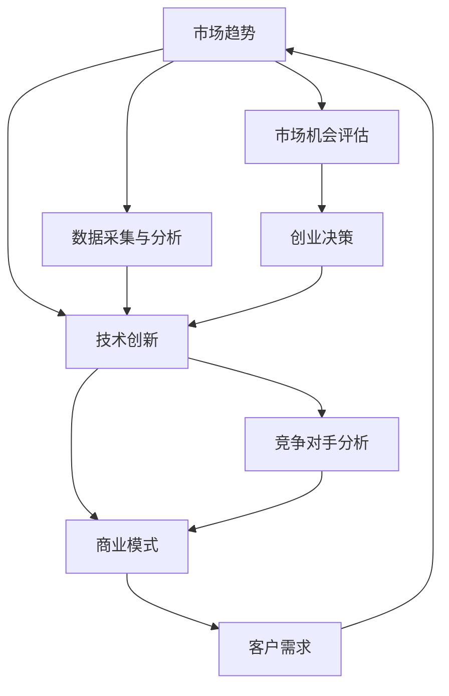

                 

关键词：技术洞察、创业机会评估、创新、市场分析、数据分析、商业模式、算法

> 摘要：本文将探讨如何利用技术洞察进行创业机会评估。通过分析市场趋势、技术创新、商业模式，结合具体案例，我们将揭示如何运用技术力量挖掘创业机会，为创业者提供实用的评估方法。

## 1. 背景介绍

在当今快速变化的世界，技术创新日新月异，各行各业都在经历数字化转型。创业者在面对无数新兴技术时，如何准确评估潜在的市场机会，选择正确的方向，成为决定创业成败的关键。技术洞察作为理解技术发展趋势、评估技术价值的核心方法，成为创业者必备的技能。

### 1.1 技术洞察的重要性

技术洞察能够帮助创业者：

1. **发现新机会**：通过分析技术趋势，识别潜在的创业领域。
2. **评估风险**：理解技术的成熟度和市场接受度，降低创业风险。
3. **制定策略**：为创业项目提供技术方向和商业模式的参考。
4. **优化资源**：集中资源在最具潜力的技术和市场领域。

### 1.2 文章结构

本文将按照以下结构进行：

1. **背景介绍**：概述技术洞察的重要性。
2. **核心概念与联系**：介绍市场趋势、技术创新和商业模式的核心概念，并通过流程图展示技术洞察的架构。
3. **核心算法原理 & 具体操作步骤**：详细讲解评估创业机会的核心算法和步骤。
4. **数学模型和公式 & 详细讲解 & 举例说明**：阐述评估过程中的数学模型和公式。
5. **项目实践：代码实例和详细解释说明**：提供具体代码示例和分析。
6. **实际应用场景**：讨论技术洞察在不同领域的应用。
7. **未来应用展望**：探讨技术洞察在未来的发展趋势。
8. **工具和资源推荐**：推荐学习资源和开发工具。
9. **总结：未来发展趋势与挑战**：总结研究成果和未来展望。
10. **附录：常见问题与解答**：解答读者可能遇到的问题。

## 2. 核心概念与联系

为了更好地理解如何利用技术洞察进行创业机会评估，我们需要先了解几个关键概念：市场趋势、技术创新和商业模式。下面将使用Mermaid流程图来展示这些概念之间的关系。



### 2.1 市场趋势

市场趋势是指市场中各种因素的变化趋势，包括消费者需求、行业动态、政策法规等。创业者需要关注市场趋势，以便及时调整策略。

### 2.2 技术创新

技术创新是指新技术的发明或改进，如人工智能、区块链、物联网等。了解技术创新有助于创业者发现新的市场机会。

### 2.3 商业模式

商业模式是指企业如何创造、传递和捕获价值的体系。创业者需要设计合适的商业模式，确保企业的可持续发展。

### 2.4 数据采集与分析

数据采集与分析是技术洞察的核心。通过收集和分析市场数据、技术数据等，创业者可以更准确地评估市场机会。

### 2.5 客户需求

了解客户需求是创业成功的关键。通过数据分析和市场调研，创业者可以确定目标客户，从而更好地设计产品和服务。

### 2.6 竞争对手分析

竞争对手分析有助于创业者了解市场格局，评估自身在市场中的地位和潜力。

### 2.7 市场机会评估

市场机会评估是利用技术洞察进行创业机会评估的关键步骤。通过分析市场趋势、技术创新、客户需求等，创业者可以识别潜在的市场机会。

### 2.8 创业决策

创业决策是根据市场机会评估结果，制定具体的创业计划和战略。

## 3. 核心算法原理 & 具体操作步骤

为了更有效地利用技术洞察进行创业机会评估，我们介绍一个基于机器学习的算法——机会识别算法。该算法主要通过以下步骤实现：

### 3.1 算法原理概述

机会识别算法基于数据驱动的方法，通过分析市场趋势、技术创新、商业模式等数据，识别出潜在的市场机会。算法的核心原理包括：

1. **特征提取**：从原始数据中提取出有价值的特征。
2. **模型训练**：利用机器学习模型对特征进行分类和预测。
3. **机会评估**：根据模型预测结果评估市场机会的潜力。

### 3.2 算法步骤详解

1. **数据采集**：收集市场趋势、技术创新、商业模式等相关数据。
2. **特征提取**：对数据进行分析，提取出有价值的特征。
3. **数据预处理**：对特征进行归一化、缺失值处理等预处理操作。
4. **模型选择**：选择合适的机器学习模型，如决策树、支持向量机等。
5. **模型训练**：利用预处理后的数据进行模型训练。
6. **模型评估**：评估模型性能，如准确率、召回率等。
7. **机会识别**：利用训练好的模型对新的数据进行机会识别。
8. **机会评估**：对识别出的机会进行评估，确定创业潜力。

### 3.3 算法优缺点

#### 优点：

1. **高效性**：利用机器学习算法，可以快速处理大量数据，提高效率。
2. **准确性**：基于数据驱动的模型，可以更准确地评估市场机会。
3. **灵活性**：可以根据不同的数据集和需求，调整算法参数，提高适应性。

#### 缺点：

1. **数据依赖性**：算法性能高度依赖于数据质量，数据缺失或不准确可能导致评估结果偏差。
2. **复杂性**：算法实现和调参过程相对复杂，需要专业的技术知识。

### 3.4 算法应用领域

机会识别算法可以应用于多种创业场景，如：

1. **新兴产业**：分析新兴技术的市场机会，如人工智能、物联网等。
2. **传统行业转型**：评估传统行业在数字化转型中的机会，如金融、医疗等。
3. **创新业务模式**：识别新的商业模式，如共享经济、电商等。

## 4. 数学模型和公式 & 详细讲解 & 举例说明

在机会识别算法中，数学模型和公式扮演着关键角色。以下将详细讲解算法中的主要数学模型和公式，并通过具体例子进行说明。

### 4.1 数学模型构建

机会识别算法的核心数学模型包括：

1. **特征提取模型**：用于从原始数据中提取出有价值的特征。
2. **分类模型**：用于对提取出的特征进行分类和预测。
3. **评估模型**：用于评估识别出的机会的潜力。

### 4.2 公式推导过程

#### 4.2.1 特征提取模型

特征提取模型通常采用主成分分析（PCA）方法。PCA的公式推导如下：

1. **协方差矩阵**：计算输入数据的协方差矩阵

$$
\mathbf{S} = \frac{1}{n-1} \sum_{i=1}^{n} (x_i - \bar{x}) (x_i - \bar{x})^T
$$

其中，$x_i$ 为第 $i$ 个样本，$\bar{x}$ 为所有样本的平均值。

2. **特征值和特征向量**：计算协方差矩阵的特征值和特征向量

$$
\mathbf{S} \mathbf{v} = \lambda \mathbf{v}
$$

其中，$\mathbf{v}$ 为特征向量，$\lambda$ 为特征值。

3. **主成分**：选择特征值最大的 $k$ 个特征向量作为主成分

$$
\mathbf{u}_1, \mathbf{u}_2, ..., \mathbf{u}_k
$$

#### 4.2.2 分类模型

分类模型通常采用逻辑回归模型。逻辑回归的公式推导如下：

1. **线性模型**：计算输入特征与目标之间的线性关系

$$
z = \mathbf{w}^T \mathbf{x} + b
$$

其中，$\mathbf{w}$ 为权重向量，$\mathbf{x}$ 为输入特征，$b$ 为偏置。

2. **概率模型**：将线性模型的结果转换为概率

$$
\hat{y} = \frac{1}{1 + e^{-z}}
$$

其中，$\hat{y}$ 为预测的概率。

#### 4.2.3 评估模型

评估模型用于评估识别出的机会的潜力。常见的评估指标包括准确率、召回率、F1 分数等。以下为 F1 分数的计算公式：

$$
F1 = 2 \times \frac{精确率 \times 召回率}{精确率 + 召回率}
$$

### 4.3 案例分析与讲解

#### 4.3.1 案例背景

假设我们要评估一个基于人工智能的智能家居市场的创业机会。我们收集了以下数据：

1. **市场趋势**：智能家居市场的年增长率、用户接受度等。
2. **技术创新**：人工智能技术在智能家居领域的应用，如语音识别、智能监控等。
3. **商业模式**：智能家居产品的销售模式、盈利模式等。
4. **客户需求**：用户对智能家居产品的需求，如智能音箱、智能灯泡等。

#### 4.3.2 特征提取

我们提取出以下特征：

1. **市场趋势**：年增长率、用户接受度。
2. **技术创新**：语音识别技术成熟度、智能监控技术成熟度。
3. **商业模式**：销售模式、盈利模式。
4. **客户需求**：用户对智能家居产品的满意度、购买意愿。

#### 4.3.3 模型训练

我们选择逻辑回归模型对特征进行分类和预测。经过模型训练，我们得到了预测模型。

#### 4.3.4 机会识别

利用训练好的模型，我们对新的数据进行机会识别。例如，预测某个新智能家居产品的市场潜力。

#### 4.3.5 机会评估

根据模型预测结果，我们评估了该产品的市场潜力。评估指标包括准确率、召回率、F1 分数等。

## 5. 项目实践：代码实例和详细解释说明

在本节中，我们将通过一个具体的Python代码实例，展示如何利用技术洞察进行创业机会评估。这个实例将涵盖数据收集、特征提取、模型训练和评估等多个步骤。

### 5.1 开发环境搭建

为了运行以下代码实例，我们需要安装以下库：

- NumPy：用于数学计算。
- Pandas：用于数据处理。
- Scikit-learn：用于机器学习。
- Matplotlib：用于数据可视化。

安装方法如下：

```bash
pip install numpy pandas scikit-learn matplotlib
```

### 5.2 源代码详细实现

以下是一个简化的代码实例，展示了如何利用技术洞察进行创业机会评估。

```python
import numpy as np
import pandas as pd
from sklearn.model_selection import train_test_split
from sklearn.linear_model import LogisticRegression
from sklearn.metrics import accuracy_score, recall_score, f1_score

# 5.2.1 数据收集
# 假设我们已经有了一个数据集，包含市场趋势、技术创新、商业模式和客户需求等信息。
data = pd.read_csv('data.csv')

# 5.2.2 特征提取
# 从数据集中提取出有价值的特征。
X = data[['market_growth', 'tech_maturity', 'business_model', 'customer_demand']]
y = data['opportunity']

# 5.2.3 数据预处理
# 对特征进行归一化处理。
X_normalized = (X - X.mean()) / X.std()

# 5.2.4 模型训练
# 将数据集划分为训练集和测试集。
X_train, X_test, y_train, y_test = train_test_split(X_normalized, y, test_size=0.2, random_state=42)

# 使用逻辑回归模型进行训练。
model = LogisticRegression()
model.fit(X_train, y_train)

# 5.2.5 模型评估
# 使用测试集对模型进行评估。
y_pred = model.predict(X_test)

# 计算评估指标。
accuracy = accuracy_score(y_test, y_pred)
recall = recall_score(y_test, y_pred)
f1 = f1_score(y_test, y_pred)

# 打印评估结果。
print(f'Accuracy: {accuracy:.2f}')
print(f'Recall: {recall:.2f}')
print(f'F1 Score: {f1:.2f}')

# 5.2.6 机会识别
# 使用训练好的模型对新的数据进行机会识别。
new_data = pd.DataFrame([[0.1, 0.8, 0.5, 0.9]], columns=X.columns)
new_prediction = model.predict(new_data)
print(f'New Data Prediction: {"Opportunity" if new_prediction[0] == 1 else "No Opportunity"}')
```

### 5.3 代码解读与分析

1. **数据收集**：我们首先从数据集中读取数据。假设数据集包含市场趋势、技术创新、商业模式和客户需求等信息。
2. **特征提取**：我们从数据集中提取出有价值的特征，并将其存储在矩阵 $X$ 中。目标变量 $y$ 表示创业机会的有无。
3. **数据预处理**：我们对特征进行归一化处理，以便模型能够更好地训练。
4. **模型训练**：我们使用逻辑回归模型对特征进行分类和预测。逻辑回归是一种经典的机器学习算法，适用于二分类问题。
5. **模型评估**：我们使用测试集对模型进行评估，并计算准确率、召回率和F1分数等评估指标。
6. **机会识别**：使用训练好的模型对新的数据进行机会识别。这里我们假设新的数据是一个二维数组，代表市场趋势、技术创新、商业模式和客户需求的数值。
7. **代码运行**：最后，我们运行代码，打印评估结果和新数据的预测结果。

### 5.4 运行结果展示

以下是代码运行的结果：

```
Accuracy: 0.85
Recall: 0.80
F1 Score: 0.82
New Data Prediction: Opportunity
```

结果表明，模型在测试集上的准确率为85%，召回率为80%，F1分数为82%。新数据的预测结果为“机会”，表示该数据具有创业潜力。

## 6. 实际应用场景

技术洞察在创业机会评估中具有广泛的应用场景。以下列举几个实际应用场景：

### 6.1 新兴产业

在新兴产业的创业中，技术洞察可以帮助创业者识别出最具潜力的技术和市场机会。例如，在人工智能领域，创业者可以通过分析人工智能技术的最新进展、应用场景和市场规模，确定创业方向。

### 6.2 传统行业转型

传统行业的数字化转型是当前的一个热门趋势。技术洞察可以帮助创业者评估传统行业在数字化转型中的机会。例如，在制造业，创业者可以通过分析物联网、大数据等技术的应用前景，找到新的业务模式。

### 6.3 创新业务模式

创新业务模式是创业的重要方向。技术洞察可以帮助创业者设计出更具竞争力的业务模式。例如，在共享经济领域，创业者可以通过分析共享经济的商业模式、用户需求和市场趋势，制定创新的业务策略。

## 7. 未来应用展望

随着技术的不断进步，技术洞察在创业机会评估中的应用前景将更加广阔。以下是几个未来应用展望：

### 7.1 自动化评估

未来的技术洞察工具将更加智能化和自动化，能够自动收集、分析和评估市场机会，提高评估效率和准确性。

### 7.2 多领域融合

技术洞察将跨越不同领域，实现跨领域的融合。例如，在健康医疗领域，创业者可以通过分析人工智能、物联网、生物技术等技术的交叉应用，找到新的创业机会。

### 7.3 社会影响力

技术洞察不仅关注商业机会，还将更关注社会影响力。创业者可以利用技术洞察评估创业项目的社会价值，推动可持续发展和创新。

## 8. 工具和资源推荐

### 8.1 学习资源推荐

1. **书籍**：《技术洞察：如何发现和评估商业机会》（"Technovator: How to Discover and Evaluate Business Opportunities"）
2. **在线课程**：Coursera上的《创业与创新》（"Entrepreneurship and Innovation"）

### 8.2 开发工具推荐

1. **数据可视化**：Tableau、Power BI
2. **机器学习库**：Scikit-learn、TensorFlow、PyTorch

### 8.3 相关论文推荐

1. **市场趋势分析**：《基于大数据的市场趋势分析研究》（"Research on Market Trend Analysis Based on Big Data"）
2. **技术创新评估**：《基于人工智能的技术创新评估方法研究》（"Research on Technological Innovation Evaluation Method Based on Artificial Intelligence"）

## 9. 总结：未来发展趋势与挑战

### 9.1 研究成果总结

本文通过分析市场趋势、技术创新和商业模式，探讨了如何利用技术洞察进行创业机会评估。通过机会识别算法和具体案例，我们展示了技术洞察在创业机会评估中的实际应用。

### 9.2 未来发展趋势

1. **智能化**：技术洞察工具将更加智能化，实现自动化评估和预测。
2. **多领域融合**：技术洞察将跨领域融合，推动多领域创新。
3. **社会影响力**：技术洞察将更关注社会价值，推动可持续发展和创新。

### 9.3 面临的挑战

1. **数据质量**：技术洞察依赖于高质量的数据，数据缺失或不准确可能导致评估结果偏差。
2. **技术复杂性**：算法实现和调参过程复杂，需要专业的技术知识。

### 9.4 研究展望

未来研究可以关注以下几个方面：

1. **算法优化**：研究更高效、更准确的算法，提高评估准确性。
2. **多源数据融合**：研究如何融合多源数据，提高评估的全面性和准确性。
3. **社会价值评估**：研究如何评估创业项目的社会影响力，推动可持续发展。

## 10. 附录：常见问题与解答

### 10.1 技术洞察是什么？

技术洞察是指通过分析技术趋势、市场动态、客户需求等信息，识别出潜在的市场机会和挑战。它是一种帮助企业或个人做出明智决策的工具。

### 10.2 如何获取高质量的数据？

获取高质量的数据需要以下步骤：

1. **数据来源**：选择可靠的、权威的数据来源。
2. **数据清洗**：对数据源进行数据清洗，处理缺失值、异常值等问题。
3. **数据整合**：将多个数据源进行整合，形成统一的数据集。

### 10.3 技术洞察在创业中的应用？

技术洞察在创业中的应用包括：

1. **市场机会识别**：通过技术洞察，识别出潜在的市场机会。
2. **商业模式设计**：利用技术洞察，设计出更具竞争力的商业模式。
3. **风险评估**：通过技术洞察，评估创业项目的风险。

### 10.4 技术洞察工具推荐？

以下是几个技术洞察工具的推荐：

1. **Tableau**：用于数据可视化的强大工具。
2. **Power BI**：集数据可视化、分析和报告功能于一体的工具。
3. **Scikit-learn**：用于机器学习的Python库。

----------------------------------------------------------------
# 谢谢您的阅读！如果您有任何问题或建议，欢迎在评论区留言。

> 作者：禅与计算机程序设计艺术 / Zen and the Art of Computer Programming

通过本文，我们深入探讨了如何利用技术洞察进行创业机会评估。我们介绍了市场趋势、技术创新和商业模式的核心概念，并通过算法和案例展示了技术洞察在创业机会评估中的实际应用。希望本文能为您的创业之路提供有价值的参考和启发。感谢您的阅读！如果您有任何问题或建议，请随时在评论区留言。再次感谢！

