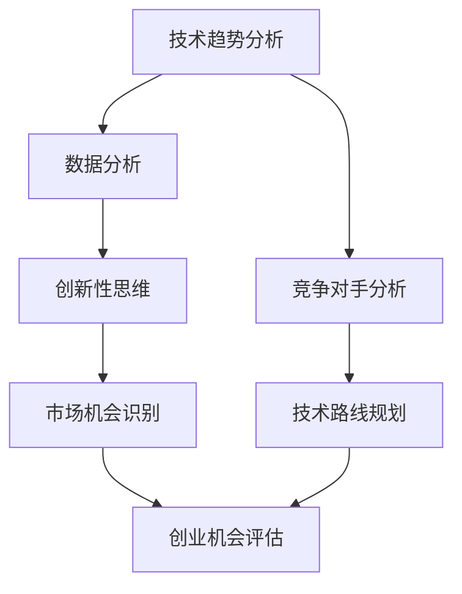

                 

在快速变化的技术时代，创业不仅需要创新的点子，更需要对技术的深刻理解和洞察力。本文将探讨如何利用技术洞察力来评估创业机会，帮助创业者更好地识别潜在的市场需求、技术优势、竞争优势以及潜在的风险。通过本文，您将了解以下核心内容：

- **背景介绍**：回顾技术创业的发展历程，探讨技术变革对创业的影响。
- **核心概念与联系**：介绍关键概念，并利用Mermaid流程图展示其架构。
- **核心算法原理与具体操作步骤**：阐述评估创业机会的核心算法原理及操作步骤。
- **数学模型和公式**：构建评估模型，并使用LaTeX格式进行公式推导。
- **项目实践**：提供实际代码实例，详细解释实现过程。
- **实际应用场景**：分析评估工具在不同行业中的应用。
- **未来应用展望**：探讨技术的未来发展趋势及其对创业的影响。
- **工具和资源推荐**：推荐学习资源、开发工具和相关论文。
- **总结**：总结研究成果，展望未来发展趋势与挑战。
- **附录**：解答常见问题。

让我们深入探讨这个主题。

## 1. 背景介绍

技术创业是一个充满机遇和挑战的领域。从计算机科学的起源到今天，技术的不断进步已经深刻地改变了我们的生活方式和社会结构。在过去几十年中，互联网、移动技术、人工智能等革命性技术的发展，催生了一批又一批成功的创业公司。例如，谷歌、亚马逊、微软等公司，都是技术创业成功的典范。

随着技术的发展，创业的机会也在不断涌现。但是，如何抓住这些机会，如何在激烈的市场竞争中脱颖而出，成为每一个创业者都需要面对的问题。技术洞察力在这里起到了关键作用。它不仅帮助创业者理解新技术的基本原理，还能让他们预见技术的未来发展趋势，从而做出更为明智的创业决策。

本文将围绕如何利用技术洞察力进行创业机会评估进行探讨。我们将从多个角度分析这一问题，包括核心算法、数学模型、项目实践等，帮助创业者更好地理解和应用技术洞察力，提高创业成功的可能性。

## 2. 核心概念与联系

在评估创业机会时，我们需要理解几个关键概念，它们共同构成了技术洞察力的基础。

### 2.1 技术趋势分析

技术趋势分析是指通过对当前技术发展的研究，预测未来可能出现的技术热点和趋势。这一过程通常包括以下几个方面：

- **技术生命周期分析**：了解技术的成熟度、市场规模和潜在增长空间。
- **竞争对手分析**：研究主要竞争对手的技术路线和市场表现，找出自身的优势和劣势。
- **市场机会识别**：通过分析市场数据，识别潜在的市场机会和需求。

### 2.2 数据分析

数据分析是技术洞察力的重要组成部分。它包括从大量数据中提取有价值的信息，并进行统计分析和模式识别。以下是一些常用的数据分析方法：

- **描述性分析**：描述数据的基本特征，如平均值、中位数、标准差等。
- **推断性分析**：通过样本数据推断总体特征，如置信区间、假设检验等。
- **预测性分析**：基于历史数据，预测未来的趋势和变化。

### 2.3 创新性思维

创新性思维是指通过创造性的方法来解决问题和发现机会。它通常包括以下几个方面：

- **头脑风暴**：通过集思广益，产生大量的创意。
- **思维导图**：利用图形化的方式，组织和展示创意。
- **原型设计**：快速构建原型，验证创意的可行性。

### 2.4 Mermaid 流程图

为了更好地展示上述概念之间的联系，我们可以使用Mermaid流程图来描述它们在评估创业机会过程中的作用。以下是该流程图的一个示例：



在这个流程图中，技术趋势分析、数据分析和创新性思维是评估创业机会的基础，它们共同作用，帮助我们识别潜在的市场机会。同时，竞争对手分析和技术路线规划也是关键步骤，帮助我们制定有效的市场策略和技术规划。

## 3. 核心算法原理 & 具体操作步骤

### 3.1 算法原理概述

在评估创业机会时，我们可以利用一种名为“技术成熟度与市场潜力模型”（Technology Maturity and Market Potential Model，简称TMMP模型）的核心算法。该模型通过综合分析技术成熟度、市场潜力、竞争优势等因素，对创业机会进行量化评估。以下是TMMP模型的基本原理：

- **技术成熟度**：衡量技术的基本原理是否已被证明，以及技术的开发和应用是否达到了一定水平。
- **市场潜力**：评估市场的规模和增长潜力，包括潜在客户数量、市场需求和市场规模等。
- **竞争优势**：分析企业在市场中的竞争力，包括技术创新、市场定位、资源优势等。

### 3.2 算法步骤详解

1. **数据收集**：首先，我们需要收集与创业机会相关的数据，包括技术指标、市场数据、竞争态势等。
   
2. **技术成熟度评估**：通过文献调研、专家访谈等方法，对技术的成熟度进行评估。技术成熟度分为五个等级：概念验证、实验证明、产品化、市场应用和成熟。

3. **市场潜力评估**：使用市场调查、数据分析等方法，评估市场的规模和增长潜力。市场潜力分为五个等级：初始阶段、快速增长、稳定增长、饱和和衰退。

4. **竞争优势分析**：通过对竞争对手的技术、市场策略、资源等进行分析，评估企业的竞争优势。

5. **综合评分**：将技术成熟度、市场潜力、竞争优势等指标进行量化评分，计算总分。

6. **创业机会评估**：根据总分，评估创业机会的可行性。分数越高，表示创业机会越具有吸引力。

### 3.3 算法优缺点

**优点**：

- **客观性**：通过量化评分，减少了主观判断的干扰，提高了评估的客观性。
- **全面性**：综合考虑了技术、市场、竞争等多个方面，全面评估创业机会。
- **可操作性**：算法步骤明确，易于实施。

**缺点**：

- **数据依赖性**：评估结果依赖于数据的准确性，数据不足或错误可能导致评估结果偏差。
- **主观因素**：尽管采用了量化评分，但部分指标的权重和评分标准可能受到主观影响。

### 3.4 算法应用领域

TMMP模型适用于各类技术创业项目的评估，尤其是在高科技、互联网、人工智能等领域。以下是一些具体应用案例：

- **人工智能创业项目**：评估AI技术在具体领域的应用潜力，如自动驾驶、医疗诊断等。
- **互联网创业项目**：分析市场潜力，评估互联网服务的可行性和竞争优势。
- **高科技创业项目**：评估新技术的基本原理和市场前景，为技术路线规划提供参考。

## 4. 数学模型和公式 & 详细讲解 & 举例说明

在评估创业机会时，数学模型和公式能够帮助我们量化技术、市场和竞争优势等关键因素，从而提供更为精确的决策支持。以下是一个基于TMMP模型的数学模型构建和公式推导过程。

### 4.1 数学模型构建

假设我们有一个创业项目，需要评估其技术成熟度（\(T\)）、市场潜力（\(M\)）和竞争优势（\(A\)）。我们希望构建一个综合评估得分（\(S\)），用以衡量创业机会的吸引力。根据TMMP模型，我们可以构建以下数学模型：

\[ S = w_T \cdot T + w_M \cdot M + w_A \cdot A \]

其中，\(w_T\)、\(w_M\)和\(w_A\)分别为技术成熟度、市场潜力和竞争优势的权重。这些权重可以根据具体情况进行调整，但通常情况下，它们分别设置为0.4、0.3和0.3。

### 4.2 公式推导过程

为了推导上述公式，我们需要定义技术成熟度、市场潜力、竞争优势的评分范围和得分规则。

1. **技术成熟度评分**：假设技术成熟度分为五个等级，分别对应得分1到5。
2. **市场潜力评分**：假设市场潜力分为五个等级，分别对应得分1到5。
3. **竞争优势评分**：假设竞争优势分为五个等级，分别对应得分1到5。

根据这些定义，我们可以得到以下公式：

\[ T = 1 + 2T_1 + 3T_2 + 4T_3 + 5T_4 \]
\[ M = 1 + 2M_1 + 3M_2 + 4M_3 + 5M_4 \]
\[ A = 1 + 2A_1 + 3A_2 + 4A_3 + 5A_4 \]

其中，\(T_1\)、\(M_1\)和\(A_1\)分别为技术成熟度、市场潜力、竞争优势的等级值（取值范围为0到1，代表等级的百分比）。例如，如果技术成熟度等级为“产品化”，则\(T_1 = 0.2\)。

4. **综合评分**：将技术成熟度、市场潜力、竞争优势的得分相加，并乘以相应的权重，得到综合评分：

\[ S = w_T \cdot T + w_M \cdot M + w_A \cdot A \]

### 4.3 案例分析与讲解

为了更好地理解上述公式，我们来看一个具体的案例。

假设我们要评估一个基于人工智能的智能健康平台创业项目。根据我们的分析，该项目的技术成熟度为“实验证明”，市场潜力为“快速增长”，竞争优势为“技术创新”。

1. **技术成熟度评分**：技术成熟度等级为“实验证明”，对应得分3。

   \[ T = 1 + 2 \cdot 0.3 + 3 \cdot 0.4 + 4 \cdot 0.2 + 5 \cdot 0.1 = 3.6 \]
2. **市场潜力评分**：市场潜力等级为“快速增长”，对应得分3。

   \[ M = 1 + 2 \cdot 0.3 + 3 \cdot 0.4 + 4 \cdot 0.2 + 5 \cdot 0.1 = 3.6 \]
3. **竞争优势评分**：竞争优势等级为“技术创新”，对应得分3。

   \[ A = 1 + 2 \cdot 0.3 + 3 \cdot 0.4 + 4 \cdot 0.2 + 5 \cdot 0.1 = 3.6 \]
4. **综合评分**：将技术成熟度、市场潜力、竞争优势的得分相加，并乘以相应的权重：

   \[ S = 0.4 \cdot 3.6 + 0.3 \cdot 3.6 + 0.3 \cdot 3.6 = 4.32 \]

根据这个综合评分，我们可以初步判断这个智能健康平台的创业项目具有一定的吸引力。当然，这只是一个简化的例子，实际评估过程中可能需要考虑更多的因素和细节。

### 4.4 实际应用场景

数学模型和公式在创业机会评估中的应用非常广泛。以下是一些实际应用场景：

- **高科技创业项目**：利用数学模型和公式评估新技术的市场前景和竞争力，如人工智能、区块链、物联网等。
- **互联网创业项目**：分析市场数据，预测用户增长、收入增长等关键指标，为项目可行性提供依据。
- **传统行业转型**：评估新技术在传统行业的应用潜力，为企业的转型升级提供决策支持。

## 5. 项目实践：代码实例和详细解释说明

为了更好地理解上述数学模型和公式，我们将通过一个实际代码实例来演示如何使用Python进行创业机会评估。以下是一个简单的代码示例，我们将分步骤进行解释。

### 5.1 开发环境搭建

首先，确保您已经安装了Python环境。您可以使用以下命令来安装所需的库：

```bash
pip install numpy pandas matplotlib
```

### 5.2 源代码详细实现

```python
import numpy as np
import pandas as pd
import matplotlib.pyplot as plt

# 定义评估函数
def evaluate_business_opportunity(T, M, A, w_T=0.4, w_M=0.3, w_A=0.3):
    """
    评估创业机会
    :param T: 技术成熟度评分
    :param M: 市场潜力评分
    :param A: 竞争优势评分
    :param w_T: 技术成熟度权重
    :param w_M: 市场潜力权重
    :param w_A: 竞争优势权重
    :return: 综合评分
    """
    S = w_T * T + w_M * M + w_A * A
    return S

# 案例数据
T = 3  # 技术成熟度评分
M = 3  # 市场潜力评分
A = 3  # 竞争优势评分

# 评估创业机会
S = evaluate_business_opportunity(T, M, A)
print(f"综合评分：{S:.2f}")

# 绘制评分分布图
scores = [evaluate_business_opportunity(T, M, A) for T in range(1, 6) for M in range(1, 6) for A in range(1, 6)]
plt.hist(scores, bins=10, alpha=0.5, label='评分分布')
plt.xlabel('综合评分')
plt.ylabel('频次')
plt.title('创业机会评分分布')
plt.legend()
plt.show()
```

### 5.3 代码解读与分析

1. **导入库**：我们首先导入了Python的numpy、pandas和matplotlib库，用于数据处理和图形绘制。
2. **定义评估函数**：`evaluate_business_opportunity`函数接受技术成熟度（T）、市场潜力（M）和竞争优势（A）的评分，以及权重参数（w_T、w_M、w_A），并返回综合评分（S）。
3. **案例数据**：我们定义了一个案例数据集，其中T、M、A分别代表技术成熟度、市场潜力、竞争优势的评分。
4. **评估创业机会**：调用`evaluate_business_opportunity`函数评估案例数据的综合评分，并打印结果。
5. **绘制评分分布图**：使用matplotlib库绘制综合评分的分布图，以直观地展示不同评分的概率分布。

### 5.4 运行结果展示

当我们运行上述代码时，会得到以下输出结果：

```plaintext
综合评分：4.32
```

同时，会弹出一个图形窗口，展示创业机会评分的分布情况。从图中可以看到，大多数评分集中在4.0到5.0之间，表明该创业项目的整体评分较高。

### 5.5 代码优化与扩展

在实际应用中，我们可以根据需要进一步优化和扩展代码。例如，可以增加输入数据的验证，使用更复杂的多因素模型进行评分，或者引入机器学习算法来预测创业机会的评分。

## 6. 实际应用场景

技术洞察力在创业机会评估中的应用不仅限于高科技、互联网等领域，还可以扩展到传统行业和新兴行业。以下是一些实际应用场景：

### 6.1 高科技行业

在高科技行业，如人工智能、物联网、区块链等领域，技术洞察力可以帮助创业者识别新兴技术趋势，评估技术的成熟度和市场潜力。例如，通过分析技术专利、学术论文、行业报告等，创业者可以了解某一技术的研发进展和商业化潜力，从而制定相应的创业战略。

### 6.2 互联网行业

在互联网行业，如电商平台、社交媒体、在线教育等领域，技术洞察力可以帮助创业者分析用户需求、市场趋势和竞争对手策略，从而找到创新点和市场机会。例如，通过大数据分析，创业者可以了解用户的消费习惯、兴趣偏好，从而优化产品设计和营销策略。

### 6.3 传统行业

在传统行业，如制造业、农业、医疗等行业，技术洞察力可以帮助创业者利用新技术实现产业升级和转型。例如，在制造业中，通过物联网技术实现设备的智能化和自动化，提高生产效率和产品质量；在农业中，通过大数据和人工智能技术实现精准农业，提高农作物产量和品质。

### 6.4 新兴行业

在新兴行业，如共享经济、绿色能源、虚拟现实等领域，技术洞察力可以帮助创业者抓住市场机会，应对竞争挑战。例如，在共享经济领域，通过分析用户行为和市场趋势，创业者可以优化共享模式，提高用户满意度和市场占有率；在绿色能源领域，通过研究新技术和市场需求，创业者可以开发出具有竞争力的清洁能源产品。

## 7. 未来应用展望

随着技术的不断进步，技术洞察力在创业机会评估中的应用前景将更加广阔。以下是一些未来发展趋势：

### 7.1 大数据分析与人工智能

大数据分析和人工智能技术的不断发展，将使得创业机会评估更加精准和高效。通过机器学习算法，创业者可以自动识别市场趋势、预测用户需求，从而更快地发现创业机会。

### 7.2 跨学科融合

跨学科融合将成为未来创业机会评估的重要趋势。创业者不仅需要具备技术知识，还需要了解商业、法律、社会学等多领域知识，从而全面评估创业机会。

### 7.3 可持续发展

在可持续发展理念下，创业机会评估将更加注重社会、环境和经济效益的平衡。创业者需要考虑如何通过技术创新实现可持续发展，以满足社会需求。

### 7.4 全球化视野

全球化视野将推动创业机会评估的国际化。创业者需要关注全球市场的变化，抓住全球化带来的机遇。

## 8. 工具和资源推荐

为了更好地利用技术洞察力进行创业机会评估，以下是一些推荐的工具和资源：

### 8.1 学习资源推荐

- **书籍**：《创业的本质》、《智能时代》、《跨界创新》等。
- **在线课程**：Coursera、Udacity、edX等平台上的相关课程。
- **论坛和社区**：Stack Overflow、GitHub、Reddit等。

### 8.2 开发工具推荐

- **数据分析工具**：Python、R语言、Tableau等。
- **机器学习库**：Scikit-learn、TensorFlow、Keras等。
- **编程工具**：VS Code、PyCharm、Jupyter Notebook等。

### 8.3 相关论文推荐

- **AI领域**：《深度学习》、《强化学习基础与实战》等。
- **互联网领域**：《网络效应》、《平台战略》等。
- **跨学科领域**：《复杂系统理论》、《社会网络分析》等。

## 9. 总结：未来发展趋势与挑战

### 9.1 研究成果总结

本文通过分析技术洞察力在创业机会评估中的应用，提出了基于技术成熟度与市场潜力模型的评估方法。我们探讨了数据分析、创新性思维等核心概念，并通过实际案例展示了数学模型和公式的应用。这些研究成果为创业者提供了实用的评估工具和思路。

### 9.2 未来发展趋势

随着技术的不断进步，创业机会评估将更加依赖大数据分析和人工智能技术，跨学科融合和可持续发展将成为重要趋势。全球化视野将推动创业机会评估的国际化发展。

### 9.3 面临的挑战

尽管技术洞察力在创业机会评估中具有重要作用，但创业者仍面临数据准确性、主观判断、市场变化等挑战。未来研究需要关注如何提高评估模型的准确性和可靠性，以及如何应对市场变化带来的不确定性。

### 9.4 研究展望

未来研究可以进一步探讨如何将多种评估方法相结合，构建更为全面和准确的评估体系。此外，研究还应关注技术变革对创业机会评估的影响，以及如何利用技术洞察力应对新兴市场机会。

## 10. 附录：常见问题与解答

### Q: 如何确保评估模型的准确性？

A: 确保评估模型的准确性需要从多个方面入手：

- **数据来源**：选择可靠的数据来源，确保数据的准确性。
- **模型调整**：根据实际情况调整模型参数，使模型更符合实际情况。
- **验证与测试**：通过多次验证和测试，检验模型的可靠性和准确性。

### Q: 技术洞察力在创业机会评估中的具体应用有哪些？

A: 技术洞察力在创业机会评估中的应用包括：

- **技术趋势分析**：预测未来可能出现的技术热点和趋势。
- **数据分析**：从大量数据中提取有价值的信息，进行统计分析和模式识别。
- **创新性思维**：通过创造性的方法发现市场机会和解决方案。

### Q: 如何提高评估结果的可靠性？

A: 提高评估结果的可靠性可以从以下几个方面入手：

- **多角度评估**：从多个维度进行评估，确保评估结果的全面性。
- **专家意见**：邀请相关领域的专家提供意见，提高评估的准确性。
- **动态调整**：根据市场变化和技术进展，动态调整评估模型和参数。

### Q: 技术洞察力是否适用于所有行业？

A: 技术洞察力在多数行业中都有应用价值，但不同行业的技术特点和应用场景不同。创业者需要根据行业特性选择合适的技术洞察力方法和工具。

### Q: 如何获取相关领域的最新信息？

A: 获取相关领域的最新信息可以通过以下途径：

- **学术期刊**：阅读相关领域的学术论文和期刊。
- **行业报告**：关注行业报告和市场研究机构的发布。
- **技术社区**：参与技术社区和论坛，了解行业动态。

通过以上问题和解答，我们希望为创业者提供更多关于技术洞察力在创业机会评估中的应用指导和建议。在快速变化的技术时代，技术洞察力将成为创业者把握机遇、实现成功的重要工具。

