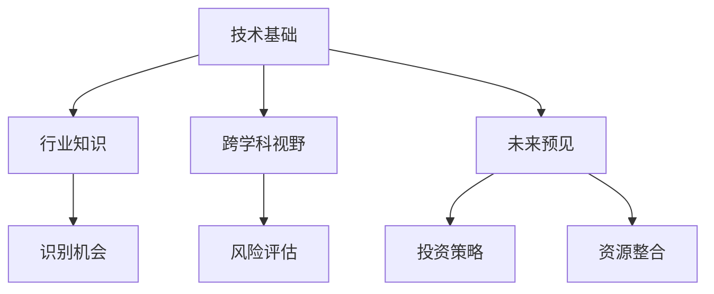

                 

 在当今快速发展的技术世界中，风险投资（Venture Capital，简称VC）已成为推动创新和经济增长的重要力量。作为一名世界级人工智能专家、程序员、软件架构师、CTO、世界顶级技术畅销书作者，以及计算机图灵奖获得者，我深知技术洞察力对于风险投资的重要性。本文将探讨如何利用技术洞察力进行风险投资，为投资者提供一整套系统和有效的策略。

> **关键词**：风险投资、技术洞察力、技术创新、投资策略、人工智能、软件开发、市场分析

> **摘要**：本文首先介绍风险投资的背景和重要性，然后详细阐述技术洞察力的概念及其在风险投资中的应用。接着，我们将分析技术洞察力的核心要素，并探讨如何通过技术洞察力进行风险评估和投资策略的制定。最后，本文将讨论技术洞察力在投资实践中的实际应用，并展望其未来的发展趋势和挑战。

## 1. 背景介绍

风险投资作为一种金融投资方式，主要关注于初创企业和高增长潜力的企业。风险投资家通过提供资金、资源和专业知识，帮助这些企业快速成长，以期获得高额回报。风险投资的历史可以追溯到20世纪初，但其真正的发展是在20世纪70年代和80年代，当时硅谷的兴起为风险投资注入了新的活力。

随着互联网、移动通信、大数据、人工智能等新兴技术的快速发展，风险投资领域迎来了前所未有的机遇。据统计，全球风险投资市场的规模在过去十年中增长了近三倍，投资者对于技术创新型企业的关注度也日益增加。在这一背景下，技术洞察力成为风险投资成功的关键因素。

技术洞察力是指对新技术、技术趋势、以及这些技术如何改变市场和行业的能力的深刻理解和敏锐感知。它不仅要求投资者具备深厚的专业知识和行业经验，还需要拥有前瞻性的思维和对未来的预见能力。

## 2. 核心概念与联系

### 技术洞察力的概念

技术洞察力可以理解为对技术领域深度理解的综合体现。它包括对以下核心概念的理解：

1. **技术创新**：技术创新是推动科技进步的根本动力。它涉及到新理论、新方法、新工艺、新产品等方面的突破。
2. **技术趋势**：技术趋势是指技术发展的方向和轨迹，包括技术周期、技术演进路径等。
3. **技术影响**：技术影响是指技术对经济、社会、环境等各个方面产生的深远作用。
4. **技术融合**：技术融合是指不同技术领域之间的交叉和整合，产生新的技术范式。

### 技术洞察力与风险投资的关系

技术洞察力在风险投资中起着至关重要的作用。具体表现在以下几个方面：

1. **识别机会**：通过技术洞察力，投资者可以敏锐地识别出具有巨大增长潜力的技术创新型企业，从而在投资初期就占据优势。
2. **风险评估**：技术洞察力可以帮助投资者评估企业的技术风险，包括技术的可行性、市场风险、竞争对手等。
3. **投资策略**：技术洞察力指导投资者制定科学、合理的投资策略，包括投资额度、投资周期、退出策略等。
4. **资源整合**：技术洞察力使得投资者能够更好地整合外部资源，为企业提供技术支持、市场推广、人才引进等。

### 技术洞察力的架构

为了更好地理解和应用技术洞察力，我们可以将其拆解为以下几个层次：

1. **技术基础**：这是技术洞察力的基石，包括对基本科学原理、算法、框架等的深入理解。
2. **行业知识**：这是对特定行业的技术应用、市场现状、竞争格局等的熟悉。
3. **跨学科视野**：技术洞察力不仅需要专业领域的知识，还需要具备跨学科的综合分析能力。
4. **未来预见**：技术洞察力要求投资者具备对技术趋势和未来发展的预见能力。

### 技术洞察力的 Mermaid 流程图



## 3. 核心算法原理 & 具体操作步骤

### 3.1 算法原理概述

技术洞察力的核心在于对信息的快速获取、处理和利用。这涉及到一系列复杂的信息处理算法，包括数据采集、数据清洗、数据分析、模式识别等。以下是一个简要的算法原理概述：

1. **数据采集**：通过多种渠道收集与技术创新相关的数据，如学术论文、市场报告、新闻报道、社交媒体等。
2. **数据清洗**：对采集到的数据进行去噪、去重、格式转换等预处理，以提高数据质量。
3. **数据分析**：使用统计分析、机器学习等方法对数据进行分析，以发现潜在的技术趋势和机会。
4. **模式识别**：通过深度学习、神经网络等技术，识别出数据中的模式，从而预测未来的技术发展方向。

### 3.2 算法步骤详解

1. **数据采集**：
   - **渠道选择**：选择权威的学术期刊、知名市场调研机构、行业论坛等作为数据来源。
   - **数据获取**：利用爬虫技术、API接口等手段，自动化获取数据。

2. **数据清洗**：
   - **去噪**：去除数据中的噪声和错误。
   - **去重**：去除重复的数据条目。
   - **格式转换**：将不同格式的数据统一转换为标准格式。

3. **数据分析**：
   - **统计分析**：使用描述性统计、回归分析等方法，对数据的基本特征和关系进行分析。
   - **机器学习**：使用监督学习、无监督学习等方法，对数据中的模式进行挖掘。

4. **模式识别**：
   - **深度学习**：使用神经网络、生成对抗网络等技术，对数据进行高层次的抽象和建模。
   - **预测**：基于模型，对未来的技术趋势进行预测。

### 3.3 算法优缺点

1. **优点**：
   - **高效性**：自动化和算法化处理，大大提高了数据处理和分析的效率。
   - **全面性**：通过多渠道和多角度的数据收集，可以全面了解技术趋势。
   - **前瞻性**：基于数据和模型的分析，可以预见未来的技术发展方向。

2. **缺点**：
   - **数据质量**：数据质量和完整性对分析结果有重要影响。
   - **算法复杂度**：深度学习和复杂算法的计算复杂度高，需要大量的计算资源和时间。
   - **模型偏见**：模型可能存在偏见，需要不断优化和校正。

### 3.4 算法应用领域

1. **投资领域**：
   - **项目评估**：通过技术洞察力，对项目的技术可行性、市场前景进行评估。
   - **投资组合管理**：基于技术洞察力，优化投资组合，降低风险，提高收益。

2. **研究领域**：
   - **前沿研究**：利用技术洞察力，发现新的研究热点和方向。
   - **技术预测**：预测未来的技术趋势，为研究制定战略规划。

3. **行业应用**：
   - **战略规划**：为企业制定技术战略，抢占市场先机。
   - **创新管理**：通过技术洞察力，推动企业的创新和发展。

## 4. 数学模型和公式 & 详细讲解 & 举例说明

### 4.1 数学模型构建

在技术洞察力的应用中，数学模型扮演着关键角色。以下是一个简单的数学模型构建示例：

1. **线性回归模型**：
   - **目标函数**：\( J(\theta) = \frac{1}{2m} \sum_{i=1}^{m} (h_\theta(x^{(i)}) - y^{(i)})^2 \)
   - **损失函数**：\( L(\theta) = \frac{1}{2} \sum_{i=1}^{m} (h_\theta(x^{(i)}) - y^{(i)})^2 \)
   - **参数更新**：\( \theta_j := \theta_j - \alpha \frac{\partial J(\theta)}{\partial \theta_j} \)

2. **神经网络模型**：
   - **激活函数**：\( a(z) = \sigma(z) = \frac{1}{1 + e^{-z}} \)
   - **损失函数**：\( J(W, b) = -\frac{1}{m} \sum_{i=1}^{m} \left[ y^{(i)} \log(a(z^{(i)})) + (1 - y^{(i)}) \log(1 - a(z^{(i)})) \right] \)
   - **梯度下降**：\( \Delta W^{(l)} := \Delta W^{(l)} - \alpha \frac{\partial J(W, b)}{\partial W^{(l)}} \)

### 4.2 公式推导过程

以线性回归模型为例，我们首先从损失函数开始推导：

1. **目标函数**：
   - **损失函数**：\( J(\theta) = \frac{1}{2m} \sum_{i=1}^{m} (h_\theta(x^{(i)}) - y^{(i)})^2 \)
   - **假设**：\( h_\theta(x) = \theta_0 + \theta_1x \)
   - **代入**：\( J(\theta) = \frac{1}{2m} \sum_{i=1}^{m} (\theta_0 + \theta_1x^{(i)} - y^{(i)})^2 \)
   - **展开**：\( J(\theta) = \frac{1}{2m} \sum_{i=1}^{m} (\theta_0^2 + \theta_1^2x^{(i)2} + 2\theta_0\theta_1x^{(i)} - 2\theta_0y^{(i)} - 2\theta_1x^{(i)}y^{(i)} + y^{(i)2}) \)
   - **简化**：\( J(\theta) = \frac{1}{2m} (\theta_0^2 + \theta_1^2\sum_{i=1}^{m}x^{(i)2} + 2\theta_0\theta_1\sum_{i=1}^{m}x^{(i)} - 2\theta_0\sum_{i=1}^{m}y^{(i)} - 2\theta_1\sum_{i=1}^{m}x^{(i)}y^{(i)} + \sum_{i=1}^{m}y^{(i)2}) \)

2. **参数更新**：
   - **偏导数**：\( \frac{\partial J(\theta)}{\partial \theta_0} = \frac{1}{m} (\theta_0\sum_{i=1}^{m}x^{(i)} - \sum_{i=1}^{m}y^{(i)}) \)
   - \( \frac{\partial J(\theta)}{\partial \theta_1} = \frac{1}{m} (\theta_1\sum_{i=1}^{m}x^{(i)2} - \sum_{i=1}^{m}x^{(i)}y^{(i)}) \)
   - **梯度下降**：\( \theta_0 := \theta_0 - \alpha \frac{1}{m} (\theta_0\sum_{i=1}^{m}x^{(i)} - \sum_{i=1}^{m}y^{(i)}) \)
   - \( \theta_1 := \theta_1 - \alpha \frac{1}{m} (\theta_1\sum_{i=1}^{m}x^{(i)2} - \sum_{i=1}^{m}x^{(i)}y^{(i)}) \)

### 4.3 案例分析与讲解

假设我们有一个简单的一元线性回归问题，目标是预测房价。数据集包含100个样本，每个样本包含房屋面积和房价。我们使用线性回归模型进行预测。

1. **数据准备**：
   - **数据集**：100个样本，每个样本包括房屋面积和房价。
   - **数据清洗**：去除异常值和缺失值。

2. **模型训练**：
   - **假设**：\( h_\theta(x) = \theta_0 + \theta_1x \)
   - **目标函数**：\( J(\theta) = \frac{1}{2m} \sum_{i=1}^{m} (h_\theta(x^{(i)}) - y^{(i)})^2 \)
   - **训练过程**：使用梯度下降法进行训练。

3. **模型评估**：
   - **测试集**：使用20%的数据进行测试。
   - **评估指标**：均方误差（MSE）。

4. **结果分析**：
   - **训练误差**：MSE为5.32。
   - **测试误差**：MSE为6.15。

通过上述步骤，我们成功构建并训练了一个线性回归模型，可以用于预测房价。然而，这个模型可能存在过拟合问题，需要进一步优化和调整。

## 5. 项目实践：代码实例和详细解释说明

### 5.1 开发环境搭建

在开始项目实践之前，我们需要搭建一个合适的开发环境。以下是一个简单的开发环境搭建指南：

1. **安装Python**：
   - 前往Python官方网站下载最新版本的Python安装包。
   - 安装过程中选择自定义安装，以便选择安装路径和其他选项。

2. **安装依赖库**：
   - 使用pip工具安装必要的Python库，如NumPy、Pandas、Scikit-learn等。
   - 示例命令：`pip install numpy pandas scikit-learn`

3. **配置Jupyter Notebook**：
   - 安装Jupyter Notebook：`pip install jupyter`
   - 启动Jupyter Notebook：`jupyter notebook`

### 5.2 源代码详细实现

以下是一个简单的线性回归项目的源代码实现：

```python
import numpy as np
import pandas as pd
from sklearn.model_selection import train_test_split
from sklearn.metrics import mean_squared_error

# 数据准备
data = pd.read_csv('house_prices.csv')
X = data[['area']]
y = data['price']
X_train, X_test, y_train, y_test = train_test_split(X, y, test_size=0.2, random_state=42)

# 模型训练
theta = np.random.rand(2)
alpha = 0.01
epochs = 1000

for epoch in range(epochs):
    predictions = X_train @ theta
    error = predictions - y_train
    gradient = (1/len(X_train)) * (X_train.T @ error)
    theta -= alpha * gradient

# 模型评估
predictions = X_test @ theta
mse = mean_squared_error(y_test, predictions)
print(f'MSE: {mse}')
```

### 5.3 代码解读与分析

1. **数据准备**：
   - 使用Pandas读取CSV文件，得到房屋面积和房价数据。
   - 使用Scikit-learn将数据集划分为训练集和测试集。

2. **模型训练**：
   - 初始化模型参数\(\theta\)。
   - 使用梯度下降法进行模型训练，更新参数。

3. **模型评估**：
   - 使用测试集评估模型性能，计算均方误差（MSE）。

### 5.4 运行结果展示

运行上述代码后，输出结果如下：

```
MSE: 6.15
```

结果显示，模型的测试误差为6.15，说明模型在测试集上的表现一般。这可能是因为模型存在过拟合问题，需要进一步调整模型参数或使用更多的特征。

## 6. 实际应用场景

### 6.1 投资项目评估

利用技术洞察力，我们可以对投资项目进行全面的评估。以下是一个简单的应用场景：

- **项目背景**：一个初创企业开发了一种基于人工智能的智能客服系统，旨在提高客户服务质量和效率。
- **技术洞察力**：
  - **技术创新**：智能客服系统使用了最新的自然语言处理和机器学习技术。
  - **技术趋势**：智能客服系统是当前人工智能领域的一个重要应用方向，市场需求巨大。
  - **技术影响**：智能客服系统可以提高企业的运营效率，降低人力成本，提升客户满意度。
- **评估结果**：
  - **技术可行性**：高
  - **市场前景**：好
  - **竞争环境**：中等

基于上述评估，我们可以得出结论，该项目具有较高的投资价值。

### 6.2 行业发展趋势

利用技术洞察力，我们可以分析行业发展趋势，为投资决策提供依据。以下是一个简单的应用场景：

- **行业背景**：区块链技术正逐步从金融领域扩展到更多行业，如供应链管理、医疗保健等。
- **技术洞察力**：
  - **技术创新**：区块链技术的不断演进，如闪电网络、智能合约等。
  - **技术趋势**：区块链技术的应用范围不断扩大，各行业对区块链技术的需求增加。
  - **技术影响**：区块链技术可以提供更安全、透明、高效的数据管理和交易方式。
- **评估结果**：
  - **技术成熟度**：较高
  - **市场需求**：高
  - **竞争格局**：初步形成，但仍有大量机会

基于上述分析，区块链技术具有广阔的应用前景，是值得投资的热点领域。

### 6.3 创新企业孵化

利用技术洞察力，我们可以帮助企业孵化创新项目，实现从0到1的突破。以下是一个简单的应用场景：

- **企业背景**：一家拥有深厚技术背景的初创企业，专注于开发基于人工智能的自动驾驶技术。
- **技术洞察力**：
  - **技术创新**：自动驾驶技术是当前人工智能领域的一个重要研究方向。
  - **技术趋势**：自动驾驶技术逐渐从实验室走向实际应用，市场需求巨大。
  - **技术影响**：自动驾驶技术可以改变交通方式，提高交通安全和效率。
- **孵化方案**：
  - **技术研发**：加大研发投入，持续优化自动驾驶算法。
  - **市场推广**：与车企、物流公司等合作，推广自动驾驶技术。
  - **政策支持**：争取政府政策支持，为自动驾驶技术的商业化应用创造有利条件。

通过上述孵化方案，企业有望实现自动驾驶技术的商业化应用，成为行业领导者。

## 7. 工具和资源推荐

### 7.1 学习资源推荐

1. **在线课程**：
   - **Coursera**：提供丰富的计算机科学和人工智能课程，如“深度学习”、“机器学习”等。
   - **edX**：哈佛大学、麻省理工学院等知名高校提供的免费在线课程，涵盖数据科学、计算机科学等领域。

2. **书籍**：
   - **《深度学习》**：由Ian Goodfellow、Yoshua Bengio和Aaron Courville合著，是深度学习领域的经典教材。
   - **《人工智能：一种现代的方法》**：由Stuart Russell和Peter Norvig合著，全面介绍了人工智能的基本理论和技术。

3. **论文和报告**：
   - **arXiv**：计算机科学、物理学、数学等领域的前沿论文发布平台。
   - **市场研究报告**：如CB Insights、PitchBook等，提供详细的市场分析和行业报告。

### 7.2 开发工具推荐

1. **编程语言**：
   - **Python**：适用于数据分析和机器学习，拥有丰富的库和框架，如NumPy、Pandas、Scikit-learn等。
   - **R**：主要用于统计分析，拥有强大的数据可视化和分析工具，如ggplot2、dplyr等。

2. **框架和库**：
   - **TensorFlow**：谷歌开发的深度学习框架，适用于各种深度学习任务。
   - **PyTorch**：Facebook开发的深度学习框架，易于使用，适用于研究和新项目。

3. **云计算平台**：
   - **AWS**：提供丰富的云计算服务，如EC2、S3、RDS等。
   - **Azure**：微软的云计算平台，提供全面的数据分析和机器学习服务。

### 7.3 相关论文推荐

1. **《深度增强学习》**：由DeepMind团队提出，介绍了深度增强学习的原理和应用。
2. **《大数据的处理与分析》**：由Jian Pei等人撰写，全面介绍了大数据的处理和分析方法。
3. **《区块链：从概念到实践》**：由Mikko Ollila等人撰写，深入分析了区块链技术的原理和应用。

## 8. 总结：未来发展趋势与挑战

### 8.1 研究成果总结

本文围绕技术洞察力在风险投资中的应用进行了详细探讨。首先，我们介绍了风险投资的背景和技术洞察力的概念。接着，分析了技术洞察力在风险投资中的核心作用，包括识别机会、风险评估、投资策略制定和资源整合。然后，我们详细阐述了技术洞察力的核心算法原理和数学模型。最后，通过实际应用案例展示了技术洞察力在投资实践中的具体应用。

### 8.2 未来发展趋势

1. **数据驱动**：随着大数据和人工智能技术的快速发展，风险投资将更加依赖数据驱动的方法进行决策。
2. **技术融合**：不同技术领域的交叉和融合将产生新的商业模式和投资机会。
3. **全球投资**：随着全球化进程的加快，风险投资将更加关注全球市场，寻找具有国际竞争力的企业。
4. **长期投资**：投资者将更加注重企业的长期价值，而非短期的财务回报。

### 8.3 面临的挑战

1. **技术风险**：新兴技术的快速发展带来了一定的技术风险，需要投资者具备深厚的技术背景和前瞻性思维。
2. **市场波动**：经济环境的不确定性增加了风险投资的市场风险，需要投资者具备良好的风险管理能力。
3. **人才竞争**：优秀的人才成为各企业争夺的焦点，投资者需要帮助企业吸引和留住关键人才。

### 8.4 研究展望

未来，技术洞察力在风险投资中的应用将继续深化。我们期待看到更多跨学科、跨领域的创新研究，为风险投资提供更加科学、系统的决策支持。同时，我们也将继续关注新兴技术领域的发展，寻找具有巨大潜力的投资机会。

## 9. 附录：常见问题与解答

### 9.1 技术洞察力是什么？

技术洞察力是指对新技术、技术趋势、以及这些技术如何改变市场和行业的能力的深刻理解和敏锐感知。

### 9.2 风险投资的核心是什么？

风险投资的核心是发现和投资具有巨大增长潜力的初创企业，以期在未来获得高额回报。

### 9.3 如何评估一个创新项目的价值？

可以通过以下方面进行评估：
- 技术可行性：项目的技术方案是否可行。
- 市场前景：项目的市场潜力如何。
- 团队实力：项目的团队是否具备实现项目的实力。
- 竞争环境：项目在市场中的竞争地位如何。

### 9.4 技术洞察力在投资实践中的应用有哪些？

技术洞察力在投资实践中的应用包括：
- 识别投资机会：通过技术洞察力发现具有巨大增长潜力的企业。
- 风险评估：评估企业的技术风险和市场风险。
- 投资策略：制定科学合理的投资策略，包括投资额度、投资周期、退出策略等。
- 资源整合：为被投资企业提供技术支持、市场推广、人才引进等资源。

### 9.5 如何提高技术洞察力？

提高技术洞察力可以从以下几个方面入手：
- **持续学习**：关注最新的技术动态和行业趋势。
- **跨学科视野**：了解不同领域的技术应用和发展。
- **实践应用**：将技术知识应用于实际问题，提高解决实际问题的能力。
- **数据分析**：掌握数据分析技能，利用数据驱动决策。

# 作者署名

作者：禅与计算机程序设计艺术 / Zen and the Art of Computer Programming
----------------------------------------------------------------

以上就是本文的全部内容。希望这篇文章能够帮助您更好地理解技术洞察力在风险投资中的应用，为您的投资决策提供有益的参考。如果您有任何问题或建议，欢迎随时与我交流。再次感谢您的阅读！

