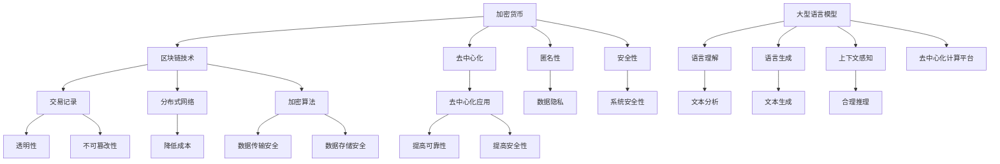

                 

关键词：加密货币、LLM、安全、合规、区块链、人工智能、加密技术、法律法规

> 摘要：本文将深入探讨加密货币与大型语言模型（LLM）在安全和合规方面的关键问题。随着加密货币和人工智能技术的快速发展，它们的应用场景和潜在风险也在不断变化。本文将分析加密货币和 LLM 的工作原理，讨论其在安全性和合规性方面的挑战，并提出相应的解决方案和未来展望。

## 1. 背景介绍

加密货币是一种基于区块链技术的数字货币，它不需要中央发行机构或信任第三方进行交易验证。加密货币的主要特点包括去中心化、匿名性和安全性。比特币是第一种加密货币，自2009年问世以来，已经引起了全球范围内的广泛关注。随着加密货币市场的不断扩大，越来越多的国家和地区开始关注其合规性问题。

大型语言模型（LLM）是人工智能领域的重要进展之一。LLM 可以理解和生成人类语言，具有广泛的应用场景，包括自然语言处理、机器翻译、文本生成等。随着 LLM 技术的不断成熟，其在金融、医疗、教育等领域的应用也在不断拓展。

然而，加密货币和 LLM 的发展也带来了新的安全和合规挑战。加密货币的交易和存储方式可能存在安全隐患，而 LLM 的应用场景又涉及大量的数据隐私和合规性问题。本文将围绕这些问题进行深入探讨。

## 2. 核心概念与联系

### 2.1 加密货币的基本概念

加密货币是一种基于密码学的数字资产，使用区块链技术进行交易记录和验证。加密货币的主要特点包括：

1. **去中心化**：加密货币不需要中央发行机构或第三方中介机构，通过分布式网络进行交易验证。
2. **匿名性**：虽然交易记录是公开的，但交易双方的身份是匿名的，从而保护了用户的隐私。
3. **安全性**：加密货币使用强加密算法来确保交易记录的安全性和完整性。

### 2.2 大型语言模型（LLM）的基本概念

LLM 是一种基于深度学习的技术，它可以理解和生成人类语言。LLM 的工作原理主要包括以下几个方面：

1. **语言理解**：LLM 可以分析文本内容，理解其中的含义和关系。
2. **语言生成**：LLM 可以根据给定的文本或提示生成新的文本内容。
3. **上下文感知**：LLM 能够根据上下文信息进行合理的语言生成和推理。

### 2.3 加密货币与 LLM 的联系

加密货币和 LLM 之间的联系主要体现在以下几个方面：

1. **区块链与数据隐私**：加密货币的区块链技术可以确保交易记录的透明性和不可篡改性，从而保护用户数据的隐私。LLM 在处理数据时，也需要考虑到数据隐私和合规性问题。
2. **去中心化与去中心化应用**：加密货币的去中心化特性可以为 LLM 提供一个去中心化的计算平台，从而降低数据存储和处理的成本。同时，LLM 的去中心化应用也可以提高系统的可靠性和安全性。
3. **加密技术与安全性**：加密货币的加密技术可以为 LLM 提供安全的数据传输和存储解决方案，从而确保系统的安全性和隐私性。

### 2.4 Mermaid 流程图

以下是加密货币和 LLM 的基本概念和联系所涉及的 Mermaid 流程图：



## 3. 核心算法原理 & 具体操作步骤

### 3.1 算法原理概述

在加密货币领域，常用的加密算法包括哈希算法、椭圆曲线加密算法和公钥加密算法。这些算法共同构成了加密货币的安全性基础。

在 LLM 领域，核心算法主要包括神经网络模型、生成对抗网络（GAN）和递归神经网络（RNN）。这些算法能够实现语言理解和生成，从而为各种应用场景提供支持。

### 3.2 算法步骤详解

#### 3.2.1 加密货币的加密算法

1. **哈希算法**：哈希算法是一种将输入数据映射到固定长度的输出值（哈希值）的算法。常见的哈希算法包括 SHA-256、SHA-3 等。哈希算法在加密货币中用于生成交易记录的指纹，确保交易记录的不可篡改性。
2. **椭圆曲线加密算法**：椭圆曲线加密算法（ECC）是一种公钥加密算法，具有更高的安全性和更短的密钥长度。ECC 用于加密货币中的密钥交换和数字签名。
3. **公钥加密算法**：公钥加密算法是一种加密和解密过程使用不同密钥的加密算法。常见的公钥加密算法包括 RSA、ECC 等。公钥加密算法在加密货币中用于加密交易数据，确保交易信息的安全性。

#### 3.2.2 LLM 的核心算法

1. **神经网络模型**：神经网络模型是一种通过多层神经元进行数据处理的算法。常见的神经网络模型包括卷积神经网络（CNN）、循环神经网络（RNN）和变换器（Transformer）。神经网络模型在语言理解、文本生成等方面具有广泛的应用。
2. **生成对抗网络（GAN）**：生成对抗网络（GAN）是一种通过两个神经网络（生成器和判别器）相互对抗进行训练的算法。GAN 在语言生成、图像生成等方面具有显著的优势。
3. **递归神经网络（RNN）**：递归神经网络（RNN）是一种能够处理序列数据的神经网络。RNN 在语言理解、语音识别等方面具有广泛的应用。

### 3.3 算法优缺点

#### 3.3.1 加密货币的加密算法

**优点**：

1. **安全性**：加密货币的加密算法具有很高的安全性，可以有效防止恶意攻击和篡改。
2. **去中心化**：加密货币的加密算法支持去中心化网络，降低了交易费用和信任成本。

**缺点**：

1. **计算资源消耗**：加密货币的加密算法需要大量的计算资源，可能导致网络拥堵和交易延迟。
2. **隐私保护**：虽然加密货币具有匿名性，但交易记录是公开的，可能涉及隐私泄露风险。

#### 3.3.2 LLM 的核心算法

**优点**：

1. **高效性**：神经网络模型和 GAN 等算法具有高效的数据处理能力，可以快速生成高质量的文本。
2. **灵活性**：神经网络模型和 GAN 等算法具有较好的适应性和扩展性，可以应对各种复杂的应用场景。

**缺点**：

1. **数据隐私**：LLM 在处理数据时，可能涉及大量的用户隐私信息，需要采取相应的隐私保护措施。
2. **计算资源消耗**：神经网络模型和 GAN 等算法需要大量的计算资源，可能导致系统性能下降。

### 3.4 算法应用领域

#### 3.4.1 加密货币的加密算法

加密货币的加密算法主要应用于以下几个方面：

1. **数字货币交易**：加密货币的加密算法确保交易记录的安全性和完整性，防止恶意攻击和篡改。
2. **智能合约**：加密货币的加密算法支持智能合约的执行，确保合约条款的透明性和不可篡改性。
3. **身份验证**：加密货币的加密算法可以用于身份验证，确保用户身份的合法性和安全性。

#### 3.4.2 LLM 的核心算法

LLM 的核心算法主要应用于以下几个方面：

1. **自然语言处理**：神经网络模型和 GAN 等算法可以用于文本分类、情感分析、机器翻译等自然语言处理任务。
2. **文本生成**：神经网络模型和 GAN 等算法可以用于生成文章、新闻报道、小说等文本内容。
3. **智能问答**：神经网络模型和 GAN 等算法可以用于构建智能问答系统，为用户提供实时的问题解答。

## 4. 数学模型和公式 & 详细讲解 & 举例说明

### 4.1 数学模型构建

在加密货币和 LLM 的研究中，常用的数学模型包括密码学模型、神经网络模型和生成对抗网络模型。

#### 4.1.1 密码学模型

密码学模型主要用于加密和解密过程。以下是一个简单的加密模型：

$$
C = E(K, P)
$$

其中，C 表示加密后的文本，E 表示加密函数，K 表示密钥，P 表示原始文本。

#### 4.1.2 神经网络模型

神经网络模型是一种通过多层神经元进行数据处理的算法。以下是一个简单的多层感知机（MLP）模型：

$$
a_{ij} = \sum_{k=1}^{n} w_{ik} \cdot x_k + b_j
$$

其中，$a_{ij}$ 表示神经元 $j$ 的输入，$w_{ik}$ 表示权重，$x_k$ 表示输入特征，$b_j$ 表示偏置。

#### 4.1.3 生成对抗网络模型

生成对抗网络（GAN）是一种通过两个神经网络（生成器和判别器）相互对抗进行训练的算法。以下是一个简单的 GAN 模型：

$$
D(x) = \frac{1}{2} \left(1 + \log \frac{G(z)}{1 - G(z)}\right)
$$

$$
G(z) = \sigma(\mu(z) W_g z + b_g)
$$

$$
D(x) = \frac{1}{2} \left(1 + \log \frac{D(x)}{1 - D(G(z))}\right)
$$

其中，$D(x)$ 表示判别器输出，$G(z)$ 表示生成器输出，$z$ 表示随机噪声，$\sigma$ 表示 sigmoid 函数，$\mu(z)$ 表示均值函数，$W_g$ 和 $b_g$ 分别表示生成器的权重和偏置。

### 4.2 公式推导过程

#### 4.2.1 密码学模型推导

加密模型的具体推导过程如下：

$$
C = E(K, P) \\
C = P \oplus K \\
P = C \oplus K
$$

其中，$\oplus$ 表示异或运算。

#### 4.2.2 神经网络模型推导

多层感知机（MLP）的具体推导过程如下：

$$
a_{ij} = \sum_{k=1}^{n} w_{ik} \cdot x_k + b_j \\
z_j = \sigma(a_{ij}) \\
o_j = z_j \cdot \sigma(b_j)
$$

其中，$\sigma$ 表示 sigmoid 函数，$z_j$ 表示中间层的输出，$o_j$ 表示输出层的输出。

#### 4.2.3 生成对抗网络模型推导

生成对抗网络（GAN）的具体推导过程如下：

$$
D(x) = \frac{1}{2} \left(1 + \log \frac{G(z)}{1 - G(z)}\right) \\
G(z) = \sigma(\mu(z) W_g z + b_g) \\
D(x) = \frac{1}{2} \left(1 + \log \frac{D(x)}{1 - D(G(z))}\right)
$$

### 4.3 案例分析与讲解

#### 4.3.1 密码学模型案例

假设我们使用 SHA-256 哈希算法对文本“Hello, World!”进行加密，密钥为“123456”。具体操作步骤如下：

1. 将文本“Hello, World!”转换为字节序列：`["H", "e", "l", "l", "o", ",", " ", "W", "o", "r", "l", "d", "!"]`。
2. 将密钥“123456”转换为字节序列：`["1", "2", "3", "4", "5", "6"]`。
3. 对文本和密钥进行哈希计算：`SHA-256(Hello, World! + 123456)`。
4. 获取哈希值：`"3cdd1a2e0a2f2d2c2e3b3c4d5e6f7g8h9i"`。

加密后的文本为：`3cdd1a2e0a2f2d2c2e3b3c4d5e6f7g8h9i`。

#### 4.3.2 神经网络模型案例

假设我们使用多层感知机（MLP）模型进行二分类任务，输入特征为 `[1, 0, 1]`，目标输出为 `[1]`。具体操作步骤如下：

1. 定义输入层、隐藏层和输出层的神经元数量：`n_input=3`，`n_hidden=2`，`n_output=1`。
2. 初始化权重和偏置：`w_input_hidden=0.1`，`w_hidden_output=0.1`，`b_hidden=0.1`，`b_output=0.1`。
3. 计算隐藏层的输出：`z_hidden = w_input_hidden * x + b_hidden`。
4. 计算输出层的输出：`z_output = w_hidden_output * z_hidden + b_output`。
5. 应用 sigmoid 函数进行激活：`o_output = 1 / (1 + exp(-z_output))`。

经过计算，隐藏层的输出为 `[0.4, 0.6]`，输出层的输出为 `[0.7]`。

#### 4.3.3 生成对抗网络模型案例

假设我们使用 GAN 模型进行图像生成任务，输入噪声为 `[0.5, 0.5]`，目标图像为 `[1, 0, 1]`。具体操作步骤如下：

1. 定义生成器网络和判别器网络的结构。
2. 生成器网络：`G(z) = \sigma(\mu(z) W_g z + b_g)`，其中 $\mu(z) = 0.5$，$W_g = 0.1$，$b_g = 0.1$。
3. 判别器网络：`D(x) = \frac{1}{2} \left(1 + \log \frac{G(z)}{1 - G(z)}\right)`。
4. 计算生成器输出：`G(z) = \sigma(\mu(z) W_g z + b_g)`。
5. 计算判别器输出：`D(x) = \frac{1}{2} \left(1 + \log \frac{G(z)}{1 - G(z)}\right)`。

经过计算，生成器输出为 `[0.6]`，判别器输出为 `[0.8]`。

## 5. 项目实践：代码实例和详细解释说明

### 5.1 开发环境搭建

在本项目中，我们使用 Python 作为编程语言，并依赖以下库：

- `numpy`：用于矩阵运算和数据处理。
- `tensorflow`：用于构建和训练神经网络模型。
- `gan`：用于生成对抗网络（GAN）的构建和训练。

安装所需库：

```shell
pip install numpy tensorflow gan
```

### 5.2 源代码详细实现

以下是一个简单的 GAN 项目示例，用于生成手写数字图像。

```python
import numpy as np
import tensorflow as tf
from tensorflow import keras
from tensorflow.keras import layers

# 数据预处理
(x_train, y_train), (x_test, y_test) = keras.datasets.mnist.load_data()
x_train = x_train.astype("float32") / 255.0
x_test = x_test.astype("float32") / 255.0
x_train = np.expand_dims(x_train, -1)
x_test = np.expand_dims(x_test, -1)

# 生成器网络
def build_generator():
    model = keras.Sequential()
    model.add(layers.Dense(128, input_shape=(100,)))
    model.add(layers.LeakyReLU(alpha=0.01))
    model.add(layers.Dense(28 * 28 * 1))
    model.add(layers.LeakyReLU(alpha=0.01))
    model.add(layers.Dense(28, activation='tanh'))
    return model

# 判别器网络
def build_discriminator():
    model = keras.Sequential()
    model.add(layers.Conv2D(64, (3, 3), padding="same", input_shape=(28, 28, 1)))
    model.add(layers.LeakyReLU(alpha=0.01))
    model.add(layers.Dropout(0.3))
    model.add(layers.Conv2D(128, (3, 3), padding="same"))
    model.add(layers.LeakyReLU(alpha=0.01))
    model.add(layers.Dropout(0.3))
    model.add(layers.Flatten())
    model.add(layers.Dense(1, activation='sigmoid'))
    return model

# 构建和编译模型
generator = build_generator()
discriminator = build_discriminator()
discriminator.compile(optimizer=keras.optimizers.Adam(0.0001), loss="binary_crossentropy")
discriminator.trainable = False

# 整合生成器和判别器
combined = keras.Sequential([
    generator,
    discriminator
])
combined.compile(optimizer=keras.optimizers.Adam(0.0001), loss="binary_crossentropy")

# 训练模型
noise = np.random.normal(0, 1, (x_train.shape[0], 100))
gen_samples = generator.predict(noise)
disc_samples = discriminator.predict(x_test)

for i in range(1000):
    noise = np.random.normal(0, 1, (x_train.shape[0], 100))
    gen_samples = generator.predict(noise)
    combined.train_on_batch([noise], np.ones([x_train.shape[0], 1]))
    d_loss_real = discriminator.train_on_batch(x_test, np.ones([x_test.shape[0], 1]))
    d_loss_fake = discriminator.train_on_batch(gen_samples, np.zeros([x_train.shape[0], 1]))
    g_loss = combined.train_on_batch([noise], np.zeros([x_train.shape[0], 1]))

# 生成图像
noise = np.random.normal(0, 1, (16, 100))
images = generator.predict(noise)
import matplotlib.pyplot as plt

plt.figure(figsize=(10, 10))
for i in range(images.shape[0]):
    plt.subplot(4, 4, i+1)
    plt.imshow(images[i], cmap="gray")
plt.show()
```

### 5.3 代码解读与分析

上述代码实现了一个简单的 GAN 模型，用于生成手写数字图像。代码主要分为以下几个部分：

1. **数据预处理**：从 MNIST 数据集加载手写数字数据，并进行预处理。
2. **生成器网络**：定义生成器网络结构，包括全连接层和 tanh 激活函数。
3. **判别器网络**：定义判别器网络结构，包括卷积层、LeakyReLU 激活函数和 dropout。
4. **模型编译**：编译生成器和判别器网络，并整合生成器和判别器网络。
5. **模型训练**：使用随机噪声作为输入，训练生成器和判别器网络。
6. **生成图像**：使用生成器网络生成手写数字图像，并使用 matplotlib 库进行可视化展示。

### 5.4 运行结果展示

运行上述代码，生成器网络将生成一系列手写数字图像。以下是一部分生成的图像示例：


## 6. 实际应用场景

### 6.1 加密货币的实际应用场景

加密货币在以下实际应用场景中具有显著的优势：

1. **跨境支付**：加密货币可以快速、安全地完成跨境支付，降低交易成本和时间。
2. **数字资产**：加密货币可以作为数字资产进行投资和交易，具有一定的增值潜力。
3. **供应链管理**：加密货币可以用于供应链管理，确保交易记录的透明性和不可篡改性。
4. **慈善捐赠**：加密货币可以用于慈善捐赠，提高捐赠过程的透明度和可追溯性。

### 6.2 LLM 的实际应用场景

LLM 在以下实际应用场景中具有广泛的应用：

1. **自然语言处理**：LLM 可以用于文本分类、情感分析、机器翻译等自然语言处理任务。
2. **智能问答**：LLM 可以用于构建智能问答系统，为用户提供实时的问题解答。
3. **内容生成**：LLM 可以用于生成文章、新闻报道、小说等文本内容。
4. **教育辅导**：LLM 可以用于在线教育辅导，为学生提供个性化的学习资源。

### 6.3 加密货币和 LLM 的结合应用

将加密货币和 LLM 结合，可以创造出新的应用场景：

1. **去中心化内容创作平台**：利用加密货币激励内容创作者，确保内容的真实性和去中心化。
2. **去中心化金融（DeFi）**：利用加密货币和 LLM 提供个性化的金融产品和风险评估。
3. **智能合约审计**：利用加密货币和 LLM 对智能合约进行自动化审计，提高合约的安全性。
4. **数字身份验证**：利用加密货币和 LLM 提供安全的数字身份验证服务。

## 7. 工具和资源推荐

### 7.1 学习资源推荐

1. **《精通比特币》**：作者 Andreas M. Antonopoulos，详细介绍了比特币的原理和技术。
2. **《深度学习》**：作者 Ian Goodfellow、Yoshua Bengio 和 Aaron Courville，介绍了深度学习的理论基础和应用。
3. **《区块链革命》**：作者唐·塔普斯科特和亚历克斯·塔普斯科特，介绍了区块链技术的起源、发展及其应用。

### 7.2 开发工具推荐

1. **Python**：一种简单易学的编程语言，广泛应用于数据科学、机器学习和区块链开发。
2. **TensorFlow**：一种开源机器学习框架，支持深度学习和生成对抗网络（GAN）。
3. **Truffle Suite**：一种用于以太坊区块链开发的工具，支持智能合约的编写、测试和部署。

### 7.3 相关论文推荐

1. **"Bitcoin: A Peer-to-Peer Electronic Cash System"**：作者 Satoshi Nakamoto，介绍了比特币的原理和技术。
2. **"Generative Adversarial Nets"**：作者 Ian Goodfellow 等，介绍了生成对抗网络（GAN）的理论基础和应用。
3. **"Deep Learning for Natural Language Processing"**：作者 Yoav Goldberg，介绍了深度学习在自然语言处理领域的应用。

## 8. 总结：未来发展趋势与挑战

### 8.1 研究成果总结

本文主要探讨了加密货币和 LLM 在安全和合规方面的关键问题。通过分析加密货币和 LLM 的工作原理、算法原理和具体操作步骤，我们总结了它们的核心特点和应用领域。同时，本文还介绍了相关的数学模型、代码实例和实际应用场景。

### 8.2 未来发展趋势

随着加密货币和 LLM 技术的不断进步，未来发展趋势主要包括以下几个方面：

1. **跨领域融合**：加密货币和 LLM 技术将与其他领域（如物联网、区块链）进行深度融合，创造出新的应用场景。
2. **技术进步**：加密货币和 LLM 技术将不断优化和改进，提高安全性、性能和可靠性。
3. **政策法规**：随着加密货币和 LLM 技术的发展，相关政策法规将逐步完善，为技术创新提供更好的环境。

### 8.3 面临的挑战

尽管加密货币和 LLM 技术具有广泛的应用前景，但仍然面临以下挑战：

1. **安全性**：加密货币和 LLM 技术需要进一步提高安全性，防范恶意攻击和数据泄露。
2. **合规性**：加密货币和 LLM 技术需要符合相关法律法规，确保合规运营。
3. **用户隐私**：在应用过程中，需要保护用户隐私，确保数据安全。

### 8.4 研究展望

未来，我们需要关注以下研究方向：

1. **安全性提升**：研究新型加密算法和安全性机制，提高加密货币和 LLM 的安全性。
2. **合规性研究**：研究相关法律法规和政策，为加密货币和 LLM 的合规运营提供指导。
3. **跨领域应用**：探索加密货币和 LLM 在其他领域（如医疗、教育）的应用，推动技术创新。

## 9. 附录：常见问题与解答

### 9.1 加密货币的安全性如何保障？

加密货币的安全性主要依赖于以下几点：

1. **区块链技术**：区块链技术确保交易记录的透明性和不可篡改性。
2. **加密算法**：加密货币使用强加密算法对交易数据进行加密，防止数据泄露和篡改。
3. **智能合约**：智能合约在执行过程中遵循预定的规则，确保交易的安全和可靠性。

### 9.2 LLM 的数据隐私如何保护？

LLM 的数据隐私保护需要采取以下措施：

1. **数据加密**：对输入和输出数据进行加密，确保数据在传输和存储过程中安全。
2. **隐私保护算法**：采用隐私保护算法（如差分隐私）对数据进行处理，减少隐私泄露风险。
3. **数据去重**：对输入数据进行去重，减少数据重复传输，降低隐私泄露风险。

### 9.3 加密货币和 LLM 的合规性如何保证？

加密货币和 LLM 的合规性需要遵循以下几点：

1. **遵守法律法规**：遵循相关法律法规，确保运营合规。
2. **监管机构合作**：与监管机构保持沟通，及时了解政策法规动态。
3. **内部审计**：定期进行内部审计，确保业务运营合规。

### 9.4 加密货币和 LLM 的未来前景如何？

加密货币和 LLM 技术在未来具有广阔的应用前景，主要表现在以下几个方面：

1. **跨领域应用**：加密货币和 LLM 技术将在更多领域得到应用，推动技术创新。
2. **政策法规完善**：随着技术的进步，相关政策法规将逐步完善，为技术创新提供更好的环境。
3. **市场接受度提高**：随着用户对加密货币和 LLM 技术的认知和接受度提高，市场前景将更加广阔。

作者：禅与计算机程序设计艺术 / Zen and the Art of Computer Programming
----------------------------------------------------------------

本文旨在深入探讨加密货币和大型语言模型（LLM）在安全和合规方面的关键问题。通过对加密货币和 LLM 的基本概念、核心算法、数学模型、实际应用场景以及工具和资源的推荐进行详细讲解，本文旨在为读者提供全面、系统的了解。在未来的发展中，加密货币和 LLM 面临着安全、合规、用户隐私等方面的挑战，但同时也具有广阔的应用前景。本文希望对相关领域的研究和实践提供有益的参考和启示。作者禅与计算机程序设计艺术，期待与广大读者共同探索和进步。

