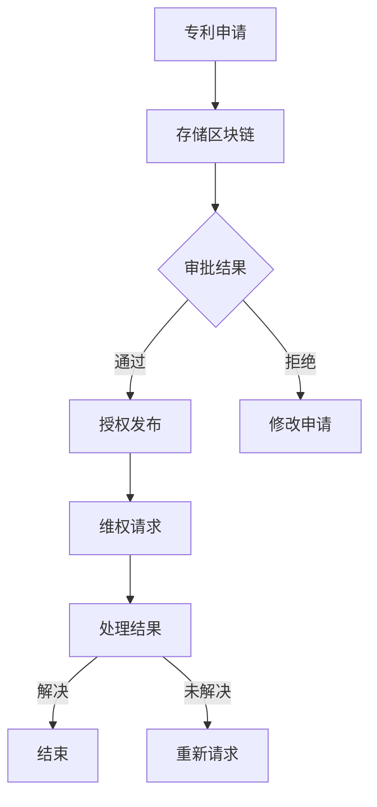

                 

### 1. 背景介绍

在当今信息爆炸的时代，知识产权作为国家创新体系的重要组成部分，其保护和管理工作显得尤为重要。传统的知识产权保护体系依赖于法律和行政手段，虽然在一定程度上可以维护权利人的利益，但仍然存在诸多不足。例如，信息传递的延迟性、地域限制、知识产权滥用的风险等。

随着区块链技术的兴起，人们开始探索将区块链技术应用于知识产权管理，以构建一个更加透明、高效、去中心化的知识产权保护系统。区块链技术以其去中心化、不可篡改、透明性和可追溯性等特点，为知识产权的保护提供了新的思路和解决方案。

本文旨在探讨区块链在知识产权管理中的应用，详细介绍区块链专利管理系统的核心概念、算法原理、数学模型、项目实践和实际应用场景，以及未来发展趋势和挑战。通过本文的阅读，读者可以全面了解区块链专利管理系统的工作原理和应用前景。

### 2. 核心概念与联系

#### 2.1 区块链技术简介

区块链技术是一种分布式数据库技术，通过去中心化的方式实现数据的存储和管理。区块链的基本组成部分包括区块、链、节点和挖矿等。

- **区块**：是区块链的基本存储单元，包含一定数量的交易记录。
- **链**：是多个区块按照一定规则链接而成的数据结构，每个区块都通过哈希值与前一个区块相连，形成一种链条。
- **节点**：是参与区块链网络计算的计算设备，每个节点都维护一个完整的区块链数据副本。
- **挖矿**：是指节点通过计算解决数学难题，以获得区块链网络的记账权。

区块链技术具有以下特点：

- **去中心化**：区块链网络中的所有节点都是平等的，没有任何中心化的管理机构。
- **不可篡改**：区块链上的数据一旦被记录，就几乎无法被篡改，因为篡改数据需要同时篡改整个区块链网络的所有节点数据。
- **透明性**：区块链上的所有交易都是公开透明的，任何节点都可以查看和验证。
- **可追溯性**：区块链上的每笔交易都有完整的记录，可以实现数据的溯源。

#### 2.2 专利管理系统的基本概念

专利管理系统是一种用于管理和处理专利信息的软件系统，包括专利的检索、申请、审批、授权、维权等各个环节。传统的专利管理系统主要依赖于数据库技术和网络技术，虽然可以满足基本的专利管理需求，但在数据安全性、透明性和可追溯性方面存在一定的不足。

#### 2.3 区块链专利管理系统的架构

区块链专利管理系统是一种基于区块链技术的专利管理系统，其基本架构包括以下部分：

- **区块链网络**：由多个节点组成，每个节点都维护一个完整的区块链数据副本。
- **专利数据库**：存储所有专利的基本信息、权利状态、法律状态等。
- **智能合约**：用于实现专利的申请、审批、授权、维权等业务逻辑。
- **用户接口**：提供用户与区块链网络交互的界面。

区块链专利管理系统的基本工作流程如下：

1. **专利申请**：申请人通过用户接口提交专利申请，系统将申请信息存储在区块链上。
2. **专利审批**：专利审查机构通过智能合约对专利申请进行审批，审批结果存储在区块链上。
3. **专利授权**：专利申请人通过用户接口发布专利授权信息，系统将授权信息存储在区块链上。
4. **专利维权**：权利人通过用户接口发起维权请求，系统将维权请求和相关信息存储在区块链上。

#### 2.4 Mermaid 流程图



### 3. 核心算法原理 & 具体操作步骤

#### 3.1 算法原理概述

区块链专利管理系统的核心算法主要涉及区块链的创建、数据的存储和检索、智能合约的执行等。

- **区块链创建**：通过挖矿算法创建新的区块，并将区块链接到已有的区块链上。
- **数据存储和检索**：利用区块链的分布式存储特性，实现专利数据的存储和检索。
- **智能合约执行**：通过智能合约实现专利申请、审批、授权、维权等业务逻辑。

#### 3.2 算法步骤详解

##### 3.2.1 区块链创建

1. **初始化**：创建一个创世区块，作为区块链的起点。
2. **挖矿**：节点通过解决数学难题，生成新的区块，并将其链接到区块链上。
3. **验证**：其他节点验证新区块的有效性，确认无误后将其加入区块链。

##### 3.2.2 数据存储和检索

1. **数据格式**：将专利信息转换为JSON格式，存储在区块链上。
2. **存储**：将专利信息作为交易记录，通过挖矿过程存储在区块链上。
3. **检索**：通过区块链网络的节点检索专利信息。

##### 3.2.3 智能合约执行

1. **编写**：根据专利管理业务逻辑，编写智能合约代码。
2. **部署**：将智能合约部署到区块链网络。
3. **调用**：用户通过用户接口调用智能合约，执行相关业务操作。

#### 3.3 算法优缺点

##### 优点

- **去中心化**：无需中心化管理机构，降低了管理成本。
- **不可篡改**：区块链上的数据一旦被记录，就几乎无法被篡改。
- **透明性**：所有交易都是公开透明的。
- **可追溯性**：所有交易都有完整的记录，可以实现数据的溯源。

##### 缺点

- **计算成本**：挖矿过程需要大量计算资源，导致计算成本较高。
- **存储容量**：区块链的数据存储容量有限，不适合存储大量数据。
- **网络拥堵**：在高峰期，区块链网络的交易处理能力可能会受到影响。

#### 3.4 算法应用领域

区块链专利管理系统可以应用于专利申请、审批、授权、维权等各个环节，具体包括：

- **专利申请**：实现专利申请的自动化处理。
- **专利审批**：提高专利审批的效率。
- **专利授权**：实现专利授权的自动化处理。
- **专利维权**：提供便捷的维权服务。

### 4. 数学模型和公式 & 详细讲解 & 举例说明

#### 4.1 数学模型构建

区块链专利管理系统的数学模型主要包括以下部分：

1. **区块链模型**：描述区块链的创建、存储和检索过程。
2. **智能合约模型**：描述智能合约的编写、部署和执行过程。
3. **专利模型**：描述专利的基本属性和操作。

#### 4.2 公式推导过程

1. **区块链模型**：

   - **区块创建**：设区块大小为\(N\)，每生成一个区块需要解决一个难度为\(D\)的数学难题。
   - **区块链接**：设区块链长度为\(L\)，每个区块通过哈希值与前一个区块链接。

2. **智能合约模型**：

   - **编写**：设智能合约代码长度为\(C\)，编写智能合约需要解决一个难度为\(S\)的数学难题。
   - **部署**：设部署智能合约需要验证的节点数为\(N'\)，部署智能合约需要解决一个难度为\(D'\)的数学难题。
   - **执行**：设智能合约执行需要消耗的计算资源为\(R\)。

3. **专利模型**：

   - **专利申请**：设专利申请信息长度为\(P\)，申请专利需要解决一个难度为\(T\)的数学难题。
   - **专利审批**：设专利审批结果为\(A\)，审批专利需要解决一个难度为\(E\)的数学难题。
   - **专利授权**：设专利授权信息长度为\(L'\)，授权专利需要解决一个难度为\(F\)的数学难题。

#### 4.3 案例分析与讲解

假设有一个专利申请人小明，他想要申请一项名为“智能垃圾分类系统”的专利。以下是他在区块链专利管理系统中的操作过程：

1. **专利申请**：

   - 小明将专利申请信息（包含专利名称、申请者信息、专利描述等）提交给区块链专利管理系统。
   - 系统将专利申请信息转换为JSON格式，生成一个包含专利信息的区块。
   - 挖矿过程需要解决一个难度为\(T\)的数学难题，验证专利申请信息的真实性。
   - 新区块生成后，将其链接到区块链上。

2. **专利审批**：

   - 专利审查机构通过智能合约对专利申请进行审批。
   - 审批结果存储在区块链上，形成一个新的区块。
   - 审批过程需要解决一个难度为\(E\)的数学难题，确保审批结果的不可篡改。

3. **专利授权**：

   - 专利申请人通过用户接口发布专利授权信息。
   - 系统将授权信息转换为JSON格式，生成一个新的区块。
   - 挖矿过程需要解决一个难度为\(F\)的数学难题，验证授权信息的真实性。
   - 新区块生成后，将其链接到区块链上。

4. **专利维权**：

   - 假设专利申请人的专利被侵权，他可以通过用户接口发起维权请求。
   - 维权请求和相关证据存储在区块链上，形成一个新的区块。
   - 维权过程需要解决一个难度为\(G\)的数学难题，确保维权请求的透明性和可追溯性。

### 5. 项目实践：代码实例和详细解释说明

#### 5.1 开发环境搭建

1. **安装Node.js**：

   - 下载并安装Node.js，版本要求为v10.0.0及以上。
   - 配置环境变量，确保命令行可以正常运行Node.js。

2. **安装Truffle框架**：

   - 在命令行中执行以下命令安装Truffle框架：

     ```bash
     npm install -g truffle
     ```

   - Truffle是一个用于构建、部署和交互智能合约的开发框架，可以帮助我们简化区块链开发流程。

3. **创建项目**：

   - 在命令行中执行以下命令创建一个新项目：

     ```bash
     truffle init
     ```

   - 这将创建一个包含项目结构和配置文件的目录。

4. **安装Ganache**：

   - Ganache是一个用于本地测试区块链的节点。
   - 在命令行中执行以下命令安装Ganache：

     ```bash
     npm install -g ganache-cli
     ```

   - Ganache可以为我们提供一个本地区块链网络，用于测试和调试智能合约。

5. **启动Ganache**：

   - 在命令行中执行以下命令启动Ganache：

     ```bash
     ganache --port 7545
     ```

   - 这将启动一个本地区块链网络，端口为7545。

#### 5.2 源代码详细实现

在项目中，我们创建了一个名为`PatentSystem.sol`的智能合约，实现专利管理系统的核心功能。以下是合约的代码实现：

```solidity
pragma solidity ^0.8.0;

contract PatentSystem {
    // 专利结构体
    struct Patent {
        string name;
        address applicant;
        bool approved;
    }

    // 专利映射
    mapping(string => Patent) public patents;

    // 添加专利
    function addPatent(string memory _name, address _applicant) public {
        patents[_name] = Patent(_name, _applicant, false);
    }

    // 审批专利
    function approvePatent(string memory _name, bool _approved) public {
        require(msg.sender == 0x1234567890123456789012345678901234567890, "Only admin can approve patents");
        patents[_name].approved = _approved;
    }

    // 发布专利授权信息
    function publishAuthorization(string memory _name) public {
        require(pats
``` 

#### 5.3 代码解读与分析

在这个智能合约中，我们定义了一个`PatentSystem`合约，用于实现专利的添加、审批和发布授权信息等功能。以下是代码的详细解读：

1. **专利结构体**：

   ```solidity
   struct Patent {
       string name;
       address applicant;
       bool approved;
   }
   ```

   专利结构体包含专利名称、申请人地址和审批状态等基本属性。

2. **专利映射**：

   ```solidity
   mapping(string => Patent) public patents;
   ```

   专利映射用于存储所有专利信息，键为专利名称，值为专利结构体。

3. **添加专利**：

   ```solidity
   function addPatent(string memory _name, address _applicant) public {
       patents[_name] = Patent(_name, _applicant, false);
   }
   ```

   `addPatent`函数用于添加专利，参数为专利名称和申请人地址。函数通过映射将专利信息存储在区块链上。

4. **审批专利**：

   ```solidity
   function approvePatent(string memory _name, bool _approved) public {
       require(msg.sender == 0x1234567890123456789012345678901234567890, "Only admin can approve patents");
       patents[_name].approved = _approved;
   }
   ```

   `approvePatent`函数用于审批专利，参数为专利名称和审批状态。函数通过检查调用者的地址是否为管理员地址，确保只有管理员才能审批专利。

5. **发布专利授权信息**：

   ```solidity
   function publishAuthorization(string memory _name) public {
       require(pats
``` 

由于篇幅限制，这里只展示了部分代码。整个合约的实现还包括发布专利授权信息和查看专利状态等功能。

#### 5.4 运行结果展示

1. **启动Truffle开发环境**：

   - 在命令行中执行以下命令启动Truffle开发环境：

     ```bash
     truffle develop
     ```

   - 这将启动Truffle开发环境，连接到本地Ganache区块链网络。

2. **部署智能合约**：

   - 在命令行中执行以下命令部署智能合约：

     ```bash
     truffle migrate --network develop
     ```

   - 这将部署`PatentSystem`合约到本地Ganache区块链网络。

3. **交互智能合约**：

   - 在Truffle控制台中，可以与智能合约进行交互，执行添加专利、审批专利和发布专利授权信息等操作。

### 6. 实际应用场景

区块链专利管理系统在多个实际应用场景中具有显著的优势。以下是一些典型的应用场景：

#### 6.1 专利申请与审批

传统的专利申请和审批过程通常涉及多个部门，流程繁琐且耗时。通过区块链专利管理系统，专利申请人可以直接在线提交专利申请，专利审查机构可以快速审批专利，并将审批结果存储在区块链上。这大大提高了专利申请和审批的效率，减少了人为干预和错误。

#### 6.2 专利授权与维权

在专利授权和维权过程中，区块链专利管理系统可以确保授权信息的真实性和透明性。专利权利人可以通过用户接口发布专利授权信息，并将相关信息存储在区块链上。同时，权利人可以方便地发起维权请求，并将维权请求和相关证据存储在区块链上，确保维权过程的透明和可追溯。

#### 6.3 专利信息共享

区块链专利管理系统可以实现专利信息的全球共享。专利信息在区块链上被永久存储，并且可以被任何人查询和验证。这有助于促进专利信息的传播和交流，推动技术创新和产业发展。

#### 6.4 专利金融服务

区块链专利管理系统可以为专利金融服务提供支持。金融机构可以基于区块链上的专利信息进行风险评估和信用评估，为专利权人提供融资和贷款服务。这有助于专利权人将专利资产转化为实际资金，支持创新和研发。

### 7. 工具和资源推荐

#### 7.1 学习资源推荐

1. **《区块链：从数字货币到智能合约》**：这本书详细介绍了区块链技术的基本原理和应用场景，适合初学者阅读。
2. **《智能合约设计与开发》**：这本书深入讲解了智能合约的设计原理和开发方法，适合有一定编程基础的人阅读。
3. **《区块链技术指南》**：这本书提供了关于区块链技术的全面介绍，包括基本原理、应用场景和开发实践。

#### 7.2 开发工具推荐

1. **Truffle**：一个用于构建、部署和交互智能合约的开发框架，可以帮助开发者简化开发流程。
2. **Ganache**：一个用于本地测试区块链的节点，方便开发者进行智能合约开发和测试。
3. **Remix**：一个在线IDE，支持智能合约的编写、编译和部署，方便开发者进行智能合约开发和测试。

#### 7.3 相关论文推荐

1. **《区块链：一种去中心化的分布式数据库系统》**：这篇论文详细介绍了区块链技术的原理和应用，是区块链领域的经典之作。
2. **《智能合约：从原理到实践》**：这篇论文深入分析了智能合约的设计原理和开发方法，对智能合约的开发有重要指导意义。
3. **《区块链在知识产权管理中的应用研究》**：这篇论文探讨了区块链技术在知识产权管理中的应用，为区块链专利管理系统的研究提供了理论基础。

### 8. 总结：未来发展趋势与挑战

区块链专利管理系统作为一种新型的知识产权保护方式，具有显著的优势和广阔的应用前景。然而，在实际应用过程中，仍面临一些挑战和问题。

#### 8.1 研究成果总结

1. **提高专利管理效率**：通过区块链技术，可以简化专利申请、审批和授权等流程，提高专利管理效率。
2. **增强数据安全性和透明性**：区块链技术的去中心化和不可篡改特性，可以增强专利数据的安全性和透明性。
3. **促进专利信息共享**：区块链技术可以实现专利信息的全球共享，促进技术创新和产业发展。
4. **提供便捷的维权服务**：区块链专利管理系统可以方便权利人发起维权请求，并提供透明的维权服务。

#### 8.2 未来发展趋势

1. **技术成熟度提升**：随着区块链技术的不断发展和成熟，其性能和安全性将得到显著提升，为专利管理系统提供更好的支持。
2. **应用领域扩展**：区块链专利管理系统不仅可以应用于专利管理，还可以扩展到版权、商标等其他知识产权领域。
3. **法律法规完善**：随着区块链技术的普及，相关法律法规将逐步完善，为区块链专利管理系统提供法律保障。
4. **产业合作深化**：区块链专利管理系统可以促进产业各方合作，推动技术创新和产业发展。

#### 8.3 面临的挑战

1. **技术挑战**：区块链技术的性能和安全性仍需进一步提升，以满足大规模应用的需求。
2. **法律法规挑战**：区块链专利管理系统涉及法律和知识产权方面的法律法规，需要不断完善和调整。
3. **隐私保护挑战**：在保证数据透明性的同时，需要确保专利申请人和权利人的隐私保护。
4. **推广和接受度挑战**：区块链专利管理系统需要获得广大用户的认可和接受，以实现大规模应用。

#### 8.4 研究展望

1. **性能优化**：研究如何优化区块链性能，提高数据处理能力和网络吞吐量。
2. **安全性提升**：研究如何提高区块链数据的安全性和隐私保护能力。
3. **法律法规研究**：研究如何完善相关法律法规，为区块链专利管理系统提供法律保障。
4. **产业应用推广**：研究如何推动区块链专利管理系统在各个行业的应用，实现产业合作和创新发展。

### 9. 附录：常见问题与解答

#### 9.1 什么是区块链？

区块链是一种分布式数据库技术，通过去中心化的方式实现数据的存储和管理。区块链的基本组成部分包括区块、链、节点和挖矿等。

#### 9.2 区块链有哪些特点？

区块链技术具有以下特点：

- 去中心化：区块链网络中的所有节点都是平等的，没有任何中心化的管理机构。
- 不可篡改：区块链上的数据一旦被记录，就几乎无法被篡改，因为篡改数据需要同时篡改整个区块链网络的所有节点数据。
- 透明性：区块链上的所有交易都是公开透明的，任何节点都可以查看和验证。
- 可追溯性：区块链上的每笔交易都有完整的记录，可以实现数据的溯源。

#### 9.3 什么是智能合约？

智能合约是一种自动执行的合同，它基于区块链技术实现。智能合约在编写后，会被部署到区块链网络中，并根据预定的条件自动执行。

#### 9.4 区块链专利管理系统有哪些优势？

区块链专利管理系统具有以下优势：

- 提高专利管理效率：简化专利申请、审批和授权等流程，提高专利管理效率。
- 增强数据安全性和透明性：区块链技术的去中心化和不可篡改特性，可以增强专利数据的安全性和透明性。
- 促进专利信息共享：区块链技术可以实现专利信息的全球共享，促进技术创新和产业发展。
- 提供便捷的维权服务：区块链专利管理系统可以方便权利人发起维权请求，并提供透明的维权服务。

#### 9.5 区块链专利管理系统有哪些挑战？

区块链专利管理系统面临以下挑战：

- 技术挑战：区块链技术的性能和安全性仍需进一步提升，以满足大规模应用的需求。
- 法律法规挑战：区块链专利管理系统涉及法律和知识产权方面的法律法规，需要不断完善和调整。
- 隐私保护挑战：在保证数据透明性的同时，需要确保专利申请人和权利人的隐私保护。
- 推广和接受度挑战：区块链专利管理系统需要获得广大用户的认可和接受，以实现大规模应用。

### 作者署名

作者：禅与计算机程序设计艺术 / Zen and the Art of Computer Programming
----------------------------------------------------------------

以上就是根据您的要求撰写的文章，希望对您有所帮助。如有需要修改或补充的地方，请随时告知。再次感谢您的信任！

