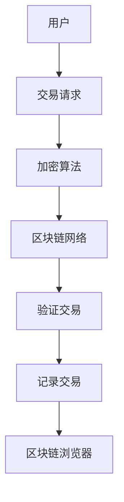

                 

关键词：区块链、金融科技、去中心化、智能合约、加密货币、金融创新

> 摘要：本文将探讨区块链技术在金融科技领域的创新应用，从基础概念、核心算法、数学模型到实际案例，全面解析区块链在金融科技中的潜力和挑战。

## 1. 背景介绍

随着互联网技术的飞速发展，金融科技（FinTech）已经成为推动传统金融行业变革的重要力量。传统的金融系统在处理交易、记录数据和执行合约等方面存在着诸多问题，如交易效率低下、数据不透明、信任缺失等。区块链技术的出现为解决这些问题提供了一种全新的可能性。

区块链是一种分布式账本技术，其核心特点包括去中心化、透明性、安全性和不可篡改性。通过区块链，金融交易和数据的记录不再依赖于单一的中央机构，而是分散在多个节点上，从而提高了系统的可靠性和透明度。

## 2. 核心概念与联系

### 2.1 去中心化

去中心化是区块链技术的核心概念之一。它意味着在区块链网络中，不再需要一个单一的中央机构来管理和验证交易，而是通过分布式的方式共同维护账本。这样，每个节点都拥有完整的账本记录，任何一方都无法单方面篡改数据。

### 2.2 透明性

区块链上的所有交易记录都是公开透明的，任何人都可以通过区块链浏览器查看交易信息。这种透明性保证了数据的真实性，减少了欺诈和欺诈行为的发生。

### 2.3 安全性

区块链技术采用了多种加密算法来保证交易的安全。每次交易都会生成一个加密的哈希值，并将这个哈希值与交易的其他信息一起存储在区块链上。这种加密机制使得篡改交易记录变得非常困难。

### 2.4 不可篡改性

区块链上的数据一旦被记录，就无法被篡改。这是因为每个区块都通过加密算法与之前的区块相连，形成一个连续的链条。要篡改某个区块的数据，就必须同时篡改整个链条，这几乎是不可能的。

### 2.5 Mermaid 流程图

以下是一个简单的 Mermaid 流程图，展示了区块链技术的基本架构：



## 3. 核心算法原理 & 具体操作步骤

### 3.1 算法原理概述

区块链技术的核心算法主要包括哈希算法、加密算法和共识算法。

- **哈希算法**：哈希算法用于生成交易记录的哈希值，确保数据的唯一性和不可篡改性。
- **加密算法**：加密算法用于保护交易数据的安全性，防止数据被未授权的第三方访问。
- **共识算法**：共识算法用于多个节点之间达成共识，确保区块链的完整性和一致性。

### 3.2 算法步骤详解

1. **交易生成**：用户发起交易请求，交易内容包括交易金额、接收方地址等。
2. **加密交易**：交易信息经过加密算法处理后，生成加密的交易数据。
3. **生成哈希值**：加密后的交易数据通过哈希算法生成一个哈希值。
4. **加入区块**：将生成的哈希值和交易数据一起加入到一个区块中。
5. **广播区块**：将生成的区块广播到区块链网络中的所有节点。
6. **验证交易**：各个节点验证交易的真实性和合法性，确保交易符合区块链的规则。
7. **记录交易**：验证通过的交易将被记录在区块链上，形成新的区块。

### 3.3 算法优缺点

- **优点**：
  - 去中心化：去中心化使得区块链系统更加可靠和透明。
  - 透明性：所有交易记录都是公开透明的，提高了数据的可信度。
  - 安全性：加密算法和共识算法保证了交易的安全性和不可篡改性。

- **缺点**：
  - 计算资源消耗：区块链技术的运行需要大量的计算资源，可能导致能源消耗较高。
  - 交易效率：由于需要多个节点验证交易，区块链的的交易效率相对较低。

### 3.4 算法应用领域

区块链技术在金融科技领域的应用非常广泛，包括但不限于以下几个方面：

- **加密货币**：比特币、以太坊等加密货币是区块链技术的典型应用，它们通过区块链实现了去中心化的支付系统。
- **智能合约**：智能合约是一种自动执行的合约，通过区块链技术实现了去中心化的交易和执行。
- **金融交易**：区块链技术可以提高金融交易的透明性和效率，减少交易成本。
- **供应链管理**：区块链技术可以用于供应链管理，提高供应链的透明度和可追溯性。

## 4. 数学模型和公式 & 详细讲解 & 举例说明

### 4.1 数学模型构建

区块链技术的数学模型主要包括哈希算法、加密算法和共识算法的数学模型。

- **哈希算法模型**：哈希算法将输入数据映射到一个固定长度的输出值。一个典型的哈希算法是SHA-256，它将输入数据映射到一个32字节的长字符串。
- **加密算法模型**：加密算法通过加密密钥将明文数据转换为密文数据。一个典型的加密算法是AES，它采用128位密钥对数据进行加密。
- **共识算法模型**：共识算法通过多个节点之间的交互，达成对区块链状态的共识。一个典型的共识算法是工作量证明（PoW），它通过解决一个数学难题来验证节点的合法性。

### 4.2 公式推导过程

- **哈希算法公式**：SHA-256算法的输入是一个长度为256位的二进制字符串，输出是一个长度为32字节的十六进制字符串。公式如下：

  ```latex
  H = SHA-256(X) = \sum_{i=0}^{64} h_i
  ```

  其中，$h_i$ 是第i个32位的哈希值。

- **加密算法公式**：AES加密算法的输入是一个长度为128位的明文数据，输出是一个长度为128位的密文数据。公式如下：

  ```latex
  C = AES(K, P) = \sum_{i=0}^{n} C_i
  ```

  其中，$K$ 是加密密钥，$P$ 是明文数据，$C_i$ 是第i个128位的密文块。

- **共识算法公式**：PoW算法的核心是一个数学难题，节点需要找到满足特定条件的解。公式如下：

  ```latex
  Nonce = \{ x \in \mathbb{Z}^+ \mid hash(x) < target \}
  ```

  其中，$Nonce$ 是要找的解，$hash(x)$ 是解的哈希值，$target$ 是一个预设的目标值。

### 4.3 案例分析与讲解

以下是一个简单的区块链交易的案例：

- **交易信息**：假设有一笔金额为100的转账交易，发送方为A，接收方为B。
- **加密交易**：交易信息经过加密算法处理后，生成加密的交易数据。
- **生成哈希值**：加密后的交易数据通过哈希算法生成一个哈希值。
- **加入区块**：将生成的哈希值和交易数据一起加入到一个区块中。
- **验证交易**：各个节点验证交易的真实性和合法性，确保交易符合区块链的规则。
- **记录交易**：验证通过的交易将被记录在区块链上，形成新的区块。

在这个案例中，哈希算法和加密算法保证了交易数据的唯一性和安全性，共识算法保证了区块链的完整性和一致性。

## 5. 项目实践：代码实例和详细解释说明

### 5.1 开发环境搭建

为了更好地理解和实践区块链技术，我们可以使用一个开源的区块链框架，如Ethereum。以下是搭建Ethereum开发环境的步骤：

1. 安装Go语言环境。
2. 安装Ethereum客户端Go-Ethereum。
3. 配置Ethereum节点，启动节点。

### 5.2 源代码详细实现

以下是一个简单的Ethereum智能合约的源代码实例：

```solidity
// SPDX-License-Identifier: MIT
pragma solidity ^0.8.0;

contract Transfer {
    address public owner;
    mapping(address => uint256) public balance;

    constructor() {
        owner = msg.sender;
        balance[owner] = 1000;
    }

    function transfer(address to, uint256 amount) public {
        require(to != address(0), "Invalid address");
        require(balance[owner] >= amount, "Insufficient balance");

        balance[owner] -= amount;
        balance[to] += amount;
    }
}
```

这个智能合约实现了简单的转账功能，允许合约拥有者向其他地址转账以太币。

### 5.3 代码解读与分析

- **合约结构**：这个智能合约由构造函数`constructor`和转账函数`transfer`组成。
- **变量定义**：`owner`定义了合约的拥有者，`balance`是一个映射，用于存储每个地址的以太币余额。
- **构造函数**：构造函数初始化合约拥有者，并给合约拥有者分配1000个以太币。
- **转账函数**：转账函数用于从合约拥有者的余额中扣除指定金额，并将其添加到接收方的余额中。

### 5.4 运行结果展示

假设合约拥有者A要向B转账10个以太币，以下是运行结果：

1. 调用转账函数`transfer(B, 10)`。
2. 合约验证转账请求的有效性，确保接收方地址有效且余额足够。
3. 执行转账操作，从A的余额中扣除10个以太币，并将10个以太币添加到B的余额中。
4. 交易被记录在区块链上，形成一个新的区块。

## 6. 实际应用场景

### 6.1 加密货币

加密货币如比特币和以太坊是区块链技术最典型的应用之一。它们通过区块链实现了去中心化的支付系统，提高了交易的透明性和安全性。

### 6.2 智能合约

智能合约是区块链技术的另一大应用领域。通过智能合约，可以自动执行合约条款，减少了人工干预和信任成本。

### 6.3 金融交易

区块链技术可以提高金融交易的透明性和效率，减少交易成本。例如，跨境支付和结算可以更加快捷和安全。

### 6.4 供应链管理

区块链技术可以用于供应链管理，提高供应链的透明度和可追溯性。通过区块链，可以记录产品的生产和运输过程，确保产品的真实性。

## 7. 工具和资源推荐

### 7.1 学习资源推荐

- 《区块链技术指南》
- 《精通区块链》
- 《智能合约开发实战》

### 7.2 开发工具推荐

- Ethereum Studio：一个用于开发Ethereum智能合约的在线集成开发环境。
- Truffle：一个用于测试、部署和跟踪以太坊区块链的框架。
- Remix：一个在线的以太坊智能合约开发环境。

### 7.3 相关论文推荐

- Satoshi Nakamoto. "Bitcoin: A Peer-to-Peer Electronic Cash System."
- Vitalik Buterin. "A Next-Generation Smart Contract and Decentralized Application Platform."
- Joseph M. Reagle Jr. "The Facebook Blog and the Governance of the Social Web."

## 8. 总结：未来发展趋势与挑战

### 8.1 研究成果总结

区块链技术在金融科技领域取得了显著的成果，包括加密货币、智能合约、金融交易和供应链管理等方面的应用。这些应用不仅提高了交易的透明性和安全性，还降低了交易成本。

### 8.2 未来发展趋势

- **扩展性能**：随着区块链应用的不断增长，如何提高区块链的扩展性能将成为一个重要研究方向。
- **跨链技术**：跨链技术可以实现不同区块链之间的数据交互，促进区块链生态的融合和发展。
- **监管合规**：随着区块链技术的发展，监管合规也将成为一个重要议题。

### 8.3 面临的挑战

- **安全性**：区块链技术的安全性仍然是亟待解决的问题，如何防范分布式拒绝服务（DDoS）攻击、智能合约漏洞等将成为一个重要挑战。
- **用户教育**：区块链技术的普及需要用户教育的支持，如何提高用户的区块链知识水平也将是一个挑战。

### 8.4 研究展望

未来，区块链技术有望在更多领域得到应用，如物联网、医疗健康、法律合同等。同时，随着技术的不断进步，区块链将变得更加安全、高效和易于使用。

## 9. 附录：常见问题与解答

### 9.1 什么是区块链？

区块链是一种分布式账本技术，通过加密算法和共识算法，实现了去中心化、透明性、安全性和不可篡改性。

### 9.2 区块链有哪些应用？

区块链的应用非常广泛，包括加密货币、智能合约、金融交易、供应链管理、身份认证、医疗记录等。

### 9.3 区块链的安全性如何保障？

区块链的安全性主要通过加密算法和共识算法来保障。加密算法用于保护交易数据的安全性，共识算法用于多个节点之间达成共识，确保区块链的完整性和一致性。

### 9.4 区块链与比特币是什么关系？

比特币是区块链的一个典型应用，它通过区块链实现了去中心化的支付系统。但区块链技术还可以应用于其他领域，如智能合约、供应链管理等。

### 9.5 区块链的缺点是什么？

区块链的缺点主要包括计算资源消耗较高、交易效率相对较低、监管合规问题等。

## 结束语

区块链技术在金融科技领域的应用展示了其巨大的潜力和变革力量。通过本文的探讨，我们可以看到区块链技术如何通过去中心化、透明性、安全性和不可篡改性，为金融科技带来变革。未来，随着技术的不断进步，区块链将在更多领域得到应用，推动社会的进步和发展。

## 作者署名

作者：禅与计算机程序设计艺术 / Zen and the Art of Computer Programming

