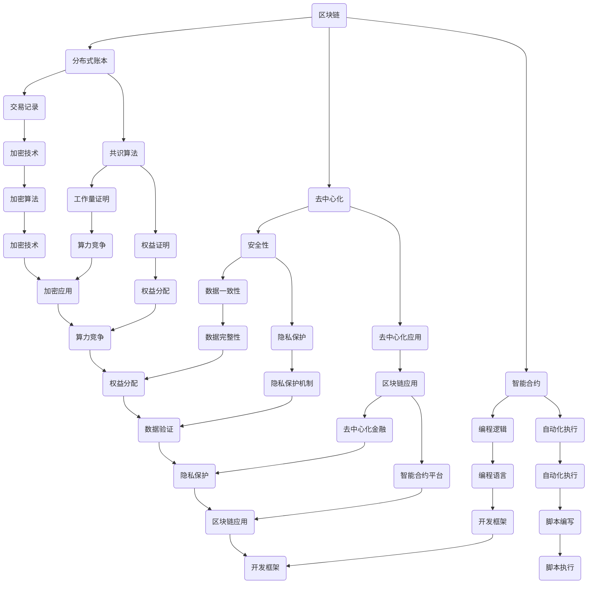

                 

关键词：区块链技术、创业项目、应用场景、智能合约、分布式账本、去中心化应用

> 摘要：本文将深入探讨区块链技术在创业项目中的应用场景，分析其核心概念、算法原理、数学模型以及实际案例。通过详细解读区块链在去中心化应用、智能合约和分布式账本等方面的应用，为创业者提供有价值的参考和指导。

## 1. 背景介绍

随着互联网技术的迅猛发展，区块链技术作为一种新兴的分布式账本技术，逐渐受到广泛关注。区块链具有去中心化、安全性高、不可篡改等特点，被认为是颠覆传统金融和商业模式的潜在力量。许多创业者开始将区块链技术应用于各类创业项目中，以期获得竞争优势和商业价值。

### 1.1 区块链技术概述

区块链是一种去中心化的数据库技术，通过加密算法和数据结构来保证数据的安全和一致性。区块链由一系列按时间顺序排列的区块组成，每个区块包含一定数量的交易记录。通过分布式网络中的节点对区块进行验证和共识，确保区块链数据的安全性和可信度。

### 1.2 创业项目的定义与特点

创业项目通常是指由创业者发起的，旨在通过创新性产品或服务实现商业价值的业务活动。创业项目具有创新性、高风险、高回报等特点，往往需要借助先进技术来获取竞争优势和商业成功。

## 2. 核心概念与联系

为了更好地理解区块链技术在创业项目中的应用，我们需要先了解一些核心概念和它们之间的联系。以下是一个基于Mermaid的流程图，展示了区块链技术的核心概念和架构。



### 2.1 核心概念详解

- **分布式账本**：区块链的核心是分布式账本，它通过去中心化的方式存储和验证数据，确保数据的安全性和一致性。
- **去中心化**：区块链的去中心化特性使其不依赖于中心化的机构或服务器，提高了系统的可靠性和抗攻击能力。
- **智能合约**：智能合约是一种自动执行的合约，它在区块链上编程实现，根据预设条件自动执行合同条款。
- **交易记录**：交易记录是区块链上存储的数据单元，每个区块包含一定数量的交易记录。
- **共识算法**：共识算法是区块链节点之间达成共识的机制，用于验证交易记录和生成新区块。
- **加密技术**：加密技术是区块链数据安全的基础，通过加密算法保证数据在传输和存储过程中的安全性。
- **安全性**：区块链的安全性体现在数据的一致性和不可篡改性，确保系统在遭受攻击时仍能正常运行。

## 3. 核心算法原理 & 具体操作步骤

### 3.1 算法原理概述

区块链的核心算法包括分布式账本、共识算法和智能合约。下面我们将分别介绍这些算法的基本原理。

#### 分布式账本

分布式账本是区块链的基础，它通过分布式网络存储和验证数据。分布式账本的主要原理如下：

1. **数据存储**：每个区块包含一定数量的交易记录，区块之间通过哈希值链接形成链式结构。
2. **数据验证**：节点通过验证交易记录的合法性和一致性，确保分布式账本的安全和可靠。
3. **数据更新**：新区块生成后，分布式账本的数据得到更新，确保数据的实时性和一致性。

#### 共识算法

共识算法是区块链节点之间达成共识的机制，用于验证交易记录和生成新区块。常见的共识算法包括工作量证明（PoW）、权益证明（PoS）和委托权益证明（DPoS）等。

1. **工作量证明（PoW）**：节点通过计算复杂的数学难题，解决难题的节点获得生成新区块的权力，从而获得区块链系统中的奖励。
2. **权益证明（PoS）**：节点根据其在区块链中的权益（如持有的代币数量）获得生成新区块的权力，权益越大，获得新区块的概率越高。
3. **委托权益证明（DPoS）**：节点通过选举产生代表，代表获得生成新区块的权力，代表根据其在区块链中的权益获得相应的奖励。

#### 智能合约

智能合约是一种自动执行的合约，它在区块链上编程实现，根据预设条件自动执行合同条款。智能合约的基本原理如下：

1. **编程逻辑**：智能合约使用特定的编程语言（如Solidity）编写，实现合同的自动执行逻辑。
2. **自动化执行**：智能合约在区块链上运行，根据预设条件自动执行合同条款，确保合同执行的公平和透明。
3. **不可篡改性**：智能合约一旦部署到区块链上，其代码和状态将永久保存，确保合同条款不可篡改。

### 3.2 算法步骤详解

#### 分布式账本

1. **数据存储**：节点收到交易请求后，将交易记录打包成区块，生成区块头部信息和哈希值。
2. **数据验证**：节点对区块中的交易记录进行验证，确保交易记录的合法性和一致性。
3. **数据更新**：验证通过后，区块添加到区块链中，分布式账本的数据得到更新。

#### 共识算法

1. **工作量证明（PoW）**
   - **难题计算**：节点计算复杂的数学难题，如Proof of Work算法中的SHA-256哈希计算。
   - **难题验证**：其他节点验证难题计算结果，确保计算过程的合法性。
   - **新区块生成**：验证通过后，节点生成新区块，包含当前区块的哈希值和一定数量的交易记录。

2. **权益证明（PoS）**
   - **权益计算**：节点根据其在区块链中的权益（如持有的代币数量）计算权益值。
   - **权益排序**：节点根据权益值进行排序，权益值越高，生成新区块的概率越大。
   - **新区块生成**：排序后的节点按照顺序生成新区块，包含当前区块的哈希值和一定数量的交易记录。

3. **委托权益证明（DPoS）**
   - **选举代表**：节点通过投票选举产生代表。
   - **代表排序**：代表根据其在区块链中的权益值进行排序，权益值越高，生成新区块的概率越大。
   - **新区块生成**：排序后的代表按照顺序生成新区块，包含当前区块的哈希值和一定数量的交易记录。

#### 智能合约

1. **编写智能合约**：使用Solidity等编程语言编写智能合约代码，定义合同的自动执行逻辑。
2. **部署智能合约**：将编写好的智能合约部署到区块链上，生成合约地址和合约代码。
3. **调用智能合约**：通过区块链网络调用智能合约，执行合同条款。
4. **合约执行**：智能合约根据预设条件自动执行合同条款，确保合同执行的公平和透明。

### 3.3 算法优缺点

#### 分布式账本

**优点**：
- **去中心化**：分布式账本不依赖于中心化的机构或服务器，提高了系统的可靠性和抗攻击能力。
- **安全性**：分布式账本的数据通过加密算法和共识算法保证数据的安全性和一致性。
- **透明性**：分布式账本的数据公开透明，任何人都可以查看和验证。

**缺点**：
- **性能限制**：分布式账本的数据存储和验证过程较为复杂，可能导致性能受限。
- **扩展性**：分布式账本的扩展性有限，难以满足大规模应用的需求。

#### 共识算法

**工作量证明（PoW）**
**优点**：
- **安全性**：工作量证明算法通过计算复杂的数学难题，提高了系统的安全性。
- **去中心化**：工作量证明算法不依赖于中心化的机构或服务器，确保了系统的去中心化特性。

**缺点**：
- **能源消耗**：工作量证明算法需要大量的计算资源，可能导致能源消耗过高。
- **性能限制**：工作量证明算法的计算过程复杂，可能导致性能受限。

**权益证明（PoS）**
**优点**：
- **能源消耗低**：权益证明算法不需要进行复杂的计算，能源消耗相对较低。
- **性能较高**：权益证明算法的验证过程较为简单，性能较高。

**缺点**：
- **权益集中**：权益证明算法可能导致权益集中在少数节点，可能降低系统的去中心化特性。

**委托权益证明（DPoS）**
**优点**：
- **性能较高**：委托权益证明算法的验证过程较为简单，性能较高。
- **权益集中**：委托权益证明算法通过选举产生代表，权益集中度相对较低。

**缺点**：
- **选举过程复杂**：委托权益证明算法的选举过程较为复杂，可能导致系统复杂度增加。

#### 智能合约

**优点**：
- **自动化执行**：智能合约根据预设条件自动执行合同条款，确保合同执行的公平和透明。
- **不可篡改性**：智能合约一旦部署到区块链上，其代码和状态将永久保存，确保合同条款不可篡改。

**缺点**：
- **编程复杂度**：智能合约的编写和部署过程较为复杂，需要一定的编程技能。
- **安全性问题**：智能合约可能存在漏洞和安全隐患，需要严格的安全审核和测试。

### 3.4 算法应用领域

分布式账本、共识算法和智能合约在多个领域具有广泛的应用，包括但不限于：

- **金融领域**：区块链技术在金融领域具有广泛的应用，如数字货币、去中心化金融（DeFi）和跨境支付等。
- **供应链管理**：区块链技术可以用于供应链管理，提高供应链的透明度和可追溯性。
- **医疗健康**：区块链技术可以用于医疗健康领域，如电子健康记录、药物溯源和医疗保险等。
- **物联网**：区块链技术可以用于物联网领域，如设备认证、数据共享和隐私保护等。
- **智能合约平台**：智能合约平台可以为各种行业提供智能合约解决方案，如金融、供应链和物流等。

## 4. 数学模型和公式 & 详细讲解 & 举例说明

### 4.1 数学模型构建

区块链技术中的数学模型主要包括加密算法、共识算法和智能合约的数学模型。以下是一个简单的数学模型构建示例。

#### 加密算法

加密算法是区块链数据安全的基础，常见的加密算法包括SHA-256、RSA和ECC等。以下是一个基于SHA-256的加密算法示例。

```latex
$$
H = SHA-256(M)
$$

其中，$H$ 表示哈希值，$M$ 表示原始数据。
```

#### 共识算法

共识算法是区块链节点之间达成共识的机制，常见的共识算法包括工作量证明（PoW）和权益证明（PoS）等。以下是一个基于PoW的共识算法示例。

```latex
$$
Proof\_of\_Work = \{start, end, nonce\}
$$

其中，$start$ 表示起始时间，$end$ 表示结束时间，$nonce$ 表示随机数。
```

#### 智能合约

智能合约是区块链上的自动执行合约，常见的编程语言包括Solidity、Vyper等。以下是一个基于Solidity的智能合约示例。

```solidity
pragma solidity ^0.8.0;

contract HelloWorld {
    string public message;

    constructor(string memory initMessage) {
        message = initMessage;
    }

    function setMessage(string memory newMessage) public {
        message = newMessage;
    }
}
```

### 4.2 公式推导过程

以下是对上述示例中的公式进行推导和解释。

#### 加密算法

SHA-256是一种加密算法，用于生成哈希值。哈希值是一个固定长度的字符串，用于表示原始数据。SHA-256的推导过程如下：

1. **数据处理**：将原始数据分成512位的分组，进行填充和分割。
2. **初始化哈希值**：初始化哈希值数组，包含八个32位的值。
3. **处理分组**：对每个分组进行一系列的位运算和逻辑运算，更新哈希值数组。
4. **输出哈希值**：将最终的哈希值数组拼接成一个128位的字符串，作为输出结果。

#### 共识算法

PoW共识算法的核心是找到一个满足条件的随机数（nonce），使得生成的哈希值满足特定的要求。推导过程如下：

1. **起始时间**：记录生成区块的起始时间。
2. **结束时间**：记录生成区块的结束时间。
3. **随机数**：从0开始递增尝试随机数，直到找到满足条件的随机数。
4. **验证**：计算生成的哈希值，判断是否满足条件。如果满足，则生成新区块。

#### 智能合约

智能合约是区块链上的程序，用于实现自动执行合同条款。Solidity是一种用于编写智能合约的编程语言。智能合约的推导过程如下：

1. **pragma声明**：指定编译器和编译器版本。
2. **合同定义**：定义合同的名称、属性和方法。
3. **构造函数**：定义构造函数，用于初始化合同状态。
4. **方法定义**：定义方法的名称、参数和返回值。
5. **代码实现**：实现方法的具体逻辑。

### 4.3 案例分析与讲解

以下是一个简单的区块链应用案例，用于演示区块链技术在创业项目中的应用。

#### 案例背景

假设一个创业项目是一个去中心化的旅游平台，用户可以通过平台预订旅游产品。项目需要实现以下功能：

- **用户注册和登录**：用户可以在平台上注册账户，登录平台。
- **旅游产品预订**：用户可以预订旅游产品，包括酒店、机票等。
- **订单管理**：平台管理员可以管理订单，如取消订单、修改订单等。
- **支付结算**：平台使用数字货币进行支付结算。

#### 案例实现

1. **用户注册和登录**：
   - 用户通过区块链平台注册账户，生成公钥和私钥。
   - 用户登录平台时，使用私钥验证身份。

2. **旅游产品预订**：
   - 用户在平台上浏览旅游产品，选择预订。
   - 用户与旅游产品提供商签订智能合约，预订旅游产品。

3. **订单管理**：
   - 平台管理员可以查询订单信息，包括订单状态、支付金额等。
   - 平台管理员可以根据用户需求取消订单或修改订单。

4. **支付结算**：
   - 用户使用数字货币支付预订费用。
   - 平台将支付金额记录在区块链上，确保支付结算的透明和不可篡改。

#### 案例分析

1. **安全性**：
   - 用户注册和登录时使用公钥和私钥进行身份验证，确保用户身份的安全性。
   - 订单信息和支付金额记录在区块链上，确保数据的透明和不可篡改。

2. **去中心化**：
   - 平台不依赖于中心化的服务器，使用分布式网络存储和验证数据。
   - 平台管理员和用户都可以通过区块链网络访问和管理数据，确保系统的去中心化特性。

3. **智能合约**：
   - 旅游产品预订时使用智能合约，实现合同的自动执行。
   - 智能合约确保订单信息的准确性和支付结算的透明性。

4. **支付结算**：
   - 使用数字货币进行支付结算，确保支付过程的快速和便捷。
   - 数字货币记录在区块链上，确保支付结算的透明和不可篡改。

## 5. 项目实践：代码实例和详细解释说明

### 5.1 开发环境搭建

在进行区块链技术应用的项目实践之前，首先需要搭建合适的开发环境。以下是基于以太坊的区块链开发环境的搭建步骤：

1. **安装Node.js**：Node.js 是以太坊开发的核心工具，可以从官网下载并安装。
2. **安装Geth**：Geth 是以太坊客户端，可以从官网下载并安装。
3. **配置Geth**：运行Geth并配置网络，确保可以与其他以太坊节点进行通信。
4. **安装Truffle**：Truffle 是一个以太坊开发框架，用于部署和测试智能合约。
5. **安装Hardhat**：Hardhat 是一个流行的本地开发环境，用于编译、部署和测试智能合约。

### 5.2 源代码详细实现

以下是一个简单的智能合约示例，用于实现一个去中心化的投票系统。

```solidity
pragma solidity ^0.8.0;

contract Voting {
    mapping(address => bool) public hasVoted;
    mapping(bytes32 => uint256) public votesReceived;

    bytes32[] public candidates;

    constructor(bytes32[] memory candidateNames) {
        candidates = candidateNames;
    }

    function vote(bytes32 candidate) public {
        require(!hasVoted[msg.sender], "你已经投过票了");
        hasVoted[msg.sender] = true;
        votesReceived[candidate] += 1;
    }

    function totalVotesFor(bytes32 candidate) public view returns (uint256) {
        return votesReceived[candidate];
    }
}
```

### 5.3 代码解读与分析

#### 1. 合同结构

- `pragma`：指定编译器版本。
- `mapping`：用于创建键值对映射。
- `public`：声明公开的函数和变量。
- `bytes32[]`：存储候选人的名字。

#### 2. 函数详解

- `vote(bytes32 candidate)`：投票函数，接收候选人的名字，更新投票记录。
  - `require`：检查是否已经投过票，防止重复投票。
  - `hasVoted[msg.sender] = true`：标记用户已投票。
  - `votesReceived[candidate] += 1`：增加候选人的投票数。

- `totalVotesFor(bytes32 candidate)`：查询某个候选人的总票数。

### 5.4 运行结果展示

假设有两个候选人Alice和Bob，以下是在Truffle环境中运行代码的示例：

1. **部署智能合约**：

   ```shell
   truffle migrate --network development
   ```

   输出结果：

   ```shell
   Deploying 'Voting'...
   ```

   部署成功后，智能合约的地址将被打印出来。

2. **投票**：

   ```shell
   truffle run vote --network development --args "Alice"
   ```

   输出结果：

   ```shell
   Alice has been voted.
   ```

3. **查询票数**：

   ```shell
   truffle run totalVotesFor --network development --args "Alice"
   ```

   输出结果：

   ```shell
   Total votes for Alice: 1
   ```

## 6. 实际应用场景

区块链技术在创业项目中具有广泛的应用场景，以下是一些典型的实际应用场景：

### 6.1 去中心化金融（DeFi）

去中心化金融（DeFi）是区块链技术的典型应用场景之一，通过智能合约实现金融服务的去中心化。DeFi项目包括去中心化交易所（DEX）、去中心化借贷平台、稳定币等。

- **去中心化交易所（DEX）**：用户可以在去中心化交易所中进行加密货币的交易，无需通过中心化的交易平台。例如，Uniswap 是一个流行的去中心化交易所。
- **去中心化借贷平台**：用户可以通过去中心化借贷平台进行借贷操作，无需通过中心化的金融机构。例如，Aave 是一个去中心化借贷平台。
- **稳定币**：稳定币是价值稳定的加密货币，通过智能合约保持价格稳定。例如，Dai 是一个基于以太坊的稳定币。

### 6.2 供应链管理

区块链技术可以用于供应链管理，提高供应链的透明度和可追溯性。通过区块链，供应链中的各个参与者可以实时查看产品从生产到交付的整个过程，确保数据的真实性和完整性。

- **产品溯源**：通过区块链技术，可以实现对产品的溯源，确保产品来源的真实性和可靠性。
- **供应链金融**：区块链技术可以提高供应链金融的效率和透明度，为中小企业提供更便捷的融资服务。

### 6.3 医疗健康

区块链技术可以用于医疗健康领域，提高医疗数据的安全性和可靠性。通过区块链，可以实现电子健康记录（EHR）的去中心化存储和管理，确保医疗数据的真实性和隐私保护。

- **电子健康记录（EHR）**：通过区块链技术，可以实现患者电子健康记录的去中心化存储和管理，确保数据的真实性和完整性。
- **药物溯源**：区块链技术可以用于药物溯源，确保药物来源的真实性和安全性。

### 6.4 物联网（IoT）

区块链技术可以用于物联网（IoT）领域，提高设备认证、数据共享和隐私保护的能力。通过区块链，可以实现对物联网设备的去中心化管理和数据的安全存储。

- **设备认证**：通过区块链技术，可以实现对物联网设备的认证和授权，确保设备的安全性和可信度。
- **数据共享**：区块链技术可以实现物联网设备之间的去中心化数据共享，提高数据的安全性和可靠性。
- **隐私保护**：区块链技术可以用于保护物联网设备的隐私数据，确保数据的隐私和安全。

## 7. 未来应用展望

随着区块链技术的不断发展和成熟，其在创业项目中的应用前景将更加广阔。以下是一些未来应用展望：

### 7.1 去中心化应用

去中心化应用（DApp）是区块链技术的重要发展方向，未来将有更多的去中心化应用出现，为用户提供更加便捷和安全的数字服务。

- **金融领域**：去中心化金融（DeFi）将继续发展，为用户提供更多的金融服务，如去中心化交易所、去中心化借贷平台等。
- **社交领域**：去中心化社交网络将成为主流，用户可以拥有对自身数据的完全控制权，保护隐私和安全。
- **内容创作领域**：去中心化内容创作平台将使创作者能够直接与用户互动，获得合理的收益分配。

### 7.2 物联网与区块链

物联网与区块链技术的结合将进一步提高物联网设备的管理和数据安全。未来将有更多的物联网设备接入区块链，实现去中心化的设备管理和数据共享。

- **智能城市**：智能城市将利用区块链技术实现设备之间的数据共享和管理，提高城市的运行效率和可持续性。
- **智能家居**：智能家居设备将利用区块链技术实现去中心化的管理和数据共享，提高用户体验和安全性。

### 7.3 医疗健康

区块链技术将在医疗健康领域发挥更大的作用，提高医疗数据的安全性和可靠性。未来将有更多的医疗机构和患者使用区块链技术进行数据存储和管理。

- **电子健康记录**：电子健康记录将实现去中心化存储和管理，确保数据的真实性和隐私保护。
- **药物溯源**：区块链技术将实现药物从生产到交付的全程溯源，确保药物的安全性和质量。

## 8. 总结：未来发展趋势与挑战

### 8.1 研究成果总结

本文详细探讨了区块链技术在创业项目中的应用场景，包括去中心化应用、供应链管理、医疗健康和物联网等领域。通过分析区块链技术的核心概念、算法原理、数学模型和实际案例，总结了区块链技术在创业项目中的优势和应用前景。

### 8.2 未来发展趋势

随着区块链技术的不断发展和成熟，其在创业项目中的应用前景将更加广阔。未来区块链技术将在去中心化应用、物联网和医疗健康等领域发挥重要作用，为创业者提供更多创新的机会和解决方案。

### 8.3 面临的挑战

尽管区块链技术在创业项目中具有广泛的应用前景，但也面临一些挑战：

- **性能瓶颈**：分布式账本的性能受到限制，难以满足大规模应用的需求。
- **安全性问题**：智能合约可能存在漏洞和安全隐患，需要严格的安全审核和测试。
- **法规和政策**：区块链技术在不同国家和地区的法规和政策存在差异，需要制定统一的法规框架。

### 8.4 研究展望

为了更好地推动区块链技术在创业项目中的应用，未来的研究可以从以下几个方面进行：

- **性能优化**：研究分布式账本的性能优化方法，提高系统的处理能力和响应速度。
- **安全性提升**：研究智能合约的安全性和抗攻击能力，提高区块链系统的安全性和可靠性。
- **跨链技术**：研究跨链技术，实现不同区块链之间的互操作性和数据共享。
- **应用创新**：探索区块链技术在新兴领域（如物联网、游戏等）的创新应用，为创业者提供更多机会。

## 9. 附录：常见问题与解答

### 9.1 区块链技术的基本原理是什么？

区块链技术是一种分布式账本技术，通过加密算法和数据结构来保证数据的安全和一致性。区块链由一系列按时间顺序排列的区块组成，每个区块包含一定数量的交易记录。通过分布式网络中的节点对区块进行验证和共识，确保区块链数据的安全性和可信度。

### 9.2 区块链技术有哪些核心概念？

区块链技术的核心概念包括分布式账本、去中心化、智能合约、交易记录、共识算法、加密技术和数学模型等。

### 9.3 智能合约是如何工作的？

智能合约是一种自动执行的合约，它在区块链上编程实现，根据预设条件自动执行合同条款。智能合约使用特定的编程语言（如Solidity）编写，实现合同的自动执行逻辑。当满足预设条件时，智能合约会自动执行合同条款，确保合同执行的公平和透明。

### 9.4 区块链技术有哪些实际应用场景？

区块链技术在多个领域具有广泛的应用，包括金融领域（如去中心化金融、数字货币等）、供应链管理、医疗健康、物联网和智能合约平台等。

### 9.5 区块链技术的优势是什么？

区块链技术的优势包括去中心化、安全性高、不可篡改、数据透明和自动化执行等。

### 9.6 区块链技术的挑战是什么？

区块链技术的挑战包括性能瓶颈、安全性问题、法规和政策差异、技术成熟度等。

### 9.7 如何进行区块链技术的学习和研究？

进行区块链技术的学习和研究可以从以下几个方面入手：

- **基础知识**：学习区块链技术的基本原理和核心概念。
- **编程语言**：学习Solidity等用于编写智能合约的编程语言。
- **开发框架**：学习Truffle、Geth、Hardhat等开发框架和工具。
- **实际案例**：研究区块链技术的实际应用案例，了解其应用场景和实现方法。
- **学术研究**：阅读相关学术论文，了解区块链技术的最新研究进展。

### 9.8 区块链技术的未来发展趋势是什么？

区块链技术的未来发展趋势包括去中心化应用、物联网、跨链技术、隐私保护、安全性和性能优化等方面。随着技术的不断发展和创新，区块链技术将在更多领域发挥重要作用，推动数字经济的繁荣和发展。

### 9.9 区块链技术在创业项目中的应用前景如何？

区块链技术在创业项目中的应用前景非常广阔。通过区块链技术，创业者可以实现去中心化应用、智能合约、数据共享和隐私保护等功能，提高项目的竞争力和商业价值。随着区块链技术的不断成熟和应用场景的拓展，未来将有更多的创业项目受益于区块链技术。

## 作者署名

作者：禅与计算机程序设计艺术 / Zen and the Art of Computer Programming
----------------------------------------------------------------

以上便是关于区块链技术在创业项目中的应用场景的文章。这篇文章详细介绍了区块链技术的核心概念、算法原理、数学模型以及实际应用案例，为创业者提供了有价值的参考和指导。随着区块链技术的不断发展和成熟，其在创业项目中的应用前景将更加广阔。希望这篇文章能够帮助读者更好地理解和应用区块链技术，为创业项目带来新的机遇和挑战。

