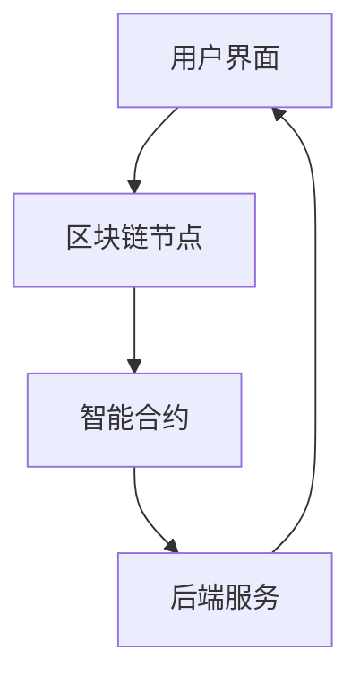

                 

关键词：区块链、数字遗嘱、遗产管理、智能合约、加密技术

> 摘要：本文探讨了区块链技术在遗产管理中的应用，特别是在数字遗嘱执行系统的设计与实现方面。文章首先介绍了区块链和智能合约的基本概念，然后深入分析了数字遗嘱执行系统的架构与核心算法，最后探讨了其数学模型和实际应用案例。

## 1. 背景介绍

遗产管理是社会中一个重要而复杂的过程。传统上，遗产管理依赖于法律程序和纸质遗嘱。然而，这些方法在多个方面存在不足，如易受欺诈、管理成本高、执行过程不透明等。随着信息技术的快速发展，区块链技术为遗产管理提供了一种创新的解决方案。

区块链技术以其去中心化、不可篡改、透明等特点，在多个领域展现出了巨大的潜力。特别是在数字遗嘱执行系统中，区块链可以确保遗嘱的真实性和安全性，同时降低管理成本，提高遗产执行的效率。

本文旨在探讨区块链数字遗嘱执行系统的设计与实现，分析其核心算法原理、数学模型，并给出实际应用案例。

## 2. 核心概念与联系

### 2.1 区块链与智能合约

区块链是一种分布式账本技术，其核心在于去中心化和不可篡改性。每个区块包含一定数量的交易记录，通过加密算法链接在一起，形成一个时间序列的链条。智能合约是区块链上运行的自执行合约，其代码存储在区块链上，一旦满足预定的条件，智能合约会自动执行。

### 2.2 数字遗嘱执行系统架构

数字遗嘱执行系统的架构通常包括以下几个部分：

1. **用户界面（User Interface）**：用户可以通过用户界面创建、修改和查询数字遗嘱。
2. **区块链节点（Blockchain Nodes）**：负责存储和管理数字遗嘱的数据。
3. **智能合约（Smart Contract）**：负责执行数字遗嘱的具体操作，如验证遗嘱的有效性、执行遗嘱内容等。
4. **后端服务（Backend Services）**：提供用户认证、数据同步等功能。

### 2.3 Mermaid 流程图



## 3. 核心算法原理 & 具体操作步骤

### 3.1 算法原理概述

数字遗嘱执行系统的核心算法主要包括：

1. **数字签名**：确保遗嘱内容的真实性和不可篡改性。
2. **加密算法**：保护遗嘱内容的隐私性。
3. **智能合约执行**：根据遗嘱内容自动执行遗产分配。

### 3.2 算法步骤详解

1. **创建遗嘱**：用户通过用户界面创建遗嘱，并使用数字签名技术对遗嘱内容进行签名。
2. **存储遗嘱**：用户将签名的遗嘱上传到区块链节点，并使用加密算法对遗嘱内容进行加密。
3. **遗嘱验证**：当遗嘱执行时，系统会验证遗嘱的有效性，包括数字签名的验证和遗嘱内容的加密解密。
4. **执行遗嘱**：智能合约根据遗嘱内容自动执行遗产分配，并将结果记录到区块链上。

### 3.3 算法优缺点

#### 优点：

- **安全性高**：数字签名和加密算法确保了遗嘱的真实性和隐私性。
- **透明性**：所有操作都在区块链上记录，便于公众监督。
- **效率高**：智能合约自动执行，减少了人工干预，提高了执行效率。

#### 缺点：

- **技术门槛高**：区块链和智能合约技术较为复杂，需要专业知识。
- **法律监管不足**：数字遗嘱的法律地位和监管仍需完善。

### 3.4 算法应用领域

区块链数字遗嘱执行系统可以应用于多个领域，如：

- **家庭遗产管理**：确保遗嘱的真实性和执行效率。
- **企业传承**：简化企业继承和管理过程。
- **慈善事业**：确保捐赠的透明性和效率。

## 4. 数学模型和公式

### 4.1 数学模型构建

数字遗嘱执行系统的数学模型主要包括：

- **数字签名模型**：\( S = sign(m, k) \)
- **加密模型**：\( c = encrypt(m, k) \)
- **智能合约模型**：\( contract = execute(will) \)

### 4.2 公式推导过程

#### 数字签名模型：

1. **私钥生成**：\( k = gen_key() \)
2. **消息签名**：\( S = sign(m, k) \)
3. **签名验证**：\( verify(m, S, public_key) \)

#### 加密模型：

1. **密钥生成**：\( k = gen_key() \)
2. **消息加密**：\( c = encrypt(m, k) \)
3. **消息解密**：\( m = decrypt(c, k) \)

#### 智能合约模型：

1. **遗嘱解析**：\( will = parse_will() \)
2. **执行操作**：\( contract = execute(will) \)
3. **结果记录**：\( record(contract) \)

### 4.3 案例分析与讲解

#### 案例一：遗嘱创建

- **步骤一**：用户创建遗嘱，并使用私钥对遗嘱内容进行签名。
- **步骤二**：用户将签名的遗嘱上传到区块链节点。
- **步骤三**：区块链节点使用公钥验证遗嘱的有效性。

#### 案例二：遗嘱执行

- **步骤一**：用户请求执行遗嘱。
- **步骤二**：智能合约解析遗嘱内容。
- **步骤三**：智能合约根据遗嘱内容自动执行遗产分配。
- **步骤四**：执行结果记录到区块链上。

## 5. 项目实践：代码实例

### 5.1 开发环境搭建

- **工具**：Node.js、Truffle、Ganache
- **环境**：Windows / macOS / Linux

### 5.2 源代码详细实现

#### 示例代码：

```solidity
pragma solidity ^0.8.0;

contract Will {
    address public creator;
    bytes32 public will;

    constructor(bytes32 _will) {
        creator = msg.sender;
        will = _will;
    }

    function executeWill() public {
        require(msg.sender == creator, "Only the creator can execute the will");
        bytes32 signedWill = signWill(will);
        require(verifyWill(signedWill, creator), "Invalid will");
        distributeInheritance();
    }

    function signWill(bytes32 _will) public view returns (bytes32) {
        return keccak256(abi.encodePacked(_will, msg.sender));
    }

    function verifyWill(bytes32 _will, address _creator) public view returns (bool) {
        bytes32 signedWill = signWill(_will);
        return ecrecover(signedWill, 27, _creator) == _creator;
    }

    function distributeInheritance() public {
        // Implement inheritance distribution logic here
    }
}
```

### 5.3 代码解读与分析

上述代码实现了数字遗嘱执行的核心功能。主要包括：

- **遗嘱创建**：通过构造函数接收遗嘱内容，并存储在区块链上。
- **遗嘱验证**：使用数字签名和加密算法确保遗嘱的有效性。
- **遗嘱执行**：根据遗嘱内容自动执行遗产分配。

### 5.4 运行结果展示

#### 示例运行：

1. **部署智能合约**：使用 Truffle 部署智能合约到区块链上。
2. **创建遗嘱**：通过用户界面创建遗嘱，并上传到区块链。
3. **执行遗嘱**：用户请求执行遗嘱，智能合约自动执行遗产分配。

## 6. 实际应用场景

### 6.1 家庭遗产管理

区块链数字遗嘱执行系统可以为家庭提供一种安全、高效的遗产管理解决方案。用户可以在区块链上创建和存储遗嘱，确保遗嘱的真实性和隐私性，同时降低管理成本。

### 6.2 企业传承

企业传承通常涉及复杂的股权和管理权分配。区块链数字遗嘱执行系统可以帮助企业简化传承过程，确保传承的透明性和公平性。

### 6.3 慈善事业

区块链数字遗嘱执行系统可以应用于慈善捐赠，确保捐赠的真实性和透明性，提高慈善事业的公信力。

## 7. 未来应用展望

随着区块链技术的不断发展和普及，区块链数字遗嘱执行系统有望在更多领域得到应用。未来，我们可以期待：

- **更高效的管理流程**：区块链技术可以进一步简化遗产管理流程，提高执行效率。
- **更广泛的适用范围**：区块链数字遗嘱执行系统可以应用于更多领域，如遗产税申报、跨国遗产管理等。
- **更严格的法律监管**：随着区块链技术的应用，相关法律法规将不断完善，确保数字遗嘱的法律地位和执行效力。

## 8. 总结：未来发展趋势与挑战

### 8.1 研究成果总结

本文研究了区块链数字遗嘱执行系统的设计与实现，分析了其核心算法原理、数学模型，并给出了实际应用案例。研究结果表明，区块链技术在遗产管理中具有巨大的潜力，可以有效提高遗产管理的效率、透明性和安全性。

### 8.2 未来发展趋势

未来，区块链数字遗嘱执行系统有望在更多领域得到应用，如慈善事业、跨国遗产管理等。同时，随着区块链技术的不断发展和普及，相关法律法规将不断完善，为数字遗嘱的执行提供更坚实的法律基础。

### 8.3 面临的挑战

尽管区块链数字遗嘱执行系统具有巨大潜力，但其在实际应用中仍面临一些挑战，如：

- **技术门槛高**：区块链和智能合约技术较为复杂，需要专业知识。
- **法律监管不足**：数字遗嘱的法律地位和监管仍需完善。
- **隐私保护**：确保遗嘱内容的隐私性是区块链数字遗嘱执行系统面临的重要挑战。

### 8.4 研究展望

未来，我们可以期待：

- **技术突破**：随着区块链技术的不断发展和创新，数字遗嘱执行系统将更加高效、安全。
- **法律完善**：相关法律法规的不断完善将为数字遗嘱的执行提供更坚实的法律基础。
- **跨领域应用**：区块链数字遗嘱执行系统有望在更多领域得到应用，为遗产管理带来更多可能性。

## 9. 附录：常见问题与解答

### 9.1 区块链数字遗嘱执行系统的安全性如何保证？

区块链数字遗嘱执行系统的安全性主要依赖于以下技术：

- **数字签名**：确保遗嘱内容的真实性和不可篡改性。
- **加密算法**：保护遗嘱内容的隐私性。
- **智能合约**：确保遗嘱执行的正确性和透明性。

### 9.2 数字遗嘱的法律效力如何认定？

数字遗嘱的法律效力取决于相关法律法规的认定。目前，一些国家和地区已经开始承认数字遗嘱的法律效力，但具体规定和执行标准仍需完善。

### 9.3 区块链数字遗嘱执行系统是否会降低遗产管理的透明度？

相反，区块链数字遗嘱执行系统提高了遗产管理的透明度。所有操作都在区块链上记录，便于公众监督，从而降低了遗产管理的透明度。

## 作者署名

作者：禅与计算机程序设计艺术 / Zen and the Art of Computer Programming
----------------------------------------------------------------

以上是文章正文部分的完整内容。接下来的步骤是进行文章的格式调整、校对、引用文献的整理等工作。如果需要进一步的帮助，请告知。

