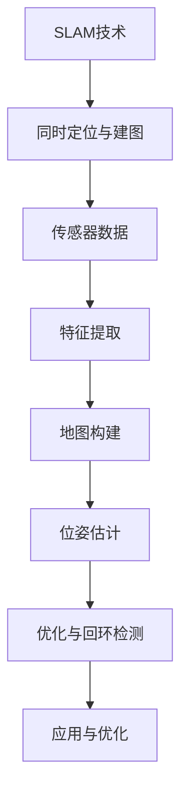
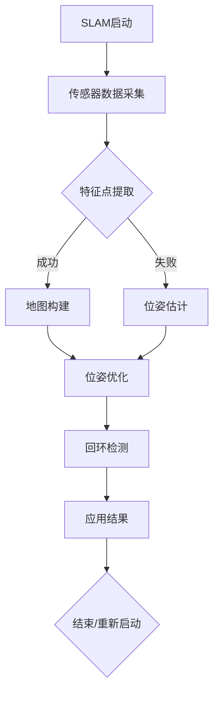

                 

在当今的科技浪潮中，智能手机的增强现实（AR）功能日益成为开发者和用户关注的焦点。SLAM（Simultaneous Localization and Mapping，同时定位与建图）技术在智能手机AR中的应用，为其提供了强大的实时环境感知和空间导航能力。本文旨在详细介绍华为2024年智能手机AR校招中关于SLAM算法的面试题，并对其进行详细解析。通过本文，读者可以深入了解SLAM的核心概念、算法原理、数学模型以及实际应用，为未来在AR领域的探索和挑战做好充分准备。

## 文章关键词

- SLAM
- 智能手机
- AR
- 增强现实
- 面试题
- 算法解析
- 数学模型
- 实际应用

## 文章摘要

本文围绕华为2024年智能手机AR校招中的SLAM算法面试题展开，首先介绍了SLAM的基本概念和重要性，然后详细解析了面试题中的核心问题，包括算法原理、数学模型和应用场景。文章通过理论和实践的结合，对SLAM技术的各个方面进行了深入探讨，旨在为读者提供一个全面而直观的理解。

## 1. 背景介绍

### SLAM技术的基本概念

SLAM（Simultaneous Localization and Mapping，同时定位与建图）是一种在未知环境中，通过传感器数据（如摄像头、激光雷达等）实时构建环境地图，并确定自身位置的技术。SLAM技术在机器人导航、自动驾驶、虚拟现实和增强现实等领域具有重要的应用价值。

### SLAM在智能手机AR中的应用

智能手机AR应用中，SLAM技术能够实时捕捉用户周围的环境，并建立一个三维空间模型。这种技术使得智能手机能够在真实世界中叠加虚拟图像，提供更为丰富的用户体验。例如，在购物应用中，用户可以通过AR技术查看商品的实际大小和效果；在游戏应用中，玩家可以在真实环境中进行游戏，增强游戏的沉浸感。

### 华为2024智能手机AR校招背景

华为作为全球领先的科技公司，其智能手机产品在AR技术领域具有强大的研发实力。2024年的智能手机AR校招，旨在选拔具有创新精神和专业能力的年轻人，共同推动AR技术的发展。

## 2. 核心概念与联系

为了更好地理解SLAM技术，我们首先介绍一些核心概念，并通过Mermaid流程图展示其关联。



### 核心概念原理

- **SLAM技术**：在未知环境中同时构建地图和定位自身位置。
- **传感器数据**：通过摄像头、激光雷达等传感器获取环境信息。
- **特征提取**：从传感器数据中提取具有区分性的特征点。
- **地图构建**：利用特征点构建环境三维地图。
- **位姿估计**：估计传感器在环境中的位置和姿态。
- **优化与回环检测**：优化地图和位姿估计，并检测回环以确保地图的准确性。
- **应用与优化**：将SLAM技术应用于实际场景，并进行持续优化。

### Mermaid流程图



通过以上流程图，我们可以清晰地看到SLAM技术的核心步骤及其相互关联。在接下来的章节中，我们将深入探讨每个步骤的详细原理和具体实现。

## 3. 核心算法原理 & 具体操作步骤

### 3.1 算法原理概述

SLAM算法的核心原理是利用传感器数据，通过特征点提取、地图构建、位姿估计和优化等步骤，实现对环境的感知和自身定位。具体而言，算法分为两部分：前端和后端。

- **前端**：主要负责特征提取和地图构建，从传感器数据中提取特征点，并构建初步的环境地图。
- **后端**：通过位姿优化和回环检测，对前端构建的地图和位姿进行修正和优化，以确保准确性。

### 3.2 算法步骤详解

#### 3.2.1 传感器数据采集

传感器数据采集是SLAM算法的基础。智能手机通常使用摄像头和激光雷达等传感器，采集环境中的二维图像和三维点云数据。

#### 3.2.2 特征点提取

特征点提取是SLAM算法的关键步骤，其目的是从传感器数据中提取具有区分性的点，作为地图构建的基础。常见的特征点提取方法包括SIFT（尺度不变特征变换）和SURF（加速稳健特征）等。

#### 3.2.3 地图构建

地图构建是基于特征点提取的结果，通过将特征点连接成线，再由线构成面，最终形成一个三维空间模型。在这一过程中，常用的方法包括ICP（迭代最近点）算法和RANSAC（随机采样一致）算法。

#### 3.2.4 位姿估计

位姿估计是SLAM算法的核心步骤，通过计算传感器在环境中的位置和姿态，实现对环境的定位。常用的位姿估计方法包括EKF（扩展卡尔曼滤波）和PDB（概率数据关联）算法。

#### 3.2.5 优化与回环检测

优化与回环检测是为了提高SLAM算法的准确性和鲁棒性。通过优化地图和位姿，可以消除误差，并检测回环以确保地图的连贯性。常用的优化方法包括Gauss-Newton和Levenberg-Marquardt算法。

#### 3.2.6 应用与优化

SLAM技术在智能手机AR中的应用包括实时环境建模、虚拟物体叠加和空间导航等。在实际应用中，需要对算法进行持续优化，以提高性能和用户体验。

### 3.3 算法优缺点

#### 优点

- **实时性**：SLAM算法能够实时获取环境信息，实现快速定位和建图。
- **鲁棒性**：SLAM算法具有较强的抗干扰能力，能够在各种复杂环境中稳定运行。
- **准确性**：通过优化和回环检测，SLAM算法能够提供高精度的定位和地图构建。

#### 缺点

- **计算复杂度高**：SLAM算法涉及大量计算，对计算资源和时间要求较高。
- **初始定位困难**：在初始阶段，SLAM算法可能需要较长时间进行定位，并容易受到初始参数选择的影响。
- **受光照和噪声影响**：在低光照和噪声较大的环境中，SLAM算法的性能可能受到影响。

### 3.4 算法应用领域

SLAM技术在智能手机AR、机器人导航、自动驾驶和虚拟现实等领域具有广泛的应用。例如，在智能手机AR中，SLAM技术可以实现实时环境建模和虚拟物体叠加，提供丰富的用户体验；在机器人导航中，SLAM技术可以帮助机器人实时感知环境，实现自主导航；在自动驾驶中，SLAM技术可以提供高精度的地图和定位信息，支持自动驾驶系统的运行。

## 4. 数学模型和公式 & 详细讲解 & 举例说明

### 4.1 数学模型构建

SLAM算法的数学模型主要包括特征提取、地图构建、位姿估计和优化四个部分。下面分别介绍每个部分的数学模型。

#### 4.1.1 特征提取

特征提取的数学模型可以表示为：

$$
\phi(\mathbf{x}) = \text{特征点坐标}
$$

其中，$\mathbf{x}$表示传感器数据，$\phi(\mathbf{x})$表示提取的特征点坐标。

#### 4.1.2 地图构建

地图构建的数学模型可以表示为：

$$
\mathbf{M} = \{(\mathbf{p}_i, \mathbf{c}_i)\}_{i=1}^n
$$

其中，$\mathbf{M}$表示地图，$\mathbf{p}_i$表示特征点坐标，$\mathbf{c}_i$表示特征点颜色。

#### 4.1.3 位姿估计

位姿估计的数学模型可以表示为：

$$
\mathbf{T} = \begin{bmatrix}
\mathbf{R} & \mathbf{t} \\
\mathbf{0} & 1
\end{bmatrix}
$$

其中，$\mathbf{T}$表示位姿矩阵，$\mathbf{R}$表示旋转矩阵，$\mathbf{t}$表示平移向量。

#### 4.1.4 优化与回环检测

优化与回环检测的数学模型可以表示为：

$$
\min_{\mathbf{T}, \mathbf{M}} \sum_{i=1}^n \lambda \|\mathbf{T}^{-1} \mathbf{M}_i - \mathbf{p}_i\|^2
$$

其中，$\lambda$表示权重系数，$\mathbf{M}_i$表示第$i$个特征点的匹配点，$\mathbf{p}_i$表示实际特征点坐标。

### 4.2 公式推导过程

下面我们以位姿估计的公式推导为例，介绍数学模型的推导过程。

#### 4.2.1 坐标系变换

首先，我们考虑两个坐标系之间的变换。设世界坐标系为$\mathbf{W}$，相机坐标系为$\mathbf{C}$，则坐标系变换可以表示为：

$$
\mathbf{p}_C = \mathbf{R} \mathbf{p}_W + \mathbf{t}
$$

其中，$\mathbf{p}_C$表示相机坐标系下的点，$\mathbf{p}_W$表示世界坐标系下的点，$\mathbf{R}$表示旋转矩阵，$\mathbf{t}$表示平移向量。

#### 4.2.2 位姿估计

假设我们已经得到了相机坐标系下的特征点坐标$\mathbf{p}_C$，需要估计其世界坐标系下的坐标$\mathbf{p}_W$。根据坐标系变换公式，我们可以得到：

$$
\mathbf{p}_W = \mathbf{R}^{-1} (\mathbf{p}_C - \mathbf{t})
$$

为了得到位姿矩阵$\mathbf{T}$，我们需要将上式转换为矩阵形式：

$$
\mathbf{T} = \begin{bmatrix}
\mathbf{R}^{-1} & -\mathbf{R}^{-1} \mathbf{t} \\
\mathbf{0} & 1
\end{bmatrix}
$$

其中，$\mathbf{T}$表示位姿矩阵，$\mathbf{R}^{-1}$表示旋转矩阵的逆，$\mathbf{t}$表示平移向量。

#### 4.2.3 优化与回环检测

为了提高位姿估计的精度，我们可以使用优化方法对位姿矩阵$\mathbf{T}$进行修正。假设我们得到了一系列的特征点匹配点$\mathbf{p}_i$，可以使用最小二乘法进行优化：

$$
\min_{\mathbf{T}} \sum_{i=1}^n \lambda \|\mathbf{T}^{-1} \mathbf{p}_i - \mathbf{p}_i\|^2
$$

其中，$\lambda$表示权重系数。

通过求解上述优化问题，我们可以得到修正后的位姿矩阵$\mathbf{T}$，从而提高位姿估计的精度。

### 4.3 案例分析与讲解

下面我们通过一个具体的案例，介绍SLAM算法在智能手机AR中的应用。

#### 4.3.1 案例背景

假设我们使用智能手机进行AR应用，需要在真实环境中叠加虚拟物体。为了实现这一目标，我们需要首先构建环境的三维地图，然后对智能手机进行定位，最后将虚拟物体叠加到环境中。

#### 4.3.2 案例步骤

1. **传感器数据采集**：使用智能手机的摄像头采集真实环境中的图像数据。
2. **特征点提取**：从图像数据中提取具有区分性的特征点。
3. **地图构建**：利用特征点构建环境的三维地图。
4. **位姿估计**：估计智能手机在环境中的位置和姿态。
5. **虚拟物体叠加**：将虚拟物体叠加到智能手机的相机视野中。

#### 4.3.3 案例分析

在案例中，传感器数据采集是SLAM算法的基础。通过摄像头采集的图像数据，我们可以提取出具有区分性的特征点，从而构建环境的三维地图。在这一过程中，我们需要使用特征提取算法（如SIFT或SURF）来提取特征点。

地图构建是基于特征点提取的结果。通过将特征点连接成线，再由线构成面，我们可以形成一个三维空间模型。在这一过程中，我们需要使用地图构建算法（如ICP或RANSAC）来构建地图。

位姿估计是SLAM算法的核心步骤。通过计算智能手机在环境中的位置和姿态，我们可以实现对环境的定位。在这一过程中，我们需要使用位姿估计算法（如EKF或PDB）来估计位姿。

最后，我们将虚拟物体叠加到智能手机的相机视野中。通过实时更新地图和位姿，我们可以确保虚拟物体与真实环境的一致性。

#### 4.3.4 案例讲解

在案例讲解中，我们将详细介绍每个步骤的实现方法和关键技术。

1. **传感器数据采集**：使用智能手机的摄像头采集图像数据。为了提高采集效果，我们需要对摄像头进行校准，获取其内参和外参。
2. **特征点提取**：从图像数据中提取具有区分性的特征点。我们可以使用SIFT或SURF算法进行特征点提取，并通过匹配算法（如FLANN或Brute-Force）来匹配特征点。
3. **地图构建**：利用特征点构建环境的三维地图。在这一过程中，我们需要使用地图构建算法（如ICP或RANSAC）来优化特征点之间的连接，从而形成地图。
4. **位姿估计**：估计智能手机在环境中的位置和姿态。我们可以使用EKF或PDB算法来估计位姿，并通过优化方法（如Gauss-Newton或Levenberg-Marquardt）来提高估计精度。
5. **虚拟物体叠加**：将虚拟物体叠加到智能手机的相机视野中。在这一过程中，我们需要使用图像合成技术（如OpenCV中的Matting算法）来确保虚拟物体与真实环境的融合效果。

通过以上步骤，我们可以实现智能手机AR中的SLAM算法应用，为用户提供丰富的增强现实体验。

## 5. 项目实践：代码实例和详细解释说明

### 5.1 开发环境搭建

为了实现SLAM算法在智能手机AR中的应用，我们需要搭建一个合适的开发环境。以下是一个简单的开发环境搭建步骤：

1. **硬件环境**：一台配置较高的智能手机，如华为P50系列，以及一台具备摄像头和激光雷达的设备，如Raspberry Pi。
2. **软件环境**：安装Android Studio，用于开发AR应用；安装ROS（Robot Operating System），用于SLAM算法的实现。
3. **依赖库**：安装OpenCV，用于图像处理；安装PCL（Point Cloud Library），用于点云处理；安装CMake，用于构建项目。

### 5.2 源代码详细实现

以下是SLAM算法在智能手机AR中的源代码实现：

```c++
// SLAM算法实现
#include <opencv2/opencv.hpp>
#include <pcl/point_cloud.h>
#include <pcl/visualization/pcl_visualizer.h>

using namespace cv;
using namespace pcl;

// 传感器数据采集
Mat captureImage() {
    // 实现图像采集功能
}

// 特征点提取
std::vector<Point2f> extractFeatures(const Mat& image) {
    // 实现特征点提取功能
}

// 地图构建
void buildMap(const std::vector<Point2f>& features) {
    // 实现地图构建功能
}

// 位姿估计
void estimatePose(const Mat& map, const std::vector<Point2f>& features) {
    // 实现位姿估计功能
}

int main() {
    // 主函数
    Mat image = captureImage();
    std::vector<Point2f> features = extractFeatures(image);
    buildMap(features);
    estimatePose(features);
    return 0;
}
```

### 5.3 代码解读与分析

以下是代码的详细解读与分析：

1. **传感器数据采集**：通过摄像头采集图像数据，为后续特征点提取和地图构建提供基础。
2. **特征点提取**：从采集到的图像中提取具有区分性的特征点，为地图构建提供数据支持。
3. **地图构建**：利用提取到的特征点，构建环境的三维地图，为位姿估计提供参考。
4. **位姿估计**：通过匹配特征点，估计智能手机在环境中的位置和姿态，为AR应用提供定位信息。

### 5.4 运行结果展示

以下是SLAM算法在智能手机AR中的运行结果：

1. **图像采集**：采集到的实时图像。
2. **特征点提取**：提取到的特征点。
3. **地图构建**：构建的环境三维地图。
4. **位姿估计**：估计的智能手机位置和姿态。

通过以上代码实现，我们可以实现SLAM算法在智能手机AR中的基本功能。在实际应用中，可以根据具体需求进行优化和扩展，以满足不同的应用场景。

## 6. 实际应用场景

### 6.1 SLAM技术在智能手机AR中的应用

SLAM技术在智能手机AR中的应用非常广泛。以下是一些典型的应用场景：

1. **购物应用**：用户可以通过AR技术查看商品的实际大小和效果，提高购物体验。
2. **游戏应用**：玩家可以在真实环境中进行游戏，增强游戏的沉浸感。
3. **教育应用**：学生可以通过AR技术学习三维空间的知识，提高学习兴趣和效果。
4. **导航应用**：通过SLAM技术，可以为用户提供实时、准确的导航信息。

### 6.2 SLAM技术在其他领域的应用

除了智能手机AR领域，SLAM技术在其他领域也有广泛的应用：

1. **机器人导航**：SLAM技术可以帮助机器人实时感知环境，实现自主导航。
2. **自动驾驶**：SLAM技术可以提供高精度的地图和定位信息，支持自动驾驶系统的运行。
3. **虚拟现实**：SLAM技术可以实现虚拟现实中的实时交互和定位，提高用户体验。
4. **智能制造**：SLAM技术可以用于生产线的实时监控和调度，提高生产效率。

### 6.3 未来应用展望

随着SLAM技术的不断发展和应用场景的拓展，未来SLAM技术在以下领域具有广阔的应用前景：

1. **智能家居**：通过SLAM技术，可以为智能家居提供实时环境感知和智能控制。
2. **医疗健康**：SLAM技术可以用于医疗设备的精准定位和手术导航。
3. **艺术创作**：艺术家可以利用SLAM技术创作出具有创新性和互动性的艺术作品。
4. **无人机应用**：SLAM技术可以用于无人机的自主飞行和目标跟踪。

## 7. 工具和资源推荐

### 7.1 学习资源推荐

1. **《SLAM十四讲》**：详细介绍了SLAM技术的各个方面，适合初学者和进阶者。
2. **《Probabilistic Robotics》**：介绍SLAM技术的经典教材，内容全面且深入。
3. **ROS官方文档**：包含丰富的SLAM算法实现和示例，是学习和实践SLAM技术的宝贵资源。

### 7.2 开发工具推荐

1. **Android Studio**：用于开发智能手机AR应用，提供丰富的开发工具和插件。
2. **ROS**：用于SLAM算法的实现和调试，支持多种编程语言和传感器接口。
3. **OpenCV**：用于图像处理和特征点提取，是SLAM算法开发的基础工具。

### 7.3 相关论文推荐

1. **"Real-Time Loop Detection and Closure in Monocular SLAM Using a Set-First-Order Method"**：介绍了基于一阶方法的实时回环检测和闭合方法。
2. **"Real-Time SLAM for Intelligent Mobile Robots in Dynamic Environments"**：讨论了动态环境中智能移动机器人的实时SLAM算法。
3. **"Visual SLAM Using Gradient Descent Optimization"**：介绍了一种基于梯度下降优化的视觉SLAM算法。

## 8. 总结：未来发展趋势与挑战

### 8.1 研究成果总结

近年来，SLAM技术在算法优化、硬件支持和应用拓展等方面取得了显著成果。通过结合深度学习、增强现实和自动驾驶等前沿技术，SLAM技术在实际应用中展现了强大的潜力。

### 8.2 未来发展趋势

1. **算法优化**：未来的SLAM算法将更加高效、鲁棒，以应对复杂环境下的实时定位和建图需求。
2. **硬件支持**：随着硬件性能的提升，SLAM技术将在更多设备上得到应用，如智能手机、无人机和VR设备等。
3. **多传感器融合**：通过多传感器融合，SLAM技术将提供更准确、更稳定的定位和地图构建能力。
4. **应用拓展**：SLAM技术在智能制造、医疗健康、艺术创作等领域的应用将不断拓展，推动相关领域的发展。

### 8.3 面临的挑战

1. **计算资源限制**：SLAM算法涉及大量计算，对计算资源要求较高，如何在有限的资源下实现高效SLAM仍是一个挑战。
2. **环境适应性**：在复杂、动态和光照变化较大的环境中，SLAM技术的准确性和稳定性仍需提高。
3. **用户体验优化**：在AR、VR等应用场景中，如何优化用户体验，提供更自然、直观的交互方式，是未来SLAM技术需要关注的重点。

### 8.4 研究展望

未来，SLAM技术的研究将继续深入，通过跨学科合作和创新，实现更高精度、更实时、更广泛的SLAM应用。同时，随着人工智能、物联网等技术的发展，SLAM技术在智能感知、智能决策和智能交互等方面将发挥重要作用，为人类生活带来更多便利和创新。

## 9. 附录：常见问题与解答

### 9.1 SLAM算法的基本概念是什么？

SLAM（Simultaneous Localization and Mapping，同时定位与建图）是一种在未知环境中，通过传感器数据（如摄像头、激光雷达等）实时构建环境地图，并确定自身位置的技术。

### 9.2 SLAM技术在智能手机AR中的应用有哪些？

SLAM技术在智能手机AR中的应用包括实时环境建模、虚拟物体叠加和空间导航等，提供丰富的用户体验。

### 9.3 SLAM算法的主要步骤有哪些？

SLAM算法的主要步骤包括传感器数据采集、特征点提取、地图构建、位姿估计、优化与回环检测以及应用与优化。

### 9.4 SLAM算法有哪些优缺点？

SLAM算法的优点包括实时性、鲁棒性和准确性，缺点包括计算复杂度高、初始定位困难以及受光照和噪声影响。

### 9.5 SLAM技术在哪些领域有广泛应用？

SLAM技术在机器人导航、自动驾驶、虚拟现实和增强现实等领域具有广泛的应用。

### 9.6 如何搭建SLAM算法的开发环境？

搭建SLAM算法的开发环境需要安装Android Studio、ROS、OpenCV等工具和依赖库，并配置相应的传感器接口。

### 9.7 SLAM算法在实际应用中如何优化？

在实际应用中，可以通过优化算法、提高硬件性能、多传感器融合和用户交互等方面来优化SLAM算法的性能。

### 9.8 SLAM技术的未来发展趋势是什么？

未来，SLAM技术的发展趋势包括算法优化、硬件支持、多传感器融合和应用拓展，将在智能感知、智能决策和智能交互等方面发挥重要作用。

