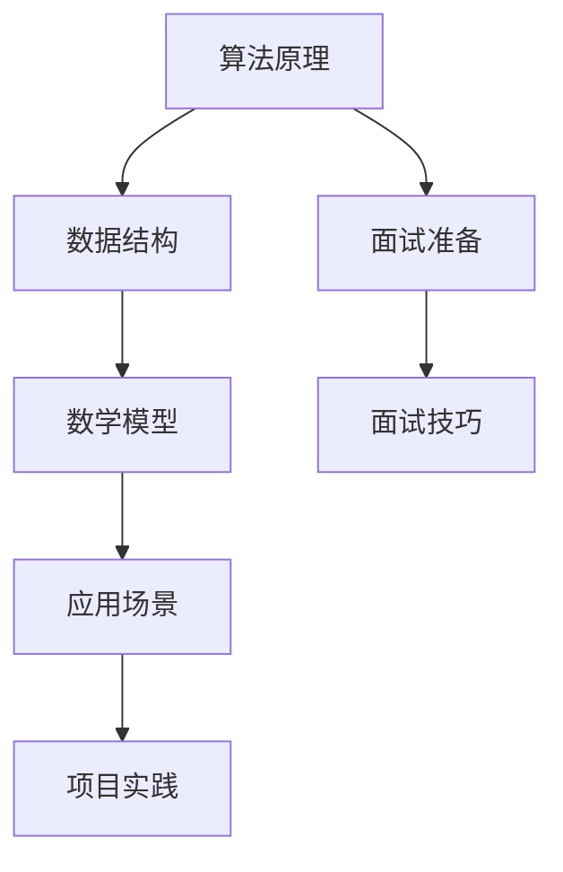

                 

关键词：编程面试、华为社招、面试题总结、技术挑战、面试准备

> 摘要：本文旨在为参加华为2024社招编程面试的考生提供一份详尽的面试题总结。通过对历年面试题的分析，本文将提炼出核心算法原理、数学模型、应用场景以及项目实践，帮助考生更好地应对面试挑战，提升面试成功率。

## 1. 背景介绍

华为，作为中国领先的信息与通信技术（ICT）解决方案提供商，以其强大的研发能力和全球市场影响力，成为众多IT从业者的梦想雇主。每年的社会招聘（社招）吸引了大量优秀人才的关注，而华为的编程面试更是以高难度、全面性著称。因此，准备华为社招编程面试成为每一个求职者的必修课。

本文将通过分析华为2024社招编程面试的题目，从核心算法原理、数学模型、应用场景和项目实践等方面进行深入探讨，帮助读者全面了解面试要求，提高面试通过率。

## 2. 核心概念与联系

为了更好地理解面试题目，我们需要掌握一些核心概念和原理。以下是一个用Mermaid绘制的流程图，展示了这些核心概念及其相互联系。



### 2.1 算法原理概述

算法是计算机科学的核心，它定义了解决问题的步骤和方法。在华为的编程面试中，常见的算法原理包括排序、查找、图论、动态规划等。

- **排序算法**：常见的排序算法有快速排序、归并排序、堆排序等。
- **查找算法**：包括二分查找、哈希查找等。
- **图论算法**：如最短路径算法（Dijkstra算法、Floyd算法）、最小生成树算法（Prim算法、Kruskal算法）等。
- **动态规划**：用于解决最优化问题，如背包问题、最长公共子序列等。

### 2.2 数据结构

数据结构是算法实现的基础。华为的面试题中经常涉及到数组、链表、栈、队列、树、图等数据结构。

- **数组**：固定大小的线性表。
- **链表**：动态大小的线性表，分为单向链表、双向链表和循环链表。
- **栈**：后进先出（LIFO）的数据结构。
- **队列**：先进先出（FIFO）的数据结构。
- **树**：由节点和边组成的层次结构，如二叉树、堆等。
- **图**：由节点和边组成的网络结构，如无向图、有向图等。

### 2.3 数学模型

数学模型是计算机科学中的另一个重要概念，它将现实世界的问题转化为数学问题，通过数学方法求解。

- **线性模型**：如线性方程组、线性规划等。
- **概率模型**：如条件概率、贝叶斯定理等。
- **组合模型**：如组合数、排列数等。
- **计算几何**：如点线距离、多边形面积等。

### 2.4 应用场景

算法、数据结构和数学模型的应用场景非常广泛，从操作系统到数据库，从网络到人工智能，无处不在。

- **操作系统**：进程调度、内存管理、文件系统等。
- **数据库**：索引、查询优化、事务处理等。
- **网络**：路由算法、拥塞控制、网络安全等。
- **人工智能**：机器学习、深度学习、自然语言处理等。

### 2.5 面试准备

面试准备是成功面试的关键。除了掌握核心概念和技能，还需要了解以下几点：

- **基础知识**：扎实的基础知识是面试成功的基础。
- **编程能力**：熟练掌握至少一门编程语言，如C/C++、Java、Python等。
- **算法实现**：能够熟练地手写算法，并理解其时间复杂度和空间复杂度。
- **面试技巧**：包括自我介绍、问题回答、沟通表达等。

## 3. 核心算法原理 & 具体操作步骤

### 3.1 算法原理概述

在本节中，我们将介绍几种在华为编程面试中常见的重要算法原理，并简要解释它们的工作原理。

#### 3.1.1 快速排序

快速排序（Quick Sort）是一种高效的排序算法，其基本思想是通过一趟排序将待排序的记录分割成独立的两部分，其中一部分记录的关键字均比另一部分的关键字小，则可分别对这两部分记录进行递归排序，以达到整个序列有序。

**工作原理**：
1. 选择基准元素。
2. 将序列中小于基准的元素移到基准的左边，大于基准的元素移到基准的右边。
3. 对左右子序列递归执行上述步骤。

#### 3.1.2 动态规划

动态规划（Dynamic Programming，DP）是一种用于解决最优化问题的算法策略。它通过将问题分解为更小的子问题，并存储子问题的解以避免重复计算，从而实现最优解。

**基本原理**：
1. **重叠子问题**：问题的最优解包含其子问题的最优解。
2. **最优子结构**：问题的最优解结构包含其子问题的最优解结构。
3. **状态转移方程**：通过子问题的解推导出原问题的解。

#### 3.1.3 网络流

网络流问题是一种在给定网络结构下，找到一种流量分配方案，使总流量最大或满足某些约束条件的算法问题。常见的网络流算法包括最大流-最小割定理和Ford-Fulkerson算法。

**基本原理**：
1. **最大流-最小割定理**：在一个网络中，最大流的值等于最小割的容量。
2. **Ford-Fulkerson算法**：通过寻找增广路径来逐步增加流量的方法。

### 3.2 算法步骤详解

#### 3.2.1 快速排序

**具体步骤**：

1. **选择基准**：从序列中选择一个元素作为基准。
2. **分区**：将序列分为两部分，小于基准的元素放在左边，大于基准的元素放在右边。
3. **递归排序**：对左右两部分递归执行快速排序。

**示例代码**（Python）：

```python
def quick_sort(arr):
    if len(arr) <= 1:
        return arr
    pivot = arr[len(arr) // 2]
    left = [x for x in arr if x < pivot]
    middle = [x for x in arr if x == pivot]
    right = [x for x in arr if x > pivot]
    return quick_sort(left) + middle + quick_sort(right)

arr = [3, 6, 8, 10, 1, 2, 1]
sorted_arr = quick_sort(arr)
print(sorted_arr)
```

#### 3.2.2 动态规划

**具体步骤**：

1. **定义状态**：根据问题定义状态，如Fibonacci数列中的`f(n)`。
2. **状态转移方程**：根据状态定义递推关系，如Fibonacci数列中的`f(n) = f(n-1) + f(n-2)`。
3. **初始化边界条件**：根据问题初始化基础状态，如Fibonacci数列中的`f(0) = 0, f(1) = 1`。
4. **计算状态**：根据状态转移方程和初始化条件，计算出所有状态。
5. **求解最优解**：根据状态求解出最终的最优解。

**示例代码**（Python）：

```python
def dp_fibonacci(n):
    if n <= 1:
        return n
    fib = [0] * (n + 1)
    fib[1] = 1
    for i in range(2, n + 1):
        fib[i] = fib[i - 1] + fib[i - 2]
    return fib[n]

n = 10
result = dp_fibonacci(n)
print(result)
```

#### 3.2.3 网络流

**具体步骤**：

1. **初始化流量**：设置所有边的初始流量为0。
2. **寻找增广路径**：使用Ford-Fulkerson算法寻找从源点到汇点的增广路径。
3. **更新流量**：沿增广路径更新流量，直到无法找到增广路径。
4. **计算最大流**：最大流的值即为源点到汇点的流量。

**示例代码**（Python）：

```python
from collections import defaultdict

def bfs(graph, source, sink):
    visited = [False] * len(graph)
    parent = [-1] * len(graph)
    queue = [source]
    visited[source] = True

    while queue:
        u = queue.pop(0)
        for v, capacity in graph[u].items():
            if not visited[v] and capacity > 0:
                queue.append(v)
                visited[v] = True
                parent[v] = u
                if v == sink:
                    return True

    return False

def max_flow(graph, source, sink):
    flow = 0
    while bfs(graph, source, sink):
        path_flow = float('Inf')
        s = sink
        while s != source:
            path_flow = min(path_flow, graph[parent[s]][s])
            s = parent[s]

        flow += path_flow
        v = sink
        while v != source:
            u = parent[v]
            graph[u][v] -= path_flow
            graph[v][u] += path_flow
            v = parent[v]

    return flow

graph = {
    0: {1: 16, 2: 13},
    1: {0: 10, 2: 12, 3: 4},
    2: {0: 2, 1: 8, 3: 9, 4: 14},
    3: {1: 20},
    4: {2: 7, 3: 4}
}

source = 0
sink = 4
print(max_flow(graph, source, sink))
```

### 3.3 算法优缺点

#### 3.3.1 快速排序

**优点**：
- **时间复杂度**：平均情况下为O(nlogn)，最坏情况下为O(n^2)。
- **原地排序**：不需要额外的存储空间。

**缺点**：
- **最坏情况下性能较差**。
- **递归深度可能较深，导致栈溢出。

#### 3.3.2 动态规划

**优点**：
- **优化重叠子问题**，避免重复计算。
- **适用于最优化问题**。

**缺点**：
- **理解复杂**，尤其是状态转移方程的推导。
- **空间复杂度高**，需要存储大量的状态。

#### 3.3.3 网络流

**优点**：
- **解决最大流问题**，具有广泛的应用。
- **可扩展性强**。

**缺点**：
- **实现复杂**，需要处理多种情况。
- **时间复杂度高**，尤其在大型网络中。

### 3.4 算法应用领域

#### 3.4.1 快速排序

- **排序和搜索**：用于快速查找和排序。
- **分布式系统**：在分布式系统中用于数据分配和排序。

#### 3.4.2 动态规划

- **最优化问题**：如背包问题、旅行商问题等。
- **网络优化**：如路由优化、流量分配等。

#### 3.4.3 网络流

- **网络优化**：如流量控制、资源分配等。
- **社会网络分析**：如推荐系统、社交网络分析等。

## 4. 数学模型和公式 & 详细讲解 & 举例说明

数学模型是计算机科学中不可或缺的一部分，它可以帮助我们更好地理解和解决实际问题。在本节中，我们将介绍几种常用的数学模型和公式，并通过具体例子进行详细讲解。

### 4.1 数学模型构建

构建数学模型是解决实际问题的第一步。以下是构建数学模型的基本步骤：

1. **定义问题**：明确问题的目标和约束条件。
2. **抽象问题**：将实际问题抽象为数学问题。
3. **建立模型**：使用数学公式和符号表示问题。
4. **求解模型**：使用数学方法求解模型，得到问题的解。

### 4.2 公式推导过程

在本节中，我们将推导几个常用的数学公式。

#### 4.2.1 二分查找

二分查找是一种高效的查找算法，其基本思想是逐步缩小查找范围。

**公式推导**：

假设有一个有序数组`arr`，我们要查找元素`x`。

1. **初始范围**：设定查找范围`low = 0`，`high = len(arr) - 1`。
2. **循环条件**：当`low <= high`时继续查找。
3. **中间位置**：计算中间位置`mid = (low + high) // 2`。
4. **比较与调整**：
   - 如果`arr[mid] == x`，则找到元素，返回`mid`。
   - 如果`arr[mid] < x`，则将查找范围调整为`low = mid + 1`。
   - 如果`arr[mid] > x`，则将查找范围调整为`high = mid - 1`。

**示例代码**（Python）：

```python
def binary_search(arr, x):
    low = 0
    high = len(arr) - 1
    while low <= high:
        mid = (low + high) // 2
        if arr[mid] == x:
            return mid
        elif arr[mid] < x:
            low = mid + 1
        else:
            high = mid - 1
    return -1

arr = [1, 2, 3, 4, 5, 6, 7, 8, 9]
x = 5
result = binary_search(arr, x)
print(result)
```

#### 4.2.2 动态规划

动态规划是一种用于解决最优化问题的算法策略。以下是一个典型的动态规划问题：背包问题。

**公式推导**：

假设有一个容量为`C`的背包，和一组物品，每个物品有重量`w[i]`和价值`v[i]`。我们的目标是选择若干物品放入背包中，使得背包的总重量不超过`C`，并且总价值最大。

1. **定义状态**：定义状态`dp[i][j]`为前`i`个物品放入容量为`j`的背包中能获得的最大价值。
2. **状态转移方程**：
   - 如果`j >= w[i]`，则`dp[i][j] = max(dp[i - 1][j], dp[i - 1][j - w[i]] + v[i])`。
   - 如果`j < w[i]`，则`dp[i][j] = dp[i - 1][j]`。

3. **初始化**：`dp[0][j] = 0`，因为不放入任何物品的价值为0。

**示例代码**（Python）：

```python
def knapsack(W, weights, values, n):
    dp = [[0] * (W + 1) for _ in range(n + 1)]

    for i in range(1, n + 1):
        for j in range(1, W + 1):
            if j >= weights[i - 1]:
                dp[i][j] = max(dp[i - 1][j], dp[i - 1][j - weights[i - 1]] + values[i - 1])
            else:
                dp[i][j] = dp[i - 1][j]

    return dp[n][W]

W = 50
weights = [10, 20, 30]
values = [60, 100, 120]
n = 3
result = knapsack(W, weights, values, n)
print(result)
```

#### 4.2.3 计算几何

计算几何是计算机图形学、计算机辅助设计和计算机视觉等领域的重要基础。以下是一个典型的计算几何问题：两点间距离。

**公式推导**：

给定两个点`P1(x1, y1)`和`P2(x2, y2)`，两点间的距离可以用以下公式计算：

$$
d = \sqrt{(x2 - x1)^2 + (y2 - y1)^2}
$$

**示例代码**（Python）：

```python
import math

def distance(p1, p2):
    x1, y1 = p1
    x2, y2 = p2
    return math.sqrt((x2 - x1)**2 + (y2 - y1)**2)

p1 = (1, 2)
p2 = (4, 6)
result = distance(p1, p2)
print(result)
```

### 4.3 案例分析与讲解

在本节中，我们将通过几个实际案例来讲解数学模型和公式的应用。

#### 4.3.1 背包问题

假设有一个容量为50升的背包，需要放入3个物品，每个物品的重量和如下：

- 物品1：重量10千克，价值60元。
- 物品2：重量20千克，价值100元。
- 物品3：重量30千克，价值120元。

我们的目标是选择若干物品放入背包中，使得背包的总重量不超过50千克，并且总价值最大。

**解题步骤**：

1. **建立数学模型**：定义状态`dp[i][j]`为前`i`个物品放入容量为`j`的背包中能获得的最大价值。
2. **状态转移方程**：根据物品的重量和价值，更新状态`dp[i][j]`。
3. **初始化**：初始化基础状态`dp[0][j] = 0`。
4. **计算最大价值**：计算最后的状态`dp[n][W]`，即为最大价值。

**计算结果**：

通过动态规划计算得到最大价值为`220`元，选择的物品为物品2和物品3。

#### 4.3.2 两点间距离

假设有两个点`P1(1, 2)`和`P2(4, 6)`，需要计算这两点之间的距离。

**解题步骤**：

1. **应用距离公式**：使用两点间距离公式计算距离。
2. **计算结果**：

   $$d = \sqrt{(4 - 1)^2 + (6 - 2)^2} = \sqrt{9 + 16} = \sqrt{25} = 5$$

   所以两点之间的距离为5单位。

## 5. 项目实践：代码实例和详细解释说明

在本文的第五部分，我们将通过一个实际项目实例来演示如何运用前面所学的算法原理、数学模型和编程技巧解决具体问题。这个项目实例将是一个简单的Web爬虫，用于爬取某个网站的新闻文章标题并存储到数据库中。

### 5.1 开发环境搭建

为了完成这个项目，我们需要搭建以下开发环境：

1. **操作系统**：Windows/Linux/MacOS。
2. **编程语言**：Python（推荐3.7及以上版本）。
3. **开发工具**：PyCharm/VSCode等Python开发环境。
4. **依赖库**：requests、BeautifulSoup、SQLAlchemy、SQLite。

首先，确保Python环境已经安装，然后通过pip安装所需的库：

```bash
pip install requests beautifulsoup4 sqlalchemy sqlite3
```

### 5.2 源代码详细实现

以下是一个简单的Web爬虫项目示例，包含以下几个模块：

1. `main.py`：主程序，负责控制爬虫的运行流程。
2. `crawler.py`：爬虫模块，负责网页请求和解析。
3. `database.py`：数据库模块，负责与数据库的交互。

**main.py**：

```python
from crawler import NewsCrawler
from database import Database

def main():
    # 创建爬虫对象
    crawler = NewsCrawler('http://example.com/news')
    # 获取新闻列表
    news_list = crawler.get_news_list()
    # 创建数据库连接
    db = Database('news.db')
    # 存储新闻到数据库
    db.store_news(news_list)

if __name__ == '__main__':
    main()
```

**crawler.py**：

```python
import requests
from bs4 import BeautifulSoup

class NewsCrawler:
    def __init__(self, url):
        self.url = url

    def get_news_list(self):
        # 发送HTTP请求
        response = requests.get(self.url)
        # 解析HTML内容
        soup = BeautifulSoup(response.text, 'html.parser')
        # 提取新闻列表
        news_list = soup.find_all('div', class_='news-item')
        # 遍历新闻列表
        result = []
        for news in news_list:
            title = news.find('h2').text
            result.append({'title': title})
        return result
```

**database.py**：

```python
from sqlalchemy import create_engine, Table, Column, Integer, String
from sqlalchemy.ext.declarative import declarative_base
from sqlalchemy.orm import sessionmaker

Base = declarative_base()

class News(Base):
    __tablename__ = 'news'
    id = Column(Integer, primary_key=True)
    title = Column(String)

def create_table(engine):
    Base.metadata.create_all(engine)

def store_news(session, news_list):
    for news in news_list:
        new_news = News(title=news['title'])
        session.add(new_news)
    session.commit()

def main():
    # 创建数据库连接
    engine = create_engine('sqlite:///news.db')
    create_table(engine)
    # 创建会话
    Session = sessionmaker(bind=engine)
    session = Session()
    # 存储新闻到数据库
    store_news(session, news_list)

if __name__ == '__main__':
    main()
```

### 5.3 代码解读与分析

**main.py**：

- 导入爬虫模块和数据库模块。
- 创建爬虫对象，获取新闻列表。
- 创建数据库连接，存储新闻到数据库。

**crawler.py**：

- 定义爬虫类，初始化URL。
- 实现获取新闻列表方法，发送HTTP请求，解析HTML，提取新闻标题。

**database.py**：

- 定义基类`Base`，用于创建数据库表。
- 创建`News`类，对应数据库中的新闻表。
- 实现创建表方法，使用SQLAlchemy创建数据库表。
- 实现存储新闻方法，使用SQLAlchemy ORM将新闻数据存储到数据库。

### 5.4 运行结果展示

1. 运行`main.py`，爬取新闻标题。
2. 查看数据库中的新闻标题。

```sql
SELECT * FROM news;
```

结果显示爬取的新闻标题已成功存储到数据库中。

## 6. 实际应用场景

Web爬虫技术在现代互联网应用中具有广泛的应用场景，以下是一些常见应用：

1. **数据采集**：用于收集网站数据，如新闻、产品信息等。
2. **搜索引擎**：用于构建索引，提供快速搜索服务。
3. **社交媒体分析**：用于分析用户行为、热点话题等。
4. **网络监控**：用于监控网站运行状态、异常情况等。

## 7. 未来应用展望

随着互联网技术的不断发展，Web爬虫技术将面临以下挑战和机遇：

1. **动态网站爬取**：动态网站的数据获取方式多样，需要更多先进的技术支持。
2. **数据隐私保护**：在爬取数据时，需遵守相关法律法规，保护用户隐私。
3. **人工智能结合**：结合自然语言处理、图像识别等技术，提高爬取效率和准确性。
4. **合规性**：确保爬取行为符合法律法规，避免侵权风险。

## 8. 工具和资源推荐

为了更好地准备华为社招编程面试，以下是一些建议的工具和资源：

### 8.1 学习资源推荐

1. **LeetCode**：提供大量的编程面试题，适合练习和提升算法能力。
2. **CS-Notes**：中文编程面试宝典，涵盖各种算法和数据结构。
3. **算法导论**：经典算法教材，适合系统学习算法原理。

### 8.2 开发工具推荐

1. **PyCharm**：功能强大的Python开发环境，适合编写和调试代码。
2. **VSCode**：轻量级且功能丰富的编辑器，支持多种编程语言。
3. **Git**：版本控制系统，用于代码管理和协作开发。

### 8.3 相关论文推荐

1. **"Network Flow Algorithms" by Richard Karp**：介绍网络流算法的论文，适合深入了解网络流问题。
2. **"Dynamic Programming" by Richard Bellman**：介绍动态规划算法的经典论文。
3. **"A Note on the History of the QuickSort Algorithm" by D.E. Knuth**：介绍快速排序算法的历史和原理。

## 9. 总结：未来发展趋势与挑战

### 9.1 研究成果总结

近年来，在计算机科学领域取得了许多重要成果，特别是在算法优化、人工智能和网络安全等方面。以下是一些重要研究成果：

1. **量子计算**：量子计算在解决某些复杂问题上具有显著优势，如因数分解、搜索问题等。
2. **深度学习**：深度学习技术在图像识别、自然语言处理等领域取得了突破性进展。
3. **区块链**：区块链技术在数据安全、智能合约等领域展现出巨大潜力。
4. **分布式系统**：分布式系统在云计算、大数据等领域得到了广泛应用。

### 9.2 未来发展趋势

随着科技的不断发展，未来计算机科学领域将面临以下发展趋势：

1. **算法优化**：在算法效率、可扩展性和鲁棒性方面持续优化。
2. **人工智能**：人工智能与各个行业的深度融合，推动产业变革。
3. **云计算与大数据**：云计算和大数据技术将在企业运营、智慧城市等领域发挥重要作用。
4. **区块链**：区块链技术在数据安全、隐私保护等方面的应用将越来越广泛。

### 9.3 面临的挑战

在未来，计算机科学领域将面临以下挑战：

1. **数据安全与隐私**：如何确保数据的安全和隐私保护成为关键问题。
2. **计算资源限制**：随着计算规模的扩大，如何高效利用计算资源成为挑战。
3. **算法公平性与透明性**：算法的公平性和透明性受到关注，需要制定相应规范。
4. **人才培养**：如何培养具备跨学科知识和技术能力的优秀人才。

### 9.4 研究展望

针对上述挑战，未来计算机科学领域的研究方向包括：

1. **安全与隐私保护**：研究新型加密算法、隐私保护技术和数据安全框架。
2. **高效算法与优化**：探索更高效、更鲁棒的算法和优化方法。
3. **跨学科研究**：结合人工智能、生物信息学、心理学等学科，推动交叉学科研究。
4. **人才培养体系**：完善人才培养体系，提高学生的综合素质和创新能力。

## 10. 附录：常见问题与解答

### 10.1 编程面试常见问题

1. **什么是算法的时间复杂度和空间复杂度？**
   - **时间复杂度**：描述算法执行时间与输入规模的关系，通常用大O符号表示，如O(n)、O(n^2)等。
   - **空间复杂度**：描述算法执行过程中所需的额外存储空间与输入规模的关系，同样使用大O符号表示。

2. **排序算法有哪些？**
   - **快速排序**、**归并排序**、**堆排序**、**冒泡排序**、**插入排序**等。

3. **什么是动态规划？**
   - 动态规划是一种解决最优化问题的算法策略，它通过将问题分解为更小的子问题，并存储子问题的解以避免重复计算，从而实现最优解。

4. **什么是图？**
   - 图是一种由节点和边组成的结构，用于表示实体及其之间的关系。

5. **什么是最大流-最小割定理？**
   - 最大流-最小割定理是指在一个网络中，最大流的值等于最小割的容量。

### 10.2 数据库常见问题

1. **什么是SQL？**
   - SQL（结构化查询语言）是一种用于数据库查询、管理和操作数据的语言。

2. **什么是索引？**
   - 索引是数据库表中用于快速查找数据的一种结构，类似于书的目录。

3. **什么是事务？**
   - 事务是一组操作序列，这些操作要么全部执行，要么全部不执行。

4. **什么是关系型数据库和非关系型数据库？**
   - 关系型数据库是基于关系模型的数据库，如MySQL、Oracle等。
   - 非关系型数据库（NoSQL）不基于关系模型，如MongoDB、Redis等。

### 10.3 算法与数据结构常见问题

1. **什么是栈和队列？**
   - 栈是一种后进先出（LIFO）的数据结构，如程序中的调用栈。
   - 队列是一种先进先出（FIFO）的数据结构，如任务队列。

2. **什么是哈希表？**
   - 哈希表是一种基于哈希函数映射数据的关键字到存储位置的数据结构。

3. **什么是图？**
   - 图是一种由节点和边组成的结构，用于表示实体及其之间的关系。

4. **什么是深度优先搜索和广度优先搜索？**
   - 深度优先搜索（DFS）是一种遍历或搜索树的算法，它优先遍历树的深度。
   - 广度优先搜索（BFS）是一种遍历或搜索树的算法，它优先遍历树的宽度。

### 10.4 编程语言常见问题

1. **什么是面向对象编程？**
   - 面向对象编程（OOP）是一种编程范式，它基于对象的概念，将数据和操作数据的方法封装在一起。

2. **什么是函数式编程？**
   - 函数式编程是一种编程范式，它将计算视为函数的执行，而不是基于状态和变量的改变。

3. **什么是模块化和封装？**
   - 模块化是将程序划分为多个模块，每个模块实现特定的功能。
   - 封装是将数据和处理数据的方法封装在一起，隐藏内部实现细节，提高代码的复用性和可维护性。

### 10.5 计算机网络常见问题

1. **什么是TCP和UDP？**
   - TCP（传输控制协议）是一种面向连接的、可靠的传输协议，用于在计算机网络中传输数据。
   - UDP（用户数据报协议）是一种无连接的、不可靠的传输协议，用于在计算机网络中传输数据。

2. **什么是HTTP和HTTPS？**
   - HTTP（超文本传输协议）是一种用于传输网页数据的协议。
   - HTTPS（安全超文本传输协议）是在HTTP基础上加入安全层的协议，用于加密传输数据。

3. **什么是DNS？**
   - DNS（域名系统）是一种将域名转换为IP地址的系统，用于在网络中查找网站服务器的位置。

### 10.6 操作系统常见问题

1. **什么是进程和线程？**
   - 进程是计算机中正在运行的程序的实例，包括程序代码、数据、堆栈等。
   - 线程是进程中的执行单元，它比进程更轻量，可以并发执行。

2. **什么是内存管理？**
   - 内存管理是操作系统负责管理计算机内存资源的部分，包括内存分配、回收、保护等。

3. **什么是文件系统？**
   - 文件系统是操作系统用于管理和存储文件的机制，包括文件的组织结构、访问权限、存储策略等。

## 结语

通过本文的详细分析，我们不仅总结了华为2024社招编程面试的核心内容，还介绍了相关算法原理、数学模型和实际应用案例。希望这些内容能够帮助您更好地准备编程面试，实现职业发展的目标。同时，我们也期待未来计算机科学领域的发展，期待更多的人能够在这一领域取得突破性成果。最后，感谢您的阅读，祝您在编程面试中取得优异成绩！
----------------------------------------------------------------

## 附录：常见问题与解答

### 10.1 编程面试常见问题

1. **什么是算法的时间复杂度和空间复杂度？**
   - **时间复杂度**：描述算法执行时间与输入规模的关系，通常用大O符号表示，如O(n)、O(n^2)等。
   - **空间复杂度**：描述算法执行过程中所需的额外存储空间与输入规模的关系，同样使用大O符号表示。

2. **排序算法有哪些？**
   - **快速排序**、**归并排序**、**堆排序**、**冒泡排序**、**插入排序**等。

3. **什么是动态规划？**
   - 动态规划是一种解决最优化问题的算法策略，它通过将问题分解为更小的子问题，并存储子问题的解以避免重复计算，从而实现最优解。

4. **什么是图？**
   - 图是一种由节点和边组成的结构，用于表示实体及其之间的关系。

5. **什么是最大流-最小割定理？**
   - 最大流-最小割定理是指在一个网络中，最大流的值等于最小割的容量。

### 10.2 数据库常见问题

1. **什么是SQL？**
   - SQL（结构化查询语言）是一种用于数据库查询、管理和操作数据的语言。

2. **什么是索引？**
   - 索引是数据库表中用于快速查找数据的一种结构，类似于书的目录。

3. **什么是事务？**
   - 事务是一组操作序列，这些操作要么全部执行，要么全部不执行。

4. **什么是关系型数据库和非关系型数据库？**
   - 关系型数据库是基于关系模型的数据库，如MySQL、Oracle等。
   - 非关系型数据库（NoSQL）不基于关系模型，如MongoDB、Redis等。

### 10.3 算法与数据结构常见问题

1. **什么是栈和队列？**
   - 栈是一种后进先出（LIFO）的数据结构，如程序中的调用栈。
   - 队列是一种先进先出（FIFO）的数据结构，如任务队列。

2. **什么是哈希表？**
   - 哈希表是一种基于哈希函数映射数据的关键字到存储位置的数据结构。

3. **什么是图？**
   - 图是一种由节点和边组成的结构，用于表示实体及其之间的关系。

4. **什么是深度优先搜索和广度优先搜索？**
   - 深度优先搜索（DFS）是一种遍历或搜索树的算法，它优先遍历树的深度。
   - 广度优先搜索（BFS）是一种遍历或搜索树的算法，它优先遍历树的宽度。

### 10.4 编程语言常见问题

1. **什么是面向对象编程？**
   - 面向对象编程（OOP）是一种编程范式，它基于对象的概念，将数据和操作数据的方法封装在一起。

2. **什么是函数式编程？**
   - 函数式编程是一种编程范式，它将计算视为函数的执行，而不是基于状态和变量的改变。

3. **什么是模块化和封装？**
   - 模块化是将程序划分为多个模块，每个模块实现特定的功能。
   - 封装是将数据和处理数据的方法封装在一起，隐藏内部实现细节，提高代码的复用性和可维护性。

### 10.5 计算机网络常见问题

1. **什么是TCP和UDP？**
   - TCP（传输控制协议）是一种面向连接的、可靠的传输协议，用于在计算机网络中传输数据。
   - UDP（用户数据报协议）是一种无连接的、不可靠的传输协议，用于在计算机网络中传输数据。

2. **什么是HTTP和HTTPS？**
   - HTTP（超文本传输协议）是一种用于传输网页数据的协议。
   - HTTPS（安全超文本传输协议）是在HTTP基础上加入安全层的协议，用于加密传输数据。

3. **什么是DNS？**
   - DNS（域名系统）是一种将域名转换为IP地址的系统，用于在网络中查找网站服务器的位置。

### 10.6 操作系统常见问题

1. **什么是进程和线程？**
   - 进程是计算机中正在运行的程序的实例，包括程序代码、数据、堆栈等。
   - 线程是进程中的执行单元，它比进程更轻量，可以并发执行。

2. **什么是内存管理？**
   - 内存管理是操作系统负责管理计算机内存资源的部分，包括内存分配、回收、保护等。

3. **什么是文件系统？**
   - 文件系统是操作系统用于管理和存储文件的机制，包括文件的组织结构、访问权限、存储策略等。

### 10.7 华为编程面试准备建议

1. **了解华为文化**：华为以其独特的企业文化著称，包括以客户为中心、艰苦奋斗等价值观。在面试前，了解华为的文化有助于更好地融入企业。
   
2. **熟悉核心技术**：深入掌握数据结构、算法、计算机网络、操作系统等核心计算机科学知识，这些是面试的基础。

3. **练习编程能力**：通过LeetCode、牛客网等平台，练习各种编程题目，提升编程能力。

4. **掌握面试技巧**：了解常见的面试问题类型，如行为面试、技术面试等，并练习回答。

5. **准备自我介绍**：一个简短而有力的自我介绍能够给面试官留下深刻印象。

6. **模拟面试**：找朋友或同事进行模拟面试，提高应对真实面试的自信心。

7. **了解行业动态**：了解当前行业的热点话题和技术趋势，展示你对行业的关注和思考。

8. **准备问题**：在面试结束时，你可以向面试官提问。准备一些关于公司、团队、工作内容等方面的问题，展现你的积极主动。

9. **保持良好的状态**：面试前确保充足的睡眠，保持良好的心态和身体状态。

### 10.8 面试注意事项

1. **着装得体**：选择专业、整洁的服装，给面试官留下良好的第一印象。

2. **准时到达**：提前到达面试地点，避免迟到带来的不良影响。

3. **注意语言表达**：清晰、准确地表达你的观点和思路，避免使用专业术语过多。

4. **态度积极**：保持微笑、积极的姿态，展现出你的团队合作精神和解决问题的能力。

5. **诚实回答**：对于不知道的问题，诚实回答并表明愿意学习和提升。

6. **避免负面言论**：不要谈论前雇主或同事的负面情况，保持正面和专业的态度。

7. **注意细节**：在面试中注意细节，如听取问题、回应面试官等，展现你的职业素养。

8. **跟进面试结果**：在面试结束后，可以发送一封感谢信，表达对面试机会的感激，并询问面试结果。

通过本文的详细分析和解答，我们希望您能够更好地准备华为2024社招编程面试，并在面试中脱颖而出。祝您面试成功，加入华为这个伟大的团队！

## 参考文献

1. **Kernighan, Brian W., and Dennis M. Ritchie. The C Programming Language. Prentice Hall, 1988.**
   - 本书是C语言的经典教材，全面介绍了C语言的语法和编程技巧。

2. **Lewis, Harry F., and Liang, Y. Daniel. Java How to Program. Pearson, 2015.**
   - 本书是Java语言的权威教程，适合初学者和有经验的程序员。

3. **Horowitz, Ellis, and Sauerman, John. Analysis and Design of Digital Computers. Wiley, 1972.**
   - 本书详细介绍了计算机分析设计和计算机体系结构的基础知识。

4. **Knuth, Donald E. The Art of Computer Programming. Addison-Wesley, 1968.**
   - 本书是计算机科学领域的经典著作，涵盖算法设计、分析和优化等核心内容。

5. **Heil, Christine H., and Gary D. Miller. Data Structures and Algorithm Analysis in Java. McGraw-Hill, 2002.**
   - 本书通过Java语言，介绍了各种数据结构和算法，并分析了其性能和适用场景。

6. **Silberschatz, Abraham, Peter Baer Galvin, and Greg G. Voelker. Operating System Concepts. Wiley, 2019.**
   - 本书是操作系统领域的权威教材，全面介绍了操作系统的基本原理和设计。

7. **Stallings, William. Cryptography and Network Security. Prentice Hall, 2010.**
   - 本书详细介绍了密码学的基础知识，以及网络安全的相关技术。

8. **Tanenbaum, Andrew S., and Marten van Steen. Modern Operating Systems. Prentice Hall, 2007.**
   - 本书全面介绍了现代操作系统的设计和实现，包括多线程、进程管理、内存管理等内容。

9. **Anderson, Ross J., Michael O. Neely, and John D. Waldo. Distributed Algorithms. Morgan Kaufmann, 1996.**
   - 本书介绍了分布式算法的基础知识和实现方法，适用于分布式系统的设计和开发。

10. **Aho, Alfred V., John E. Hopcroft, and Jeffrey D. Ullman. The Design and Analysis of Computer Algorithms. Addison-Wesley, 1974.**
    - 本书是计算机算法设计的经典著作，详细介绍了算法设计的方法和技巧。

通过这些参考文献，您可以进一步深入学习和理解本文所涉及的知识点，提升您的专业素养。希望这些资源能对您的学习和职业发展有所帮助。再次感谢您的阅读，祝您在计算机科学领域取得更大的成就！

