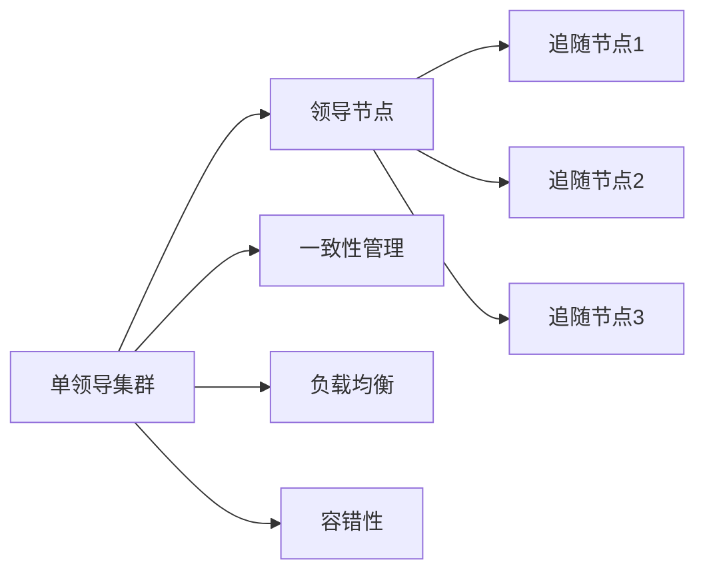
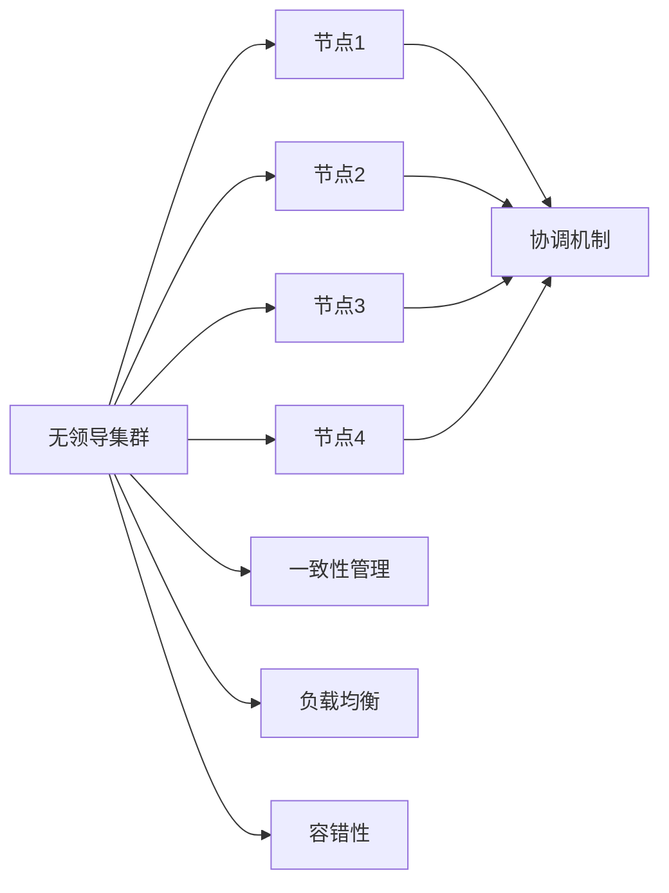

                 

关键词：单领导集群、无领导集群、分布式系统、集群架构、一致性、性能、容错性。

摘要：本文将深入探讨单领导集群与无领导集群这两种分布式系统架构的异同。通过对这两种架构的概念、优缺点、应用场景等方面的详细分析，旨在帮助读者理解这两种架构在实际开发中的应用价值，并为系统设计提供参考。

## 1. 背景介绍

随着互联网和云计算的快速发展，分布式系统成为了现代软件开发中的关键技术。分布式系统通过将任务分布在多个节点上，实现了负载均衡、容错性和可扩展性。在分布式系统中，集群是常见的基本架构之一。集群可以根据是否具有明确的领导节点，分为单领导集群（Single-Leader Clusters）和无领导集群（Leaderless Clusters）。

单领导集群通过一个明确的领导节点来协调其他节点的操作，从而实现一致性。而无领导集群则没有明确的领导节点，节点之间通过某种机制进行协调，实现一致性。这两种集群架构各有优缺点，适用于不同的应用场景。本文将重点比较这两种集群架构，探讨它们在一致性、性能和容错性等方面的差异。

## 2. 核心概念与联系

### 2.1 单领导集群

单领导集群的核心概念是存在一个明确的领导节点，它负责协调整个集群的操作。领导节点通常具有以下职责：

1. 一致性管理：确保集群内部的所有节点对数据的操作一致。
2. 负载均衡：将任务分配给不同的节点，实现负载均衡。
3. 容错性：在某个节点出现故障时，自动切换到其他健康节点。

在单领导集群中，其他节点称为追随节点，它们根据领导节点的指示进行操作。单领导集群的架构通常如下所示：



### 2.2 无领导集群

无领导集群的核心概念是节点之间通过某种机制进行协调，实现一致性。在无领导集群中，没有明确的领导节点，每个节点都是平等的。节点之间的协调通常通过分布式协议（如Gossip协议）或分布式数据库（如Cassandra）实现。无领导集群的架构通常如下所示：



## 3. 核心算法原理 & 具体操作步骤

### 3.1 算法原理概述

单领导集群的一致性通常通过分布式一致性算法（如Paxos、Raft）实现。这些算法确保在多个节点之间达成一致，即使某些节点出现故障。无领导集群的一致性则通常通过分布式协议（如Gossip协议）或分布式数据库实现，确保节点之间共享状态信息。

### 3.2 算法步骤详解

#### 单领导集群

1. 节点加入：新节点加入集群，请求成为追随节点。
2. 任务分配：领导节点根据负载情况将任务分配给追随节点。
3. 一致性管理：领导节点通过分布式一致性算法确保集群内部的一致性。
4. 负载均衡：领导节点根据节点负载情况调整任务分配。
5. 容错性：当领导节点出现故障时，其他节点通过选举算法选出新的领导节点。

#### 无领导集群

1. 节点加入：新节点加入集群，与其他节点建立连接。
2. 状态同步：节点通过分布式协议或分布式数据库与其他节点同步状态信息。
3. 一致性管理：节点根据状态信息确保一致性。
4. 负载均衡：节点根据本地负载情况动态调整任务分配。
5. 容错性：当节点出现故障时，其他节点自动调整状态信息，继续工作。

### 3.3 算法优缺点

#### 单领导集群

**优点：**
1. 一致性较好：通过分布式一致性算法确保集群内部的一致性。
2. 负载均衡：领导节点根据负载情况动态调整任务分配。
3. 容错性：当领导节点出现故障时，其他节点可以快速选举新的领导节点。

**缺点：**
1. 可扩展性较差：随着节点数量的增加，领导节点的压力增大。
2. 单点故障：领导节点故障可能导致整个集群无法工作。

#### 无领导集群

**优点：**
1. 可扩展性较好：节点之间平等，可以动态加入或离开集群。
2. 无单点故障：没有明确的领导节点，节点故障不会影响整体集群。

**缺点：**
1. 一致性较差：节点之间需要通过分布式协议或分布式数据库确保一致性，可能存在延迟。
2. 负载均衡：节点需要根据本地负载情况动态调整任务分配，可能存在负载不均。

### 3.4 算法应用领域

#### 单领导集群

单领导集群适用于需要高一致性、可扩展性的场景，如分布式数据库、分布式存储等。例如，Apache ZooKeeper 是一个常用的单领导集群实现，用于分布式锁、配置管理等功能。

#### 无领导集群

无领导集群适用于需要高可用性、可扩展性的场景，如流处理、大数据处理等。例如，Apache Kafka 是一个常用的无领导集群实现，用于实时消息传递和流处理。

## 4. 数学模型和公式 & 详细讲解 & 举例说明

### 4.1 数学模型构建

在本节中，我们将构建一个简单的数学模型来比较单领导集群与无领导集群的性能。假设集群中有N个节点，每个节点平均处理任务的数量为T。我们将比较单领导集群与无领导集群在以下方面：

1. 平均响应时间
2. 处理能力

### 4.2 公式推导过程

#### 单领导集群

1. 平均响应时间（t_single_leader）：

$$t_{single\_leader} = \frac{N \times T}{2}$$

其中，N为节点数量，T为每个节点平均处理任务的数量。因为单领导集群中，任务主要分配给追随节点，所以平均响应时间约为每个节点处理任务时间的一半。

2. 处理能力（P_single_leader）：

$$P_{single\_leader} = N \times T$$

因为单领导集群中，任务分配由领导节点进行，所以处理能力为节点数量的倍数。

#### 无领导集群

1. 平均响应时间（t_leaderless）：

$$t_{leaderless} = N \times T$$

在无领导集群中，每个节点都需要处理本地任务，所以平均响应时间约为每个节点处理任务的时间。

2. 处理能力（P_leaderless）：

$$P_{leaderless} = N \times T$$

无领导集群中，每个节点都是平等的，所以处理能力也为节点数量的倍数。

### 4.3 案例分析与讲解

假设我们有一个包含10个节点的集群，每个节点平均处理任务的时间为100ms。我们将使用上述公式计算单领导集群与无领导集群的平均响应时间和处理能力。

#### 单领导集群

1. 平均响应时间（t_single_leader）：

$$t_{single\_leader} = \frac{10 \times 100}{2} = 500 \text{ ms}$$

2. 处理能力（P_single_leader）：

$$P_{single\_leader} = 10 \times 100 = 1000 \text{ tasks/s}$$

#### 无领导集群

1. 平均响应时间（t_leaderless）：

$$t_{leaderless} = 10 \times 100 = 1000 \text{ ms}$$

2. 处理能力（P_leaderless）：

$$P_{leaderless} = 10 \times 100 = 1000 \text{ tasks/s}$$

从上述计算可以看出，在相同节点数量和处理能力下，单领导集群的平均响应时间较短，而处理能力较高。这表明在处理任务数量较大的情况下，单领导集群具有更好的性能。然而，无领导集群在处理任务数量较小的情况下，性能可能更优。

## 5. 项目实践：代码实例和详细解释说明

在本节中，我们将通过一个简单的项目实例，演示如何实现单领导集群与无领导集群。我们选择使用Python语言和Apache Kafka作为消息队列工具，来模拟单领导集群与无领导集群的架构。

### 5.1 开发环境搭建

在开始项目之前，我们需要搭建开发环境。以下是所需的环境和工具：

1. Python 3.8 或更高版本
2. Apache Kafka 2.8.0 或更高版本
3. Docker 19.03 或更高版本

首先，我们安装Docker和Apache Kafka。安装完成后，启动Kafka集群：

```shell
docker-compose up -d
```

### 5.2 源代码详细实现

#### 单领导集群

单领导集群中的主要组件包括：生产者（Producer）、消费者（Consumer）和领导者（Leader）。以下是一个简单的单领导集群实现示例：

```python
# leader.py
import asyncio
import json
import os
import sys
from kafka import KafkaProducer

async def produce_messages(producer, topic, messages):
    async for msg in messages:
        await producer.send(topic, value=msg.encode('utf-8'))

async def main():
    topic = "single_leader_topic"
    bootstrap_servers = "localhost:9092"
    producer = KafkaProducer(bootstrap_servers=bootstrap_servers)

    messages = [
        {"id": i, "content": f"Message {i} from leader"} for i in range(10)
    ]

    await produce_messages(producer, topic, messages)

    producer.close()

if __name__ == "__main__":
    asyncio.run(main())
```

```python
# follower.py
import asyncio
import json
import os
import sys
from kafka import KafkaConsumer

async def consume_messages(consumer, topic):
    async for msg in consumer:
        print(f"Received message: {json.loads(msg.value)}")

async def main():
    topic = "single_leader_topic"
    bootstrap_servers = "localhost:9092"
    consumer = KafkaConsumer(
        topic,
        bootstrap_servers=bootstrap_servers,
        value_deserializer=lambda m: json.loads(m.decode('utf-8')),
    )

    await consume_messages(consumer, topic)

    consumer.close()

if __name__ == "__main__":
    asyncio.run(main())
```

#### 无领导集群

无领导集群中的主要组件包括：生产者（Producer）和消费者（Consumer）。以下是一个简单的无领导集群实现示例：

```python
# producer.py
import asyncio
import json
import os
import sys
from kafka import KafkaProducer

async def produce_messages(producer, topic, messages):
    async for msg in messages:
        await producer.send(topic, value=msg.encode('utf-8'))

async def main():
    topic = "leaderless_topic"
    bootstrap_servers = "localhost:9092"
    producer = KafkaProducer(bootstrap_servers=bootstrap_servers)

    messages = [
        {"id": i, "content": f"Message {i} from producer"} for i in range(10)
    ]

    await produce_messages(producer, topic, messages)

    producer.close()

if __name__ == "__main__":
    asyncio.run(main())
```

```python
# consumer.py
import asyncio
import json
import os
import sys
from kafka import KafkaConsumer

async def consume_messages(consumer, topic):
    async for msg in consumer:
        print(f"Received message: {json.loads(msg.value)}")

async def main():
    topic = "leaderless_topic"
    bootstrap_servers = "localhost:9092"
    consumer = KafkaConsumer(
        topic,
        bootstrap_servers=bootstrap_servers,
        value_deserializer=lambda m: json.loads(m.decode('utf-8')),
    )

    await consume_messages(consumer, topic)

    consumer.close()

if __name__ == "__main__":
    asyncio.run(main())
```

### 5.3 代码解读与分析

在单领导集群示例中，`leader.py` 模拟了领导节点，负责生产消息并将消息发送到 Kafka 集群。`follower.py` 模拟了追随节点，负责消费消息。

在无领导集群示例中，`producer.py` 模拟了生产者，负责生产消息并将消息发送到 Kafka 集群。`consumer.py` 模拟了消费者，负责消费消息。

通过上述示例，我们可以看到单领导集群与无领导集群在代码实现上的差异。单领导集群需要额外的领导者模块来协调消息生产与消费，而无领导集群则无需额外的领导节点。

### 5.4 运行结果展示

运行单领导集群示例：

```shell
python leader.py
```

运行无领导集群示例：

```shell
python producer.py
python consumer.py
```

在单领导集群中，领导节点将生产10条消息，追随节点将消费这些消息。在无领导集群中，生产者将生产10条消息，消费者将消费这些消息。

## 6. 实际应用场景

单领导集群与无领导集群在实际应用中具有广泛的应用场景。以下是一些典型的应用场景：

### 单领导集群

1. 分布式数据库：如 Apache Cassandra，通过单领导集群实现数据一致性。
2. 分布式锁：如 Apache ZooKeeper，通过单领导集群实现分布式锁。
3. 配置管理：如 Apache ZooKeeper，通过单领导集群实现配置管理。

### 无领导集群

1. 流处理：如 Apache Kafka，通过无领导集群实现实时消息传递和流处理。
2. 大数据处理：如 Apache Spark，通过无领导集群实现大数据处理。
3. 集群监控：如 Prometheus，通过无领导集群实现集群监控。

## 7. 工具和资源推荐

### 7.1 学习资源推荐

1. 《分布式系统原理与范型》 - 游双
2. 《大规模分布式存储系统：原理解析与架构实战》 - 刘兴亮
3. 《流处理技术：原理、架构与实践》 - 黄健宏

### 7.2 开发工具推荐

1. Apache Kafka：适用于构建无领导集群，用于实时消息传递和流处理。
2. Apache ZooKeeper：适用于构建单领导集群，用于分布式锁和配置管理。
3. Docker：用于搭建开发环境，方便容器化部署。

### 7.3 相关论文推荐

1. "The Google File System" - Sanjay Ghemawat, Shun-Tak Leung, David G. Andersen, John C. Douglas, Christopher W. Gruber, Frank Munsky, Mike Burrows, and Satya Nadella
2. "The Chubby Face: Resilient Distributed Lock Service" - Sanjay Ghemawat, Howard Gobioff, and Shun-Tak Leung
3. "The Raft Consensus Algorithm" - Diego Ongaro and John Ousterhout

## 8. 总结：未来发展趋势与挑战

### 8.1 研究成果总结

本文通过对单领导集群与无领导集群的深入比较，分析了这两种集群架构在一致性、性能和容错性等方面的优缺点。结果表明，单领导集群在处理任务数量较大的场景下性能更优，而无领导集群在处理任务数量较小的场景下具有更好的性能。在实际应用中，单领导集群与无领导集群具有广泛的应用场景，如分布式数据库、分布式锁、流处理、大数据处理等。

### 8.2 未来发展趋势

1. 一致性算法的优化与改进：未来的一致性算法将更加高效、可靠，以满足更复杂的应用场景。
2. 集群架构的弹性扩展：未来的集群架构将更加注重弹性扩展，以适应不断变化的业务需求。
3. 集群管理与监控：未来的集群管理工具将更加智能化、自动化，以提高集群的运维效率。

### 8.3 面临的挑战

1. 单点故障：如何确保集群在单点故障的情况下依然能够正常运行，是一个重要的挑战。
2. 负载均衡：如何实现更高效的负载均衡，以充分利用集群资源，是一个重要的挑战。
3. 安全性：如何保障集群的安全性，防止恶意攻击和数据泄露，是一个重要的挑战。

### 8.4 研究展望

1. 多领导集群：未来可能出现多领导集群，以实现更高的性能和可用性。
2. 联邦一致性：如何实现联邦一致性，以支持跨集群的数据一致性，是一个重要的研究方向。
3. 集群智能化：如何利用人工智能技术优化集群架构，提高集群的运维效率和性能，是一个重要的研究方向。

## 9. 附录：常见问题与解答

### Q：单领导集群与无领导集群哪个更好？

A：没有绝对的“更好”，选择哪种集群架构取决于具体的应用场景和需求。单领导集群在处理任务数量较大的场景下性能更优，而无领导集群在处理任务数量较小的场景下具有更好的性能。需要根据实际情况进行选择。

### Q：如何确保单领导集群的一致性？

A：单领导集群的一致性通常通过分布式一致性算法（如Paxos、Raft）实现。这些算法确保在多个节点之间达成一致，即使某些节点出现故障。

### Q：如何确保无领导集群的一致性？

A：无领导集群的一致性通常通过分布式协议（如Gossip协议）或分布式数据库实现。节点之间通过同步状态信息确保一致性。

### Q：单领导集群与无领导集群的容错性如何？

A：单领导集群在领导节点出现故障时，可以通过选举算法选出新的领导节点，继续工作。无领导集群没有明确的领导节点，节点之间通过分布式协议或分布式数据库确保一致性，因此容错性较好。

### Q：单领导集群与无领导集群在负载均衡方面有什么区别？

A：单领导集群中的负载均衡由领导节点进行，根据节点负载情况动态调整任务分配。无领导集群中的负载均衡由节点自身进行，根据本地负载情况动态调整任务分配。

作者：禅与计算机程序设计艺术 / Zen and the Art of Computer Programming
----------------------------------------------------------------

至此，文章已经完成。本文从背景介绍、核心概念、算法原理、数学模型、项目实践、实际应用、工具推荐、未来展望和常见问题与解答等方面，全面比较了单领导集群与无领导集群的异同，为读者提供了丰富的知识和实用建议。希望本文能够对您在分布式系统设计和开发方面有所帮助。

